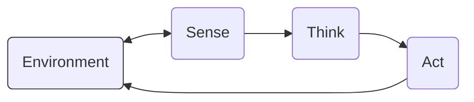

# Class 1: What Is a Robot?

## Where We Are in the Robotics Journey
Welcome to Day 1. There is no previous class—this is the true beginning. You’ll meet our recurring robot, RoboRover, and we’ll build a mental model that will carry through the course.

- Today: What makes a machine a robot, and what “autonomy” actually means.
- Next class: We’ll unpack the core loop all robots share: Sense → Think → Act.
- Big picture: We’ll progress from concepts and simple simulations to building and controlling real robots with code, math, and engineering judgment.

## Today We Will Learn
- The difference between a machine and a robot.
- What autonomy is (and what it is not).
- Open-loop vs. closed-loop behavior and why feedback is foundational.
- How a robot and its environment influence each other.
- How to reason about robots with simple math and a tiny simulation.
- How RoboRover navigates a small world in Python.

## 2-Minute Recap
- You already know many machines: bicycles, toasters, elevators.
- A robot is a machine that uses sensors to perceive, computes to decide, and actuators to affect the world—without being micromanaged every moment.
- Open-loop means “act without feedback” (e.g., a kitchen timer’s bell). Closed-loop means “use feedback to adjust” (e.g., a thermostat). Autonomy uses closed-loop feedback to pursue goals.
- The environment pushes back (friction, obstacles, noise); a robot must handle that.
- We’ll practice these ideas with a minimal grid-world and our fictional robot, RoboRover.

## The Big Idea
A robot is a goal-directed machine that senses, thinks, and acts in the physical world with some autonomy.

- Machine (plain): does work when commanded (e.g., a blender).
- Robot (machine + autonomy): can choose some actions on its own from sensor input and goals (e.g., a vacuum that changes direction when it detects a wall).

Autonomy vs. automation (naming varies by community):
- Automation is often closed-loop (it senses and reacts), like thermostats, elevators, or adaptive traffic lights. In most robotics courses and many standards contexts (e.g., ISO/IEC terminology), these are categorized as automated control systems rather than robots because they are fixed installations with narrow task scope.
- Autonomy emphasizes embodied agency—sensing, computation, and actuation—pursuing goals in a changing physical environment.
- Fuzzy boundary (useful counterexample): a sophisticated CNC or pick-and-place machine senses parts, plans trajectories, and moves its arm. Some teams call it a robot; others call it factory automation. Our emphasis will be on embodied, goal-directed agents interacting with varied environments.

Think of autonomy like cruise control versus a brick under the pedal. Cruise control senses speed and adjusts throttle—some independence. Full self-driving would be more autonomy. Robots span this spectrum.

## See It in Your Head
Picture an overhead view:
- A small, puck-sized RoboRover with two wheels and a front distance sensor (like a flashlight that “feels” distance).
- A room as a grid: some cells are empty floor, some are obstacles (chairs, boxes), and one is the goal flag.
- Arrows around RoboRover:
  - Blue arrows from the environment to RoboRover labeled “Sense” (distance, bump, battery).
  - Orange gears inside RoboRover labeled “Think” (simple rules or planning).
  - Red arrows from RoboRover to wheels labeled “Act”.
- A loop arrow showing this repeats many times per second.

Mermaid diagram of the loop (if your platform supports Mermaid):


ASCII fallback (use this if Mermaid does not render):
```
+--------------+       +--------+       +--------+       +--------------+
| Environment  | <---> | Sense  | --->  | Think  | --->  |    Act       |
+--------------+       +--------+       +--------+       +--------------+
       ^                                                           |
       +-----------------------------------------------------------+
                       (closes the loop back to Environment)
```
Caption: Think can be simple rules or planning. The loop rate (Hz) sets an effective reaction delay τ that affects safety margins and stopping distance.

## Core Concept
- Robot: A physical machine that can sense its environment, compute decisions, and act on the environment with some autonomy.
- Autonomy: The ability to choose actions without constant direct control, based on goals and sensor input. Not the same as omniscience or perfection.
- Machine: A device that transforms energy to do useful work. All robots are machines; not all machines are robots.
- Environment: Everything outside the robot that can affect it or be affected by it—air, floor, obstacles, lighting, friction, people.
- Closed-loop vs. open-loop: Closed-loop uses feedback (sensor measurements) to continually adjust actions; open-loop executes a pre-set command without feedback. Autonomy relies on closed-loop control.

Clarifying the taxonomy:
- Mobility is not required. A stationary industrial manipulator (robot arm) that senses part location and plans motions to pick-and-place parts is a robot. A common example is a “bin-picking robot arm” used in warehouses.
- Elevator and adaptive traffic light: both are closed-loop and automated (they sense and react), but in most robotics curricula and many standards contexts (e.g., ISO/IEC terminology) these are categorized as automated control systems rather than robots, because they are fixed installations doing narrowly defined workflows without general-purpose agent-like manipulation or locomotion. Gray areas sharpen your definition.
- Robot vacuum: yes—senses walls and dirt, plans or reacts locally, and moves itself around a changing environment.

## Math Without Fear
We’ll use simple, unit-aware equations to reason about robots. Three core relationships show up everywhere:

1) Reaction distance (latency matters)
- d_react = v × τ
  - d_react: distance traveled during reaction (before any change in command can take effect), in meters (m).
  - v: robot speed, in meters per second (m/s).
  - τ: sensing-to-decision-to-command latency (reaction delay), in seconds (s).
- If the actuators also need extra time before deceleration begins (e.g., friction clutches, motor ramp-up), add actuation delay τ_act:
  - d_delay_act = v × τ_act

2) Full stopping distance (separate delay from deceleration)
Once braking actually starts, constant deceleration with magnitude a (m/s²) adds:
- d_decel = v² / (2a)

Total stopping distance after noticing an obstacle:
- d_stop = v × (τ + τ_act) + v² / (2a)

Assumptions and caveats:
- Take a as a positive magnitude (how hard you can brake). The constant-a model is an approximation; a changes with load transfer, surface (tile vs. carpet), slope, and battery voltage. Lower a increases d_decel and therefore d_stop. In real robots, braking may be torque-limited and speed-dependent a(v); jerk-limited profiles or PID-based braking change details and can slightly increase stopping distance versus the constant-a ideal.

3) Range and runtime (energy matters)
- t_run = E / P
  - t_run: runtime, in seconds (s).
  - E: usable energy, in joules (J).
  - P: average power draw, in watts (W = J/s).
- d_range = v × t_run
  - d_range: maximum travel distance, in meters (m).

Note: 1 watt-hour (Wh) = 3600 joules (J).

Intuition:
- Higher speed increases reaction distance; you need more space to adapt.
- “Delay distance” (from τ and τ_act) happens before any braking can help.
- Limited deceleration adds more stopping distance; slippery floors effectively reduce a and increase d_stop.
- Higher power drain shortens runtime; energy translates to travel only after you account for efficiency and terrain.

## Worked Robotics Example
RoboRover’s first safety check: “If I’m moving toward a wall, how much space do I need to avoid bonking it?”

Given:
- Speed v = 0.40 m/s
- Sensing/decision latency τ = 0.20 s
- Actuation response delay τ_act = 0.15 s (wheels don’t produce deceleration instantly)
- Achievable braking deceleration magnitude a = 1.0 m/s² (lower on dusty floors)

We compute:
- Reaction distance d_react = v × τ = 0.40 m/s × 0.20 s = 0.080 m = 8.0 cm
- Additional actuation-delay distance d_delay_act = v × τ_act = 0.40 m/s × 0.15 s = 0.060 m = 6.0 cm
- Deceleration distance after braking begins (constant-a model):
  - d_decel = v² / (2a) = (0.40 m/s)² / (2 × 1.0 m/s²) = 0.160 / 2 = 0.080 m = 8.0 cm
- Total stopping distance after noticing the wall:
  - d_stop = d_react + d_delay_act + d_decel = 0.080 + 0.060 + 0.080 = 0.220 m = 22.0 cm

Interpretation:
- If RoboRover only notices the wall at 22 cm, it may still bump it. Set the minimum detection distance larger, e.g., 30 cm, to leave a margin for sensor noise, slopes, and reduced traction.

Why early detection matters (FOV and latency compounding):
- If the wall first appears at an angle near the edge of a narrow field-of-view, the robot may not see it until it is closer along its travel path. Add to that the processing latency (τ) and actuation delay (τ_act), and the effective detection-to-stop distance shrinks further. Wider FOV, higher update rate, and earlier obstacle detection reduce risk.

Engineering caveat:
- Real wheels can slip; braking distance can be longer on dusty floors (smaller a → larger d_decel).
- Sensor readings jitter; a single noisy reading should not trigger panic or you’ll get “stop–start” behavior.
- If your controller uses jerk-limited braking (smoothly ramping deceleration), expect slightly longer stopping distance than the constant-a estimate. In some systems, braking deceleration is speed-dependent a(v) due to torque and friction limits—modeling that comes later in the course.

Predict before you compute:
- Without calculating, what distance did you think would be needed at 0.4 m/s? Check your intuition against 22 cm.

Practice sensitivity:
- Recompute d_stop if braking is weaker, a = 0.6 m/s². How much larger is the stopping distance? How would you change speed or sensing range to keep the same safety margin?

Bonus energy check:
- Battery energy E = 18 Wh → E = 18 × 3600 = 64,800 J
- Average power P = 10 W
- Runtime t_run = E / P = 64,800 J / (10 J/s) = 6,480 s ≈ 1.8 hours
- At v = 0.5 m/s, range d_range = 0.5 × 6,480 = 3,240 m ≈ 3.24 km
Reality check: This is an upper bound; drivetrain losses, sensor power, turning, and carpets reduce it.

## Python Lab
We’ll build a tiny world for RoboRover: a 10×10 grid with obstacles and a goal. RoboRover can move manually (you command with WASD) or with simple autonomy (move toward goal; if blocked, try a sidestep).

Before you run:
- Install matplotlib (once): pip install matplotlib
- Headless/CI use: set an environment variable HEADLESS=true (also accepts 1/yes/on) to render without windows. Frames will be saved as PNGs.
- Reproducibility: set SEED via CLI or environment (examples below) to reproduce the same obstacle field and placements.
- Manual mode: keyboard-only; press q to exit. In non-interactive runs (CI), the script defaults to autonomy to avoid blocking.
- Accessibility: enable HIGH_CONTRAST=true for larger markers and stronger contrast. All overlays use distinct shapes.
- Timing bridge: we define LOOP_DT (seconds per control loop) and CELL_SIZE_M so the reaction-delay demo can be related quantitatively to d_react = v × τ. The script prints the implied grid speed v_grid = CELL_SIZE_M / LOOP_DT for unit checking.

Sense–Think–Act in code (foreshadowing next class):
- sense(): what’s around me and where’s the goal? (Today this is “perfect sensing.” Next time we’ll inject noise here.)
- think(state): which move should I try first (and what are my fallbacks)? Uses the sensed state to compute candidates in a deterministic order.
- act(): try the intended move; optionally fall back; record bumps and progress.

Predict before you run it:
- With 15% obstacles, do you think simple autonomy will reach the goal in under 80 steps? Make a guess.

Run this complete Python 3.7 program:

```python
# RoboRover Grid World: Manual vs Simple Autonomy (Sense–Think–Act)
# Python 3.7 compatible. Requires matplotlib (which pulls in NumPy).
# Teaches: robot vs environment, autonomy as decision-making, sensing/acting loop.
# Accessibility: legend, markers, larger labels; window title shows steps/bumps; path overlay.
# Notes:
# - Closed-loop: we sense each step, make a decision, and act based on feedback.
# - Perfect sensing here: see sense(). We'll show where to add noise in the next class.
# - Non-interactive runs default to autonomy; press 'q' in manual mode to exit.

import os
import sys
import time
import random
import numpy as np

# ---- Environment variable helpers ----
def _env_int(name, default):
    try:
        txt = os.environ.get(name, "")
        return int(txt.strip()) if txt.strip() != "" else default
    except Exception:
        return default

def _env_bool(name, default=False):
    txt = os.environ.get(name, "")
    if not txt:
        return default
    v = txt.strip().lower()
    if v in ("1", "true", "t", "yes", "y", "on"):
        return True
    if v in ("0", "false", "f", "no", "n", "off"):
        return False
    return default

# ---- Matplotlib backend (headless support) ----
import matplotlib
HEADLESS = _env_bool("HEADLESS", False)
if HEADLESS:
    matplotlib.use("Agg")  # no windows; render to files
import matplotlib.pyplot as plt

# ----- Parameters -----
GRID_SIZE = 10
OBSTACLE_DENSITY = 0.15  # 15% of cells are obstacles

# Timing bridge (maps grid steps to real seconds; used for reaction-delay demo)
CELL_SIZE_M = 0.10      # interpret each cell as 10 cm (adjust to taste)
LOOP_DT = 0.10          # control loop runs every 0.10 s (10 Hz)
NOMINAL_SPEED_MPS = 0.40  # nominal speed for discussion; predictions use v_grid for consistency

# Reproducibility: SEED can be set via env SEED or CLI --seed N
SEED = _env_int("SEED", 42)
STEP_LIMIT = 200

# Optional: small delay in manual mode to accommodate OS key-repeat quirks (in ms)
KEY_REPEAT_DELAY_MS = _env_int("KEY_REPEAT_DELAY_MS", 0)
KEY_REPEAT_DELAY_S = KEY_REPEAT_DELAY_MS / 1000.0

# Connectivity: regenerate rooms until start/goal are connected (helps at high density)
REGENERATE_IF_UNSOLVABLE = True
REGENERATE_LIMIT = 200

# Axis origin for imshow: 'upper' => rows increase downward (image-style), 'lower' => y-up (math-style)
ORIGIN = 'upper'

# Bump-handling: count a bump when the first intended move is blocked.
# If True, after counting that bump, try fallbacks in the same step.
TRY_FALLBACK_ON_BUMP = True

# Optional latency demo: when a stop or direction change is decided, keep executing
# the last command for k steps (reaction "distance" in cells).
REACTION_DELAY_STEPS = 0  # set to 1–3 to see the effect

# Accessibility toggle: increase contrast and marker sizes for CVD
HIGH_CONTRAST = _env_bool("HIGH_CONTRAST", False)

# Headless frame saving (auto-enabled if HEADLESS is set)
SAVE_FRAMES = HEADLESS
FRAMES_DIR = "frames"

# ----- Cell codes -----
EMPTY = 0
OBSTACLE = 1
ROBOT = 2
GOAL = 3

# Movement map for manual mode (row, col deltas)
MOVES = {
    'w': (-1, 0),  # up (row decreases)
    's': (1, 0),   # down
    'a': (0, -1),  # left (col decreases)
    'd': (0, 1),   # right
}

# Global frame counter for saved images
FRAME_IDX = 0


def make_grid(n, density, rng):
    """Return an n×n grid with obstacles placed using rng."""
    grid = [[EMPTY for _ in range(n)] for _ in range(n)]
    for r in range(n):
        for c in range(n):
            if rng.random() < density:
                grid[r][c] = OBSTACLE
    return grid


def in_bounds(grid, r, c):
    n = len(grid)
    return 0 <= r < n and 0 <= c < n


def is_free_value(v):
    return v in (EMPTY, GOAL)


def is_free(grid, r, c):
    return in_bounds(grid, r, c) and is_free_value(grid[r][c])


def sample_empty_cell(grid, rng):
    """Pick a random empty cell using the provided rng."""
    n = len(grid)
    empties = [(r, c) for r in range(n) for c in range(n) if grid[r][c] == EMPTY]
    if not empties:
        raise RuntimeError("No empty cell available to place robot/goal.")
    return rng.choice(empties)


def place_robot_and_goal(grid, rng):
    """Place robot and goal in distinct empty cells using the provided rng (reproducible)."""
    rr, rc = sample_empty_cell(grid, rng)
    gr, gc = sample_empty_cell(grid, rng)
    attempts = 0
    while (gr, gc) == (rr, rc):
        gr, gc = sample_empty_cell(grid, rng)
        attempts += 1
        if attempts > 1000:
            raise RuntimeError("Failed to place distinct robot and goal after many attempts.")
    grid[rr][rc] = ROBOT
    grid[gr][gc] = GOAL
    return rr, rc, gr, gc


def is_solvable(grid, start, goal):
    """BFS to check if start->goal path exists over non-obstacle cells."""
    n = len(grid)
    (sr, sc), (gr, gc) = start, goal
    from collections import deque
    dq = deque()
    dq.append((sr, sc))
    seen = {(sr, sc)}
    while dq:
        r, c = dq.popleft()
        if (r, c) == (gr, gc):
            return True
        for dr, dc in [(-1,0), (1,0), (0,-1), (0,1)]:
            nr, nc = r+dr, c+dc
            if 0 <= nr < n and 0 <= nc < n and (nr, nc) not in seen:
                # Treat GOAL and ROBOT as traversable; only obstacles block
                if grid[nr][nc] != OBSTACLE:
                    seen.add((nr, nc))
                    dq.append((nr, nc))
    return False


def find_cell(grid, value):
    n = len(grid)
    for r in range(n):
        for c in range(n):
            if grid[r][c] == value:
                return r, c
    return None


def _set_window_title(fig, text):
    mgr = getattr(fig.canvas, "manager", None)
    if mgr and hasattr(mgr, "set_window_title"):
        try:
            mgr.set_window_title(text)
        except Exception:
            pass  # some backends do not support setting the window title


def draw_grid(grid, title="", pause=0.1, path_points=None):
    """
    Draw the grid using imshow for background and overlays for accessibility:
      - Robot: square outline
      - Goal: star outline
      - Obstacles: black cells + yellow 'x' markers (non-color encoding)
      - Path: dashed gray line (thicker for visibility)
      - Legend note: 'Frame: rows↓, cols→' clarifies the axis convention.

    Coordinate convention:
      - Rows increase downward, columns to the right (origin='upper').
      - Change ORIGIN to 'lower' at the top for math-style axes (y up).
    """
    global FRAME_IDX
    n = len(grid)

    # Color map (cell fills)
    if HIGH_CONTRAST:
        color_map = {
            EMPTY: (1.0, 1.0, 1.0),
            OBSTACLE: (0.0, 0.0, 0.0),
            ROBOT: (0.7, 0.0, 0.7),  # magenta-ish fill
            GOAL: (0.0, 0.5, 1.0),   # blue-ish fill
        }
        robot_edge = '#D81B60'  # strong magenta
        goal_edge = '#1E88E5'   # strong blue
        obs_marker_color = 'yellow'
        obs_marker_size = 40
        obs_line_width = 1.8
        path_style = {'color': 'gray', 'linewidth': 2.2, 'alpha': 0.95, 'linestyle': '--'}
    else:
        color_map = {
            EMPTY: (1.0, 1.0, 1.0),
            OBSTACLE: (0.0, 0.0, 0.0),
            ROBOT: (0.2, 0.4, 0.8),
            GOAL: (0.2, 0.8, 0.2),
        }
        robot_edge = 'blue'
        goal_edge = 'green'
        obs_marker_color = 'yellow'
        obs_marker_size = 36  # larger for visibility
        obs_line_width = 1.5
        path_style = {'color': 'gray', 'linewidth': 2.0, 'alpha': 0.9, 'linestyle': '--'}

    rgb = np.zeros((n, n, 3), dtype=float)
    for r in range(n):
        for c in range(n):
            rgb[r, c] = color_map[grid[r][c]]

    fig = plt.gcf()
    plt.clf()
    plt.imshow(rgb, interpolation='none', origin=ORIGIN)
    plt.title(title, fontsize=12)
    plt.xticks(range(n), fontsize=9)
    plt.yticks(range(n), fontsize=9)
    plt.xlabel("Column (left ➜ right)", fontsize=10)
    plt.ylabel("Row (top ➜ bottom)" if ORIGIN == 'upper' else "Row (bottom ➜ top)", fontsize=10)
    plt.grid(color='gray', linestyle=':', linewidth=0.5)

    # Positions
    robot_pos = find_cell(grid, ROBOT)
    goal_pos = find_cell(grid, GOAL)

    # Obstacles overlay: yellow 'x' markers for accessibility
    obs_rows, obs_cols = [], []
    for r in range(n):
        for c in range(n):
            if grid[r][c] == OBSTACLE:
                obs_rows.append(r)
                obs_cols.append(c)
    if obs_rows:
        plt.scatter(obs_cols, obs_rows, marker='x', c=obs_marker_color, s=obs_marker_size,
                    linewidths=obs_line_width, alpha=0.9)

    # Path overlay (dashed, thicker line)
    if path_points and len(path_points) > 1:
        xs = [c for (r, c) in path_points]
        ys = [r for (r, c) in path_points]
        plt.plot(xs, ys, label="Path", **path_style)

    # Robot and goal markers + legend (legend shown even with zero obstacles)
    handles, labels = [], []
    if robot_pos:
        rr, rc = robot_pos
        h1 = plt.scatter([rc], [rr], marker='s', s=140, c='none', edgecolors=robot_edge, linewidths=2.4)
        handles.append(h1); labels.append("Robot")
    if goal_pos:
        gr, gc = goal_pos
        h2 = plt.scatter([gc], [gr], marker='*', s=180, c='none', edgecolors=goal_edge, linewidths=2.4)
        handles.append(h2); labels.append("Goal")

    from matplotlib.lines import Line2D
    # Add obstacle legend handle (dummy marker if none present)
    h3 = Line2D([0], [0], marker='x', color=obs_marker_color, linestyle='None',
                markersize=max(6, int(obs_marker_size/6)), markeredgewidth=obs_line_width)
    handles.append(h3); labels.append("Obstacle (marker)")
    # Frame/axis note
    h4 = Line2D([0], [0], linestyle='None')
    handles.append(h4); labels.append("Frame: rows↓, cols→ (origin='{}')".format(ORIGIN))
    plt.legend(handles, labels, loc='upper right', fontsize=9, framealpha=0.85)

    if not HEADLESS:
        _set_window_title(fig, title)

    if SAVE_FRAMES:
        if FRAME_IDX == 0 and not os.path.isdir(FRAMES_DIR):
            os.makedirs(FRAMES_DIR, exist_ok=True)
        out = os.path.join(FRAMES_DIR, "frame_{:04d}.png".format(FRAME_IDX))
        plt.savefig(out, dpi=120, bbox_inches='tight')
        # Prevent memory growth across long headless runs
        plt.close(fig)
        globals()['FRAME_IDX'] += 1
    else:
        plt.pause(pause)


def sense(grid, rr, rc, gr, gc):
    """Return local perception: positions and free moves in cardinal directions.
    Note: This is 'perfect sensing' in our gridworld. To inject noise next class,
    you could randomly flip a 'free' reading with a small probability here."""
    return {
        "pos": (rr, rc),
        "goal": (gr, gc),
        "free": {
            'up': is_free(grid, rr - 1, rc),
            'down': is_free(grid, rr + 1, rc),
            'left': is_free(grid, rr, rc - 1),
            'right': is_free(grid, rr, rc + 1),
        }
    }


def think(state):
    """
    Simple reflex planning based on sensed state:
      1) Greedily reduce row/col distance to goal (primary).
      2) If blocked, try perpendiculars in fixed order (sidesteps).
      3) If nothing works, stay.
    Returns an ordered list of candidate moves [(dr, dc), ...].

    We do not filter out blocked moves here so that a blocked first choice
    still counts as a "bump" in the metrics.

    Minimal unit test (candidate order):
    >>> st = {"pos": (0,0), "goal": (2,1)}
    >>> cands = think(st)
    >>> cands[:2]
    [(1, 0), (0, 1)]
    """
    rr, rc = state["pos"]
    gr, gc = state["goal"]

    candidates = []

    dr = 0
    dc = 0
    if rr < gr:
        dr = 1
    elif rr > gr:
        dr = -1
    if rc < gc:
        dc = 1
    elif rc > gc:
        dc = -1

    primary = []
    if dr != 0:
        primary.append((dr, 0))
    if dc != 0:
        primary.append((0, dc))

    sidesteps = [(-1, 0), (1, 0), (0, -1), (0, 1)]  # deterministic order

    for mv in primary + sidesteps + [(0, 0)]:
        candidates.append(mv)
    return candidates


def act(grid, rr, rc, candidates, allow_fallback):
    """
    Try candidates in order. Count a bump if the FIRST candidate is blocked.
    If allow_fallback is True, attempt the remaining candidates within the same step.
    Returns: (new_rr, new_rc, bumped, reached_goal, used_move)
    """
    if not candidates:
        return rr, rc, False, False, (0, 0)

    first = candidates[0]
    bumped = False

    # Helper to try a single move
    def try_one(move):
        nr, nc = rr + move[0], rc + move[1]
        if is_free(grid, nr, nc):
            reached = (grid[nr][nc] == GOAL)
            # move robot on the grid
            grid[rr][rc] = EMPTY
            grid[nr][nc] = ROBOT
            return nr, nc, reached, move
        return rr, rc, False, move  # blocked; no state change

    # Attempt the first move
    nr, nc, reached, used_move = try_one(first)
    if (nr, nc) == (rr, rc) and first != (0, 0):
        bumped = True  # first intended move blocked

        if allow_fallback:
            # Try remaining candidates until a free one is found (or none)
            for mv in candidates[1:]:
                nr2, nc2, reached2, used2 = try_one(mv)
                if (nr2, nc2) != (rr, rc):
                    return nr2, nc2, bumped, reached2, used2
            # No fallback worked; stay
            return rr, rc, bumped, False, first
        else:
            # Stay after bump
            return rr, rc, bumped, False, first
    else:
        # First move succeeded or was (0,0)
        return nr, nc, bumped, reached, used_move


def _safe_input(prompt, default=None):
    """Returns user input if stdin is interactive; otherwise returns default."""
    try:
        if sys.stdin is None or sys.stdin.closed or not sys.stdin.isatty():
            return default
        return input(prompt)
    except EOFError:
        return default


def _parse_cli_overrides():
    """
    CLI overrides:
      - Mode: 'm' or 'a' as first positional arg (optional)
      - --seed N or --seed=N to set SEED
    """
    mode = None
    seed = None
    argv = [a.strip() for a in sys.argv[1:]]
    # Positional mode
    if argv and argv[0].lower() in ("m", "a"):
        mode = argv[0].lower()
        argv = argv[1:]
    # --seed parsing
    i = 0
    while i < len(argv):
        tok = argv[i].lower()
        if tok.startswith("--seed="):
            try:
                seed = int(tok.split("=", 1)[1])
            except Exception:
                pass
            i += 1
            continue
        if tok == "--seed" and i + 1 < len(argv):
            try:
                seed = int(argv[i + 1])
            except Exception:
                pass
            i += 2
            continue
        i += 1
    return mode, seed


def _run_sanity_tests():
    """Minimal unit checks: candidate order and BFS solvability."""
    # think() candidate order check (also in doctest)
    st = {"pos": (0, 0), "goal": (2, 1)}
    cands = think(st)
    assert cands[:2] == [(1, 0), (0, 1)], "think() primary order unexpected"

    # BFS solvability: empty 3x3 grid should be solvable from (0,0) to (2,2)
    g = [[EMPTY]*3 for _ in range(3)]
    g[0][0] = ROBOT; g[2][2] = GOAL
    assert is_solvable(g, (0,0), (2,2)), "BFS solvability failed on empty grid"

    # BFS unsolvable: block entire middle row
    g2 = [[EMPTY]*3 for _ in range(3)]
    g2[0][0] = ROBOT; g2[2][2] = GOAL
    g2[1][0] = OBSTACLE; g2[1][1] = OBSTACLE; g2[1][2] = OBSTACLE
    assert not is_solvable(g2, (0,0), (2,2)), "BFS should report unsolvable when cut by obstacles"


def run():
    global SEED
    print("RoboRover Grid World")
    print("Choose mode: (m)anual with WASD (press 'q' to quit), or (a)utonomy (greedy with sidestep).")

    # CLI override: python script.py a|m [--seed N]
    mode_cli, seed_cli = _parse_cli_overrides()
    if seed_cli is not None:
        SEED = int(seed_cli)

    mode = mode_cli
    # Interactive prompt; default to autonomy in non-interactive runs
    while mode not in ("m", "a"):
        mode = _safe_input("Enter m or a: ", default="a")
        if mode is None:
            mode = "a"
        mode = mode.strip().lower()

    # Generate a solvable room (optional but helpful)
    attempts = 0
    while True:
        rng = random.Random(SEED + attempts)  # reproducible obstacles + placements per attempt
        grid = make_grid(GRID_SIZE, OBSTACLE_DENSITY, rng)
        rr, rc, gr, gc = place_robot_and_goal(grid, rng)
        if not REGENERATE_IF_UNSOLVABLE or is_solvable(grid, (rr, rc), (gr, gc)):
            break
        attempts += 1
        if attempts >= REGENERATE_LIMIT:
            print("Warning: Could not guarantee solvable grid after {} tries. Proceeding anyway.".format(REGENERATE_LIMIT))
            break

    # Interactive vs headless rendering
    if HEADLESS:
        plt.ioff()
    else:
        plt.ion()
        plt.figure("RoboRover", figsize=(6, 6))

    steps = 0
    bumps = 0
    react_cells = 0  # cells moved during reaction-delay demo
    pending_stop_delay = 0
    enforced_move = None  # track the move being enforced during reaction delay
    last_action = (0, 0)  # heading proxy; previous command
    path_points = [(rr, rc)]

    # Units/speed bridge: compute implied grid speed
    assert LOOP_DT > 0.0 and CELL_SIZE_M > 0.0, "LOOP_DT and CELL_SIZE_M must be positive"
    v_grid = CELL_SIZE_M / LOOP_DT
    print("Units bridge: CELL_SIZE_M={:.3f} m, LOOP_DT={:.3f} s ⇒ v_grid≈{:.2f} m/s (implied)".format(
        CELL_SIZE_M, LOOP_DT, v_grid))
    if abs(NOMINAL_SPEED_MPS - v_grid) > 1e-9:
        print("Note: NOMINAL_SPEED_MPS={:.2f} m/s differs from v_grid. Open-loop predictions in this demo use v_grid for consistency.".format(
            NOMINAL_SPEED_MPS))

    title = "Start (RoboRover, goal, obstacles) | steps=0, bumps=0"
    draw_grid(grid, title=title, pause=0.1, path_points=path_points)

    # Simple invariants for regression safety
    assert STEP_LIMIT > 0, "STEP_LIMIT must be positive"
    assert GRID_SIZE >= 3, "Use GRID_SIZE >= 3 for meaningful movement"

    while steps < STEP_LIMIT:
        steps += 1

        # --- Sense ---
        st = sense(grid, rr, rc, gr, gc)

        # --- Think ---
        if mode == "m":
            cmd = ""
            while cmd not in ("w", "a", "s", "d", "q"):
                cmd = _safe_input("Move w/a/s/d (or q to quit): ", default="q")
                if cmd is None:
                    cmd = "q"
                cmd = cmd.strip().lower()
            if cmd == "q":
                print("Quitting.")
                break
            if KEY_REPEAT_DELAY_S > 0.0:
                time.sleep(KEY_REPEAT_DELAY_S)
            intended = [MOVES[cmd], (0, 0)]  # try commanded move, then stay
        else:
            intended = think(st)

        intended_first = intended[0] if intended else (0, 0)

        # --- Reaction-delay demo trigger ---
        # If enabled and no delay currently pending, enforce continuation of the last command
        # whenever the policy decides to stop or change direction suddenly.
        # We only enforce if the robot is currently "moving" (last_action != (0,0)).
        if REACTION_DELAY_STEPS > 0 and pending_stop_delay == 0:
            if last_action != (0, 0) and intended_first != last_action:
                pending_stop_delay = REACTION_DELAY_STEPS
                enforced_move = last_action  # remember exactly what to enforce

        # If a stop/change is pending due to latency demo, force the previous command
        if pending_stop_delay > 0:
            intended = [enforced_move]  # must keep doing what we were doing
            allow_fallback = False
        else:
            allow_fallback = TRY_FALLBACK_ON_BUMP

        # --- Act ---
        rr_new, rc_new, bumped, reached_goal, used_move = act(
            grid, rr, rc, intended, allow_fallback=allow_fallback
        )

        # Invariant: if enforcing reaction delay, the used move must equal enforced_move
        if pending_stop_delay > 0 and enforced_move is not None:
            assert used_move == enforced_move, "Enforced move changed unexpectedly during reaction delay"

        # Metrics and state updates
        if bumped:
            bumps += 1

        if (rr_new, rc_new) != (rr, rc):
            # Moved successfully
            path_points.append((rr_new, rc_new))
            if pending_stop_delay > 0:
                react_cells += 1  # count actual motion during enforced continuation
                pending_stop_delay -= 1
                if pending_stop_delay == 0:
                    enforced_move = None

            rr, rc = rr_new, rc_new
            last_action = used_move
        else:
            # Stayed in place
            if pending_stop_delay > 0:
                # Couldn't move, but delay still counts down (no react_cells increment)
                pending_stop_delay -= 1
                if pending_stop_delay == 0:
                    enforced_move = None
            last_action = used_move

        # Draw and maybe exit on goal
        if reached_goal:
            title = "Goal reached! steps={}, bumps={}, react_cells={}".format(steps, bumps, react_cells)
            draw_grid(grid, title=title, pause=0.1, path_points=path_points)
            # Map react_cells to time and meters for interpretation
            react_time_s = react_cells * LOOP_DT
            react_dist_m = react_cells * CELL_SIZE_M
            v_grid_local = CELL_SIZE_M / LOOP_DT
            predicted_m = v_grid_local * REACTION_DELAY_STEPS * LOOP_DT  # uses implied grid speed
            # Self-check: predicted_m should equal REACTION_DELAY_STEPS * CELL_SIZE_M exactly
            assert abs(predicted_m - (REACTION_DELAY_STEPS * CELL_SIZE_M)) < 1e-12

            print("RoboRover reached the goal in {} steps with {} bumps (reaction cells {}).".format(
                steps, bumps, react_cells))
            print("Units bridge: CELL_SIZE_M={:.3f} m, LOOP_DT={:.3f} s ⇒ v_grid≈{:.2f} m/s (implied)".format(
                CELL_SIZE_M, LOOP_DT, v_grid_local))
            if abs(NOMINAL_SPEED_MPS - v_grid_local) > 1e-9:
                print("Note: NOMINAL_SPEED_MPS={:.2f} m/s differs from v_grid. Predicted d_react uses v_grid.".format(
                    NOMINAL_SPEED_MPS))
            print("Reaction-delay mapping: {} cells ⇒ time ≈ {:.2f}s, distance ≈ {:.2f}m; open-loop prediction ≈ {:.2f}m at v_grid".format(
                react_cells, react_time_s, react_dist_m, predicted_m))
            print("Note: If the robot hits obstacles during enforced continuation, react_cells underestimates v×τ because real motion was blocked.")
            break
        else:
            title = "Step {} (mode={}) | steps={}, bumps={}, react_cells={}".format(
                steps, mode, steps, bumps, react_cells)
            draw_grid(grid, title=title, pause=0.05, path_points=path_points)

        # Safety invariant
        assert pending_stop_delay >= 0, "pending_stop_delay must not be negative"

    else:
        print("Step limit reached ({} steps).".format(STEP_LIMIT))
        draw_grid(grid, title="Step limit reached | steps={}, bumps={}, react_cells={}".format(
            steps, bumps, react_cells), pause=0.1, path_points=path_points)

    if not HEADLESS:
        print("Close the plot window to exit.")
        plt.ioff()
        plt.show()


if __name__ == "__main__":
    _run_sanity_tests()
    run()
```

What the important lines do:
- OBSTACLE_DENSITY controls environment difficulty. Increase it to make the world messier.
- REGENERATE_IF_UNSOLVABLE regenerates rooms until start and goal are connected by free cells (BFS). At very high densities, this may still fail after REGENERATE_LIMIT tries.
- ORIGIN selects the coordinate-frame convention. With origin='upper', rows increase downward (image-style). With origin='lower', y increases upward (math-style). The legend includes “Frame: rows↓, cols→” to reduce confusion and is always shown, even with zero obstacles.
- HIGH_CONTRAST toggles a higher-contrast palette and larger obstacle markers for accessibility (also settable via env HIGH_CONTRAST=true/1/yes). Overlays use distinct shapes even at small figure sizes.
- The loop is explicitly Sense → Think → Act:
  - sense() gathers local occupancy and positions (and returns a state dictionary). Today it is “perfect sensing.” Next class we will inject noise here.
  - think(state) proposes an ordered list of moves (policy) using only the sensed state. We intentionally do not filter blocked moves so the “bumps” metric reflects first-choice mistakes. A tiny doctest/assert verifies the candidate order.
  - act() attempts the first move; if it’s blocked, it counts a bump and, if configured, tries fallbacks in the same step. This makes the “bumps” metric informative even under autonomy.
- REACTION_DELAY_STEPS (optional) demonstrates latency. When the policy decides to stop or change direction relative to current motion, the robot must keep executing the previous command for k steps. The metric react_cells counts how many grid cells it actually moved during that enforced continuation—a grid analogue of d_react = v × τ. LOOP_DT and CELL_SIZE_M map those cells to seconds and meters. A helper print shows the implied grid speed v_grid = CELL_SIZE_M/LOOP_DT so you can compare against any nominal speed you’re assuming. Open-loop predicted distance uses v_grid for consistency with grid kinematics. Note: If the robot hits obstacles during enforced continuation, react_cells underestimates v×τ because real motion was blocked.
- Reproducibility: we use a local random.Random(seed) in both obstacle generation and placement, so sample_empty_cell() and make_grid() share the same seeded RNG. Set SEED via CLI (--seed N) or environment (SEED=123) to reproduce layouts. Example: python grid.py a --seed 7.
- Headless mode: set HEADLESS=true/1/yes to disable windows and save frames to frames/frame_####.png with matplotlib.use('Agg') automatically configured. In headless mode, draw_grid() closes figures after saving to prevent memory growth across long runs.
- Environment flags parse common forms: true/false, yes/no, on/off, 1/0. Non-interactive runs default to autonomy to avoid blocking in CI.
- Manual mode: keyboard-only; press q to exit. Optional KEY_REPEAT_DELAY_MS can be set to insert a small pause after keystrokes to accommodate OS key-repeat behavior.

Engineering reality:
- Deterministic, greedy policies can loop or get stuck near obstacles; a pinch of randomness or short-term memory helps in real robots.
- Sensors aren’t perfect; our “grid vision” is unrealistically clean. Next classes will introduce noise and filtering and show exactly where to add it (sense()).
- Some autonomous behaviors run slowly (e.g., once every few seconds on power-limited platforms). What matters is that sensing informs action through a closed loop.

## Mini Simulation or Game
Play two rounds:
- 1) Manual mode (“m”): Try steering RoboRover to the goal. Press q to exit. Feel the constraint of obstacles and walls.
- 2) Autonomy mode (“a”): Watch the simple policy. Can it reach the goal? How many steps and bumps?

Predict before you run it:
- Set OBSTACLE_DENSITY = 0.25. Do you predict the simple autonomy will always reach the goal within 200 steps? Why or why not?

Success criteria and reflection (tie to metrics):
- Define success as “reach the goal within STEP_LIMIT steps without exceeding 10 bumps.”
- Record steps, bumps, and react_cells (if REACTION_DELAY_STEPS > 0) for at least 5 different seeds.
- Reflection prompts:
  - When bumps are high but steps are moderate, what does that say about the policy’s first-choice accuracy?
  - When react_cells > 0, does the enforced continuation ever cause an avoidable bump? What strategies reduce this (e.g., earlier sensing, wider FOV, or slower speed)?
  - At what obstacle densities does performance degrade sharply? Hypothesize why (narrow corridors, dead-ends) and test by visual inspection of the path.

Extensions you can toggle quickly:
- Try different SEED values to generate new rooms (CLI: --seed N).
- Flip ORIGIN='lower' to see math-style axes (y up).
- Try denser worlds to observe failure modes (blocked corridors).
- Set REACTION_DELAY_STEPS = 2 and watch react_cells grow when the policy decides to stop or turn; notice how it must “carry on” for those steps. Relate react_cells × LOOP_DT to d_react time, and react_cells × CELL_SIZE_M to d_react distance.

## What Should Happen?
- At low obstacle density (≈0.15), the autonomous policy often reaches the goal in ≈80–120 steps.
- As density increases, the policy can pace along obstacles or cycle. The bumps counter increases whenever the first intended move is blocked—even if a fallback succeeds—so you can see how often the “brain” guesses wrong locally.
- Manual control teaches you that “seeing ahead” or adding memory helps; our simple policy only reasons one step deep.

Reflect:
- When (and why) does the policy loop? What minimal “memory” (e.g., avoid the last k cells) or a dash of randomness would help it break cycles? Try this tiny edit in think() to randomize sidesteps:

```
# After computing 'primary':
import random
sidesteps = [(-1,0),(1,0),(0,-1),(0,1)]
random.shuffle(sidesteps)  # nondeterministic tie-breaker
```

Or keep a short memory:

```
# In run(), maintain: recent = collections.deque(maxlen=8)
# Before finalizing candidates in think(), prefer moves not in 'recent':
preferred = [mv for mv in primary + sidesteps if (rr+mv[0], rc+mv[1]) not in recent]
candidates = preferred + [mv for mv in primary + sidesteps if mv not in preferred] + [(0,0)]
```

These are the same pressures real robots face: limited perception, local decisions, and environments that can corner you.

## Common Mistakes
- Mixing up row/column with x/y: In our grid, rows go down (increasing r), columns go right (increasing c). This matches imshow(origin='upper'). Switch to origin='lower' if you want y-up. The legend includes a reminder.
- Confusing autonomy with intelligence: A small rule can be autonomous but not smart; autonomy is about independent action, not guaranteed success.
- Ignoring units: Speed without seconds or meters invites confusion (always include units).
- Assuming perfect actuators: Real systems have latency and saturation; they can’t change speed or direction instantly. Distinguish delay distance (during latency) from deceleration distance (finite braking a). Treat a as a positive braking magnitude, and remember the constant-a model is an approximation (jerk limits increase stopping distance slightly).
- Assuming one grid step equals one physical step regardless of LOOP_DT and CELL_SIZE_M. Verify units and compute the implied speed v_grid = CELL_SIZE_M / LOOP_DT.

## Try It Yourself
Small tasks:
- Change OBSTACLE_DENSITY to 0.05, 0.15, 0.30. For each, run 5 different seeds (e.g., --seed 1, 2, 3, 4, 5). Record steps, bumps, and success/failure. What density yields the best median performance?
- Set REACTION_DELAY_STEPS = 2. In manual mode, intentionally head toward a wall, then “stop” (choose no motion). How many react_cells accumulate before you stop? Convert to time (react_cells × LOOP_DT) and distance (react_cells × CELL_SIZE_M). Does this align with your d_react = v × τ prediction?

Challenge:
- Add simple “memory”: keep a set or deque of recently visited cells; avoid revisiting when possible. Measure if bumps decrease and success rate increases.
- Reproducibility experiment: fix a seed and compare the policy with and without randomized sidesteps. Report changes in steps and bumps to show the effect of tie-breaking randomness.

Optional extensions:
- Compare two “speeds” by interpreting each grid step as a fixed distance and each loop as fixed time; relate react_cells to d_react = v × τ quantitatively.
- Count “bumps” and try to reduce them over time with a learned bias (e.g., penalize directions that bumped recently).

## Quick Quiz
1) Which pair best completes the sentence: “A robot must be able to _____, _____, and act”?
   - a) Eat, sleep
   - b) Sense, think
   - c) Print, compile
   - d) Spark, ignite

2) Which is the best definition of autonomy?
   - a) Running without electricity
   - b) Performing actions based on sensor input without constant human commands
   - c) Moving faster than a human
   - d) Having a camera

3) If RoboRover moves at 0.5 m/s, sensing+actuation delay totals 0.3 s, and maximum braking deceleration is a = 1.0 m/s², how far will it travel before fully stopping after noticing an obstacle?
   - a) 0.150 m
   - b) 0.250 m
   - c) 0.275 m
   - d) 0.300 m

4) In our grid simulation, increasing OBSTACLE_DENSITY mainly tests:
   - a) Battery chemistry
   - b) Environment complexity and the limits of a local policy
   - c) CPU temperature
   - d) Paint color

## Answers
1) b) Sense, think
2) b) Performing actions based on sensor input without constant human commands
3) c) 0.275 m (d_stop = v × (τ + τ_act) + v²/(2a) = 0.5×0.3 + 0.25/(2×1) = 0.15 + 0.125)
4) b) Environment complexity and the limits of a local policy

## Real Robot Connection
Suggested media to anchor the concepts:
- Photo: TurtleBot3 Burger robot with a 360° lidar (e.g., LDS-01/RPLIDAR-class) on a university lab floor. Alt text: “TurtleBot3 mobile robot with 360° lidar sensor on a lab floor.”
- Short video: TurtleBot3 obstacle avoidance demo with lidar sense–think–act.

Why this matters:
- Sensing isn’t just “seeing” walls—it’s estimating distance with noisy sensors at limited rates. For example:
  - HC-SR04 ultrasonic range sensor: typical usable update rates ≈10–20 Hz (≈50–100 ms between readings); minimum range ≈2 cm; beam spread can cause spurious echoes.
  - Low-cost 2D lidars such as RPLIDAR/LDS-01 class: scan rates ≈5.5–10 Hz (a full 360° sweep every 100–180 ms), returning hundreds of distance samples per revolution. Latency and motion during a scan matter for safety margins.
  - TurtleBot3 platforms commonly ship with a 360° lidar in this range; controller loops often run at ≈10–50 Hz.
- Thinking spans if–else rules to planners; cheap rules can work in simple spaces but loop in mazes (just like our grid agent).
- Acting means motors with inertia and friction. Commands saturate; wheels slip; stopping takes time. Distinguish delay distance (latency) from deceleration distance (finite braking a).

Safety when transitioning to real robots:
- Set conservative speed limits indoors; validate stopping-distance margins on the actual surface (tile, wood, carpet) and with expected loads.
- Provide a readily accessible emergency stop (hardware E-stop or dead-man switch).
- Test in clear areas first; keep people and fragile objects outside the worst-case stopping envelope (use d_stop calculations with extra margin).

In short: autonomy is closed-loop across sense–think–act. The loop can be slow or fast, but it must exist and be respected in design.

## Vocabulary
- Robot: A machine that senses, thinks, and acts in the physical world with some autonomy.
- Autonomy: The capacity to select actions based on goals and sensor input without continual human control.
- Machine: A device that transforms energy to do work; may or may not be autonomous.
- Environment: Everything external to the robot that can affect or be affected by it (terrain, obstacles, weather, people).
- Latency (τ): Delay between sensing/decision and action (sensor-to-command end-to-end).
- Loop time (Δt, 1/frequency): The period between control updates (e.g., LOOP_DT). Even with fast code, buffering/filters and communication can add effective delay on top of Δt, increasing the practical τ.
- Actuation delay (τ_act): Additional delay before actuators produce the commanded change (e.g., braking torque engages).
- Stopping distance (d_stop): Sum of delay distances (v×(τ+τ_act)) and deceleration distance (v²/(2a)).
- Policy: A rule or function that maps perceived state to actions.
- Open-loop: Actions executed without using feedback.
- Closed-loop: Actions adjusted based on feedback (sensor measurements).

## Further Learning
- “Modern Robotics” course materials by Northwestern University
- “Introduction to Robotics” lecture notes by Stanford
- “MIT Robotics” open course notes and problem sets
- “Probabilistic Robotics” (book) for sensing and uncertainty
- “Python matplotlib” documentation for plotting
- “Gridworld” exercises used in AI courses for navigation concepts

Search these resource names to find official materials and books.

## Next Class
Next: Sense → Think → Act. We’ll:
- Build a simple “sensor” that returns what’s in front of RoboRover (with optional noise injected in sense()).
- Separate the loop explicitly in code: sense(), think(), act()—you already saw the outline today.
- Add timing to see how latency (τ, τ_act) and braking a affect reaction vs. stopping distance, including jerk-limited braking notes.

RoboRover will graduate from reflexes to a clearer control loop—your first real robot “architecture.”