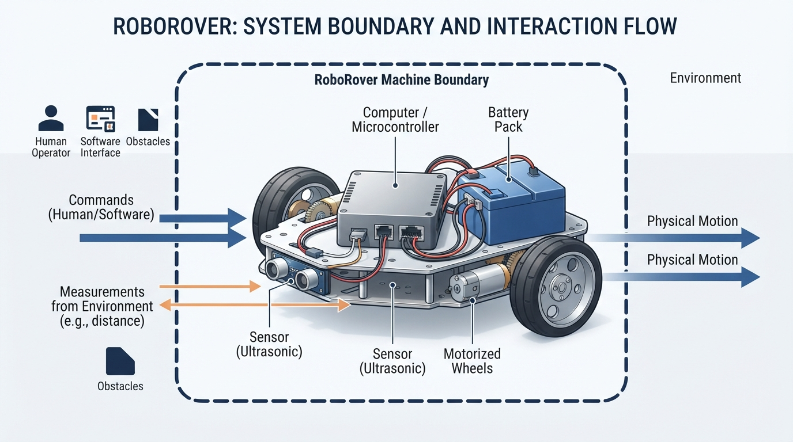
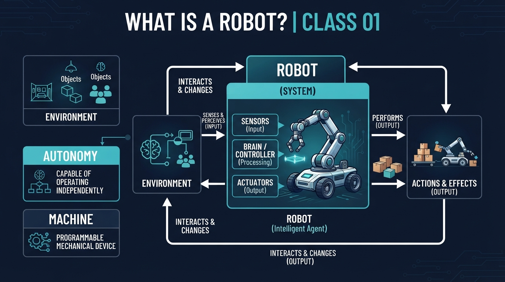
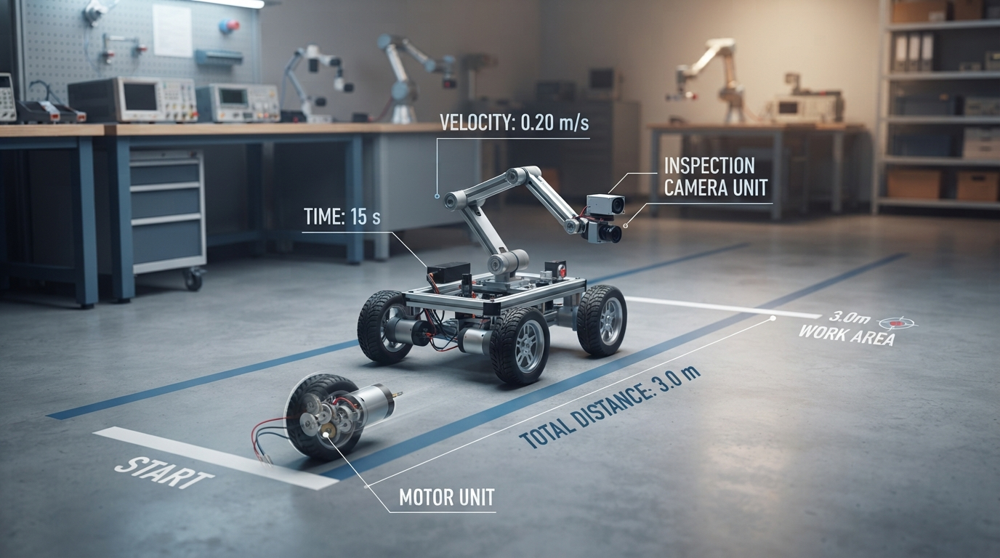
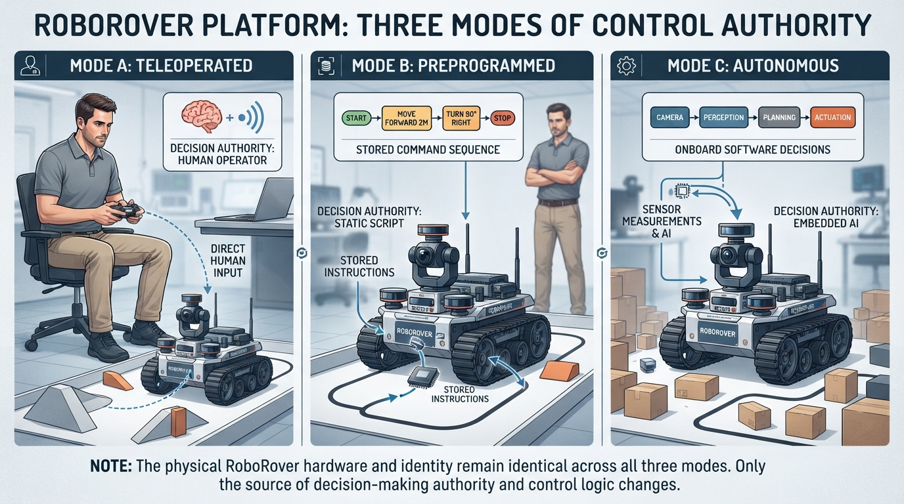
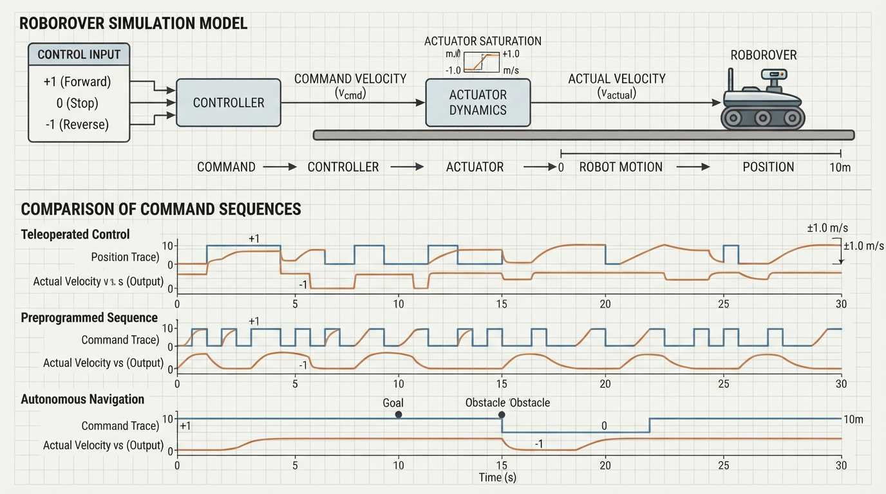

# Class 1: What Is a Robot?

## Where We Are in the Robotics Journey

Welcome to the beginning of the robotics course. Our recurring example is **RoboRover**, a small wheeled machine with sensors, a computer, motors, and a battery.

Today we establish vocabulary used throughout the course:

- robot identity;
- decision authority;
- autonomy;
- machine and environment boundaries;
- an introductory view of feedback control.

In the next class, we will open the basic robotics cycle:

> **Sense → Think → Act**

That cycle will help us describe how RoboRover measures the world, selects an action, and moves an actuator.

## Today We Will Learn

By the end of this class, you should be able to:

1. Use the course’s working description of a robot.
2. Separate **robot identity** from **who or what selects actions**.
3. Explain autonomy as task-level decision-making by software.
4. Identify a machine’s physical environment boundary.
5. Recognize the basic idea of feedback control.
6. Test three decision modes using a small Python simulation.

## 2-Minute Recap

Because this is Class 1, there is no earlier robotics material to review.

Start with two questions:

> If a machine has wheels, is it automatically a robot?

No. Wheels alone do not determine robot identity. A wheelbarrow has wheels, but people usually do not call it a robot. A motorized toy may move, but whether people call it a robot depends on its physical task, controlled actuators, and engineering context.

> If a human controls a machine, can it still be a robot?

Yes. A teleoperated rover is commonly called a robot even though a human chooses its immediate motion.

These questions separate two ideas:

- **Robot identity:** what the physical system is.
- **Decision authority:** who or what selects its actions.

They are related, but they are not the same question.

## The Big Idea




**Figure:** The same physical robot can operate under human, preprogrammed, or autonomous decision authority.

For this course, we will use this working description:

> **For this course, a robot is a physical machine commonly treated as a robot in engineering practice whose controlled actuators perform a physical task. Its immediate actions may be selected by a human operator, a preprogrammed controller, or autonomous software. This is a working description for teaching, not a universal necessary-and-sufficient test.**

The most important rule is:

> **Robot identity and decision authority are separate.**

RoboRover remains the same physical robot whether a person drives it, a stored program drives it, or software chooses its task-level actions.

### Physical machine

A robot exists as a physical system. It may include structure, motors, wheels, joints, tools, electronics, and other mechanisms.

### Controlled actuators

An **actuator** produces controlled physical movement or force. Examples include:

- a motor turning a wheel;
- a joint motor lifting an arm;
- a gripper motor closing fingers.

### Physical task

The robot performs work in the physical world. It may drive, lift, sort, carry, paint, inspect, or manipulate an object.

### Commonly treated as a robot

The word *robot* does not have one universally accepted boundary. Engineers, manufacturers, researchers, and the public may classify boundary cases differently. This course therefore uses clear engineering examples rather than treating every case as a permanent yes-or-no decision.

## See It in Your Head

### AI-Generated Engineering Visual · Professor OS



**How to inspect this visual:** First locate the machine boundary. Then trace the path from sensing and decision-making to actuation. Ask which blocks would remain the same if a human replaced the software decision-maker.

Imagine RoboRover on a laboratory floor. Its chassis, wheels, motors, battery, computer, and onboard sensors are inside a dashed boundary labeled **machine**. The floor, cone, walls, lighting, and obstacles are outside that boundary in the **environment**.

Now compare three versions of the same rover:

- **Teleoperated:** a human chooses “forward,” “stop,” or “turn.”
- **Preprogrammed:** a stored sequence chooses the next action.
- **Autonomous:** software selects task-level actions using available information.

The hardware can remain nearly identical. What changes is the source of the immediate motion command.

> **Same hardware, different decision authority.**

## Core Concept




**Figure:** A system boundary helps distinguish the robot’s machine components from the environment it affects and measures.

### Machine and environment

A **machine** is a physical system arranged to transform energy and control signals into useful physical action.

For RoboRover:

- the chassis, wheels, motors, battery, computer, and onboard sensors are part of the machine;
- the floor, walls, objects, people, lighting, and air around it are part of the environment.

Onboard sensors measure the environment while remaining physically part of the machine. The boundary is an engineering choice that should be stated clearly. For example, a charging station may be outside the rover in one analysis and part of a larger robot system in another.

A useful beginner approach is to identify:

1. what physically moves or supplies power;
2. what measures or computes inside the machine;
3. what exists outside and is affected or measured.

### Autonomy

In common robotics usage, **autonomy** means that software selects actions at a task level without a human choosing every immediate command.

An autonomous vacuum may decide when to move, stop, or change direction as part of its cleaning task. This does not mean it is independent of all humans. People may still choose its schedule, charge it, define its operating area, or maintain it.

Autonomy is not the same as:

- intelligence in every situation;
- freedom from maintenance;
- having no human influence;
- being a humanoid machine.

A teleoperated robot can be a robot without task-level autonomy. Conversely, autonomy and feedback are separate concepts: software may select a task action autonomously while a lower-level controller uses feedback to regulate a motor.

### Feedback: an introductory preview

Use **feedback control** broadly when a measured state or output influences a current or future control action in relation to a desired state or behavior.

In this course, a threshold measurement-to-action rule can count as feedback control. We use **sustained feedback regulation** for repeated measurement-and-correction over time.

A thermostat illustrates the idea:

1. Desired temperature: **20 °C**.
2. Measured room temperature: **18 °C**.
3. The controller turns heating on.
4. A later measurement shows that the temperature has reached the desired range.
5. The controller changes the heating action.

The rule may be fixed in advance, but the action responds to measurement. Therefore, the described behavior uses feedback.

Feedback need not be continuous or smoothly proportional. A rule such as “turn the fan on when temperature reaches 24 °C” also responds to a measured state.

A single sensor event does not necessarily create sustained feedback regulation. If RoboRover detects a marker once and then drives for exactly five seconds without using later measurements to adjust its action, the timed motion is not being repeatedly regulated by that measured state.

## Math Without Fear

Suppose RoboRover travels in a straight line at a constant average speed.

\[
d = vt
\]

where:

- \(d\) is distance traveled in **meters (m)**;
- \(v\) is average speed in **meters per second (m/s)**;
- \(t\) is elapsed time in **seconds (s)**.

If RoboRover’s average speed is \(0.60\ \text{m/s}\) and it drives for \(8\ \text{s}\):

\[
d = (0.60\ \text{m/s})(8\ \text{s}) = 4.8\ \text{m}
\]

The units confirm the result:

\[
\text{m/s} \times \text{s} = \text{m}
\]

Under this assumption, RoboRover travels **4.8 m**. The calculation describes motion, not autonomy. A human, a timer, or autonomous software could all command the same eight-second drive.

> **Model limitation:** This one-dimensional constant-speed model does not represent turning, acceleration, collisions, wheel slip, changing speed, or low-level motor feedback.

In a physical test, motors need time to accelerate, the floor may not be level, battery voltage may change, and the stated speed may be an estimate. The equation is therefore a useful model, not a guarantee of exact final placement.

## Worked Robotics Example




**Figure:** A simple distance calculation describes motion, while the human operator determines the immediate command.

RoboRover is tested in a hallway. A human operator presses the forward button for \(8\ \text{s}\). During the test, the rover’s measured average speed is \(0.60\ \text{m/s}\).

\[
d = vt
\]

with:

- \(v = 0.60\ \text{m/s}\);
- \(t = 8\ \text{s}\).

Therefore:

\[
d = 0.60\ \text{m/s} \times 8\ \text{s} = 4.8\ \text{m}
\]

The rover is still a robot even though the human selected the immediate action.

Now replace the button press with:

> Drive forward for \(8\ \text{s}\), then stop.

The hardware and approximate distance may remain the same, but the decision authority changes from **human operator** to **preprogrammed controller**.

Finally, suppose software selects “drive forward” because its task is to approach a visible work area. The decision authority is now **autonomous software**.

| System | Commonly called a robot? | Immediate decision authority | Feedback in the described behavior? |
|---|---|---|---|
| Timer-controlled traffic signal | Not normally | Preprogrammed timer | No, not in the described timing behavior |
| Thermostat | Not normally | Preprogrammed feedback rule | Yes |
| Teleoperated rover | Yes | Human operator | Local feedback may or may not exist |
| Industrial robot arm | Yes | Task sequence may be preprogrammed | Local feedback is common |
| Autonomous vacuum | Yes | Autonomous software | Feedback is commonly used |

The table separates three dimensions. “Preprogrammed” and “feedback” are not opposites: an industrial arm can execute a preprogrammed task while its joint controllers use feedback.

Automatic doors and similar appliances are useful boundary cases. They may have sensing, computation, and actuation like a robot, but terminology varies by context; this lesson does not use them as scored classification questions.

## Python Lab




**Figure:** The simulation keeps the hardware model fixed while changing the source of the commands.

This program models the same RoboRover hardware under three decision authorities. It uses one-dimensional position in meters:

- positive commands move forward;
- negative commands move backward;
- zero commands stop.

The autonomous example uses a simulated marker measurement to select a task-level command sequence. It does **not** model low-level motor feedback.

Before running the program, predict the results:

| Mode | Decision source | Commands for the original example | Predicted final position |
|---|---|---|---:|
| Teleoperated | Human operator | `[1, 1, 0, -1]` | \(1.2\ \text{m}\) |
| Preprogrammed | Stored sequence | `[1, 1, 0, -1]` | \(1.2\ \text{m}\) |
| Autonomous | Software uses marker distance | Selected as `[1, 1, 1, 0]` when the marker is far ahead | \(3.6\ \text{m}\) |

```python
# Python 3.7-compatible example
# Class 1: Same hardware, different decision authority

import math


def run_rover(commands, speed_m_per_s, command_time_s):
    """Return the rover's final position after a list of commands."""
    position_m = 0.0

    for command in commands:
        # Keep the command within the actuator's allowed range.
        if command > 1:
            command = 1
        elif command < -1:
            command = -1

        position_m += command * speed_m_per_s * command_time_s

    return position_m


def choose_autonomous_commands(marker_distance_m):
    """Choose task-level commands from a simulated marker measurement."""
    if marker_distance_m > 1.5:
        # The marker is far ahead: approach it for three command intervals.
        return [1, 1, 1, 0]
    elif marker_distance_m > 0.5:
        # The marker is nearer: approach it for two command intervals.
        return [1, 1, 0, 0]
    else:
        # The marker is already near: remain stopped.
        return [0, 0, 0, 0]


speed_m_per_s = 0.60
command_time_s = 2.0

# A human operator chooses these immediate commands.
teleoperated_commands = [1, 1, 0, -1]

# A stored program contains the same commands.
preprogrammed_commands = [1, 1, 0, -1]

# A simulated sensor reports that the visible marker is 2.0 m away.
# Task-level software uses that measurement to choose the commands.
marker_distance_m = 2.0
autonomous_commands = choose_autonomous_commands(marker_distance_m)

teleoperated_position = run_rover(
    teleoperated_commands, speed_m_per_s, command_time_s
)
preprogrammed_position = run_rover(
    preprogrammed_commands, speed_m_per_s, command_time_s
)
autonomous_position = run_rover(
    autonomous_commands, speed_m_per_s, command_time_s
)

print("Teleoperated final position: {:.1f} m".format(teleoperated_position))
print("Preprogrammed final position: {:.1f} m".format(preprogrammed_position))
print("Autonomous commands: {}".format(autonomous_commands))
print("Autonomous final position: {:.1f} m".format(autonomous_position))

# Floating-point arithmetic can represent 3.6 approximately, so compare
# with a small tolerance rather than requiring exact binary equality.
assert math.isclose(teleoperated_position, 1.2, rel_tol=0.0, abs_tol=1e-9)
assert math.isclose(preprogrammed_position, 1.2, rel_tol=0.0, abs_tol=1e-9)
assert autonomous_commands == [1, 1, 1, 0]
assert math.isclose(autonomous_position, 3.6, rel_tol=0.0, abs_tol=1e-9)
assert math.isclose(
    teleoperated_position,
    preprogrammed_position,
    rel_tol=0.0,
    abs_tol=1e-9,
)
```

Expected output:

```text
Teleoperated final position: 1.2 m
Preprogrammed final position: 1.2 m
Autonomous commands: [1, 1, 1, 0]
Autonomous final position: 3.6 m
```

The assertions verify the numerical results and the autonomous decision branch.

Important lines:

- `position_m = 0.0` sets the starting position.
- The loop processes one command at a time.
- The command limit from \(-1\) to \(1\) represents a simple actuator limit.
- `marker_distance_m` is the simulated sensor input.
- `choose_autonomous_commands` uses that input to select task-level actions.
- `speed_m_per_s * command_time_s` converts a normalized command into distance.
- The assertions make the results checkable while allowing for floating-point representation.

The teleoperated and preprogrammed systems finish at the same position because their command sequences match. The autonomous system finishes elsewhere because its marker measurement selects a different sequence. The code does not repeatedly measure wheel motion and correct motor power.

## Mini Simulation or Game

Use this challenge to test both the model and the terminology.

### Challenge 1: Change the marker distance

Run the program once with:

```python
marker_distance_m = 2.0
```

Then change the value to each of the following:

```python
marker_distance_m = 1.0
marker_distance_m = 0.2
```

Predict the autonomous command list and final position before each run.

| Marker distance | Expected autonomous commands | Expected final position |
|---:|---|---:|
| \(2.0\ \text{m}\) | `[1, 1, 1, 0]` | \(3.6\ \text{m}\) |
| \(1.0\ \text{m}\) | `[1, 1, 0, 0]` | \(2.4\ \text{m}\) |
| \(0.2\ \text{m}\) | `[0, 0, 0, 0]` | \(0.0\ \text{m}\) |

The teleoperated and preprogrammed positions remain \(1.2\ \text{m}\) as long as their command lists remain `[1, 1, 0, -1]`. This demonstrates that changing the autonomous sensor input changes the autonomous command sequence, not the robot’s physical identity.

### Challenge 2: Compare matching command counts

Change the command lists to:

```python
teleoperated_commands = [1, 0, 1, 0]
preprogrammed_commands = [1, 0, 1, 0]
autonomous_commands = [0, 1, 0, 1]
```

Each sequence contains two forward commands, so each final position should be:

\[
2(1)(0.60\ \text{m/s})(2.0\ \text{ s}) = 2.4\ \text{m}
\]

The different ordering does not affect final position in this simplified model.

### Challenge 3: Test the actuator limit

Change one command list:

```python
autonomous_commands = [2, 2, 0, 0]
```

The program clips each `2` to `1`, so the simulated actuator never receives more than its allowed normalized command. This is a simple model of **saturation**. Real actuators may be limited by voltage, current, friction, temperature, or mechanical stops.

## What Should Happen?

For the original program:

- Teleoperated RoboRover finishes at \(1.2\ \text{m}\).
- Preprogrammed RoboRover finishes at \(1.2\ \text{m}\).
- Autonomous RoboRover finishes at \(3.6\ \text{m}\).
- The first two positions match because their command sequences match.
- With `marker_distance_m = 2.0`, the autonomous function returns `[1, 1, 1, 0]`.

One command contributes:

\[
(1)(0.60\ \text{m/s})(2.0\ \text{s}) = 1.2\ \text{m}
\]

Teleoperated sequence:

\[
1.2 + 1.2 + 0 - 1.2 = 1.2\ \text{m}
\]

Autonomous sequence:

\[
1.2 + 1.2 + 1.2 + 0 = 3.6\ \text{m}
\]

Changing the marker distance should change only the autonomous branch, because that branch uses the simulated sensor input. “Autonomous” does not mean “moves farther”; it means that software selects the task-level action.

## Common Mistakes

### Mistake 1: “A robot must be autonomous.”

Correction: A teleoperated rover is commonly called a robot. Autonomy concerns who or what selects task-level actions.

### Mistake 2: “Anything with a sensor is a robot.”

Correction: Sensors alone do not establish robot identity. A thermostat uses sensing and feedback but is not normally called a robot.

### Mistake 3: “Preprogrammed means no feedback.”

Correction: A preprogrammed task sequence can include local feedback controllers. “Preprogrammed” describes task selection; feedback describes whether measurements influence control actions.

### Mistake 4: “One sensor trigger always creates closed-loop feedback.”

Correction: A one-shot trigger followed by a fixed timed sequence is not sustained feedback regulation if later measurements do not adjust the action.

### Mistake 5: “The calculated distance is guaranteed.”

Correction: \(d=vt\) assumes a known average speed and simplified motion. Acceleration, wheel slip, uneven floors, and calibration errors can change the physical result.

### Mistake 6: “Autonomous means independent of humans.”

Correction: An autonomous robot can still depend on human setup, boundaries, maintenance, charging, or task instructions.

## Try It Yourself

### Challenge: Classify the decision authority

For each description, identify the immediate decision authority:

1. A person watches a camera feed and presses the forward button.
2. The rover follows the stored sequence “forward, forward, stop.”
3. Software checks whether a work marker is visible and chooses whether to move.
4. A motor controller repeatedly measures wheel rotation and adjusts motor power to match a requested speed.

### Self-check

1. **Human operator.**
2. **Preprogrammed controller or stored sequence.**
3. **Autonomous software.**
4. The immediate controller is a **feedback controller** regulating motor speed. This example does not, by itself, identify who selected the larger task or motion request.

Number 4 is intentionally different: feedback describes measurement-based control, while decision authority describes who or what selects an action at the level being analyzed.

### Optional extension

Modify `run_rover` so that it also returns the total distance traveled, not only final position. A backward movement reduces final position but still contributes to total distance traveled.

For the original teleoperated sequence `[1, 1, 0, -1]`:

- **Final position:** \(1.2\ \text{m}\)
- **Total distance traveled:** \(1.2 + 1.2 + 0 + 1.2 = 3.6\ \text{m}\)

A concise implementation hint is:

```python
commands = [1, 1, 0, -1]
speed_m_per_s = 0.60
command_time_s = 2.0
total_distance_m = 0.0

for command in commands:
    total_distance_m += abs(command) * speed_m_per_s * command_time_s

print("Total distance traveled: {:.1f} m".format(total_distance_m))
assert abs(total_distance_m - 3.6) < 1e-9
```

Distinguish:

- **final position:** where the rover ends relative to its starting point;
- **total distance traveled:** the accumulated amount of motion, ignoring direction.

This distinction matters when measuring wear, battery use, or travel activity.

## Quick Quiz

1. Can a teleoperated rover be a robot even when a human chooses its immediate motion?

2. Which system is not normally called a robot but does use feedback control in the described behavior: a timer-controlled traffic signal or a thermostat?

3. In the course working description, what must the robot’s controlled actuators perform?

4. What is the difference between robot identity and decision authority?

## Answers

1. **Yes.** A teleoperated rover is commonly called a robot. Human direction does not remove its robot identity.

2. **A thermostat.** Its fixed rule responds to measured temperature, so it uses feedback control in the described behavior. A timer-controlled traffic signal uses a preprogrammed timing behavior without feedback in that description.

3. They must perform a **physical task**. The complete course description also requires a physical machine commonly treated as a robot in engineering practice.

4. **Robot identity** asks what kind of physical system it is. **Decision authority** asks who or what selects its immediate actions: a human operator, a preprogrammed controller, or autonomous software. Feedback is a separate axis and does not by itself establish task-level autonomy.

## Real Robot Connection

When engineers describe a robot, they examine both its physical structure and its task:

- What can move?
- Which motors or actuators are controlled?
- What physical work is being performed?
- What belongs to the machine, and what belongs to the environment?
- Which decisions come from a person, a stored program, or software?
- Are measurements used to adjust current or future actions?

Use RoboRover’s hardware as an inspection checklist: identify the chassis, battery, sensors, computer, motor controllers, and wheel actuators. Then identify the external floor, objects, people, and obstacles that form its environment.

A practical failure can occur even when the definition is clear. If RoboRover is commanded to drive at \(0.60\ \text{m/s}\) but one wheel has less grip than the other, it may curve instead of traveling straight. The calculation can be mathematically correct under its assumptions while the physical result differs.

Engineers address this by measuring behavior, checking calibration, accounting for actuator limits, and using feedback when appropriate. We will study the sensing and action cycle next.

## Vocabulary

**Robot:** For this course, a robot is a physical machine commonly treated as a robot in engineering practice whose controlled actuators perform a physical task. Its immediate actions may be selected by a human operator, a preprogrammed controller, or autonomous software. This is a working description for teaching, not a universal necessary-and-sufficient test.

**Machine:** A physical system arranged to transform energy and control signals into useful physical action.

**Environment:** The physical surroundings and external objects that interact with the machine.

**Actuator:** A device that produces controlled physical movement or force, such as a motor or powered joint.

**Decision authority:** The human, stored controller, or autonomous software that selects an immediate action.

**Teleoperation:** Operation in which a human chooses the robot’s immediate commands, often through a remote controller.

**Autonomy:** Task-level action selection by software without a human choosing every immediate command.

**Feedback control:** Control in which a measured state or output affects a current or future control action in relation to a desired state or behavior.

**Sustained feedback regulation:** Repeated measurement-and-correction over time.

**Preprogrammed controller:** A controller whose action rules or task sequence were specified in advance. A preprogrammed controller may still contain feedback.

## Further Learning

The following are search prompts for independent exploration, not citations or vetted source titles:

- “robotics actuator sensor controller introduction”
- “teleoperation versus autonomy robotics”
- “feedback control thermostat example”
- “robot system boundary machine environment”

As you study, keep asking two separate questions:

1. What physical task does the machine perform?
2. Who or what selects its immediate action?

## Next Class

Next we begin the central robotics loop:

> **Sense → Think → Act**

RoboRover will use sensors to obtain information, a controller to process that information, and actuators to affect the environment. We will distinguish a sensor reading from an interpretation and an action command from physical motion.

Today’s definition gives us the system. Next class, we examine its basic operation.