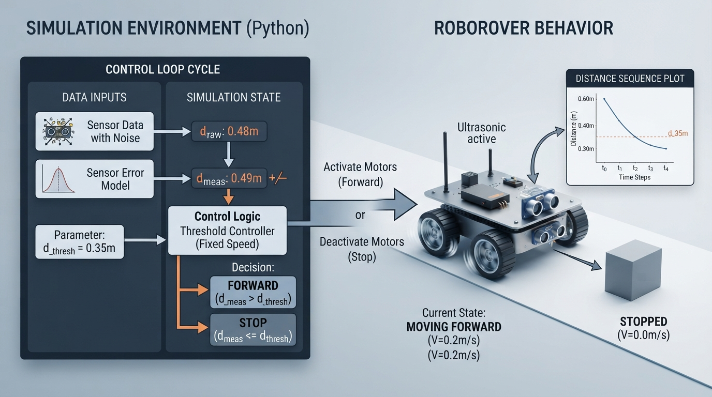

# Class 2: Sense → Think → Act

## Where We Are in the Robotics Journey

In Class 1, we asked, “What is a robot?” We used RoboRover to separate three ideas:

- **Robot identity:** what kind of physical machine it is.
- **Decision authority:** whether a human, a programmed controller, or autonomous software selects actions.
- **Feedback:** whether measured state influences a current or future action.

There is no single universally accepted binary boundary for the word *robot*. In this course, we use this working description:

> A robot is a physical machine commonly treated as a robot in engineering practice whose controlled actuators perform a physical task. Its immediate actions may be selected by a human operator, a preprogrammed controller, or autonomous software.

Today we open RoboRover’s “body plan.” We will see how information travels from the world into the robot, through a controller, and back into the world.

Next class, we will replace a small controller diagram with RoboRover’s first robot brain in Python.

## Today We Will Learn

By the end of this class, you should be able to:

1. Explain what **sensors**, a **controller**, and **actuators** do.
2. Trace the information pathway **sense → think → act**.
3. Explain feedback as measurement that changes a current or future action.
4. Calculate a simple control error using units.
5. Simulate RoboRover approaching a wall while avoiding excessive motion.
6. Identify practical problems such as noisy sensors, delays, saturation, and calibration errors.

## 2-Minute Recap

Imagine RoboRover is a small wheeled rover carrying a package.

- The **environment** is everything outside the robot: floor, walls, light, objects, and people.
- A **sensor** measures something about the environment or the robot’s own condition.
- A **controller** uses sensor information, goals, and rules to choose commands.
- An **actuator** converts a command into physical action. Motors are common actuators.
- **Feedback** occurs when a measured result influences what the robot does next.

A robot can be teleoperated and still be a robot. A robot can follow a preprogrammed task and still use feedback. A non-robot appliance can also use feedback. These are separate questions.

## The Big Idea


**Figure:** The feedback loop connects measurements, decisions, actions, and the changed world.

A useful first mental model is:

```text
physical world
      ↓
   sensors       “What is happening?”
      ↓
   controller    “What should I command?”
      ↓
   actuators     “Make the robot move or change.”
      ↓
physical world changes
      ↺
```

The returning arrow matters. If RoboRover measures its distance from a wall, drives forward, measures again, and changes its command based on the new measurement, it is using feedback.

Without the returning measurement, RoboRover might simply drive forward for five seconds. That is a timed command. It may work on one floor with one battery charge, but it does not know whether it actually reached the desired location.

### A compact comparison

| Idea | Main question | RoboRover example |
|---|---|---|
| Task sequencing | Is the task sequence or rule predetermined? | “Drive forward for five seconds.” |
| Immediate decision authority | Who or what selects the next action? | A human operator, programmed controller, or autonomous software selects the command. |
| Feedback control | Does measured state affect the current or a future action? | “Drive until the measured distance is near 30 cm.” |
| Task-level autonomy | Does software select task-level actions without continuous human selection? | Software chooses to approach the wall rather than wait for a human command. |

These are separate axes. RoboRover may execute a preprogrammed task, use feedback while moving, and still receive its overall mission from a human. Task-level autonomy is not the same thing as feedback control.

> **Terminology note:** Textbook terminology can vary with the chosen system boundary. In this course, a threshold measurement-to-action rule can be called feedback control when the measured state affects an action. We call repeated measurement-and-correction **sustained feedback regulation**.

## See It in Your Head

### AI-Generated Engineering Visual · Professor OS


**How to read this visual:** Trace the signal or idea from left to right. Match each block to the lesson explanation, then predict what would change if one block produced a wrong value.


**Figure:** The fixed-speed threshold controller continues forward outside the tolerance band and stops when the measured distance enters the band.

Picture RoboRover from above, facing a wall.

At the front is a small distance sensor. Draw a dotted measurement line from the sensor to the wall and label it **measured distance**. Inside the rover, draw a box labeled **controller**. Two curved arrows leave the controller and go to the left and right wheel motors. A target card near the controller says **desired distance = 30 cm**.

Now imagine three moments:

1. RoboRover is 60 cm from the wall. The controller commands forward motion at its fixed forward speed.
2. RoboRover is 35 cm away. The error is 5 cm, which is greater than the 2 cm tolerance, so the controller continues commanding the same fixed forward speed. It does not slow down.
3. RoboRover is about 30 cm away. The measured distance is within the tolerance band, so the controller stops.

An illustrator should show that the controller does not “see” the wall directly. It only receives a number from the sensor. The controller’s internal decision is based on that number, the target, and its programmed rule. This lesson’s threshold controller has only two commands: fixed-speed **FORWARD** and **STOP**. It does not use reduced-speed motion.

## Core Concept

### Sensors: turning physical conditions into information

A sensor is a device that produces a measurement related to something physical.

Examples include:

- distance to an object, in metres or centimetres;
- wheel rotation, in revolutions or encoder counts;
- light level, in a sensor-specific unit;
- temperature, in degrees Celsius;
- contact, represented as pressed or not pressed.

A sensor does not provide perfect truth. Its reading may contain:

- **noise:** small random variation;
- **bias:** a consistent offset;
- **latency:** a delay between the physical event and the reported value;
- **limited range:** inability to measure beyond a minimum or maximum;
- **calibration error:** the conversion from sensor signal to physical units is imperfect.

### Controller: converting information into a decision

A controller is the part of a robot that transforms information into commands. It may be a small microcontroller, a computer, or software running on a larger computer.

For today, RoboRover’s controller follows a simple one-sided threshold rule:

> If the measured distance is more than the target plus the tolerance, drive forward at a fixed speed. Otherwise, stop.

Thus, the rover stops both when it is within the tolerance band and when it is already too close to the wall. This simple rule does not command reverse motion.

This is a feedback controller because the measured distance affects the current command. The implemented controller is a **fixed-speed threshold controller**. Proportional control, which changes speed according to the size of the error, is a preview concept and is not implemented in today’s Python lab.

### Actuators: turning commands into physical effects

An actuator changes the physical world or the robot’s physical state.

Examples include:

- electric motors turning wheels;
- a servo moving a gripper;
- a pump moving liquid;
- a speaker producing sound;
- an LED producing light.

The controller might command “motor speed = 40%,” but the actuator may not produce exactly the same result every time. Battery voltage, friction, load, and floor texture matter.

### Feedback is a loop, not merely a sensor event

Suppose a sensor detects a wall and starts a five-second motor sequence. If later measurements do not affect that sequence, then the described behavior is not sustained feedback regulation. It is a sensor-triggered action.

By contrast, if RoboRover repeatedly measures distance and changes motor commands as the distance changes, measured state is actively closing the loop.

Feedback may be continuous, repeated at discrete times, threshold-based, or include hysteresis. Hysteresis means using slightly different switching thresholds to avoid rapid on-off changes near one boundary. Hysteresis is a preview concept for this class; we will use a simple threshold today and revisit hysteresis later.

## Math Without Fear

Let RoboRover’s desired distance from the wall be

\[
d_{\text{target}} = 30\ \text{cm}.
\]

Suppose the sensor measures

\[
d_{\text{measured}} = 42\ \text{cm}.
\]

Define the distance error as

\[
e = d_{\text{measured}} - d_{\text{target}}.
\]

Here:

- \(e\) is the distance error, in centimetres;
- \(d_{\text{measured}}\) is the sensor reading, in centimetres;
- \(d_{\text{target}}\) is the desired distance, in centimetres.

Therefore,

\[
e = 42\ \text{cm} - 30\ \text{cm}
  = 12\ \text{cm}.
\]

The positive error tells us RoboRover is 12 cm too far away. Because RoboRover faces the wall, it should move forward.

One possible proportional controller is

\[
v = k e,
\]

where:

- \(v\) is commanded forward speed, in metres per second \((\text{m/s})\);
- \(e\) is error, in centimetres \((\text{cm})\);
- \(k\) is a chosen controller gain, in \(\text{m}/(\text{s}\cdot\text{cm})\).

If

\[
k = 0.01\ \frac{\text{m}}{\text{s}\cdot\text{cm}},
\]

then

\[
v =
0.01\ \frac{\text{m}}{\text{s}\cdot\text{cm}}
\times 12\ \text{cm}
=
0.12\ \text{m/s}.
\]

Interpretation: the larger the distance error, the faster RoboRover is commanded to move forward. As the error becomes smaller, the commanded speed becomes smaller. This proportional controller is a preview concept; the Python lab below does not implement it.

The worked example and Python lab use a deliberately simpler **fixed-speed threshold controller**, not this proportional law. Both are feedback controllers because both use measured distance to choose an action. The proportional controller changes speed continuously with error; the threshold controller selects a fixed forward speed whenever the error exceeds a tolerance. We use the threshold version here to make the sense → think → act logic easier to inspect.

Real controllers also impose limits. If a proportional calculation produces \(0.40\ \text{m/s}\), but the motor system is limited to \(0.20\ \text{m/s}\), the command is **saturated** at \(0.20\ \text{m/s}\). A robot cannot obey a command beyond its physical limits.

## Worked Robotics Example


**Figure:** In the simplified model, three 0.10 metre movements reduce the distance from 0.60 m to the 0.30 m target, where the rover stops.

RoboRover starts 0.60 m from a wall. Its target is 0.30 m. The controller uses a fixed-speed threshold rule:

- time step: \(\Delta t = 1.0\ \text{s}\);
- forward speed: \(v = 0.10\ \text{m/s}\) whenever the measured distance is more than 0.02 m above the target;
- stop condition: stop when measured distance is within \(0.02\ \text{m}\) of the target or is below the target.

This is a hand-worked fixed-speed model. The Python code repeats the same fixed-speed logic while adding imperfect measurements.

During one forward step, the distance changes by

\[
\Delta d = v\Delta t,
\]

where:

- \(\Delta d\) is distance travelled toward the wall, in metres;
- \(v\) is forward speed, in metres per second;
- \(\Delta t\) is elapsed time, in seconds.

Thus,

\[
\Delta d =
0.10\ \text{m/s}
\times 1.0\ \text{s}
=
0.10\ \text{m}.
\]

The distance sequence is:

| Step | Distance before action | Action | Distance after action |
|---:|---:|---|---:|
| 0 | 0.60 m | drive forward | 0.50 m |
| 1 | 0.50 m | drive forward | 0.40 m |
| 2 | 0.40 m | drive forward | 0.30 m |
| 3 | 0.30 m | stop | 0.30 m |

After three forward steps, RoboRover has travelled

\[
3 \times 0.10\ \text{m} = 0.30\ \text{m}.
\]

It reaches the target in this simplified model. The interpretation is important: this is a model, not a guarantee for a physical rover. Real wheels may slip, the sensor may be angled, and the motor may take time to respond.

## Python Lab




**Figure:** The simulation keeps true distance separate from the imperfect measured distance used by the fixed-speed threshold controller.

This program simulates the same fixed-speed threshold controller as the worked example. The sensor readings include small, deliberately chosen measurement errors. The controller does not use the true distance directly; it uses the sensor reading. In this model, the sensor-error sequence is the only imperfection represented: motion is otherwise instantaneous, exact, and free of latency, wheel slip, and actuator lag.

The conceptual visual associated with this lab may show a plotted-style distance sequence, but that sequence is an explanatory illustration rather than a plot generated by the supplied code.

**Predict before you run it:** Will RoboRover drive forward exactly three times? Will the small sensor errors prevent it from stopping near 0.30 m?

```python
# Python 3.7-compatible RoboRover feedback simulation

target_distance = 0.30       # metres
distance = 0.60               # metres; true starting distance
time_step = 1.0               # seconds
forward_speed = 0.10          # metres per second
tolerance = 0.02              # metres

# A simple, repeatable sensor-error sequence.
sensor_errors = [0.00, 0.01, -0.01, 0.01, 0.00, -0.01]

move_count = 0
history = []

for step in range(len(sensor_errors)):
    measured_distance = distance + sensor_errors[step]
    error = measured_distance - target_distance

    if error > tolerance:
        command = "FORWARD"
        distance -= forward_speed * time_step
        move_count += 1
    else:
        command = "STOP"

    history.append((step, distance, measured_distance, error, command))

print("step | true_m | measured_m | error_m | command")
for record in history:
    step, true_distance, measured, error, command = record
    print("{:4d} | {:6.2f} | {:10.2f} | {:7.2f} | {}".format(
        step, true_distance, measured, error, command
    ))

print("forward commands:", move_count)
print("final true distance: {:.2f} m".format(distance))

# Executable checks for the claims made by this simulation.
assert move_count == 3
assert abs(distance - 0.30) < 1e-9
assert history[3][4] == "STOP"
assert abs(history[3][2] - 0.31) < 1e-9
```

The final assertions are ordinary Boolean checks: each comparison produces `True` or `False`, and `assert` verifies that the result is `True`.

Important lines:

- `measured_distance = distance + sensor_errors[step]` creates an imperfect sensor reading.
- `error = measured_distance - target_distance` calculates how far the reading is from the goal.
- The `if` statement is the controller’s decision rule.
- `distance -= ...` models the actuator changing RoboRover’s position.
- `assert` checks exact claims made by the simulation.

The model separates the **true distance** from the **measured distance**. A real controller usually cannot access the true distance directly. For example, at step 3 the true distance is 0.30 m, while the controller uses the measured value 0.31 m.

## Mini Simulation or Game

Try changing one value at a time:

1. Set `tolerance = 0.00`.
2. Set the first sensor error to `0.05`.
3. Set `forward_speed = 0.20`.
4. Add a second action, such as `"REVERSE"`, when the error is less than `-tolerance`.

Before each run, write down:

- how many forward commands you expect;
- whether the final distance will be above, below, or near the target;
- whether the rover might overshoot.

This is a small experiment in **model-based thinking**: predict, run, compare, and explain the difference.

## What Should Happen?

With the code as provided:

- RoboRover begins at 0.60 m.
- It drives forward three times.
- Each forward command changes the true distance by 0.10 m.
- The true final distance is 0.30 m.
- At step 3, the true distance is 0.30 m and the measured distance is 0.31 m. The error is \(0.01\ \text{m}\), which is within \(0.02\ \text{m}\) of the target, so the controller stops.
- The assertions verify three forward commands, a final true distance of 0.30 m, a `STOP` command at step 3, and the 0.31 m measured reading at that step.

If you set the tolerance to zero, a reading slightly above 0.30 m may cause another forward command. That can make the rover move too close to the wall. A real robot needs a carefully chosen stopping region, sensor filtering, or a slower approach.

## Common Mistakes

### Mistake 1: Calling every sensor-triggered action feedback

A sensor can start a sequence without controlling the sequence afterward. Ask:

> Does a later measurement change the current or future command?

If not, do not describe that behavior as sustained feedback regulation.

### Mistake 2: Confusing a sensor with a controller

A distance sensor reports a distance. It does not decide whether to move unless additional control logic uses its reading.

### Mistake 3: Assuming an actuator obeys perfectly

A command to drive at a particular speed is not the same as guaranteed motion. Friction, battery voltage, wheel size, and payload affect the result.

### Mistake 4: Ignoring units

Subtracting 30 cm from 0.60 m without converting units produces a meaningless calculation. Use either centimetres or metres consistently.

### Mistake 5: Forgetting delay

If the sensor reports an old distance, RoboRover may continue driving after it should have stopped. Latency can cause overshoot.

### Mistake 6: Treating the model as the robot

The program updates a number called `distance`. A real rover must move through mechanics, receive sensor data, and deal with uncertainty. Simulation is useful because it lets us test logic safely, but it is not the physical system.

## Try It Yourself

### Challenge: RoboRover’s cautious approach

Modify the program so RoboRover uses two speeds:

- if the error is greater than 0.10 m, drive at 0.10 m/s;
- if the error is greater than the tolerance but no more than 0.10 m, drive at 0.05 m/s;
- otherwise, stop.

Record the distance and command at every step. Explain why the slower speed may reduce overshoot.

**Self-check for the original sensor-error sequence and a 1.0-second time step:** the rover should issue four forward commands. It should use the slower speed on the third and fourth forward commands, ending at a modeled true distance of 0.30 m and then stopping. This outcome is specific to the stated sequence and idealized model; changing the errors or timing can change it.

### Optional extension

Add a maximum speed of 0.12 m/s. If a calculated command would be faster than that, replace it with 0.12 m/s. This models actuator saturation.

Do not claim that the slower rule is always better. It may improve precision but take longer, and a noisy sensor may still cause unwanted switching.

## Quick Quiz

1. What is the job of a sensor in RoboRover?
2. A controller commands a motor to turn, but the robot never measures its movement afterward. Is that action automatically feedback control? Explain.
3. Convert \(30\ \text{cm}\) to metres.
4. RoboRover measures 0.48 m from a wall and wants to be 0.30 m away. Using  
   \[
   e = d_{\text{measured}} - d_{\text{target}},
   \]
   what is the error, and what does its sign mean?
5. Can a preprogrammed robot use feedback? Give a reason.

## Answers

1. A sensor measures a physical quantity and provides information related to the robot or its environment.
2. No. It is not automatically feedback control. The measured result must influence a current or future action. A one-time sensor trigger followed by a fixed sequence is not sustained feedback regulation.
3.  
   \[
   30\ \text{cm} = 0.30\ \text{m}.
   \]
4.  
   \[
   e = 0.48\ \text{m} - 0.30\ \text{m}
   = 0.18\ \text{m}.
   \]  
   The positive sign means RoboRover is 0.18 m too far from the wall, so it should move toward the wall under the stated orientation.
5. Yes. “Preprogrammed” describes how a task or rule was selected. Feedback describes whether measurements influence actions. An industrial robot may execute a preprogrammed task while local controllers use sensor feedback.

## Real Robot Connection

Before any physical testing, test the accessible stop control or power disconnect before enabling autonomous motion. Keep the rover away from edges, stairs, fragile objects, people, and other hazards. Secure the rover, keep its wheels clear during initial motor tests, keep people and obstacles away, use a low battery or current-limited supply where appropriate, and provide an accessible stop control or power disconnect.

On a real RoboRover, the sensor might be an ultrasonic or infrared distance sensor, while the actuators might be two geared motors. The controller could run many times per second.

Several engineering problems appear immediately:

- **Calibration:** the sensor’s reported 30 cm may actually correspond to a slightly different physical distance.
- **Noise:** readings may jump between 29 cm and 32 cm even when the rover is stationary.
- **Latency:** commands and measurements take time to travel through software and electronics.
- **Saturation:** motors cannot exceed their available speed or torque.
- **Mechanical limits:** wheels may slip, stall, or turn at different speeds.
- **Model assumptions:** the simulation assumes a flat path, a straight wall, and instant motion at exactly 0.10 m/s.

Engineers test each part separately. They may first print sensor readings while holding the rover still. Then they test one motor at a low, safe speed. Then they combine sensor, controller, and actuator tests.

Next class will focus on the controller as software. RoboRover will no longer be only a block diagram: we will write a small Python “brain” that reads information, makes a decision, and produces an action.

## Vocabulary

- **Actuator:** A device that produces a physical effect, such as motor motion.
- **Controller:** Hardware or software that converts goals and measured information into commands.
- **Feedback:** A control arrangement in which measured state or output influences a current or future control action.
- **Gain:** A factor that determines how strongly a controller responds to an error.
- **Latency:** A delay between an event, its measurement, its computation, or the resulting action.
- **Measurement:** A value produced by a sensor, usually representing a physical quantity.
- **Noise:** Unwanted variation or uncertainty in a measurement or signal.
- **Robot:** For this course, a physical machine commonly treated as a robot in engineering practice whose controlled actuators perform a physical task. Its immediate actions may be selected by a human operator, a preprogrammed controller, or autonomous software.
- **Sensor:** A device that measures a physical property and produces information about it.
- **Saturation:** Limiting a command because an actuator or system cannot physically produce values beyond a maximum or minimum.
- **Sustained feedback regulation:** Repeated measurement-and-correction over time, using measured state to adjust behavior.
- **Target:** The desired value or condition a controller is trying to reach.

## Further Learning

To deepen this class, investigate these topics in this order:

1. Sensor calibration using known distances.
2. Measurement noise and simple averaging.
3. Motor command limits and saturation.
4. Threshold control and hysteresis.
5. Discrete-time feedback loops, where a controller updates at separate time steps.

These topics extend today’s sense → think → act loop without changing its basic structure.

## Next Class

**Class 3: Your First Robot Brain in Python**

We will turn today’s controller idea into a clearer Python program. RoboRover will receive simulated sensor data, apply a decision rule, and produce motor commands. You will practice separating **input**, **decision**, and **output**—the software structure behind many real robot controllers.
