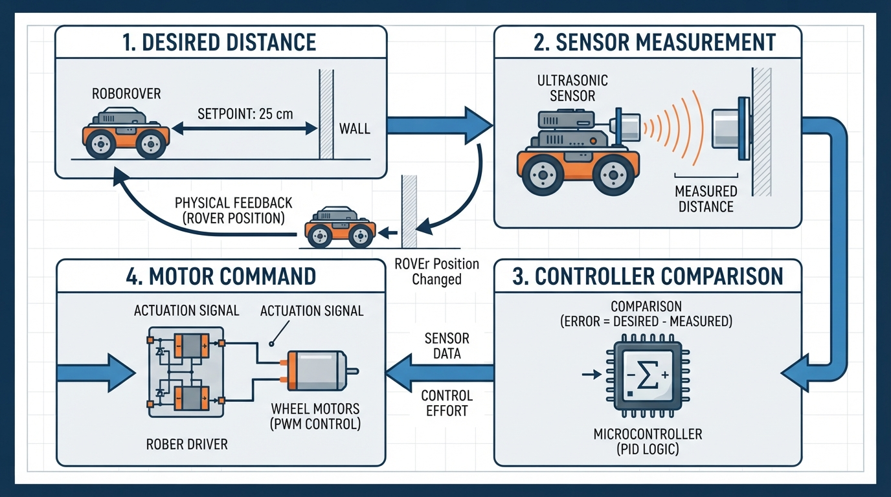
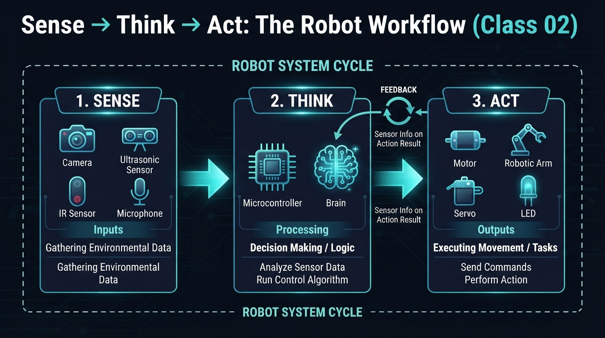
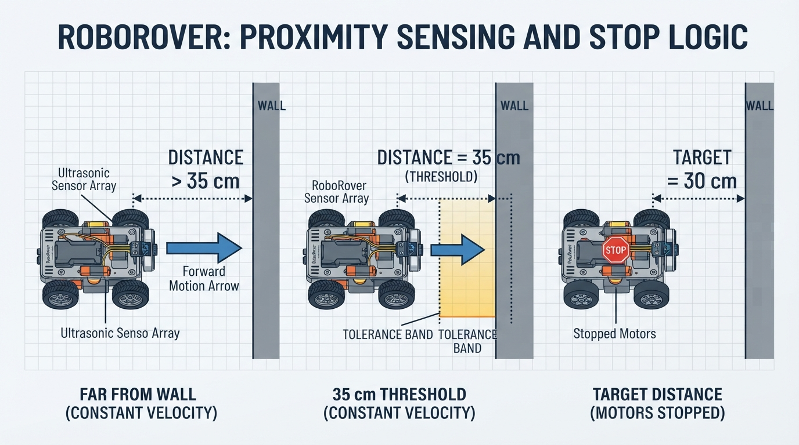
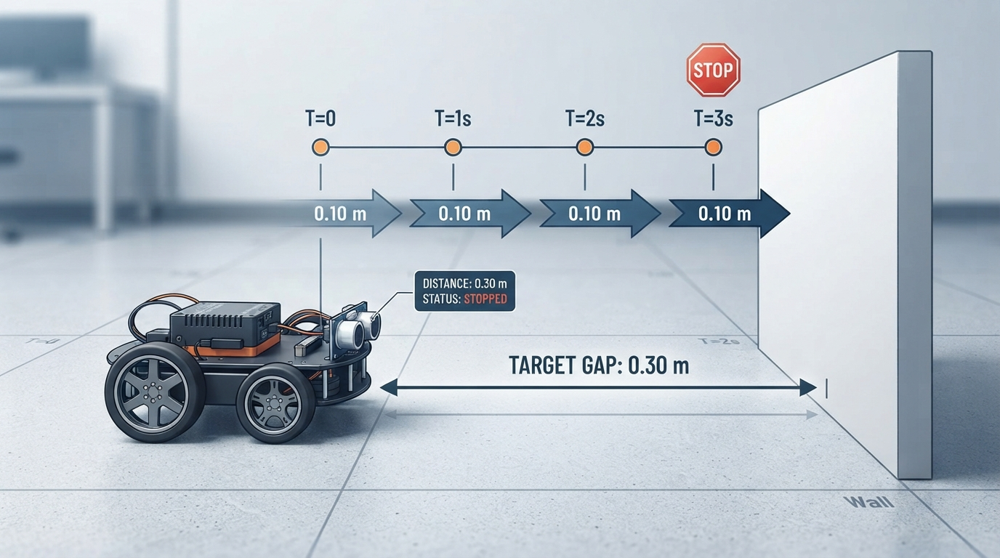

# Class 2: Sense → Think → Act

## Where We Are in the Robotics Journey

In Class 1, we asked, “What is a robot?” We learned that a robot is a physical machine whose controlled actuators perform a physical task. The action may be selected by a human, a preprogrammed controller, or autonomous software.

We also separated two ideas that are often mixed together:

- **Robot identity:** what kind of physical machine it is.
- **Decision authority:** who or what selects its immediate actions.

A teleoperated rover can be a robot even when a human chooses its movements. An autonomous vacuum can be a robot because software selects its task-level actions. A thermostat can use feedback without normally being called a robot.

Today we open the robot’s “body and brain” and study the repeating pattern behind many robotic systems:

> **Sense → Think → Act**

RoboRover will use this pattern to keep a safe distance from a wall.

## Today We Will Learn

By the end of this class, you should be able to:

1. Explain what **sensors**, a **controller**, and **actuators** do.
2. Trace information through a robot from measurement to movement.
3. Explain feedback as measurement that changes a current or future control action.
4. Calculate a simple distance error with units.
5. Recognize why real robots struggle with noise, delay, calibration, and mechanical limits.
6. Build and run a small Python simulation of RoboRover’s feedback behavior.

## 2-Minute Recap

Imagine a robot arm picking up a cup.

- The arm is a **physical machine**.
- Its motors create controlled movement.
- A human, a stored program, or autonomous software may choose the task.
- Sensors may measure joint angle, force, or the cup’s location.
- The robot’s status and its control mode are separate questions.

Last class, we previewed **feedback**:

> A measured state or output influences a current or future control action in relation to a desired state.

For example, a thermostat measures room temperature and changes heating behavior when the measured temperature differs from the desired temperature. Feedback does not have to mean smooth or continuous adjustment. A threshold rule can also be feedback if a measurement changes what happens next.

Today we will place these ideas into a complete robot loop.

## The Big Idea




**Figure:** The measured result returns to the controller, so the next action depends on what actually happened.

RoboRover is facing a wall. It should stop about 0.50 metres away.

An illustrator could draw four blocks:

```text
        desired distance
             0.50 m
                |
                v
Wall <--- sensor measurement <--- RoboRover
                                      |
                                      v
                              Controller compares
                              desired and measured
                                      |
                                      v
                              Motor command
                                      |
                                      v
                              Wheels move rover
                                      |
                                      +---- new distance ----> sensor
```

The loop is:

1. **Sense:** a distance sensor estimates how far RoboRover is from the wall.
2. **Think:** the controller compares the measurement with the desired distance.
3. **Act:** motors turn the wheels forward, backward, or not at all.
4. **Sense again:** the new position is measured.

The fourth step matters. Without measuring again, the robot cannot tell whether its action worked.

This is a simple **feedback control loop**. The word “control” here means choosing an action to influence a physical system, not merely issuing a one-time command.

## See It in Your Head

### AI-Generated Engineering Visual · Professor OS



**How to read this visual:** Trace the signal or idea from left to right. Match each block to the lesson explanation, then predict what would change if one block produced a wrong value.


Picture RoboRover as a small wheeled platform with:

- a forward-facing distance sensor,
- two powered wheels,
- a small computer,
- a battery,
- and a wall several centimetres away.

Suppose RoboRover is too far from the wall. The controller might command both wheels to turn forward.

Now suppose it is too close. The controller might command both wheels to turn backward.

If it is within an acceptable zone, the controller stops the wheels.

The desired distance is not a command such as “drive forward for three seconds.” It is a condition the robot tries to maintain.

A useful visual detail is to draw a shaded **acceptable zone** around the target:

```text
too far          acceptable zone          too close
------|-----------------|-----------------|------
     0.56 m            0.50 m             0.44 m
       forward             stop              reverse
```

The boundaries in this drawing are examples. The exact values depend on the robot, sensor, and task.

## Core Concept

### Sensors: the robot’s measuring instruments

A **sensor** measures some property of the robot or its environment and produces information that the controller can use.

Examples include:

- a distance sensor measuring separation from an object,
- a wheel encoder measuring wheel rotation,
- a camera measuring patterns of light,
- a temperature sensor measuring thermal conditions,
- a bumper switch reporting contact.

A sensor does not automatically “understand” its surroundings. It produces a signal or value. Software and electronics interpret that value.

### Controller: the decision-making mechanism

A **controller** receives measurements and selects commands.

For RoboRover, the controller could follow this rule:

- If the wall is farther than the target zone, drive forward.
- If the wall is closer than the target zone, drive backward.
- Otherwise, stop.

This is a threshold controller. It is simple, but it is still feedback because new measurements affect later motor commands.

### Actuators: the parts that create physical change

An **actuator** converts a command into physical action.

Examples include:

- electric motors turning wheels,
- a servo moving a joint,
- a pump moving liquid,
- a gripper motor closing fingers,
- a solenoid moving a latch.

A controller may request “motor speed = 40%,” but the physical actuator may not produce exactly that result. Friction, battery voltage, load, and mechanical wear all matter.

### Feedback: action informed by results

In feedback control, the robot acts, measures the result, and uses that result to decide what to do next.

This differs from a one-shot sensor trigger. Suppose a sensor detects an obstacle and starts a fixed three-second turn. If the robot does not use later measurements to adjust that turn, many engineers would describe this as a sensor-triggered sequence, not sustained feedback regulation.

In this course, **sustained feedback regulation** means repeated measurement-and-correction over time.

### A compact comparison

These ideas are related but not identical:

| Idea | Main question | Example |
|---|---|---|
| Preprogrammed automation | Is the sequence specified in advance? | RoboRover drives forward for 2 seconds, then stops |
| Feedback control | Does measured output or state change the control action? | RoboRover changes direction based on measured wall distance |
| Autonomy | Does software select task-level actions without immediate human choice? | RoboRover decides how to approach and inspect several locations |

A system can combine these. A preprogrammed robot arm can execute a stored task while its joint motors use feedback. Feedback does not automatically mean autonomy, and autonomy does not require a particular sensor or algorithm.

## Math Without Fear

To reason about RoboRover’s distance, define the **distance error**:

\[
e = d_{\text{measured}} - d_{\text{target}}
\]

where:

- \(e\) is the distance error, in metres (m);
- \(d_{\text{measured}}\) is the current measured distance from RoboRover to the wall, in metres (m);
- \(d_{\text{target}}\) is the desired distance from RoboRover to the wall, in metres (m).

Suppose:

- \(d_{\text{measured}} = 0.82\ \text{m}\)
- \(d_{\text{target}} = 0.50\ \text{m}\)

Then:

\[
e = 0.82\ \text{m} - 0.50\ \text{m}
\]

\[
e = 0.32\ \text{m}
\]

The positive sign means RoboRover is too far from the wall. If the rover is facing the wall, it should move forward.

If instead the measured distance were \(0.41\ \text{m}\):

\[
e = 0.41\ \text{m} - 0.50\ \text{m} = -0.09\ \text{m}
\]

The negative sign means RoboRover is too close. It should move backward or otherwise increase its distance.

A simple travel estimate is:

\[
t = \frac{\Delta d}{v}
\]

where:

- \(t\) is time, in seconds (s);
- \(\Delta d\) is the distance to travel, in metres (m);
- \(v\) is speed, in metres per second (m/s).

If RoboRover must travel \(0.32\ \text{m}\) at a constant \(0.20\ \text{m/s}\):

\[
t = \frac{0.32\ \text{m}}{0.20\ \text{m/s}} = 1.6\ \text{s}
\]

This is an ideal estimate. It assumes perfect measurement, immediate motor response, constant speed, and no slipping. Real robots rarely satisfy all those assumptions.

## Worked Robotics Example




**Figure:** The same target produces different commands because the measured distance changes.

RoboRover uses a distance sensor aimed at a wall.

- Desired distance: \(0.50\ \text{m}\)
- Measured distance: \(0.68\ \text{m}\)
- Acceptable error magnitude: \(0.04\ \text{m}\)

First calculate the error:

\[
e = 0.68\ \text{m} - 0.50\ \text{m} = 0.18\ \text{m}
\]

Because \(0.18\ \text{m}\) is greater than the acceptable \(0.04\ \text{m}\), RoboRover is too far away. The controller commands forward motion.

Later, the sensor reads \(0.52\ \text{m}\):

\[
e = 0.52\ \text{m} - 0.50\ \text{m} = 0.02\ \text{m}
\]

The error is now within the acceptable zone because \(0.02\ \text{m} < 0.04\ \text{m}\). The controller commands stop.

Notice what happened:

- The target did not change.
- The sensor measurement changed.
- The controller selected a different actuator command because of that measurement.

That is the essential feedback pattern.

An engineering caveat appears immediately: the sensor may report \(0.52\ \text{m}\) even when the true distance is \(0.50\ \text{m}\). Sensor noise can cause the controller to switch commands unnecessarily. A deadband, such as the \(0.04\ \text{m}\) acceptable zone, helps prevent constant forward-backward switching.

## Python Lab




**Figure:** The simulation separates imperfect measurement from the rover’s true distance and shows the feedback response over time.

This program simulates RoboRover approaching a wall. It uses:

- a simulated distance sensor with small random noise;
- a threshold controller;
- a motor command represented by velocity;
- a plot of true distance over time.

The simulated rover starts \(1.20\ \text{m}\) from the wall and tries to maintain \(0.50\ \text{m}\).

```python
import random
import matplotlib.pyplot as plt

# Desired distance from RoboRover to the wall, in metres.
target_distance = 0.50

# The rover is allowed to be this far above or below the target.
deadband = 0.03

# Simulation time step, in seconds.
dt = 0.10

# Maximum forward or backward speed, in metres per second.
speed = 0.25

# Starting true distance from the wall, in metres.
distance = 1.20

# A local random generator makes the experiment repeatable.
rng = random.Random(4)

times = []
distances = []
commands = []

for step in range(120):
    time = step * dt

    # Simulate an imperfect distance sensor.
    noise = rng.uniform(-0.015, 0.015)
    measured_distance = distance + noise

    error = measured_distance - target_distance

    # Feedback controller:
    # positive velocity moves toward the wall,
    # negative velocity moves away from the wall.
    if error > deadband:
        velocity = speed
        command = "forward"
    elif error < -deadband:
        velocity = -speed
        command = "backward"
    else:
        velocity = 0.0
        command = "stop"

    # Update the true distance using velocity and time.
    distance = distance - velocity * dt

    # Do not allow the simulated rover to pass through the wall.
    if distance < 0.05:
        distance = 0.05

    times.append(time)
    distances.append(distance)
    commands.append(command)

# Executable verification of the experiment's exact structural claims.
assert len(times) == 120
assert len(distances) == 120
assert len(commands) == 120
assert min(distances) >= 0.05
assert abs(distances[-1] - target_distance) <= 0.10

print("Simulation completed.")
print("Final true distance: {:.3f} m".format(distances[-1]))
print("Final error from target: {:.3f} m".format(
    distances[-1] - target_distance
))

plt.plot(times, distances, label="true distance")
plt.axhline(target_distance, color="red", linestyle="--",
            label="target distance")
plt.xlabel("Time (s)")
plt.ylabel("Distance from wall (m)")
plt.title("RoboRover feedback simulation")
plt.legend()
plt.grid(True)
plt.show()
```

Important lines:

- `measured_distance = distance + noise` separates the true simulated distance from what the sensor reports.
- `error = measured_distance - target_distance` computes the signed error.
- The `if`, `elif`, and `else` statements are the controller.
- `distance = distance - velocity * dt` models the physical result of the motor command.
- `assert` statements check structural and safety claims while the program runs.

This is not a complete motor controller. It is a teaching model. It ignores acceleration, wheel slip, sensor delay, and the time needed for a motor to start or stop.

## Mini Simulation or Game

Try a human version before changing the code.

Choose a target distance from a wall, such as 50 centimetres. One person is RoboRover, one is the sensor, and one is the controller.

1. The “sensor” secretly chooses a measurement that is slightly inaccurate.
2. The controller announces only one command: **forward**, **backward**, or **stop**.
3. RoboRover takes one small step in the commanded direction.
4. Measure again and repeat.

Now play two rounds:

- **Round A:** the controller must react to every tiny difference.
- **Round B:** the controller uses a deadband: stop when within 4 centimetres of the target.

Discuss which round produces more unnecessary switching. The second round should usually feel calmer because small measurement differences do not immediately change the command.

## What Should Happen?

Predict before you run the Python program:

1. RoboRover begins too far from the wall. What should its first movement command be?
2. As it approaches the target, should the distance generally increase or decrease?
3. Once it enters the deadband, should it keep driving continuously?
4. Why might the plotted line not end at exactly \(0.50\ \text{m}\)?

Expected reasoning:

1. The first command should be **forward**, because the measured distance is greater than the target plus the deadband.
2. The distance should generally **decrease**.
3. It should usually command **stop**, although noisy measurements near the boundary may occasionally cause another movement command.
4. The result may differ from exactly \(0.50\ \text{m}\) because the controller acts in time steps, the sensor is noisy, and the rover moves at a fixed speed rather than slowing smoothly.

Run the program and inspect the graph. Look for the red target line and the changing blue distance line.

## Common Mistakes

### Mistake 1: Calling every sensor trigger feedback

A sensor can start a sequence without creating a continuing feedback loop. Feedback requires that measured information influence a current or future control action. If the robot starts a fixed sequence and ignores later measurements, it is not using sustained feedback regulation for that behavior.

### Mistake 2: Confusing a sensor with a controller

A sensor measures. It does not necessarily decide. The controller interprets measurements and chooses commands.

### Mistake 3: Assuming an actuator obeys perfectly

A command such as “move forward” does not guarantee a precise distance. Wheels can slip, motors can differ, and battery voltage can change.

### Mistake 4: Forgetting units

A distance of \(50\) could mean 50 millimetres, centimetres, or metres. Always write the unit. In the Python simulation, distances are in metres.

### Mistake 5: Using the wrong sign

For a wall directly ahead, increasing distance error means the rover is too far away. But the correct movement direction depends on the robot’s geometry and coordinate convention. Define the convention before writing the rule.

### Mistake 6: Ignoring delay

If the sensor reports an old position, RoboRover may continue forward after it has already reached the target. Delays can cause overshoot or oscillation.

## Try It Yourself

### Challenge

Modify the Python program so that RoboRover has two speed levels:

- use a faster speed when it is far from the wall;
- use a slower speed when it is close to the target but outside the deadband;
- stop inside the deadband.

Keep the sensor noise and plot. Add an assertion that the final distance is within \(0.10\ \text{m}\) of the target.

Explain in a comment why slower motion near the target might reduce overshoot.

### Optional extension

Add a simulated sensor failure. For example, once every 40 steps, make the sensor return `None`. Decide what a cautious controller should do when it has no valid measurement.

One reasonable beginner policy is to stop the motors until a valid measurement returns. This is not the only possible policy, but it makes the safety assumption explicit.

## Quick Quiz

1. What is the main job of a sensor in a robot?
2. RoboRover’s target distance is \(0.60\ \text{m}\), and its measured distance is \(0.45\ \text{m}\). Calculate the signed distance error and state whether the rover is too far or too close.
3. Why does RoboRover’s repeated measurement make its wall-distance behavior feedback control?
4. Which statement is correct?  
   A. Feedback always means the robot is autonomous.  
   B. A robot can use feedback while following a preprogrammed task.  
   C. An actuator only stores measurements.  
   D. A sensor directly supplies mechanical power.

## Answers

1. A sensor measures a property of the robot or its environment and produces information for the controller.
2. Using \(e = d_{\text{measured}} - d_{\text{target}}\):

   \[
   e = 0.45\ \text{m} - 0.60\ \text{m} = -0.15\ \text{m}
   \]

   The negative error means RoboRover is \(0.15\ \text{m}\) too close.
3. The rover measures its distance, changes its motor command based on that measurement, moves, and measures again. The result affects future action.
4. **B** is correct. A preprogrammed task can contain feedback control.

## Real Robot Connection

A real robot often contains several nested Sense → Think → Act loops.

For example, a mobile rover might have:

- a high-level program deciding where to go;
- a distance controller keeping away from obstacles;
- wheel-speed controllers using encoder feedback;
- motor electronics converting commands into electrical power.

These loops can operate at different speeds. A high-level decision might change once per second, while a motor controller may update much more frequently.

The same basic pattern appears in a robotic arm, but the measured quantity may be joint angle instead of wall distance. The controller compares a desired joint angle with a measured angle and commands a motor.

Important engineering realities include:

- **Noise:** measurements fluctuate even when the robot is still.
- **Calibration:** a sensor’s reported 0.50 m may not equal the true 0.50 m.
- **Latency:** information and commands take time to travel through electronics and software.
- **Saturation:** a motor cannot exceed its physical speed or torque limit.
- **Mechanical limits:** wheels, joints, and linkages cannot move through walls or beyond their stops.
- **Model assumptions:** a simulation may assume perfect straight motion, while a real rover may curve because its motors differ.

Next class, we will focus on the “think” part by writing RoboRover’s first simple robot brain in Python. We will turn sensor-like inputs into decisions using variables, conditions, and functions.

## Vocabulary

- **Actuator:** A device that converts a control command into physical action, such as a motor moving a wheel.
- **Controller:** The hardware, software, or combined system that uses measurements and rules to select actuator commands.
- **Feedback control:** Control in which a measured state or output influences a current or future action in relation to desired behavior.
- **Deadband:** An acceptable range around a target in which the controller does not change or continue an action.
- **Distance error:** The difference between measured distance and target distance, calculated here as \(e = d_{\text{measured}} - d_{\text{target}}\).
- **Sensor:** A device that measures a property of the robot or its environment.
- **Sustained feedback regulation:** Repeated measurement-and-correction over time.
- **Autonomy:** The ability of software or a robot system to select task-level actions without immediate human selection of each action.

## Further Learning

Useful search-friendly topics for later study include:

- “robot sensors and actuators introduction”
- “feedback control block diagram”
- “deadband threshold controller robotics”
- “wheel encoder fundamentals”
- “Python matplotlib beginner plotting”

When studying examples, always ask three questions:

1. What is being measured?
2. What decision uses the measurement?
3. What physical action changes as a result?

## Next Class

**Class 3: Your First Robot Brain in Python**

RoboRover will move from a simulated control loop to a small program that makes explicit decisions. You will practice variables, conditions, and reusable functions while keeping the same Sense → Think → Act structure.
