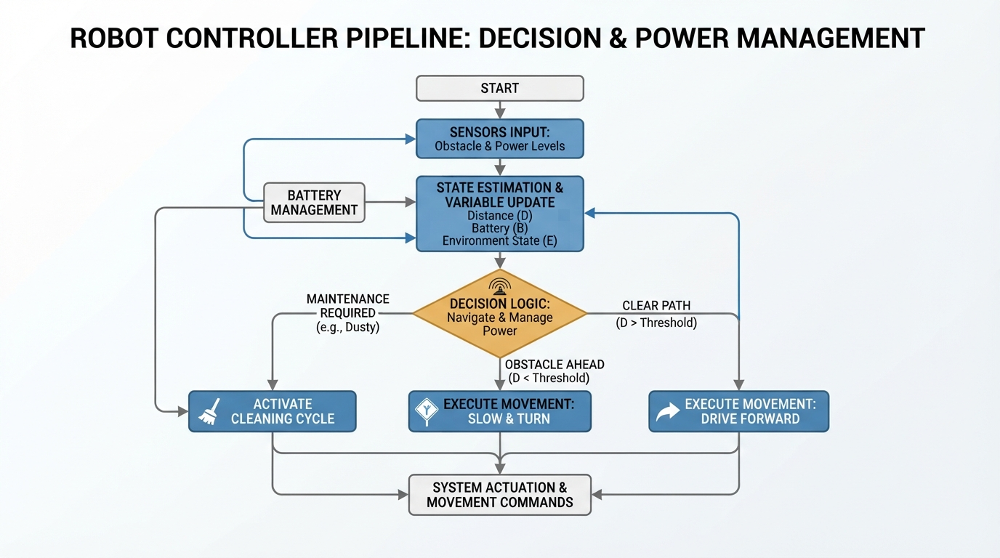
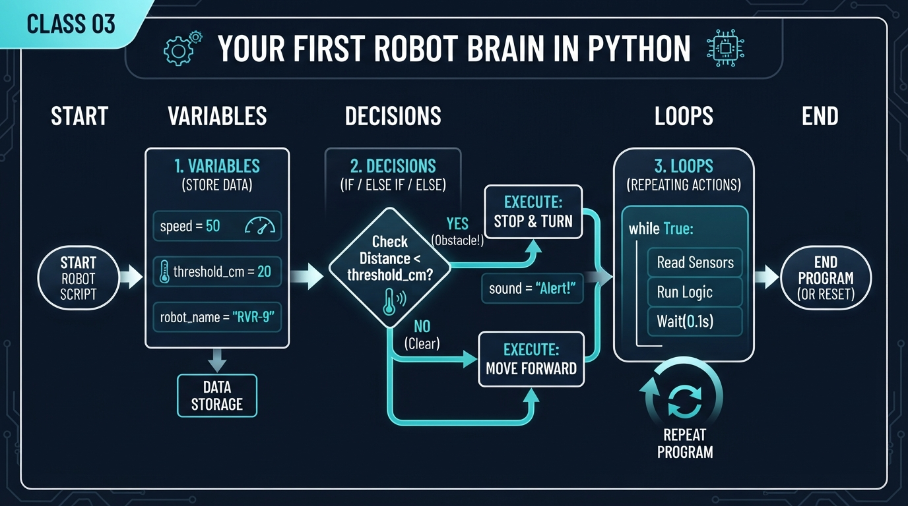
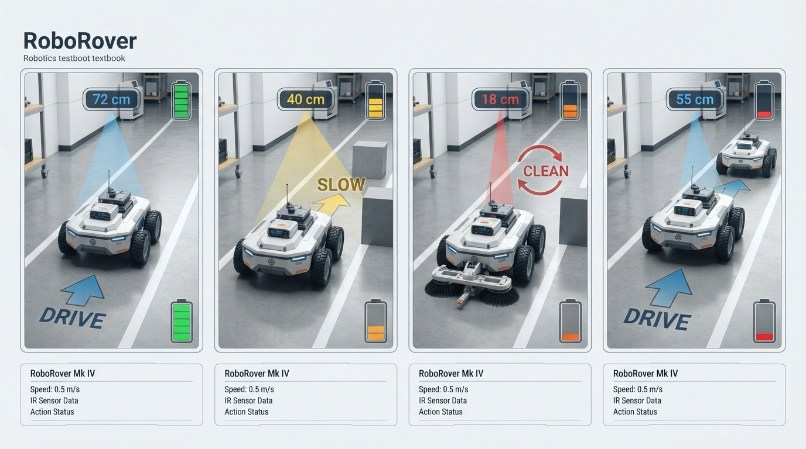
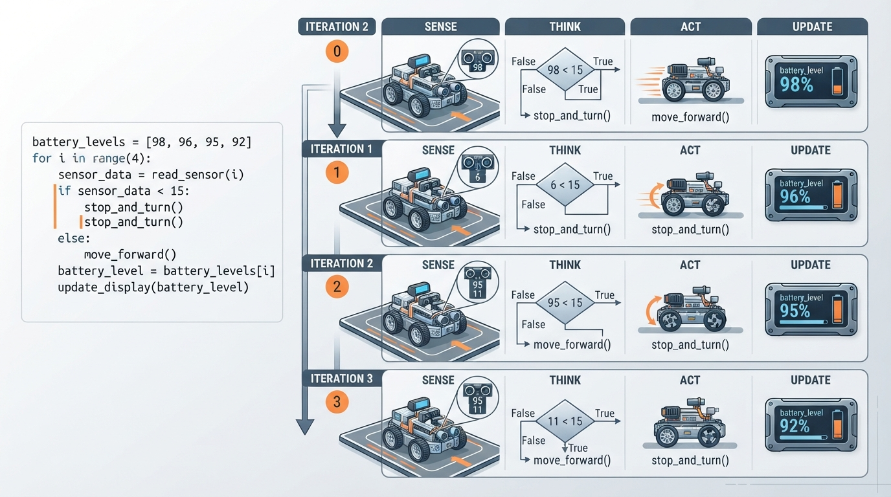

# Class 3: Your First Robot Brain in Python

## Where We Are in the Robotics Journey

In Class 1, we explored what engineers commonly mean by a **robot**: a physical machine whose controlled actuators perform a physical task. In Class 2, RoboRover followed the basic cycle:

> **Sense → Think → Act**

RoboRover sensed something in its environment, selected a response, and used motors or another actuator to change the world.

Today we begin writing the **think** part.

A robot brain does not need to begin with advanced artificial intelligence. It can start with three powerful programming ideas:

1. **Variables** store changing information.
2. **Decisions** choose an action.
3. **Loops** repeat the robot’s behavior.

Together, these ideas let RoboRover respond differently to different sensor readings instead of performing exactly the same action every time.

In the next class, we will study **coordinates**: a formal way for robots to describe where objects and places are in space. Today we will use simple quantities such as battery level, dust amount, and sensor readings without building a complete map.

## Today We Will Learn

By the end of this class, you should be able to:

- explain a variable as a named storage place for a value;
- distinguish assignment from comparison;
- use `if`, `elif`, and `else` to make decisions;
- use a `for` loop to repeat a behavior;
- trace a short robot program by hand;
- explain why real robot programs must handle low battery, noisy sensors, and limited actuators;
- modify a small RoboRover simulation and predict its behavior before running it.

## 2-Minute Recap

Imagine RoboRover has an infrared sensor pointed toward an obstacle.

- **Sense:** the sensor reports a distance.
- **Think:** the controller decides whether to continue or stop.
- **Act:** the motors move or halt the wheels.

The important point is that “think” is not mysterious. It is a sequence of instructions operating on information.

A simple controller might say:

- if the obstacle is far away, drive;
- otherwise, stop.

That is already a decision-making system. It is small, but it has the same basic structure as much larger robot software.

One distinction matters:

- A **sensor reading** describes something measured.
- A **variable** is the program’s named storage location for that information.
- A **decision** uses the stored value to select an action.
- An **actuator command** tells a motor, gripper, light, or other device what to do.

## The Big Idea




**Figure:** Notice how stored information flows through a decision and produces an action that changes the robot's state.

A robot program is like a lab notebook that can update itself.

Suppose RoboRover begins with 30 battery percentage points. After driving, the amount changes. A variable called `battery` can hold the current estimate:

```python
battery = 30.0
print(battery)
```

The equals sign here means:

> Put the value on the right into the named storage place on the left.

It does **not** mean that `battery` and `30.0` are permanently identical.

Later, the program can update it:

```python
battery = 30.0
battery = battery - 4.0
print(battery)
```

This means:

1. look up the current value of `battery`;
2. subtract `4.0`;
3. store the new result back in `battery`.

A decision is a fork in the robot’s reasoning:

```text
                 obstacle distance
                        |
             ┌──────────┴──────────┐
        distance >= 50 cm       otherwise
             |                       |
          drive                    stop
```

A loop is the robot returning to the same instructions repeatedly:

```text
sense → decide → act
  ↑               |
  └──── repeat ───┘
```

This repeated cycle is the first practical form of a robot controller.

## See It in Your Head

### AI-Generated Engineering Visual · Professor OS



**How to read this visual:** Trace the signal or idea from left to right. Match each block to the lesson explanation, then predict what would change if one block produced a wrong value.


Picture RoboRover inside a narrow testing lane.

- On the left is a battery gauge.
- In front of RoboRover is a sensor pointing down the lane.
- A small display shows the current sensor reading.
- Each loop iteration is one “thinking moment.”
- At the end of each iteration, RoboRover either drives, slows, or cleans.

An illustrator could show four snapshots arranged left to right:

1. The sensor reads `72`.
2. RoboRover decides “drive.”
3. Battery decreases.
4. The loop returns to take the next reading.

Then show a second snapshot where the sensor reads `18`. RoboRover decides “clean” rather than “drive.”

The important visual feature is not a human-like robot face. It is the changing information:

```text
sensor reading → decision rule → action → updated battery
```

## Core Concept

### 1. Variables: named information

A variable can contain a number, a word, or a true/false value.

```python
battery = 30.0
mode = "patrol"
obstacle_detected = False

print(battery, mode, obstacle_detected)
```

Here:

- `battery` contains a number;
- `mode` contains text;
- `obstacle_detected` contains a Boolean value, either `True` or `False`.

Good variable names make robot code easier to inspect:

```python
distance_cm = 72.0
motor_power_percent = 40

print(distance_cm, motor_power_percent)
```

The suffix `_cm` reminds us that the distance is measured in centimetres. A number without a unit can be dangerous in engineering.

### 2. Decisions: selecting an action

Python uses a conditional statement:

```python
distance_cm = 72.0

if distance_cm >= 50.0:
    action = "drive"
else:
    action = "stop"

print(action)
```

The indented lines belong to the decision.

Common comparison operators include:

| Operator | Meaning |
|---|---|
| `>` | greater than |
| `<` | less than |
| `>=` | greater than or equal to |
| `<=` | less than or equal to |
| `==` | equal to |
| `!=` | not equal to |

A frequent beginner error is confusing `=` with `==`.

```python
battery = 25.0       # assignment: store a value
is_full = battery == 25.0  # comparison: ask whether they are equal

print(battery, is_full)
```

A robot often needs more than two choices:

```python
distance_cm = 18.0

if distance_cm >= 50.0:
    action = "drive"
elif distance_cm >= 20.0:
    action = "slow"
else:
    action = "clean"

print(action)
```

Python tests the conditions from top to bottom and uses the first true branch.

### 3. Loops: repeating the controller

A `for` loop repeats instructions a known number of times or once for each item in a collection:

```python
for cycle in range(3):
    print("Sense, think, act", cycle)
```

The values produced by `range(3)` are `0`, `1`, and `2`, so the body runs three times.

A loop does not automatically make a robot intelligent. It simply gives the controller repeated opportunities to sense and respond. The quality of the behavior still depends on:

- the sensor data;
- the decision rules;
- the actuator commands;
- safety limits;
- timing and calibration.

## Math Without Fear

Suppose RoboRover has:

- initial battery estimate: \(B_0 = 30.0\) percentage points;
- drive cost: \(4.0\) percentage points per drive action;
- slow cost: \(2.0\) percentage points per slow action;
- clean cost: \(1.0\) percentage point per clean action.

For four actions—drive, slow, clean, drive—the final battery estimate is:

\[
B_{\text{final}} = B_0 - 2C_d - 1C_s - 1C_c
\]

where:

- \(B_{\text{final}}\) is the final battery estimate in percentage points;
- \(B_0\) is the initial battery estimate in percentage points;
- \(C_d = 4.0\) percentage points is the cost of one drive action;
- \(C_s = 2.0\) percentage points is the cost of one slow action;
- \(C_c = 1.0\) percentage point is the cost of one clean action;
- the coefficients `2`, `1`, and `1` count how many times each action occurs.

Therefore:

\[
B_{\text{final}}
= 30.0 - 2(4.0) - 1(2.0) - 1(1.0)
= 19.0
\]

The unit is **percentage points of the program’s battery estimate**, not necessarily a directly measured physical battery percentage. A real battery monitor would need calibration and electrical measurements.

## Worked Robotics Example




**Figure:** The same decision rules produce different actions as the sensor reading changes from cycle to cycle.

RoboRover receives four sensor readings from a front-facing object sensor:

```text
72, 40, 18, 55
```

For this teaching simulation:

- a reading of at least `50 cm` means **drive**;
- a reading from `20 cm` up to but not including `50 cm` means **slow**;
- a reading below `20 cm` means **clean**;
- drive costs `4.0` battery percentage points;
- slow costs `2.0` battery percentage points;
- clean costs `1.0` percentage point.

The reasoning table is:

| Cycle | Reading | Decision | Battery after action |
|---:|---:|---|---:|
| 1 | 72 cm | drive | 26.0 percentage points |
| 2 | 40 cm | slow | 24.0 percentage points |
| 3 | 18 cm | clean | 23.0 percentage points |
| 4 | 55 cm | drive | 19.0 percentage points |

Notice the pattern:

1. the loop selects one sensor reading;
2. the decisions compare that reading with thresholds;
3. the action changes the battery variable;
4. the next loop begins with a new reading.

This is a small example of **state**: information about the robot that changes over time. Battery level is state because later decisions could depend on it.

## Python Lab




**Figure:** Each loop iteration reads one measurement, selects one branch, performs an action, and updates stored information.

Before running the program, predict:

- Which action will happen on each cycle?
- How many times will RoboRover drive?
- What will the final battery estimate be?
- How many cleaning actions will occur?

```python
def run_rover():
    sensor_readings_cm = [72.0, 40.0, 18.0, 55.0]

    battery_points = 30.0
    drive_cost_points = 4.0
    slow_cost_points = 2.0
    clean_cost_points = 1.0

    drive_count = 0
    clean_count = 0

    for cycle_number in range(1, len(sensor_readings_cm) + 1):
        distance_cm = sensor_readings_cm[cycle_number - 1]

        if distance_cm >= 50.0:
            action = "drive"
            battery_points = battery_points - drive_cost_points
            drive_count = drive_count + 1
        elif distance_cm >= 20.0:
            action = "slow"
            battery_points = battery_points - slow_cost_points
        else:
            action = "clean"
            battery_points = battery_points - clean_cost_points
            clean_count = clean_count + 1

        print(
            "Cycle {}: sensor = {:.1f} cm, action = {}, "
            "battery = {:.1f} percentage points".format(
                cycle_number, distance_cm, action, battery_points
            )
        )

    print("Final battery: {:.1f} percentage points".format(battery_points))
    print("Drive actions:", drive_count)
    print("Clean actions:", clean_count)

    # Executable checks verify the numerical claims for this input.
    assert round(battery_points, 1) == 19.0
    assert drive_count == 2
    assert clean_count == 1


if __name__ == "__main__":
    run_rover()
```

### Important lines

```python
sensor_readings_cm = [72.0, 40.0, 18.0, 55.0]
print(sensor_readings_cm)
```

This list represents four measurements collected earlier. In a physical robot, a sensor-reading function might replace the list.

```python
sensor_readings_cm = [72.0, 40.0, 18.0, 55.0]

for cycle_number in range(1, len(sensor_readings_cm) + 1):
    print("Running cycle", cycle_number)
```

This repeats once for every reading. The `+ 1` is needed because the stop value of `range` is not included.

```python
sensor_readings_cm = [72.0, 40.0, 18.0, 55.0]
cycle_number = 1
distance_cm = sensor_readings_cm[cycle_number - 1]

print(distance_cm)
```

Python list positions begin at zero. During cycle 1, the program reads position 0.

```python
distance_cm = 18.0

if distance_cm >= 50.0:
    action = "drive"
elif distance_cm >= 20.0:
    action = "slow"
else:
    action = "clean"

print(action)
```

These branches convert a measurement into an action.

```python
battery_points = 30.0
battery_points = battery_points - 4.0

assert round(battery_points, 1) == 26.0
print("Battery update passed:", battery_points)
```

An assertion is a built-in check. If the program produces a different result, Python reports an error instead of quietly accepting a changed behavior.

## Mini Simulation or Game

Turn the lab into a prediction game.

Change only this line:

```python
sensor_readings_cm = [72.0, 40.0, 18.0, 55.0]
```

Try:

```python
sensor_readings_cm = [15.0, 65.0, 22.0, 49.0]
print(sensor_readings_cm)
```

Before running it, write a four-word action prediction.

Remember the thresholds:

- `65.0` means drive;
- `49.0` means slow, not drive;
- `22.0` means slow;
- `15.0` means clean.

The existing assertions will fail because they verify the original input. That is useful: the assertions are telling you that the expected result must be updated when the experiment changes.

For a fair experiment:

1. predict the action sequence;
2. calculate the battery change by hand;
3. run the program;
4. compare your prediction with the printed trace;
5. update the assertions only after you understand the new result.

You are not merely checking whether Python works. You are testing whether your mental model of the robot brain is correct.

## What Should Happen?

For the original readings, the action sequence should be:

```text
drive → slow → clean → drive
```

The final battery estimate should be `19.0` percentage points, with two drive actions and one clean action. These claims are verified by the assertions in the Python program.

For the modified readings:

```text
[15.0, 65.0, 22.0, 49.0]
```

the action sequence should be:

```text
clean → drive → slow → slow
```

Work out the new battery estimate before running. Do not rely on the original assertions, because they were written for the original sensor list.

## Common Mistakes

### Mistake 1: Treating `=` as a question

This is assignment:

```python
battery_points = 30.0
print(battery_points)
```

This is comparison:

```python
battery_points = 30.0
same_value = battery_points == 30.0
print(same_value)
```

Using the wrong one can produce a syntax error or a decision that does not mean what you intended.

### Mistake 2: Misreading threshold boundaries

The condition:

```python
distance_cm = 50.0

if distance_cm >= 50.0:
    action = "drive"
elif distance_cm >= 20.0:
    action = "slow"
else:
    action = "clean"

print(action)
```

includes exactly `50.0`.

The next condition:

```python
distance_cm = 20.0

if distance_cm >= 50.0:
    action = "drive"
elif distance_cm >= 20.0:
    action = "slow"
else:
    action = "clean"

print(action)
```

includes exactly `20.0`, but it is reached only when the first condition was false. Therefore:

- `50.0` means drive;
- `20.0` means slow;
- `19.9` means clean.

Boundary values deserve deliberate tests.

### Mistake 3: Forgetting indentation

Python uses indentation to show which instructions belong to a branch or loop. A line at the wrong indentation level may change the robot’s behavior.

### Mistake 4: Assuming the sensor is perfect

A real distance sensor may report:

```text
49 cm, 51 cm, 49 cm, 50 cm
```

even when the object has barely moved. RoboRover could switch rapidly between drive and slow. This is a practical failure mode caused by **sensor noise**—small unwanted variations in measurements.

Later, we will study techniques such as filtering and hysteresis. For now, notice the engineering question: what happens when the reading is near a decision boundary?

### Mistake 5: Treating a battery estimate as a battery measurement

The program subtracts fixed costs for teaching. Real energy use depends on motor load, floor friction, acceleration, voltage, temperature, and battery condition.

## Try It Yourself

### Challenge: add a low-battery rule

Modify the program so that RoboRover stops instead of driving when its battery estimate is below `10.0` percentage points.

Use this decision structure:

```python
battery_points = 8.0
distance_cm = 72.0

if battery_points < 10.0:
    action = "stop and recharge"
elif distance_cm >= 50.0:
    action = "drive"
elif distance_cm >= 20.0:
    action = "slow"
else:
    action = "clean"

print(action)
```

Your challenge is to decide where the battery test belongs and how the battery should change for the recharge action.

Test your program with a longer sensor list and trace every cycle by hand first.

**Optional extension:** add a `stop_count` variable. Count how many cycles RoboRover chooses `"stop and recharge"`.

Do not add random behavior yet. Deterministic inputs make it easier to understand the exact effect of each programming change.

## Quick Quiz

1. What is the difference between assignment with `=` and comparison with `==`?

2. For this code, what action occurs when `distance_cm` is exactly `50.0`?

   ```python
distance_cm = 50.0

if distance_cm >= 50.0:
    action = "drive"
elif distance_cm >= 20.0:
    action = "slow"
else:
    action = "clean"

print(action)
   ```

3. Why does a robot controller commonly use a loop?

4. Why might a real robot behave inconsistently when a sensor reading is close to a decision threshold?

## Answers

1. `=` stores a value in a variable. `==` asks whether two values are equal.

2. The action is `"drive"` because `50.0 >= 50.0` is true.

3. A loop lets the controller repeatedly sense, decide, and act as the robot operates.

4. Sensor noise can make nearby readings change from one loop to the next. The robot may then cross the threshold repeatedly and switch actions.

## Real Robot Connection

The Python program is a simplified controller, but its architecture is recognizable in real robotics:

```text
sensor interface → variables/state → decision logic → actuator command
```

A physical RoboRover might obtain distance from an ultrasonic or infrared sensor, then send a speed command to motor drivers. The motor drivers would control electrical power to the motors.

Several engineering realities appear immediately:

- **Latency:** time passes between measuring a distance and commanding a motor.
- **Calibration:** a reported `50 cm` may not equal a true `50 cm`.
- **Saturation:** a motor cannot exceed its physical maximum speed.
- **Mechanical limits:** wheels may slip, jam, or fail to turn equally.
- **Timing:** a loop that runs too slowly may react late.
- **Safety:** stopping should be designed as a safe behavior, not treated as an afterthought.

The program’s `battery_points` variable is also an example of an internal estimate. It is useful for decisions, but it is not automatically truth. Good robotics software distinguishes measured values, estimated values, and commanded values.

This class also separates three ideas that are often confused:

- **Identity:** RoboRover is a physical robot performing a task.
- **Decision authority:** in this simulation, software selects each action.
- **Feedback:** the sensor reading influences the current action.

The loop is using a simple threshold-based feedback pattern because a measured distance affects what RoboRover does next. This is not yet advanced control mathematics; it is an introductory decision rule.

## Vocabulary

- **Variable:** A named place in a program that stores a value.
- **Assignment:** Storing a value in a variable, using `=`.
- **Comparison:** Testing a relationship between values, such as equality or “greater than.”
- **Conditional statement:** Code that chooses among actions based on a condition.
- **Branch:** One possible path through a conditional statement.
- **Loop:** Code that repeats.
- **Iteration:** One pass through a loop.
- **Boolean:** A value with one of two states: `True` or `False`.
- **Threshold:** A boundary value used to trigger a decision.
- **Sensor noise:** Unwanted variation in a sensor’s reported measurements.
- **State:** Information about a system that can change over time and affect later behavior.
- **Actuator command:** An instruction sent to a device that produces physical motion or another physical effect.
- **Feedback:** A measured state or output influences a current or future control action.

## Further Learning

Useful search terms for reinforcing today’s ideas:

- Python 3 `if`, `elif`, and `else`
- Python 3 `for` loops and `range`
- Python Boolean expressions
- beginner robotics sense think act
- sensor threshold robot controller
- robotics sensor noise demonstration

When reading examples, ask three questions:

1. What information is stored?
2. What condition selects the action?
3. What repeats, and when does it stop?

Those questions are more valuable than memorizing individual code fragments.

## Next Class

RoboRover can now store sensor information, make threshold-based decisions, and repeat its behavior.

But a new problem appears: how should the program describe **where** RoboRover is?

In Class 4, **Coordinates: How Robots Describe Space**, we will introduce positions such as `(x, y)`. You will learn how a robot can describe a location on a floor, how a coordinate system has an origin and directions, and how sensor observations can be connected to places in the environment.

Today’s variables hold quantities such as distance and battery. Next class, variables will begin representing **locations in space**.
