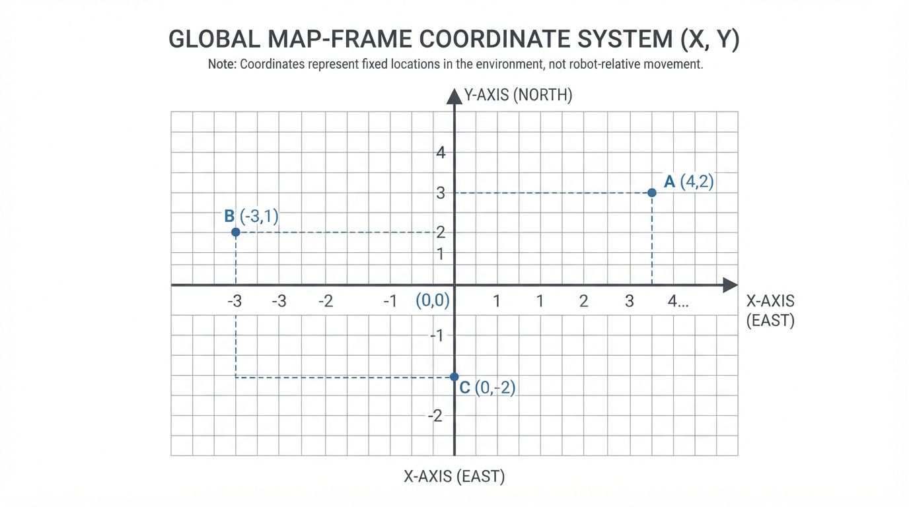
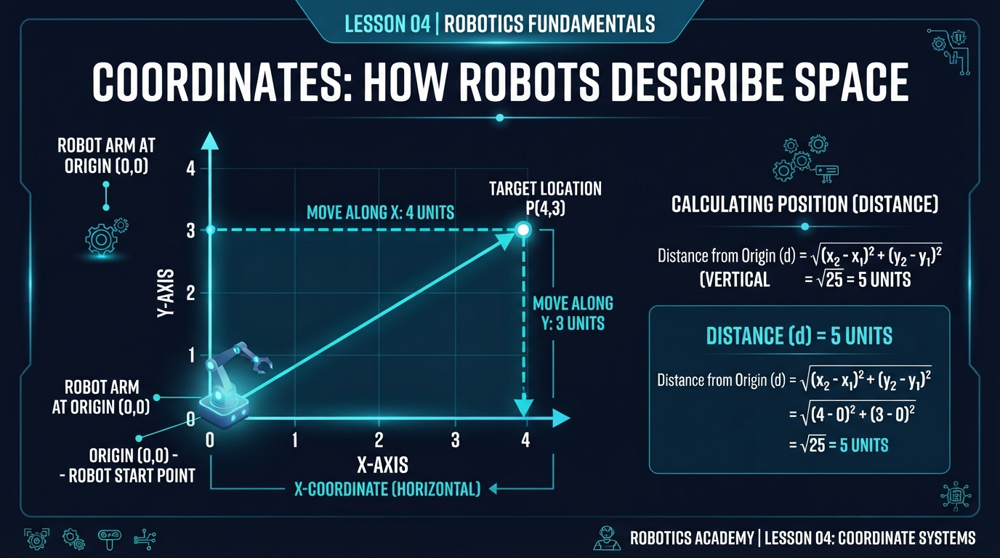
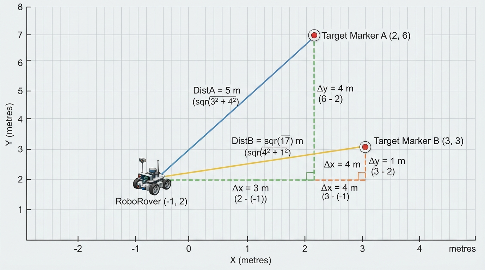
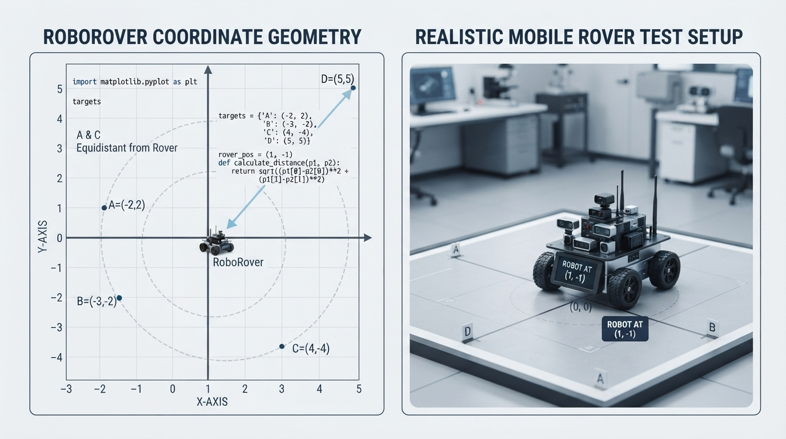

# Class 4: Coordinates: How Robots Describe Space

## Where We Are in the Robotics Journey

In Class 1, we described what makes a machine commonly count as a robot. In Class 2, RoboRover met sensors, actuators, and controllers. In Class 3, you wrote RoboRover’s first simple Python “brain”: a program that could receive information and choose an action.

But a robot needs more than the instruction “move over there.”

Where is “there”? How far away is it? Is the target in front of RoboRover, behind it, or to one side?

Robots answer these questions using **coordinates**. Coordinates are numbers that describe location. Today we will give RoboRover a simple map: a flat **x-y plane**.

The next class will build directly on this one. Once RoboRover can describe where it is and how far away something is, we can study **distance and speed** in more detail.

## Today We Will Learn

By the end of this class, you should be able to:

- explain the purpose of an origin and coordinate axes;
- describe a point using an ordered pair \((x, y)\);
- distinguish positive and negative directions;
- calculate distance from the origin;
- calculate the straight-line Euclidean distance between two points on a flat Cartesian map;
- plot RoboRover and targets on a simple coordinate map;
- recognize practical problems such as incorrect scale, drifting position, and confusing robot-relative directions with map directions.

## 2-Minute Recap

A program is a sequence of instructions. A robot controller uses instructions and information from the robot’s environment to select actions.

Imagine this short decision:

```text
IF the target is close:
    stop
ELSE:
    move
```

The word **close** requires a measurement. A distance measurement might be supplied by a sensor, calculated from a map, or estimated from previous movement.

Today we will represent location with numbers so that a program can reason about space instead of using vague words such as “near,” “left,” or “over there.”

**Prediction:** If RoboRover is at location \((3, 4)\) on a map, which number tells us its horizontal position: 3 or 4?

The answer is 3. In an ordered pair \((x, y)\), the first number is \(x\), the horizontal coordinate. The second number is \(y\), the vertical coordinate.

## The Big Idea




**Figure:** The first coordinate tells horizontal position; the second tells vertical position.

Think of a coordinate map as a tiled floor with two rulers crossing at one special point.

That special point is the **origin**. We write it as:

\[
(0, 0)
\]

The horizontal ruler is the **x-axis**.

- Positive \(x\) points to the right.
- Negative \(x\) points to the left.

The vertical ruler is the **y-axis**.

- Positive \(y\) points upward.
- Negative \(y\) points downward.

A location is written as an ordered pair:

\[
(x, y)
\]

The order matters. The point \((4, 2)\) is not the same as \((2, 4)\).

For this lesson, treat RoboRover as a **point location** on the map. In a physical system, the coordinates might instead refer to the rover’s centre, a defined reference point, or a sensor location. We will specify the point being modelled when that distinction matters.

Suppose one coordinate unit represents one metre. Then:

- \((4, 2)\) means 4 metres right and 2 metres up from the origin.
- \((-3, 1)\) means 3 metres left and 1 metre up.
- \((0, -2)\) means directly 2 metres below the origin.

An illustrator could show this as a large cross-shaped map, with arrows on the positive axes, evenly spaced grid lines, a labelled origin, and RoboRover drawn at several possible points.

Coordinates do not automatically tell us which way RoboRover’s physical body is facing. A map coordinate is a location in the chosen map. RoboRover may be facing north, east, or some other direction while still occupying the same coordinate.

## See It in Your Head

### AI-Generated Engineering Visual · Professor OS



**How to read this visual:** Trace the signal or idea from left to right. Match each block to the lesson explanation, then predict what would change if one block produced a wrong value.


Picture a warehouse floor viewed from above.

Place a small blue sticker at the origin. Draw a red tape line horizontally through it and label that the x-axis. Draw a green tape line vertically through it and label that the y-axis.

Now imagine RoboRover at \((-2, 3)\):

1. Start at the origin.
2. Move 2 grid squares left.
3. Move 3 grid squares up.
4. Mark that position.

The movement description “left 2, up 3” is useful for finding the point, but the coordinate \((-2, 3)\) is the compact mathematical description.

Now imagine the target at \((1, 7)\). RoboRover and the target are separated by:

- 3 metres horizontally, because \(1 - (-2) = 3\);
- 4 metres vertically, because \(7 - 3 = 4\).

Those two differences form a right triangle. The direct distance between the two locations is the triangle’s diagonal.

## Core Concept

### Coordinates describe location

A coordinate system needs four choices:

1. **Origin:** where \((0,0)\) is placed;
2. **x direction:** which way counts as positive horizontally;
3. **y direction:** which way counts as positive vertically;
4. **scale:** how much physical distance one coordinate unit represents.

If the scale is 1 metre per unit, then the coordinate \((5, 2)\) represents 5 metres right and 2 metres up. If the scale is 10 centimetres per unit, the same numbers represent 50 centimetres right and 20 centimetres up.

The numbers alone are not enough. RoboRover’s software must know the map’s units and orientation.

### Distance is not the same as a coordinate

A coordinate can be negative because it describes a direction relative to the origin. Distance is a size: it tells us how far apart two locations are. It is never negative.

For a point \((x,y)\), the straight-line distance from the origin is:

\[
d = \sqrt{x^2+y^2}
\]

Here:

- \(d\) is distance from the origin, in the same length unit as \(x\) and \(y\);
- \(x\) is the horizontal coordinate;
- \(y\) is the vertical coordinate;
- \(\sqrt{\phantom{x}}\) means square root.

This is the Pythagorean theorem applied to a coordinate map.

### Distance between two points

For point \(A=(x_1,y_1)\) and point \(B=(x_2,y_2)\), the straight-line distance is:

\[
d_{AB}=\sqrt{(x_2-x_1)^2+(y_2-y_1)^2}
\]

The symbols mean:

- \(d_{AB}\): distance from point \(A\) to point \(B\);
- \(x_1,y_1\): coordinates of point \(A\);
- \(x_2,y_2\): coordinates of point \(B\);
- all coordinates use the same unit, such as metres.

The subtraction finds the **signed** horizontal and vertical coordinate differences:

\[
\Delta x=x_2-x_1,\qquad \Delta y=y_2-y_1
\]

A signed difference can be negative because it also records direction. The **nonnegative horizontal separation** is:

\[
|\Delta x|=|x_2-x_1|
\]

Similarly, the nonnegative vertical separation is \(|\Delta y|\). The distance formula squares these differences, so the signs do not affect the final distance.

This formula gives **Euclidean straight-line distance** on a flat Cartesian map. It does not necessarily give the distance a robot can drive if walls, shelves, safety zones, or other obstacles require a detour. Finding a feasible route is a later path-planning problem.

## Math Without Fear

Let us use a small, physical example.

RoboRover is at:

\[
A=(1.2\text{ m}, -0.5\text{ m})
\]

A charging station is at:

\[
B=(4.2\text{ m}, 1.5\text{ m})
\]

Here, each ordered pair represents the rover’s centre or the charging station’s designated reference point in the map frame.

First calculate the signed horizontal difference:

\[
\Delta x = 4.2\text{ m} - 1.2\text{ m}=3.0\text{ m}
\]

The horizontal separation is \(|\Delta x|=3.0\text{ m}\). The symbol \(\Delta\), pronounced “delta,” means “change in” or “difference.”

Now calculate the signed vertical difference:

\[
\Delta y = 1.5\text{ m} - (-0.5\text{ m})=2.0\text{ m}
\]

The vertical separation is \(|\Delta y|=2.0\text{ m}\). The negative sign matters in the calculation: the station is 2 metres higher than RoboRover.

Now apply the distance formula:

\[
d_{AB}=\sqrt{(3.0\text{ m})^2+(2.0\text{ m})^2}
\]

\[
d_{AB}=\sqrt{9.0\text{ m}^2+4.0\text{ m}^2}
\]

\[
d_{AB}=\sqrt{13.0\text{ m}^2}\approx3.61\text{ m}
\]

The interpretation is more important than the arithmetic: the charging station is about 3.61 metres away in a straight line on the map. A real driving route could be longer if obstacles block that direct segment.

Notice the units. When metres are squared, we get square metres inside the square root. The square root returns metres, which is the correct unit for distance.

## Worked Robotics Example




**Figure:** Comparing both horizontal and vertical separation reveals which target is truly closer.

RoboRover is checking three marked floor locations. The map uses metres, and the origin is the centre of the test area. RoboRover’s coordinate represents its centre point.

- RoboRover: \(R=(-1, 2)\text{ m}\)
- blue marker: \(B=(2, 6)\text{ m}\)
- yellow marker: \(Y=(3, 3)\text{ m}\)

Which marker is closer to RoboRover?

For the blue marker:

\[
d_{RB}=\sqrt{(2-(-1))^2+(6-2)^2}
\]

\[
d_{RB}=\sqrt{3^2+4^2}=\sqrt{25}=5\text{ m}
\]

For the yellow marker:

\[
d_{RY}=\sqrt{(3-(-1))^2+(3-2)^2}
\]

\[
d_{RY}=\sqrt{4^2+1^2}=\sqrt{17}\text{ m}\approx4.12\text{ m}
\]

Therefore, the yellow marker is closer. The difference is not because it has the smaller x-coordinate or the smaller y-coordinate. Distance depends on both coordinates together.

These are straight-line map distances. A robot might need to travel farther around an obstacle to reach either marker.

A top-down diagram should show RoboRover, both markers, a horizontal separation line, a vertical separation line, and the diagonal distance to each marker. The two right triangles make the calculation visible without overlapping RoboRover or obscuring the coordinate labels.

## Python Lab




**Figure:** A program can calculate distances and draw the same coordinate relationships RoboRover uses in its map.

The program below defines RoboRover separately from four target points. It treats each coordinate as a point location in map units, calculates each target’s Euclidean straight-line distance from RoboRover, and verifies the exact values expected for the chosen coordinates.

The coordinates are map values supplied by the program; they are not automatically measurements collected from a physical robot. In a real system, sensors or localization software would estimate these values and could introduce error.

This lab uses the third-party `matplotlib` library. If it is not already installed, install it in a terminal with:

```text
python -m pip install matplotlib
```

If your learning environment already provides `matplotlib`, no installation is needed.

Before running the program, predict:

1. Which target is closest to RoboRover?
2. Which target is farthest?
3. Which two targets are exactly 5 units from RoboRover?

```python
import math
import matplotlib.pyplot as plt
from matplotlib.patches import Circle

# Each coordinate represents a point location in the map frame.
# For RoboRover, this point is its modelled centre.
rover = (1, -1)

targets = {
    "A": (4, 3),
    "B": (-1, 1),
    "C": (1, -6),
    "D": (7, 7)
}

distances = {}

for name, (x, y) in targets.items():
    horizontal_difference = x - rover[0]
    vertical_difference = y - rover[1]
    distance = math.sqrt(
        horizontal_difference ** 2 + vertical_difference ** 2
    )
    distances[name] = distance
    print("{}: ({}, {}) -> {:.3f} units from RoboRover".format(
        name, x, y, distance
    ))

assert math.isclose(distances["A"], 5.0)
assert math.isclose(distances["B"], math.sqrt(8.0))
assert math.isclose(distances["C"], 5.0)
assert math.isclose(distances["D"], 10.0)

closest_name = min(distances, key=distances.get)
farthest_name = max(distances, key=distances.get)

print("Closest target: {}".format(closest_name))
print("Farthest target: {}".format(farthest_name))
print("Verified: A and C are exactly 5 units from RoboRover.")

assert closest_name == "B"
assert farthest_name == "D"

fig, ax = plt.subplots()
ax.axhline(0, color="black", linewidth=0.8)
ax.axvline(0, color="black", linewidth=0.8)

for name, (x, y) in targets.items():
    ax.scatter(x, y, marker="o", s=80)
    ax.text(x + 0.15, y + 0.15, name)

rover_x, rover_y = rover
ax.scatter(
    rover_x, rover_y, color="red", marker="X", s=120,
    label="RoboRover"
)
ax.text(rover_x + 0.15, rover_y + 0.15, "RoboRover")

ax.scatter(0, 0, color="black", marker="+", s=100, label="origin")
ax.text(0.15, 0.15, "origin")

# A and C are both exactly 5 units from RoboRover.
# Draw their shared distance boundary to make that equality visible.
distance_boundary = Circle(
    (rover_x, rover_y),
    radius=5.0,
    fill=False,
    linestyle="--",
    linewidth=1.2,
    color="tab:purple",
    label="5-unit boundary"
)
ax.add_patch(distance_boundary)

ax.set_title("RoboRover's Coordinate Map")
ax.set_xlabel("x coordinate (units)")
ax.set_ylabel("y coordinate (units)")
ax.set_aspect("equal", adjustable="box")
ax.set_xlim(-5, 8)
ax.set_ylim(-7, 8)
ax.grid(True)
ax.legend()
plt.show()
```

The `targets` dictionary stores each target label with an \((x,y)\) pair. The loop unpacks each pair into `x` and `y`. The expressions

```python
rover = (1, -3)
target = (5, 0)

horizontal_difference = target[0] - rover[0]
vertical_difference = target[1] - rover[1]
```

implement the two coordinate differences in the distance-between-points equation. This short fragment illustrates the calculation separately; it does not replace the `rover` and `targets` values used by the main plotted example.

`math.isclose` is used because square roots often produce decimal approximations. The `assert` statements act as built-in checks: if the program reaches the later print statements, the calculated values passed the tests.

The `Circle` patch is centred on RoboRover and has radius 5 map units. Because A and C both have distance 5, their plotted points lie on this circle. The stable x and y limits make repeated experiments easier to compare; the equal aspect ratio ensures that the circle is displayed as a circle rather than an ellipse.

The graph uses `axhline` and `axvline` to draw the axes. `set_aspect("equal")` is important: one unit horizontally should look the same size as one unit vertically. Without it, the picture could stretch the geometry and mislead your eyes. RoboRover uses an `X` marker, while targets use circular markers and text labels, so the plotted identities do not depend on color alone.

## Mini Simulation or Game

Turn the Python lab into a coordinate guessing game.

Before changing the code, choose a new point for RoboRover, such as:

```python
experiment_rover = (1, -3)
```

Then choose a target:

```python
experiment_target = (5, 0)
```

Calculate the distance by hand before running a program:

\[
d=\sqrt{(5-1)^2+(0-(-3))^2}
=\sqrt{4^2+3^2}
=5
\]

Now add this short experiment below the original calculations, before `plt.show()`. The distinct variable names keep this experiment separate from the main plotted example:

```python
import math

experiment_rover = (1, -3)
experiment_target = (5, 0)

horizontal_difference = (
    experiment_target[0] - experiment_rover[0]
)
vertical_difference = (
    experiment_target[1] - experiment_rover[1]
)

experiment_distance = math.sqrt(
    horizontal_difference ** 2 + vertical_difference ** 2
)

print("Experiment distance: {:.3f} units".format(
    experiment_distance
))

assert math.isclose(experiment_distance, 5.0)
```

Change `experiment_rover` and `experiment_target` to other integer coordinates. Predict first, calculate second, and run third.

Try points with:

- the same x-coordinate;
- the same y-coordinate;
- one negative coordinate;
- both coordinates negative.

For a particularly useful test, swap the two points. The signs of the differences will change, but the distance should remain the same. This is a mathematical property of distance, not a special feature of Python.

## What Should Happen?

For the four targets and the separately defined RoboRover:

- RoboRover is at \((1,-1)\).
- A is at \((4,3)\), so its distance from RoboRover is 5 units.
- B is at \((-1,1)\), so its distance from RoboRover is \(\sqrt{8}\), approximately 2.828 units.
- C is at \((1,-6)\), so its distance from RoboRover is 5 units.
- D is at \((7,7)\), so its distance from RoboRover is 10 units.

The closest target should be B, and the farthest should be D. A and C should be exactly the same distance from RoboRover.

The graph should show a circle centred on RoboRover with radius 5 units. A and C should lie on that circle, providing a visual indication that they are equally distant from RoboRover. They are not in the same direction, but they are equally far away. D lies farther out, while B lies closest.

If your plotted axes look stretched, check whether `ax.set_aspect("equal")` is present. The program also sets fixed axis limits so that repeated runs use a comparable viewing area.

## Common Mistakes

### Reversing the order

Writing \((y,x)\) instead of \((x,y)\) moves the point to a different location. Always read the first coordinate horizontally and the second vertically.

### Treating negative as “bad”

A negative coordinate is not an error. It simply means the point is on the negative side of an axis.

### Confusing signed difference with separation

A calculation such as:

\[
\Delta x=-1-2=-3\text{ m}
\]

describes both the horizontal difference and its direction. The horizontal separation is the nonnegative magnitude:

\[
|\Delta x|=3\text{ m}
\]

The negative sign means the target is to the left, not that the separation is negative.

### Adding coordinate values to find distance

For \((3,4)\), \(3+4=7\), but the straight-line distance from the origin is 5. The diagonal distance requires the square-root formula.

### Confusing straight-line distance with driving distance

The distance formula measures the direct Euclidean separation between two point locations on the map. It is not necessarily the distance a robot must drive around obstacles. A route planner may need to find a longer collision-free path.

### Forgetting parentheses with negative values

The vertical difference from \(y=-0.5\) to \(y=1.5\) is:

\[
1.5-(-0.5)=2.0
\]

Dropping the parentheses can accidentally turn subtraction of a negative number into subtraction of a positive number.

### Assuming a map is automatically accurate

A real robot may estimate its coordinates by counting wheel rotation. Wheels can slip, surfaces can be uneven, and small errors can accumulate. A robot may believe it is at \((4,2)\) while it is physically at \((3.8,2.2)\). Coordinates are a model of location, not a magical guarantee.

## Try It Yourself

### Challenge: RoboRover’s inspection points

RoboRover starts at:

\[
R=(-2,1)\text{ m}
\]

Three inspection points are:

- \(P=(1,5)\text{ m}\)
- \(Q=(2,2)\text{ m}\)
- \(S=(-5,-3)\text{ m}\)

Calculate the straight-line distance from RoboRover to each point. Identify the nearest point.

Show:

1. \(\Delta x\) and \(\Delta y\) for each point;
2. the distance equation;
3. the result rounded to two decimal places;
4. a sentence interpreting the nearest point.

For checking, the expected distances are:

- \(RP=\sqrt{3^2+4^2}=5.00\text{ m}\);
- \(RQ=\sqrt{4^2+1^2}=\sqrt{17}\approx4.12\text{ m}\);
- \(RS=\sqrt{(-3)^2+(-4)^2}=5.00\text{ m}\).

Therefore, \(Q\) is nearest, at \(\sqrt{17}\approx4.12\text{ m}\).

**Optional extension:** Write a Python program that stores the three points in a dictionary, calculates the distances, and uses `min()` to identify the nearest point. Add an assertion for your nearest-point result after checking your arithmetic.

Do not worry about deciding the order in which RoboRover should visit the points. That is a later planning topic. Today’s goal is describing locations and measuring straight-line separation.

## Quick Quiz

1. In the coordinate \((-4, 3)\), what do the numbers \(-4\) and \(3\) mean?

2. What is the origin, and how is it written?

3. RoboRover is at \((0,0)\) and a beacon is at \((6,8)\), with one coordinate unit equal to one metre. What is the beacon’s straight-line distance from RoboRover?

4. RoboRover is at \((2,-1)\) and a target is at \((-1,3)\). Is the horizontal separation 1 metre or 3 metres? What is the full straight-line distance?

## Answers

1. \(-4\) means 4 units in the negative x direction, or left if positive x points right. \(3\) means 3 units in the positive y direction, or up if positive y points upward.

2. The origin is the reference point where the axes cross. It is written \((0,0)\).

3. Using metres:

\[
d=\sqrt{6^2+8^2}\text{ m}
=\sqrt{36+64}\text{ m}
=\sqrt{100}\text{ m}
=10\text{ m}
\]

4. The signed horizontal difference is:

\[
\Delta x=-1-2=-3\text{ m}
\]

Its magnitude, and therefore the horizontal separation, is:

\[
|\Delta x|=3\text{ m}
\]

The negative sign tells us the target is to the left. The full distance is:

\[
d=\sqrt{(-3)^2+(3-(-1))^2}\text{ m}
\]

\[
d=\sqrt{9+16}\text{ m}=5\text{ m}
\]

## Real Robot Connection

A coordinate map appears in many robotics systems:

- a mobile robot can record where it believes it is;
- a robotic arm can describe the position of a tool or object;
- a warehouse robot can represent shelves and loading points;
- a vision system can locate an object in an image or mapped workspace.

However, professional systems must define more than two numbers. They also need a **reference frame**, meaning a clearly defined coordinate system. In this lesson, the fixed room or map coordinate system is a simplified **world frame**. The robot’s own coordinate system, which moves and rotates with the robot, is a simplified **body frame**. A position described in the body frame is relative to the robot; a position described in the world frame is relative to the fixed map. Converting between these frames also requires the robot’s orientation. These two-dimensional examples simplify the three-dimensional and orientation-related details used in professional robotics.

The coordinates in the lab are map-frame locations. They are not robot-relative directions such as “two metres ahead and one metre to the left.” Converting a robot-relative observation into a world-frame point requires the robot’s orientation and will be treated in a later lesson.

Sensors and movement introduce uncertainty. A camera may misjudge an object’s position. Wheel motion may not equal actual floor motion. Measurements may arrive late. These issues will matter more when we study movement, speed, and control.

For now, remember the engineering habit: whenever you see a coordinate, ask, “Relative to which origin, in which direction, and using what units?”

## Vocabulary

- **Coordinate:** A number, or set of numbers, used to describe a location.
- **x-axis:** The horizontal reference line in a two-dimensional coordinate system.
- **y-axis:** The vertical reference line in a two-dimensional coordinate system.
- **Origin:** The reference point where the axes meet, written \((0,0)\).
- **Ordered pair:** Two values written in a fixed order, \((x,y)\), describing a point.
- **Coordinate system:** A chosen origin, directions, and scale used to describe locations.
- **Distance:** The nonnegative amount of separation between two locations.
- **Euclidean distance:** Straight-line distance between point locations in a flat Cartesian coordinate map.
- **Signed difference:** A coordinate difference such as \(\Delta x=x_2-x_1\), whose sign records direction.
- **Separation:** The nonnegative magnitude of a coordinate difference, such as \(|\Delta x|\), or the distance between locations.
- **Reference frame:** The coordinate system relative to which a position or motion is described.
- **World frame:** A reference frame treated as fixed to a room, map, or other environment.
- **Body frame:** A reference frame attached to and moving with the robot.
- **RoboRover:** Our continuing learning robot, used to connect mathematical ideas to physical machines.

## Further Learning

For additional practice, look for learning resources using search terms such as:

- “Python matplotlib scatter plot coordinates”
- “Pythagorean theorem distance between two points”
- “robot coordinate frames beginner”
- “robotics position and reference frame introduction”

When reading about robotics, pay attention to whether a source is discussing a robot’s position relative to itself, a room, a map, or a sensor. The same physical point can have different numerical coordinates in different reference frames.

## Next Class

In Class 5, **Distance and Speed**, RoboRover will stop treating distance as only a static separation between two points. We will ask how long a movement takes and how quickly the robot travels.

Coordinates will provide the “where.” Distance will provide the “how far.” Speed will connect distance with time.
