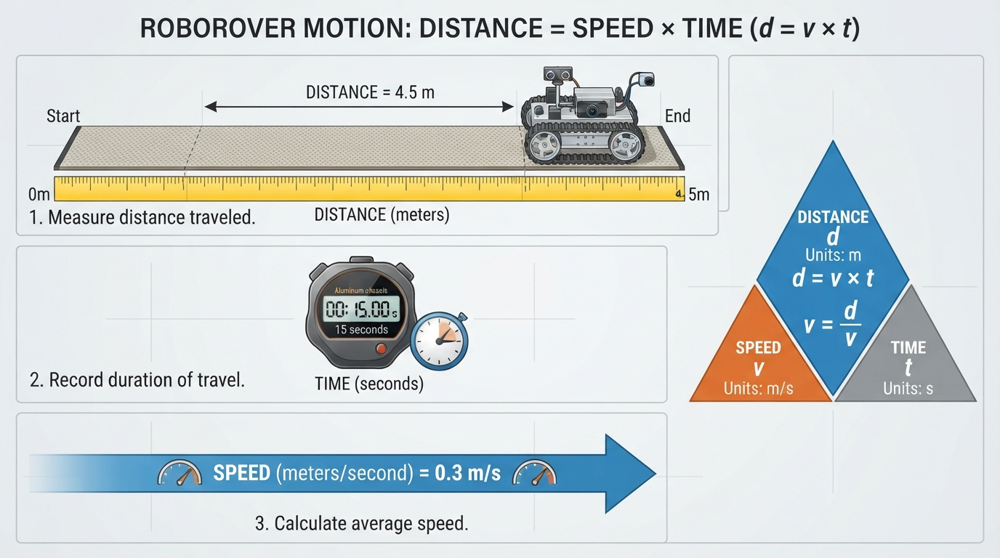
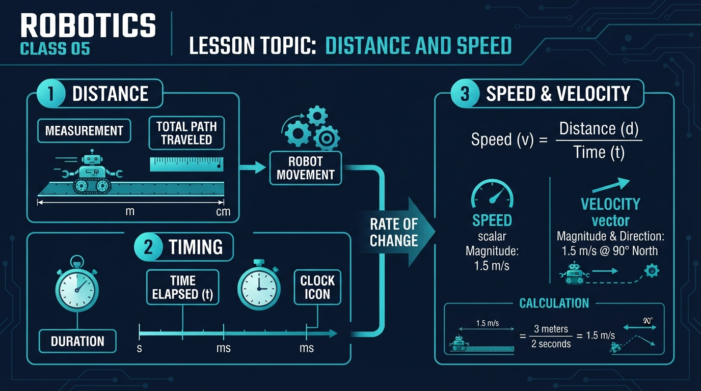
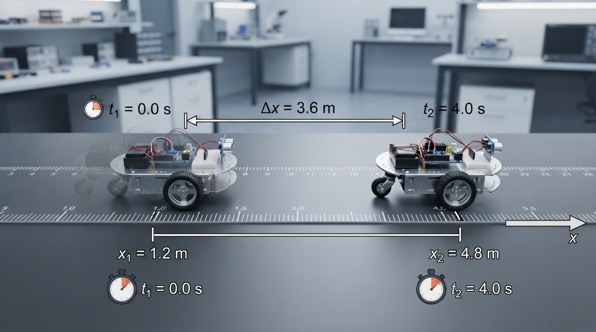
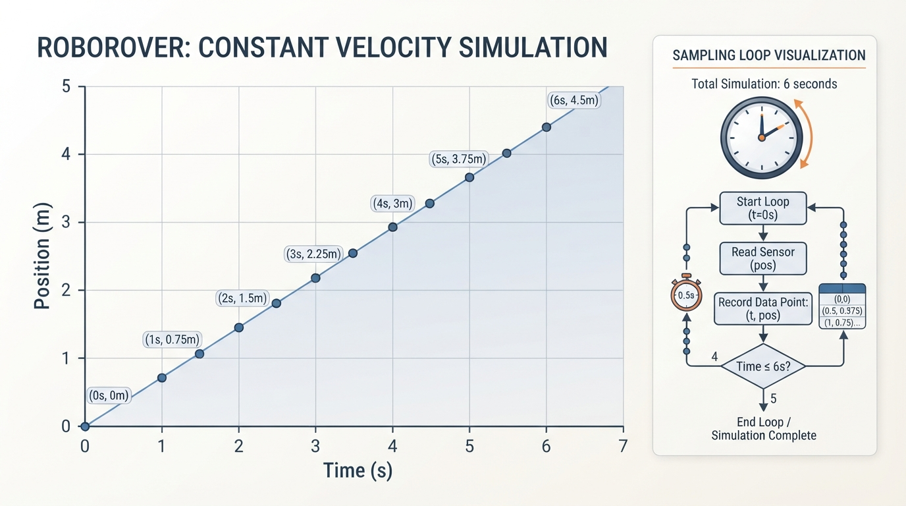

# Class 5: Distance and Speed

## Where We Are in the Robotics Journey

In Class 4, RoboRover learned to describe **where** it is using coordinates. A coordinate such as \((2.0\text{ m}, 1.5\text{ m})\) tells us position: RoboRover’s location relative to a chosen origin.

But a robot must also describe motion:

- How far did it travel?
- How long did the movement take?
- How quickly did it move?
- Which direction did it move?
- When should it reach a target?

Today we connect position to motion. We will begin with a simple constant-speed model, then examine why real robots differ from that ideal.

Next class, we will study **electricity for roboticists**, including the electrical energy that motors and sensors need. Speed and timing describe motion, but they do not by themselves determine how much mechanical work a motor performs. Mechanical work also depends on force and displacement; motor electrical input, mechanical power, and energy are related but distinct concepts.

## Today We Will Learn

By the end of this class, you should be able to:

1. Choose sensible units for robot measurements.
2. Calculate average speed from distance and time.
3. Distinguish speed from velocity.
4. Distinguish route distance from displacement when a robot turns or reverses.
5. Use timing to predict when RoboRover reaches a point.
6. Build a simple motion simulation in Python.
7. Explain why real robots do not move at perfectly constant speed.
8. Distinguish a commanded motor setting from a measured or calibrated velocity.

## 2-Minute Recap

A coordinate system gives a robot a map-like language.

- The **origin** is the reference point, often written \((0,0)\).
- The horizontal coordinate is commonly called \(x\).
- The vertical coordinate is commonly called \(y\).
- A position such as \((3\text{ m}, 2\text{ m})\) means “3 meters in the positive \(x\)-direction and 2 meters in the positive \(y\)-direction.”

Imagine RoboRover starting at \((1\text{ m}, 1\text{ m})\) and ending at \((4\text{ m}, 1\text{ m})\). The coordinates tell us where it started and ended, but not how long the trip took.

Today adds the missing timing information.

## The Big Idea



**Figure:** Distance, speed, and time are three views of the same motion event.

For a constant-speed trip, or when speed means average speed over the interval:

\[
\text{distance}=\text{average speed}\times\text{elapsed time}
\]

This relationship is used as a constant-speed model in the simulation later in this class. For motion whose speed changes, it describes the total distance when “average speed” means total distance divided by total elapsed time.

If you know any two quantities, you can calculate the third:

\[
\text{average speed}=\frac{\text{distance}}{\text{elapsed time}}
\]

\[
\text{elapsed time}=\frac{\text{distance}}{\text{average speed}}
\]

Think of a delivery robot traveling along a hallway.

- Distance answers: “How much floor did it cross?”
- Time answers: “How long did the trip last?”
- Average speed answers: “How quickly did it cover the floor on average?”

When inspecting the figure, identify the measured distance, the elapsed time, and the direction of the motion arrow. Check that the displayed units can be combined using the equation above.

## See It in Your Head

### AI-Generated Engineering Visual · Professor OS



**How to read this visual:** Identify the measured quantities, read their units, and find the equation connecting distance, speed, and time. Check whether the displayed values satisfy that equation. Do not assume that the left-to-right layout represents a physical signal flow.

Picture a straight test track marked every \(1\text{ m}\):

```text
0 m       1 m       2 m       3 m       4 m
|---------|---------|---------|---------|
RoboRover                                      target
```

Suppose RoboRover moves from \(0\text{ m}\) to \(4\text{ m}\) in \(5\text{ s}\).

Its average speed is:

\[
\frac{4\text{ m}}{5\text{ s}}=0.8\text{ m/s}
\]

The word **average** matters. RoboRover might start slowly, speed up, slow down, or stop briefly. The calculation summarizes the whole trip.

Now imagine arrows:

- A large arrow pointing right means motion in the positive direction.
- A large arrow pointing left means motion in the negative direction.
- A longer arrow can represent a greater speed, if the diagram’s scale is consistent.

This leads to an important distinction:

- **Speed** tells how fast something moves. It has size but no direction.
- **Velocity** tells how fast something moves and in which direction.

In one-dimensional motion, a signed scalar such as \(+0.6\text{ m/s}\) can represent velocity along an axis. In two or three dimensions, velocity is a vector with components and a direction. In everyday conversation, people often use “speed” and “velocity” interchangeably. In robotics, engineers usually keep them separate.

To connect average and instantaneous velocity, imagine a position-time graph. The slope from the beginning to the end of an interval gives average velocity:

\[
\bar v_x=\frac{\Delta x}{\Delta t}
\]

The slope over a very short interval near one time gives an estimate of instantaneous velocity at that moment. A straight line has the same slope everywhere, so its average and instantaneous velocities are equal in the constant-velocity model.

## Core Concept

### Units are part of the measurement

A number without a unit is incomplete.

For example:

- \(3\text{ m}\) is a distance.
- \(3\text{ s}\) is a time.
- \(3\text{ m/s}\) is a speed.
- \(3\text{ cm/s}\) is also a speed, but a much smaller one.

Common robotics units include:

| Quantity | Common units | Meaning |
|---|---|---|
| Distance or position | millimeter (mm), centimeter (cm), meter (m) | How far or where |
| Time | millisecond (ms), second (s), minute (min) | How long |
| Average speed | mm/s, cm/s, m/s | Total distance traveled per unit of elapsed time |
| Velocity | m/s with a direction | Speed plus direction |

A small wheeled robot may move at a few hundred millimeters per second. A larger mobile robot may be described in meters per second.

### Dimensional analysis

Units also show why the motion equation works:

\[
(\text{m/s})(\text{s})=\text{m}
\]

The seconds cancel:

\[
\frac{\text{m}}{\text{s}}\times\text{s}=\text{m}
\]

Therefore, multiplying a speed in meters per second by a time in seconds produces a distance in meters.

### Unit conversion

There are \(100\text{ cm}\) in \(1\text{ m}\). Therefore:

\[
1\text{ m/s}=100\text{ cm/s}
\]

There are \(1000\text{ ms}\) in \(1\text{ s}\). Therefore:

\[
0.5\text{ s}=500\text{ ms}
\]

Robotics programs often use seconds internally, even when sensors report milliseconds. Mixing these units can create a serious error.

If a program treats \(500\text{ ms}\) as \(500\text{ s}\), it thinks the robot has had a very long time to move. If it treats \(0.5\text{ s}\) as \(0.5\text{ ms}\), it predicts almost no movement.

### Average speed and average velocity

These quantities use different numerators:

| Quantity | Definition | Direction included? |
|---|---|---|
| Average speed \(\bar s\) | Total route distance divided by elapsed time | No |
| Average velocity \(\bar v_x\) | Net displacement along the \(x\)-axis divided by elapsed time | Yes, through its sign |

Average speed is never negative. Average velocity can be positive, negative, or zero, depending on the chosen axis and the net displacement.

### Distance and displacement

For this class, use **distance traveled** for the total length of the route.

If RoboRover drives \(2\text{ m}\) forward and then \(2\text{ m}\) backward:

- Distance traveled: \(4\text{ m}\)
- Final position change along the straight line: \(0\text{ m}\)

The route length and the change in position answer different questions. This distinction also matters when RoboRover turns.

For example, suppose RoboRover travels \(3\text{ m}\) east and then \(4\text{ m}\) north:

- Route distance:
  \[
  3\text{ m}+4\text{ m}=7\text{ m}
  \]
- Displacement: from the starting point to the final point, the vector is \(3\text{ m}\) east and \(4\text{ m}\) north.
- Magnitude of displacement:
  \[
  \sqrt{3^2+4^2}\text{ m}=5\text{ m}
  \]

The robot traveled \(7\text{ m}\) along its route, but its final location is \(5\text{ m}\) from its starting location. Route distance and displacement are not interchangeable.

### Commanded setting versus measured velocity

A program may send a motor command such as a power value, duty cycle, or controller setting. That command is not automatically a calibrated speed in \(\text{m/s}\).

For example:

- `motor_power = 60` could be a controller setting with no direct distance-per-second meaning.
- A measured velocity of \(0.45\text{ m/s}\) is calculated from position or wheel measurements over time.
- A calibrated model might estimate that a particular motor setting usually produces \(0.45\text{ m/s}\) on a particular surface.

In the Python simulation, `speed_m_per_s` is deliberately a modeled velocity in meters per second. A real robot would need calibration or feedback to justify treating a motor command as that value.

### Timing

A robot needs timing information to coordinate action.

For example:

- Drive for \(2\text{ s}\).
- Sample a distance sensor every \(0.1\text{ s}\).
- Wait \(0.5\text{ s}\) for a motor to respond.
- Record the time at which RoboRover crosses a finish line.

A **time interval** is the difference between two times:

\[
\Delta t=t_{\text{finish}}-t_{\text{start}}
\]

Here, \(\Delta t\) means elapsed time, and both \(t_{\text{finish}}\) and \(t_{\text{start}}\) are measured in seconds if the result is to be in seconds.

## Math Without Fear

Start with the definition of **average speed**:

\[
\bar s=\frac{d}{\Delta t}
\]

where:

- \(\bar s\) is average speed in meters per second \((\text{m/s})\);
- \(d\) is total distance traveled in meters \((\text{m})\);
- \(\Delta t\) is elapsed time in seconds \((\text{s})\).

The units divide along with the numbers:

\[
\frac{\text{m}}{\text{s}}=\text{m/s}
\]

Rearranging gives the constant-speed or average-quantity relationship:

\[
d=\bar s\Delta t
\]

and:

\[
\Delta t=\frac{d}{\bar s}
\]

For one-dimensional motion, we can attach a direction to the **average velocity**:

\[
\bar v_x=\frac{\Delta x}{\Delta t}
\]

This is an average velocity, not an instantaneous velocity. Instantaneous velocity describes motion at one particular moment; average velocity describes the net position change over an interval. On a position-time graph, each average velocity is the slope of a secant line between two points. Over a sufficiently short interval, that slope estimates the instantaneous velocity.

Here:

- \(\bar v_x\) is average velocity along the \(x\)-axis in \(\text{m/s}\);
- \(\Delta x=x_{\text{final}}-x_{\text{initial}}\) is the change in \(x\)-position in meters;
- \(\Delta t\) is elapsed time in seconds.

If \(\Delta x\) is positive, the robot’s average motion was in the positive \(x\)-direction. If \(\Delta x\) is negative, its average motion was in the negative \(x\)-direction.

For a straight trip without reversing direction, the numerical value of average speed and the magnitude of average velocity are the same. When a robot turns or reverses, they may differ.

In the simple simulation, use \(v\), not \(\bar s\), for the **constant positive modeled velocity**:

\[
x=x_0+vt
\]

Here \(v\) is a constant signed velocity. Because the simulation moves only in the positive \(x\)-direction, \(v\) is positive, and its numerical value also equals the modeled speed.

## Worked Robotics Example



**Figure:** The positive coordinate change is 3.6 m, and dividing by 4.0 s gives an average velocity of +0.9 m/s.

RoboRover begins at:

\[
x_{\text{initial}}=1.2\text{ m}
\]

It drives forward to:

\[
x_{\text{final}}=4.8\text{ m}
\]

The trip takes:

\[
\Delta t=4.0\text{ s}
\]

### Step 1: Find the change in position

\[
\Delta x=x_{\text{final}}-x_{\text{initial}}
\]

\[
\Delta x=4.8\text{ m}-1.2\text{ m}=3.6\text{ m}
\]

Because the result is positive, the motion was in the positive \(x\)-direction.

### Step 2: Find average speed

\[
\bar s=\frac{d}{\Delta t}
\]

The route is straight and RoboRover does not reverse, so \(d=3.6\text{ m}\):

\[
\bar s=\frac{3.6\text{ m}}{4.0\text{ s}}=0.9\text{ m/s}
\]

### Step 3: Interpret the answer

RoboRover covered an average of \(0.9\text{ m}\) every second. Its average velocity was:

\[
\bar v_x=+0.9\text{ m/s}
\]

The plus sign records the positive \(x\)-direction.

If the motor controller maintains a constant modeled velocity of \(v=+0.9\text{ m/s}\), the ideal travel time for another \(1.8\text{ m}\) would be:

\[
\Delta t=\frac{1.8\text{ m}}{0.9\text{ m/s}}=2.0\text{ s}
\]

That is an ideal prediction, not a guarantee. Real wheels may slip, the battery voltage may change, and the robot may need time to accelerate.

### A turn example

Now suppose RoboRover starts at \((0,0)\), travels \(3\text{ m}\) east, turns left, and travels \(4\text{ m}\) north in \(10\text{ s}\).

The route distance is:

\[
d=3\text{ m}+4\text{ m}=7\text{ m}
\]

The displacement is the vector:

\[
\Delta \mathbf{p}=(3\text{ m},4\text{ m})
\]

Its magnitude is:

\[
|\Delta \mathbf{p}|=\sqrt{(3\text{ m})^2+(4\text{ m})^2}=5\text{ m}
\]

Therefore:

- Average speed:
  \[
  \bar s=\frac{7\text{ m}}{10\text{ s}}=0.7\text{ m/s}
  \]
- Average displacement-velocity magnitude:
  \[
  \frac{5\text{ m}}{10\text{ s}}=0.5\text{ m/s}
  \]

The average velocity also has direction: it points from the starting point toward the final point, with components:

\[
\bar{\mathbf{v}}=\left(\frac{3}{10},\frac{4}{10}\right)\text{m/s}
=(0.3,0.4)\text{m/s}
\]

This example shows why a turning route must be analyzed using the full displacement vector rather than only the route length.

## Python Lab



**Figure:** Equal time steps produce regularly spaced position samples when the simulated speed is constant.

This program simulates RoboRover moving along a straight track at constant positive velocity. It records position every \(0.5\text{ s}\), prints the result, and draws a position-versus-time graph when `matplotlib` is available.

The target is stored in `target_position_m`, and the ideal arrival time is calculated in `predicted_time_s`. The program chooses the number of steps needed to reach that target exactly for the selected time step.

This example assumes:

- `speed_m_per_s > 0`;
- `target_position_m >= starting_position_m`;
- `time_step_s > 0`;
- the predicted arrival time is an exact whole number of time steps.

These preconditions appear as assertions in the code. Before running it, predict:

1. How many position samples will appear, including the starting position?
2. What will the final position be?
3. At what time will RoboRover reach the target position?

The code uses standard Python syntax compatible with Python 3.7. Python 3.7 itself is end-of-life, so for a new installation use a currently supported Python 3 release. If your course or laboratory requires Python 3.7, use the package versions approved and tested by that environment rather than automatically installing the newest `matplotlib`.

For a current supported Python installation, install `matplotlib` in an environment where you can install packages with:

```text
python -m pip install matplotlib
```

If you cannot install `matplotlib`, the program below still runs as a no-plot fallback: it prints the verified values and skips the graph. The simulation calculations and assertions do not require plotting.

```python
try:
    import matplotlib.pyplot as plt
except ImportError:
    plt = None

# Robot and experiment settings
speed_m_per_s = 0.75
time_step_s = 0.5
starting_position_m = 0.0
target_position_m = 4.5

# Preconditions for this exact-step experiment
assert speed_m_per_s > 0
assert time_step_s > 0
assert target_position_m >= starting_position_m

# Ideal constant-speed prediction
predicted_time_s = (
    target_position_m - starting_position_m
) / speed_m_per_s

steps_exact = predicted_time_s / time_step_s
number_of_steps = int(round(steps_exact))

# This simple experiment requires the target time to be an exact
# whole number of time steps.
assert abs(steps_exact - number_of_steps) < 1e-9

times_s = []
positions_m = []

for step in range(number_of_steps + 1):
    time_s = step * time_step_s
    position_m = starting_position_m + speed_m_per_s * time_s

    times_s.append(time_s)
    positions_m.append(position_m)

# Verification checks: these prove the exact claims made by this experiment.
assert len(positions_m) == number_of_steps + 1
assert round(positions_m[-1], 10) == round(target_position_m, 10)
assert round(times_s[-1], 10) == round(predicted_time_s, 10)

print("Number of recorded positions:", len(positions_m))
print("Predicted arrival time:", predicted_time_s, "s")
print("Final time:", times_s[-1], "s")
print("Final position:", positions_m[-1], "m")
print(
    "RoboRover reaches",
    target_position_m,
    "m at:",
    times_s[-1],
    "s",
)

if plt is not None:
    plt.plot(times_s, positions_m, marker="o")
    plt.xlabel("Time (s)")
    plt.ylabel("Position along track (m)")
    plt.title("RoboRover: Position versus Time")
    plt.grid(True)
    plt.show()
else:
    print("matplotlib is unavailable; graph omitted.")
```

### Important lines

`speed_m_per_s = 0.75` stores the positive constant modeled velocity in meters per second. The variable name reminds us of the unit. In a real robot, this would need to be a measured or calibrated velocity, not merely an uncalibrated motor-power command.

`time_step_s = 0.5` means the simulation advances in half-second intervals.

`target_position_m = 4.5` defines the endpoint of this experiment.

`predicted_time_s` applies:

\[
\Delta t=\frac{x_{\text{target}}-x_0}{v}
\]

For this experiment:

\[
\Delta t=\frac{4.5\text{ m}-0\text{ m}}{0.75\text{ m/s}}=6.0\text{ s}
\]

`range(number_of_steps + 1)` includes step zero. Step zero is important because it records the starting position at time \(0\text{ s}\).

The equation inside the loop is:

\[
x=x_0+vt
\]

where:

- \(x\) is the current position in meters;
- \(x_0\) is the starting position in meters;
- \(v\) is the constant modeled velocity in the positive \(x\)-direction, in meters per second;
- \(t\) is elapsed time in seconds.

The final sample is \(4.5\text{ m}\) at \(6.0\text{ s}\) because the selected target, velocity, and time step make that point the endpoint of this particular simulation. The final sample time is not a general arrival-time calculation; changing the target or velocity changes the predicted time.

The `assert` statements are executable checks. If a future edit breaks one of these exact results, Python will report an error instead of silently allowing the mistake. Assertions are useful for checking assumptions during development, but they are not a substitute for robust runtime validation in deployed robot software.

The graph should be a straight rising line. A straight position-time line indicates constant velocity in this simple model. Use large, high-contrast axis labels and markers; the graph should communicate increasing position through its labeled axes and values rather than color alone.

### Follow-up: an imperfect time step

The exact-step assumption is convenient but not universal. Suppose the predicted arrival time is \(4.0\text{ s}\), but the simulation uses a time step of \(0.3\text{ s}\):

\[
\frac{4.0\text{ s}}{0.3\text{ s}}=13.\overline{3}
\]

There is no whole number of \(0.3\text{ s}\) steps that lands exactly at \(4.0\text{ s}\). If the simulation stops after 13 steps, it has reached \(3.9\text{ s}\). If it takes 14 steps, it has reached \(4.2\text{ s}\).

A simple simulator can handle this by adding a final partial step:

1. Advance using normal time steps while the next full step remains before the target.
2. Compute the remaining time:
   \[
   \Delta t_{\text{remaining}}=t_{\text{target}}-t_{\text{current}}
   \]
3. Add one final position:
   \[
   x_{\text{target}}=x_{\text{current}}+v\Delta t_{\text{remaining}}
   \]

This interpolation is still based on the ideal constant-velocity model. It does not correct for acceleration, wheel slip, or measurement error.

## Mini Simulation or Game

Play “Catch the Marker” with RoboRover.

Choose a target position and a positive constant modeled velocity before running the simulation. With the starting position set to zero, the target position is also the target distance from the origin. Use:

\[
\Delta t=\frac{x_{\text{target}}-x_0}{v}
\]

For example, if the starting position is \(0.0\text{ m}\), the target is \(3.0\text{ m}\), and the constant modeled velocity is \(v=+0.5\text{ m/s}\):

\[
\Delta t=\frac{3.0\text{ m}-0.0\text{ m}}{0.5\text{ m/s}}=6.0\text{ s}
\]

Then modify these lines in the Python program:

```python
speed_m_per_s = 0.5
time_step_s = 0.25
target_position_m = 2.0
```

For these settings:

\[
\text{predicted time}=\frac{2.0\text{ m}}{0.5\text{ m/s}}=4.0\text{ s}
\]

\[
\text{number of steps}=\frac{4.0\text{ s}}{0.25\text{ s}}=16
\]

The program calculates `predicted_time_s` and `number_of_steps` from these variables, so no additional hard-coded assertions need to be changed.

Try other combinations of target, speed, and time step. Use settings for which:

\[
\frac{\text{predicted time}}{\text{time step}}
\]

is a whole number. Then try one combination that is not a whole number. Predict whether the final recorded time will fall before or after the ideal arrival time, and explain how a final partial step could improve the result.

A useful observation: reducing the time step gives the simulation more recorded points. It does not automatically make the robot move faster or farther.

## What Should Happen?

Pause before checking:

1. If RoboRover travels \(6\text{ m}\) in \(3\text{ s}\), what is its average speed?
2. If a robot moves at \(0.4\text{ m/s}\) for \(5\text{ s}\), how far does it travel?
3. In the Python simulation, does the position-time graph curve upward or form a straight line?
4. If RoboRover drives east at \(0.6\text{ m/s}\), is its speed \(0.6\text{ m/s}\), its average velocity \(+0.6\text{ m/s}\), or both?

<details>
<summary>Reveal the answers</summary>

1. \(2\text{ m/s}\).
2. \(2\text{ m}\).
3. It forms a straight rising line because the simulated velocity is constant.
4. Both descriptions are valid in this one-dimensional example: speed is \(0.6\text{ m/s}\), while average velocity is \(+0.6\text{ m/s}\) if east is the positive direction.

</details>

## Common Mistakes

### Forgetting units

Writing \(4/2=2\) is not enough. The complete statement is:

\[
\frac{4\text{ m}}{2\text{ s}}=2\text{ m/s}
\]

### Mixing centimeters and meters

If a distance is \(80\text{ cm}\) and time is \(4\text{ s}\), then:

\[
\bar s=\frac{80\text{ cm}}{4\text{ s}}=20\text{ cm/s}
\]

That is also \(0.20\text{ m/s}\), because \(20\text{ cm}=0.20\text{ m}\).

### Confusing speed with position

A position of \(0.8\text{ m}\) is not the same as a speed of \(0.8\text{ m/s}\). The first tells where RoboRover is. The second tells how quickly its position is changing on average over a stated interval.

### Treating a motor command as a calibrated speed

“Set motor power to 60” does not necessarily mean “move at \(0.60\text{ m/s}\).” A relationship between a command and velocity must be measured or established through calibration, and it may change with battery level, floor surface, payload, or direction.

### Assuming a timed motor command is exact

“Run the motor for \(2\text{ s}\)” does not always mean “travel exactly \(2\text{ m}\).” The result depends on wheel diameter, motor response, battery condition, floor friction, payload, and whether the wheels slip.

### Ignoring startup and stopping

A robot commanded to move at \(0.8\text{ m/s}\) may take time to accelerate. It may also continue rolling briefly after the command changes. A constant-speed equation is a model, not a complete description of every motor.

### Using the wrong clock

A computer’s clock measures elapsed time, but program timing can be affected by delays from sensor reading, communication, graphics, or operating-system scheduling. Real robot software must measure time carefully rather than assuming every loop takes exactly the same duration.

## Try It Yourself

### Route Distance and Displacement Exercise

RoboRover starts at \(x=1\text{ m}\), drives forward to \(x=4\text{ m}\), and then reverses to \(x=2\text{ m}\).

Calculate:

1. The total route distance.
2. The displacement from the initial to the final position.
3. The average velocity if the entire trip takes \(5\text{ s}\).

<details>
<summary>Reveal the answers</summary>

1. The route distance is:
   \[
   (4-1)\text{ m}+(4-2)\text{ m}=3\text{ m}+2\text{ m}=5\text{ m}
   \]

2. The displacement is:
   \[
   \Delta x=2\text{ m}-1\text{ m}=+1\text{ m}
   \]

3. The average velocity is:
   \[
   \bar v_x=\frac{+1\text{ m}}{5\text{ s}}=+0.2\text{ m/s}
   \]

The average speed would instead be:

\[
\bar s=\frac{5\text{ m}}{5\text{ s}}=1.0\text{ m/s}
\]

This example shows why route distance and displacement must not be treated as the same quantity.

</details>

### Physical Measurement Activity

Use a tape measure and a stopwatch to measure a short robot or toy-vehicle run.

**Safety:** Keep the track clear, secure loose clothing and cables, and stop the robot before adjusting it.

1. Mark a \(2\text{ m}\) track.
2. Before each run, record the target distance, motor command or commanded setting, predicted time if a calibrated velocity is available, and measured time.
3. Measure the elapsed time for three runs.
4. Calculate the average speed for each run:
   \[
   \bar s_i=\frac{2\text{ m}}{\Delta t_i}
   \]
5. Calculate the mean of the three measured speeds:
   \[
   \bar s_{\text{mean}}=\frac{\bar s_1+\bar s_2+\bar s_3}{3}
   \]
6. Record the smallest and largest measured speeds as a simple range. If your class has already studied uncertainty, report the mean together with an appropriate uncertainty estimate.
7. Compare the measured results with the ideal prediction, if one was available.
8. Record observations about acceleration, stopping, wheel slip, veering, floor surface, and timing method.
9. List possible sources of error, such as reaction time, wheel slip, acceleration, or an uneven floor.

Use this data-recording template:

| Run | Target distance (m) | Motor command or setting | Predicted velocity (m/s), if calibrated | Predicted time (s) | Measured time (s) | Calculated speed (m/s) | Observations |
|---:|---:|---:|---:|---:|---:|---:|---|
| 1 | 2.0 |  |  |  |  |  |  |
| 2 | 2.0 |  |  |  |  |  |  |
| 3 | 2.0 |  |  |  |  |  |  |

The purpose is not to obtain a perfect value. It is to see that measurement and mathematical modeling have limited precision, and that a motor command is not automatically a measured velocity.

### Challenge: Time the Target

Create a version of the simulation with:

- starting position \(0\text{ m}\);
- target position \(5.0\text{ m}\);
- constant modeled velocity \(+1.25\text{ m/s}\);
- time step \(0.25\text{ s}\).

Predict the arrival time and the number of time intervals before you run it:

\[
\Delta t=\frac{5.0\text{ m}}{1.25\text{ m/s}}=4.0\text{ s}
\]

\[
\text{number of intervals}=\frac{4.0\text{ s}}{0.25\text{ s}}=16
\]

Your program should:

1. Calculate the predicted time using \(\Delta t=d/v\).
2. Generate positions at each time step.
3. Print the final time and final position.
4. Include at least two `assert` statements checking your prediction.

A self-contained assertion strategy is:

```python
starting_position_m = 0.0
target_position_m = 5.0
speed_m_per_s = 1.25
time_step_s = 0.25

assert speed_m_per_s > 0
assert time_step_s > 0
assert target_position_m >= starting_position_m

predicted_time_s = (
    target_position_m - starting_position_m
) / speed_m_per_s
number_of_steps = int(round(predicted_time_s / time_step_s))

assert abs(
    predicted_time_s / time_step_s - number_of_steps
) < 1e-9

times_s = []
positions_m = []

for step in range(number_of_steps + 1):
    time_s = step * time_step_s
    position_m = starting_position_m + speed_m_per_s * time_s
    times_s.append(time_s)
    positions_m.append(position_m)

assert round(predicted_time_s, 10) == 4.0
assert round(positions_m[-1], 10) == round(target_position_m, 10)
```

You should also ensure that the target time is an exact whole number of time steps, as the Python Lab does.

### Optional extension

Add a second simulated robot with a different speed. Plot both robots on the same position-time graph. Make sure the lines have labels and a legend.

Before running the program, predict which robot reaches \(5.0\text{ m}\) first and explain why.

## Quick Quiz

1. RoboRover travels \(2.4\text{ m}\) in \(6\text{ s}\). What is its average speed, including units?

2. What is the difference between speed and velocity?

3. A robot travels at \(0.3\text{ m/s}\) for \(10\text{ s}\). How far does it travel in an ideal constant-speed model?

4. RoboRover moves from \(x=5\text{ m}\) to \(x=2\text{ m}\) in \(3\text{ s}\). What is its average \(x\)-velocity?

## Answers

1.  
   \[
   \bar s=\frac{2.4\text{ m}}{6\text{ s}}=0.4\text{ m/s}
   \]

2. Speed describes how fast motion occurs and has no direction. Velocity includes both the rate of motion and its direction. In one dimension, a signed scalar can represent average velocity along the chosen axis; in two or more dimensions, velocity is a vector.

3.  
   \[
   d=v\Delta t=(0.3\text{ m/s})(10\text{ s})=3\text{ m}
   \]

4. First calculate the change in position:

   \[
   \Delta x=2\text{ m}-5\text{ m}=-3\text{ m}
   \]

   Then calculate the average velocity:

   \[
   \bar v_x=\frac{-3\text{ m}}{3\text{ s}}=-1\text{ m/s}
   \]

   The negative sign means RoboRover’s average motion was in the negative \(x\)-direction.

## Real Robot Connection

In a real robot, speed is usually not known perfectly just because a program sends a motor command.

Suppose RoboRover’s left and right wheels receive equal commands. Engineers might expect straight motion, but several effects can interfere:

- one motor may be slightly stronger;
- one wheel may have a different effective diameter;
- the floor may provide unequal friction;
- the battery voltage may drop;
- the wheels may slip during acceleration;
- a sensor or computer may report measurements with delay.

A photograph or hardware view of this experiment should be inspected for the features that connect the model to the machine: track markings show distance, a stopwatch or timestamp shows elapsed time, wheel encoders provide rotation measurements, and the wheel-floor contact is where slip can occur. These features help distinguish a commanded setting from the velocity actually measured during a run.

A timing error can also become a distance error. If RoboRover is moving at \(0.8\text{ m/s}\) and a sensor reading arrives \(0.25\text{ s}\) late, the ideal distance traveled during that delay is:

\[
d=v\Delta t=(0.8\text{ m/s})(0.25\text{ s})=0.20\text{ m}
\]

That is a substantial error for a small robot navigating near an obstacle.

This is why real robots often measure wheel rotation, use timing carefully, and compare predicted movement with sensor measurements. Those methods belong to later classes, but the foundation begins here: **motion is a relationship between position, distance, speed, and time**.

Next class will connect the robot’s motion to electrical power. Motors convert electrical energy into mechanical motion. Voltage, current, battery capacity, mechanical load, and motor efficiency help explain why the same speed command can behave differently as a battery becomes weaker.

## Vocabulary

- **Distance:** The total length of a route traveled, measured in units such as meters or centimeters.
- **Elapsed time:** The time interval between the beginning and end of an event.
- **Average speed:** Total distance traveled divided by elapsed time; for example, traveling \(2\text{ m}\) in \(4\text{ s}\) gives an average speed of \(0.5\text{ m/s}\).
- **Velocity:** The rate of change of position, including direction. In everyday terms, it is speed together with direction. In one dimension, a sign such as \(+\) or \(-\) can indicate direction; in two or more dimensions, velocity is a vector.
- **Position:** An object’s location in a chosen coordinate system.
- **Displacement:** The change from initial position to final position, including direction.
- **Time step:** A fixed interval between successive updates in a simulation or control program.
- **Constant-speed model:** A simplified model in which speed does not change during the calculation. In the one-dimensional simulation, the corresponding modeled velocity is a constant positive value.
- **Latency:** A delay between an event, a measurement, or a command and the time it is received or acted upon; for example, a delayed sensor reading may describe where the robot was a moment earlier.
- **Unit conversion:** Rewriting a measurement in a different unit without changing the physical quantity.
- **Commanded motor setting:** A requested motor input, such as power or duty cycle. It is not automatically a calibrated velocity in meters per second.

## Further Learning

For additional practice, search for these resource names:

- “introductory robotics wheel encoder lesson”
- “Python matplotlib position time graph”
- “SI units and unit conversion”
- “robot motor speed calibration experiment”

When studying examples, always ask:

1. What are the units?
2. Is the value a position, distance, speed, or velocity?
3. Is the speed constant or changing?
4. Is a motor command being confused with a measured velocity?
5. What assumptions does the model make?

## Next Class

**Class 6: Electricity for Roboticists**

RoboRover’s speed is not produced by mathematics alone. Motors need electrical energy, and the available voltage and current affect how those motors behave. Next class, we will learn the basic electrical ideas needed to power sensors, controllers, and motors safely and sensibly.