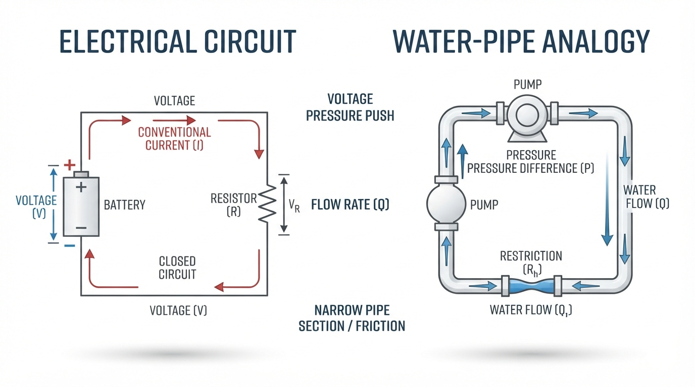
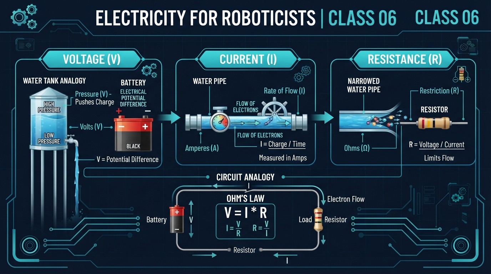
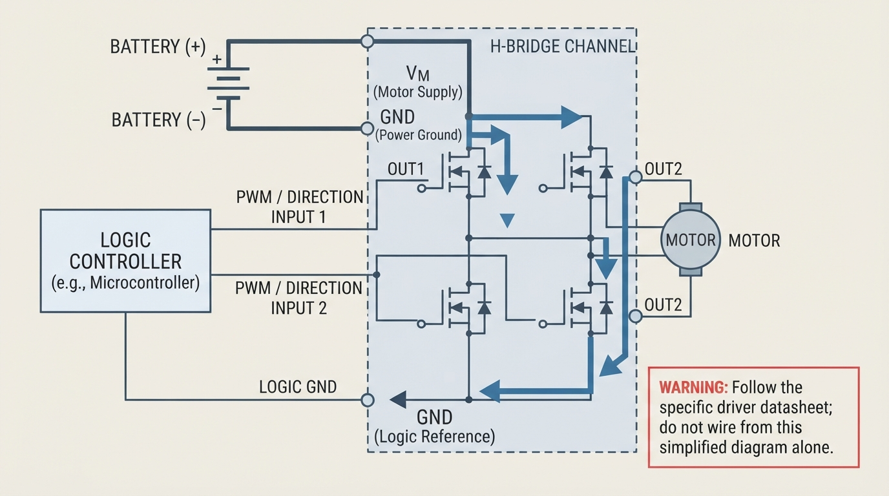
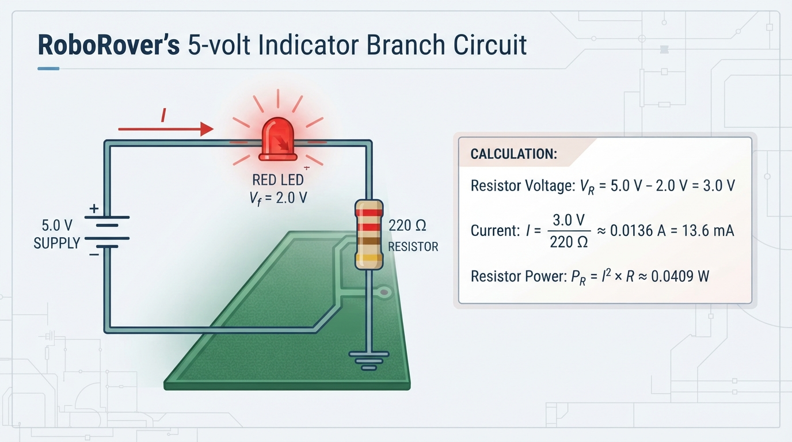

# Class 6: Electricity for Roboticists

## Where We Are in the Robotics Journey

Last class, RoboRover described motion using distance and speed:

\[
\text{speed}=\frac{\text{distance}}{\text{time}}
\]

Motion also requires **energy**, the capacity to cause change or perform work. **Power** is the rate at which energy is transferred. Energy is measured in joules (J) or watt-hours (Wh); power is measured in watts (W). RoboRover moves because a circuit transfers electrical energy from a source to a motor, where it becomes mechanical motion.

### Prerequisite: charge, circuit, energy, and power

- **Electric charge** is a property of matter that can move through conductors.
- A **circuit** is a connected path through which charge can move.
- **Energy** is transferred to a motor, resistor, or other load.
- **Power** is the rate of that energy transfer.

This class introduces:

- **Voltage:** electrical potential difference that can drive charge.
- **Current:** the rate of charge flow.
- **Resistance:** opposition to current flow.

We will use these ideas to reason about indicator circuits, batteries, motor drivers, measurements, and component safety. Next class, we will examine motors in greater detail.

## Today We Will Learn

By the end of this class, you should be able to:

1. Describe voltage, current, and resistance using a useful, bounded analogy.
2. Explain why a circuit needs a complete conducting path.
3. Use Ohm’s law to calculate current, voltage, or resistance.
4. Calculate electrical power using \(P=VI\), \(P=I^2R\), and \(P=V^2/R\) when appropriate.
5. Interpret calculations using correct units.
6. Explain why short circuits, excessive current, voltage sag, and component ratings matter.
7. Predict how resistance affects current and resistor power.
8. Relate simplified calculations to real robot hardware and measurements.

## 2-Minute Recap

RoboRover’s speed depends on its motors, wheels, load, floor surface, and control commands. Those systems depend partly on electrical power.

\[
\text{battery} \rightarrow \text{electrical circuit} \rightarrow \text{motor} \rightarrow \text{wheel rotation} \rightarrow \text{distance traveled}
\]

Today we focus on the electrical circuit in the middle of that chain.

## The Big Idea




**Figure:** The pipe analogy builds intuition: voltage encourages flow, current is flow, and resistance opposes flow.

Imagine water moving through pipes:

- **Voltage** is similar to a pressure difference that encourages water to move.
- **Current** is similar to the amount of flow passing a point each second.
- **Resistance** is similar to a narrow or rough section that makes flow harder.

This analogy is only for intuition. Current is a circuit variable; charge motion in a conductor is not the same as bulk water circulation. Electrons are not consumed by a load. A circuit transfers energy while charge continues around the conducting path.

For RoboRover:

- the battery provides a voltage difference;
- wires provide conducting paths;
- a motor driver controls power delivered to the motor;
- a resistor can limit current;
- a switch or transistor can open, close, or regulate part of a circuit.

A circuit needs a complete conducting path. If the path is broken, continuous current cannot flow through the intended loop.

### The simplest complete loop

```text
source positive ───> load ───> source negative
       |                         ^
       └────────── source ───────┘
```

**Text description:** A source, conductors, and load form one closed loop. Conventional current leaves the source positive terminal, passes through the load, and returns to the source negative terminal.

**Predict:** If RoboRover’s battery is connected to only one motor terminal and the other motor terminal is disconnected, will the motor turn continuously?

No. The intended path is open, so continuous current cannot pass through the motor.

## See It in Your Head

### AI-Generated Engineering Visual · Professor OS



**How to read this visual:** Trace the signal or idea from left to right. Match each block to the lesson explanation, then predict what would change if one block produced a wrong value.




**Figure:** In an H-bridge, the motor connects between two switched output nodes; VM and GND are the driver’s supply connections.

Picture RoboRover from above with a battery pack near its center. A motor driver has separate supply connections and switched output connections. The motor connects **between two output nodes**, not between a battery terminal and an unspecified point in the driver.

The following is a simplified **H-bridge** diagram. It shows one possible current state.

```text
                         motor-driver power stage
                                  VM
                                   |
                         +---------+---------+
                         |                   |
                       high-side           high-side
                       switch              switch
                         |                   |
                       OUT1               OUT2
                         |                   |
                         +----[  MOTOR  ]---+
                         |                   |
                       low-side            low-side
                       switch              switch
                         |                   |
                        GND-----------------+

Battery +  -------------------------------> VM
Battery -  -------------------------------> GND
Controller logic GND ---------------------> specified logic reference*
Controller PWM/direction signals ---------> logic/control inputs
```

`VM` means the motor-supply positive connection. `GND` is a label commonly used for a circuit return or reference; it is not automatically earth ground. `OUT1` and `OUT2` are switched motor terminals.

For the illustrated forward-current state:

```text
VM → upper-left switch → OUT1 → motor → OUT2
   → lower-right switch → GND → battery negative
```

The exact pin names, capacitors, enable pins, current limits, and wiring requirements depend on the driver datasheet. **Do not wire a driver from this simplified teaching diagram alone. Connect logic ground only as specified by the driver datasheet.** A shared power and logic ground is a common configuration, not a universal default.

An H-bridge must also prevent unsafe switch combinations. Turning on both the high-side and low-side switches in the same leg can create a near-short path from VM to GND called **shoot-through**. Real drivers may use interlock logic, dead time, current limiting, or other protection. Treat these details as enrichment; follow the driver’s control requirements rather than manually operating bridge switches.

The pipe comparison can reinforce the basic analogy:

- battery beside a pressure source;
- wires beside pipes;
- resistor beside a narrow pipe;
- current arrows beside flow arrows;
- motor beside a water wheel.

> Analogy for intuition—not a complete model.

## Core Concept

### Voltage: electrical potential difference

**Voltage** is the difference in electrical potential between two points. It is measured in **volts (V)**. Voltage is measured between points, not as an isolated property of one point.

A battery labeled 7.4 V has a nominal voltage of approximately 7.4 V under specified conditions. Its actual voltage may differ:

- **Open-circuit voltage:** measured with no significant load connected.
- **Loaded terminal voltage:** measured at the battery terminals while current is drawn.
- **Load voltage:** measured across the connected component.

Battery internal resistance, wires, connectors, protection circuits, and battery state can cause voltage to fall under load. This reduction is called **voltage sag**. Every connected component must be suitable for the applied voltage.

### Current: charge flow

**Electric current** is the rate at which electric charge passes a point. It is measured in **amperes**, or **amps (A)**:

\[
1\ \text{A}=1\ \text{C/s}
\]

This lesson uses **conventional current**, defined as flowing from a source’s positive terminal through the external circuit toward its negative terminal. Electrons in metal move in the opposite direction.

Motor current is often higher during startup, acceleration, heavy loading, or stall because the motor’s speed-dependent opposing voltage is then small.

### Resistance: opposition to current

**Resistance** describes how strongly a component opposes current. It is measured in **ohms (Ω)**.

A resistor deliberately provides resistance. Wires also have resistance, usually much less than an intentional resistor. Resistance depends on material, dimensions, temperature, and construction. For introductory calculations, we treat a resistor’s value as approximately constant.

### Retrieval checkpoint

1. Voltage is measured between what?
2. What unit measures current?
3. If resistance increases while voltage stays constant, does current increase or decrease?

**Answers:** Voltage is measured between two points. Current is measured in amperes. Current decreases because \(I=V/R\).

### Ohm’s law

For a component that behaves approximately like an ohmic resistor:

\[
V=IR
\]

where \(V\) is voltage in volts, \(I\) is current in amperes, and \(R\) is resistance in ohms.

\[
I=\frac{V}{R}
\qquad\text{and}\qquad
R=\frac{V}{I}
\]

These equations are models, not descriptions of every component. Motors, batteries, LEDs, and electronic controllers have more complex behavior.

### Electrical power

**Power** is the rate at which electrical energy is transferred. It is measured in **watts (W)**:

\[
P=VI
\]

For a resistor, substituting \(V=IR\) gives:

\[
P=I^2R
\qquad\text{and}\qquad
P=\frac{V^2}{R}
\]

Use these resistor forms for the same component at the same operating point. Compare calculated power with the component’s rated power and leave engineering margin.

| Quantity | Meaning | Unit | Typical measurement |
|---|---|---|---|
| Voltage \(V\) | Potential difference | volts (V) | Meter in parallel |
| Current \(I\) | Charge flow rate | amperes (A) | Meter in series |
| Resistance \(R\) | Opposition to current | ohms (Ω) | Unpowered circuit only |
| Power \(P\) | Energy-transfer rate | watts (W) | Calculated or measured |

## Math Without Fear

Suppose a 9 V source is connected across a 300 Ω resistor:

\[
I=\frac{9\ \text{V}}{300\ \Omega}
=0.03\ \text{A}=30\ \text{mA}
\]

\[
P=VI=(9)(0.03)=0.27\ \text{W}
\]

or:

\[
P=\frac{9^2}{300}=0.27\ \text{W}
\]

The units confirm \(\text{V}/\Omega=\text{A}\). Estimate first: 9 V divided by 300 Ω should be much less than 1 A. A result of 30 A signals an arithmetic or unit error.

At fixed voltage, increasing resistance decreases both current and resistor power:

\[
I=\frac{V}{R},\qquad P=\frac{V^2}{R}
\]

### Series and parallel preview

For two resistors in series:

\[
R_{\text{total}}=R_1+R_2
\]

The same current flows through both, and their voltage drops add to the source voltage. For \(100\ \Omega\) and \(200\ \Omega\) across 6.0 V:

\[
R_{\text{total}}=300\ \Omega,\qquad I=\frac{6.0}{300}=0.020\ \text{A}
\]

The voltage drops are 2.0 V and 4.0 V.

In parallel, branches share voltage and their currents add at the source:

\[
\frac{1}{R_{\text{total}}}
=
\frac{1}{R_1}+\frac{1}{R_2}
\]

A parallel branch can reduce total resistance and increase source current.

## Worked Robotics Example




**Figure:** With a 2.0-volt LED forward-drop assumption, the 220-ohm resistor gives an approximate branch current of 13.6 milliamperes.

RoboRover has a 5.0 V indicator branch containing:

- a red LED with an **assumed** forward voltage of \(V_f=2.0\ \text{V}\);
- a 220 Ω series resistor.

An LED is not an ohmic resistor. The resistor receives the remaining voltage:

\[
V_R=5.0-2.0=3.0\ \text{V}
\]

\[
I=\frac{3.0}{220}\approx0.0136\ \text{A}=13.6\ \text{mA}
\]

\[
P_R=I^2R\approx(0.0136)^2(220)\approx0.0409\ \text{W}
\]

The forward-voltage assumption depends on current and temperature. Check the LED’s maximum current, the resistor’s power rating, supply tolerance, and thermal conditions.

For comparison, a 100 Ω resistor would give:

\[
I=\frac{3.0}{100}=0.030\ \text{A}=30\ \text{mA}
\]

The lower resistance produces more current and may exceed the LED’s safe operating range.

### Compact motor-driver connection example

A driver may provide:

- **VM:** motor-supply positive;
- **GND:** motor-supply return;
- **OUT1** and **OUT2:** switched motor outputs;
- logic inputs such as PWM or direction.

For one channel, connect battery positive to VM, battery negative to the driver’s specified power return, and the motor between OUT1 and OUT2. Connect the controller only to the driver’s specified logic reference and control inputs. Motor current flows through the driver’s power stage, not through a controller signal pin.

A motor is not a fixed resistor. As it spins, it generates **back electromotive force (back EMF)** that opposes the applied voltage. At startup or stall, speed is low or zero, so current can be much higher.

## Python Lab

This program models a **resistor-only branch** at 5.0 V. It includes executable assertions for the numerical checks shown in its output.

```python
def current_from_resistance(voltage, resistance):
    """Return current in amperes using I = V / R."""
    if voltage < 0:
        raise ValueError("Voltage must be nonnegative.")
    if resistance <= 0:
        raise ValueError("Resistance must be greater than zero.")
    return voltage / resistance


def resistor_power(voltage, resistance):
    """Return resistor power in watts using P = V^2 / R."""
    if voltage < 0:
        raise ValueError("Voltage must be nonnegative.")
    if resistance <= 0:
        raise ValueError("Resistance must be greater than zero.")
    return voltage * voltage / resistance


def compare_with_exercise_limit(current, limit=0.05):
    """Compare current with a classroom exercise threshold."""
    if current > limit:
        return "above the {:.3f} A exercise threshold".format(limit)
    return "at or below the {:.3f} A exercise threshold".format(limit)


def main():
    voltage = 5.0
    exercise_threshold = 0.05
    resistances = [100, 200, 220, 500, 1000, 10000]

    assert abs(current_from_resistance(5.0, 100) - 0.05) < 1e-12
    assert abs(current_from_resistance(5.0, 1000) - 0.005) < 1e-12
    assert abs(resistor_power(5.0, 100) - 0.25) < 1e-12

    try:
        current_from_resistance(-1.0, 100.0)
    except ValueError:
        pass
    else:
        raise AssertionError("Negative voltage must be rejected.")

    print("RoboRover resistor-branch simulation")
    print("Supply voltage: {:.1f} V".format(voltage))
    print("Exercise threshold: {:.3f} A".format(exercise_threshold))
    print()

    for resistance in resistances:
        current = current_from_resistance(voltage, resistance)
        power = resistor_power(voltage, resistance)
        print("{:>5} ohms -> {:.2f} mA, {:.4f} W: {}".format(
            resistance,
            current * 1000.0,
            power,
            compare_with_exercise_limit(current, exercise_threshold)))


if __name__ == "__main__":
    main()
```

Negative voltage is rejected here because this small teaching model describes a supply magnitude and assumes conventional current in one chosen direction. Signed voltage is meaningful in broader circuit analysis; it is simply outside this function’s stated model.

Change `exercise_threshold` and observe the messages. The threshold is a classroom comparison, not a component rating. This model does not simulate LED nonlinearity, motor startup current, battery sag, or motor-driver switching.

## Mini Simulation or Game

Play **Tune RoboRover’s Resistor Branch**. The supply is fixed at 5.0 V. Predict before checking:

| Resistance | Predicted current | Predicted power | Prediction |
|---:|---:|---:|---|
| 100 Ω | 0.050 A (50 mA) | 0.250 W |  |
| 200 Ω | 0.025 A (25 mA) | 0.125 W |  |
| 1,000 Ω | 0.005 A (5 mA) | 0.025 W |  |
| 10,000 Ω | 0.0005 A (0.5 mA) | 0.0025 W |  |

Use:

\[
I=\frac{5.0}{R}
\qquad\text{and}\qquad
P=\frac{25}{R}
\]

1. Which resistance produces the largest current?
2. Which produces the smallest current?
3. When resistance changes from 100 Ω to 200 Ω, does current double or halve?
4. Which listed resistance dissipates the greatest power?
5. What happens if voltage changes from 5.0 V to 10.0 V while resistance stays constant?

At fixed resistance, doubling voltage doubles current but quadruples resistor power:

\[
P=\frac{V^2}{R}
\]

This is a parameter-changing model, not a real powered circuit.

## What Should Happen?

The table is verified directly by \(I=5/R\) and \(P=25/R\). The 100 Ω resistor has the greatest current and power; the 10,000 Ω resistor has the smallest.

For 100 Ω:

\[
I=\frac{5.0}{100}=0.050\ \text{A},\qquad
P=\frac{5.0^2}{100}=0.250\ \text{W}
\]

For 200 Ω:

\[
I=\frac{5.0}{200}=0.025\ \text{A}
\]

The current halves.

If voltage becomes 10.0 V across 100 Ω:

\[
I=\frac{10.0}{100}=0.10\ \text{A},\qquad
P=\frac{10.0^2}{100}=1.0\ \text{W}
\]

Compare the output with your predictions and revise any incorrect result.

## Common Mistakes

### Thinking voltage is the same as current

A battery can have voltage across its terminals while an open circuit carries no continuous current. Current depends on the complete path and load.

### Forgetting the return path

The path must leave the source, pass through the load and active driver stage, and return through the power-return connection. OUT1 and OUT2 are motor outputs, not replacements for VM and GND.

### Mixing units

\[
0.02\ \text{A}=20\ \text{mA}
\]

Write units throughout each calculation and distinguish Ω from kΩ.

### Treating a motor as a fixed resistor

Motor current changes with speed, torque, and mechanical load. Back EMF generally increases as the motor spins, reducing current compared with startup or stall.

### Creating a short circuit

A short is an unintended very low-resistance path. The ideal \(I=V/R\) equation warns that current could be large, but source resistance, fuses, current limiting, and protection determine the actual result. Never deliberately short an unknown or high-energy battery.

### Measuring with the wrong meter configuration

Voltage is measured in parallel:

```text
source + ─────── load ─────── source -
              |       |
              | meter |
              └───────┘
```

Current is measured in series:

```text
source + ─── meter ─── load ─── source -
```

Never place a meter configured for current directly across a supply. Before current measurements, an instructor must verify the meter fuse, lead placement, current terminal, and range rating. Current mode introduces burden voltage and can alter the circuit.

Use resistance mode only on an unpowered, disconnected circuit. Calculations do not replace datasheets, ratings, or supervised procedures.

## Try It Yourself

**Challenge:** Design a resistor for a 5.0 V indicator branch with an assumed LED forward drop of 2.0 V and target current of approximately 0.020 A.

\[
V_R=5.0-2.0=3.0\ \text{V}
\]

\[
R=\frac{3.0}{0.020}=150\ \Omega
\]

The ideal value is 150 Ω, and its resistor power is:

\[
P_R=V_RI=(3.0)(0.020)=0.060\ \text{W}
\]

Compare standard values:

| Resistor | Current at 3.0 V | Relative to 20 mA |
|---:|---:|---|
| 150 Ω | 20.0 mA | target |
| 180 Ω | 16.7 mA | below target |
| 220 Ω | 13.6 mA | below target |

For a design check, suppose the supply could reach 5.5 V and the LED forward drop could be as low as 1.8 V. Then the resistor voltage could be \(3.7\ \text{V}\):

\[
I_{150}=\frac{3.7}{150}\approx24.7\ \text{mA}
\]
\[
I_{180}=\frac{3.7}{180}\approx20.6\ \text{mA}
\]
\[
I_{220}=\frac{3.7}{220}\approx16.8\ \text{mA}
\]

If the LED limit is 20 mA, 220 Ω is the only one of these three that remains below that limit under this stated condition. Confirm the actual supply tolerance, LED range, current rating, and resistor power rating before selecting a part.

### Optional Python extension

This independently runnable program accepts a voltage and resistance. It rejects negative voltage and zero or negative resistance.

```python
def current_from_resistance(voltage, resistance):
    """Return current in amperes using I = V / R."""
    if voltage < 0:
        raise ValueError("Voltage must be nonnegative.")
    if resistance <= 0:
        raise ValueError("Resistance must be greater than zero.")
    return voltage / resistance


def resistor_power(voltage, resistance):
    """Return resistor power in watts using P = V^2 / R."""
    if voltage < 0:
        raise ValueError("Voltage must be nonnegative.")
    if resistance <= 0:
        raise ValueError("Resistance must be greater than zero.")
    return voltage * voltage / resistance


def interactive_calculation():
    try:
        voltage = float(input("Enter voltage in volts: "))
        resistance = float(input("Enter resistance in ohms: "))

        current = current_from_resistance(voltage, resistance)
        power = resistor_power(voltage, resistance)

        print("Current: {:.6f} A ({:.2f} mA)".format(
            current, current * 1000.0))
        print("Resistor power: {:.6f} W".format(power))

    except EOFError:
        print("No input was provided; run this extension interactively.")
    except ValueError as error:
        print("Input error: {}".format(error))


if __name__ == "__main__":
    interactive_calculation()
```

## Quick Quiz

Answer in a complete sentence or show the calculation.

1. What electrical quantity is measured in volts?
2. If voltage stays constant and resistance increases, what happens to current?
3. A 12 V supply is connected to a 600 Ω resistor. Calculate current in amperes and milliamperes.
4. Using the result from Question 3, calculate resistor power with \(P=VI\).
5. Why might a motor draw more current when starting or mechanically blocked?
6. Why is \(V/R\) not always an accurate prediction of short-circuit current?
7. Why does an LED indicator normally need a series resistor?
8. How should a meter be connected to measure voltage across a resistor and current through it?

## Answers

1. Voltage, or electrical potential difference, is measured in volts and describes the difference between two points.
2. Current decreases. From \(I=V/R\), increasing resistance while holding voltage constant reduces current.
3.  
   \[
   I=\frac{12\ \text{V}}{600\ \Omega}
   =0.020\ \text{A}=20\ \text{mA}
   \]
4.  
   \[
   P=VI=(12)(0.020)=0.24\ \text{W}
   \]
5. At startup or stall, speed is low or zero, so back EMF is small or absent. More applied voltage therefore drives current through the motor winding.
6. Source and wiring resistance, fuses, current limiting, and protection circuits affect actual short-circuit current. The ideal equation is a warning, not an exact prediction.
7. An LED is not a simple ohmic resistor. A series resistor limits current and helps keep it within the LED’s safe operating range.
8. Measure voltage in parallel across the resistor. Measure current in series so current passes through the meter. Never place a current-configured meter directly across the supply.

## Real Robot Connection

When RoboRover receives a command to drive forward, the controller sends logic signals to motor-driving electronics. The driver switches or regulates power delivered to the motors.

```text
battery voltage
      |
      v
motor driver power stage
      |
      v
motor current and voltage
      |
      v
torque and wheel rotation
      |
      v
RoboRover speed and distance
```

**Text description:** Battery voltage enters the driver’s power stage. The driver controls motor voltage and current, which create torque and wheel rotation. Wheel rotation affects RoboRover’s speed and distance.

The battery positive connection supplies VM. The battery negative connection supplies the driver’s specified power return, often labeled GND. The controller connects to the driver’s specified logic reference. Motor outputs such as OUT1 and OUT2 connect to the motor and are switched by the power stage.

If battery voltage sags or wiring loses voltage, the motor may receive less effective voltage and RoboRover may move more slowly than expected.

A practical workflow is:

1. Check supply voltage.
2. Estimate expected current.
3. Estimate power and compare it with ratings.
4. Check voltage sag and current limits.
5. Use suitable wires, connectors, and protection.
6. Secure the robot and keep rotating parts clear.
7. Measure actual behavior rather than relying only on calculations.

### Low-voltage measurement activity

This activity requires **explicit instructor supervision**. Use only:

- a regulated supply set to **5.0 V maximum**;
- a current limit set to **50 mA or less**;
- a 1 kΩ resistor rated for at least 0.25 W;
- a correctly fused multimeter and suitable leads;
- an unpowered circuit for resistance measurements.

Before current mode, the instructor must verify the meter fuse, lead placement, current terminal, and range rating.

1. Turn the supply off before wiring.
2. Connect the 1 kΩ resistor across the supply. At 5.0 V, ideal current is 5 mA and ideal power is 0.025 W.
3. For voltage, use correctly configured voltage leads and probes across the resistor in parallel. Keep the circuit intact and follow the instructor-approved probing procedure.
4. Power off before changing circuit wiring or moving a lead connected to the current terminal.
5. For current, with power off, move the lead to the verified current terminal and insert the meter in series.
6. Begin on the highest suitable current range.
7. **Never reposition a current-configured lead across a live supply, and never place a current-configured meter directly across the supply.**
8. Use resistance mode only after disconnecting and discharging the circuit as appropriate.
9. Compare measurements with \(I=V/R\), allowing for meter accuracy, resistor tolerance, burden voltage, and supply variation.
10. Turn the supply off before changing wiring or meter connections.

If supervised hardware is unavailable, use the simulation-only path. Do not substitute an unverified battery, resistor, or meter.

## Vocabulary

- **Voltage:** Electrical potential difference between two points, measured in volts (V).
- **Current:** Rate of electric charge flow, measured in amperes (A).
- **Resistance:** Opposition to current flow, measured in ohms (Ω).
- **Circuit:** A connected electrical path containing a source, conductors, and one or more loads or components.
- **Open circuit:** A broken path that prevents continuous current through the intended loop.
- **Short circuit:** An unintended very low-resistance path that can allow dangerously large current.
- **Ohm’s law:** The relationship \(V=IR\) for a component modeled as an ohmic resistor.
- **Electrical power:** The rate of electrical energy transfer, measured in watts (W), commonly calculated with \(P=VI\).
- **Battery:** A source of electrical energy that provides a potential difference and has practical voltage and current limits.
- **Ground:** A circuit reference or return node in this lesson; it is not automatically earth ground.
- **Motor driver:** Electronic hardware with an active power stage that controls electrical power delivered to a motor.
- **Voltage sag:** A reduction in actual supply voltage under load.
- **Back EMF:** A voltage generated by a spinning motor that opposes the applied voltage.
- **Load:** A component or device that receives electrical energy, such as a resistor, LED, controller, or motor.
- **Energy:** The capacity to cause change or perform work; electrical energy can become heat, light, or mechanical motion.
- **Power:** The rate of energy transfer, measured in watts (W).

## Further Learning

Study these topics in order:

1. Multimeter voltage and resistance measurements.
2. Series and parallel resistor circuits.
3. Electrical power and component heating.
4. Battery internal resistance and voltage sag.
5. Motor-driver current limits and protection.
6. DC-motor behavior under changing mechanical load.

Useful search terms include **Ohm’s Law**, **introductory DC circuits**, and **DC motor fundamentals**. Begin with low-voltage, current-limited educational equipment and follow meter instructions carefully.

## Next Class

Next class is **Motors: Turning Electricity into Motion**.

You will learn how current creates torque, why motors draw different currents during startup and normal operation, and how RoboRover’s electrical inputs become wheel rotation, speed, and distance.
