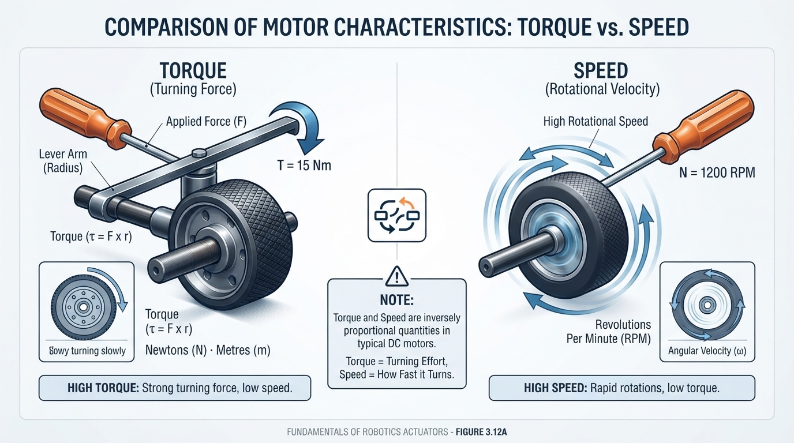
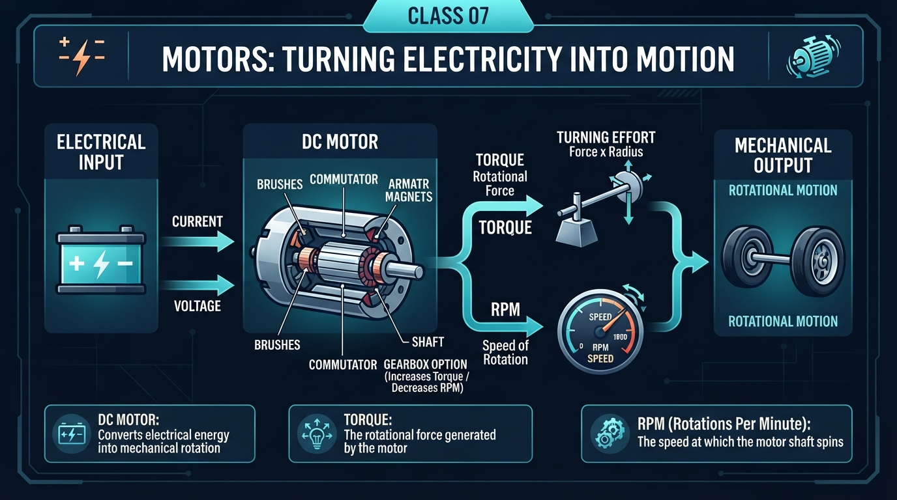
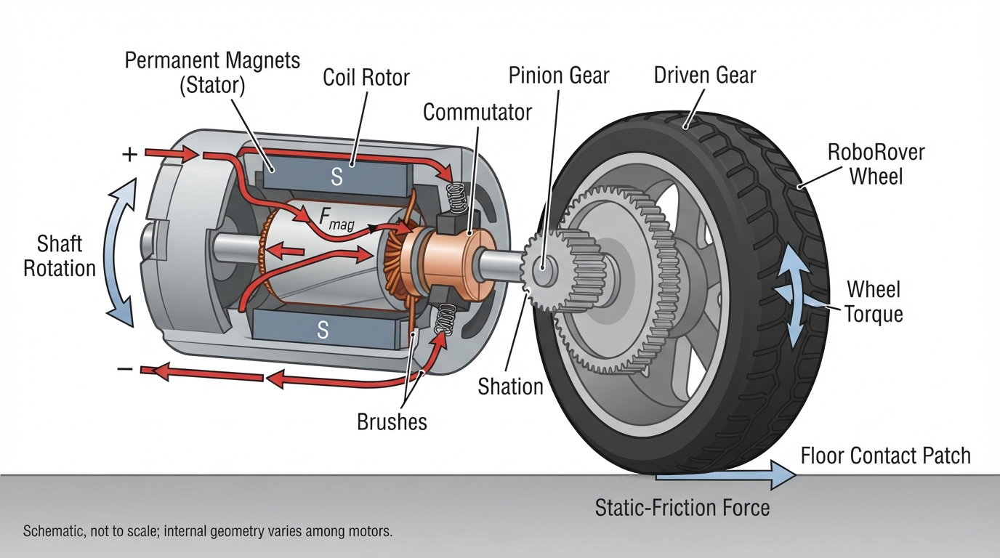
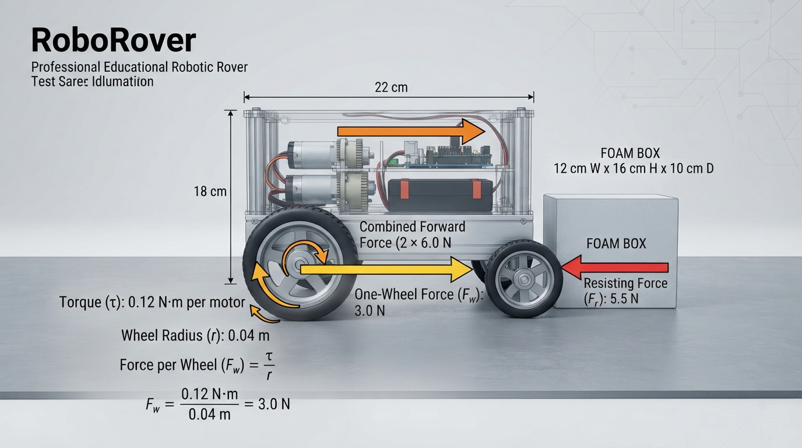
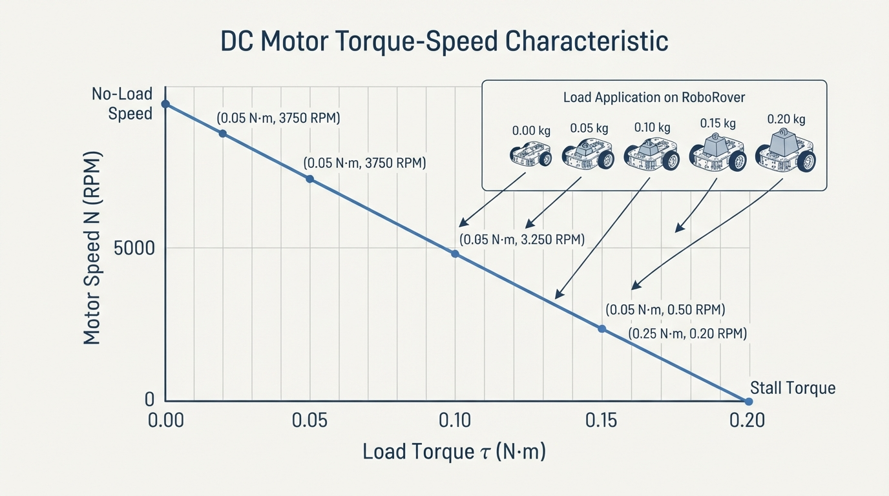

# Class 7: Motors: Turning Electricity into Motion

## Where We Are in the Robotics Journey

In Class 6, we learned that electricity can provide energy for a robot. We looked at voltage, current, resistance, power, batteries, switches, and electrical connections.

Now RoboRover needs to do something with that energy.

A battery does not make RoboRover move by itself. It provides electrical energy to a **motor**, and the motor changes that energy into rotation. Wheels, gears, belts, fans, pumps, and robotic joints can then use that rotation to perform physical work.

In the next class, we will learn **motor control with PWM**. PWM, or pulse-width modulation, is a method for controlling the average electrical power delivered to a motor. Before we can control a motor intelligently, we need to understand what its important mechanical quantities mean.

## Today We Will Learn

By the end of this class, you should be able to:

- describe how a DC motor changes electrical energy into rotational motion;
- explain **torque** as a turning effect;
- explain **RPM** as rotational speed;
- distinguish torque from speed;
- distinguish motor-shaft torque, wheel torque after gearing, and force at the wheel–floor contact patch;
- calculate wheel force and rover speed from motor and wheel values;
- calculate the approximate effect of a gearbox ratio and efficiency;
- understand why real motors slow down under load;
- use a simple Python model to explore a motor’s torque–speed relationship;
- make a simple measurement of wheel speed from video.

Our central question is:

> If RoboRover receives electrical energy, how much turning force and how much rotational speed can its motors produce?

## 2-Minute Recap

Three electrical quantities from Class 6 are especially useful here:

- **Voltage**, measured in volts (V), is the electrical potential difference that can push charge through a circuit.
- **Current**, measured in amperes (A), is the rate at which electric charge flows.
- **Power**, measured in watts (W), is the rate of energy transfer.

For a simple electrical calculation:

\[
P = VI
\]

where:

- \(P\) is electrical power in watts (W);
- \(V\) is voltage in volts (V);
- \(I\) is current in amperes (A).

A motor uses electrical power, but not all of it becomes useful motion. Some energy becomes heat, sound, friction, and vibration.

**Prediction:** If RoboRover’s wheels suddenly meet a carpet instead of a smooth floor, will the motors usually spin faster, slower, or at the same speed? Write down your prediction before continuing.

## The Big Idea



**Figure:** Torque describes turning strength, while RPM describes how quickly the shaft turns.

A motor is like an invisible hand turning a shaft thousands of times.

Imagine holding a screwdriver:

- pushing hard on the handle while turning gives you more **turning effect**;
- turning the screwdriver rapidly gives you more **rotational speed**.

Motors have the same two important mechanical properties:

1. **Torque**: how strongly the shaft can twist.
2. **Rotational speed**: how quickly the shaft turns.

A motor can spin quickly without producing much torque, or produce substantial torque while spinning slowly. A useful robot design must match both properties to the task.

RoboRover needs enough torque to:

- overcome rolling resistance;
- accelerate its body;
- climb small slopes;
- push through small obstacles.

It also needs enough speed to travel at a useful rate.

A motor that spins extremely fast but cannot turn the wheels under load is not useful. A motor with huge torque but extremely slow rotation may move RoboRover, but very slowly.

### Four quantities to keep separate

| Quantity | Meaning | Typical unit |
|---|---|---|
| Motor torque | Turning effect at the motor shaft | N·m |
| Wheel torque | Turning effect at the wheel after gearing and losses | N·m |
| Wheel tangential force | Ideal force at the wheel edge, \(F=\tau/r\) | N |
| Rover linear speed | Forward distance traveled per unit time | m/s |

A gearbox can change motor-shaft torque and speed before they reach the wheel. The force calculated from wheel torque is an ideal wheel-edge force. The usable force at the floor may be lower if static friction, tire deformation, or uneven loading limits traction.

## See It in Your Head

### AI-Generated Engineering Visual · Professor OS



**How to inspect this visual:** Follow the physical energy and force path from left to right, not an electronic signal path. Identify the voltage/current input, motor shaft, gearbox ratio, wheel radius, mechanical power output, and floor reaction force. Then predict which quantities change when the gearbox increases torque and reduces speed.



**Figure:** The motor’s magnetic forces turn the shaft, and the wheel converts shaft torque into force at the floor.

Picture a cutaway diagram of RoboRover’s drive system:

1. A battery sends electrical power through a motor driver toward a motor.
2. Inside the motor, a stationary magnetic structure surrounds a rotating part called the **rotor**.
3. Magnetic forces push and pull on the rotor, causing its shaft to turn.
4. The motor shaft connects to a small gear.
5. The small gear turns a larger wheel gear.
6. The gearbox reduces rotational speed and can increase wheel torque.
7. The wheel turns against the floor.
8. **Static friction** between the tire and floor provides the forward force on RoboRover without slipping.

For a brushed DC motor, an illustrator could show:

- permanent magnets on the stationary outer section;
- a coil of wire on the rotating part;
- a split commutator and brushes making electrical contact;
- arrows showing magnetic forces that keep the rotor turning;
- a clearly marked current path from a brush, through the coil, and back through the other brush.

This is a schematic illustration, not a to-scale or universal representation of every brushed motor. Actual motor geometry varies.

The commutator repeatedly changes which coil receives current. This keeps the magnetic push acting in a useful direction as the rotor rotates.

A brushless DC motor performs similar electromagnetic conversion, but electronic switching replaces physical brushes and a commutator. We will use the general term **DC motor** here and focus on the motor’s mechanical behavior rather than its internal construction.

## Core Concept

### Torque: turning effect

Torque describes how strongly a force tries to rotate something.

The basic equation is:

\[
\tau = Fr
\]

where:

- \(\tau\) is torque in newton-metres (N·m);
- \(F\) is force perpendicular to the lever in newtons (N);
- \(r\) is the perpendicular distance from the rotation axis in metres (m).

A 10 N force applied 0.2 m from a hinge produces:

\[
\tau = (10\ \text{N})(0.2\ \text{m}) = 2\ \text{N·m}
\]

The same force applied farther from the hinge produces more torque.

For a wheel, wheel torque becomes an ideal tangential force at the wheel edge. Rearranging the torque equation gives:

\[
F_{\text{ideal}} = \frac{\tau_{\text{wheel}}}{r}
\]

A smaller wheel produces more ideal pushing force for the same wheel torque, but it travels a shorter distance per revolution. The actual force transmitted to the floor may be limited by static friction:

\[
F_{\text{usable}} \leq \mu_s N
\]

where \(\mu_s\) is the coefficient of static friction and \(N\) is the normal force carried by the driven wheel or wheels. Thus, the motor may be capable of more wheel-edge force than the tire–floor contact can transmit without slipping.

### RPM: rotational speed

**RPM** means **revolutions per minute**.

One revolution means one complete turn. A motor speed of 120 RPM means the shaft completes 120 revolutions in one minute.

RPM is not the same as the forward speed of RoboRover. To find forward speed, we also need the wheel size.

A wheel with radius \(r\) travels one circumference during one revolution:

\[
C = 2\pi r
\]

where:

- \(C\) is circumference in metres (m);
- \(\pi\) is approximately 3.14159;
- \(r\) is wheel radius in metres (m).

If a wheel rotates at \(n\) revolutions per minute, its ideal rolling speed is:

\[
v = \frac{nC}{60}
\]

where:

- \(v\) is linear speed in metres per second (m/s);
- \(n\) is rotational speed in revolutions per minute (RPM);
- \(C\) is wheel circumference in metres (m);
- \(60\) converts minutes to seconds.

This speed assumes rolling without slip and does not include losses or deformation.

### Gearboxes trade speed for torque

A gearbox ratio \(G\) describes how much slower the output turns than the motor input. With efficiency \(\eta\), a simple estimate is:

\[
n_{\text{wheel}} \approx \frac{n_{\text{motor}}}{G}
\]

\[
\tau_{\text{wheel}} \approx \eta G\tau_{\text{motor}}
\]

For example, suppose a motor produces \(0.10\ \text{N·m}\) at \(3000\ \text{RPM}\), and a gearbox has:

- ratio \(G=20\);
- efficiency \(\eta=0.80\).

Then:

\[
n_{\text{wheel}} \approx \frac{3000}{20}=150\ \text{RPM}
\]

\[
\tau_{\text{wheel}} \approx (0.80)(20)(0.10)=1.6\ \text{N·m}
\]

The gearbox changes the motor output from approximately \(0.10\ \text{N·m}\) and \(3000\ \text{RPM}\) to \(1.6\ \text{N·m}\) and \(150\ \text{RPM}\), according to this simplified model. The increase in torque is not free: output speed decreases, and 20% of the ideal mechanical power is lost in this example.

If the wheel radius is \(0.04\ \text{m}\), the ideal wheel-edge force is:

\[
F_{\text{ideal}}=\frac{1.6}{0.04}=40\ \text{N}
\]

The floor may transmit less than 40 N if tire traction or another mechanical limit is insufficient.

### The motor trade-off

A simplified DC motor often has a **torque–speed curve**:

- at no load, the motor spins near its highest speed and produces little useful output torque;
- as the load torque increases, its speed decreases;
- at stall, the shaft is not turning, but the motor may produce its highest starting torque.

A straight torque–speed line is an approximate **steady-state** relationship for a specified supply voltage and approximate motor temperature. It does not fully describe startup, transient acceleration, sudden changes in load, or rated continuous operation. The plotted load torque represents torque applied at the motor shaft in this simple model. It is not automatically the wheel–ground resistance after a gearbox; gearing and efficiency must be accounted for separately.

This does not mean stall is safe. A stalled motor can draw high current and heat rapidly.

> **Assumptions and limitations:** Equations such as \(F=\tau/r\), \(v=nC/60\), and the straight torque–speed model are useful estimates. They assume clearly defined torque and speed, suitable gearing, rolling without slip, and stated operating conditions. Real results also depend on losses, acceleration, contact friction, tire deformation, battery voltage, driver current limits, heating, and load distribution. Treat calculated force and speed as predictions to test, not guarantees.

## Math Without Fear

Suppose a motor shaft provides:

- torque: \(\tau_m = 0.18\ \text{N·m}\);
- speed: \(n_m = 120\ \text{RPM}\).

RoboRover has two identical drive motors. For this first estimate, assume:

- each motor directly drives one wheel;
- wheel radius: \(r = 0.035\ \text{m}\);
- no gearbox;
- no friction or energy loss;
- both wheels have adequate static-friction traction and operate comparably.

These assumptions are deliberately ideal. They let us see the structure of the calculation.

### Step 1: Total pushing force

Each wheel receives \(0.18\ \text{N·m}\) of torque.

Using:

\[
F_{\text{ideal}} = \frac{\tau}{r}
\]

the ideal force from one wheel is:

\[
F_{\text{one}} =
\frac{0.18\ \text{N·m}}{0.035\ \text{m}}
\approx 5.14\ \text{N}
\]

Because both wheels have adequate traction and are operating comparably, their ideal tangential forces add:

\[
F_{\text{total, ideal}} = 2(5.14\ \text{N}) \approx 10.29\ \text{N}
\]

This is the ideal tangential force at the wheel edges. It is not automatically the force RoboRover can use: the tires may slip, and the motors may not maintain that torque at every speed.

### Step 2: Wheel circumference

\[
C = 2\pi r
\]

\[
C = 2\pi(0.035\ \text{m})
\approx 0.2199\ \text{m}
\]

The wheel travels about 0.220 m per revolution.

### Step 3: Linear speed

\[
v = \frac{nC}{60}
\]

\[
v =
\frac{(120\ \text{rev/min})(0.2199\ \text{m/rev})}{60\ \text{s/min}}
\approx 0.440\ \text{m/s}
\]

So the ideal no-load-style estimate is about \(0.440\ \text{m/s}\), or 44 cm/s.

### Hand calculation before coding

For the Python model used later, the no-load speed is \(150\ \text{RPM}\), and the stall torque is \(0.20\ \text{N·m}\). At a load of \(0.10\ \text{N·m}\):

\[
n = 150\left(1-\frac{0.10}{0.20}\right)
= 150(0.5)
= 75\ \text{RPM}
\]

Before running the code, predict the RPM at \(0.10\ \text{N·m}\). The result should be \(75.0\ \text{RPM}\).

### Interpretation

The two motors can theoretically provide about \(10.29\ \text{N}\) of ideal wheel-edge force at the chosen torque, while the wheels could travel about \(0.440\ \text{m/s}\) at 120 RPM.

The force and speed are separate operating quantities: a motor’s available torque generally changes with speed, and a gearbox changes both quantities. Acceleration, contact friction, battery voltage, and heat determine whether the robot actually reaches the calculated condition.

A useful calculation is a model, not a promise.

## Worked Robotics Example



**Figure:** Wheel torque becomes tangential force, and the two drive wheels combine their ideal pushing forces.

RoboRover must push a small foam box across a smooth test surface. Each drive motor provides \(0.12\ \text{N·m}\) of **wheel torque at startup and at the stated operating condition**. The wheel radius is \(0.04\ \text{m}\), and there are two drive wheels.

What ideal wheel force is available?

For one wheel:

\[
F_{\text{one}} = \frac{\tau_{\text{wheel}}}{r}
\]

where:

- \(\tau_{\text{wheel}} = 0.12\ \text{N·m}\);
- \(r = 0.04\ \text{m}\).

\[
F_{\text{one}} =
\frac{0.12\ \text{N·m}}{0.04\ \text{m}}
= 3.0\ \text{N}
\]

If both wheels have adequate static-friction traction and operate comparably:

\[
F_{\text{total, ideal}} = 2(3.0\ \text{N}) = 6.0\ \text{N}
\]

The ideal available wheel force is \(6.0\ \text{N}\).

Now suppose the box and its sliding resistance require \(4.5\ \text{N}\) to start moving. Because the stated \(0.12\ \text{N·m}\) is available at startup, the ideal force calculation gives a starting margin of:

\[
6.0\ \text{N} - 4.5\ \text{N} = 1.5\ \text{N}
\]

This \(1.5\ \text{N}\) difference does **not** guarantee that the box will move. Acceleration, contact friction, wheel traction, torque available during the transient, battery voltage, and uneven loading still matter. The margin may disappear on carpet, during a battery voltage drop, or if one wheel carries more load than the other. Static friction at the driven wheels must also be sufficient to transmit the calculated force without slipping.

This is why engineers do not select motors using only the exact minimum calculated value.

## Python Lab



**Figure:** In the simplified model, increasing load torque reduces motor speed until the stall point.

This program models a simplified motor whose speed decreases linearly as load torque increases.

The model uses:

\[
n = n_0\left(1-\frac{\tau_L}{\tau_S}\right)
\]

for \(0 \leq \tau_L \leq \tau_S\), where:

- \(n\) is predicted speed in RPM;
- \(n_0\) is no-load speed in RPM;
- \(\tau_L\) is load torque at the motor shaft in N·m;
- \(\tau_S\) is stall torque at the motor shaft in N·m.

This is a teaching model for specified voltage and approximate temperature, not a complete motor-datasheet model. The function clamps loads above stall torque to zero speed so that this simplified model does not report negative RPM. The graph shows **motor-shaft load torque**, not automatically wheel-ground resistance; a gearbox must be included before making that interpretation.

```python
import math
import matplotlib.pyplot as plt


def motor_rpm(load_torque, no_load_rpm, stall_torque):
    """Return a simple linear torque-speed prediction."""
    if load_torque < 0:
        raise ValueError("Load torque cannot be negative.")
    if no_load_rpm < 0 or stall_torque <= 0:
        raise ValueError("Motor parameters are invalid.")

    speed = no_load_rpm * (1.0 - load_torque / stall_torque)

    # A stalled motor cannot have negative rotational speed in this model.
    return max(0.0, speed)


no_load_rpm = 150.0
stall_torque = 0.20
load_torques = [0.00, 0.05, 0.10, 0.15, 0.20]

predicted_rpm = []
for load in load_torques:
    speed = motor_rpm(load, no_load_rpm, stall_torque)
    predicted_rpm.append(speed)
    print("Load: {:.2f} N*m -> Speed: {:.1f} RPM".format(load, speed))

# Verify the hand calculation and another endpoint before displaying the graph.
assert math.isclose(predicted_rpm[2], 75.0, rel_tol=1e-9)
assert math.isclose(predicted_rpm[1], 112.5, rel_tol=1e-9)
assert math.isclose(predicted_rpm[-1], 0.0, rel_tol=1e-9)
print("Verified: 0.10 N*m gives 75.0 RPM.")
print("Verified: 0.05 N*m gives 112.5 RPM.")
print("Verified: 0.20 N*m gives 0.0 RPM.")

plt.plot(load_torques, predicted_rpm, "o-", color="darkblue")
plt.xlabel("Load torque (N*m)")
plt.ylabel("Predicted motor speed (RPM)")
plt.title("RoboRover motor: simplified torque-speed model")
plt.grid(True)
plt.tight_layout()
plt.show()
```

Important lines:

- `motor_rpm(...)` contains the mathematical model.
- `max(0.0, speed)` prevents the simplified model from predicting negative RPM.
- `load_torques` gives several test loads.
- `assert` checks the exact values claimed by the program.
- `plt.plot(...)` draws the torque–speed relationship.

The graph should slope downward from high speed at zero load toward zero speed at stall torque.

If Matplotlib is unavailable, comment out the import, plotting commands, and `plt.show()` lines. The printed table should be:

```text
Load: 0.00 N*m -> Speed: 150.0 RPM
Load: 0.05 N*m -> Speed: 112.5 RPM
Load: 0.10 N*m -> Speed: 75.0 RPM
Load: 0.15 N*m -> Speed: 37.5 RPM
Load: 0.20 N*m -> Speed: 0.0 RPM
Verified: 0.10 N*m gives 75.0 RPM.
Verified: 0.05 N*m gives 112.5 RPM.
Verified: 0.20 N*m gives 0.0 RPM.
```

The table is enough to inspect the model. The graph is an additional visual summary.

## Mini Simulation or Game

### Motor-Matching Game

Pretend that RoboRover is carrying different objects. Each object creates a different resisting load torque at the motor shaft.

Before running the program, predict:

1. Which load produces the highest RPM?
2. What happens at \(0.20\ \text{N·m}\)?
3. What RPM should occur at \(0.10\ \text{N·m}\)?
4. Will the graph slope upward or downward?

Use the values in the program:

| Load torque | Situation |
|---:|---|
| 0.00 N·m | Wheel lifted off the ground |
| 0.05 N·m | Smooth floor |
| 0.10 N·m | Heavier payload |
| 0.15 N·m | Carpet or slope |
| 0.20 N·m | Stall point in this model |

After running it, change `stall_torque` to `0.30` and predict how the graph changes. A larger stall torque means the model allows more load before reaching zero speed, although real motor behavior also depends on voltage, current, temperature, and gearing.

Try changing `no_load_rpm` instead. This changes the vertical height of the graph but does not change the load torque at which this simple model reaches zero speed.

## What Should Happen?

Your predictions should be:

1. The \(0.00\ \text{N·m}\) load produces the highest speed: 150 RPM.
2. At \(0.10\ \text{N·m}\), the model predicts 75 RPM.
3. At \(0.20\ \text{N·m}\), the model predicts 0 RPM because that is the selected stall torque.
4. The graph slopes downward: increasing load torque reduces predicted speed.

The program verifies these exact points:

- \(0.05\ \text{N·m}\) gives \(112.5\ \text{RPM}\);
- \(0.10\ \text{N·m}\) gives \(75.0\ \text{RPM}\);
- \(0.20\ \text{N·m}\) gives \(0.0\ \text{RPM}\).

Those values come directly from the stated linear equation and are checked by executable assertions in the code.

## Common Mistakes

### Mistake 1: Treating torque and speed as the same thing

Torque measures turning effect. RPM measures how fast rotation occurs. A motor can have high torque at low speed or high speed at low torque.

### Mistake 2: Forgetting the wheel radius

Motor RPM is shaft speed. RoboRover’s forward speed depends on wheel circumference. Changing the wheel size changes both ideal wheel force and travel per revolution.

### Mistake 3: Confusing motor torque with wheel torque

A gearbox can reduce speed and increase wheel torque, but losses mean the output is not ideal. A motor-shaft torque value cannot be inserted into \(F=\tau/r\) as wheel torque unless the motor directly drives the wheel or the gearing has already been included.

### Mistake 4: Assuming the motor always produces its maximum torque

A motor’s torque depends on operating conditions. The torque value used in one calculation may apply only at a particular speed, voltage, and temperature.

### Mistake 5: Running a motor stalled for too long

When the shaft is prevented from turning, the motor can draw a large current. Electrical energy then becomes heat instead of useful rotation. This can damage the motor, driver, wiring, or battery system. Stall current and heating are important safety limits.

### Mistake 6: Believing the simple graph is a complete datasheet

The straight-line model is useful for intuition. Real motors may have nonlinear friction, gearbox losses, voltage changes, heating, brush effects, changing load conditions, startup transients, and continuous-duty limits.

### Mistake 7: Ignoring traction

The motor may produce enough ideal wheel-edge torque to spin the wheel, but the tire may not be able to push against the floor without slipping. Usable ground force is limited by static friction and the normal load on the driven wheels.

## Try It Yourself

### Challenge: Choose RoboRover’s wheel size

RoboRover uses two motors. Each motor provides \(0.10\ \text{N·m}\) of wheel torque. Assume both wheels have adequate static-friction traction and operate comparably. Compare two possible wheel radii:

- Design A: \(r = 0.025\ \text{m}\);
- Design B: \(r = 0.050\ \text{m}\).

For each design, calculate:

1. force from one wheel using \(F_{\text{ideal}} = \tau/r\);
2. total ideal force from two wheels;
3. circumference using \(C = 2\pi r\).

Which design gives greater ideal pushing force? Which travels farther per revolution?

**Optional extension:** Add both wheel sizes to a Python program and plot wheel force against radius. Use at least five radius values between \(0.02\ \text{m}\) and \(0.06\ \text{m}\). Include an assertion for one value you calculate by hand.

### Physical or browser-based measurement: estimate wheel RPM

You can perform this activity with a small robot, a motor-and-wheel assembly, or a wheel turned by hand.

1. Mark one point on the wheel with removable tape or a visible pen mark.
2. Secure the robot so it cannot move into people or objects. If the wheel is powered, use a low speed and a current-limited supply or a driver with appropriate current protection.
3. Record a phone video with the wheel visible. Count the marked point’s complete revolutions during a measured time interval, such as 10 seconds.
4. Calculate:

   \[
   \text{RPM}=\frac{\text{revolutions}}{\text{time in seconds}}\times 60
   \]

5. Measure the wheel radius and estimate ideal rolling speed using \(v=nC/60\).
6. Compare the estimate with the robot’s observed travel distance. Differences may result from camera timing, wheel slip, tire deformation, or the wheel not turning at a steady speed.

For a browser-based version, use a video player that allows frame-by-frame or timestamp inspection. The goal is to estimate RPM from evidence rather than assume that a motor command produces a fixed speed.

> **Safety:** Never hold a powered shaft or wheel to force a stall. Secure the robot, keep fingers, hair, and clothing away from gears and rotating parts, and use a current-limited supply or appropriate driver protection. Disconnect power before adjusting the mechanism.

## Quick Quiz

1. What does torque measure in a motor system?

2. A wheel has radius \(0.05\ \text{m}\) and receives \(0.20\ \text{N·m}\) of wheel torque. What ideal tangential force does it produce?

3. What usually happens to a DC motor’s speed as its mechanical load increases?

4. Why can a stalled motor become dangerously hot even though its shaft is not moving?

## Answers

1. Torque measures the turning effect, or twisting strength, around a rotational axis. Its unit is the newton-metre (N·m).

2. Use \(F_{\text{ideal}} = \tau/r\):

   \[
   F_{\text{ideal}} = \frac{0.20\ \text{N·m}}{0.05\ \text{m}} = 4.0\ \text{N}
   \]

   This is the ideal wheel-edge force. The force transmitted to the floor can be lower if static friction limits traction.

3. Its speed usually decreases as load torque increases. In the simple model, speed reaches zero at the stall torque.

4. A stalled motor can draw high current while producing no useful rotation. Much of the electrical energy becomes heat in the windings and driver components.

## Real Robot Connection

RoboRover’s motors are part of a chain:

\[
\text{battery} \rightarrow \text{motor driver} \rightarrow \text{motor} \rightarrow \text{gearbox} \rightarrow \text{wheel} \rightarrow \text{floor}
\]

Each stage affects the final result.

A gearbox can reduce motor-shaft speed and increase wheel torque. If a gearbox has ratio \(G\) and efficiency \(\eta\), a simple estimate is:

\[
n_{\text{wheel}} \approx \frac{n_{\text{motor}}}{G}
\]

\[
\tau_{\text{wheel}} \approx \eta G\tau_{\text{motor}}
\]

However, gears are not perfect: friction and mechanical losses reduce the output.

A practical engineer asks:

- How much torque is needed to start moving?
- How fast should the robot travel?
- Will the tires slip?
- Can the motor survive the current and heat?
- What happens when the battery voltage falls?
- Does the motor driver support the required current?
- Are the gears, axles, and mounts mechanically strong enough?

In the next class, PWM will let us adjust motor power electronically. But PWM cannot create unlimited torque. If RoboRover is overloaded, changing the command does not remove the physical limits of the motor, battery, driver, gears, and tires.

## Vocabulary

- **DC motor:** A motor that uses direct-current electrical power to produce rotational mechanical motion. In robotics, the term may include brushed or brushless motor designs.
- **Robot:** For this course, a physical machine commonly treated as a robot in engineering practice whose controlled actuators perform a physical task. Its immediate actions may be selected by a human operator, a preprogrammed controller, or autonomous software. This is a working description for teaching, not a universal necessary-and-sufficient test.
- **Torque:** The turning effect of a force around an axis, measured in newton-metres (N·m).
- **RPM:** Revolutions per minute; a unit of rotational speed.
- **Rotor:** The rotating part of a motor.
- **Stator:** The stationary part of a motor that helps create the magnetic field.
- **No-load speed:** Approximate motor speed when the shaft provides very little mechanical load.
- **Stall:** A condition in which the motor shaft is prevented from rotating.
- **Stall torque:** The torque associated with the stall condition in a specified motor model or test condition.
- **Gearbox:** A set of gears that changes rotational speed and torque.
- **Wheel circumference:** The distance traveled by a wheel in one complete revolution, calculated as \(C = 2\pi r\).
- **Torque–speed curve:** A graph showing how a motor’s available torque and rotational speed relate under specified conditions.
- **Static friction:** The contact force that can prevent surfaces from sliding relative to each other; at a driven wheel, it can transmit forward force without slipping.

## Further Learning

To deepen this topic, investigate these ideas in this order:

1. **Motor datasheet reading:** Compare no-load speed, rated speed, rated torque, stall torque, and stall current.
2. **Gear ratios:** Explore how a gear train trades rotational speed for torque.
3. **Motor efficiency:** Compare electrical input power with mechanical output power.
4. **Brushed and brushless motors:** Identify the mechanical and electronic differences.
5. **Encoder feedback:** Learn how a sensor can measure shaft rotation for later speed regulation.

Search-friendly resource names include **DC motor torque-speed curve**, **robot gearbox selection**, and **motor datasheet rated torque**.

## Next Class

In Class 8, **Motor Control with PWM**, RoboRover will learn how a controller changes motor behavior without simply treating the motor as an on/off device.

We will connect:

- electrical power from Class 6;
- motor torque and RPM from this class;
- PWM duty cycle and motor-driver commands in the next class.

You will see why a motor command is not always equal to a fixed speed, especially when the load, battery voltage, and surface change.