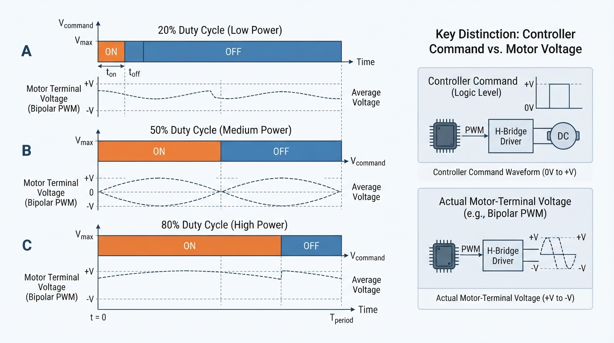
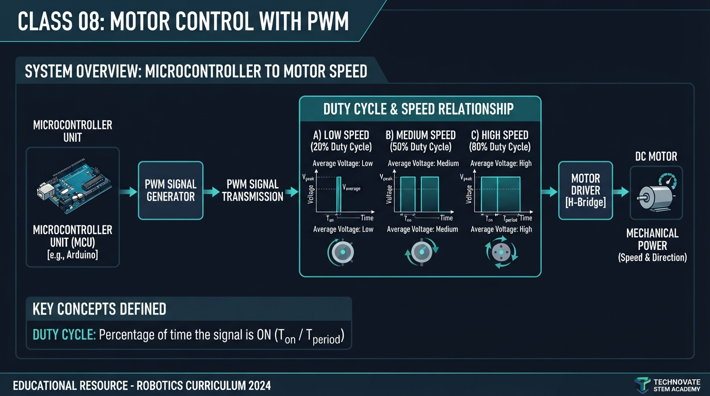
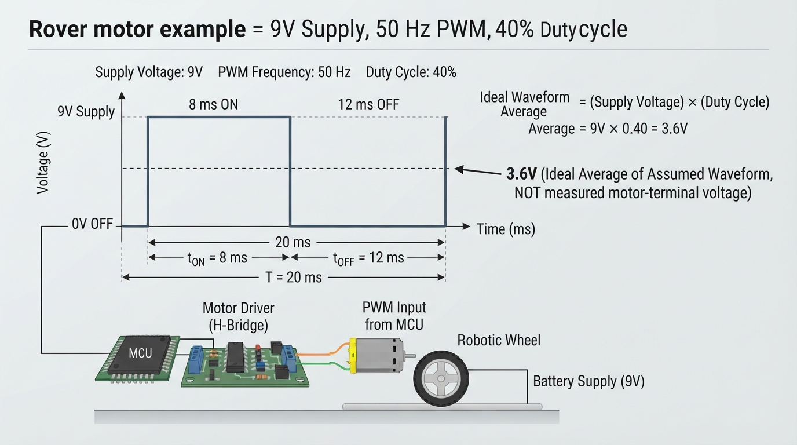
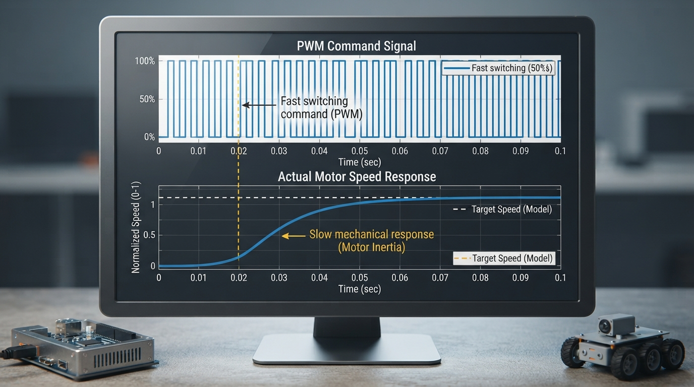

# Class 8: Motor Control with PWM

## Where We Are in the Robotics Journey

In Class 7, RoboRover used a motor to convert electrical energy into motion. A robot still needs to control **how fast** a motor turns and, when required, **which direction** it turns.

Today we introduce **pulse-width modulation**, or **PWM**. PWM rapidly switches a command between states. **Duty cycle** is the fraction of each period spent in the on, or commanded-drive, state. A \(25\%\) duty cycle means the command is on for one-quarter of every period.

### Scope of this class

This lesson focuses on **brushed DC motors** controlled by an H-bridge or low-side motor driver. Keep the signal chain below in view:

```text
Controller or computer
  low-power logic command PWM
            |
            v
      Motor driver
  high-current switching
            |
            v
      Brushed DC motor
 motor-terminal voltage
   and winding current
            |
            v
          Wheel
```

The controller usually does not supply motor power directly. It sends a low-power logic command to the motor driver. The driver switches the larger motor current.

For the arithmetic in this lesson, we use a **deliberately simplified single-ended switching model**: the assumed power-stage waveform across the motor alternates between \(0\ \text{V}\) and the supply voltage. This model is useful for learning duty cycle, but it is not a universal description of H-bridge outputs. Real H-bridges may produce bipolar voltages, braking states, floating states, or recirculating-current paths.

Brushless DC motors and hobby servomotors use different commutation and control arrangements. Their PWM signals may have different meanings.

In the next class, we will connect motor speed to **gears**. PWM changes the requested electrical drive; gears change how motor motion is transformed mechanically.

## Today We Will Learn

By the end of this class, you should be able to:

- explain PWM with an on/off switch analogy;
- distinguish logic command PWM, power-stage switching, and motor-terminal voltage;
- calculate duty cycle, period, and frequency;
- calculate the ideal time-average of a \(0\)-to-supply switching waveform;
- distinguish duty cycle, voltage, winding current, torque, and speed;
- explain why duty cycle influences speed without guaranteeing an exact rpm;
- interpret a PWM timing diagram;
- run and modify a Python simulation;
- identify practical concerns including load, startup friction, current limits, noise, switching frequency, and driver topology.

## 2-Minute Recap

A brushed DC motor converts electrical energy into rotational motion.

- **Voltage**, measured in volts (V), is electrical potential difference.
- **Current**, measured in amperes (A), is the flow of electric charge.
- **Speed**, often measured in revolutions per minute (rpm), describes how quickly the shaft rotates.
- **Torque**, measured in newton-metres (N·m), is turning strength.

A motor driver sits between the controller and motor because a computer pin normally cannot safely provide the motor’s startup or operating current.

The distinction between the signal chain is essential:

1. **Logic command PWM** is the controller’s low-power signal.
2. **Power-stage PWM** is the driver’s high-current switching action.
3. **Motor-terminal voltage** is the voltage actually appearing across the motor terminals.
4. **Winding current** flows through the motor coils and changes gradually because of inductance.
5. **Torque** depends strongly on winding current.
6. **Speed** results from torque, load, friction, back EMF, and inertia.

> **What PWM does and does not guarantee**
>
> For an idealized power-stage waveform that switches between \(0\ \text{V}\) and \(V_{\text{supply}}\):
>
> \[
> V_{\text{avg, ideal}} = D V_{\text{supply}}
> \]
>
> This is the time-average of the assumed waveform. It is not automatically the motor’s measured terminal voltage, winding-current average, electrical power, torque, or speed.

## The Big Idea




**Figure:** The pulse height stays the same; duty cycle changes the fraction of time the command is in its on state.

Imagine controlling a lamp with a very fast switch:

- on for half of each period: approximately \(50\%\) duty cycle;
- on for one-quarter: \(25\%\) duty cycle;
- on for nearly the entire period: a high duty cycle.

The lamp analogy demonstrates **time fraction**, not complete motor physics. The switch does not produce a smaller on-state voltage. In the simplified model, the power stage produces the full supply voltage during each on interval; duty cycle changes how long that state lasts.

For example:

| Duty cycle | On-time in a 10 ms period | Off-time |
|---:|---:|---:|
| 0% | 0 ms | 10 ms |
| 50% | 5 ms | 5 ms |
| 100% | 10 ms | 0 ms |

The pulse height is unchanged. Only the on-time changes.

In a real driver, off-time may allow current to circulate through diodes or MOSFETs, or the circuit may coast, brake, or use a particular current-decay mode. Consequently, the motor-terminal voltage may be actively driven, recirculating, or floating. Driver topology determines the details.

A motor shaft does not normally start and stop once per PWM pulse. Winding inductance resists sudden current changes, and mechanical inertia resists sudden speed changes. These effects often make the motor’s current and speed change more gradually than the switching waveform.

### Choosing a PWM frequency

The \(50\ \text{Hz}\) value used later is selected for easy arithmetic and visualization, not as a universal recommendation. It is audible and may produce torque ripple or current ripple.

A frequency such as \(20\ \text{kHz}\) may move switching noise above much of the audible range, but it can increase switching losses, heating, electromagnetic interference, and driver demands. The appropriate value depends on the motor, driver topology, inductance, current ripple, and manufacturer limits.

## See It in Your Head

### AI-Generated Engineering Visual · Professor OS



**How to read this visual:** Trace the signal or idea from left to right. Match each block to the lesson explanation, then predict what would change if one block produced a wrong value.


The following diagram shows **power-stage PWM representations** with ten equal time slots per period. The adjacent table provides the exact timing values for accessibility; the waveform is not intended to be read by color or image labels alone.

```text
Shared time axis: |0----|1----|2----|3----|4----|5----|6----|7----|8----|9----|10---|
                  one complete period, T

20% duty cycle:   |██████|      |      |      |      |      |      |      |      |      |
50% duty cycle:   |██████|██████|██████|██████|██████|      |      |      |      |      |
80% duty cycle:   |██████|██████|██████|██████|██████|██████|██████|██████|      |      |
                  <------ on ------> <------------- off -------------->
```

| Duty cycle | On slots | Off slots | On-time if \(T=10\) ms |
|---:|---:|---:|---:|
| 20% | 2 of 10 | 8 of 10 | 2 ms |
| 50% | 5 of 10 | 5 of 10 | 5 ms |
| 80% | 8 of 10 | 2 of 10 | 8 ms |

Each strip has the same **period**, the time from the beginning of one pulse to the beginning of the next. Pulse height remains the same in the simplified representation.

The controller’s logic waveform and the driver’s power-stage waveform are related but not necessarily identical. The actual motor-terminal voltage depends on the driver’s circuit and PWM mode. Winding current and mechanical speed usually change more slowly than the electrical switching command.

## Core Concept

### Duty cycle

**Duty cycle** is the fraction of each PWM period during which the signal is in its on or commanded-drive state.

\[
D = \frac{t_{\text{on}}}{T}
\]

where:

- \(D\) is duty cycle, with no units;
- \(t_{\text{on}}\) is on-time, in seconds;
- \(T\) is the period, in seconds.

As a percentage:

\[
D_{\%}=100D
\]

A duty cycle of \(0.40\) equals \(40\%\).

Frequency is:

\[
f=\frac{1}{T}
\]

where \(f\) is measured in hertz (Hz).

### Ideal average voltage

For the explicitly simplified waveform that switches between \(0\ \text{V}\) and \(V_{\text{supply}}\):

\[
V_{\text{avg, ideal}}=D V_{\text{supply}}
\]

This equation describes only the assumed waveform. In a real motor, current also depends on resistance, inductance, back EMF, driver current paths, and switching mode. Torque depends strongly on current. Speed depends on torque balance, load, friction, battery voltage, motor design, and losses.

Therefore:

> Increasing duty cycle often increases motor speed, but duty cycle is not a direct rpm setting.

A \(50\%\) command does not guarantee exactly half the maximum speed.

### Speed control versus direction control

PWM commonly controls the magnitude of motor drive. Direction usually requires an H-bridge or another circuit that can reverse the voltage across the motor. In this class, assume direction has already been selected.

## Math Without Fear

Suppose a motor driver uses a \(12\ \text{V}\) supply and the simplified waveform has a \(25\ \text{ms}\) period at \(40\%\) duty cycle.

Convert the percentage:

\[
D=\frac{40}{100}=0.40
\]

Find on-time:

\[
t_{\text{on}}=DT
=0.40(25\ \text{ms})
=10\ \text{ms}
\]

Off-time is:

\[
25\ \text{ms}-10\ \text{ms}=15\ \text{ms}
\]

Find the ideal average of the assumed waveform:

\[
V_{\text{avg, ideal}}
=DV_{\text{supply}}
=0.40(12\ \text{V})
=4.8\ \text{V}
\]

The result means that the assumed \(0\)-to-\(12\ \text{V}\) waveform has a \(4.8\ \text{V}\) time-average. It does **not** claim that the motor measures \(4.8\ \text{V}\) at its terminals or runs at a particular speed.

## Worked Robotics Example




**Figure:** In the idealized example, a 40 percent duty cycle at 50 hertz means 8 milliseconds in the on state during every 20 millisecond period; 3.6 volts is only the assumed waveform average.

RoboRover carries a small box across a smooth floor. Its battery supply is \(9\ \text{V}\), and the illustrative PWM frequency is \(50\ \text{Hz}\) with a duty cycle of \(40\%\). For arithmetic only, assume the driver creates a \(0\)-to-\(9\ \text{V}\) waveform.

### Step 1: Find the period

\[
T=\frac{1}{f}
=\frac{1}{50\ \text{s}^{-1}}
=0.020\ \text{s}
=20\ \text{ms}
\]

### Step 2: Find the on-time

\[
t_{\text{on}}=DT
=0.40(20\ \text{ms})
=8\ \text{ms}
\]

The ideal timing model therefore has \(8\ \text{ms}\) on and \(12\ \text{ms}\) off in every period.

### Step 3: Find the ideal average

\[
V_{\text{avg, ideal}}
=DV_{\text{supply}}
=0.40(9\ \text{V})
=3.6\ \text{V}
\]

This \(3.6\ \text{V}\) value is only the ideal average of the assumed power-stage waveform. It is not guaranteed motor-terminal voltage, current, torque, or speed.

The box, floor, battery condition, friction, and motor-driver current limit all affect the real result. If static friction requires more starting torque than the command can produce, RoboRover may not move.

> **Hardware-safety box:** Do not intentionally stall a motor or test a starting boost without a current-limited driver, a defined maximum duration, supervision, mechanical clearance, and compliance with motor and driver thermal and current limits. A stronger startup command can produce dangerous acceleration and rapid heating.

## Python Lab




**Figure:** The simulation separates an idealized fast PWM command from a slower illustrative command-response model.

This program displays an illustrative logic PWM command and a simple first-order response model. The upper plot is an idealized power-stage voltage representation derived from the command; it is not a guaranteed measurement of a specific driver’s motor-terminal voltage.

The model assumes:

- target speed is linearly proportional to duty cycle;
- simulated speed approaches that target gradually;
- `time_constant` controls response speed;
- motor resistance, inductance, back EMF, load, friction, current limits, topology, and heating are omitted.

### Setup

Use Python 3.7 or newer with `matplotlib` installed:

```bash
python -m pip install matplotlib
```

```python
import math
import matplotlib.pyplot as plt


def pwm_average_voltage(supply_voltage, duty_cycle):
    """Return the ideal average of a 0-to-supply PWM waveform."""
    if supply_voltage < 0:
        raise ValueError("supply_voltage must not be negative")
    if duty_cycle < 0 or duty_cycle > 1:
        raise ValueError("duty_cycle must be between 0 and 1")
    return supply_voltage * duty_cycle


def make_pwm_waveform(supply_voltage, duty_cycle, frequency, duration,
                      sample_count):
    """Create samples for an idealized power-stage voltage waveform."""
    if frequency <= 0:
        raise ValueError("frequency must be positive")
    if duration <= 0:
        raise ValueError("duration must be positive")
    if sample_count <= 1:
        raise ValueError("sample_count must be greater than 1")
    if supply_voltage < 0:
        raise ValueError("supply_voltage must not be negative")
    if duty_cycle < 0 or duty_cycle > 1:
        raise ValueError("duty_cycle must be between 0 and 1")

    times = []
    voltages = []
    period = 1.0 / frequency

    for index in range(sample_count):
        time = duration * index / (sample_count - 1)
        phase = time % period
        voltage = (supply_voltage
                   if phase < duty_cycle * period else 0.0)
        times.append(time)
        voltages.append(voltage)

    return times, voltages


def simulate_motor_speed(duty_cycle, duration, dt, maximum_speed,
                         time_constant):
    """Simulate a stable first-order illustrative response."""
    if duty_cycle < 0 or duty_cycle > 1:
        raise ValueError("duty_cycle must be between 0 and 1")
    if duration <= 0 or dt <= 0:
        raise ValueError("duration and dt must be positive")
    if maximum_speed < 0:
        raise ValueError("maximum_speed must not be negative")
    if time_constant <= 0:
        raise ValueError("time_constant must be positive")
    if dt > time_constant:
        raise ValueError("dt must be no greater than time_constant")

    times = []
    speeds = []
    speed = 0.0
    target_speed = duty_cycle * maximum_speed
    steps = int(round(duration / dt))

    for step in range(steps + 1):
        time = step * dt
        times.append(time)
        speeds.append(speed)
        speed += (target_speed - speed) * dt / time_constant

    return times, speeds


def main():
    print("RoboRover PWM experiment")
    print("Enter a duty cycle from 0 to 100 percent.")

    try:
        user_text = input("Duty cycle: ")
    except EOFError:
        user_text = "40"
        print("No input received; using 40 percent.")

    duty_percent = float(user_text)
    if duty_percent < 0 or duty_percent > 100:
        raise ValueError("Enter a percentage from 0 to 100.")

    duty_cycle = duty_percent / 100.0
    supply_voltage = 9.0
    frequency = 50.0
    duration = 1.0
    dt = 0.01
    maximum_speed = 3000.0
    time_constant = 0.20

    average_voltage = pwm_average_voltage(supply_voltage, duty_cycle)

    assert math.isclose(
        pwm_average_voltage(9.0, 0.40), 3.6,
        rel_tol=0.0, abs_tol=1e-12
    )
    assert math.isclose(
        0.40 * (1.0 / 50.0), 0.008,
        rel_tol=0.0, abs_tol=1e-12
    )

    check_times, check_speeds = simulate_motor_speed(
        1.0, time_constant, dt, 1.0, time_constant
    )
    one_tau_fraction = check_speeds[-1]
    assert 0.63 < one_tau_fraction < 0.65

    pwm_times, pwm_voltages = make_pwm_waveform(
        supply_voltage, duty_cycle, frequency, 0.20, 1000
    )
    speed_times, speeds = simulate_motor_speed(
        duty_cycle, duration, dt, maximum_speed, time_constant
    )

    target_speed = duty_cycle * maximum_speed
    print("Ideal average power-stage voltage representation: {:.2f} V".format(
        average_voltage
    ))
    print("Model target speed: {:.0f} rpm".format(target_speed))
    print("At one time constant, the normalized model response is {:.1%}."
          .format(one_tau_fraction))
    print("The graph shows speed approaching the target gradually.")

    figure, axes = plt.subplots(2, 1, figsize=(9, 6), sharex=False)

    axes[0].plot(pwm_times, pwm_voltages, color="darkorange")
    axes[0].set_title("Idealized power-stage PWM voltage representation")
    axes[0].set_ylabel("Voltage representation (V)")
    axes[0].set_xlabel("Time (s)")
    axes[0].grid(True)

    axes[1].plot(speed_times, speeds, color="navy")
    axes[1].axhline(
        target_speed, color="gray", linestyle="--", label="model target"
    )
    axes[1].set_title("Illustrative command-response model")
    axes[1].set_ylabel("Model speed (rpm)")
    axes[1].set_xlabel("Time (s)")
    axes[1].legend()
    axes[1].grid(True)

    figure.tight_layout()

    try:
        plt.show()
    except Exception as error:
        figure.savefig("pwm_motor_response.png", dpi=150)
        print("Graphical display unavailable: {}".format(error))
        print("Saved the figure as pwm_motor_response.png")


if __name__ == "__main__":
    main()
```

### Important lines

- `duty_cycle = duty_percent / 100.0` converts a percentage to a decimal.
- `phase = time % period` finds the sample’s position within a repeating period.
- The comparison with `duty_cycle * period` selects the on portion.
- `target_speed = duty_cycle * maximum_speed` is a teaching assumption, not a motor law.
- The update to `speed` makes the response gradual.
- The assertions verify the lesson’s \(40\%\), \(9\ \text{V}\), and \(50\ \text{Hz}\) arithmetic.
- The time-constant assertion checks that the model reaches approximately \(63\%\) of a unit target after one time constant.

## Mini Simulation or Game

Run the program with duty cycles of `20`, `60`, and `100`.

Before each run, predict:

- the ideal average representation;
- the model target speed;
- whether the response curve will change its final value, its response time, or both.

At \(0\%\), the model target is zero. At \(100\%\), the idealized waveform remains high for the entire period. At intermediate values, the target changes while the configured response time remains the same.

For the game, imagine RoboRover delivering a fragile cup. Choose the smallest command that reaches the delivery zone quickly, while remembering that this model is not a physical speed guarantee.

## What Should Happen?

**Answer these questions before rerunning the program:**

1. If `duty_cycle` changes from `0.20` to `0.60` while the supply remains \(9\ \text{V}\), does the ideal average increase or decrease?
2. Which changes faster: the upper switching waveform or the lower simulated response?
3. At \(100\%\) duty cycle, is the idealized waveform mostly high, mostly low, or evenly split?
4. If the box becomes heavier, will the real speed remain exactly the same?
5. With `time_constant = 0.20`, what fraction of the final model target should be reached after \(0.20\) seconds?
6. Before running the extension, what will happen if `time_constant` changes to `0.05`?

**Expected reasoning:**

1. It increases from \(0.20(9)=1.8\ \text{V}\) to \(0.60(9)=5.4\ \text{V}\).
2. The switching waveform changes rapidly; the simulated response rises gradually.
3. It stays high for the whole period.
4. No. Load changes the torque and speed relationship.
5. Approximately \(63\%\).
6. The model responds faster, but its final target remains the same.

## Common Mistakes

### Mistake 1: Treating duty cycle as exact speed

A \(30\%\) duty cycle is not automatically \(30\%\) of maximum rpm. Load, friction, battery voltage, motor characteristics, driver losses, and current limits matter.

### Mistake 2: Treating ideal average voltage as measured motor voltage

\[
V_{\text{avg, ideal}}=D V_{\text{supply}}
\]

applies to the explicitly assumed waveform. Driver topology and PWM mode determine actual motor-terminal voltage and current.

### Mistake 3: Confusing frequency and duty cycle

Frequency describes how often the pattern repeats. Duty cycle describes the fraction of each period spent on. Either can change while the other remains constant.

### Mistake 4: Connecting a motor directly to a computer pin

A computer pin is a logic output, not a motor power supply. Use a properly rated motor driver.

### Mistake 5: Ignoring noise and stalled-current heating

Motors can disturb controller power and communication, while a stalled motor can draw high current and heat rapidly. Use suitable suppression, wiring, cooling, fusing, and current limiting.

### Mistake 6: Assuming low duty cycle must move the robot

Static friction and gearbox friction may prevent motion at low commands. The threshold can change with surface, payload, battery state, and motor temperature.

## Try It Yourself

Test \(10\%\), \(30\%\), \(50\%\), \(70\%\), and \(90\%\). Record the result:

| Duty cycle | Ideal average representation at \(9\ \text{V}\) | Model target | Response observation |
|---:|---:|---:|---|
| 10% |  |  |  |
| 30% |  |  |  |
| 50% |  |  |  |
| 70% |  |  |  |
| 90% |  |  |  |

Use:

\[
V_{\text{avg, ideal}}=D(9\ \text{V})
\]

**Success criteria:**

- all five averages are correct;
- the \(90\%\) value is \(8.1\ \text{V}\);
- model targets differ, but response time is initially the same;
- entries identify the values as idealized model values;
- the explanation distinguishes duty cycle from `time_constant`.

**Prediction extension:** Change `time_constant = 0.20` first to `0.05`, then to `0.50`. Write down how the curve should change before rerunning the program. A smaller time constant produces a faster response; a larger one produces a slower response. The final target does not change.

Estimate when the response reaches \(63\%\) of its final model target. This tests the simplified model; it is not a measurement of a real motor’s electrical or mechanical time constant.

## Quick Quiz

Write a complete answer for each prompt.

1. Define a \(75\%\) duty cycle in words.
2. Calculate the ideal average of an assumed \(0\)-to-\(8\ \text{V}\) waveform at \(25\%\) duty cycle.
3. Explain the difference between PWM frequency and duty cycle.
4. Give two reasons a real motor may not reach the speed suggested by a duty-cycle model.
5. Explain why ideal average waveform voltage is not guaranteed motor-terminal voltage or speed.
6. State what the first-order model predicts after one time constant.

## Answers

1. The signal is in its on or commanded-drive state for \(75\%\) of each period and off for \(25\%\).
2.  
   \[
   V_{\text{avg, ideal}}
   =0.25(8\ \text{V})
   =2\ \text{V}
   \]
   This is the average of the assumed waveform, not necessarily the motor-terminal voltage.
3. Frequency is the number of complete periods per second, measured in hertz. Duty cycle is the fraction of each period spent in the on state.
4. Load, friction, low battery voltage, driver voltage loss, insufficient starting torque, current limiting, and motor behavior omitted from the model can all matter.
5. The driver’s topology and PWM mode determine current paths and terminal voltage. Real speed also depends on current, torque balance, back EMF, load, friction, and mechanical dynamics.
6. The model reaches approximately \(63.2\%\) of the final change after one time constant. The discrete simulation produces a nearby value.

## Real Robot Connection

A real RoboRover control chain may look like this:

```text
Robot controller
       |
       v
Logic PWM command
       |
       v
Motor driver
power switching
       |
       v
Brushed DC motor
       |
       v
Wheel
```

The driver must be rated for the motor’s supply voltage, continuous current, startup current, and stall current. A practical setup may also require:

- a suitable motor supply;
- a defined common-ground or isolated interface;
- fuse or electronic current limiting;
- manufacturer-specified flyback paths, snubbers, or suppression;
- safe wiring and cooling;
- mechanical clearance and an emergency disconnect.

Real behavior varies with battery discharge, payload, floor surface, left-right motor mismatch, wheel slip, command latency, current limits, and PWM mode. Coast, brake, and recirculation modes can change current ripple, noise, torque, and measured terminal voltage.

### Instructor-approved low-voltage observation

For an actionable and safe observation, use a documented, isolated, current-limited low-voltage training rig. With the motor disconnected, students may observe the controller’s **logic command PWM** using a logic analyzer or oscilloscope. Verify the instrument’s voltage and ground limits first.

Do not probe an unknown battery pack, H-bridge output, switching node, or motor terminal. Do not attach an oscilloscope ground clip to a switching node unless the driver documentation and measurement method explicitly permit it. Power down before changing wiring, secure moving parts, and follow the instrument and driver instructions.

Later, wheel sensors can measure actual motion and support feedback control. For now, the central idea is that PWM requests different drive levels; it does not directly specify exact speed.

Next class, gears will show how mechanical transmission changes the relationship between speed and torque.

## Vocabulary

- **PWM (pulse-width modulation):** A method of controlling a switching command by changing the fraction of each period spent in the on or commanded-drive state.
- **Logic command PWM:** A low-power digital signal from a controller to a motor driver requesting a switching pattern.
- **Power-stage PWM:** The motor driver’s switching of the higher-power motor circuit in response to a command.
- **Brushed DC motor:** A motor using brushes and a commutator to switch current through its windings as the rotor turns.
- **Duty cycle:** The fraction of one PWM period for which the signal is in its on state, commonly expressed as a percentage.
- **Period:** The time required for one complete repeating PWM pattern, measured in seconds.
- **Frequency:** The number of complete periods per second, measured in hertz (Hz).
- **On-time:** The portion of a period during which the PWM signal is in its on or commanded-drive state.
- **Ideal average voltage:** The ideal time-average of a specified power-stage waveform; for an assumed \(0\)-to-\(V_{\text{supply}}\) waveform, it is \(D V_{\text{supply}}\).
- **Motor-terminal voltage:** The voltage measured across the motor terminals; its switching behavior depends on driver topology and PWM mode.
- **Winding current:** Current through the motor coils. Inductance causes it to change over time rather than instantaneously.
- **Motor driver:** An electronic circuit that allows a low-power controller to command the larger voltage and current required by a motor.
- **Saturation:** A limit beyond which a system cannot increase its output, such as a maximum duty cycle of \(100\%\).
- **Torque:** A turning effect that causes or resists rotation, measured in newton-metres (N·m).
- **Speed control:** Changing a motor’s rotational speed by changing its drive command. PWM can influence speed under a given load and control arrangement, but it does not guarantee a particular speed directly.

## Further Learning

Useful search terms include:

- “PWM duty cycle brushed DC motor driver beginner”
- “brushed DC motor torque speed curve”
- “motor driver current limit PWM”
- “oscilloscope PWM waveform freewheel current”
- “brushed DC motor electrical noise suppression”
- “PWM frequency switching losses motor driver”

For hardware work, study the driver documentation for voltage range, continuous and startup current, current-decay mode, PWM-frequency range, thermal limits, and protection requirements.

## Next Class

**Class 9: Gears: Trading Speed for Strength**

RoboRover’s motor may spin quickly, while its wheel needs greater turning strength. Next class, we will use gear ratios to examine the trade-off:

- fewer wheel revolutions can produce more torque;
- more wheel revolutions can produce more speed;
- real gears lose energy through friction.

PWM adjusts electrical drive. Gears transform motor motion mechanically.
