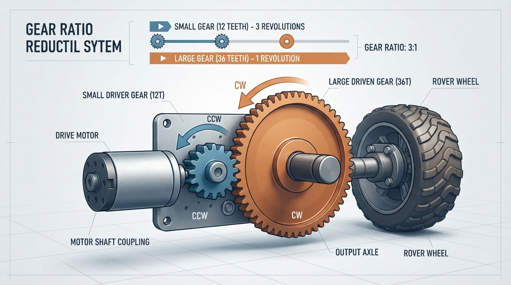
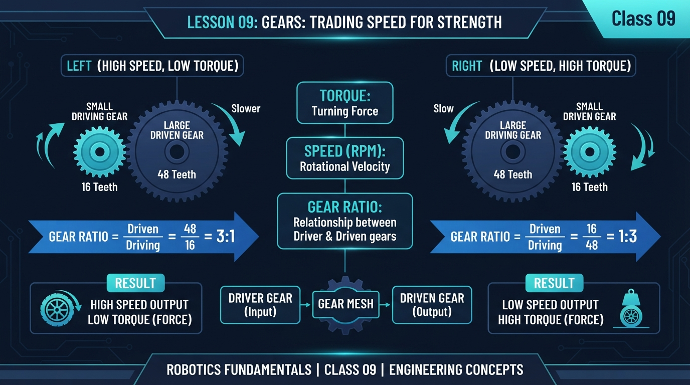
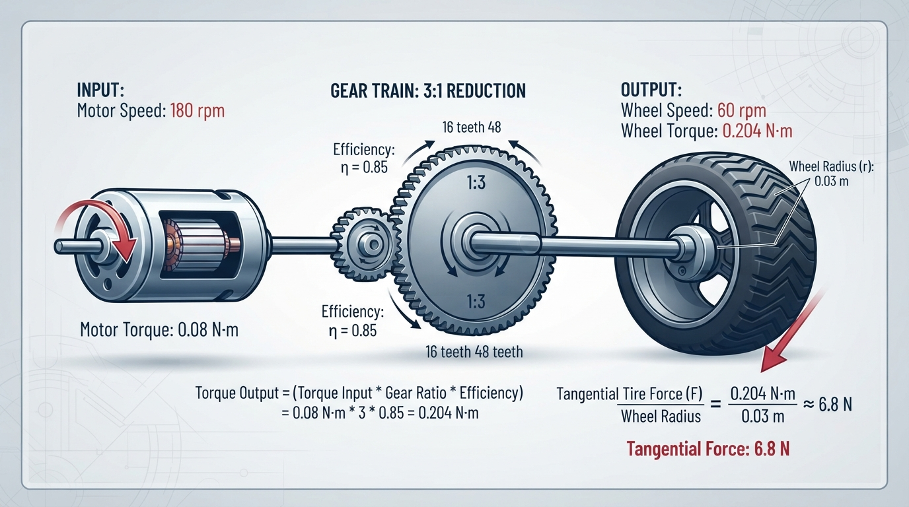
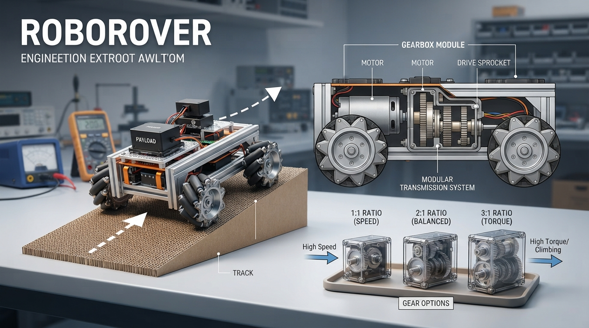

# Class 9: Gears: Trading Speed for Strength

## Where We Are in the Robotics Journey

In Class 8, RoboRover used **PWM**, or pulse-width modulation, to control the average electrical power sent to its motor. Increasing the PWM command could usually make the motor turn faster or push harder—up to the motor’s limits.

But a motor’s shaft is often not connected directly to a robot’s wheel. Between the motor and the wheel, engineers may place **gears**.

Gears let RoboRover trade one mechanical quantity for another:

- less rotational speed can produce more turning strength;
- more rotational speed usually produces less turning strength.

Today we will connect motor behavior to wheel behavior. In the next class, **Sensors: Giving Robots Senses**, RoboRover will measure the world instead of moving through it “blind.”

## Today We Will Learn

By the end of this class, you should be able to:

1. Explain what two meshing gears do.
2. Calculate a gear ratio from gear tooth counts.
3. Predict how gearing changes speed and torque.
4. Include efficiency in a realistic calculation.
5. Explain why a robot may need reduction gears.
6. Use Python to compare gear choices for RoboRover.
7. Recognize practical problems such as friction, slipping, and motor overload.

## 2-Minute Recap

Imagine sending a PWM signal to a small DC motor.

- A higher duty cycle usually gives the motor more average electrical power.
- The motor converts electrical power into rotation.
- The motor’s speed and torque are not independent. When the motor is heavily loaded, it often slows down.
- PWM controls the motor’s input, but it does not magically create unlimited mechanical strength.

A useful mental model is:

> PWM chooses how strongly we ask the motor to work. Gears choose how that work is exchanged between speed and turning strength.

RoboRover’s motor may spin quickly but have difficulty turning a large wheel against a ramp. Gears can make the wheel turn more slowly while increasing its torque.

## The Big Idea



**Figure:** A 3:1 reduction makes the driven gear turn one-third as fast while ideally multiplying torque by three.

A gear is a wheel with teeth that transfer rotation to another toothed wheel.

When a small gear drives a larger gear:

- the larger gear turns more slowly;
- the larger gear produces more torque under the ideal model;
- the two gears rotate in opposite directions.

The small gear is commonly called the **driver gear** because it receives motion from the motor. The larger gear is the **driven gear** because it receives motion from the driver.

## See It in Your Head

### AI-Generated Engineering Visual · Professor OS



**How to read this visual:** Trace the mechanical transmission from left to right. Identify the driver and driven gears, read their tooth counts, compare their rotation directions, and predict the output speed and torque.

Picture RoboRover from the side:

```text
Motor shaft
    |
    v
 [12-tooth driver]  meshes with  [36-tooth driven] ---> wheel
       small gear                       large gear
```

The driver must go around three times for the 36-tooth driven gear to go around once. This is a **3:1 reduction**.

That means:

- output speed is one-third of input speed;
- output torque is about three times input torque before losses, under the ideal gear model.

The word “about” matters. Real gears lose some energy through friction, tooth deformation, bearing friction, and imperfect alignment.

**Observation prompt:** Follow the arrows in the diagram. The gear with fewer teeth turns more quickly, the gear with more teeth turns more slowly, and two external gears rotate in opposite directions. Check that three driver rotations correspond to one driven-gear rotation.

### Physical or virtual measurement activity

Mark one tooth on each gear, or use a simulation that displays marked teeth. Rotate the 12-tooth driver exactly three turns and count the turns of the 36-tooth driven gear. The driven gear should complete one turn, while its rotation direction is opposite to the driver’s.

## Core Concept

### Gear ratio from tooth count

The common reduction-ratio convention used in this class is:

\[
R = \frac{N_{\text{driven}}}{N_{\text{driver}}}
\]

where:

- \(R\) is the gear ratio, with no units;
- \(N_{\text{driven}}\) is the number of teeth on the driven gear;
- \(N_{\text{driver}}\) is the number of teeth on the driver gear.

If \(R > 1\), this is a speed reduction and torque increase under the ideal model.

For ideal gears, using \(n\) for rotational speed:

\[
n_{\text{out}} = \frac{n_{\text{in}}}{R}
\]

where:

- \(n_{\text{in}}\) is input rotational speed, measured here in revolutions per minute (rpm);
- \(n_{\text{out}}\) is output rotational speed in rpm;
- \(R\) is the gear ratio.

The speed-ratio equation works with any consistent rotational-speed unit, such as rpm, revolutions per second, or rad/s. The units used for input and output must be the same.

Ideal output torque is:

\[
\tau_{\text{out, ideal}} = R \tau_{\text{in}}
\]

where:

- \(\tau_{\text{in}}\) is motor-shaft torque in N·m;
- \(\tau_{\text{out, ideal}}\) is output torque without losses in N·m.

### Efficiency

Real gears are not perfect. Let \(\eta\) represent mechanical efficiency:

\[
0 < \eta \leq 1
\]

The realistic output torque, assuming the same gear ratio and the stated motor operating point, is:

\[
\tau_{\text{out}} = \eta R \tau_{\text{in}}
\]

For example, \(\eta = 0.85\) means that 85% of the ideal mechanical output power is available after losses. Equivalently, for this fixed-ratio calculation, the output torque is 85% of the ideal output torque at the corresponding output speed:

\[
P_{\text{out}} = \eta P_{\text{in}}
\]

A gear train does not create energy. If it increases torque, it reduces speed enough to keep power approximately balanced:

\[
P = \tau \omega
\]

where:

- \(P\) is rotational power in watts (W);
- \(\tau\) is torque in N·m;
- \(\omega\) is angular speed in radians per second (rad/s).

If speed is given in rpm, convert it before using this power equation:

\[
\omega = \frac{2\pi n}{60}
\]

where \(n\) is speed in rpm. For example, \(60\ \text{rpm}\) equals \(2\pi\ \text{rad/s}\). We will not use power calculations as the main activity today, but this equation explains why “more strength” always has a speed cost.

### More than one gear pair

If RoboRover uses two reduction stages, their ratios multiply:

\[
R_{\text{total}} = R_1 R_2
\]

A 2:1 stage followed by a 3:1 stage gives:

\[
R_{\text{total}} = 2 \times 3 = 6
\]

This is useful when one very large gear would not fit. However, every extra stage can add friction, noise, weight, and alignment problems.

## Math Without Fear



**Figure:** The numerical example tracks speed, torque, efficiency, and wheel force through RoboRover’s transmission.

Suppose the motor is assumed to operate at \(180\ \text{rpm}\) with a motor-shaft torque of \(0.08\ \text{N·m}\), and it drives a 12-tooth gear. The driven gear has 36 teeth. These are assumed operating-point values for this simplified calculation; real motor speed, torque, current, voltage, and PWM are coupled.

First calculate the ratio:

\[
R = \frac{36}{12} = 3
\]

So the output speed is:

\[
n_{\text{out}} = \frac{180\ \text{rpm}}{3}
= 60\ \text{rpm}
\]

With an efficiency of \(0.85\), the output torque at the driven gear is:

\[
\tau_{\text{out}}
= 0.85 \times 3 \times 0.08\ \text{N·m}
= 0.204\ \text{N·m}
\]

The driven gear is rigidly attached to the wheel, so this is also the simplified wheel-shaft torque in this model. It is not motor-shaft torque: the motor-shaft torque is \(0.08\ \text{N·m}\), the gearbox output or driven-gear torque is \(0.204\ \text{N·m}\), and the rigidly attached wheel receives the same \(0.204\ \text{N·m}\) before any additional wheel-hub losses.

Now suppose the wheel radius is \(0.03\ \text{m}\). The available tangential force at the wheel rim is estimated by:

\[
F_{\text{rim}} = \frac{\tau_{\text{wheel}}}{r}
\]

where:

- \(F_{\text{rim}}\) is available tangential wheel-rim force in N;
- \(\tau_{\text{wheel}}\) is wheel-shaft torque in N·m;
- \(r\) is wheel radius in m.

Therefore:

\[
F_{\text{rim}} = \frac{0.204\ \text{N·m}}{0.03\ \text{m}}
= 6.8\ \text{N}
\]

Interpretation:

- RoboRover’s wheel turns at 60 rpm rather than 180 rpm.
- The available wheel torque is approximately 0.204 N·m rather than the motor-shaft torque of 0.08 N·m.
- The simplified available tangential wheel-rim force is approximately 6.8 N.
- This does not guarantee that the ground can receive 6.8 N. Tire traction, motor operating point, drivetrain dynamics, gear strength, and other limits may reduce the actual force.

This is the model boundary for today’s calculations: the equations estimate an operating point and available wheel-rim force. They do not provide a complete vehicle, traction, or motor simulation. In particular, the predicted output torque may not be available continuously if the motor slows, current limits are reached, or the gearbox overheats.

## Worked Robotics Example



**Figure:** RoboRover’s best gear choice depends on the task: climbing strength matters, but excessive reduction can make flat-ground motion too slow.

RoboRover must climb a short cardboard ramp while carrying a small sensor box. With a 1:1 gear pair, its motor spins the wheel quickly, but the robot struggles near the steepest part.

The design team considers three gear pairs:

| Driver teeth | Driven teeth | Ratio | Main effect |
|---:|---:|---:|---|
| 24 | 24 | 1:1 | No ideal speed change |
| 18 | 36 | 2:1 | Half speed, about double ideal torque |
| 12 | 36 | 3:1 | One-third speed, about triple ideal torque |

The 3:1 pair gives the greatest torque multiplication, but it may make RoboRover too slow for flat ground. Whether the 2:1 pair is sufficient depends on the required wheel force.

This is an important engineering decision:

> The “strongest” gear ratio is not automatically the best gear ratio.

A robot must satisfy the task. If RoboRover needs to climb, carry, and maneuver, engineers consider:

- required wheel torque;
- desired top speed;
- motor heating;
- available battery power;
- wheel traction;
- physical space for gears;
- gear noise and wear.

### Practical caveat: stalling

If the wheel cannot turn, the motor may enter a **stall condition**. A stalled motor can draw high current and heat quickly. A large reduction ratio can make it easier for the wheel to resist motion, but it does not make the motor immune to overload.

RoboRover should not simply keep increasing PWM when its wheel is stuck. A safer design uses current limiting, temperature monitoring, a mechanical fuse, or software that detects an abnormal condition. Those topics will appear later in the course.

## Python Lab

This program compares three possible gear choices for RoboRover. It calculates ratio, output speed, realistic output torque, and simplified available tangential wheel-rim force.

The motor speed and torque are assumed operating-point values for this model, not universally independent specifications.

It also contains assertions. An assertion is a built-in check that stops the program if a calculated relationship is not true.

```python
# Python 3.7-compatible gear comparison for RoboRover

MOTOR_SPEED_RPM = 180.0
MOTOR_TORQUE_NM = 0.08
EFFICIENCY = 0.85
WHEEL_RADIUS_M = 0.03

GEAR_CHOICES = [
    ("1:1 gear pair", 24, 24),
    ("Moderate reduction", 18, 36),
    ("Strong reduction", 12, 36),
]

def calculate_gear_result(driver_teeth, driven_teeth):
    """Return ratio, output speed, output torque, and wheel-rim force."""
    ratio = float(driven_teeth) / float(driver_teeth)
    output_speed_rpm = MOTOR_SPEED_RPM / ratio
    output_torque_nm = EFFICIENCY * ratio * MOTOR_TORQUE_NM
    wheel_force_n = output_torque_nm / WHEEL_RADIUS_M

    return ratio, output_speed_rpm, output_torque_nm, wheel_force_n


print("RoboRover gear comparison")
print("-" * 72)
print("{:<20s} {:>8s} {:>12s} {:>16s} {:>16s}".format(
    "Choice", "Ratio", "Speed (rpm)", "Torque (N m)", "Wheel-rim force (N)"
))

results = {}

for name, driver_teeth, driven_teeth in GEAR_CHOICES:
    ratio, speed, torque, force = calculate_gear_result(
        driver_teeth, driven_teeth
    )
    results[name] = (ratio, speed, torque, force)

    print("{:<20s} {:>8.2f} {:>12.2f} {:>16.3f} {:>16.2f}".format(
        name, ratio, speed, torque, force
    ))

# Verification checks for the numerical relationships used in this lesson.
assert abs(results["1:1 gear pair"][0] - 1.0) < 1e-9
assert abs(results["Moderate reduction"][0] - 2.0) < 1e-9
assert abs(results["Strong reduction"][0] - 3.0) < 1e-9

assert abs(results["1:1 gear pair"][3] - 2.2666666667) < 1e-9
assert abs(results["Moderate reduction"][3] - 4.5333333333) < 1e-9
assert abs(results["Strong reduction"][1] - 60.0) < 1e-9
assert abs(results["Strong reduction"][2] - 0.204) < 1e-9
assert abs(results["Strong reduction"][3] - 6.8) < 1e-9

print("-" * 72)
print("Verification passed: the 3:1 choice gives 60 rpm,")
print("0.204 N m output torque, and 6.8 N simplified wheel-rim force.")
```

Important lines:

- `ratio = driven_teeth / driver_teeth` applies the tooth-count definition.
- `output_speed_rpm = MOTOR_SPEED_RPM / ratio` shows the speed trade.
- `output_torque_nm = EFFICIENCY * ratio * MOTOR_TORQUE_NM` includes the stated efficiency.
- `wheel_force_n = output_torque_nm / WHEEL_RADIUS_M` estimates available tangential force at the wheel rim.
- The `assert` statements verify the exact values used in the lesson.

Do not confuse wheel-rim force with guaranteed ground force. The tire and ground must transmit the force without slipping, and the motor and drivetrain must actually supply the assumed operating-point torque.

## Mini Simulation or Game

### Choose RoboRover’s climbing gear

RoboRover has a simple mission:

- It must produce at least **5.0 N** of simplified wheel-rim force to meet the model’s climbing threshold.
- It should travel as fast as possible among the choices that meet the threshold.
- The three gear choices are the same as in the Python program.

Before running the program, predict:

1. Which gear choices meet the 5.0 N requirement?
2. Which qualifying choice is fastest?
3. What happens to speed when the ratio changes from 2:1 to 3:1?

Add this code below the previous program, or run this complete second program separately:

```python
# Python 3.7-compatible gear-selection game

MOTOR_SPEED_RPM = 180.0
MOTOR_TORQUE_NM = 0.08
EFFICIENCY = 0.85
WHEEL_RADIUS_M = 0.03
REQUIRED_FORCE_N = 5.0

GEARS = {
    "1": ("1:1 gear pair", 24, 24),
    "2": ("Moderate reduction", 18, 36),
    "3": ("Strong reduction", 12, 36),
}

def result_for(driver_teeth, driven_teeth):
    ratio = float(driven_teeth) / float(driver_teeth)
    speed_rpm = MOTOR_SPEED_RPM / ratio
    torque_nm = EFFICIENCY * ratio * MOTOR_TORQUE_NM
    force_n = torque_nm / WHEEL_RADIUS_M
    return ratio, speed_rpm, torque_nm, force_n

print("RoboRover's Ramp Challenge")
print("Required simplified wheel-rim force: {:.1f} N".format(
    REQUIRED_FORCE_N
))
print()

qualifying_choices = []

for key in sorted(GEARS.keys()):
    name, driver, driven = GEARS[key]
    ratio, speed, torque, force = result_for(driver, driven)
    qualifies = force >= REQUIRED_FORCE_N

    if qualifies:
        qualifying_choices.append(key)

    print("{}: {:20s} | ratio {:.1f}:1 | speed {:6.1f} rpm | "
          "force {:4.2f} N | qualifies: {}".format(
              key, name, ratio, speed, force, qualifies
          ))

try:
    choice = input("\nChoose gear 1, 2, or 3: ").strip()
except EOFError:
    choice = "2"
    print("\nNo interactive input was available; demonstrating choice 2.")

if choice not in GEARS:
    print("Please run the program again and choose 1, 2, or 3.")
else:
    name, driver, driven = GEARS[choice]
    ratio, speed, torque, force = result_for(driver, driven)

    if force >= REQUIRED_FORCE_N:
        print("RoboRover meets the simplified force requirement.")
        print("Its predicted speed is {:.1f} rpm.".format(speed))
    else:
        print("RoboRover does not meet the simplified force requirement.")
        print("Its predicted wheel-rim force is {:.2f} N.".format(force))

# Check the calculations and the selection conclusion.
assert abs(result_for(24, 24)[3] - 2.2666666667) < 1e-9
assert abs(result_for(18, 36)[0] - 2.0) < 1e-9
assert abs(result_for(18, 36)[3] - 4.5333333333) < 1e-9
assert abs(result_for(12, 36)[0] - 3.0) < 1e-9
assert abs(result_for(12, 36)[1] - 60.0) < 1e-9
assert abs(result_for(12, 36)[2] - 0.204) < 1e-9
assert abs(result_for(12, 36)[3] - 6.8) < 1e-9

# Only choice 3 reaches 5.0 N in this simplified model.
assert qualifying_choices == ["3"]
assert result_for(12, 36)[1] > 0.0
```

The final assertions verify both the numerical force values and the conclusion that only the 3:1 choice qualifies. If the default demonstration choice of `2` is used when interactive input is unavailable, the program correctly reports that it does **not** meet the 5.0 N requirement.

The game uses a simplified requirement, not a complete ramp model. A real ramp requirement depends on robot mass, ramp angle, gravity, rolling resistance, and traction. For example, the component of the robot’s weight parallel to a ramp is \(mg\sin(\theta)\), where \(m\) is mass, \(g\) is gravitational acceleration, and \(\theta\) is ramp angle.

## What Should Happen?

Before looking at the calculation, reason it out.

| Choice | Ratio | Predicted speed | Simplified wheel-rim force | Meets 5.0 N? |
|---|---:|---:|---:|---|
| 1:1 gear pair | 1:1 | 180 rpm | \(0.85 \times 1 \times 0.08 / 0.03 \approx 2.27\ \text{N}\) | No |
| Moderate reduction | 2:1 | 90 rpm | \(0.85 \times 2 \times 0.08 / 0.03 \approx 4.53\ \text{N}\) | No |
| Strong reduction | 3:1 | 60 rpm | \(0.85 \times 3 \times 0.08 / 0.03 = 6.80\ \text{N}\) | Yes |

Therefore:

- The 1:1 gear pair has no ideal speed change. It keeps the highest ideal speed but produces the least torque multiplication.
- The 2:1 reduction cuts ideal speed in half and approximately doubles torque before efficiency losses, but its predicted 4.53 N is below the 5.0 N requirement.
- The 3:1 reduction cuts ideal speed to one-third and provides the largest torque multiplication.
- Only the 3:1 choice meets the 5.0 N simplified requirement.
- Because it is the only qualifying choice, the 3:1 choice is also the fastest qualifying choice in this particular game.

The Python assertions verify these values and the qualification result.

## Common Mistakes

### Mistake 1: Reversing the ratio

For a reduction, use:

\[
R = \frac{\text{driven teeth}}{\text{driver teeth}}
\]

A 12-tooth driver and 36-tooth driven gear produce \(R=3\), not \(R=1/3\), under this class convention.

### Mistake 2: Expecting both more speed and more torque

Gears trade speed for torque. A gear train cannot multiply both indefinitely because it does not create free energy.

### Mistake 3: Ignoring efficiency

The ideal torque for the 3:1 example is:

\[
3 \times 0.08\ \text{N·m} = 0.24\ \text{N·m}
\]

The simplified estimate with 85% efficiency is \(0.204\ \text{N·m}\), which is lower.

### Mistake 4: Treating motor torque as constant

A real motor’s torque changes with speed, current, voltage, temperature, and load. Our calculation uses stated motor speed and torque as simplified operating-point assumptions, not as universally independent specifications.

### Mistake 5: Forgetting direction

Two ordinary external gears rotate in opposite directions. An even number of gear meshes can restore the original direction; an odd number reverses it. This matters when the wheel must rotate forward.

### Mistake 6: Thinking a stronger gear ratio fixes every problem

RoboRover may still fail because:

- the tire slips;
- the motor overheats;
- gear teeth skip;
- shafts bend;
- the gear spacing is misaligned;
- the wheel hits the chassis;
- the motor cannot supply enough electrical power.

The force equation estimates available tangential force at the wheel rim. Actual ground force can be lower because of traction limits, drivetrain dynamics, and changes in the motor’s operating point.

## Try It Yourself

### Challenge: design a useful gear choice

RoboRover’s motor has these simplified specifications:

- motor speed: \(240\ \text{rpm}\);
- motor torque: \(0.06\ \text{N·m}\);
- efficiency: \(0.80\);
- wheel radius: \(0.025\ \text{m}\).

Treat these as assumed operating-point values for the exercise.

Compare these gear pairs:

- 20-tooth driver with 20-tooth driven;
- 20-tooth driver with 40-tooth driven;
- 15-tooth driver with 45-tooth driven.

For each pair, calculate:

1. gear ratio;
2. output speed in rpm;
3. output torque in N·m;
4. simplified available tangential wheel-rim force in N.

Then choose one ratio for a robot that must climb but still move reasonably quickly. Explain your choice in one paragraph.

**Optional extension:** Add a fourth choice using two stages: a 2:1 reduction followed by a 3:1 reduction. Compare its total ratio with the single-stage choices. Discuss why two stages might be useful even though they introduce additional losses and mechanical complexity.

### Direction check

A transmission has two stages of ordinary external gears. The first gear mesh reverses rotation, and the second gear mesh reverses it again. Does the final output rotate in the same direction as the motor or the opposite direction? Explain why.

### Self-check and instructor key

Using

\[
R=\frac{N_{\text{driven}}}{N_{\text{driver}}},
\qquad
n_{\text{out}}=\frac{240}{R},
\qquad
\tau_{\text{out}}=0.80R(0.06),
\qquad
F_{\text{rim}}=\frac{\tau_{\text{out}}}{0.025},
\]

the results are:

| Driver/driven teeth | Ratio | Output speed | Output torque | Wheel-rim force |
|---|---:|---:|---:|---:|
| 20 / 20 | 1:1 | 240 rpm | \(0.048\ \text{N·m}\) | \(1.92\ \text{N}\) |
| 20 / 40 | 2:1 | 120 rpm | \(0.096\ \text{N·m}\) | \(3.84\ \text{N}\) |
| 15 / 45 | 3:1 | 80 rpm | \(0.144\ \text{N·m}\) | \(5.76\ \text{N}\) |

Under these simplified assumptions, the 3:1 choice provides the greatest climbing force while still turning at 80 rpm. The 1:1 choice is fastest but provides the least force, and the 2:1 choice is a compromise. A real choice would also require mass, slope, traction, motor limits, and desired vehicle speed.

For the optional two-stage extension:

\[
R_{\text{total}}=2\times3=6
\]

The ideal output speed is \(240/6=40\ \text{rpm}\). With one combined efficiency value of \(0.80\), the simplified output torque is \(0.80\times6\times0.06=0.288\ \text{N·m}\), and the corresponding wheel-rim force is \(0.288/0.025=11.52\ \text{N}\). If each stage has its own efficiency, multiply the stage efficiencies rather than using \(0.80\) unchanged.

Two ordinary external gear meshes reverse rotation twice, so the final output rotates in the same direction as the motor.

## Quick Quiz

1. A 10-tooth driver gear turns a 30-tooth driven gear. What is the reduction ratio under this class convention?

2. A gear ratio changes from 1:1 to 4:1. In the ideal model, what happens to output speed and output torque?

3. Why is realistic output torque lower than ideal output torque?

4. RoboRover has a wheel torque of \(0.15\ \text{N·m}\) and a wheel radius of \(0.05\ \text{m}\). What approximate tangential force acts at the tire?

## Answers

1. The ratio is:

\[
R = \frac{30}{10} = 3
\]

This is a 3:1 reduction.

2. Output speed becomes one-quarter as large, while ideal output torque becomes four times as large.

3. Friction, gear-tooth deformation, bearing losses, air resistance, and imperfect alignment remove some mechanical energy. Efficiency accounts for these losses.

4. Use:

\[
F = \frac{\tau}{r}
= \frac{0.15\ \text{N·m}}{0.05\ \text{m}}
= 3.0\ \text{N}
\]

The approximate tangential tire force is 3.0 N, assuming the tire does not slip and the torque is actually available.

## Real Robot Connection

Gears are part of a robot’s **transmission**: the mechanical system that transfers motor motion to wheels, arms, belts, or tools.

In a real mobile robot, engineers choose gearing together with:

- wheel diameter;
- robot mass;
- expected slopes;
- floor traction;
- desired speed;
- motor current limits;
- battery voltage;
- gearbox size and weight.

Wheel diameter creates another important trade. For the same wheel torque, a smaller wheel produces greater tire force because:

\[
F = \frac{\tau}{r}
\]

But a smaller wheel travels a shorter distance per revolution. A larger wheel travels farther per revolution but requires more torque to push with the same force.

Gearing also affects control. In Class 8, PWM was an input command to the motor. After adding gears, the same PWM command no longer directly tells us the wheel speed. The transmission changes the relationship between motor rotation and wheel rotation.

In the next class, sensors will help RoboRover measure facts such as:

- whether a wheel is actually turning;
- whether the robot is near an obstacle;
- whether it is moving as expected.

This distinction is important: a gear model predicts behavior, while a sensor provides evidence about actual behavior.

## Vocabulary

- **Gear:** A toothed wheel that transfers rotational motion and force to another toothed wheel.
- **Driver gear:** The gear that supplies motion to a gear mesh, often connected to the motor.
- **Driven gear:** The gear that receives motion from the driver.
- **Gear ratio:** In this class, \(R=N_{\text{driven}}/N_{\text{driver}}\). A ratio greater than 1 is a reduction that lowers speed and increases ideal torque.
- **Reduction:** A transmission arrangement in which the output rotates more slowly than the input.
- **Torque:** A turning effect, measured in newton-metres (N·m).
- **Efficiency:** The fraction of input mechanical power that remains available at the output. It is represented here by \(\eta\), a number between 0 and 1.
- **Transmission:** The mechanical system that transfers motor motion to a robot’s output, such as a wheel or arm.
- **Stall:** A condition in which a motor is unable to rotate despite receiving electrical power. A stalled motor can heat rapidly.

## Further Learning

To continue building this topic, investigate these subjects in order:

1. angular speed in radians per second;
2. mechanical power and energy;
3. compound gear trains;
4. belt and chain transmissions;
5. motor torque-speed curves;
6. wheel traction and rolling resistance.

When studying a real gearbox, look for its rated torque, speed range, efficiency, backlash, and allowable operating temperature. **Backlash** is small unwanted movement caused by clearance between mating gear teeth; it will become important when RoboRover needs accurate positioning.

## Next Class

# Class 10: Sensors: Giving Robots Senses

RoboRover has now learned how PWM and gears influence its motion. But it still does not know whether it is near a wall, whether its wheel is slipping, or whether the ramp is clear.

Next class, we will study **sensors**—devices that measure parts of the robot or its environment. We will connect measurements to decisions and begin asking a crucial robotics question:

> How can RoboRover tell the difference between what it was commanded to do and what actually happened?