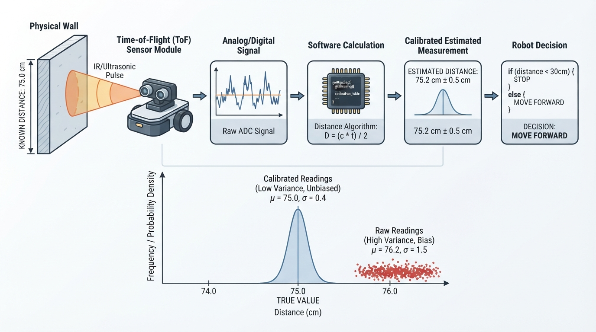
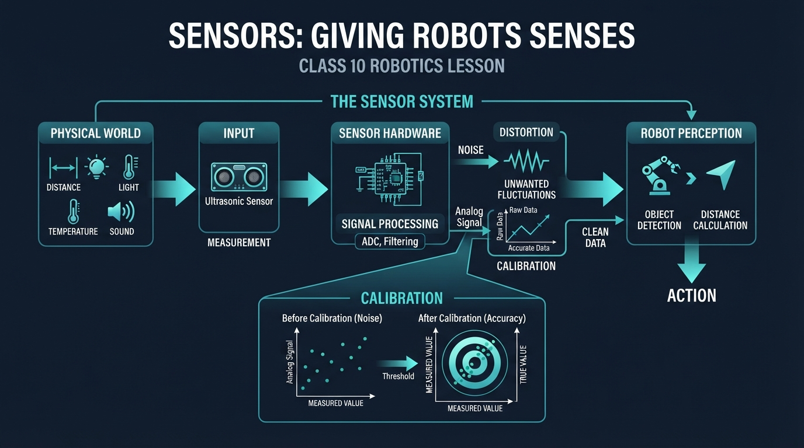
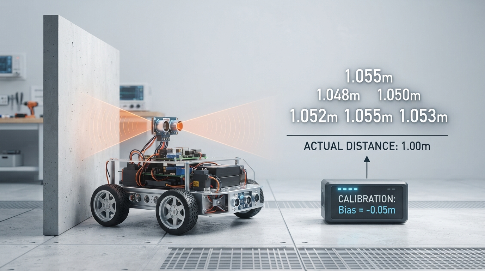
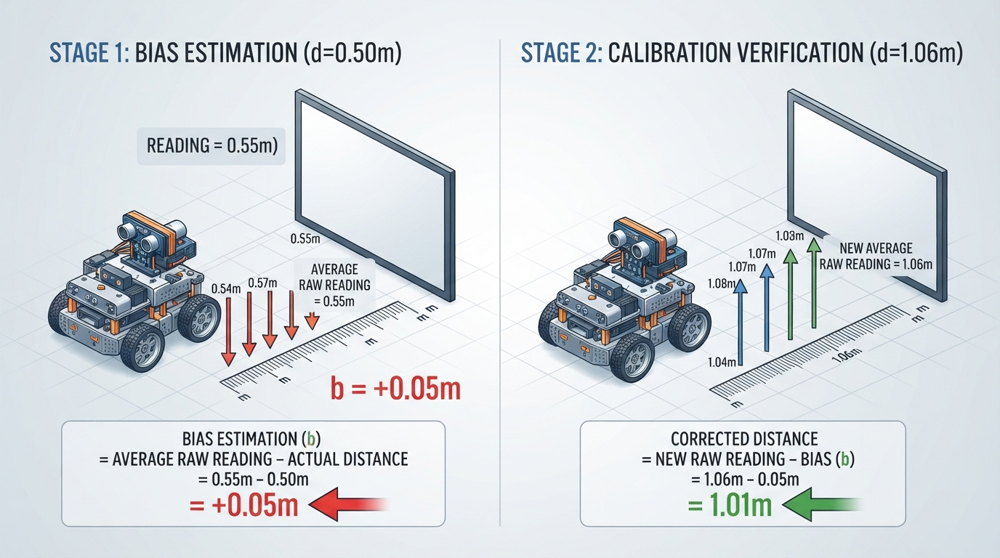
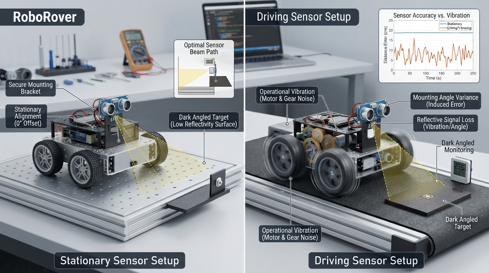

# Class 10: Sensors: Giving Robots Senses

## Where We Are in the Robotics Journey

RoboRover can now use gears to trade speed for strength. A gear train may help its wheels push harder or turn more slowly, but gears do not tell RoboRover what is happening around it.

That is the job of **sensors**.

A sensor is a device that measures something about the robot or its environment and produces a usable signal. A distance sensor measures distance. A wheel encoder measures rotation. A temperature sensor measures temperature. A camera measures patterns of light.

Today we will study three foundations:

1. **Measurement** — turning part of the physical world into a number.
2. **Noise** — unwanted variation in measurements.
3. **Calibration** — comparing a sensor with a known reference so its readings become more useful.

Next class, we will use these ideas with a specific sensor: an ultrasonic distance sensor.

## Today We Will Learn

By the end of this class, you should be able to:

- explain why a sensor reading is an estimate rather than perfect truth;
- distinguish the physical quantity being measured from the sensor’s output;
- recognize noise in a group of readings;
- calculate an average measurement;
- describe sensor bias and calibration;
- correct a simple sensor using a measured offset;
- identify real engineering problems such as vibration, temperature changes, mounting errors, and limited sensor range.

## 2-Minute Recap

In the previous class, gears changed the relationship between motor rotation and wheel rotation.

A **small driving gear** turning a **larger driven gear** usually gives:

- lower output speed;
- greater output torque, which is turning force.

Torque helps RoboRover push, climb, or start moving. However, the gears do not know whether the rover is near a wall, stuck against an object, or drifting away from a target.

A robot needs both:

- **actuators**, which produce physical action, such as motors;
- **sensors**, which provide measurements about conditions.

A useful mental picture is:

> Gears help RoboRover act. Sensors help RoboRover find out what happened.

## The Big Idea




**Figure:** A sensor does not transmit perfect truth; it converts a physical condition into a signal that software interprets.

Imagine asking RoboRover, “How far are you from the red box?”

RoboRover cannot directly receive the word *far*. A sensor might produce a voltage, a pulse timing, a digital count, or an image. Software then converts that signal into an estimated distance.

The complete chain looks like this:

```text
physical world
      ↓
sensor interaction
      ↓
electrical or digital signal
      ↓
calculation
      ↓
estimated measurement
      ↓
robot decision or display
```

For example:

```text
wall is physically 1.00 m away
      ↓
sensor produces a reading
      ↓
electronics report 1.06 m
      ↓
software applies calibration
      ↓
robot estimates 1.01 m
```

The final number may still be imperfect. Calibration can reduce a repeatable error, but it cannot automatically remove every source of uncertainty.

### Measurement is not the same as truth

Let the actual physical quantity be called the **true value**. A sensor produces a **measurement** or **reading**.

A simple model is:

\[
\text{reading} = \text{true value} + \text{bias} + \text{noise}
\]

Here:

- **reading** is the sensor’s reported value, in the quantity’s units;
- **true value** is the physical value we want to know, such as \(1.00\ \text{m}\);
- **bias** is a repeatable error, such as always reading \(0.05\ \text{m}\) too large;
- **noise** is variation that changes from one reading to another.

This model is not a complete description of every sensor, but it is an excellent starting point.

## See It in Your Head

### AI-Generated Engineering Visual · Professor OS



**How to read this visual:** Trace the signal or idea from left to right. Match each block to the lesson explanation, then predict what would change if one block produced a wrong value.




**Figure:** The readings are close together but shifted high: this illustrates precision with bias and measurement noise.

Picture RoboRover facing a wall.

Draw four layers from left to right:

1. **Wall:** label the real distance as \(1.00\ \text{m}\).
2. **Sensor beam:** show a cone or line from the rover toward the wall.
3. **Sensor output:** show several readings: \(1.08\), \(1.04\), \(1.06\), \(1.07\), and \(1.05\ \text{m}\).
4. **Calibration box:** subtract an estimated bias of \(0.05\ \text{m}\), producing corrected readings near \(1.00\ \text{m}\).

The readings are close together, but they are not identical. Their spread represents **noise**. Their average is higher than the true distance, showing a positive **bias**.

Two important ideas can be shown visually:

- **Precision:** how tightly repeated readings cluster;
- **Accuracy:** how close the readings are to the true value.

A sensor can be precise but inaccurate. For example, it might repeatedly report \(1.06\ \text{m}\) when the wall is actually \(1.00\ \text{m}\). The readings cluster tightly, but they are shifted away from the truth.

## Core Concept

### 1. Measurement

A measurement is a number connected to a unit and a physical quantity.

Examples:

- \(0.50\ \text{m}\) for distance;
- \(22.4\ ^\circ\text{C}\) for temperature;
- \(3.7\ \text{V}\) for voltage;
- \(120\) encoder counts for wheel rotation.

A bare number is often incomplete. Saying “the sensor read 50” is not enough. We should ask:

- 50 what?
- in what unit?
- over what range?
- with what uncertainty?
- under what conditions?

### 2. Noise

Noise is unwanted variation in a measurement.

Possible causes include:

- electrical interference;
- vibration from motors and gears;
- changing lighting;
- a rough or angled target;
- small timing differences;
- air movement;
- changes in temperature.

Noise is not always random in a perfectly ideal way. Some disturbances repeat with motor rotation or appear only at certain distances. Still, treating small unpredictable changes as noise is useful for introductory analysis.

A common response is to take several readings and calculate their average:

\[
\bar{x}=\frac{x_1+x_2+\cdots+x_n}{n}
\]

where:

- \(\bar{x}\) is the average reading, in the same units as each \(x_i\);
- \(x_1, x_2,\ldots,x_n\) are individual readings;
- \(n\) is the number of readings, with no unit.

Averaging can reduce the effect of changing noise. It does **not** remove a constant bias. If every reading is too high by \(0.05\ \text{m}\), their average will also tend to be too high by \(0.05\ \text{m}\).

### 3. Calibration

Calibration compares a sensor with a known reference.

Suppose a target is known to be \(0.50\ \text{m}\) away. RoboRover records:

\[
0.56,\ 0.54,\ 0.55,\ 0.57,\ 0.53\ \text{m}
\]

The average is:

\[
\bar{x}_{\text{reference}}
=
\frac{0.56+0.54+0.55+0.57+0.53}{5}
=
0.55\ \text{m}
\]

The estimated bias is:

\[
b=\bar{x}_{\text{reference}}-x_{\text{known}}
\]

where:

- \(b\) is estimated bias, in meters;
- \(\bar{x}_{\text{reference}}\) is the average sensor reading, in meters;
- \(x_{\text{known}}\) is the known reference distance, in meters.

Therefore:

\[
b=0.55\ \text{m}-0.50\ \text{m}=0.05\ \text{m}
\]

If a later raw reading is \(1.06\ \text{m}\), a simple corrected reading is:

\[
x_{\text{corrected}}=x_{\text{raw}}-b
\]

where:

- \(x_{\text{corrected}}\) is the calibrated estimate, in meters;
- \(x_{\text{raw}}\) is the uncorrected sensor reading, in meters;
- \(b\) is the estimated bias, in meters.

Thus:

\[
x_{\text{corrected}}=1.06\ \text{m}-0.05\ \text{m}=1.01\ \text{m}
\]

The correction improves the estimate, but it does not promise perfection.

## Math Without Fear

Let us separate three quantities.

### Error

\[
e=x_{\text{measured}}-x_{\text{true}}
\]

where:

- \(e\) is measurement error, in meters;
- \(x_{\text{measured}}\) is the sensor reading, in meters;
- \(x_{\text{true}}\) is the actual value, in meters.

For a reading of \(1.06\ \text{m}\) when the true distance is \(1.00\ \text{m}\):

\[
e=1.06\ \text{m}-1.00\ \text{m}=+0.06\ \text{m}
\]

The positive sign means the sensor overestimated the distance.

### Range and spread

The **range** of a set of readings is:

\[
\text{range}=x_{\text{maximum}}-x_{\text{minimum}}
\]

For readings from \(1.04\ \text{m}\) to \(1.08\ \text{m}\):

\[
\text{range}=1.08\ \text{m}-1.04\ \text{m}=0.04\ \text{m}
\]

This tells us the total distance between the smallest and largest reading. It is a simple description of noise, not a complete uncertainty analysis.

## Worked Robotics Example




**Figure:** Calibration estimates a repeatable offset from a known reference and subtracts it from later readings.

RoboRover is placed \(0.50\ \text{m}\) from a flat test board. The distance is measured with a ruler before testing.

The sensor reports:

| Trial | Raw reading |
|---:|---:|
| 1 | \(0.56\ \text{m}\) |
| 2 | \(0.54\ \text{m}\) |
| 3 | \(0.55\ \text{m}\) |
| 4 | \(0.57\ \text{m}\) |
| 5 | \(0.53\ \text{m}\) |

### Step 1: Find the average

\[
\bar{x}=\frac{0.56+0.54+0.55+0.57+0.53}{5}
=0.55\ \text{m}
\]

The average is \(0.55\ \text{m}\), which is \(0.05\ \text{m}\) too large.

### Step 2: Estimate bias

\[
b=0.55\ \text{m}-0.50\ \text{m}=0.05\ \text{m}
\]

### Step 3: Test another location

RoboRover is moved to a location whose true distance is not yet known. The sensor reports:

\[
1.08,\ 1.04,\ 1.06,\ 1.07,\ 1.05\ \text{m}
\]

The raw average is:

\[
\bar{x}_{\text{raw}}
=
\frac{1.08+1.04+1.06+1.07+1.05}{5}
=1.06\ \text{m}
\]

Apply the calibration:

\[
\bar{x}_{\text{corrected}}
=
1.06\ \text{m}-0.05\ \text{m}
=1.01\ \text{m}
\]

Interpretation: the calibration shifts RoboRover’s estimate downward by \(0.05\ \text{m}\). The readings still vary because noise remains.

## Python Lab

This program simulates the exact measurement example, calculates the calibration offset, checks the arithmetic with assertions, and plots raw and corrected readings.

Before running it, **predict**:

1. Will the corrected readings be larger or smaller than the raw readings?
2. Will the corrected readings all become exactly \(1.00\ \text{m}\)?
3. Which set should have the smaller average error if the calibration is useful?

```python
import math
import matplotlib.pyplot as plt

# Measurements are in metres.
known_distance = 0.50

reference_readings = [0.56, 0.54, 0.55, 0.57, 0.53]
test_readings = [1.08, 1.04, 1.06, 1.07, 1.05]

def average(values):
    """Return the arithmetic mean of a non-empty list of numbers."""
    return sum(values) / len(values)

# Estimate a constant sensor bias using the known reference.
reference_average = average(reference_readings)
bias = reference_average - known_distance

# Correct every later reading by subtracting the estimated bias.
corrected_readings = [reading - bias for reading in test_readings]

raw_average = average(test_readings)
corrected_average = average(corrected_readings)

print("Reference average: {:.2f} m".format(reference_average))
print("Estimated bias: {:.2f} m".format(bias))
print("Raw test average: {:.2f} m".format(raw_average))
print("Corrected test average: {:.2f} m".format(corrected_average))
print("Corrected readings:", ["{:.2f} m".format(x) for x in corrected_readings])

# Floating-point arithmetic can represent decimal values approximately,
# so compare calculated values with a small tolerance.
assert math.isclose(reference_average, 0.55)
assert math.isclose(bias, 0.05)
assert math.isclose(raw_average, 1.06)
expected_corrected = [1.03, 0.99, 1.01, 1.02, 1.00]
assert all(
    math.isclose(actual, expected)
    for actual, expected in zip(corrected_readings, expected_corrected)
)
assert math.isclose(corrected_average, 1.01)

# Plot each test reading before and after calibration.
trial_numbers = list(range(1, len(test_readings) + 1))

plt.plot(trial_numbers, test_readings, "o-", label="Raw readings")
plt.plot(trial_numbers, corrected_readings, "s-", label="Corrected readings")
plt.axhline(1.00, color="black", linestyle="--", label="Reference: 1.00 m")

plt.xlabel("Trial number")
plt.ylabel("Distance (m)")
plt.title("RoboRover Sensor Calibration")
plt.xticks(trial_numbers)
plt.legend()
plt.grid(True)
plt.tight_layout()
plt.show()
```

### Important lines

- `known_distance = 0.50` stores the reference distance in meters.
- `average()` keeps the averaging operation clear and reusable.
- `bias = reference_average - known_distance` estimates the repeatable offset.
- The list comprehension creates a corrected value for each test reading.
- `assert` stops the program if an expected exact calculation is wrong.
- `plt.axhline()` draws the \(1.00\ \text{m}\) comparison line.

The plot should show the corrected squares below the raw circles by the same vertical amount. They should still have some variation rather than becoming perfectly identical.

## Mini Simulation or Game

Try a “calibration detective” experiment.

Change `test_readings` to a new group, such as:

```python
test_readings = [0.83, 0.81, 0.84, 0.82, 0.80]
```

Before running:

- What do you predict the raw average will be?
- What will the corrected average be after subtracting \(0.05\ \text{m}\)?
- Will calibration reduce the average error if the same bias applies at this distance?

Then change the reference readings so their average is lower than \(0.50\ \text{m}\), for example:

```python
reference_readings = [0.47, 0.48, 0.46, 0.49, 0.50]
```

Predict the sign of the bias. A negative bias means the sensor tends to read too small, so subtracting that negative number will increase later readings.

Because the assertions in the original program verify the original data only, update or temporarily remove the original exact-value assertions when experimenting. A careful programmer should replace them with new expected values or broader checks.

## What Should Happen?

For the original program:

- the reference average should be \(0.55\ \text{m}\);
- the estimated bias should be \(+0.05\ \text{m}\);
- corrected readings should be smaller than raw readings;
- corrected readings should not all equal \(1.00\ \text{m}\);
- the corrected test average should be \(1.01\ \text{m}\).

The calibration removes a constant offset from the average, but noise remains in individual readings.

A useful observation is that calibration does not “make the sensor know the truth.” It gives the sensor a better mathematical relationship to the truth under similar conditions.

## Common Mistakes

### Mistake 1: Treating one reading as unquestionable

A single reading may be affected by vibration, timing, or an object’s surface. Repeated measurements help reveal variation.

### Mistake 2: Thinking averaging removes bias

Averaging reduces changing noise, but a constant offset remains. If a sensor always reads too high, the average is still too high.

### Mistake 3: Calibrating once and forgetting conditions

A calibration made with RoboRover level on a cool workbench may not work perfectly when:

- the rover tilts;
- the target is angled;
- motors vibrate the sensor;
- temperature changes;
- the sensor is mounted differently.

### Mistake 4: Confusing units

A sensor may report centimeters while the program expects meters. A reading of `50` could mean \(50\ \text{cm}\), \(50\ \text{mm}\), or something else. Unit conversion must be explicit:

\[
1\ \text{m}=100\ \text{cm}
\]

Therefore:

\[
50\ \text{cm}=0.50\ \text{m}
\]

### Mistake 5: Believing calibration fixes every error

A simple offset correction works best when the error is approximately constant. Some sensors have errors that change with distance. This is called **nonlinearity**. A more advanced calibration may use several reference distances and fit a curve or piecewise rule. That is a later topic.

## Try It Yourself

### Challenge: Build a measurement report

Using the Python program:

1. Create a new set of five reference readings around \(0.75\ \text{m}\).
2. Calculate a bias from that reference.
3. Create five test readings around \(1.25\ \text{m}\).
4. Apply the bias correction.
5. Add a printed line showing the raw and corrected averages.
6. Explain whether the corrected average moved closer to the likely true value.

Write down your predictions before running the program.

### Optional extension

Add a simple estimate of the reading spread:

```python
test_readings = [1.08, 1.04, 1.06, 1.07, 1.05]
spread = max(test_readings) - min(test_readings)
print("Test reading range: {:.2f} m".format(spread))
```

The range is not a complete uncertainty model, but it gives a quick description of how far apart the readings are.

For an extra challenge, plot a horizontal line for a known test distance and compare the raw and corrected errors.

## Quick Quiz

1. What is the difference between sensor noise and sensor bias?

2. RoboRover measures a known \(2.00\ \text{m}\) distance and averages \(1.92\ \text{m}\). What is the estimated bias?

3. A sensor produces readings of \(10.1\), \(9.9\), \(10.0\), and \(10.2\ \text{cm}\). What is their average?

4. Why might a calibration performed on a stationary rover become less accurate while the rover is driving?

## Answers

1. **Noise** is changing variation between readings. **Bias** is a repeatable offset that tends to shift readings in one direction.

2. The estimated bias is:

   \[
   b=1.92\ \text{m}-2.00\ \text{m}=-0.08\ \text{m}
   \]

   The sensor reads, on average, \(0.08\ \text{m}\) too small.

3. The average is:

   \[
   \frac{10.1+9.9+10.0+10.2}{4}
   =
   \frac{40.2}{4}
   =
   10.05\ \text{cm}
   \]

4. Driving introduces vibration, changes the sensor’s angle, and may change the target surface or lighting. The sensor’s behavior may also depend on temperature and speed.

## Real Robot Connection




**Figure:** Real robots change the sensing conditions through vibration, motion, mounting geometry, target surfaces, and environmental changes.

In a real robot, sensor data usually travels through several layers:

```text
physical target
   → sensing element
   → electronics
   → digital value
   → calibration conversion
   → robot software
```

RoboRover’s gears create useful motion, but they also create vibration. A vibrating sensor may produce noisier readings than the same sensor mounted on a stationary table.

Mounting matters too. If a distance sensor points slightly downward, it may measure the floor or a lower part of a nearby object instead of the intended wall. A shiny, soft, dark, or angled surface may interact differently with different sensor technologies.

Sensors also have limits:

- a minimum and maximum useful range;
- a response time, creating delay;
- a maximum update rate;
- possible saturation, where different physical values produce the same output;
- sensitivity to environmental conditions.

Calibration should therefore be treated as an engineering process:

1. define the quantity and units;
2. use a known reference;
3. collect repeated readings;
4. calculate the error pattern;
5. test the correction under realistic conditions;
6. recalibrate if the setup changes.

Next class, ultrasonic sensing will add a particularly important detail: RoboRover will estimate distance from the timing of an emitted sound pulse and its returning echo. The measurement will depend on both timing and assumptions about sound traveling through the air.

## Vocabulary

- **Sensor:** A device that measures a physical quantity and produces a usable signal.
- **Measurement:** A numerical estimate of a physical quantity, expressed with appropriate units.
- **Reading:** The value reported by a sensor at a particular moment.
- **True value:** The physical value we are trying to determine; it may not be known exactly.
- **Noise:** Unwanted variation that changes from one measurement to another.
- **Bias:** A repeatable measurement offset that shifts readings higher or lower.
- **Calibration:** Comparing sensor readings with known references and using the comparison to improve measurements.
- **Accuracy:** How close a measurement is to the true or reference value.
- **Precision:** How closely repeated measurements agree with one another.
- **Average:** The sum of a group of values divided by the number of values.
- **Offset correction:** A calibration method that adds or subtracts an estimated constant bias.
- **Saturation:** A sensor condition in which its output reaches a limit and no longer changes normally with the physical input.
- **Actuator:** A device that produces physical action, such as a motor or servo.

## Further Learning

To deepen this topic, investigate these search-friendly resource names:

- “sensor accuracy versus precision laboratory activity”
- “robotics sensor calibration experiment”
- “measurement uncertainty for beginners”
- “robotics sensor noise filtering introduction”
- “ultrasonic distance sensor timing principle”

When studying examples, always ask which quantity is measured, what units are used, what assumptions are made, and what can disturb the reading.

## Next Class

**Class 11: Ultrasonic Distance Sensing**

RoboRover will send out a sound pulse, wait for an echo, and use the measured travel time to estimate distance. We will connect timing, units, calibration, and real-world limitations such as echoes, angled surfaces, and sensor blind spots.
