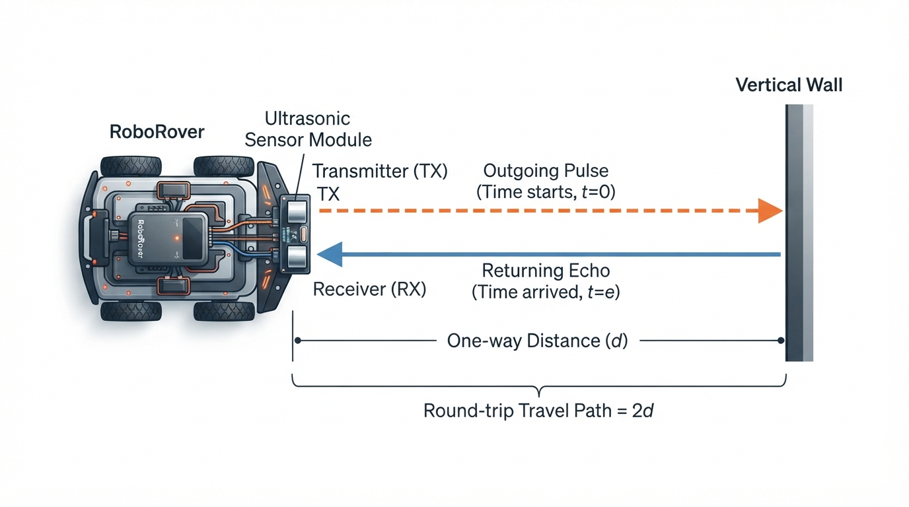
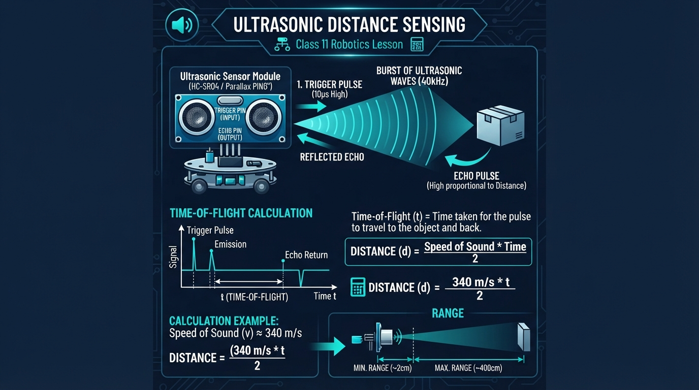
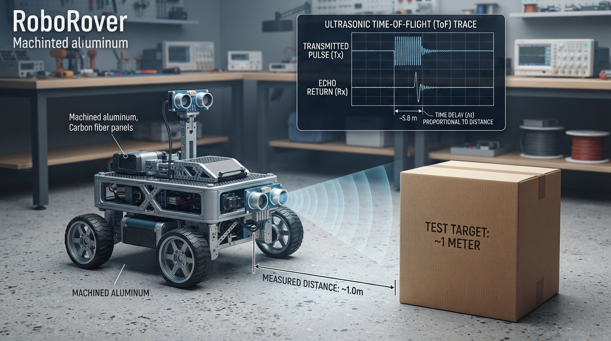
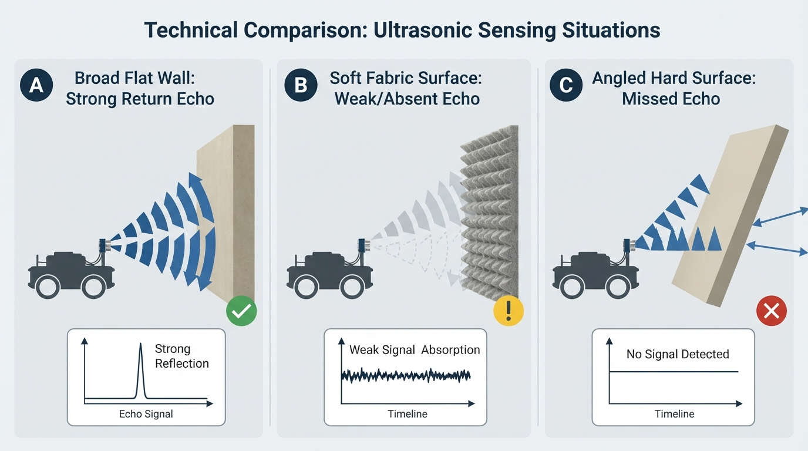

# Class 11: Ultrasonic Distance Sensing

## Where We Are in the Robotics Journey

In the previous class, **Sensors: Giving Robots Senses**, RoboRover learned that sensors convert parts of the physical world into measurable signals. A light sensor responds to brightness, a switch reports contact, and a temperature sensor reports thermal conditions.

Today we study one particular sensor: the **ultrasonic distance sensor**. It helps RoboRover estimate how far away an object is by sending out a sound pulse and timing its echo.

Next class, **Infrared Sensors**, will introduce another way to detect distance or nearby objects. Ultrasonic and infrared sensors can both help a robot avoid obstacles, but they behave differently around shiny, soft, narrow, transparent, or oddly shaped objects.

## Today We Will Learn

By the end of this class, you should be able to:

- explain **time of flight** using an echo analogy;
- calculate distance from the travel time of an ultrasonic pulse;
- explain why the distance equation divides by two;
- distinguish **range** from a simple “object detected” signal;
- simulate an ultrasonic sensor in Python;
- identify practical problems such as soft surfaces, angled objects, temperature changes, and false echoes.

## 2-Minute Recap

A sensor is a device that measures something about the robot’s surroundings or internal condition.

A sensor reading is not the same thing as perfect knowledge. For example, if a distance sensor reports 80 centimetres, the real object might be slightly closer or farther away because of electrical noise, calibration error, or the way sound reflected from the object.

A useful sensor has three parts:

1. **Physical interaction** — something happens in the world, such as light arriving or sound reflecting.
2. **Measurement** — the sensor turns that interaction into a number or signal.
3. **Interpretation** — the robot uses the measurement to decide what the number means.

Today’s sensor measures distance by using reflected sound.

**Predict before reading on:** If RoboRover sends a sound pulse toward a wall and receives its echo 0.010 seconds later, has the sound travelled 1 metre, 2 metres, or some other distance? Remember that the sound travels to the wall and then back.

## The Big Idea




**Figure:** The sensor measures the round-trip path, so the one-way range is half of v times t.

Imagine shouting in a canyon. Your voice travels outward, hits a surface, and returns as an echo. If you know:

- how fast sound travels, and
- how long the round trip takes,

you can estimate how far away the surface is.

An ultrasonic distance sensor performs a similar experiment, but with a sound frequency above the normal human hearing range. “Ultrasonic” means **above human hearing**. Many common ultrasonic modules send a short burst near 40,000 hertz, or 40 kilohertz. The exact hardware varies, so a robot program should use the sensor’s documented specifications rather than assuming every module is identical.

The sensor usually has two visible parts:

- a **transmitter**, which sends the sound pulse;
- a **receiver**, which detects the returning echo.

The robot does not directly measure distance. It measures a time interval and converts that interval into distance.

That distinction matters. A sensor reading such as “0.73 metres” is already the result of a model:

> measured echo time + assumed sound speed → estimated range

## See It in Your Head

### AI-Generated Engineering Visual · Professor OS



**How to read this visual:** Trace the signal or idea from left to right. Match each block to the lesson explanation, then predict what would change if one block produced a wrong value.


Picture a top-down diagram:

```text
RoboRover                  Wall
 [sensor]  ───────►         │
            outgoing pulse │
 [sensor]  ◄───────         │
            returning echo  │

          one-way distance = d
          round-trip distance = 2d
```

The outgoing and returning paths form two equal sections if the pulse travels straight to a flat wall and back.

An illustrator could show:

- RoboRover on the left;
- a vertical wall on the right;
- blue wavefronts expanding from the sensor;
- a blue reflected wave travelling back;
- arrows labelled “outgoing” and “returning”;
- a timer labelled \(t\);
- a bracket from the sensor to the wall labelled “range \(d\).”

The sensor’s “field of view” is not a perfect laser-thin line. Sound spreads into a cone. A nearby object at an angle may reflect the pulse before a more distant wall does.

## Core Concept

### Time of flight

**Time of flight**, often abbreviated TOF, is the time required for a signal to travel from a transmitter to a target and, in echo sensing, return to a receiver.

For an ultrasonic echo sensor:

\[
\text{round-trip distance} = v t
\]

The sound travels twice the one-way range, so:

\[
2d = vt
\]

Solving for range:

\[
d = \frac{vt}{2}
\]

where:

- \(d\) is the one-way distance from sensor to object, in metres \((\text{m})\);
- \(v\) is the speed of sound, in metres per second \((\text{m/s})\);
- \(t\) is the measured round-trip echo time, in seconds \((\text{s})\).

The division by 2 is essential. Without it, RoboRover would mistake the round-trip path for the one-way distance and report a value approximately twice as large.

### Range

**Range** is the estimated distance from a sensor to a detected object or surface.

This is different from a simple proximity switch:

- “Object present” is a categorical result.
- “Object is approximately 0.62 metres away” is a range measurement.

A real sensor may have a **minimum range** and a **maximum range**. Very close objects may be difficult to measure because the echo returns before the electronics are ready. Very distant objects may return an echo too weak to detect.

### Why sound speed matters

At room temperature, a useful teaching approximation is:

\[
v \approx 343\ \text{m/s}
\]

The speed of sound changes with air temperature and, to a smaller degree in ordinary classroom situations, humidity and air conditions. Therefore, the equation gives an estimate, not magical certainty.

## Math Without Fear

Suppose an ultrasonic sensor receives an echo after:

\[
t = 0.0085\ \text{s}
\]

Use:

\[
v = 343\ \text{m/s}
\]

Substitute:

\[
d = \frac{(343\ \text{m/s})(0.0085\ \text{s})}{2}
\]

The units simplify:

\[
\text{m/s} \times \text{s} = \text{m}
\]

So:

\[
d = \frac{2.9155\ \text{m}}{2}
= 1.45775\ \text{m}
\]

RoboRover’s estimated range is therefore approximately:

\[
\boxed{1.46\ \text{m}}
\]

Interpretation: the sound travelled about 2.92 metres in total—1.46 metres outward and 1.46 metres back.

A useful rearrangement is:

\[
t = \frac{2d}{v}
\]

For a target 0.50 metres away:

\[
t = \frac{2(0.50\ \text{m})}{343\ \text{m/s}}
\approx 0.00292\ \text{s}
\]

That is about 2.92 milliseconds. Ultrasonic sensors must measure very short time intervals accurately.

## Worked Robotics Example




**Figure:** A measured echo time is converted into range using the assumed speed of sound and the round-trip correction.

RoboRover is moving toward a cardboard box. Its ultrasonic sensor measures an echo time of \(5.8\) milliseconds.

First convert milliseconds to seconds:

\[
5.8\ \text{ms}
= 5.8 \times 0.001\ \text{s}
= 0.0058\ \text{s}
\]

Assume the speed of sound is:

\[
v = 343\ \text{m/s}
\]

Now calculate:

\[
d = \frac{vt}{2}
\]

\[
d = \frac{(343\ \text{m/s})(0.0058\ \text{s})}{2}
\]

\[
d = \frac{1.9894\ \text{m}}{2}
= 0.9947\ \text{m}
\]

So the box is approximately:

\[
\boxed{0.995\ \text{m away}}
\]

or about \(99.5\) centimetres.

If RoboRover’s safety rule is “stop when the range is below \(0.60\) metres,” it should not stop because of this reading alone. However, a real robot should not rely on one perfect measurement. It should consider noisy readings, braking distance, and whether the box is actually large enough to reflect sound reliably.

## Python Lab

This program simulates RoboRover approaching a wall. It converts echo time into range and displays a simple stop-or-go rule.

The simulation includes small, deliberately chosen measurement offsets. These represent sensor imperfections. The `true_distances` list describes the actual distance, while `measured_distances` represents what the sensor estimates after small errors.

```python
import math
import matplotlib.pyplot as plt

# Approximate speed of sound in air at room temperature.
SPEED_OF_SOUND_M_PER_S = 343.0

# RoboRover's actual distance from the wall at several moments.
true_distances = [2.00, 1.50, 1.00, 0.75, 0.50, 0.25]

# Small measurement offsets imitate sensor noise or calibration error.
measurement_offsets = [0.00, 0.03, -0.02, 0.02, -0.03, 0.03]

# Convert the actual one-way distance into a round-trip echo time.
echo_times = []
for distance in true_distances:
    time_seconds = (2.0 * distance) / SPEED_OF_SOUND_M_PER_S
    echo_times.append(time_seconds)

# Convert each simulated echo time back into an estimated range.
measured_distances = []
for index in range(len(echo_times)):
    estimated_range = (
        SPEED_OF_SOUND_M_PER_S * echo_times[index] / 2.0
        + measurement_offsets[index]
    )
    measured_distances.append(estimated_range)

# RoboRover stops if its estimated range is below this threshold.
STOP_DISTANCE_M = 0.60
actions = []
for distance in measured_distances:
    if distance < STOP_DISTANCE_M:
        actions.append("STOP")
    else:
        actions.append("GO")

# Executable checks verify the important numerical claims.
assert math.isclose(echo_times[0], 4.0 / 343.0, rel_tol=1e-12)
assert math.isclose(measured_distances[0], 2.00, rel_tol=1e-12)
assert math.isclose(measured_distances[1], 1.53, rel_tol=1e-12)
assert actions.count("STOP") == 2
assert actions[-1] == "STOP"

print("Distance (m) | Echo time (ms) | Estimated range (m) | Action")
for index in range(len(true_distances)):
    print(
        "{:12.2f} | {:14.3f} | {:19.2f} | {}".format(
            true_distances[index],
            echo_times[index] * 1000.0,
            measured_distances[index],
            actions[index]
        )
    )

print("All numerical checks passed.")
print("STOP actions:", actions.count("STOP"))

# Plot actual and estimated distances.
time_step_numbers = list(range(1, len(true_distances) + 1))

plt.plot(
    time_step_numbers,
    true_distances,
    marker="o",
    label="Actual distance"
)
plt.plot(
    time_step_numbers,
    measured_distances,
    marker="s",
    label="Estimated range"
)
plt.axhline(
    STOP_DISTANCE_M,
    color="red",
    linestyle="--",
    label="Stop threshold"
)

plt.xlabel("Measurement number")
plt.ylabel("Distance from wall (m)")
plt.title("RoboRover Ultrasonic Range Simulation")
plt.legend()
plt.grid(True)
plt.tight_layout()
plt.show()
```

Important lines:

- `time_seconds = (2.0 * distance) / SPEED_OF_SOUND_M_PER_S` uses the round-trip equation rearranged as \(t=2d/v\).
- `estimated_range = SPEED_OF_SOUND_M_PER_S * echo_times[index] / 2.0` uses \(d=vt/2\).
- `measurement_offsets` shows that a real sensor may not report the exact physical distance.
- `plt.axhline(...)` draws the decision boundary, not a physical wall. It shows where the software changes from “GO” to “STOP.”
- The `assert` statements automatically check the numerical results instead of relying on visual inspection.

The plotted estimated line will not exactly match the actual line because of the offsets. It should follow the same general trend and drop as RoboRover approaches the wall.

## Mini Simulation or Game

Play “**Predict RoboRover’s action**” before running the program.

The stop threshold is \(0.60\) metres. Use:

\[
d = \frac{vt}{2}
\]

Predict the action for these echo times:

1. \(t=2.9\ \text{ms}\)
2. \(t=4.4\ \text{ms}\)
3. \(t=6.0\ \text{ms}\)

Use \(v=343\ \text{m/s}\).

For the first one:

\[
d = \frac{(343\ \text{m/s})(0.0029\ \text{s})}{2}
\approx 0.498\ \text{m}
\]

That is below \(0.60\) metres, so predict **STOP**.

Now predict the other two before checking:

- A \(4.4\) millisecond round trip should correspond to a distance a little below \(0.76\) metres.
- A \(6.0\) millisecond round trip should correspond to a distance slightly above \(1.0\) metre.

The important pattern is:

> longer echo time means farther object; shorter echo time means nearer object.

You can turn the Python lab into your own game by changing `measurement_offsets`, `STOP_DISTANCE_M`, or the entries in `true_distances`. Before running it, predict how the graph and the number of “STOP” actions will change.

## What Should Happen?

Before you run the program, predict these observations:

1. The echo time should become shorter as RoboRover approaches the wall.
2. The estimated range should generally decrease from the first measurement to the last.
3. The estimated line should differ slightly from the actual line.
4. Only the closest measurements should produce `STOP`.
5. The graph’s stop threshold should appear as a horizontal line at \(0.60\) metres.

The program’s built-in checks verify that:

- the first simulated echo time corresponds to a 2.00 metre range;
- the second estimated range is 1.53 metres;
- exactly two simulated actions are `STOP`;
- the final action is `STOP`.

## Common Mistakes

### Forgetting the return journey

Using \(d=vt\) treats the measured time as if the sound travelled only one way. An echo sensor measures the outward and return journey, so use:

\[
d=\frac{vt}{2}
\]

### Mixing milliseconds and seconds

The speed \(343\ \text{m/s}\) requires time in seconds. A value of \(5.8\) milliseconds must become \(0.0058\) seconds.

### Treating range as exact truth

An ultrasonic reading is an estimate. Sound may reflect from the nearest part of an object, a side surface, the floor, or another obstacle.

### Assuming every surface gives a strong echo

Hard, broad surfaces usually reflect sound more effectively than soft materials. Thick fabric, foam, or an object with an angled surface may absorb or redirect much of the pulse.

### Measuring while the robot is vibrating

Motor vibration can shake the sensor and change its angle. A small angle change can cause a large difference in the reflected echo.

### Expecting a narrow beam

Ultrasonic sound spreads. The sensor may detect an object that is not directly in front of the robot, especially if that object is large or close.

### Triggering measurements too quickly

The robot should allow enough time for an old echo to finish before sending another pulse. Otherwise, echoes from different pulses may be confused.

## Try It Yourself

### Challenge: RoboRover’s cardboard checkpoint

Modify the Python program so that RoboRover uses a stop threshold of \(0.80\) metres instead of \(0.60\) metres.

Before running it:

1. Predict how many simulated readings will produce `STOP`.
2. Identify which measurement numbers will stop the robot.
3. Explain why a larger threshold causes an earlier stop.

Then run the program and verify your prediction.

### Optional extension

Add a second rule:

- `STOP` if the estimated range is below \(0.80\) metres;
- `CHECK SENSOR` if the estimated range is above \(2.0\) metres;
- `GO` otherwise.

Use a new list of distances that includes at least one value above \(2.0\) metres. Be careful to keep the comparison order clear.

## Quick Quiz

1. What does an ultrasonic distance sensor measure directly: distance or echo time?

2. Why does the equation \(d=vt/2\) divide by two?

3. An echo returns after \(0.0040\) seconds. Using \(v=343\ \text{m/s}\), what is the estimated range?

4. Name one physical situation that can make an ultrasonic range reading unreliable.

## Answers

1. It measures **echo time** directly. The robot calculates range from that time using an assumed speed of sound.

2. The sound travels from the sensor to the object and then back to the sensor. The measured path is twice the one-way distance.

3.

\[
d=\frac{(343\ \text{m/s})(0.0040\ \text{s})}{2}
\]

\[
d=\frac{1.372\ \text{m}}{2}
=0.686\ \text{m}
\]

The estimated range is \(0.686\) metres, or \(68.6\) centimetres.

4. Acceptable answers include a soft surface, an angled object, a narrow object, strong motor vibration, temperature different from the assumed value, an object outside the useful range, or echoes from multiple surfaces.

## Real Robot Connection




**Figure:** Surface material and angle affect whether the receiver obtains a useful echo.

On a real RoboRover, an ultrasonic sensor might be mounted at the front bumper. The software could repeatedly:

1. trigger a sound pulse;
2. measure the echo duration;
3. calculate estimated range;
4. compare the range with a safety threshold;
5. command the motors to slow or stop.

That is a sensing-and-action loop, but the range measurement itself is not automatically perfect feedback control. The quality of the result depends on the whole engineering system: sensor timing, mounting, wiring, software delays, motor stopping distance, and the shape of the environment.

A practical failure mode is the **angled wall**. If the sound strikes a smooth wall at a steep angle, the echo may bounce away from the receiver. The sensor may report no echo or may detect a farther object instead. A robot designer might respond by:

- mounting several sensors at different angles;
- taking repeated readings;
- rejecting impossible sudden jumps;
- combining ultrasonic readings with another sensor type.

Another caveat is temperature. Since sound speed changes with air temperature, a robot operating in a cold room and one operating in a warm room can calculate slightly different ranges from the same echo time. For basic obstacle avoidance, this error may be acceptable. For precise measurement, compensation and calibration become more important.

Next class’s infrared sensors use electromagnetic radiation rather than sound. Infrared sensing can be faster or more compact in some designs, but it has its own difficulties, including surface reflectivity and interference from surrounding light. No single sensor is reliable in every environment.

## Vocabulary

- **Ultrasonic** — involving sound above the normal human hearing range.
- **Echo** — a reflected sound wave detected after it travels to a surface and returns.
- **Time of flight (TOF)** — the travel time of a signal from transmission to reception; for an echo sensor, this is usually the round-trip time.
- **Range** — the estimated distance from a sensor to a detected object or surface.
- **Transmitter** — the sensor part that sends the ultrasonic pulse.
- **Receiver** — the sensor part that detects the returning echo.
- **Speed of sound** — the rate at which sound travels through a medium such as air; this lesson uses \(343\ \text{m/s}\) as an approximate room-temperature value.
- **Round trip** — travel from the sensor to the object and back to the sensor.
- **Measurement error** — the difference between a reported value and the physical quantity being estimated.
- **Field of view** — the region in which a sensor is likely to detect objects; for an ultrasonic sensor, it is generally a spread-out sound region rather than a perfectly narrow line.

## Further Learning

For further study, explore these search-friendly resource topics:

- “ultrasonic sensor time of flight laboratory”
- “speed of sound temperature experiment”
- “ultrasonic sensor minimum range maximum range”
- “robot sensor fusion ultrasonic infrared”
- “echo reflection angle sound experiment”

A useful hands-on experiment is to place a large flat book at several measured distances from a sensor and compare calculated range with a ruler measurement. Repeat each measurement several times and record the spread of the readings. That spread is an introduction to practical sensor uncertainty.

## Next Class

In **Class 12: Infrared Sensors**, RoboRover will compare sound-based distance sensing with infrared sensing. You will investigate how reflected light can reveal nearby objects, why dark and shiny surfaces can behave differently, and why sensor choice depends on the environment.
