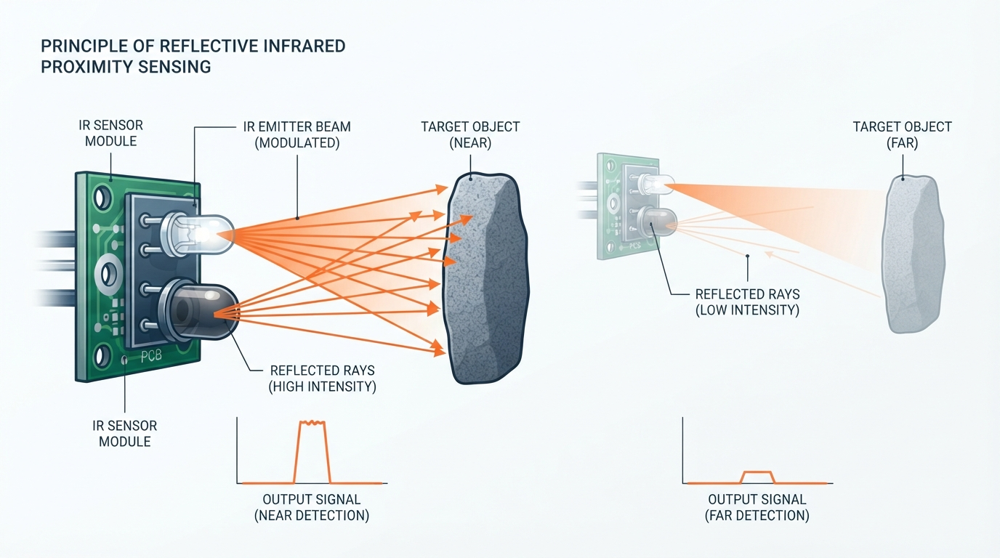
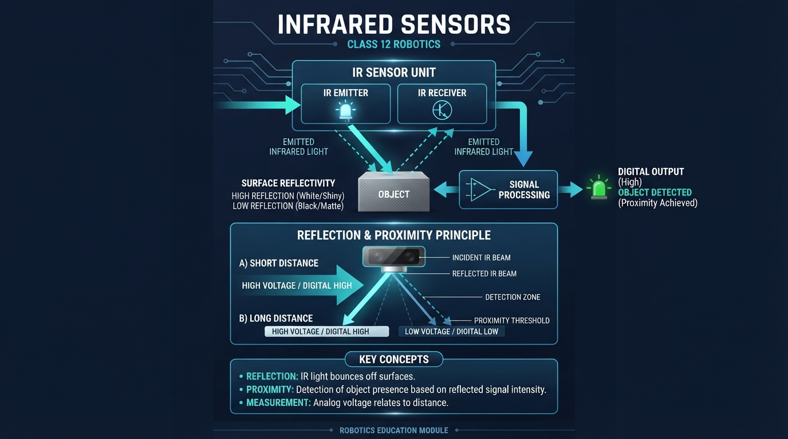
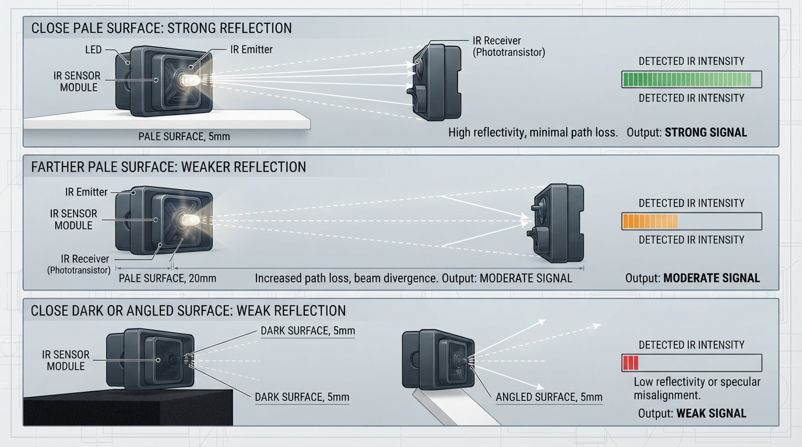
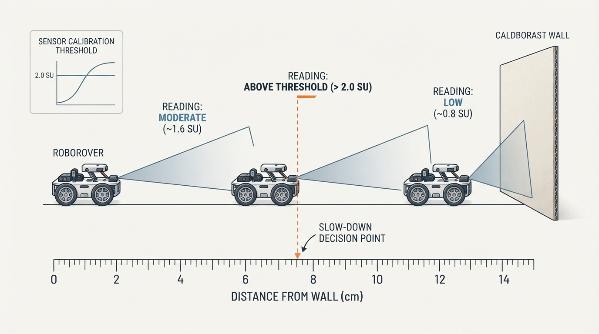
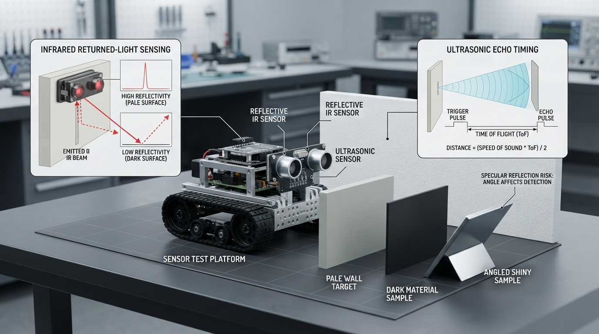

# Class 12: Infrared Sensors

## Where We Are in the Robotics Journey

RoboRover has just learned to measure distance with an **ultrasonic sensor**. It sends out a sound pulse, waits for an echo, and estimates distance from the echo’s travel time.

Today RoboRover will use a different kind of invisible wave: **infrared light**, often shortened to **IR**. An infrared proximity sensor sends out light, observes how much returns, and uses that returned light to notice nearby objects.

The two sensors answer related questions in different ways:

| Sensor | Sends | Measures | Main clue |
|---|---|---|---|
| Ultrasonic | Sound pulse | Echo travel time | “How long did the echo take?” |
| Infrared reflective sensor | Infrared light | Returned light strength | “How much light came back?” |

Next class, RoboRover will measure **wheel motion with encoders**. That will shift our attention from “What is near the robot?” to “How far have the wheels turned?”

## Today We Will Learn

By the end of this class, you should be able to:

- explain how a reflective infrared sensor detects a nearby object;
- distinguish light reflection from ultrasonic echo timing;
- describe why surface color, texture, angle, and sunlight affect an IR reading;
- use a simple calibration model to estimate proximity;
- choose a threshold for an “object detected” decision;
- identify why an IR sensor is usually a proximity detector rather than a perfect distance ruler.

## 2-Minute Recap

An ultrasonic sensor sends a sound pulse and measures the time until an echo returns. If the round-trip time is \(t\), the estimated distance \(d\) can be modeled as

\[
d=\frac{v t}{2}
\]

where:

- \(d\) is the distance to the object, in metres \((\text{m})\);
- \(v\) is the speed of sound, in metres per second \((\text{m/s})\);
- \(t\) is the round-trip travel time, in seconds \((\text{s})\);
- the factor \(2\) appears because the sound travels to the object and back.

The ultrasonic measurement depends mainly on **time**. Infrared reflection depends mainly on **returned light strength**, so its behavior is affected more strongly by the object’s surface and angle.

**Predict before reading on:** If a black object and a white object are placed at exactly the same distance from a reflective IR sensor, will the sensor necessarily produce the same reading?

The answer is no. Dark surfaces often return less infrared light than pale, reflective surfaces, although the exact behavior depends on the material and sensor design.

## The Big Idea




**Figure:** A reflective IR sensor estimates proximity from the strength of light returning to its receiver.

A reflective IR sensor is like a tiny flashlight and light detector mounted together.

1. An **IR emitter** sends out infrared light.
2. The light strikes a nearby surface.
3. Some light is absorbed, scattered, or reflected.
4. An **IR receiver** measures some of the returned light.
5. The robot uses the measurement to infer whether something is nearby.

Infrared light is electromagnetic radiation beyond the red end of visible light. Humans usually cannot see it, but electronic receivers can detect it.

A simple mental picture:

```text
             returned IR light
                  ↖   ↑   ↗
                   \  |  /
                    \ | /
              [IR receiver]
              [IR emitter]  →→→  object
                              ↗
                           reflection
```

The sensor does not usually “see distance” directly. It sees a light signal that tends to change with distance and surface properties.

That distinction matters. A reflective IR sensor may be excellent for detecting whether RoboRover is close to a white strip, wall, or object. It may be unreliable as a universal measuring tape.

## See It in Your Head

### AI-Generated Engineering Visual · Professor OS



**How to read this visual:** Trace the signal or idea from left to right. Match each block to the lesson explanation, then predict what would change if one block produced a wrong value.




**Figure:** Distance is only one influence on a reflective IR reading; surface reflectivity and angle matter too.

Imagine RoboRover approaching a cardboard box.

At a large distance, only a small amount of the emitted infrared light returns to the receiver. As RoboRover moves closer, the returning signal often becomes stronger.

Now imagine two boxes:

- Box A has a pale, rough surface.
- Box B has a very dark surface.

At the same distance, Box A may return more infrared light. The sensor could interpret Box A as “closer” even when both boxes are equally far away.

Now tilt the sensor:

- If it faces the box directly, much of the reflected light may return toward the receiver.
- If it points at a sharp angle, the light may reflect away from the receiver.

An illustrator could show three panels:

1. **Close pale object:** strong reflected rays and a high sensor reading.
2. **Far pale object:** weaker reflected rays and a lower reading.
3. **Close dark or angled object:** unexpectedly weak returned light.

The important lesson is that IR readings depend on both **distance** and **reflectivity**.

## Core Concept

### Reflection and proximity

When infrared light reaches a surface, it can be:

- absorbed by the material;
- scattered in many directions;
- reflected in a more organized direction;
- partially returned toward the sensor.

A reflective sensor is usually arranged so that the emitter and receiver face the same general area. It is not measuring an echo’s travel time. Instead, it measures the intensity of returned light.

A stronger reading often means one or more of these things:

- the object is closer;
- the surface reflects more IR light;
- the sensor is aimed more directly at the surface;
- the environment contains extra infrared light.

A weaker reading may mean:

- the object is farther away;
- the surface absorbs more IR;
- the sensor is angled away;
- sunlight or nearby lighting has disturbed the receiver;
- the object is outside the sensor’s useful range.

### Reflective sensor versus break-beam sensor

A **reflective IR sensor** places the emitter and receiver on the same side. It detects light returning from an object.

A **break-beam IR sensor** places an emitter on one side and a receiver on the other. It detects whether an object interrupts the beam.

Both use infrared light, but they answer different questions:

- Reflective: “Is something reflecting light back near me?”
- Break-beam: “Has something crossed between these two points?”

This class focuses on reflective proximity sensing.

### Threshold decisions

RoboRover often does not need an exact distance. It may only need a decision:

> “Is the object close enough to slow down?”

Suppose a sensor reading above 2.0 sensor units means “probably close.” Then the controller can use:

- reading \(<2.0\): continue;
- reading \(\geq 2.0\): slow or stop.

This is a **threshold decision**. It is useful, but the threshold must be tested on real materials.

A sensor-triggered stop is not automatically a complete distance-control system. If RoboRover simply stops when one reading crosses a threshold, it has made a feedback-related decision from a measurement, but it is not continuously adjusting its motion to maintain a chosen distance. Later classes will study more detailed control behavior.

## Math Without Fear

A simple teaching model for a reflective IR sensor is:

\[
S = \frac{K R}{d^2}
\]

where:

- \(S\) is the modeled sensor signal, in arbitrary sensor units;
- \(K\) is a scale constant for the sensor and setup;
- \(R\) is a dimensionless relative reflectivity value;
- \(d\) is distance, measured in centimetres \((\text{cm})\).

This equation is useful for intuition:

- increasing \(R\) makes the returned signal stronger;
- increasing \(d\) makes the signal weaker;
- doubling \(d\) reduces the modeled signal by a factor of four.

However, this is **not a universal IR sensor law**. Real sensors may contain lenses, filtering, nonlinear electronics, automatic gain, saturation, and geometry that do not match this simple equation.

### Worked numerical example

Suppose RoboRover’s classroom simulation uses:

- \(K=100\) sensor-unit-centimetres-squared;
- relative reflectivity \(R=0.80\);
- distance \(d=8.0\ \text{cm}\).

Then

\[
S=\frac{(100)(0.80)}{(8.0)^2}
\]

\[
S=\frac{80}{64}=1.25
\]

So the modeled reading is **1.25 sensor units**.

If RoboRover’s “close object” threshold is \(S=2.0\) sensor units, this object would not yet be classified as close.

Now at \(d=6.0\ \text{cm}\):

\[
S=\frac{(100)(0.80)}{(6.0)^2}
=\frac{80}{36}
\approx 2.22
\]

The modeled reading is approximately **2.22 sensor units**, so it crosses the 2.0 threshold.

Interpretation: under this simplified model, the same surface changes from “not close” at \(8.0\ \text{cm}\) to “close” at \(6.0\ \text{cm}\).

Real engineering practice would replace the model with a calibration table or curve made from actual measurements.

## Worked Robotics Example




**Figure:** A threshold is chosen from measured behavior: in this example, the 6 cm reading crosses the slow-down boundary.

RoboRover is carrying a fragile paper tower. It should slow down when a reflective IR sensor suggests that a wall is close.

The sensor is mounted at the front, \(4.0\ \text{cm}\) above the floor. The wall is pale cardboard, and testing gives these approximate readings:

| Distance from sensor to wall | Reading |
|---:|---:|
| \(12\ \text{cm}\) | \(0.8\) units |
| \(10\ \text{cm}\) | \(1.0\) units |
| \(8\ \text{cm}\) | \(1.4\) units |
| \(6\ \text{cm}\) | \(2.1\) units |
| \(4\ \text{cm}\) | \(3.0\) units |

The team chooses a threshold of \(2.0\) units.

At \(8\ \text{cm}\), the reading is \(1.4\), so RoboRover continues at normal speed.

At \(6\ \text{cm}\), the reading is \(2.1\), so RoboRover enters slow mode.

This threshold is not a magical distance detector. It was selected for a particular:

- sensor;
- wall material;
- sensor angle;
- mounting height;
- lighting environment;
- robot speed and stopping distance.

If the wall is black tape instead of pale cardboard, the same \(2.0\) threshold may be crossed much later—or not at all.

A practical design should leave room for uncertainty. If readings fluctuate around 2.0, RoboRover might repeatedly switch between normal and slow modes. A later control lesson can address this with filtering or hysteresis. For now, record several readings and choose a threshold with a safety margin.

## Python Lab

This program is a small, intentionally simplified IR proximity simulation. It models RoboRover moving toward a pale object.

The robot begins \(12\ \text{cm}\) away and moves \(1\ \text{cm}\) closer per step. The program uses:

\[
S=\frac{K R}{d^2}
\]

with \(K=100\), \(R=0.80\), and a detection threshold of \(2.0\) units.

**Predict before you run it:** At what distance will the simulation first report `CLOSE`?

```python
# Class 12: simplified infrared proximity simulation
# Compatible with Python 3.7

def infrared_signal(distance_cm, reflectivity, scale):
    """Return a simplified reflected-IR signal."""
    return scale * reflectivity / (distance_cm ** 2)


def main():
    scale = 100.0
    reflectivity = 0.80
    threshold = 2.0

    distance_cm = 12.0
    step_cm = 1.0
    first_close_distance = None
    steps_taken = 0

    print("distance_cm  signal  decision")

    while distance_cm >= 1.0:
        signal = infrared_signal(distance_cm, reflectivity, scale)

        if signal >= threshold:
            decision = "CLOSE"
            if first_close_distance is None:
                first_close_distance = distance_cm
        else:
            decision = "clear"

        print("{:10.1f}  {:6.2f}  {}".format(
            distance_cm, signal, decision
        ))

        if first_close_distance is not None:
            break

        distance_cm -= step_cm
        steps_taken += 1

    print()
    print("First CLOSE distance: {:.1f} cm".format(first_close_distance))
    print("Steps taken: {}".format(steps_taken))

    # Executable checks for the exact claims made by this simulation.
    assert first_close_distance == 6.0
    assert steps_taken == 6
    assert round(infrared_signal(8.0, reflectivity, scale), 2) == 1.25
    assert round(infrared_signal(6.0, reflectivity, scale), 2) == 2.22


if __name__ == "__main__":
    main()
```

Important lines:

- `infrared_signal(...)` keeps the sensor model separate from the robot’s decision.
- `distance_cm ** 2` represents the squared-distance term in the teaching model.
- `signal >= threshold` turns a numerical measurement into a proximity decision.
- `first_close_distance is None` ensures the program records the first crossing, not every later reading.
- The `assert` statements verify the exact simulation results.

This program is not a hardware driver. A real robot would replace the calculated signal with a voltage or digital value read from an actual sensor.

## Mini Simulation or Game

Change one value at a time and observe how the detection point changes.

1. Set `reflectivity = 0.40`.
2. Run the program.
3. Predict whether the object will be detected closer or farther away.
4. Restore `reflectivity = 0.80`.
5. Change `threshold = 1.0`.
6. Predict whether detection happens closer or farther away.

You can turn this into a simple challenge:

> Make RoboRover detect the pale object at \(8\ \text{cm}\) without changing `scale` or `reflectivity`.

A threshold of \(1.25\) would classify the \(8\ \text{cm}\) reading as close, because the signal there is exactly \(1.25\) units. In the program, change:

```python
threshold = 1.25
```

The program’s `>=` comparison means equality counts as detection.

## What Should Happen?

For the original settings:

- at \(8\ \text{cm}\), the modeled signal is \(1.25\) units;
- at \(6\ \text{cm}\), the modeled signal is approximately \(2.22\) units;
- the first `CLOSE` decision occurs at \(6.0\ \text{cm}\);
- the robot takes 6 one-centimetre steps from \(12\ \text{cm}\) to \(6\ \text{cm}\).

The assertions in the Python program verify these values.

If you changed the reflectivity from \(0.80\) to \(0.40\), every signal would be half as large. Detection would therefore occur closer to the object, or possibly not occur before the simulation’s minimum distance.

If you lowered the threshold from \(2.0\) to \(1.0\), RoboRover would classify more situations as close. That can make detection earlier, but it can also create false alarms.

## Common Mistakes

### Treating IR as exact distance

A reflective IR sensor does not automatically know distance. Its reading also depends on surface reflectivity, angle, lighting, and sensor geometry.

### Assuming black means “invisible”

Some dark materials absorb visible light but may reflect infrared differently. Material behavior must be measured rather than guessed.

### Ignoring sunlight

Sunlight contains infrared energy. Strong ambient IR can add noise or overwhelm a receiver, especially outdoors.

### Mounting the sensor at a poor angle

A sensor pointed toward a shiny or angled surface may receive very little returned light even when the object is close.

### Using one calibration for every surface

A calibration made on pale cardboard may not work on black foam, glossy plastic, carpet, or metal.

### Forgetting saturation

At very short distances, the receiver or electronics may reach a maximum reading. Moving even closer then produces little or no additional numerical change.

### Confusing a trigger with continuous control

A sensor crossing a threshold can start a fixed action. That is different from repeatedly measuring distance and continuously adjusting speed to maintain a target gap.

## Try It Yourself

### Challenge

Create a second version of the simulation that compares two objects:

- Object A: reflectivity \(R=0.80\);
- Object B: reflectivity \(R=0.40\).

Use the same scale and threshold for both. For distances from \(12\ \text{cm}\) down to \(1\ \text{cm}\), print whether each object is classified as `CLOSE`.

Then answer:

1. Which object is detected first?
2. Why can equal physical distances produce different decisions?
3. Is the result evidence that the darker object is farther away? Why not?

### Optional extension

Add a small random disturbance to the sensor signal using Python’s `random` library. Run the simulation several times and look for readings that fall just above or below the threshold.

Then improve the decision rule:

> Declare `CLOSE` only if at least two of the last three readings are above the threshold.

This is an introduction to making decisions more resistant to noise. It is not yet a full distance controller.

## Quick Quiz

1. What does a reflective IR sensor measure directly: travel time or returned light strength?

2. Why might a pale surface and a dark surface produce different readings at the same distance?

3. In the teaching model \(S=KR/d^2\), what happens to \(S\) if distance \(d\) doubles while \(K\) and \(R\) stay the same?

4. RoboRover repeatedly switches between `clear` and `CLOSE` while sitting still. Name one likely cause.

## Answers

1. It measures the strength of infrared light returning to the receiver.

2. Their materials may reflect or absorb different amounts of infrared light. Angle and texture can also change the returned signal.

3. The modeled signal becomes one quarter as large because \(d^2\) becomes four times as large.

4. Sensor noise, changing lighting, mechanical vibration, or a threshold that is too close to the normal reading could cause the switching.

## Real Robot Connection




**Figure:** Testing several materials and sensor types reveals why sensor readings must be calibrated in the real environment.

A real reflective IR module may provide:

- an analog output that changes with returned light strength;
- a digital output that switches when an onboard comparator crosses a threshold;
- both outputs, depending on the module.

For serious use, an engineer would test the sensor in the actual environment. The test might record readings for several distances and surfaces, then create a calibration table.

RoboRover could use an IR sensor for:

- detecting the edge of a table or a line on the floor;
- noticing a nearby wall;
- confirming that an object is present in a gripper area;
- counting objects crossing a reflective sensing region;
- slowing before a close obstacle.

Ultrasonic and IR sensors can complement one another. Ultrasonic sensing is based on sound travel time and may behave differently around dark surfaces. IR sensing can be compact and fast, but it is more sensitive to optical conditions and surface appearance.

Next class, wheel encoders will measure rotation rather than reflected energy. An encoder reading can tell RoboRover how much a wheel has turned, but it also has practical issues: missed counts, wheel slip, mechanical backlash, and calibration. The common engineering habit is the same in both classes:

> Do not trust a sensor because its number looks precise. Test what the number means.

## Vocabulary

- **Infrared (IR):** Electromagnetic radiation beyond visible red light that can be emitted and detected by electronic devices.
- **IR emitter:** The component that produces infrared light.
- **IR receiver:** The component that detects infrared light arriving from the environment.
- **Reflection:** The return or redirection of light from a surface.
- **Reflective IR sensor:** A sensor with an emitter and receiver on the same side that detects light returned from a nearby surface.
- **Proximity:** Nearness; in robotics, a proximity sensor usually indicates that an object is nearby rather than reporting a perfect distance.
- **Reflectivity:** A relative description of how strongly a surface returns light toward the sensor.
- **Sensor signal:** A numerical representation of what the sensor detects.
- **Threshold:** A chosen boundary used to convert a measurement into a decision.
- **Calibration:** Measuring a real sensor under known conditions so its readings can be interpreted.
- **Break-beam sensor:** An IR arrangement in which an object is detected by interrupting a beam between a separate emitter and receiver.
- **Saturation:** A condition in which a sensor or electronic circuit reaches its output limit and cannot represent larger or smaller inputs accurately.

## Further Learning

Useful search terms for continued study:

- “reflective infrared sensor calibration”
- “infrared proximity sensor ambient light”
- “analog versus digital IR sensor output”
- “robot line following infrared reflectance”
- “sensor threshold and hysteresis”
- “wheel encoder robotics fundamentals”

When studying a particular module, use its manufacturer’s datasheet to check its electrical connections, sensing range, output behavior, and recommended operating conditions. Do not assume that two modules with similar names have identical readings.

## Next Class

**Class 13: Encoders: Measuring Wheel Motion**

RoboRover will learn how rotating wheels can generate countable electrical signals. We will connect encoder counts to wheel rotation and distance traveled, while examining practical problems such as missed pulses and wheel slip.
