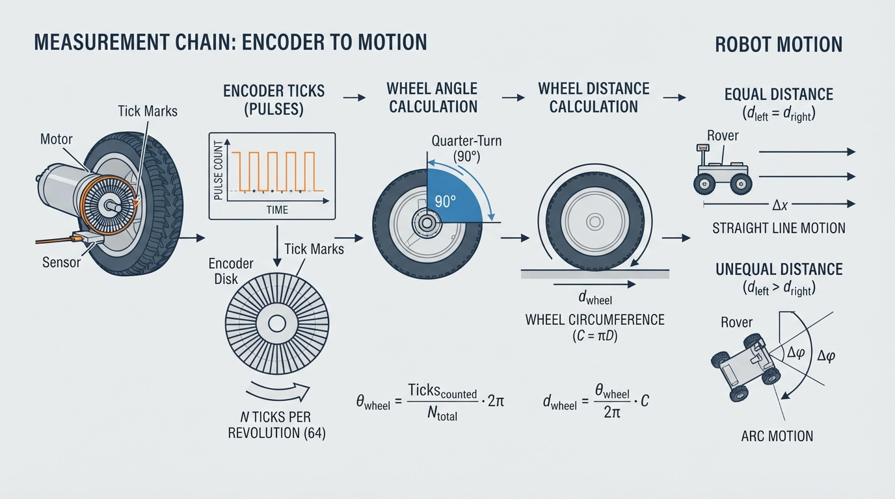
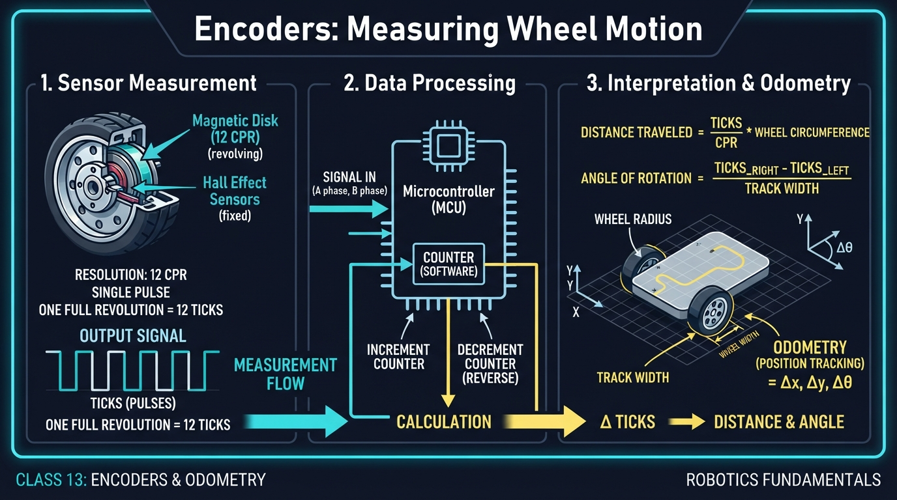
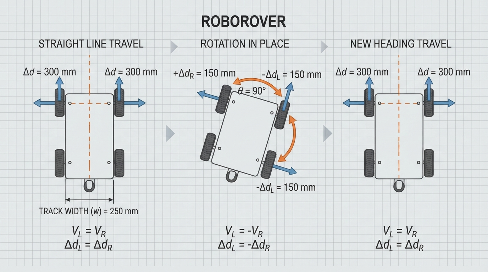
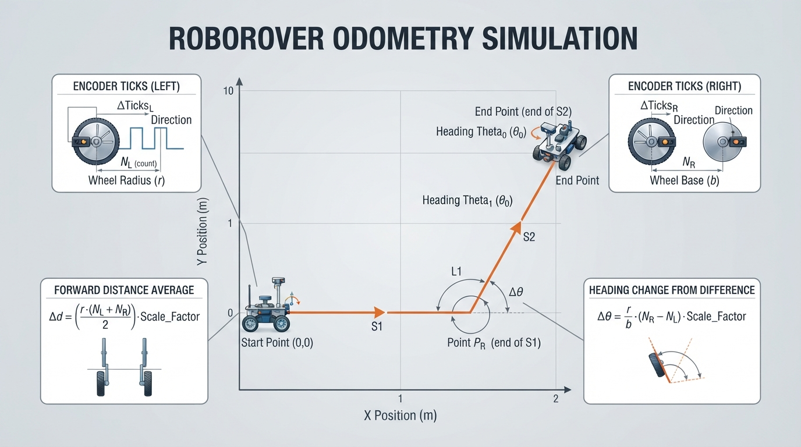

# Class 13: Encoders: Measuring Wheel Motion

## Where We Are in the Robotics Journey

RoboRover has already learned to use infrared sensors to notice nearby objects and differences in reflected light. An infrared sensor can answer questions such as:

- “Is something close to me?”
- “Does this surface reflect more or less infrared light?”
- “Am I near the edge of a line?”

But sensing the outside world is only half of navigation. RoboRover also needs to estimate what its wheels have done.

A wheel encoder is a sensor that counts wheel rotation. From those counts, we can estimate:

1. how far a wheel turned;
2. how far the robot traveled;
3. how much the robot rotated;
4. where the robot probably is now.

The word **probably** matters. Wheel measurements are useful, but they are not perfect. This class introduces the basic method called **odometry**.

Next class, RoboRover will use infrared sensors and wheel motion together in a virtual line follower.

## Today We Will Learn

By the end of this class, you should be able to:

- explain what an encoder tick is;
- convert ticks into wheel angle;
- convert wheel angle into distance;
- explain how two wheel encoders estimate a robot’s motion;
- calculate a simple odometry update;
- recognize why odometry gradually becomes inaccurate;
- use Python to simulate encoder-based movement.

## 2-Minute Recap

An infrared sensor measures infrared light. Its reading is not a magical label such as “wall” or “line.” Instead, the robot interprets a measurement using a rule or program.

For example, RoboRover might compare an infrared reading with a threshold:

- reading below threshold: “surface appears dark”;
- reading above threshold: “surface appears bright.”

That decision can help RoboRover steer toward a line. However, an infrared sensor does not directly report how far the wheels moved.

Today’s sensor measures a different part of the robot: **wheel rotation**.

## The Big Idea




**Figure:** The central conversion is ticks to angle, angle to wheel distance, and wheel distances to robot motion.

Imagine placing a small flag on a bicycle wheel. Each time the flag passes a fixed mark, you count one event. More events mean more wheel rotation.

A real encoder does something similar, although it usually uses a patterned disk, magnetic markings, or another rotating measurement pattern. The sensor produces electrical pulses. The controller counts those pulses, often called **ticks** or **counts**.

The chain of reasoning is:

```text
encoder ticks
      ↓
wheel rotation angle
      ↓
distance traveled by wheel circumference
      ↓
robot motion estimate
```

For a two-wheeled robot, compare the left and right wheels:

```text
left wheel distance  ≈ right wheel distance
        → RoboRover moves mostly straight

left wheel distance  > right wheel distance
        → RoboRover curves toward the right

left wheel distance  < right wheel distance
        → RoboRover curves toward the left

left wheel moves forward, right wheel backward
        → RoboRover rotates in place
```

This is a measurement-based estimate, not a perfect record of reality.

## See It in Your Head

### AI-Generated Engineering Visual · Professor OS



**How to read this visual:** Trace the signal or idea from left to right. Match each block to the lesson explanation, then predict what would change if one block produced a wrong value.


Picture RoboRover from above:

```text
                 forward direction
                       ↑
             left wheel     right wheel
                  O-----------O
                    axle width
```

The distance between the wheel contact points is called the **track width**. We will call it \(B\), measured in meters.

Now imagine each wheel leaving a faint chalk trail. If both trails have the same length, the robot probably traveled straight. If one trail is longer, the robot followed a curved path.

For an illustrator, the key visual is a rotating encoder disk beside a wheel:

- the wheel turns;
- dark and light or magnetic regions pass a sensor;
- each detected transition creates a tick;
- arrows show tick count increasing;
- a second diagram shows unequal left and right distances creating a turn.

## Core Concept

### Ticks measure rotation

Suppose an encoder reports \(N\) ticks for one complete wheel revolution. If the wheel produces \(n\) ticks, then the fraction of a revolution is:

\[
\text{fraction of revolution} = \frac{n}{N}
\]

A full revolution is \(360^\circ\), or \(2\pi\) radians.

The wheel angle is therefore:

\[
\theta = \frac{n}{N} \times 2\pi
\]

where:

- \(\theta\) is wheel rotation in radians;
- \(n\) is the measured number of ticks;
- \(N\) is ticks per revolution;
- \(2\pi\) radians is one complete revolution.

Some systems count only one signal transition. Others count several transitions from two encoder signals. Therefore, “ticks per revolution” must be defined for the particular encoder and counting method being used.

### Angle becomes distance

A wheel’s outer edge travels one circumference during one revolution:

\[
C = 2\pi r
\]

where:

- \(C\) is circumference in meters;
- \(r\) is wheel radius in meters.

The distance corresponding to \(n\) ticks is:

\[
d = \frac{n}{N} \times 2\pi r
\]

where:

- \(d\) is wheel travel in meters;
- \(n\) is measured ticks;
- \(N\) is ticks per revolution;
- \(r\) is wheel radius in meters.

The sign matters:

- positive ticks may mean forward;
- negative ticks may mean backward.

The robot must know this direction convention from its wiring and software.

## Math Without Fear

Suppose RoboRover has:

- wheel diameter \(= 0.10\ \text{m}\);
- wheel radius \(r = 0.05\ \text{m}\);
- \(N = 360\) ticks per revolution;
- measured ticks \(n = 90\).

First calculate the angle:

\[
\theta = \frac{90}{360} \times 2\pi
\]

\[
\theta = 0.25 \times 2\pi = \frac{\pi}{2}\ \text{rad}
\]

So the wheel turned one quarter of a revolution, or \(90^\circ\).

Now calculate circumference:

\[
C = 2\pi(0.05\ \text{m}) = 0.1\pi\ \text{m}
\]

The distance is:

\[
d = \frac{90}{360} \times 0.1\pi\ \text{m}
\]

\[
d = 0.025\pi\ \text{m} \approx 0.0785\ \text{m}
\]

Interpretation: the wheel’s contact point traveled approximately \(7.85\ \text{cm}\).

This is a wheel-distance estimate. If the wheel slipped across the floor, the robot’s body might not have moved exactly \(7.85\ \text{cm}\).

## Worked Robotics Example




**Figure:** Equal wheel distances create straight motion; opposite wheel distances create rotation in place; the track width determines the turning amount.

RoboRover has two driven wheels:

- left and right wheel radius: \(r = 0.05\ \text{m}\);
- encoder resolution: \(N = 360\) ticks per revolution;
- track width: \(B = 0.16\ \text{m}\).

During a short time interval, the encoders report:

- left wheel: \(180\) ticks;
- right wheel: \(180\) ticks.

Each wheel moves:

\[
d_L = d_R
= \frac{180}{360} \times 2\pi(0.05\ \text{m})
\]

\[
d_L = d_R = 0.05\pi\ \text{m}
\approx 0.1571\ \text{m}
\]

Because the distances are equal, RoboRover estimates that it moved straight forward by approximately:

\[
\Delta s = \frac{d_L+d_R}{2}
= 0.1571\ \text{m}
\]

Now consider a second interval:

- left wheel: \(90\) ticks;
- right wheel: \(-90\) ticks.

The wheels move equal distances in opposite directions:

\[
d_L \approx 0.0785\ \text{m}
\]

\[
d_R \approx -0.0785\ \text{m}
\]

The average forward motion is:

\[
\Delta s = \frac{d_L+d_R}{2}=0\ \text{m}
\]

So RoboRover estimates no translation. It rotates in place.

The estimated heading change is:

\[
\Delta\phi = \frac{d_R-d_L}{B}
\]

where:

- \(\Delta\phi\) is change in robot heading in radians;
- \(d_R\) is right wheel distance in meters;
- \(d_L\) is left wheel distance in meters;
- \(B\) is track width in meters.

Using the values:

\[
\Delta\phi
=
\frac{-0.0785\ \text{m}-0.0785\ \text{m}}
{0.16\ \text{m}}
\approx -0.9817\ \text{rad}
\]

The negative sign indicates a clockwise turn under our chosen coordinate convention. The magnitude is approximately \(56.25^\circ\).

This is the central odometry idea: **the average wheel distance estimates forward motion, while the difference between wheel distances estimates turning.**

## Python Lab




**Figure:** The simulation turns encoder tick pairs into successive estimated poses and plots the resulting path.

The program below simulates RoboRover’s encoder readings. It performs three motion steps:

1. both wheels move one revolution, so RoboRover travels straight;
2. the wheels turn equal amounts in opposite directions, so RoboRover rotates in place;
3. both wheels move half a revolution, so RoboRover travels forward in its new direction.

The program plots the estimated path. It also includes assertions that verify the important numerical results.

```python
import math
import matplotlib.pyplot as plt


WHEEL_RADIUS_M = 0.05
TICKS_PER_REV = 360.0
TRACK_WIDTH_M = 0.16


def ticks_to_distance(ticks):
    """Convert encoder ticks to signed wheel distance in meters."""
    return (ticks / TICKS_PER_REV) * 2.0 * math.pi * WHEEL_RADIUS_M


def update_pose(x, y, heading, left_ticks, right_ticks):
    """
    Update a differential-drive robot pose.

    x and y are meters.
    heading is radians, measured counterclockwise from the positive x-axis.
    """
    left_distance = ticks_to_distance(left_ticks)
    right_distance = ticks_to_distance(right_ticks)

    forward_distance = (left_distance + right_distance) / 2.0
    heading_change = (right_distance - left_distance) / TRACK_WIDTH_M

    # Use the midpoint heading for this short motion interval.
    midpoint_heading = heading + heading_change / 2.0

    new_x = x + forward_distance * math.cos(midpoint_heading)
    new_y = y + forward_distance * math.sin(midpoint_heading)
    new_heading = heading + heading_change

    return new_x, new_y, new_heading


def main():
    # Each tuple contains (left encoder ticks, right encoder ticks).
    motion_steps = [
        (360, 360),    # One wheel revolution: straight forward.
        (90, -90),     # Rotate in place.
        (180, 180)     # Half a revolution: forward in the new direction.
    ]

    x = 0.0
    y = 0.0
    heading = 0.0

    path_x = [x]
    path_y = [y]

    for left_ticks, right_ticks in motion_steps:
        x, y, heading = update_pose(
            x, y, heading, left_ticks, right_ticks
        )
        path_x.append(x)
        path_y.append(y)

    expected_distance_first_step = 2.0 * math.pi * WHEEL_RADIUS_M
    expected_turn = (
        -2.0 * ticks_to_distance(90) / TRACK_WIDTH_M
    )
    expected_final_x = (
        expected_distance_first_step
        + 0.5 * expected_distance_first_step * math.cos(expected_turn)
    )
    expected_final_y = (
        0.5 * expected_distance_first_step * math.sin(expected_turn)
    )

    # Executable checks for the numerical claims.
    assert math.isclose(
        path_x[1], expected_distance_first_step, rel_tol=1e-9
    )
    assert math.isclose(path_y[1], 0.0, abs_tol=1e-12)
    assert math.isclose(heading, expected_turn, rel_tol=1e-9)
    assert math.isclose(x, expected_final_x, rel_tol=1e-9)
    assert math.isclose(y, expected_final_y, rel_tol=1e-9)

    print("First straight distance: {:.6f} m".format(path_x[1]))
    print("Final estimated pose: x={:.6f} m, y={:.6f} m, heading={:.6f} rad".format(
        x, y, heading
    ))
    print("All odometry checks passed.")

    plt.figure(figsize=(7, 5))
    plt.plot(path_x, path_y, "o-", label="estimated RoboRover path")
    plt.scatter([0.0], [0.0], marker="s", s=80, label="start")
    plt.xlabel("x position (m)")
    plt.ylabel("y position (m)")
    plt.title("Encoder Odometry Simulation")
    plt.axis("equal")
    plt.grid(True)
    plt.legend()
    plt.show()


if __name__ == "__main__":
    main()
```

Important lines:

- `ticks_to_distance` applies the ticks-to-circumference equation.
- `forward_distance` averages the two wheel distances.
- `heading_change` uses the wheel-distance difference divided by track width.
- `midpoint_heading` gives a reasonable heading for the short interval.
- `assert` checks prevent the program from silently disagreeing with the stated model.

The plot is an estimate of RoboRover’s path, not a camera recording of the true path.

## Mini Simulation or Game

### Encoder detective

Before running the program, predict the result of each motion step.

Write down:

| Step | Left ticks | Right ticks | What should happen? |
|---|---:|---:|---|
| 1 | 360 | 360 | ? |
| 2 | 90 | -90 | ? |
| 3 | 180 | 180 | ? |

Predict:

1. Does Step 1 change heading?
2. Does Step 2 change position?
3. After Step 2, is the robot facing its original direction?
4. Does Step 3 move along the original horizontal direction or a new direction?

Now run the program and inspect the plotted points.

For an experiment, change only the second step from:

```python
(90, -90)
```

to:

```python
(90, 0)
```

Predict again. The robot should now both move forward and turn, because only one wheel is moving.

Then try:

```python
(180, 360)
```

The right wheel travels farther than the left wheel. The path should curve rather than remain straight.

## What Should Happen?

The expected reasoning is:

1. **Step 1:** both wheels move one revolution, so RoboRover travels straight forward.
2. **Step 2:** the wheels move in opposite directions, so the average forward distance is zero. RoboRover rotates in place.
3. **Step 3:** both wheels move forward equally, so RoboRover travels straight relative to its new heading.
4. The final path is not one horizontal line. It consists of a straight segment, a rotation in place, and a straight segment at a new angle.

The assertions in the program verify the numerical pose calculated by this model. If you change the motion steps, the original assertions may no longer describe the new experiment, so update the expected values carefully.

## Common Mistakes

### Mistake 1: confusing ticks with centimeters

A tick is not automatically one centimeter. The distance per tick depends on:

- wheel radius;
- encoder resolution;
- counting method.

### Mistake 2: forgetting the sign

If one wheel moves backward, its tick distance should be negative under the chosen convention. Replacing \(-90\) with \(90\) changes a rotation into forward motion.

### Mistake 3: using diameter where radius is required

The circumference equation is:

\[
C=2\pi r
\]

If you are given diameter \(D\), first use:

\[
r=\frac{D}{2}
\]

Using \(D\) directly in \(2\pi r\) doubles the estimated distance.

### Mistake 4: assuming odometry is exact

Real robots experience:

- wheel slip during turns;
- unequal wheel diameters;
- encoder quantization, where small motions produce no new tick;
- loose wheels or gear backlash;
- incorrect track-width calibration;
- missed or extra electrical counts;
- a robot body that flexes.

These errors accumulate. Odometry is often excellent over a short interval but can drift over a long journey.

### Mistake 5: ignoring timing

If the controller reads encoders slowly, several wheel movements may occur between measurements. The estimate then describes an interval rather than a continuous path. Later classes will study how sensors and control decisions interact over time.

## Try It Yourself

### Challenge: RoboRover’s square estimate

Modify the motion list so that RoboRover attempts to drive a square using encoder measurements.

Use this simplified plan:

1. drive forward;
2. rotate in place by approximately \(90^\circ\);
3. drive forward;
4. rotate again;
5. repeat until four sides are attempted.

Choose tick counts for the straight segments and turn segments. Use the relationship:

\[
\Delta\phi=\frac{d_R-d_L}{B}
\]

to calculate a pair of wheel distances for a \(90^\circ\) turn, then convert those distances into ticks.

**Optional extension:** introduce a small error into one wheel’s distance on every straight segment. Observe whether the estimated path closes perfectly. Explain why repeated small errors can become a large position error.

## Quick Quiz

1. What does an encoder tick represent?

2. A wheel has \(400\) ticks per revolution. How many revolutions does \(100\) ticks represent?

3. RoboRover’s left and right wheels move equal distances forward. What motion does the basic differential-drive model predict?

4. Why can encoder odometry drift even when the encoder is counting correctly?

## Answers

1. An encoder tick is one counted encoder event or count. It represents a known portion of wheel rotation according to the encoder’s counting specification.

2. 

\[
\frac{100}{400}=0.25
\]

So the wheel turned one quarter of a revolution.

3. The robot is estimated to move straight, because the wheel-distance difference is zero.

4. The wheel may slip, the wheel sizes may differ, the track width may be inaccurate, counts may be missed, or the motion model may not match the real robot. These errors accumulate over time.

## Real Robot Connection

A physical RoboRover would typically read encoder counts repeatedly while its motors run. At each update, software would compare the new count with the previous count:

\[
\Delta n = n_{\text{new}}-n_{\text{old}}
\]

where:

- \(\Delta n\) is the number of new ticks during the update;
- \(n_{\text{new}}\) is the current cumulative count;
- \(n_{\text{old}}\) is the previous cumulative count.

That difference is converted into wheel distance and then used to update the estimated pose.

Encoders answer, “How much did the wheels rotate?” They do not directly answer, “Where is the robot relative to the room?” A wheel can spin while the robot remains nearly stationary on a slippery surface. This is why practical robots combine odometry with other sensors, such as infrared sensors, cameras, range sensors, or inertial sensors.

For next class, infrared sensors will help RoboRover observe a line. Encoders can add motion information: the robot can estimate how far it has traveled while attempting to keep the line centered. The infrared readings provide environmental evidence; the encoders provide wheel-motion evidence.

## Vocabulary

- **Encoder:** A sensor that measures rotation, commonly by producing countable electrical signals.
- **Tick:** One encoder count or detected event representing a small amount of rotation.
- **Ticks per revolution:** The number of counted encoder events associated with one complete wheel revolution.
- **Wheel angle:** The amount a wheel has rotated, usually measured in degrees or radians.
- **Circumference:** The distance around a circle. For a wheel, \(C=2\pi r\).
- **Track width:** The distance between the effective contact points of the left and right drive wheels, measured in meters.
- **Odometry:** Estimating a robot’s position and orientation from its motion measurements, especially wheel motion.
- **Pose:** A robot’s position and orientation. In this lesson, pose is represented by \(x\), \(y\), and heading.
- **Heading:** The direction the robot faces, measured here in radians from the positive \(x\)-axis.
- **Drift:** Growing difference between an estimated state and the robot’s actual state.

## Further Learning

Useful search terms and topics include:

- “quadrature encoder direction”
- “differential drive odometry”
- “wheel circumference calibration”
- “encoder tick resolution”
- “robot wheel slip experiment”

A useful physical experiment is to mark a wheel, push the robot exactly one meter along a straight surface, and compare the encoder-based distance with a tape-measured distance. Repeat several times and look for consistent calibration error.

## Next Class

# Class 14: Build a Virtual Line Follower

RoboRover will combine its infrared sensors with motor decisions in a virtual line-following environment.

You will explore:

- how multiple infrared readings reveal the line’s position;
- how wheel commands change the robot’s path;
- how encoder measurements can help track movement;
- why sensor noise and imperfect timing affect steering.

Today’s encoders measure what the wheels did. Next class’s infrared sensors help RoboRover decide what the environment looks like.
