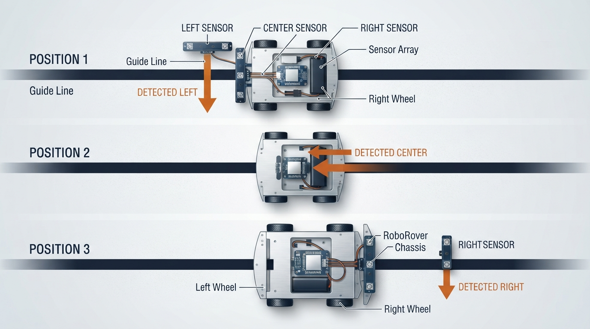
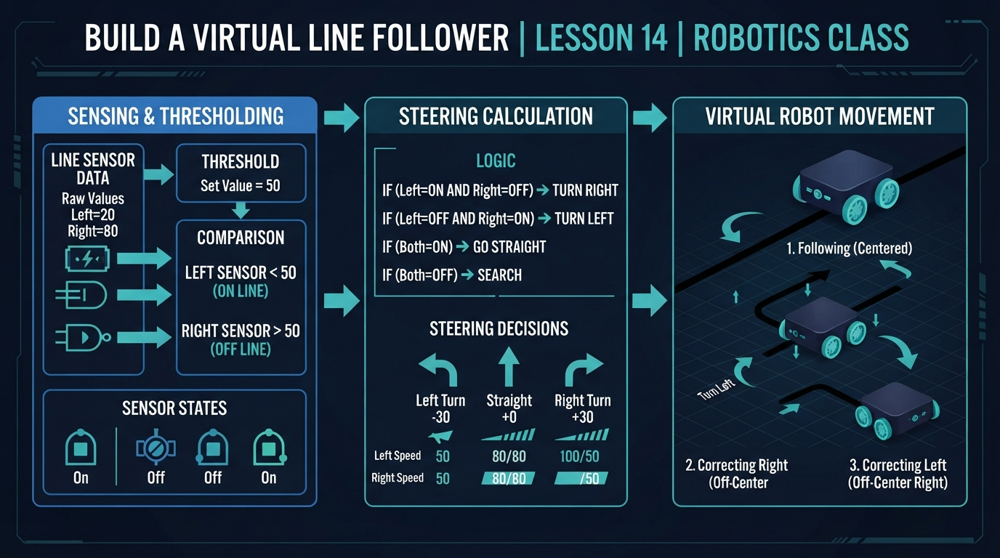
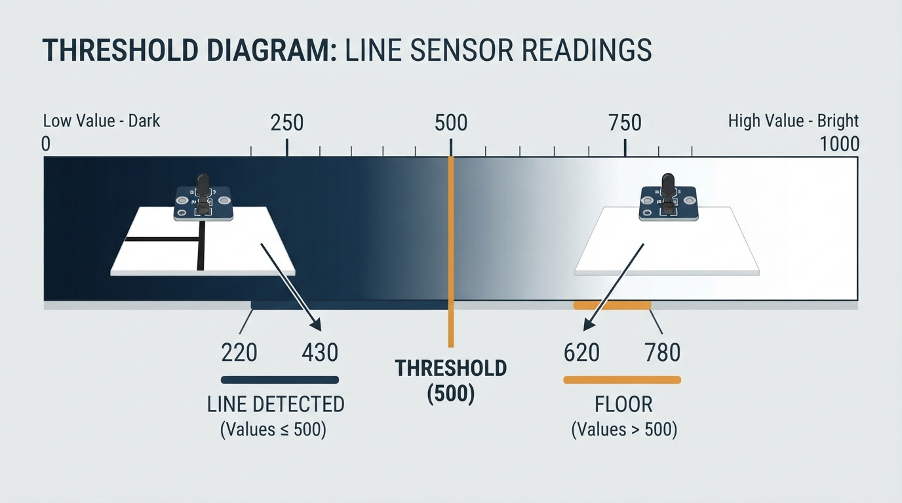
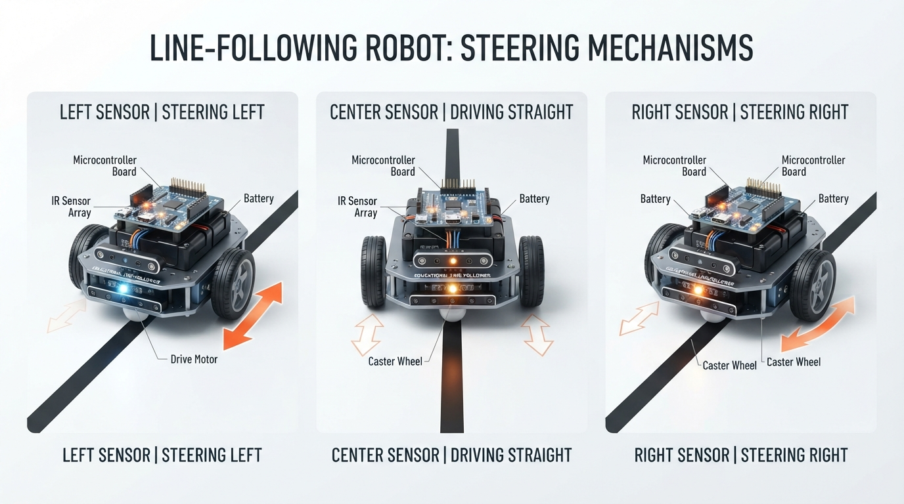
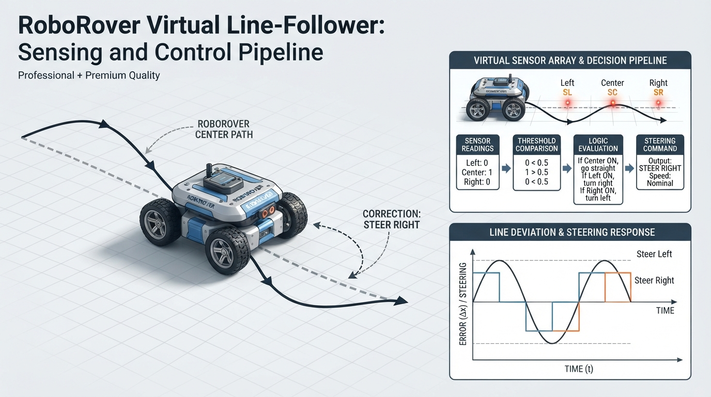

# Class 14: Build a Virtual Line Follower

## Where We Are in the Robotics Journey

RoboRover has learned how to measure wheel motion using encoders. An encoder tells us how far a wheel has turned, but wheel motion alone does not tell RoboRover where a visible path is.

Today, we give RoboRover three downward-facing sensors and ask it to follow a dark line on a light floor. We will build a virtual version first, so we can change one variable at a time and inspect the results.

This class focuses on three connected ideas:

1. **Calibration:** obtaining representative sensor readings from the floor and line.
2. **Thresholding:** classifying a sensor measurement as “line detected” or “line not detected.”
3. **Steering:** converting those classifications into an actuator command.

The repeated process is a simple **closed-loop feedback controller**: sensor readings influence steering, steering changes the robot’s position, and the robot measures again. In this course, repeated measurement and correction is called **sustained feedback regulation** as a descriptive course phrase. The next class will study error, stability, oscillation, and controller design in more detail.

## Today We Will Learn

By the end of this class, you should be able to:

- explain how a reflectance sensor distinguishes a dark line from a light floor;
- distinguish calibration, classification, and control;
- explain the difference between an analogue physical signal and quantized ADC counts;
- choose and use a threshold;
- interpret left, center, and right sensor readings;
- use a stated coordinate convention for sensor positions;
- write a deterministic steering rule for all three-sensor states;
- simulate RoboRover following a curved line;
- calculate and interpret tracking error;
- explain why the simulation is a simplified closed-loop feedback controller;
- identify why real line followers sometimes lose the path.

## 2-Minute Recap

An encoder measures wheel rotation. If a wheel has circumference \(C\) and turns through \(N\) complete rotations, the approximate wheel travel is

\[
d = NC
\]

where:

- \(d\) is distance traveled, in metres;
- \(N\) is the number of rotations, with no unit;
- \(C\) is wheel circumference, in metres.

For a wheel of radius \(r\),

\[
C = 2\pi r
\]

Encoders are useful for measuring motion. However, they do not directly answer questions such as:

- “Is the line underneath the left side of the robot?”
- “Has the robot drifted to the right?”
- “Should RoboRover steer left now?”

Today’s sensors provide information about the path itself.

## The Big Idea



**Figure:** The sensor that sees the line tells RoboRover which way to correct.

Imagine RoboRover driving over a black strip of tape. Under its front edge are three sensors:

```text
             Direction of travel
                    ↑

          [Left] [Center] [Right]
             ●      ●      ●
          ─────────────────────
             dark guide line
```

Each sensor shines light toward the floor and measures reflected light.

- A light floor reflects more light.
- A dark line reflects less light.
- The reflected-light signal varies continuously, so it is analogue.
- The electronics convert that signal into a finite digital number for the program.

Suppose the analogue-to-digital converter produces a value from 0 to 1023:

- 0 might represent very dark;
- 1023 might represent very bright.

These are **hypothetical ADC counts**, not raw analogue values. The direction and numerical range depend on the sensor electronics. Some sensors produce larger values for darker surfaces, so the comparison rule must be checked for the actual hardware.

A program needs a rule for converting a measurement into a decision. That rule is a **threshold**.

For example:

\[
\text{line detected if reading} < 500
\]

```text
0                  500                         1023
|-------------------|---------------------------|
dark: line         threshold                    bright: floor
```

This is called **thresholding**. It simplifies a detailed, quantized measurement into a useful classification.

A complete line-following cycle has three stages:

1. **Calibration** obtains representative readings from the light floor and dark line.
2. **Classification** compares each new reading with a threshold.
3. **Control** converts the classifications into a steering action.

The loop then repeats:

> measure → classify → steer → move → measure again

Because the measured position of the line influences the next steering action, this is a simple threshold-based closed-loop feedback controller.

## See It in Your Head

### AI-Generated Engineering Visual · Professor OS



**How to read this visual:** Trace the signal or idea from left to right. Match each block to the lesson explanation, then predict what would change if one block produced a wrong value. At mobile width, inspect each label in sequence rather than trying to read the whole schematic at once.

Picture RoboRover approaching a bend.

### Situation A: Center sensor detects the line

```text
Left:   floor
Center: line
Right:  floor
```

The robot is approximately aligned with the line, so both wheels can move at similar speeds.

### Situation B: Left sensor detects the line

```text
Left:   line
Center: floor
Right:  floor
```

The line is toward RoboRover’s left side. RoboRover should steer left so that the center of the robot moves back toward the line.

### Situation C: Right sensor detects the line

```text
Left:   floor
Center: floor
Right:  line
```

RoboRover should steer right.

The sensors provide local information about where the line is relative to the robot. They do not need to understand the whole room.

This is an important robotics pattern:

> Sense a nearby feature, choose a small action, and repeat.

The robot’s task-level behavior—following the line—is separate from the feedback mechanism. A preprogrammed task sequence can use feedback at the same time. Task-level autonomy and feedback are independent ideas.

## Core Concept

### From analogue readings to binary decisions

The light level at a sensor is a physical analogue signal. An ADC samples and quantizes that signal, producing a digital count such as 310 or 720. The program works with those counts, not with the continuous signal itself.

A threshold converts a count into a binary result:

\[
b =
\begin{cases}
1 & \text{if } s < T \\
0 & \text{if } s \geq T
\end{cases}
\]

where:

- \(s\) is the sensor reading, with no unit in this example;
- \(T\) is the threshold, with the same units as \(s\);
- \(b=1\) means “line detected”;
- \(b=0\) means “line not detected.”

The direction of the comparison depends on the sensor. For a sensor where dark surfaces produce larger values, the rule would use \(s > T\) instead.

### Coordinate convention and sensor geometry

Before using the steering table or code, fix the virtual model’s coordinates:

- \(x=0\) is the robot’s centreline;
- positive \(x\) points to the robot’s right;
- negative \(x\) points to the robot’s left;
- the three sensors have the same forward coordinate;
- their sideways positions are \(x-S\), \(x\), and \(x+S\), where \(x\) is the robot centre and \(S\) is `SENSOR_OFFSET`.

```text
                         positive x: right
                                  →

       left sensor       center sensor       right sensor
          x - S                x                 x + S
             ●                  ●                  ●
             |                  |                  |
       negative x: left  ←──── robot centre ────→
```

In the code, `robot_x` is the robot centre’s sideways position. The line position is also measured on this sideways \(x\)-axis.

The model does **not** simulate heading, wheel rotation, turning radius, or wheel dynamics. Instead, it changes `robot_x` directly by a small amount. A real differential-drive robot does not translate sideways instantaneously: different wheel speeds change its orientation and make its forward trajectory curve. The direct update is a deliberate teaching simplification.

### From sensor decisions to steering

A simple three-sensor policy must define behavior for every possible combination, including overlapping detections. The following policy gives priority to the center sensor, treats simultaneous left-and-right detection as a wide-line case, and searches in the previous direction when no sensor detects the line.

| Left | Center | Right | Interpretation | Action |
|---:|---:|---:|---|---|
| 0 | 0 | 0 | line not currently detected | continue previous search direction |
| 0 | 0 | 1 | line toward the right | steer right |
| 0 | 1 | 0 | line centered | drive straight |
| 0 | 1 | 1 | center and right detect line | drive straight |
| 1 | 0 | 0 | line toward the left | steer left |
| 1 | 0 | 1 | line spans both sides | drive straight |
| 1 | 1 | 0 | center and left detect line | drive straight |
| 1 | 1 | 1 | wide line or intersection | drive straight |

The numbers are binary decisions, not motor speeds.

A steering action can then change the two wheel commands:

- steer left: left wheel slower, right wheel faster;
- steer right: left wheel faster, right wheel slower;
- straight: both wheels at similar speed.

In this class’s virtual model, steering is represented by changing RoboRover’s sideways position directly. The virtual robot can therefore move sideways instantaneously. That is not a physically realizable differential-drive vehicle path, but it lets us concentrate on threshold decisions and steering.

An intersection is not necessarily resolved by driving straight. The correct behavior depends on the task and route. A robot following a specified route might need to turn left, turn right, stop, or count branches. This lesson uses “drive straight” as a deterministic demonstration policy, not as a universal intersection rule.

### Decision pipeline

Before reading the complete program, separate the loop into four stages:

```text
sensor readings
      ↓
threshold classification
      ↓
state or policy selection
      ↓
sideways motion update
      ↺
```

In pseudocode:

```text
calibrate floor and line readings
choose threshold

repeat:
    evaluate the line at the current forward position
    measure left, center, and right virtual sensors
    classify each measurement as line or floor
    choose a steering action from the three-sensor state
    update the virtual robot position
    record error and repeat at the next forward position
```

The code uses a discrete-time model. On loop iteration `step`:

1. it calculates the current forward position, `step * FORWARD_STEP`;
2. it evaluates the line there;
3. it evaluates the three sensors using the current `robot_x`;
4. it chooses a steering command;
5. it updates `robot_x`;
6. it records the result;
7. the next iteration advances to the next virtual forward position.

The code does **not** simulate forward robot motion. It advances the line’s sampled forward coordinate while directly updating `robot_x`. This is why the recorded robot position is compared with the line position calculated for the same list index.

## Math Without Fear



**Figure:** A threshold converts a continuous sensor value into a simple line-or-floor decision.

Suppose the sensor readings are:

\[
[720,\ 310,\ 690]
\]

for left, center, and right.

Let the threshold be

\[
T = 500
\]

Because a dark line gives a smaller reading:

- left: \(720 < 500\) is false;
- center: \(310 < 500\) is true;
- right: \(690 < 500\) is false.

So the binary sensor state is

\[
[0,\ 1,\ 0]
\]

The center sensor detects the line, so RoboRover drives straight.

Now consider:

\[
[420,\ 760,\ 780]
\]

The binary state is

\[
[1,\ 0,\ 0]
\]

The left sensor detects the line. RoboRover should steer left.

### Worked numerical example

RoboRover is calibrated with these hypothetical ADC-count readings:

- light floor: \(780\);
- dark line: \(220\).

A simple threshold halfway between them is

\[
T = \frac{780 + 220}{2} = 500
\]

The units are sensor-count units.

If RoboRover measures \(s=430\),

\[
430 < 500
\]

so the program classifies the surface as dark and reports “line detected.”

If it measures \(s=620\),

\[
620 \geq 500
\]

so the program reports “floor.”

The threshold is not magic. Calibration obtains example readings; thresholding classifies later readings; the steering policy converts those classifications into action. If the floor becomes darker, the line becomes dusty, or the lighting changes, the same threshold may stop working well.

A midpoint is a useful first estimate when the floor and line readings are well separated and have similar noise. It can be inappropriate when one class has greater variability, the costs of errors are unequal, or illumination changes across the track. In those cases, use representative samples and choose a threshold based on the observed distributions.

For tracking performance, define the error at sample \(i\) as

\[
e_i = \left|x_{\text{robot},i} - x_{\text{line},i}\right|
\]

The mean absolute error is

\[
\text{MAE} = \frac{1}{n}\sum_{i=1}^{n} e_i
\]

and the maximum error is

\[
e_{\max} = \max(e_1,e_2,\ldots,e_n)
\]

Both are measured in metres here. MAE summarizes typical tracking accuracy; maximum error shows the largest departure.

## Worked Robotics Example



**Figure:** Different sensor locations produce different small steering corrections.

Let us follow one short sequence of sensor readings. Use threshold \(T=500\).

| Time step | Left | Center | Right | Binary state | Steering |
|---:|---:|---:|---:|---|---|
| 1 | 760 | 280 | 750 | 0, 1, 0 | straight |
| 2 | 390 | 720 | 760 | 1, 0, 0 | left |
| 3 | 680 | 740 | 350 | 0, 0, 1 | right |
| 4 | 700 | 260 | 710 | 0, 1, 0 | straight |

At time step 2, the left sensor sees the line. This does **not** mean the robot should instantly rotate 90 degrees. It means the robot should make a small leftward correction.

In a real differential-drive robot, one possible command could be:

- left wheel speed: \(0.10\ \text{m/s}\);
- right wheel speed: \(0.16\ \text{m/s}\).

The right wheel moves faster, causing the robot to curve left. Exact behavior depends on wheel spacing, traction, motor response, and command timing.

Our simulation uses a simplified sideways correction instead of modelling those mechanical details.

## Python Lab



**Figure:** The simulation compares the desired line path with RoboRover’s simulated centre position.

### Software setup

Use Python 3.7 or a later Python 3 release. The program requires `matplotlib`:

```text
python -m pip install matplotlib
```

On some systems, use `python3` instead of `python`. If the plot window cannot open, run the program in an environment that supports graphical windows, such as IDLE, Thonny, or a notebook. You can also temporarily replace `plt.show()` with:

```python
import matplotlib.pyplot as plt

plt.savefig("line_follower.png")
```

This saves the graph instead of opening a window. The printed metrics and assertions still work without viewing the graph.

### Lab roadmap

First, predict the calibration threshold and the first sensor decisions. Next, run the required program and inspect its printed metrics and graph. Finally, change one parameter at a time in the optional experiments. The required program models sensing, classification, a steering policy, and a simplified position update—not complete vehicle dynamics.

The simulated line has a sideways position that changes with forward distance:

\[
x_{\text{line}}(y) = 0.08\sin(0.8y)
\]

where:

- \(x_{\text{line}}\) is line position, in metres;
- \(y\) is forward distance, in metres;
- \(0.08\ \text{m}\) is the maximum sideways curve amplitude;
- \(0.8\ \text{rad/m}\) controls how quickly the curve changes.

The argument of the sine is dimensionless: \(0.8\ \text{rad/m}\) multiplied by \(y\) in metres produces an angle in radians.

The virtual sensor readings are ideal and noiseless so that calibration, classification, and control are easy to inspect first. The code still performs calibration from sample readings rather than silently assuming that 500 is universal.

### Prediction checkpoint 1: calibration

Before running the program, predict the threshold from:

```text
floor samples: 775, 780, 785
line samples:  215, 220, 225
```

The floor mean is 780 and the line mean is 220, so the midpoint should be 500.

### Prediction checkpoint 2: initial sensor state

The initial robot centre is \(x=0.040\ \text{m}\), and the line initially has \(x=0\). With `SENSOR_OFFSET = 0.045`:

- left sensor position: \(0.040-0.045=-0.005\ \text{m}\);
- center sensor position: \(0.040\ \text{m}\);
- right sensor position: \(0.040+0.045=0.085\ \text{m}\).

The left sensor is within half the line width of the line, so the first steering command should be left, represented by `-1`.

### Prediction checkpoint 3: first position updates

Each left command changes `robot_x` by `-0.012` m. With the supplied line width and sensor model, predict the first three robot positions before reading the assertions in the program. The expected values are approximately \(0.028\), \(0.016\), and \(0.004\) m.

### Expected-results table

| Test | Directional prediction |
|---|---|
| Calibration | Threshold is 500.0 |
| Original initial condition | First steering commands are `[-1, -1, -1]`; the first three positions are approximately `[0.028, 0.016, 0.004]` |
| Starting at `robot_x = -0.040` | The right sensor detects the line first, so the first correction is right |
| Threshold set too low | The virtual dark reading is not detected; the robot continues its previous search direction |
| Smaller sensor spacing | Left-right positional information becomes less distinct; error may increase or decrease depending on the path |
| Straight-then-curved line | The graph begins with a straight section and curves after \(y=2.0\) |

These are predictions about this simplified model, not universal results for physical robots.

### Required, diagnostic, and optional code

- The **complete program** below is the required lab.
- The `assert` statements are **diagnostic checks**. They verify assumptions and expected outputs; they are not extra controller behavior.
- The plotting code is required for the complete program’s visual result.
- The later calibration and threshold snippets are **optional isolated examples**, not alternative required controllers.

```python
import math
import matplotlib.pyplot as plt


LINE_WIDTH = 0.020
SENSOR_OFFSET = 0.045
FORWARD_STEP = 0.020
TURN_STEP = 0.012
STEPS = 300


def calibrate_threshold(floor_readings, line_readings):
    if not floor_readings or not line_readings:
        raise ValueError("Both calibration sample sets must be non-empty.")

    floor_mean = sum(floor_readings) / float(len(floor_readings))
    line_mean = sum(line_readings) / float(len(line_readings))

    if floor_mean <= line_mean:
        raise ValueError("Expected floor readings to exceed line readings.")

    return (floor_mean + line_mean) / 2.0


def line_position(forward_distance):
    return 0.08 * math.sin(0.8 * forward_distance)


def sensor_reading(sensor_x, line_x):
    if abs(sensor_x - line_x) <= LINE_WIDTH / 2.0:
        return 200
    return 800


def detects_line(reading, threshold):
    return reading < threshold


def choose_steering(left, center, right, previous_steering):
    if center:
        return 0
    if left and right:
        return 0
    if left:
        return -1
    if right:
        return 1
    return previous_steering


def main():
    floor_samples = [775, 780, 785]
    line_samples = [215, 220, 225]
    threshold = calibrate_threshold(floor_samples, line_samples)

    assert math.isclose(threshold, 500.0, abs_tol=1e-12)

    robot_x = 0.040
    previous_steering = -1

    forward_positions = []
    robot_positions = []
    line_positions = []
    steering_commands = []

    for step in range(STEPS):
        forward_distance = step * FORWARD_STEP
        line_x = line_position(forward_distance)

        left_reading = sensor_reading(
            robot_x - SENSOR_OFFSET, line_x
        )
        center_reading = sensor_reading(robot_x, line_x)
        right_reading = sensor_reading(
            robot_x + SENSOR_OFFSET, line_x
        )

        left_detected = detects_line(left_reading, threshold)
        center_detected = detects_line(center_reading, threshold)
        right_detected = detects_line(right_reading, threshold)

        steering = choose_steering(
            left_detected,
            center_detected,
            right_detected,
            previous_steering
        )

        robot_x += steering * TURN_STEP
        previous_steering = steering

        forward_positions.append(forward_distance)
        robot_positions.append(robot_x)
        line_positions.append(line_x)
        steering_commands.append(steering)

    tracking_errors = [
        abs(robot_value - line_value)
        for robot_value, line_value
        in zip(robot_positions, line_positions)
    ]
    mean_absolute_error = (
        sum(tracking_errors) / float(len(tracking_errors))
    )
    maximum_error = max(tracking_errors)

    assert len(forward_positions) == STEPS
    assert len(robot_positions) == STEPS
    assert len(line_positions) == STEPS
    assert len(steering_commands) == STEPS
    assert all(math.isfinite(value) for value in robot_positions)
    assert set(steering_commands).issubset(set([-1, 0, 1]))
    assert all(math.isfinite(value) for value in tracking_errors)
    assert mean_absolute_error >= 0.0
    assert maximum_error >= mean_absolute_error

    assert steering_commands[:3] == [-1, -1, -1]
    assert math.isclose(robot_positions[0], 0.028, abs_tol=1e-12)
    assert math.isclose(robot_positions[1], 0.016, abs_tol=1e-12)
    assert math.isclose(robot_positions[2], 0.004, abs_tol=1e-12)

    print("Calibration threshold:", threshold)
    print("Simulation completed.")
    print("Recorded positions:", len(robot_positions))
    print("First three steering commands:", steering_commands[:3])
    print("First three robot positions:",
          [round(value, 3) for value in robot_positions[:3]])
    print("Mean absolute tracking error (m):",
          round(mean_absolute_error, 4))
    print("Maximum tracking error (m):",
          round(maximum_error, 4))
    print("Allowed steering commands:", sorted(set(steering_commands)))

    plt.figure(figsize=(9, 5))
    plt.plot(
        forward_positions,
        line_positions,
        label="dark line",
        linewidth=2
    )
    plt.plot(
        forward_positions,
        robot_positions,
        label="RoboRover centre",
        linewidth=2
    )
    plt.xlabel("Forward distance (m)")
    plt.ylabel("Sideways position (m)")
    plt.title("Virtual three-sensor line follower")
    plt.grid(True)
    plt.legend()
    plt.tight_layout()
    plt.show()


if __name__ == "__main__":
    main()
```

For the supplied initial condition, the program returns:

```text
Calibration threshold: 500.0
Simulation completed.
Recorded positions: 300
First three steering commands: [-1, -1, -1]
First three robot positions: [0.028, 0.016, 0.004]
```

The final two printed metrics depend on the full simulated path. They should be finite, non-negative values in metres. The program also reports the allowed steering commands, which should be `[-1, 0, 1]`.

The first three values illustrate the update order:

- iteration 0 evaluates the line at the first forward position and updates `robot_x` from 0.040 to 0.028;
- iteration 1 evaluates the line at the next forward position and updates it to 0.016;
- iteration 2 evaluates the line again and updates it to 0.004.

The code does not move the robot forward. `forward_distance` advances the sampled line coordinate, while `robot_x` is directly changed sideways. The recorded robot and line positions are compared at matching list indices because each index represents one discrete virtual forward position.

The initial `previous_steering = -1` is an arbitrary prior assumption, not a learned direction. If the robot starts elsewhere, that assumption can send it away from the line; a robust design would use a search strategy suited to the robot and track.

The plot uses **forward distance as its horizontal variable**, not elapsed time. It is a graph of sideways position against distance travelled through the virtual course, not a physical \(x\)-\(y\) trajectory of the chassis. The two curves show the desired line position and the simulated robot-centre position.

### Important lines

The following example is independently executable and demonstrates calibration. It is an **optional isolated example**, not a second required controller:

```python
import math


def calibrate_threshold(floor_readings, line_readings):
    if not floor_readings or not line_readings:
        raise ValueError("Calibration samples must not be empty.")

    floor_mean = sum(floor_readings) / float(len(floor_readings))
    line_mean = sum(line_readings) / float(len(line_readings))

    if floor_mean <= line_mean:
        raise ValueError("Expected floor readings to exceed line readings.")

    return (floor_mean + line_mean) / 2.0


floor_samples = [775, 780, 785]
line_samples = [215, 220, 225]
threshold = calibrate_threshold(floor_samples, line_samples)

assert math.isclose(threshold, 500.0, abs_tol=1e-12)
print(threshold)
```

This calibration function deliberately assumes that floor readings are numerically greater than line readings. That is the virtual sensor convention used in this lesson.

If a real sensor produces **larger** readings for dark surfaces, the validation and threshold rule would need to change. For example:

```python
def calibrate_threshold_high_dark(floor_readings, line_readings):
    if not floor_readings or not line_readings:
        raise ValueError("Calibration samples must not be empty.")

    floor_mean = sum(floor_readings) / float(len(floor_readings))
    line_mean = sum(line_readings) / float(len(line_readings))

    if line_mean <= floor_mean:
        raise ValueError("Expected line readings to exceed floor readings.")

    return (floor_mean + line_mean) / 2.0
```

The corresponding classifier would use `reading > threshold`, not `reading < threshold`.

`detects_line(reading)` applies the calibrated rule:

```python
THRESHOLD = 500


def detects_line(reading):
    return reading < THRESHOLD


assert detects_line(310) is True
assert detects_line(720) is False
```

The three sensor positions are separated across the front of the robot:

```python
robot_x = 0.040
SENSOR_OFFSET = 0.045

left_sensor_x = robot_x - SENSOR_OFFSET
center_sensor_x = robot_x
right_sensor_x = robot_x + SENSOR_OFFSET

assert left_sensor_x < center_sensor_x < right_sensor_x
```

The steering function gives a simple decision:

- `-1`: move sideways left;
- `0`: remain straight;
- `1`: move sideways right.

The `previous_steering` value handles the case where all sensors lose the line. RoboRover keeps searching in the direction it was already using. This is a practical choice, not a guarantee that the line will be found again. It is also why the initial value should be treated as an arbitrary search convention rather than as a learned estimate.

The plot shows two curves:

- the actual dark line;
- RoboRover’s centre position.

The program also reports:

- **mean absolute tracking error**, the average distance between the robot centre and line;
- **maximum tracking error**, the largest such distance during the run.

## Mini Simulation or Game

Try changing exactly one value at a time. Before running the program, predict the direction of the first correction and how the error metrics might change.

### Experiment 1: Move the starting position

Change:

```python
robot_x = 0.040
```

to:

```python
robot_x = -0.040
```

At the initial forward position, the line is at \(x=0\). With `robot_x = -0.040` and `SENSOR_OFFSET = 0.045`, the right sensor is at \(x=0.005\), close enough to detect the line. Therefore, the first detected state is expected to command a right correction. The fixed initial `previous_steering` value matters when no sensor detects the line; it does not override a right-sensor detection.

### Experiment 2: Make the threshold too low

The following independently executable example deliberately uses an unsuitable threshold:

```python
THRESHOLD = 100
dark_reading = 200


def detects_line(reading):
    return reading < THRESHOLD


assert detects_line(dark_reading) is False
print("The dark reading was not detected because the threshold is too low.")
```

The virtual dark reading is 200. It will not be detected because \(200 < 100\) is false. All readings would be classified as floor, so the robot would continue its previous search direction.

### Experiment 3: Make the sensor spacing smaller

Change:

```python
SENSOR_OFFSET = 0.045
```

to:

```python
SENSOR_OFFSET = 0.015
```

The sensors are now packed closer together. Smaller spacing can improve the chance that nearby sensors overlap the line in some situations, but it also reduces the left-versus-right positional signal. Inspect the plot, mean error, and maximum error rather than expecting one universal outcome.

### Experiment 4: Add a simple challenge

The following complete example introduces a straight first section and a curved later section:

```python
import math


def line_position(forward_distance):
    if forward_distance < 2.0:
        return 0.0
    return 0.08 * math.sin(0.8 * forward_distance)


assert line_position(1.0) == 0.0
```

Predict what the graph will show before running it. The first section is straight; the later section curves.

## What Should Happen?

For the original program:

- RoboRover begins at \(x=0.040\ \text{m}\), while the line initially is at \(x=0\ \text{m}\).
- The calibration function computes a threshold of 500 counts from the supplied sample readings.
- The first three steering commands are left, left, and left.
- The first three recorded robot positions are approximately \(0.028\), \(0.016\), and \(0.004\) m.
- Its sensors classify surfaces using the calibrated threshold.
- The steering command is always one of left, straight, or right.
- The program reports mean absolute and maximum tracking error.
- The graph displays the line and the robot’s centre position against forward distance.

The successful plot should show two labelled trajectories: a sinusoidal dark-line path and a robot-centre path that makes discrete corrections. The tracking metrics provide a diagnostic even when the paths do not overlap closely. The labels and line styles, rather than color alone, identify the two trajectories.

Do not expect perfect overlap. The robot moves in discrete sideways jumps of \(0.012\ \text{m}\), while the line changes continuously. The virtual robot can also move sideways instantaneously, unlike a real differential-drive vehicle. This creates a simplified version of the small corrections real robots make.

If your altered version behaves differently, inspect:

1. the line width;
2. sensor spacing;
3. the calibration samples and threshold;
4. the starting position;
5. the initial search direction;
6. the deterministic policy for overlapping detections;
7. the direction convention for left and right;
8. the mean and maximum tracking errors.

## Common Mistakes

### Mistake 1: Reversing the threshold

If dark produces a low reading, use:

```python
reading = 430
threshold = 500

assert reading < threshold
```

If dark produces a high reading, use:

```python
reading = 620
threshold = 500

assert reading > threshold
```

Always check the sensor’s actual behaviour. The supplied virtual model intentionally uses low readings for the dark line and high readings for the floor.

### Mistake 2: Reversing the steering correction

If the left sensor sees the line, RoboRover is usually positioned to the right of the line, so it should correct left. But coordinate conventions can make this confusing. Draw the sensor positions and test a simple case.

### Mistake 3: Treating a threshold as universal

A threshold of 500 is not automatically correct for every robot. Sensor height, floor colour, line colour, sunlight, shadows, and surface texture can change readings. Calibration should be repeated when the environment or sensor arrangement changes.

A midpoint threshold is only a first estimate. If floor and line samples have unequal noise, overlap substantially, or have different error costs, use the observed sample distributions to choose a more appropriate boundary.

### Mistake 4: Ignoring “no line detected”

When all three sensors report floor, the robot has lost direct information about the line. Continuing the previous turn can help briefly, but it can also carry the robot farther away. The initial previous direction is an arbitrary assumption, not evidence about where the line is.

### Mistake 5: Leaving multi-sensor states undefined

States such as `[1, 1, 0]`, `[0, 1, 1]`, and `[1, 1, 1]` can occur when the line is wide, the sensors overlap the line, or the robot reaches an intersection. A controller must specify deterministic behavior for these states. This lesson gives center priority and drives straight for these cases, but a real intersection policy must depend on the route and task.

### Mistake 6: Expecting the simulation to equal a real robot

The program does not model wheel slip, motor delays, battery voltage, sensor noise, chassis tilt, or the robot’s full turning geometry. It is a learning model focused on threshold decisions, a simplified feedback loop, and basic tracking metrics.

## Try It Yourself

### Challenge: Build a four-state steering policy

Modify the program so it classifies and counts four **sensor-behavior states**:

1. `left`: only the left sensor detects the line;
2. `straight`: the center sensor detects the line, or both outer sensors detect the line;
3. `right`: only the right sensor detects the line;
4. `lost_line`: no sensor detects the line.

The fourth state is **not a fourth motor command**. When the line is lost, the controller still needs a recovery action; in this lesson, that action is to continue the previous steering direction.

```python
STEPS = 6
sensor_states = [
    (1, 0, 0),
    (0, 1, 0),
    (0, 0, 1),
    (0, 1, 0),
    (0, 0, 0),
    (0, 1, 0),
]

state_names = []
steering_commands = []
previous_steering = -1

for left, center, right in sensor_states:
    if center or (left and right):
        state = "straight"
        steering = 0
    elif left:
        state = "left"
        steering = -1
    elif right:
        state = "right"
        steering = 1
    else:
        state = "lost_line"
        steering = previous_steering

    state_names.append(state)
    steering_commands.append(steering)
    previous_steering = steering

left_count = state_names.count("left")
straight_count = state_names.count("straight")
right_count = state_names.count("right")
lost_line_count = state_names.count("lost_line")

assert len(state_names) == STEPS
assert left_count + straight_count + right_count + lost_line_count == STEPS
assert lost_line_count == 1

print("Left:", left_count)
print("Straight:", straight_count)
print("Right:", right_count)
print("Lost line:", lost_line_count)
```

### Optional extension

Add a small amount of sensor noise. Use a reproducible random seed so that different runs can be compared:

```python
import random

random.seed(7)
```

For example, instead of returning exactly 200 for the dark line, return a value that changes slightly between 180 and 220. Then compare the original and averaged versions using a defined metric, such as the proportion of readings near the threshold that change classification.

Ask:

- Does the calibrated threshold still work?
- Do readings near the threshold cause unstable decisions?
- Does averaging reduce the classification error rate near the threshold?
- How much delay does the averaging introduce?

A useful comparison is:

\[
\text{classification error rate}
=
\frac{\text{incorrect classifications}}{\text{test readings}}
\]

Averaging can reduce random variation, but it also introduces delay because the controller waits for several measurements. That delay is not automatically better for a moving robot: an old average can describe where the robot was rather than where it is now.

This is a preview of later feedback and filtering work. Do not try to build a full advanced controller yet.

## Quick Quiz

1. What does a threshold do to a sensor reading?

2. If dark produces low readings and the three readings are `[700, 250, 680]`, which sensor detects the line?

3. If the left sensor detects the line while the center and right sensors do not, which basic steering action should RoboRover choose?

4. Why might a threshold that works indoors fail outdoors?

5. What makes the repeated sensing-and-steering process a simple feedback controller?

## Answers

1. A threshold divides sensor readings into decision categories, such as “line detected” and “line not detected.” In this lesson, the ADC count is compared with the threshold; the original physical signal is analogue, but the program uses its quantized digital representation.

2. The center sensor detects the line because \(250 < 500\), assuming the threshold is 500.

3. RoboRover should steer left, making a small correction toward the line.

4. Outdoor lighting, shadows, surface colour, and reflections can change the sensor readings, so the old threshold may no longer separate line from floor reliably.

5. The measured line position influences the steering command, the steering changes the robot’s position, and the robot measures again. The cycle repeats. This is feedback independently of whether the overall line-following task is preprogrammed or autonomous at the task level.

## Real Robot Connection

A physical line follower usually has:

- downward-facing reflectance sensors;
- a motor driver;
- two powered wheels;
- a battery;
- a microcontroller running the threshold and steering code.

The robot reads sensors repeatedly while moving. A real loop might run like this:

1. read left, center, and right sensors;
2. compare each reading with its threshold;
3. select a steering action;
4. command the motors;
5. repeat.

This is a simple threshold-based closed-loop feedback controller. Textbook terminology can vary depending on the system boundary, especially for a single sensor-triggered event. In this course, repeated measurement-and-correction is called **sustained feedback regulation** as a descriptive term.

Several engineering problems appear immediately.

**Calibration:** The robot may need to measure the actual floor and line before choosing thresholds.

**Classification:** Each calibrated reading is compared with a threshold to decide whether a sensor currently detects the line.

**Control:** The steering policy converts those classifications into motor commands. Task-level autonomy and feedback are separate ideas: a preprogrammed line-following task can use feedback without becoming task-level autonomy.

**Noise:** A sensor may fluctuate because of texture or lighting. A reading close to the threshold can switch repeatedly between “line” and “floor.”

**Latency:** The robot does not turn instantly after a command. Motors and wheels need time to respond.

**Mechanical limits:** A robot can only turn so quickly before slipping or leaving the track.

**Line geometry:** A very narrow line may fall between sensors. A sharp corner may place the line outside all three sensors.

Our simulation hides most of these issues so that the central idea is visible. It uses direct sideways position updates rather than simulating differential-drive motion. In a real robot, unequal wheel speeds change heading and produce a curved forward trajectory.

In the next class, we will examine error, repeated correction, delay, oscillation, and controller design in more detail.

## Vocabulary

**Robot:** A physical machine commonly treated as a robot in engineering practice whose controlled actuators perform a physical task. Its immediate actions may be selected by a human operator, a preprogrammed controller, or autonomous software. This is a working description for teaching, not a universal necessary-and-sufficient test.

**Reflectance sensor:** A sensor that measures how much light a surface reflects.

**Sensor reading:** The numerical value produced by a sensor. In this lesson, example readings are hypothetical ADC counts, and their relationship to surface reflectance depends on the sensor electronics. The underlying reflected-light signal may be analogue, while the value used by the program is quantized.

**Calibration:** Obtaining representative sensor readings, such as readings from the light floor and dark line, so that a threshold can be selected.

**Threshold:** A chosen boundary used to convert a measurement into a decision category.

**Binary decision:** A decision with two possible states, such as detected/not detected.

**Feedback control:** Control in which a measured state or output influences a current or future control action in relation to a desired behavior or state. Textbook terminology can vary with the chosen system boundary.

**Sustained feedback regulation:** The descriptive course term for repeated measurement-and-correction over time. In broader engineering terminology, this is a form of closed-loop feedback control.

**Line follower:** A robot designed to keep itself aligned with a visible path, often using downward-facing sensors.

**Steering:** Changing the robot’s direction or sideways position by commanding its wheels or other actuators.

**Sensor offset:** The distance between a sensor and a reference point, such as the robot’s centre, measured in metres or another length unit.

**Search direction:** The direction a robot continues turning when its sensors temporarily fail to detect the line.

## Further Learning

Useful search terms for continued study:

- “reflectance sensor calibration robotics”
- “three sensor line follower”
- “differential drive steering”
- “threshold detection with sensor noise”
- “robot line following motor control”
- “closed-loop threshold controller”

When experimenting, change one variable at a time and record what changed. A table of threshold, sensor spacing, starting position, mean error, maximum error, and observed behaviour can reveal patterns that are difficult to notice from memory.

## Next Class

**Class 15: Feedback: Why Robots Correct Themselves**

RoboRover will use repeated measurements to compare its current situation with its desired situation. We will study how sensing and correction form a feedback loop, why delayed corrections can cause oscillation, and why real robots rarely move exactly as commanded.