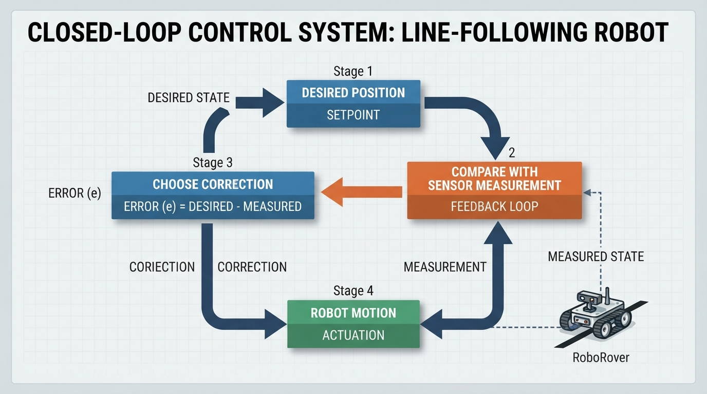
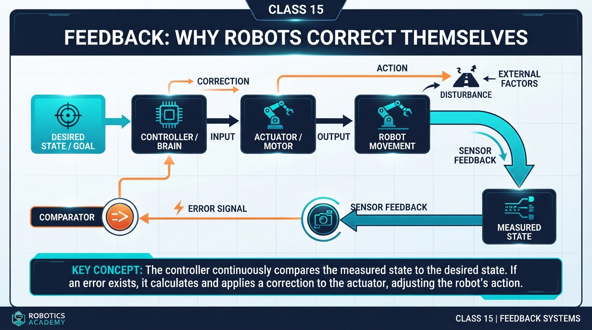
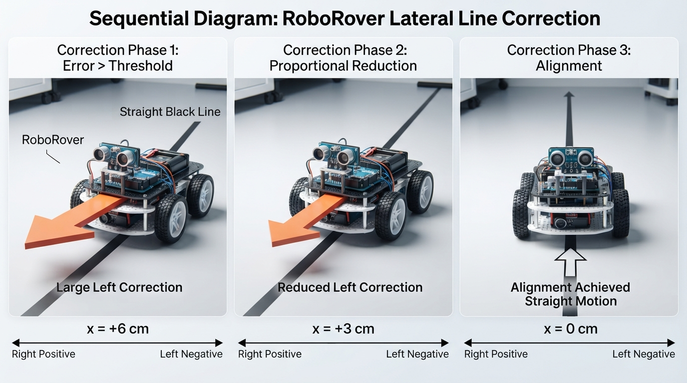
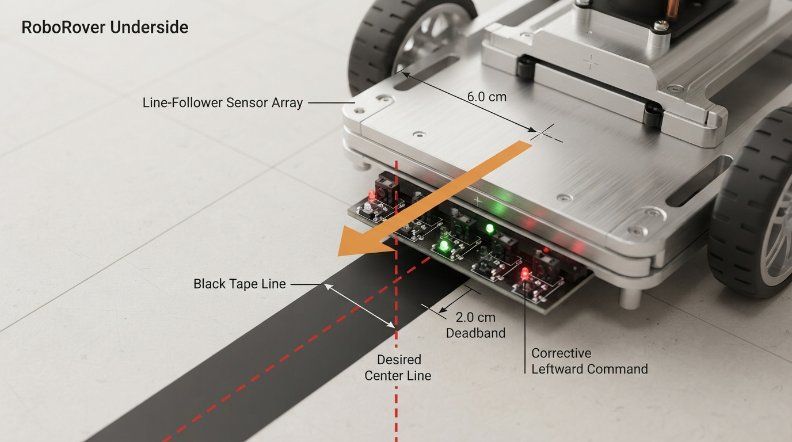
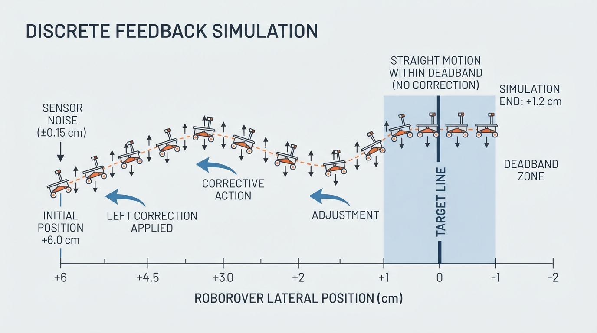

# Class 15: Feedback: Why Robots Correct Themselves

## Where We Are in the Robotics Journey

Imagine RoboRover drifting right of a black line. It measures the drift, steers left, measures again, and changes its response as the situation changes.

In the previous class, RoboRover followed a virtual line. Today we name that repeated process: **feedback**.

In the next class, we will turn this simple correction rule into **P control**, where correction size depends on error size.

## Today We Will Learn

By the end of this class, you should be able to:

- define **error** as the difference between desired and measured state;
- explain how error selects a correction;
- distinguish open-loop action from feedback;
- trace a feedback loop and its state-update equation;
- run and modify a deterministic Python simulation;
- recognize the effects of noise, delay, disturbances, and deadbands.

The central pattern is:

> **Measure → compare → correct → measure again**

## 2-Minute Recap

For this lesson, RoboRover uses a simplified **abstract position sensor**. It reports a signed estimate of lateral position relative to the desired line. This is a model variable, not a claim that one ordinary light sensor directly measures signed position. Physical line-following robots commonly infer position from two or more reflectance sensors.

Our reference frame is:

- right of the line: positive position; steer left;
- left of the line: negative position; steer right;
- centered: zero position; drive straight.

The difference between where RoboRover wants to be and where it measures itself to be is its **error**.

### Modeling note

The one-dimensional model isolates feedback from other vehicle behavior. A real controller may estimate lateral position from several readings, chassis geometry, and calibration. It may also include heading, velocity, delay, and actuator limits; those are outside this introductory model.

## The Big Idea



**Figure:** Feedback sends information about the robot's measured result back into its next control decision.

Suppose the desired lateral position is \(0\) cm and RoboRover measures \(+6\) cm. The robot is not “wrong” in isolation; it is offset relative to a desired state.

A feedback system has four useful parts:

1. **Desired state:** What should happen?
2. **Measurement:** What is happening now?
3. **Error:** How different are those states?
4. **Correction:** What action should reduce the difference?

```text
desired position
       │
       ▼
   [compare] ── error ──► [choose correction] ──► robot motion
       ▲                                             │
       │                                             ▼
       └──────────── sensor measurement ◄────────────┘
```

This is a feedback loop because information about the result returns to a later decision.

### Feedback is not the same as autonomy

| Idea | Main question |
|---|---|
| Preprogrammed task sequence | Was the task sequence written in advance? |
| Feedback control | Does a measurement influence a current or future action? |
| Task-level autonomy | Does software choose task-level actions without continuous human direction? |

A teleoperated robot can use local feedback in its motor controllers. An industrial robot can execute a preprogrammed task while its joints use feedback. These properties describe different aspects of a system.

A sensor that starts a fixed five-second sequence is not **sustained feedback regulation** if the measured state is not used to adjust the current or a later action. Feedback terminology can vary with the chosen system boundary, but this course uses sustained feedback regulation for repeated measurement-and-correction.

## See It in Your Head

### AI-Generated Engineering Visual · Professor OS



**How to read this visual:** This block diagram emphasizes signal flow: desired state, comparison, correction, motion, and measurement.



**Figure:** Repeated measurements let the correction become smaller as RoboRover approaches the desired line.

The two visuals have different jobs:

- `diagram.png` shows the information path through the loop;
- `inline_02.png` shows a time sequence as the robot approaches the line.

The second visual previews proportional control, which comes next. Today’s controller chooses one of three abstract lateral corrections: `left`, `right`, or `straight`. These labels do not necessarily mean literal differential-drive wheel commands; they represent the direction of the modeled lateral correction.

Picture RoboRover starting 6 cm right of the line. A left correction changes its position. A later measurement reports a smaller offset. Once the measured position enters the deadband, the controller selects `straight`.

## Core Concept

### Error has direction

We use:

- right of target = positive position;
- left of target = negative position;
- target = \(0\) cm.

The error equation is:

\[
e = x_{\text{target}} - x_{\text{measured}}
\]

If \(x_{\text{measured}}=+6\) cm and the target is zero:

\[
e = 0 - 6 = -6\text{ cm}
\]

The negative sign indicates that the robot is right of the target under this convention, so it should choose a leftward correction.

### Error is not automatically a correction

Error describes a condition. A controller turns that description into an action:

- measured position \(>+2\) cm: left;
- measured position \(<-2\) cm: right;
- otherwise: straight.

The interval \(|e|\leq 2\) cm is a **deadband**. It prevents reactions to small changes, but it can leave the robot slightly offset.

This threshold controller uses a fixed correction magnitude. It is not a position-stabilizing controller: once the noisy measurement enters the deadband, `straight` leaves the modeled lateral position unchanged. P control will later make correction size depend on error size.

### Boundary check

The comparisons are strict:

- \(+2.1\) cm: left;
- \(+2.0\) cm: straight;
- \(+1.9\) cm: straight.

A value exactly at the threshold is inside the deadband because the code uses `>` and `<`.

### Open-loop versus feedback

Open-loop action does not use the result to change what happens next:

> Drive both motors for three seconds, then stop.

A feedback action repeatedly measures and adjusts:

> Measure position, steer to reduce error, measure again, and choose again.

Feedback improves responsiveness but does not guarantee perfect tracking.

## Math Without Fear

Let:

\[
x_{\text{target}}=0.0\text{ cm}
\]

If the measured position is \(+6.0\) cm:

\[
e=0.0-6.0=-6.0\text{ cm}
\]

After a correction, suppose the next measurement is \(+2.4\) cm:

\[
e=0.0-2.4=-2.4\text{ cm}
\]

The sign remains negative, so the robot is still right of the line. The magnitude decreases from \(6.0\) cm to \(2.4\) cm, so the robot is closer.

## Worked Robotics Example



**Figure:** The signed error identifies both how far RoboRover is from the line and which direction the correction should take.

With a target of \(0\) cm:

| Measurement | Error \(0-x_{\text{measured}}\) | Action |
|---:|---:|---|
| \(+6.0\) cm | \(-6.0\) cm | left |
| \(+3.5\) cm | \(-3.5\) cm | left |
| \(+1.5\) cm | \(-1.5\) cm | straight |
| \(-2.5\) cm | \(+2.5\) cm | right |

The final row shows why the sign matters. After crossing to the left side, the correction direction changes.

## Python Lab



**Figure:** The simulation records actual position, noisy measured position, error, and the selected action at every feedback step.

The model uses:

- target position \(0.0\) cm;
- starting position \(6.0\) cm;
- predetermined sensor noise;
- a \(0.8\) cm movement for each left or right command;
- no lateral movement for `straight`.

The state update is:

\[
x_{\text{actual,next}} =
x_{\text{actual}}+\text{step\_size}\times\text{command}
\]

Here, `command` is `-1` for left, `+1` for right, and `0` for straight.

### One control-flow trace

The first iteration does this:

```text
actual = 6.00
noise = +0.40
measured = 6.40
error = 0.00 - 6.40 = -6.40
6.40 > 2.00, so action = left
command = -1
next actual = 6.00 + (0.80 × -1) = 5.20
```

The next measurement uses \(5.20\), the updated state.

### Predict before you run it

Predict the action sequence, final position, and whether measured values equal actual values. The supplied data produce five `left` actions followed by five `straight` actions. The final actual position is \(2.00\) cm; noise makes measured position different from actual position.

```python
# Python 3.7
TARGET = 0.0
THRESHOLD = 2.0
STEP_SIZE = 0.8

sensor_noise = [0.4, -0.4, -0.4, -0.4, -0.4,
                -0.4, -0.4, -0.4, -0.4, -0.4]

actual_position = 6.0
history = []

for step_number, noise in enumerate(sensor_noise):
    measured_position = actual_position + noise
    error = TARGET - measured_position

    if measured_position > THRESHOLD:
        steering_command = -1
        action = "left"
    elif measured_position < -THRESHOLD:
        steering_command = 1
        action = "right"
    else:
        steering_command = 0
        action = "straight"

    history.append({
        "step": step_number,
        "actual": actual_position,
        "measured": measured_position,
        "error": error,
        "action": action
    })

    actual_position += STEP_SIZE * steering_command

print("step | actual | measured | error  | action")
print("-------------------------------------------")
for row in history:
    print("{:>4} | {:>6.2f} | {:>8.2f} | {:>6.2f} | {}".format(
        row["step"], row["actual"], row["measured"],
        row["error"], row["action"]
    ))

print("Final position: {:.2f} cm".format(actual_position))

assert len(history) == 10
assert [row["action"] for row in history] == ["left"] * 5 + ["straight"] * 5
assert abs(actual_position - 2.0) < 1e-9
assert abs(actual_position - TARGET) < abs(6.0 - TARGET)

print("Verified: 10 measurements, 5 left, 5 straight, final = 2.00 cm.")
```

The generated table is the useful record: it connects actual state, measured state, error, and action at every feedback step.

### Important lines

- `error = TARGET - measured_position` applies the signed convention.
- The conditional block converts measurement into action.
- `actual_position += ...` connects one decision to the next measurement.
- `history` makes the loop inspectable.
- Assertions verify every exact numerical claim made above.

## Mini Simulation or Game

Change one input at a time.

### Experiment A: Remove correction

Inside the existing loop, replace only the conditional block with:

```text
    steering_command = 0
    action = "straight"
```

Keep the surrounding `history.append(...)` and state update. Update the original assertions. The expected final position is \(6.00\) cm and every action is `straight`.

### Experiment B: Make the deadband larger

Change `THRESHOLD = 2.0` to `THRESHOLD = 5.0`. The first measurement is \(6.4\) cm, so RoboRover moves to \(5.2\) cm. The next measurement is \(4.8\) cm and enters the wider deadband. The expected final position is \(5.20\) cm.

### Experiment C: Add a measurement disturbance

Change the eighth noise value to `5.0`. The controller sees a falsely large positive position and selects an extra left correction. The expected final position is \(1.20\) cm. The correction magnitude remains \(0.8\) cm; the disturbance changes timing, not strength.

```python
# Python 3.7
def run_experiment(threshold, noise_values, correct=True):
    actual = 6.0
    actions = []

    for noise in noise_values:
        measured = actual + noise

        if not correct:
            command, action = 0, "straight"
        elif measured > threshold:
            command, action = -1, "left"
        elif measured < -threshold:
            command, action = 1, "right"
        else:
            command, action = 0, "straight"

        actions.append(action)
        actual += 0.8 * command

    return actual, actions


original_noise = [0.4, -0.4, -0.4, -0.4, -0.4,
                  -0.4, -0.4, -0.4, -0.4, -0.4]

position_a, actions_a = run_experiment(2.0, original_noise, False)
position_b, actions_b = run_experiment(5.0, original_noise)

disturbed_noise = original_noise[:]
disturbed_noise[7] = 5.0
position_c, actions_c = run_experiment(2.0, disturbed_noise)

assert abs(position_a - 6.0) < 1e-9
assert abs(position_b - 5.2) < 1e-9
assert abs(position_c - 1.2) < 1e-9
assert actions_c.count("left") == 6

print("A final: {:.2f} cm".format(position_a))
print("B final: {:.2f} cm".format(position_b))
print("C final: {:.2f} cm; left commands: {}".format(
    position_c, actions_c.count("left")
))
```

| Experiment | Expected final position | Meaning |
|---|---:|---|
| Original | \(2.00\) cm | Five corrections, then deadband |
| A | \(6.00\) cm | No physical correction |
| B | \(5.20\) cm | Wider deadband stops earlier |
| C | \(1.20\) cm | Disturbance causes an extra correction |

**Measurement noise** changes the report. A **process disturbance**, such as wheel slip, changes the physical state itself.

## What Should Happen?

The original run starts at \(6.0\) cm, commands left for five steps, and reaches \(2.0\) cm. The sixth measured value is \(1.6\) cm, inside the deadband, so the remaining commands are `straight`.

The important distinction is:

- decisions use `measured_position`;
- assertions evaluate `actual_position`.

Noise can therefore change a decision even when actual and measured positions differ.

This controller does not guarantee exact target tracking. Its deadband and fixed movement can leave an offset. A more realistic robot may also coast, turn gradually, slip, or overshoot. Those effects can produce repeated left-right corrections.

## Common Mistakes

### Mistake 1: Reversing the error sign

Either \(x_{\text{target}}-x_{\text{measured}}\) or its reverse can work, but the action rules must match the choice.

### Mistake 2: Treating a measurement as a correction

“Six centimeters right” is information. The controller still must select an action.

### Mistake 3: Correcting only once

One action cannot guarantee a correct result. Measure again.

### Mistake 4: Reacting to every tiny change

Noise can cause chatter. A deadband, filtering, or smoother controller can reduce unnecessary switching.

### Mistake 5: Assuming the simulation is reality

The fixed \(0.8\) cm movement ignores battery voltage, friction, wheel mismatch, heading, and delay.

### Mistake 6: Ignoring delay

A delayed measurement describes an earlier state. At high speed, delayed feedback can cause overshoot or oscillation.

## Try It Yourself

### Challenge: Compare correction rules

Using the same starting position, noise list, and step size, change the threshold to \(1.0\) cm. Predict the action sequence before running the program.

For the supplied data:

- sequence: six `left`, then four `straight`;
- final position: \(1.20\) cm;
- left commands: 6;
- right commands: 0;
- straight commands: 4.

The sixth left command occurs at actual position \(2.0\) cm, where the noisy measurement is \(1.6\) cm, still outside the \(1.0\) cm deadband. The next measurement is \(0.8\) cm, so the controller selects `straight`.

### Optional extension

Average two estimates of the same quantity:

```python
# Python 3.7
measurement_a = 5.8
measurement_b = 6.2
average_measurement = (measurement_a + measurement_b) / 2.0

assert abs(average_measurement - 6.0) < 1e-9
print("Average measurement: {:.1f} cm".format(average_measurement))
```

Averaging may reduce random noise when both readings represent the same quantity, but it does not automatically remove calibration bias. Averaging raw reflectance values is not necessarily the same as averaging lateral-position estimates.

## Quick Quiz

1. With target \(0\) cm and measured position \(+4\) cm, what are the error and correction direction?
2. What makes a process feedback rather than open-loop?
3. Why use a deadband?
4. A sensor starts a fixed five-second motor sequence, and its measurement is not used again. Is this sustained feedback regulation?
5. With threshold \(2.0\) cm, what actions correspond to \(+2.1\), \(+2.0\), and \(+1.9\) cm?
6. If actual position is \(3.2\), step size is \(0.8\), and command is \(-1\), what is the next position?

## Answers

1. \(e=0-4=-4\) cm; correct left.
2. A measurement influences the current or a future action.
3. It prevents reactions to insignificant changes, though it may permit some remaining offset.
4. No. Under this course convention, it is a sensor-triggered fixed sequence, not sustained feedback regulation.
5. `left`, `straight`, `straight`; equality is inside the deadband.
6. \(3.2+0.8(-1)=2.4\) cm.

## Real Robot Connection

A physical line follower may use two or more reflectance sensors. If the left sensor sees dark tape more strongly than the right sensor, software can infer that the line is toward the left side of the chassis and select a leftward correction. The sensors do not directly measure centimeters; calibration, spacing, height, and chassis geometry help create a lateral estimate like `measured_position`.

Correction direction depends on motor wiring, sensor placement, and coordinate convention. Test the mapping at very low speed before normal operation.

**Hardware safety:** Test with the robot on a raised stand when wheels can spin freely, or on a clear floor at very low speed. Keep hands, hair, clothing, and cables away from wheels. Make sure every learner knows and can reach the stop command or power-disconnect procedure before enabling motion.

Real systems add calibration error, lighting variation, wheel slip, latency, actuator limits, and overshoot. Feedback responds to these differences but does not eliminate them. Poorly chosen corrections can produce oscillation.

Next class introduces P control, where correction strength is related to error size.

## Vocabulary

- **Feedback:** Using a measured state or output to influence a current or future action in relation to a desired state.
- **Feedback loop:** The repeated cycle of measuring, comparing, choosing, and measuring again.
- **Error:** The difference between desired and measured values.
- **Correction:** An action selected to reduce error.
- **Open-loop control:** Control in which an action’s result does not adjust the next action.
- **Deadband:** A range in which the controller makes little or no correction.
- **Sensor noise:** Unwanted variation in a measurement.
- **Process disturbance:** A physical effect that changes actual state or motion, such as wheel slip.
- **Calibration:** Characterizing or adjusting a sensor so readings better represent physical quantities.
- **Sustained feedback regulation:** Repeated measurement-and-correction over time.
- **P control:** Feedback in which correction strength relates to error size; the next class’s topic.

## Further Learning

Suggested search vocabulary:

- “robotics feedback loop beginner”
- “line follower sensor calibration”
- “open-loop and closed-loop control robotics”
- “deadband motor control”
- “sensor noise and robot control”

For every resource, ask: What is measured? What is the desired state? How does the measurement change the next action?

## Next Class

**Class 16: P Control**

RoboRover currently chooses left, right, or straight. Next, correction becomes responsive to error size: a large error usually produces a larger correction, while a small error produces a gentler one. This proportional idea is the foundation of **P control**.