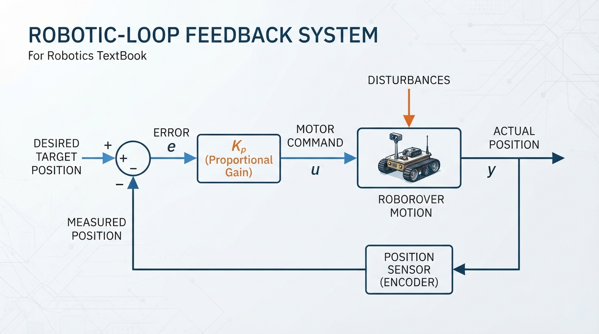
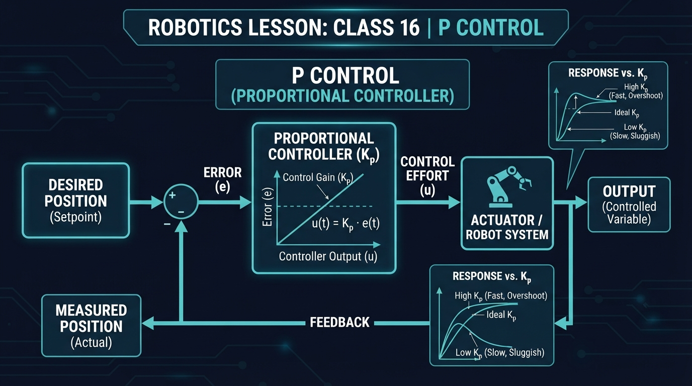
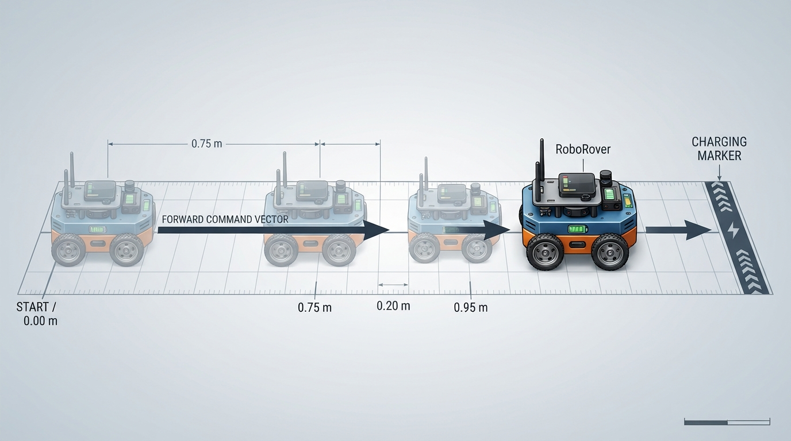
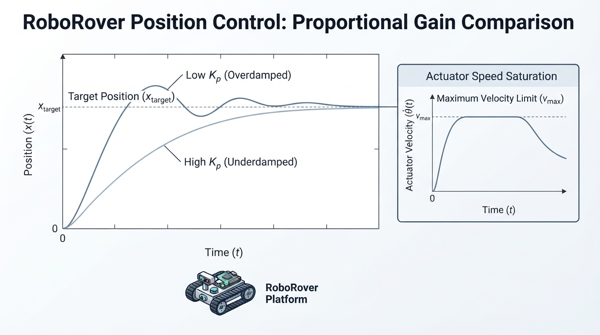

# Class 16: P Control

## Where We Are in the Robotics Journey

In the previous class, **Feedback: Why Robots Correct Themselves**, RoboRover repeatedly compared what it wanted with what its sensors reported. That comparison produced an **error**:

\[
\text{error}=\text{desired value}-\text{measured value}
\]

Today we turn that error into a useful motor command.

A proportional, or **P**, controller follows one simple rule:

> The farther the robot is from the target, the stronger the corrective command.

RoboRover will use P control to approach a marked stopping point. We will see both the strength of this idea and its limits.

In the next class, **PI and PID Intuition**, we will ask what happens when proportional control gets close but cannot completely remove an error. We will preview how additional controller terms address that problem without studying their full mathematics yet.

## Today We Will Learn

By the end of this class, you should be able to:

- explain what a proportional controller does;
- calculate a P-controller command from an error and a gain;
- identify the units of proportional gain;
- describe saturation and why a real motor cannot produce unlimited output;
- predict how changing the gain changes RoboRover’s motion;
- explain why P control may leave a small steady error under a constant disturbance, when the actuator and plant model permit that behavior.

## 2-Minute Recap

Imagine RoboRover trying to stop 40 centimeters from a wall.

Its sensor measures the current distance. The controller compares that measurement with the desired distance.

- Desired distance: \(0.40\ \text{m}\)
- Measured distance: \(0.25\ \text{m}\)
- Error: \(0.40-0.25=0.15\ \text{m}\)

The positive error means RoboRover is too close to the wall if positive motion means “move farther away.” The sign convention depends on how we define the system, but the important rule is consistency.

This distance-from-wall example is a **sign-convention exercise**. It uses a different physical quantity and sign interpretation from the position-on-track examples later in the lesson. In the track examples, positive error means “move forward toward the target.”

A feedback loop has four useful parts:

1. a desired target;
2. a sensor measurement;
3. an error calculation;
4. an action that tries to reduce the error.

P control supplies the fourth part with a particularly direct rule.

## The Big Idea




**Figure:** A P controller multiplies the current error by a gain before sending a command to the robot.

A P controller is like a spring connected between RoboRover and its target: it creates a spring-like corrective tendency, not necessarily a literal force in the robot model.

- Far from the target: the corrective command is strong.
- Near the target: it is gentle.
- At the target: the command is zero.

The controller does not merely ask, “Am I wrong?” It asks, “**How wrong am I right now?**”

The standard equation is:

\[
u(t)=K_p e(t)
\]

where:

- \(u(t)\) is the controller output at time \(t\);
- \(e(t)\) is the current error at time \(t\);
- \(K_p\) is the proportional gain.

A larger error creates a larger output. A larger \(K_p\) makes RoboRover react more strongly to the same error.

For a wheeled robot, \(u\) might be:

- forward speed in meters per second;
- wheel voltage command in volts;
- motor power as a percentage;
- steering command in degrees.

The meaning of \(K_p\) depends on those choices.

```text
desired position ──┐
                   ▼
              [ subtract ] ── error ──► [ multiply by Kp ] ──► motor command
measured position ─┘                                             │
                                                               ▼
                                                        RoboRover's motion
                                                               │
                                                               └── sensor measurement
```

An illustrator could show a long red error arrow when RoboRover is far from its target and a short red error arrow when it is close. The motor-command arrow should shrink at the same time. The target, measured position, error direction, and command magnitude should be distinguishable by labels, arrow direction, and length, not by color alone.

## See It in Your Head

### AI-Generated Engineering Visual · Professor OS



**How to read this visual:** Trace the signal or idea from left to right. Match each block to the lesson explanation, then predict what would change if one block produced a wrong value.


Picture a straight test track:

```text
Start                         Target line
RoboRover ───────────────────────│
     x = 0 m                    x = 1 m
```

RoboRover wants to reach \(x=1.0\ \text{m}\). It measures its position and commands forward speed.

At \(x=0.0\ \text{m}\), the error is \(1.0\ \text{m}\), so the command is strong.

At \(x=0.8\ \text{m}\), the error is \(0.2\ \text{m}\), so the command is weaker.

At \(x=1.0\ \text{m}\), the error is zero, so the P controller commands zero speed.

This sounds perfect, but there is an important detail: as RoboRover gets close, its command becomes very small. In hardware, friction or motor deadband may prevent such a small command from producing motion, so the robot may stop before reaching the exact target. That stopping-short behavior is a possible hardware effect; it is not produced by the ideal velocity-command simulation in this lesson.

That is one of the most important behaviors of P control:

> P control reduces error, but it does not always reduce error all the way to zero.

## Core Concept

### The proportional rule

The controller calculates:

\[
u=K_p(r-y)
\]

where:

- \(u\) is the control command;
- \(K_p\) is the proportional gain;
- \(r\) is the desired value, such as target position;
- \(y\) is the measured value, such as current position;
- \(e=r-y\) is the error.

The controller uses only the **current** error. It does not remember how large the error was earlier.

That makes P control simple and responsive, but also limited.

### Choosing the gain

Suppose two robots have the same error:

\[
e=0.20\ \text{m}
\]

Robot A uses \(K_p=1.0\ \text{s}^{-1}\). Robot B uses \(K_p=3.0\ \text{s}^{-1}\).

Robot B produces a command three times as large. In a real robot with inertia, delays, or flexible mechanisms, that stronger command can cause overshoot or oscillation. With sufficiently strong gain relative to those dynamics, the closed-loop response can become unstable. These are possibilities for a delayed or inertial real system, not behaviors demonstrated by the ideal simulation used later.

A low gain may produce motion that is:

- gentle;
- slow;
- unable to overcome friction near the target.

A high gain may produce motion that is:

- fast;
- jerky;
- sensitive to measurement noise;
- unstable in some real systems with delay or dynamics.

The best gain is not simply “the largest possible.” It is a value that gives useful response without excessive oscillation or mechanical stress.

### Learning check: doubling the gain

If the error stays at \(0.20\ \text{m}\) and \(K_p\) doubles from \(1.0\ \text{s}^{-1}\) to \(2.0\ \text{s}^{-1}\), what should happen to the requested command?

Because

\[
u=K_p e,
\]

doubling \(K_p\) doubles \(u\), provided the command is not limited by saturation. If the original command was already at the actuator limit, the limited command may not change.

### Saturation: the command ceiling

Motors have limits. RoboRover may be unable to drive faster than \(0.6\ \text{m/s}\), even if the P equation requests \(4.0\ \text{m/s}\).

We represent this with a limit:

\[
u_{\text{limited}}=\operatorname{clamp}(u,-u_{\max},u_{\max})
\]

where:

- \(u_{\text{limited}}\) is the command actually sent to the actuator;
- \(u\) is the command calculated by the controller;
- \(u_{\max}\) is the maximum allowed magnitude;
- \(\operatorname{clamp}\) restricts the result to the interval from \(-u_{\max}\) to \(+u_{\max}\).

Saturation is not a software mistake. It is an engineering fact that must be handled deliberately.

## Math Without Fear

Let RoboRover control its forward speed.

- Target position: \(r=0.40\ \text{m}\)
- Measured position: \(y=0.25\ \text{m}\)
- Proportional gain: \(K_p=2.0\ \text{s}^{-1}\)

First calculate the error:

\[
e=r-y
\]

\[
e=0.40\ \text{m}-0.25\ \text{m}=0.15\ \text{m}
\]

Now calculate the requested speed:

\[
u=K_p e
\]

\[
u=(2.0\ \text{s}^{-1})(0.15\ \text{m})=0.30\ \text{m/s}
\]

The units work because:

\[
\text{s}^{-1}\cdot\text{m}=\text{m/s}
\]

Interpretation: RoboRover should request a forward speed of \(0.30\ \text{m/s}\), assuming positive error means “move forward.”

If the maximum allowed speed is \(0.25\ \text{m/s}\), the actuator command is limited:

\[
u_{\text{limited}}=0.25\ \text{m/s}
\]

The controller asked for more than the hardware can provide.

Now suppose RoboRover is at \(0.38\ \text{m}\):

\[
e=0.40\ \text{m}-0.38\ \text{m}=0.02\ \text{m}
\]

\[
u=(2.0\ \text{s}^{-1})(0.02\ \text{m})=0.04\ \text{m/s}
\]

The command is much smaller because the error is much smaller.

## Worked Robotics Example




**Figure:** As RoboRover approaches the marker, the position error and proportional speed command become smaller.

RoboRover is approaching a charging marker on the floor. Its wheel controller accepts a desired forward speed. We choose:

- target marker position: \(1.00\ \text{m}\);
- starting position: \(0.00\ \text{m}\);
- gain: \(K_p=0.8\ \text{s}^{-1}\);
- maximum speed: \(0.60\ \text{m/s}\).

The calculations can be inspected in a table:

| Position \(y\) (m) | Error \(e=1.00-y\) (m) | Requested command \(u=0.8e\) (m/s) | Limited command (m/s) |
|---:|---:|---:|---:|
| 0.00 | 1.00 | 0.80 | 0.60 |
| 0.75 | 0.25 | 0.20 | 0.20 |
| 0.95 | 0.05 | 0.04 | 0.04 |

At the starting position:

\[
e=1.00\ \text{m}-0.00\ \text{m}=1.00\ \text{m}
\]

\[
u=(0.8\ \text{s}^{-1})(1.00\ \text{m})=0.80\ \text{m/s}
\]

The requested speed exceeds the limit, so RoboRover actually receives:

\[
u_{\text{limited}}=0.60\ \text{m/s}
\]

Later, RoboRover reaches \(0.75\ \text{m}\):

\[
e=1.00\ \text{m}-0.75\ \text{m}=0.25\ \text{m}
\]

\[
u=(0.8\ \text{s}^{-1})(0.25\ \text{m})=0.20\ \text{m/s}
\]

At \(0.95\ \text{m}\):

\[
e=1.00\ \text{m}-0.95\ \text{m}=0.05\ \text{m}
\]

\[
u=(0.8\ \text{s}^{-1})(0.05\ \text{m})=0.04\ \text{m/s}
\]

The command is shrinking as RoboRover approaches the marker.

This example assumes a simple robot that can change speed immediately. Real RoboRover has wheel inertia, motor delay, uneven flooring, and position-sensor error. Those effects can make its actual position differ from the ideal calculation.

## Python Lab




**Figure:** The simulation compares proportional gains while showing that the actuator speed is capped by saturation.

This program simulates a one-dimensional RoboRover. It uses a simple model:

\[
x_{\text{new}}=x_{\text{old}}+v\Delta t
\]

where:

- \(x\) is position in meters;
- \(v\) is commanded speed in meters per second;
- \(\Delta t\) is the time step in seconds.

The program compares a low gain and a higher gain. It also includes speed saturation and executable checks for the claims made by the simulation. The checks derive the expected initial command from the configured `start` value, so they remain valid if you change the starting position.

```python
import matplotlib.pyplot as plt


def clamp(value, low, high):
    """Keep value between low and high."""
    return max(low, min(value, high))


def simulate_p_control(kp, target, start, dt, steps, max_speed):
    """Simulate position control with a proportional controller."""
    time_values = []
    position_values = []
    command_values = []

    position = start

    for step in range(steps + 1):
        time_now = step * dt
        error = target - position
        requested_speed = kp * error
        actual_speed = clamp(requested_speed, -max_speed, max_speed)

        time_values.append(time_now)
        position_values.append(position)
        command_values.append(actual_speed)

        # Move the simple robot for one time step, except after the
        # final recorded sample.
        if step < steps:
            position = position + actual_speed * dt

    return time_values, position_values, command_values


target = 1.0
start = 0.0
dt = 0.05
steps = 200
max_speed = 0.60

low_kp = 0.8
high_kp = 2.0

low_gain_data = simulate_p_control(
    kp=low_kp,
    target=target,
    start=start,
    dt=dt,
    steps=steps,
    max_speed=max_speed
)

high_gain_data = simulate_p_control(
    kp=high_kp,
    target=target,
    start=start,
    dt=dt,
    steps=steps,
    max_speed=max_speed
)

low_times, low_positions, low_commands = low_gain_data
high_times, high_positions, high_commands = high_gain_data

# Verification checks: these prove properties of this simulation.
tolerance = 1e-12

expected_low_initial = clamp(
    low_kp * (target - start),
    -max_speed,
    max_speed
)
expected_high_initial = clamp(
    high_kp * (target - start),
    -max_speed,
    max_speed
)

assert abs(low_commands[0] - expected_low_initial) <= tolerance
assert abs(high_commands[0] - expected_high_initial) <= tolerance
assert abs(low_positions[-1] - target) < 0.01
assert abs(high_positions[-1] - target) < 0.01
assert abs(low_commands[-1]) < 0.01
assert abs(high_commands[-1]) < 0.01

print("Verification passed.")
print("Low-gain initial command: {:.3f} m/s".format(low_commands[0]))
print("High-gain initial command: {:.3f} m/s".format(high_commands[0]))
print("Low-gain final position: {:.3f} m".format(low_positions[-1]))
print("High-gain final position: {:.3f} m".format(high_positions[-1]))

figure, axes = plt.subplots(2, 1, figsize=(9, 8), sharex=True)

axes[0].plot(low_times, low_positions, label="Kp = 0.8 per second")
axes[0].plot(
    high_times,
    high_positions,
    label="Kp = 2.0 per second"
)
axes[0].axhline(
    target,
    color="black",
    linestyle="--",
    label="target = 1.0 m"
)
axes[0].set_ylabel("Position (m)")
axes[0].set_title("RoboRover Position and Command with Proportional Control")
axes[0].legend()
axes[0].grid(True)

axes[1].plot(
    low_times,
    low_commands,
    label="Kp = 0.8 per second"
)
axes[1].plot(
    high_times,
    high_commands,
    label="Kp = 2.0 per second"
)
axes[1].axhline(
    max_speed,
    color="black",
    linestyle="--",
    label="speed limit"
)
axes[1].axhline(-max_speed, color="black", linestyle=":")
axes[1].set_xlabel("Time (s)")
axes[1].set_ylabel("Command (m/s)")
axes[1].legend()
axes[1].grid(True)

figure.tight_layout()
plt.show()
```

Important lines:

- `error = target - position` calculates the current error.
- `requested_speed = kp * error` is the P-control equation.
- `clamp(...)` models the motor’s speed limit.
- `position = position + actual_speed * dt` updates the simulated robot.
- The initial-command assertions calculate the expected saturated command from `target`, `start`, the gain, and `max_speed`.
- The final assertions verify that both simulations approach the target closely and finish with small commands.
- The second plot shows the limited command as well as the position, making saturation and proportional decrease visible.

The model is intentionally simple. It does not include wheel slip, acceleration limits, sensor noise, or motor delay. Therefore, its high-gain comparison cannot demonstrate overshoot, oscillation, or instability. It can demonstrate faster convergence and stronger requested commands within this idealized model, but those richer behaviors require a model with inertia, actuator lag, acceleration limits, or sensor delay.

## Mini Simulation or Game

Play this on paper before running the program.

RoboRover is at \(0.70\ \text{m}\), and its target is \(1.00\ \text{m}\). Use:

\[
K_p=1.5\ \text{s}^{-1}
\]

The maximum speed is \(0.30\ \text{m/s}\).

1. Calculate the error.
2. Calculate the requested speed.
3. Apply the speed limit.
4. Predict whether the next command will be larger or smaller if RoboRover moves to \(0.85\ \text{m}\).
5. Predict which robot responds more strongly: one using \(K_p=0.5\ \text{s}^{-1}\) or one using \(K_p=2.0\ \text{s}^{-1}\).

Optional game rule: have one learner act as the sensor, one as the P controller, and one as the motor. The sensor announces position, the controller calculates the command, and the motor moves RoboRover by a fixed amount. Switch roles and compare the effects of different gains.

## What Should Happen?

For the paper game:

1. The error is:

\[
1.00\ \text{m}-0.70\ \text{m}=0.30\ \text{m}
\]

2. The requested speed is:

\[
(1.5\ \text{s}^{-1})(0.30\ \text{m})=0.45\ \text{m/s}
\]

3. The actual speed is limited to \(0.30\ \text{m/s}\).

4. At \(0.85\ \text{m}\), the error is \(0.15\ \text{m}\), so the command is smaller.

5. The controller with \(K_p=2.0\ \text{s}^{-1}\) responds more strongly to the same error.

When you run the Python simulation, both gain settings should approach the target in this idealized model. The higher gain should command stronger motion for a given error, although the speed ceiling makes both controllers begin at the same maximum speed for the original start position of \(0.00\ \text{m}\).

## Common Mistakes

### Forgetting the sign

If the error is defined as target minus measurement, reversing the subtraction reverses the robot’s response.

A robot that should move forward may instead drive backward.

### Mixing units

A gain of \(2\) is incomplete unless we know its units. If error is in meters and command is in meters per second, the gain must have units of \(\text{s}^{-1}\).

### Assuming high gain is always better

A high gain can make a real robot twitch, overshoot, or oscillate. Delayed measurements and motor inertia make strong corrections arrive at the wrong time. With sufficiently strong gain relative to those dynamics, the response can become unstable. The simple simulation in this lesson cannot show those effects because it commands velocity directly with no inertia or delay.

### Ignoring saturation

The equation may request an impossible motor command. Software should limit the command before sending it to hardware.

### Expecting perfect zero error

A P controller’s ability to remove a persistent disturbance depends on the actuator model, plant dynamics, friction model, and any inner motor-control loops. In many practical position-control systems, a constant opposing load requires a nonzero actuator command. Because a P controller produces that command through a nonzero error, the system commonly settles with a small steady error. This is not a universal consequence of P control alone.

### Treating the simulation as the whole robot

Our simulation assumes speed changes instantly and position is measured perfectly. Real robots violate both assumptions.

> **Model distinction:** This lesson’s simulation is an ideal velocity-command model, not a force-driven robot model. It does not model force, friction, motor torque, inertia, or acceleration. A physical force-driven robot requires additional plant and actuator equations before a force disturbance can be translated into a position error.

## Try It Yourself

### Challenge

Modify the Python program so that the simulated robot begins at \(0.40\ \text{m}\) instead of \(0.00\ \text{m}\).

Then make two predictions before running it:

1. Will the first command still be saturated at the maximum speed?
2. Will the robot need more or less time to approach the target?

Explain your reasoning using the initial error.

For the low-gain case, the initial error is:

\[
e=1.00\ \text{m}-0.40\ \text{m}=0.60\ \text{m}
\]

Thus:

\[
u=K_p e=(0.8\ \text{s}^{-1})(0.60\ \text{m})=0.48\ \text{m/s}
\]

This is below the \(0.60\ \text{m/s}\) speed limit, so the low-gain case is **not** initially saturated. For the high-gain case:

\[
u=(2.0\ \text{s}^{-1})(0.60\ \text{m})=1.20\ \text{m/s}
\]

so the high-gain case **is** initially saturated. Starting closer to the target should generally require less time in this model.

The input-dependent assertions in the Python lab should not be replaced with a hard-coded expectation of \(0.60\ \text{m/s}\). They calculate each expected initial command from the current `start` value, so after this change they verify \(0.48\ \text{m/s}\) for the low-gain case and \(0.60\ \text{m/s}\) for the high-gain case.

### Optional extension

Add a constant opposing **velocity disturbance** of \(0.05\ \text{m/s}\). This is a disturbance in the simplified simulation, not a model of a constant physical force.

For the current velocity-command model, use:

\[
v_{\text{actual}}=
v_{\text{commanded}}-v_{\text{disturbance}}
\]

for forward motion, where \(v_{\text{commanded}}\) is the saturated P-controller command. The following is a self-contained **conceptual code fragment** for checking the arithmetic. It is not a drop-in replacement for `simulate_p_control`; integrating it into the simulation would require adding the disturbance as a function parameter and using `actual_speed` in the position update.

```python
def clamp(value, low, high):
    return max(low, min(value, high))


kp = 0.8
error = 0.10
max_speed = 0.60
disturbance_speed = 0.05

requested_speed = kp * error
commanded_speed = clamp(requested_speed, -max_speed, max_speed)
actual_speed = commanded_speed - disturbance_speed

print("Commanded speed:", commanded_speed)
print("Actual speed:", actual_speed)
```

If the robot settles while moving forward and the command is not saturated, the equilibrium condition is:

\[
0=K_p(r-x)-v_{\text{disturbance}}
\]

Therefore:

\[
K_p(r-x)=v_{\text{disturbance}}
\]

and the remaining position error is:

\[
r-x=\frac{v_{\text{disturbance}}}{K_p}
\]

For example, with \(K_p=0.8\ \text{s}^{-1}\) and \(v_{\text{disturbance}}=0.05\ \text{m/s}\):

\[
r-x=\frac{0.05\ \text{m/s}}{0.8\ \text{s}^{-1}}
=0.0625\ \text{m}
\]

This result applies only while the command is unsaturated and the stated sign convention remains valid. Observe whether the robot stops exactly at the target or settles with this approximate offset. Do not interpret the result as a universal force-to-position rule for physical robots.

## Quick Quiz

1. What does the proportional gain \(K_p\) control?

2. RoboRover has an error of \(0.10\ \text{m}\) and \(K_p=3.0\ \text{s}^{-1}\). What speed command does the controller request?

3. Why is a clamp or saturation limit needed in a real robot?

4. If the error remains \(0.10\ \text{m}\), how does the requested command change when \(K_p\) doubles from \(1.0\ \text{s}^{-1}\) to \(2.0\ \text{s}^{-1}\), assuming the command is not saturated?

5. In a practical position-control system with an actuator and plant that require a nonzero command to balance a constant opposing load, why might P control leave a small steady error?

## Answers

1. \(K_p\) controls how strongly the robot responds to the current error. A larger gain produces a larger command for the same error.

2.

\[
u=K_p e=(3.0\ \text{s}^{-1})(0.10\ \text{m})=0.30\ \text{m/s}
\]

3. Motors and mechanisms have physical limits. Saturation prevents the software from requesting an impossible or unsafe command.

4. The requested command doubles, because \(u=K_p e\) and the error is unchanged. If the original command was already at the actuator limit, the limited command may remain unchanged.

5. In that kind of practical system, balancing the opposing load requires a nonzero actuator command. Since a P controller produces that command through \(u=K_p e\), the system commonly needs a nonzero error to generate it. The exact steady error depends on the actuator model, plant dynamics, friction, saturation, and any inner control loops; P control alone does not universally imply one particular offset.

## Real Robot Connection

RoboRover might use P control for:

- driving toward a measured distance;
- aiming a camera platform toward a target angle;
- controlling wheel speed from speed error;
- moving a lift toward a desired height.

In a real system, the sensor measurement may be noisy. If the measured position jumps slightly from one reading to the next, the P command also jumps. This can create motor chatter.

Measurement delay is another problem. If RoboRover reacts to where it was a fraction of a second ago, a high gain can cause it to correct too aggressively and overshoot.

Calibration matters too. If the position sensor reports \(0.02\ \text{m}\) too high, the controller may stop at the wrong physical location while believing it is correct.

P control is therefore a useful first controller, not a guarantee of perfect behavior. Engineers test the gain, command limits, sample rate, sensor quality, and mechanical response together.

The next class will introduce the intuition behind adding memory to the controller. That extra information can help remove persistent error, but it also creates new tuning and safety concerns.

## Vocabulary

**Proportional controller:** A controller whose output is proportional to the current error.

**Proportional gain, \(K_p\):** The multiplier that determines how much control output is produced for a given error. Its units depend on the units of error and output.

**Error:** The difference between a desired value and a measured value.

**Control command:** The signal sent toward an actuator, such as a desired speed, steering angle, voltage, or motor-power request.

**Saturation:** The condition in which a requested command is limited by an actuator’s maximum or minimum capability.

**Steady error:** A remaining difference between the desired value and measured value after a system has settled.

**Overshoot:** Motion beyond the target before the system corrects back toward it.

**Feedback control:** Control in which a measured output or state influences a current or future control action in relation to desired behavior. Textbook terminology can vary with the chosen system boundary. In this course, a threshold measurement-to-action rule can count as feedback control, while repeated measurement-and-correction is called **sustained feedback regulation**.

## Further Learning

For further study, look for learning resources on:

- proportional control response;
- actuator saturation and command limiting;
- sensor noise in feedback loops;
- step response of a control system;
- motor speed control experiments.

When comparing resources, check whether they define the controller output, error sign, actuator units, and system model clearly. Different sign conventions can make two correct explanations look opposite.

## Next Class

Next class is **PI and PID Intuition**.

We will begin with a question P control cannot always answer well:

> What should RoboRover do when a small, persistent error remains because of friction, a slope, or a constant load?

We will build the intuition for adding accumulated error and other corrective information, while keeping the same feedback-loop foundation from this class.