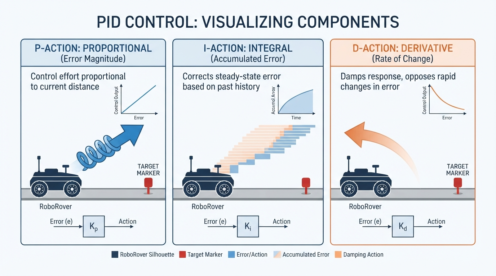
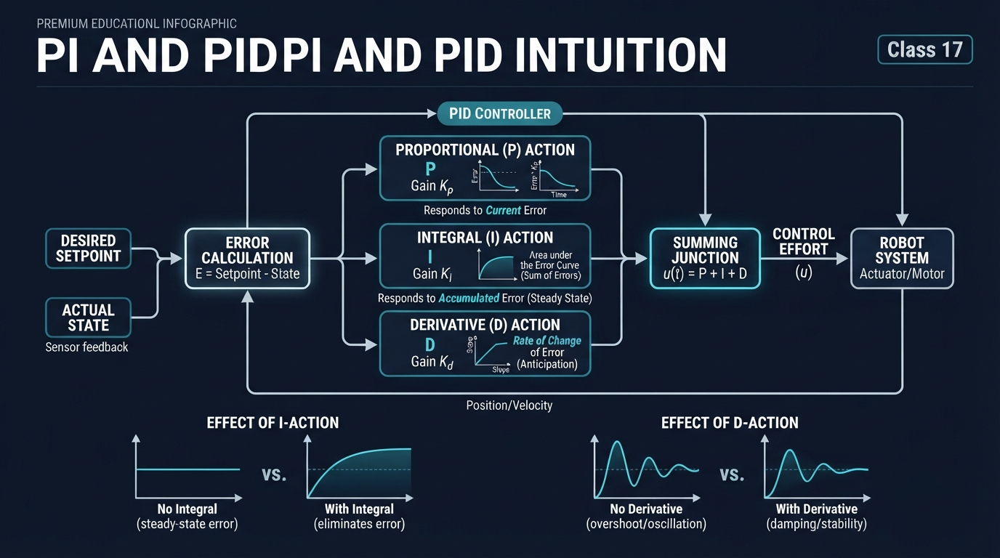
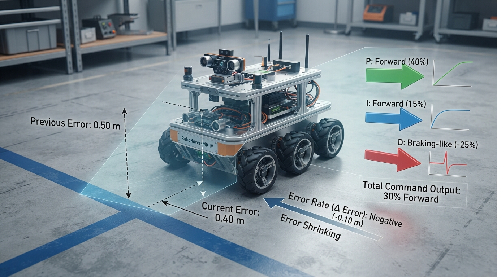
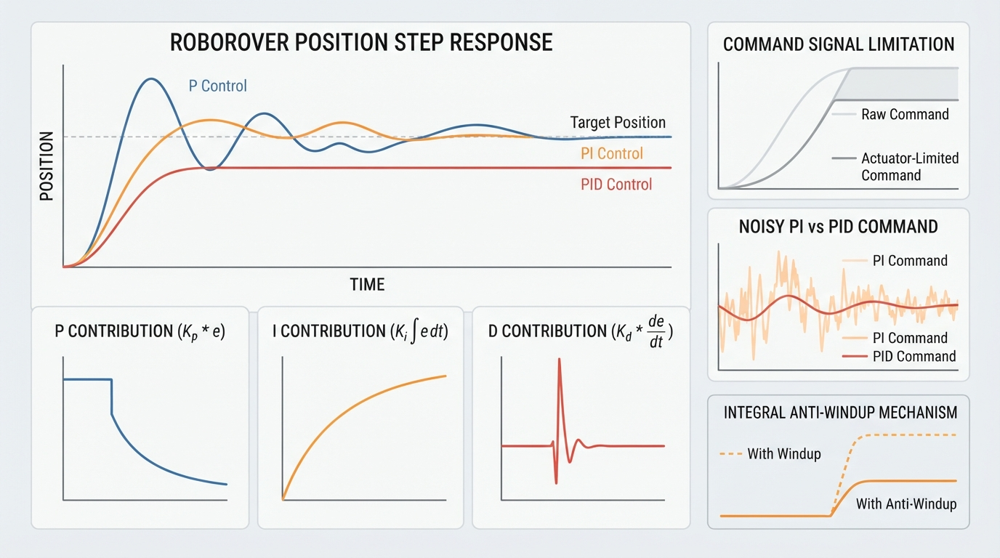

# Class 17: PI and PID Intuition

## Where We Are in the Robotics Journey

In Class 16, RoboRover used **P control**: it measured the current error, multiplied that error by a gain, and produced a motor command.

If RoboRover was \(0.4\ \text{m}\) short of its target, P control produced a command proportional to \(0.4\ \text{m}\). This approach is simple and useful, but it has two important limitations:

- a small steady error may remain when the robot must oppose friction, a slope, or a load;
- P control responds to present error, but it does not accumulate past error or directly respond to how quickly the error is changing.

Today we add two terms:

- **I, or integral control**, accumulates error over time;
- **D, or derivative control**, responds to the measured rate at which error changes.

Together with P, they form **PID control**.

In the next class, we will begin robot kinematics: describing position, orientation, and geometry rather than motor commands and forces. Today’s controller tells RoboRover *how strongly to act*. Kinematics will help us describe *where the robot is and how its parts move*.

## Today We Will Learn

By the end of this class, you should be able to:

1. explain integral control using accumulated error;
2. explain derivative control using error trend;
3. calculate a PI or PID command with units;
4. describe integral windup and noisy derivative estimates;
5. distinguish a conceptual controller equation from a discrete-time, saturated implementation;
6. run a simulation comparing P, PI, and PID behavior;
7. define and measure settling time using a stated tolerance;
8. interpret controller plots without relying on color alone.

## 2-Minute Recap

Suppose RoboRover should stop at \(2.0\ \text{m}\), but it is currently at \(1.6\ \text{m}\).

\[
e=r-y
\]

where \(e\) is error, \(r\) is the desired position, and \(y\) is measured position. Therefore,

\[
e=2.0\ \text{m}-1.6\ \text{m}=0.4\ \text{m}.
\]

P control uses

\[
u_P=K_Pe.
\]

P control is like a spring: the farther RoboRover is from the target, the stronger the command.

## The Big Idea




**Figure:** The three controller terms answer different questions: current error, accumulated error, and changing error.

Imagine pushing a small cart up a gentle ramp. With only P control, the cart may stop slightly below the desired height. At the exact target, the error is zero, so P requests zero command—even though the ramp still pulls the cart downhill. A small remaining error may be necessary to create the command that opposes the ramp.

| Term | Question it asks | Useful behavior |
|---|---|---|
| P | “How wrong are we now?” | Corrects present error |
| I | “How much error has accumulated?” | Reduces persistent error |
| D | “How quickly is the error changing?” | Can add braking-like action and reduce overshoot |

For a rover approaching a painted stopping line:

- **P** measures the current distance to the line.
- **I** keeps a running tally of error that has persisted.
- **D** responds to whether the remaining error is shrinking quickly or slowly.

Derivative action does not literally predict the future. It responds to measured error rate. When the error is shrinking quickly, the derivative contribution can act like braking.

### Reflection before the equation

RoboRover is \(0.20\ \text{m}\) short of its target and moving toward it quickly. Using \(e=r-y\), predict the signs:

- P should be positive.
- I should be positive if the rover has been short of the target for several seconds.
- D should be negative because the error is shrinking.

The objective is not to make every gain large. Excessive gains can cause overshoot, oscillation, actuator saturation, or strong responses to measurement noise.

## See It in Your Head

### AI-Generated Engineering Visual · Professor OS



**How to read this visual:** Trace the signal or idea from left to right. Match each block to the lesson explanation, then predict what would change if one block produced a wrong value.


Draw three panels:

1. **P:** RoboRover is far from a target marker, so a large arrow points toward the marker. Near the marker, the arrow is shorter.
2. **I:** Small error strips accumulate beneath RoboRover’s path. The growing shaded area represents accumulated error.
3. **D:** Two paths approach the target at different rates. The rapidly approaching path receives a stronger braking-like contribution.

Do not draw integral history or derivative state as physical objects on the rover. They are controller calculations.

A control-loop diagram is also useful:

```text
target position
      |
      v
   subtract <--------- measured position
      |
    error
      |
   PID controller ---> motor command ---> RoboRover ---> position sensor
```

The sensor measurement returns to the subtraction step. This repeated comparison and correction is feedback.

## Core Concept

### Integral: remembering persistent error

In continuous mathematics,

\[
I(t)=\int_0^t e(\tau)\,d\tau.
\]

For position error in metres, \(I(t)\) has units of metre-seconds (m·s).

A digital controller uses a running sum:

\[
I_k=I_{k-1}+e_k\Delta t.
\]

If RoboRover is \(0.1\ \text{m}\) short for \(5\ \text{s}\),

\[
I\approx(0.1\ \text{m})(5\ \text{s})=0.5\ \text{m·s}.
\]

The integral term grows while the error persists. It can eventually provide the command needed to oppose a constant disturbance such as friction or a slope.

### Derivative: noticing the trend

Derivative action estimates how quickly error changes:

\[
D_k=\frac{e_k-e_{k-1}}{\Delta t}.
\]

If error decreases from \(0.50\ \text{m}\) to \(0.40\ \text{m}\) in \(0.10\ \text{s}\),

\[
D_k=\frac{0.40-0.50}{0.10}=-1.0\ \text{m/s}.
\]

The negative sign means that the remaining error is shrinking. With a positive derivative gain, this produces a negative, braking-like contribution.

This lesson differentiates **error**. Some controllers differentiate measured position instead:

\[
D_y=\frac{y_k-y_{k-1}}{\Delta t}.
\]

For a fixed target, the two forms are closely related with opposite signs. During a sudden target change, derivative-on-error can create a large **derivative kick**. Derivative-on-measurement avoids that particular reference-step kick, but still requires careful filtering and tuning.

Derivative action can provide damping-like behavior in a suitably tuned closed loop. It does not guarantee damping: excessive gain, delay, filtering delay, or an incorrect sign can increase oscillation or cause instability.

### Combining the terms

A PID command is commonly written as

\[
u=K_Pe+K_II+K_DD.
\]

A PI controller omits the derivative term:

\[
u=K_Pe+K_II.
\]

The often-heard statement that PI “eliminates steady-state error” has conditions. The actuator must have enough authority to oppose the disturbance, the disturbance must be within the controller’s practical operating range, and the closed loop must remain stable. Integral action cannot overcome a physically incapable actuator or repair an unstable design.

### From the equation to the implementation

The equation above is a conceptual continuous-time description. The Python lab implements a specific discrete-time approximation:

1. the loop runs every \(\Delta t=0.02\ \text{s}\);
2. the integral is updated using \(I_k=I_{k-1}+e_k\Delta t\);
3. the derivative is estimated from two consecutive measured errors;
4. the requested command is saturated to \([-1,+1]\);
5. conditional integration provides one simple anti-windup strategy;
6. the plant updates velocity and position after the command is applied.

Consequently, the simulation results apply to this sampled, saturated model and its stated gains. They are not universal properties of every PI or PID controller.

### Units at a glance

| Quantity | Worked calculation | Python simulation |
|---|---|---|
| Position and error | metres (m) | metres (m) |
| Integral | metre-seconds (m·s) | metre-seconds (m·s) |
| Derivative | metres per second (m/s) | metres per second (m/s) |
| Command | percent, \(-100\%\) to \(+100\%\) | normalized, \(-1\) to \(+1\) |
| Gains | scaled for percent command | scaled for normalized command |

Do not transfer numerical gains from one column to the other.

## Math Without Fear

Suppose:

- \(r=2.0\ \text{m}\);
- \(y_k=1.6\ \text{m}\);
- \(e_{k-1}=0.50\ \text{m}\);
- \(I_{k-1}=0.12\ \text{m·s}\);
- \(\Delta t=0.10\ \text{s}\).

The current error is

\[
e_k=2.0-1.6=0.40\ \text{m}.
\]

The updated integral is

\[
I_k=0.12+(0.40)(0.10)=0.16\ \text{m·s}.
\]

The derivative is

\[
D_k=\frac{0.40-0.50}{0.10}=-1.0\ \text{m/s}.
\]

Choose:

- \(K_P=20\ \%\!/\text{m}\);
- \(K_I=4\ \%\!/\text{(m·s)}\);
- \(K_D=2\ \%\!/(\text{m/s})\).

Then

\[
u_P=(20)(0.40)=8.0\%,
\]

\[
u_I=(4)(0.16)=0.64\%,
\]

\[
u_D=(2)(-1.0)=-2.0\%.
\]

Therefore,

\[
u=8.0+0.64-2.0=6.64\%.
\]

P and I push forward because the rover is short of the target. D subtracts command because the error is shrinking.

## Worked Robotics Example




**Figure:** The worked example combines forward P and I contributions with a negative D contribution because the remaining error is shrinking.

RoboRover carries a sensor package across a workshop floor toward a line \(1.0\ \text{m}\) ahead. A slight slope creates a constant backward disturbance.

- **P** reacts to current position error.
- **PI** adds accumulated error.
- **PID** adds a trend-based contribution that may make the approach smoother.

P may settle with a small offset because it needs nonzero error to produce the command opposing the slope. PI continues adding correction while the error persists, allowing the rover to remain closer to the line once the disturbance is balanced.

PID can improve the transient response when the derivative estimate is clean. If the position sensor jitters by a few millimetres between rapid samples, however, the derivative may respond more to sensor noise than to real motion.

This is the central trade-off:

- integral improves accuracy against persistent disturbances;
- derivative can improve settling when correctly tuned;
- integral can wind up during saturation;
- derivative can amplify measurement noise.

## Python Lab




**Figure:** A simulation makes it possible to compare position response, individual controller contributions, settling, oscillation, saturation, and noisy-command sensitivity.

The following program simulates a one-dimensional RoboRover. Its simplified model includes:

- position \(x\) in metres;
- velocity \(v\) in metres per second;
- acceleration in metres per second squared;
- a command limited to \(-1\) through \(+1\);
- a constant backward disturbance;
- velocity drag;
- optional deterministic measurement noise.

The physics are intentionally educational rather than complete. Real motors also have dead zones, delays, voltage limits, friction changes, and nonlinear behavior.

**Predict first:** Which controller should finish closest to the target under a constant backward disturbance? Which controller should be most sensitive to noisy measurements?

```python
import math
import matplotlib.pyplot as plt


def clamp(value, low, high):
    return max(low, min(high, value))


def settling_time(time_values, position_values, target,
                  tolerance=0.02, minimum_dwell=0.5):
    """Return first entry into the band that lasts for minimum_dwell seconds."""
    band = tolerance * abs(target)
    if band == 0.0:
        raise ValueError("This helper requires a nonzero target.")

    required_samples = max(
        1,
        int(math.ceil(minimum_dwell /
                      (time_values[1] - time_values[0])))
    )

    for index in range(len(position_values)):
        end = min(index + required_samples, len(position_values))
        window = position_values[index:end]
        if len(window) < required_samples:
            continue
        if all(abs(position - target) <= band for position in window):
            return time_values[index]

    return None


def simulate(controller_name, kp, ki, kd, measurement_noise=0.0,
             anti_windup=True):
    dt = 0.02
    duration = 12.0
    target = 1.0
    disturbance = -0.12
    drag = 0.35
    command_limit = 1.0

    position = 0.0
    velocity = 0.0
    integral = 0.0
    previous_error = target

    data = {
        "name": controller_name,
        "time": [], "position": [], "error": [],
        "p": [], "i": [], "d": [],
        "raw_command": [], "command": [], "integral": [],
        "saturated": []
    }

    steps = int(duration / dt)

    for step in range(steps + 1):
        current_time = step * dt
        measured_position = (
            position + measurement_noise *
            math.sin(40.0 * current_time)
        )
        error = target - measured_position

        trial_integral = integral + error * dt
        derivative = (error - previous_error) / dt

        p_contribution = kp * error
        trial_i_contribution = ki * trial_integral
        d_contribution = kd * derivative
        trial_raw = (
            p_contribution + trial_i_contribution + d_contribution
        )

        same_direction_saturation = (
            abs(trial_raw) > command_limit
            and trial_raw * error > 0.0
        )

        if not anti_windup or not same_direction_saturation:
            integral = trial_integral

        i_contribution = ki * integral
        raw_command = p_contribution + i_contribution + d_contribution
        command = clamp(raw_command, -command_limit, command_limit)

        data["time"].append(current_time)
        data["position"].append(position)
        data["error"].append(error)
        data["p"].append(p_contribution)
        data["i"].append(i_contribution)
        data["d"].append(d_contribution)
        data["raw_command"].append(raw_command)
        data["command"].append(command)
        data["integral"].append(integral)
        data["saturated"].append(abs(raw_command) > command_limit)

        if step == steps:
            break

        acceleration = command + disturbance - drag * velocity
        velocity += acceleration * dt
        position += velocity * dt
        previous_error = error

    return data


controllers = {
    "P": (1.8, 0.0, 0.0),
    "PI": (1.8, 0.8, 0.0),
    "PID": (1.8, 0.8, 0.35),
}

results = {}
for name, gains in controllers.items():
    results[name] = simulate(name, *gains)

noisy_results = {}
for name in ("PI", "PID"):
    noisy_results[name + " noisy"] = simulate(
        name + " noisy", *controllers[name], measurement_noise=0.005
    )

# Controlled comparison: PI with and without anti-windup.
windup_results = {
    "PI anti-windup": simulate(
        "PI anti-windup", 1.8, 0.8, 0.0, anti_windup=True
    ),
    "PI no anti-windup": simulate(
        "PI no anti-windup", 1.8, 0.8, 0.0, anti_windup=False
    ),
}

expected_points = int(12.0 / 0.02) + 1
for collection in (results, noisy_results, windup_results):
    for data in collection.values():
        assert len(data["time"]) == expected_points
        for key in ("position", "error", "p", "i", "d",
                    "raw_command", "command", "integral"):
            assert all(math.isfinite(value) for value in data[key])

print("Final errors and 2% settling times:")
for name, data in results.items():
    settling = settling_time(
        data["time"], data["position"], target=1.0
    )
    print("{}: measured_error={:.4f} m, settling={}".format(
        name, data["error"][-1], settling
    ))

print("\nMaximum absolute raw commands:")
for name, data in results.items():
    maximum = max(abs(value) for value in data["raw_command"])
    print("{}: {:.3f}".format(name, maximum))

# The noisy-command plot directly exposes the PI-versus-PID comparison.
plt.figure(figsize=(10, 5))
for name, data in noisy_results.items():
    plt.plot(data["time"], data["command"], label=name)
plt.xlabel("Time (s)")
plt.ylabel("Applied command (-1 to +1)")
plt.title("Noisy PI and PID commands")
plt.grid(True)
plt.legend()
plt.tight_layout()

# A numerical roughness measure supplements the plot. It is the mean
# absolute change between consecutive applied commands.
print("\nNoisy command roughness:")
roughness = {}
for name, data in noisy_results.items():
    changes = [
        abs(current - previous)
        for previous, current in zip(
            data["command"][:-1], data["command"][1:]
        )
    ]
    roughness[name] = sum(changes) / len(changes)
    print("{}: mean step change={:.6f}".format(name, roughness[name]))

# With these fixed gains and deterministic noise, derivative action should
# produce the larger command variation. Verify that stated comparison.
assert roughness["PID noisy"] > roughness["PI noisy"]

plt.figure(figsize=(12, 10))

plt.subplot(2, 2, 1)
for name, data in results.items():
    plt.plot(data["time"], data["position"], label=name)
plt.axhline(1.0, color="black", linestyle="--", label="target")
plt.xlabel("Time (s)")
plt.ylabel("True position (m)")
plt.title("Clean true-position responses")
plt.grid(True)
plt.legend()

plt.subplot(2, 2, 2)
for name, data in results.items():
    plt.plot(data["time"], data["p"], label=name + " P")
    plt.plot(data["time"], data["i"], "--", label=name + " I")
    plt.plot(data["time"], data["d"], ":", label=name + " D")
plt.xlabel("Time (s)")
plt.ylabel("Contribution")
plt.title("Individual controller contributions")
plt.grid(True)
plt.legend(fontsize=8)

plt.subplot(2, 2, 3)
for name, data in results.items():
    plt.plot(data["time"], data["raw_command"],
             label=name + " raw")
    plt.plot(data["time"], data["command"], "--",
             label=name + " limited")
plt.axhline(1.0, color="black", linestyle=":")
plt.axhline(-1.0, color="black", linestyle=":")
plt.xlabel("Time (s)")
plt.ylabel("Command (-1 to +1)")
plt.title("Raw and actuator-limited commands")
plt.grid(True)
plt.legend(fontsize=8)

plt.subplot(2, 2, 4)
for name, data in windup_results.items():
    plt.plot(data["time"], data["integral"], label=name)
plt.xlabel("Time (s)")
plt.ylabel("Integral state (m·s)")
plt.title("Anti-windup comparison")
plt.grid(True)
plt.legend()

plt.tight_layout()
plt.show()
```

Important lines:

- `trial_integral = integral + error * dt` implements discrete integration.
- `derivative = (error - previous_error) / dt` estimates error trend.
- `p`, `i`, and `d` expose the individual contributions.
- `raw_command` is the requested command before actuator limits.
- `command` is the command actually applied after limiting.
- `integral` makes windup visible directly.
- `anti_windup=False` provides a controlled comparison with the same gains and plant.
- `measurement_noise` affects the measured position used by the controller, not the true physics.
- The conditional-integration rule prevents further accumulation when saturation is driven in the same direction as the current error. It is one strategy, not a universal solution.
- `settling_time` requires the response to remain inside the \(\pm2\%\) band for at least \(0.5\ \text{s}\). Without this dwell requirement, the final sample could count as settling even if there were not enough data to observe sustained behavior.
- The assertions check sample counts, finite numerical values, and the stated noisy-command comparison.
- The first position plot uses true simulated position. The printed `measured_error` uses the final measured position, which can differ slightly from the true final position when measurement noise is enabled. In the clean `results` collection, the measurement noise is zero, so the two agree.

The sinusoidal noise is deterministic:

```python
import math

noise = 0.005 * math.sin(40.0 * 1.0)
expected_noise = 0.005 * math.sin(40.0)
assert abs(noise - expected_noise) < 1e-15
print("Repeatable measurement disturbance: {:.6f} m".format(noise))
```

Real sensors may also have random noise, bias, quantization, delay, dropouts, and electrical interference.

### Expected-results check

The table below gives qualitative checks for the supplied model and gains. It is not a substitute for the program’s printed values.

| Case | Expected qualitative outcome |
|---|---|
| P | A visible positive final position offset is likely because P must create command to oppose the disturbance. |
| PI | The final error should generally be smaller than P after the integral builds. |
| PID | The transient differs from PI; overshoot may decrease or increase depending on the gains and plant. |
| Noisy PI | The applied command varies because measured error contains sinusoidal disturbance. |
| Noisy PID | The command should be more visibly jagged than noisy PI; the code plots this and asserts that its mean step change is larger for these fixed gains. |
| PI with anti-windup | Integral growth is restricted while saturation is driven in the same direction as the error. |
| PI without anti-windup | The integral generally grows farther during saturation and can produce more delayed overshoot. |
| Raw command | It may exceed \(\pm1\) during the initial approach. |
| Limited command | It never exceeds \(-1\) or \(+1\). |
| Settling time | It is a number only if the true position remains in the required band for the dwell interval; otherwise it is `None`. |

Use line labels, line styles, axis values, and printed output—not color alone. If Python is unavailable, inspect the table above and manually sketch the expected trends. An interactive plotting tool can provide an alternative, provided it uses the same equations and gains.

## Mini Simulation or Game

This is a **PI-focused hand-calculation exercise**, not an equivalent model of the Python plant. It has no velocity state and no derivative term. Play it as a qualitative role-play or use the specified update rule for comparable calculations.

Each round lasts one second. At the end of each round, update position by

\[
y_{\text{new}}=y_{\text{old}}+0.5u-0.1,
\]

where \(u\) is the **applied** command after limiting it to \([-1,1]\). The \(-0.1\) term represents a backward disturbance.

Start with:

- target position: \(5\ \text{m}\);
- current position: \(3\ \text{m}\);
- accumulated error: \(1\ \text{m·s}\);
- \(K_P=0.5\ \text{command}/\text{m}\);
- \(K_I=0.2\ \text{command}/(\text{m·s})\).

### Worked Round 1

\[
e=5-3=2\ \text{m}
\]

\[
I_{\text{new}}=1+(2)(1)=3\ \text{m·s}
\]

\[
u_P=(0.5)(2)=1.0
\]

\[
u_I=(0.2)(3)=0.6
\]

\[
u=1.0+0.6=1.6.
\]

The actuator limit changes the applied command to \(+1.0\). The updated position is

\[
y_{\text{new}}=3+0.5(1.0)-0.1=3.4\ \text{m}.
\]

Repeat the calculation. Discuss whether the integral should continue accumulating during saturation. Then reverse the error by placing the rover beyond the target and observe how the stored integral affects the next command.

## What Should Happen?

Before running the program, predict:

- P may leave a small final error because it needs error to oppose the disturbance.
- PI should reduce persistent error as its integral builds.
- PID may alter overshoot and settling, but its result depends on tuning and the simplified physics.
- Noisy PID should show more command variation than noisy PI for the supplied gains because the derivative term responds to rapid measurement changes.
- Anti-windup should limit unnecessary integral growth during saturation.

Inspect more than final position:

- **overshoot:** distance past the target;
- **settling time:** entry into and continued residence within \(\pm2\%\);
- **oscillation:** repeated motion around the target;
- **saturation:** time spent at a command limit;
- **individual contributions:** P, I, and D;
- **raw versus limited command;**
- **integral state:** especially with and without anti-windup;
- **measured versus true position:** the controller uses measured position, while the plant stores true position.

These results describe the supplied gains, sample interval, disturbance, and model. They do not prove that one controller is universally better.

## Common Mistakes

### Treating integral as instant correction

Integral action is not a second proportional term. It grows over time. A small error held for a long time can matter more than a large error lasting briefly.

### Forgetting the sample interval

The discrete integral uses \(e_k\Delta t\), not merely \(e_k\). Changing loop frequency without updating \(\Delta t\) changes the controller behavior.

### Letting the integral wind up

If the motor is already at maximum command, the integral can continue growing. When the rover finally approaches the target, stored integral may drive it forward and cause severe overshoot.

Possible protections include:

- stopping or reducing integration during saturation;
- limiting the integral state;
- resetting it when a task begins;
- using back-calculation.

The lab’s conditional-integration rule is one simple method. It must still be tested during error reversals, target changes, and changing disturbances.

### Believing derivative always improves control

Derivative action uses measurement differences. Sensor noise and quantization can become large apparent rates, producing twitchy commands. Filtering can help, but filtering also introduces delay.

### Mixing derivative definitions

State whether the derivative uses error or measured output. The two are related but behave differently during reference changes.

### Mixing units

A gain tuned for millimetres cannot be used unchanged with metres. Record the units of sensor values, gains, integral, derivative, and output. Also distinguish percent command in the worked example from normalized command in the simulation.

> **Design note:** Real controllers require decisions about sample time, output limits, filtering, dead zones, reference changes, and failure behavior. The central intuition remains: P responds now, I accumulates history, and D responds to measured trend.

## Try It Yourself

Modify the program so the target changes from \(1.0\ \text{m}\) to \(0.5\ \text{m}\) halfway through the simulation.

Predict:

1. Which term reacts immediately to the new error?
2. Which controller carries accumulated error from the first target?
3. What may happen if the target changes while the actuator is saturated?
4. What derivative kick may occur when differentiating error?

Compare the result with derivative-on-measurement. Then compare the anti-windup and no-anti-windup integral plots.

For an additional sampling activity, record three consecutive error samples \(e_{k-2}\), \(e_{k-1}\), and \(e_k\). Compute two successive derivative estimates,

\[
D_{k-1}=\frac{e_{k-1}-e_{k-2}}{\Delta t},
\qquad
D_k=\frac{e_k-e_{k-1}}{\Delta t},
\]

and discuss how a single noisy sample affects both estimates.

## Quick Quiz

1. What does the integral term remember?
2. If error changes from \(0.30\ \text{m}\) to \(0.20\ \text{m}\) in \(0.10\ \text{s}\), what is the derivative?
3. Why can integral windup occur during saturation?
4. Why can derivative control react badly to noisy sensors?
5. In the Python lab, what is the difference between the true position plotted by the plant and the measured position used by the controller?

## Answers

1. It remembers accumulated error over time.
2. \[
D=\frac{0.20-0.30}{0.10}=-1.0\ \text{m/s}.
\]
The negative value means the error is shrinking.
3. The controller may continue adding error even though the actuator cannot provide more command. Stored integral can later cause overshoot.
4. Small noisy changes divided by a short sample interval can look like large rates of change, creating jittery commands.
5. The plant stores and plots its noise-free simulated position. The controller computes error from a measured position that may include deterministic noise. Therefore, a printed measured error can differ from the true position error when noise is enabled.

## Real Robot Connection

PI control is often attractive for wheel-speed regulation because it can compensate for load and friction without depending heavily on a noisy position derivative.

Before using PID on a real RoboRover, consider:

- encoder resolution;
- sampling frequency;
- sensor delay;
- motor limits and dead zones;
- wheel slip;
- battery voltage;
- mechanical backlash;
- sensor-failure behavior.

Before hardware tuning:

1. test with wheels lifted or on a low-energy fixture;
2. use a reachable physical emergency stop;
3. impose software and, where possible, hardware command limits;
4. begin with low gains;
5. verify sensor polarity and motor direction;
6. keep people, cables, and obstacles outside the motion area.

A controller is not better merely because it has three terms. A well-tuned P or PI controller can outperform a poorly tuned PID controller.

In the next class, we will separate “What command should the controller produce?” from “How does the robot’s position and orientation change?” That geometric description is robot kinematics.

## Vocabulary

- **Proportional control (P):** Control based on current error.
- **Integral control (I):** Control based on error accumulated over time.
- **Derivative control (D):** Control based on the measured rate at which error changes.
- **PID controller:** A controller combining proportional, integral, and derivative terms.
- **PI controller:** A controller combining proportional and integral terms.
- **Gain:** A scaling factor that determines how strongly a controller term affects output.
- **Integral windup:** Excessive integral accumulation while the actuator cannot provide the requested command.
- **Saturation:** A limit preventing an actuator or controller output from exceeding a maximum or minimum.
- **Derivative estimate:** A numerical approximation of how quickly measured error or output changes.
- **Settling time:** The time required for a response to enter and remain within a chosen range around its target; here, the response must remain within \(\pm2\%\) for at least \(0.5\ \text{s}\).
- **Damping:** A tendency for oscillation to decrease; derivative action can contribute damping-like behavior when correctly tuned but does not guarantee it.
- **Derivative kick:** A large derivative-on-error response caused by a sudden reference change.
- **Anti-windup:** A strategy for managing integral accumulation when the actuator is saturated.
- **True position:** The simulated physical position maintained by the plant model, without measurement noise.
- **Measured position:** The position value supplied to the controller; it may include noise or other sensor imperfections.

## Further Learning

Useful search terms include:

- “discrete-time PI controller”
- “PID anti-windup”
- “derivative measurement filtering”
- “step response overshoot settling time”
- “robot wheel velocity control”
- “control system actuator saturation”

When studying a controller, ask: What is measured? What is the error? What are the units? What physical limitation could make the mathematical design fail?

## Next Class

**Class 18: Robot Kinematics: Motion Without Forces**

RoboRover will move from controller signals to geometry. We will describe position, orientation, and motion using coordinates and relationships between robot parts before adding more complicated dynamics or planning.
