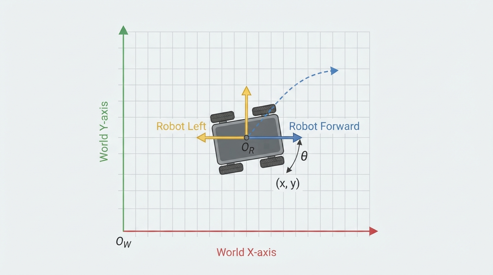
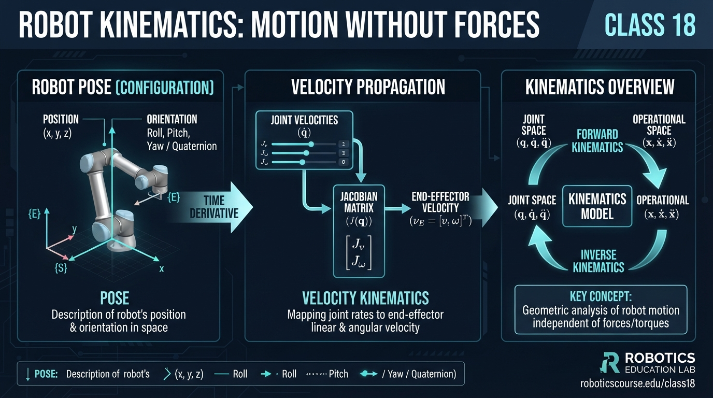
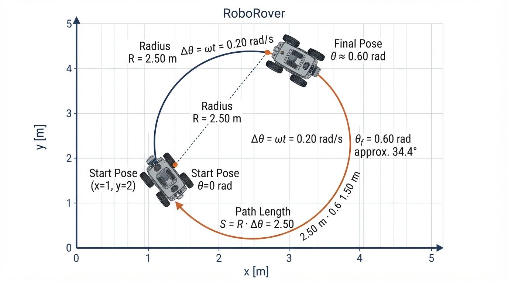
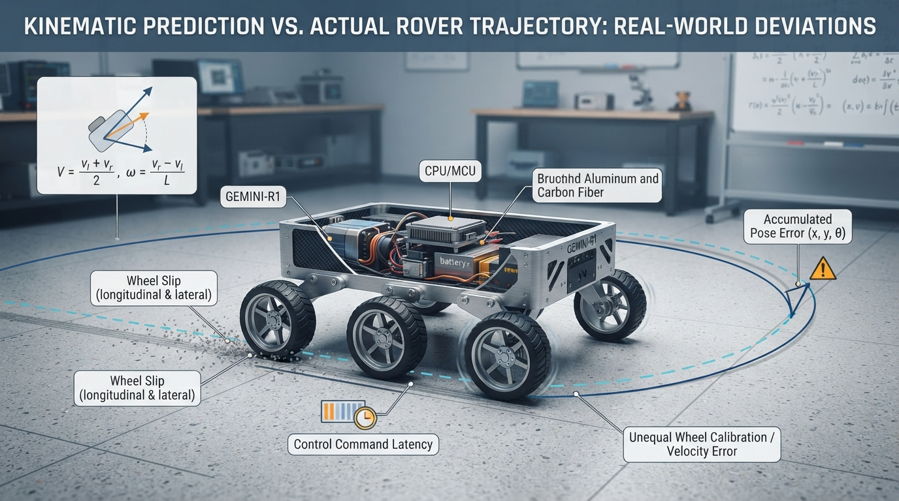

# Class 18: Robot Kinematics: Motion Without Forces

## Where We Are in the Robotics Journey

In the previous class, RoboRover learned about **PI and PID control**: comparing a desired value with a measured value, then adjusting motor commands to reduce the error.

Today we step back and ask a different question:

> If we know the robot’s motion command, where will the robot be and how fast will it move?

This is the study of **kinematics**. Kinematics describes motion using position, orientation, velocity, and time. It does not explain the forces or motor torques that caused the motion.

Next class, we will apply these ideas to a **differential-drive robot**—a robot with a separately powered left wheel and right wheel.

## Today We Will Learn

By the end of this class, you should be able to:

- describe a robot’s planar **pose** using position and orientation;
- distinguish pose from velocity;
- distinguish velocity measured in the robot’s body frame from velocity measured in the world frame;
- calculate a simple robot motion over time;
- explain why kinematics is useful even though it ignores forces;
- recognize practical problems caused by time steps, calibration errors, and slipping;
- simulate RoboRover moving along a curved path.

## 2-Minute Recap

A controller has a goal, a measurement, and an action.

For example, if RoboRover should travel at \(0.5\ \text{m/s}\), a speed controller compares:

- desired speed: \(0.5\ \text{m/s}\);
- measured speed: perhaps \(0.43\ \text{m/s}\);
- speed error: \(0.07\ \text{m/s}\).

A PI or PID controller can use that error to change motor commands.

But the controller’s motor command is not the same thing as the robot’s location. To reason about location, we need a motion model. Kinematics provides that bridge.

## The Big Idea




**Figure:** The world frame stays fixed, while the body frame rotates with RoboRover.

Imagine drawing a tiny arrow on the floor showing where RoboRover is facing.

At any instant, we can describe RoboRover with a **pose**:

1. its horizontal position;
2. its vertical position on a map;
3. the direction it faces.

A common two-dimensional pose is

\[
\mathbf{q} =
\begin{bmatrix}
x\\
y\\
\theta
\end{bmatrix}
\]

where:

- \(x\) is the robot’s position east-west, measured in metres \((\text{m})\);
- \(y\) is the robot’s position north-south, measured in metres \((\text{m})\);
- \(\theta\) is the robot’s orientation angle, measured in radians \((\text{rad})\).

A pose answers:

> Where is the robot, and which way is it pointing?

Velocity answers a different question:

> How is the pose changing right now?

A robot can have:

- a changing position but constant orientation;
- a changing orientation but almost no position change;
- both changing at once;
- zero velocity while still having a perfectly meaningful pose.

## See It in Your Head

### AI-Generated Engineering Visual · Professor OS



**How to read this visual:** Trace the signal or idea from left to right. Match each block to the lesson explanation, then predict what would change if one block produced a wrong value.


Picture a sheet of graph paper on the floor.

- The horizontal \(x\)-axis points east.
- The vertical \(y\)-axis points north.
- A small rectangular RoboRover sits at \((2,1)\).
- An arrow attached to its top points northeast.
- The arrow makes an angle \(\theta\) with the positive \(x\)-axis.

Now draw two coordinate systems:

### World frame

The world frame stays fixed to the room. Its axes do not rotate when RoboRover turns.

### Body frame

The body frame is attached to RoboRover.

- The body \(x\)-axis points forward.
- The body \(y\)-axis points to the robot’s left.
- When RoboRover turns, the body axes turn with it.

This distinction matters. If RoboRover says “move forward at \(0.5\ \text{m/s}\),” that velocity is naturally expressed in the body frame. On the room’s map, the same motion may point east, northeast, or north depending on \(\theta\).

## Core Concept

### Pose

A pose is a complete planar position-and-orientation description:

\[
(x,y,\theta)
\]

For example,

\[
(2.0\ \text{m},\ 1.0\ \text{m},\ 90^\circ)
\]

means RoboRover is 2 metres east of the map origin, 1 metre north of it, and facing north.

Robotics software often stores angles in radians, so

\[
90^\circ = \frac{\pi}{2}\ \text{rad}.
\]

A pose is not a path. It describes one instant, not all the places the robot previously visited.

### Velocity

Velocity describes the rate of change of position. It includes direction, not merely speed.

For a point moving in the world frame,

\[
\mathbf{v} =
\begin{bmatrix}
v_x\\
v_y
\end{bmatrix}
\]

where:

- \(v_x\) is the east-west velocity in \(\text{m/s}\);
- \(v_y\) is the north-south velocity in \(\text{m/s}\).

RoboRover can also rotate. Its angular velocity is

\[
\omega = \frac{d\theta}{dt}
\]

where:

- \(\omega\) is angular velocity in \(\text{rad/s}\);
- \(\theta\) is orientation in radians;
- \(t\) is time in seconds.

A positive \(\omega\) will mean counterclockwise rotation in this class.

### Body-frame velocity

Suppose RoboRover moves forward with speed \(v\), without sliding sideways. In its own body frame:

\[
v_x^{body}=v,\qquad v_y^{body}=0.
\]

But the world-frame components depend on orientation:

\[
v_x^{world}=v\cos\theta
\]

\[
v_y^{world}=v\sin\theta.
\]

These equations are a coordinate conversion. They do not say that the robot is accelerating or that a force is being applied.

## Math Without Fear

The basic planar kinematic equations for a robot whose body-frame velocities are \(v_x^{body}\) and \(v_y^{body}\) are

\[
\dot{x}
=
v_x^{body}\cos\theta
-
v_y^{body}\sin\theta
\]

\[
\dot{y}
=
v_x^{body}\sin\theta
+
v_y^{body}\cos\theta
\]

\[
\dot{\theta}=\omega.
\]

Here:

- \(\dot{x}\) is the rate of change of \(x\), in \(\text{m/s}\);
- \(\dot{y}\) is the rate of change of \(y\), in \(\text{m/s}\);
- \(\dot{\theta}\) is the rate of change of orientation, in \(\text{rad/s}\);
- \(v_x^{body}\) and \(v_y^{body}\) are body-frame velocity components in \(\text{m/s}\);
- \(\theta\) is orientation in radians;
- \(\omega\) is angular velocity in \(\text{rad/s}\).

For a wheeled robot that moves only forward and rotates, \(v_y^{body}=0\). The equations become

\[
\dot{x}=v\cos\theta
\]

\[
\dot{y}=v\sin\theta
\]

\[
\dot{\theta}=\omega.
\]

If \(\omega=0\), the robot travels in a straight line. If both \(v\) and \(\omega\) are constant and nonzero, the robot follows a circular arc.

A computer usually advances the motion in small time steps. With a time step \(\Delta t\),

\[
x_{\text{new}}\approx x+\dot{x}\Delta t
\]

\[
y_{\text{new}}\approx y+\dot{y}\Delta t
\]

\[
\theta_{\text{new}}\approx\theta+\omega\Delta t.
\]

The symbol \(\approx\) reminds us that this is a numerical approximation. Smaller time steps usually improve the approximation, but require more computation.

## Worked Robotics Example




**Figure:** A constant forward speed combined with a constant turn rate produces a circular arc, not a straight path.

RoboRover starts at

\[
x_0=1.0\ \text{m},\qquad y_0=2.0\ \text{m},\qquad \theta_0=0\ \text{rad}.
\]

It drives forward at

\[
v=0.50\ \text{m/s}
\]

while rotating counterclockwise at

\[
\omega=0.20\ \text{rad/s}
\]

for

\[
T=3.0\ \text{s}.
\]

Because it starts facing east, \(\theta_0=0\). After 3 seconds,

\[
\theta_T=\theta_0+\omega T
=0+(0.20\ \text{rad/s})(3.0\ \text{s})
=0.60\ \text{rad}.
\]

The robot has travelled a distance along its curved path of

\[
s=vT=(0.50\ \text{m/s})(3.0\ \text{s})
=1.50\ \text{m}.
\]

For constant forward speed and angular velocity, the exact circular-arc position change is

\[
\Delta x=\frac{v}{\omega}
\left[\sin(\theta_0+\omega T)-\sin(\theta_0)\right]
\]

\[
\Delta y=\frac{v}{\omega}
\left[\cos(\theta_0)-\cos(\theta_0+\omega T)\right].
\]

The turning radius is

\[
R=\frac{v}{\omega}
=\frac{0.50\ \text{m/s}}{0.20\ \text{rad/s}}
=2.50\ \text{m}.
\]

Using \(\theta_0=0\) and \(\omega T=0.60\ \text{rad}\),

\[
\Delta x\approx 1.412\ \text{m}
\]

\[
\Delta y\approx 0.702\ \text{m}.
\]

Therefore the final pose is approximately

\[
(x_T,y_T,\theta_T)
=
(2.412\ \text{m},\ 2.702\ \text{m},\ 0.600\ \text{rad}).
\]

Interpretation:

- RoboRover moved mostly east, because it began facing east.
- It also moved north, because it gradually turned counterclockwise.
- Its path length was \(1.50\ \text{m}\), but its straight-line displacement was shorter because the path curved.
- No force, mass, wheel torque, or friction calculation was needed. This was a kinematic prediction.

The formulas assume the commanded velocity is actually achieved and that the robot does not slip.

## Python Lab

This program simulates the worked example. It uses an exact circular-arc update for constant \(v\) and \(\omega\), then plots the path.

Before running it, predict:

1. Will the path bend above or below the starting point?
2. Will the final orientation be greater than or less than \(0\ \text{rad}\)?
3. Will the robot’s path length be greater than the straight-line distance from start to finish?

```python
import math
import matplotlib.pyplot as plt


def update_pose(x, y, theta, speed, angular_speed, dt):
    """Update a planar pose for constant forward speed and turn rate."""
    if abs(angular_speed) < 1e-12:
        # Straight-line motion when the angular speed is effectively zero.
        new_x = x + speed * math.cos(theta) * dt
        new_y = y + speed * math.sin(theta) * dt
        new_theta = theta
    else:
        # Exact circular-arc update for constant speed and angular speed.
        new_theta = theta + angular_speed * dt
        radius = speed / angular_speed

        new_x = x + radius * (
            math.sin(new_theta) - math.sin(theta)
        )
        new_y = y + radius * (
            math.cos(theta) - math.cos(new_theta)
        )

    return new_x, new_y, new_theta


# Initial pose and constant motion command.
x = 1.0
y = 2.0
theta = 0.0

speed = 0.50          # metres per second
angular_speed = 0.20  # radians per second
total_time = 3.0      # seconds
dt = 0.05             # seconds

times = [0.0]
xs = [x]
ys = [y]
thetas = [theta]

steps = int(round(total_time / dt))

for step in range(steps):
    x, y, theta = update_pose(
        x, y, theta, speed, angular_speed, dt
    )
    times.append((step + 1) * dt)
    xs.append(x)
    ys.append(y)
    thetas.append(theta)

# Independent checks of the worked example.
expected_theta = angular_speed * total_time
expected_x = 1.0 + (speed / angular_speed) * math.sin(expected_theta)
expected_y = 2.0 + (speed / angular_speed) * (
    1.0 - math.cos(expected_theta)
)

assert len(times) == steps + 1
assert abs(times[-1] - total_time) < 1e-12
assert abs(theta - expected_theta) < 1e-12
assert abs(x - expected_x) < 1e-12
assert abs(y - expected_y) < 1e-12

path_length = speed * total_time
assert abs(path_length - 1.5) < 1e-12

print("Final pose:")
print("x = {:.3f} m".format(x))
print("y = {:.3f} m".format(y))
print("theta = {:.3f} rad".format(theta))
print("Commanded path length = {:.3f} m".format(path_length))
print("All worked-example checks passed.")

plt.figure(figsize=(7, 6))
plt.plot(xs, ys, color="darkblue", linewidth=2, label="RoboRover path")
plt.scatter([xs[0]], [ys[0]], color="green", s=70, label="Start")
plt.scatter([xs[-1]], [ys[-1]], color="red", s=70, label="Finish")

# Draw a short arrow showing the final heading.
arrow_length = 0.35
plt.arrow(
    xs[-1],
    ys[-1],
    arrow_length * math.cos(thetas[-1]),
    arrow_length * math.sin(thetas[-1]),
    width=0.015,
    head_width=0.10,
    head_length=0.12,
    color="red",
    length_includes_head=True
)

plt.axis("equal")
plt.xlabel("x position (m)")
plt.ylabel("y position (m)")
plt.title("RoboRover: constant forward speed and turn rate")
plt.grid(True)
plt.legend()
plt.show()
```

Important lines:

- `update_pose` contains the motion model.
- The `if` branch prevents division by a nearly zero angular speed.
- `radius = speed / angular_speed` gives the circular turning radius.
- The `assert` statements verify the exact numerical claims from the worked example.
- `plt.axis("equal")` is important: without it, a circle or arc can look stretched.

## Mini Simulation or Game

Try this prediction game by changing only these two lines:

```python
speed = 0.50
angular_speed = 0.20
```

Make a prediction before running each experiment.

| Experiment | Change | Prediction to make |
|---|---|---|
| A | Set `angular_speed = 0.0` | What shape will the path have? |
| B | Set `angular_speed = -0.20` | Which side of the starting point will the path bend toward? |
| C | Keep `angular_speed = 0.20`, set `speed = 1.00` | Will the turning radius become larger or smaller? |
| D | Keep `speed = 0.50`, set `angular_speed = 0.40` | Will RoboRover turn through a larger or smaller angle in 3 seconds? |

Use these relationships to check your reasoning:

\[
R=\frac{v}{\omega}
\]

and

\[
\Delta\theta=\omega T.
\]

For Experiment C, doubling \(v\) while keeping \(\omega\) fixed doubles the turning radius. For Experiment D, doubling \(\omega\) doubles the change in orientation.

## What Should Happen?

For Experiment A, the path should be a straight line because the angular velocity is zero.

For Experiment B, the path should bend in the opposite direction. The negative angular velocity represents clockwise rotation.

For Experiment C, the turning radius should become \(5.0\ \text{m}\), because

\[
R=\frac{1.00\ \text{m/s}}{0.20\ \text{rad/s}}
=5.0\ \text{m}.
\]

The robot moves faster but turns at the same rate, so it follows a wider arc.

For Experiment D, the orientation change should be

\[
\Delta\theta=(0.40\ \text{rad/s})(3.0\ \text{s})
=1.20\ \text{rad}.
\]

That is a larger turn than the original \(0.60\ \text{rad}\).

## Common Mistakes

### Confusing speed with velocity

Speed is a scalar: \(0.5\ \text{m/s}\).

Velocity includes direction. A robot moving north and a robot moving east can have the same speed but different velocities.

### Mixing degrees and radians

Most Python trigonometric functions use radians. Passing \(90\) to `math.sin` means 90 radians, not 90 degrees.

### Mixing body and world frames

“Forward” is defined relative to the robot. On a fixed map, forward changes direction when the robot rotates.

### Treating pose as a path

The pose \((2,1,\pi/2)\) tells you one state. It does not tell you whether RoboRover arrived there by a straight line, a curve, or several stops.

### Assuming commands are reality

A command of \(0.50\ \text{m/s}\) does not guarantee actual motion of \(0.50\ \text{m/s}\). A wheel can slip, a motor can saturate, or a battery can be weak.

### Ignoring time-step effects

A simulation that updates once every second can miss important turning behavior. Smaller steps generally represent changing motion more accurately, but numerical approximation is still an approximation.

## Try It Yourself

### Challenge

Modify the Python program so that the robot begins at

\[
(0.0\ \text{m},0.0\ \text{m})
\]

with orientation

\[
\theta_0=\frac{\pi}{4}\ \text{rad}.
\]

Use

\[
v=0.60\ \text{m/s},\qquad
\omega=-0.30\ \text{rad/s},\qquad
T=4.0\ \text{s}.
\]

Before running it, predict:

1. whether the robot initially moves northeast, southeast, southwest, or northwest;
2. whether it turns clockwise or counterclockwise;
3. whether its final orientation is greater or less than its initial orientation.

### Optional extension

Add a second arrow at the starting pose showing the initial heading. Then compare it with the final heading arrow.

Do not just inspect the picture. Use the equations to calculate

\[
\Delta\theta=\omega T
\]

and explain the sign of the result.

## Quick Quiz

1. What three quantities make up a common planar robot pose?

2. RoboRover has body-frame forward speed \(v=0.8\ \text{m/s}\) and orientation \(\theta=0\). What are its world-frame \(x\)- and \(y\)-velocity components if it does not rotate?

3. What does angular velocity \(\omega\) measure, and what are its units?

4. RoboRover travels at \(0.4\ \text{m/s}\) for \(5\ \text{s}\) with zero angular velocity. What is the length of its straight path?

## Answers

1. A planar pose commonly contains \(x\) position in metres, \(y\) position in metres, and orientation \(\theta\) in radians.

2. Since \(\cos(0)=1\) and \(\sin(0)=0\),

\[
v_x^{world}=0.8\ \text{m/s}
\]

and

\[
v_y^{world}=0\ \text{m/s}.
\]

3. Angular velocity measures how quickly orientation changes. Its units are radians per second \((\text{rad/s})\).

4. The path length is

\[
s=vT=(0.4\ \text{m/s})(5\ \text{s})
=2.0\ \text{m}.
\]

## Real Robot Connection




**Figure:** Kinematics predicts an ideal motion; slip, calibration, latency, and mechanical limits can make the real path different.

Kinematic models are useful because they are fast and understandable. A navigation program can predict where a robot should be after applying a motion command without simulating every motor force and contact force.

However, real robots depart from the model.

- **Wheel slip:** The wheels may rotate without producing the expected ground motion.
- **Unequal motors:** The left and right sides may produce slightly different speeds.
- **Calibration error:** The assumed wheel diameter or wheel spacing may be inaccurate.
- **Latency:** A command may arrive after a delay, so the robot continues using an older command.
- **Mechanical limits:** The robot may be unable to turn as sharply or move as quickly as the model requests.
- **Numerical error:** Repeated approximate updates can gradually create position error.

This is where the previous class becomes important. A PI or PID speed controller can help the robot achieve a desired wheel or motor speed, but it cannot automatically guarantee that the robot’s estimated pose is correct. Motion control and pose estimation are related but separate engineering tasks.

## Vocabulary

- **Kinematics:** The study of motion—position, orientation, velocity, and acceleration—without directly modeling forces and torques.
- **Pose:** A robot’s position and orientation at one instant.
- **Position:** Location in a coordinate frame, such as \(x\) and \(y\) in metres.
- **Orientation:** The direction a robot is facing, represented here by \(\theta\).
- **Velocity:** A directed rate of motion. It includes speed and direction.
- **Speed:** The magnitude of velocity, measured here in metres per second.
- **Angular velocity:** The rate at which orientation changes, measured in radians per second.
- **World frame:** A fixed coordinate system attached to the room, map, or ground.
- **Body frame:** A coordinate system attached to the robot and moving with it.
- **Time step:** A small interval \(\Delta t\) used to update a simulated or measured state.
- **Turning radius:** For constant forward speed and angular velocity, the radius \(R=v/\omega\) of the circular path when \(\omega\neq0\).

## Further Learning

Useful search terms and study topics:

- “planar robot pose and velocity”
- “body frame and world frame robotics”
- “unicycle kinematic model”
- “robot coordinate transformations”
- “wheel slip and odometry error”
- “numerical integration robotics”

When studying these topics, keep asking two questions:

1. Which coordinate frame is being used?
2. Is the quantity a state, a velocity, a command, or a measurement?

## Next Class

Next class introduces **Differential Drive Robots**.

RoboRover will have a left wheel and a right wheel, each capable of turning at a different speed. We will connect those wheel speeds to:

- forward motion;
- turning motion;
- the robot’s pose change;
- the kinematic equations from this class.

The key idea will be that a differential-drive robot cannot move sideways directly under the usual no-slip model. Its two wheel speeds determine how it moves forward and turns.
