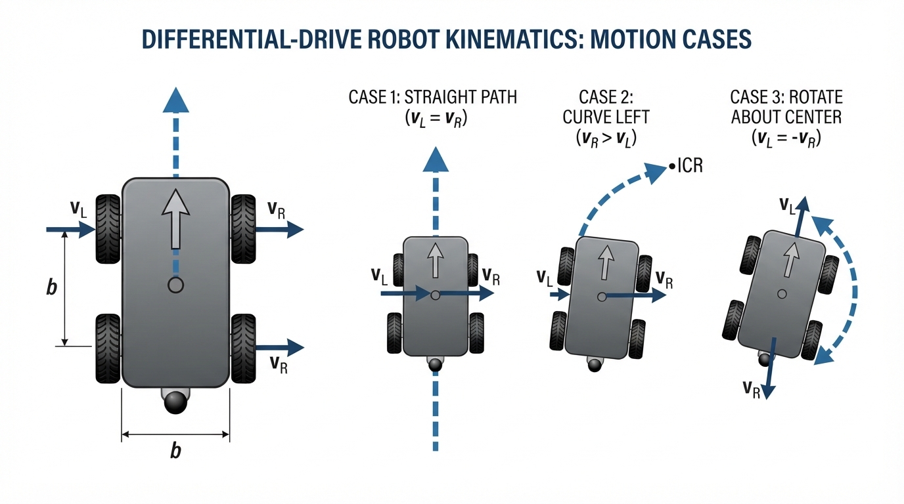
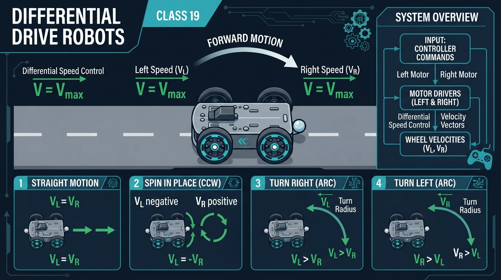
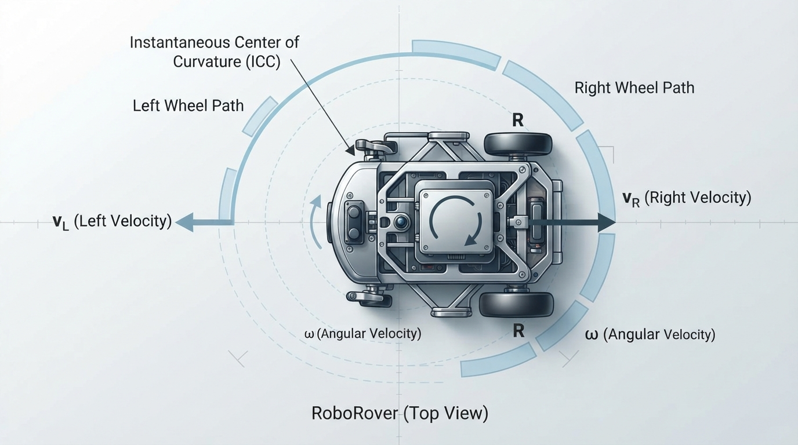
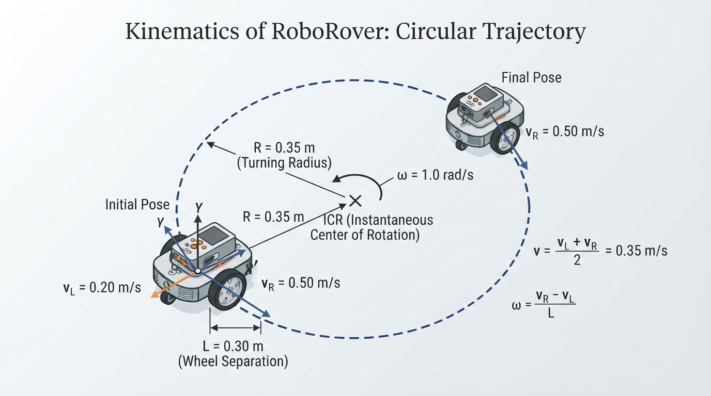
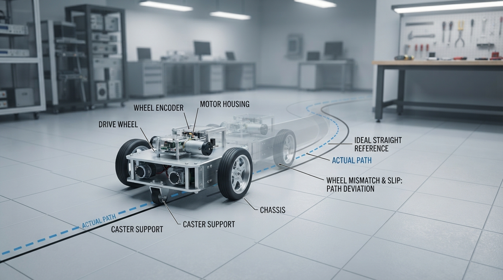

# Class 19: Differential Drive Robots

## Where We Are in the Robotics Journey

In the previous class, RoboRover learned **kinematics**: describing motion using position, direction, speed, and turning rate, without discussing the forces that produce that motion.

Today we connect those ideas to a very common robot design: the **differential drive robot**. RoboRover has two powered wheels, one on the left and one on the right. By changing the speeds of those two wheels, it can move straight, turn along a curve, or spin in place.

In the next class, we will study **odometry**: estimating how far RoboRover has moved by measuring wheel rotation. Today we will calculate motion from commanded wheel speeds. Next time, we will reverse the process and use measured wheel motion to estimate the robot’s position.

## Today We Will Learn

By the end of this class, you should be able to:

- explain how left and right wheel speeds determine robot motion;
- calculate signed longitudinal velocity and turning rate;
- predict whether RoboRover moves straight, curves, or spins;
- interpret the physical meaning of equal and unequal wheel speeds;
- simulate a differential drive robot in Python;
- identify why real robots may not follow the ideal mathematical path exactly.

## 2-Minute Recap

A robot’s **pose** describes its location and direction:

- \(x\): position in the forward horizontal direction, measured in meters;
- \(y\): position to the robot’s left, measured in meters;
- \(\theta\): heading angle, measured in radians, positive counterclockwise.

We use \(x\) as the forward axis, \(y\) as the leftward axis, and positive \(\theta\) as counterclockwise. This is also the convention used by the Python simulation.

A robot’s **signed longitudinal velocity** \(v\) describes the velocity of its center along its forward axis, in meters per second. Positive \(v\) means forward motion; negative \(v\) means reverse motion. It is not the magnitude of the robot’s total translational velocity.

A robot’s **angular velocity** \(\omega\) describes how quickly its heading changes, in radians per second.

For a robot moving on a flat floor:

\[
\dot{x}=v\cos(\theta)
\]

\[
\dot{y}=v\sin(\theta)
\]

\[
\dot{\theta}=\omega
\]

Here:

- \(\dot{x}\) is the rate of change of \(x\), in meters per second;
- \(\dot{y}\) is the rate of change of \(y\), in meters per second;
- \(\dot{\theta}\) is the rate of change of heading, in radians per second;
- \(v\) is signed longitudinal velocity, in meters per second;
- \(\omega\) is angular velocity, in radians per second;
- \(\theta\) is heading, in radians.

The important question for today is:

> How do two wheel speeds produce the single values \(v\) and \(\omega\)?

## The Big Idea



**Figure:** Equal wheel speeds translate the robot; unequal speeds create a turn; opposite equal speeds create a spin.

Imagine carrying a cafeteria tray with one person pushing its left edge and another pushing its right edge.

- If both people push forward equally, the tray moves straight.
- If the right person pushes faster, the tray turns left.
- If they push equally hard in opposite directions, the tray spins in place.

A differential drive robot works in a similar way.

```text
Top view

             forward
                ↑
       left wheel       right wheel
          vL  ●──────────●  vR
                 <  b  >
```

The two wheels are separated by a distance \(b\), called the **wheel track** or **wheel separation**.

The symbol \(v_L\) means the signed linear speed of the left wheel at the floor. The symbol \(v_R\) means the signed linear speed of the right wheel at the floor. Positive wheel speed means motion in the robot’s forward direction.

The robot’s motion depends mainly on the comparison between these speeds:

| Wheel relationship | Robot motion |
|---|---|
| \(v_L=v_R\) | Straight line, possibly forward or reverse |
| \(v_R>v_L\) | Curves left |
| \(v_L>v_R\) | Curves right |
| \(v_R=-v_L\), with nonzero equal magnitude | Spins in place |
| \(v_L=v_R=0\) | Stays still |

This table assumes forward is the positive direction and the wheels do not slip significantly.

## See It in Your Head

### AI-Generated Engineering Visual · Professor OS



**How to read this visual:** Trace the signal or idea from left to right. Match each block to the lesson explanation, then predict what would change if one block produced a wrong value.



**Figure:** When the right wheel moves faster, it travels on the outside of the curve and RoboRover turns left.

Picture RoboRover beginning at the origin, facing upward.

### Case 1: Equal speeds

Both wheels travel \(0.3\ \text{m/s}\). They cover the same distance during every second, so neither side gets ahead. RoboRover moves straight upward.

### Case 2: Right wheel faster

The right wheel travels farther than the left wheel. The right side advances around a larger arc, while the left side follows a smaller arc. The robot rotates counterclockwise, which means it curves left.

This may feel backward at first. Hold a book flat on a table and push its right edge farther than its left edge. The right edge moves forward, and the book’s front rotates toward the left.

### Case 3: Opposite wheel directions

The left wheel moves forward while the right wheel moves backward at the same speed. The midpoint between the wheels does not translate forward or backward. Instead, the robot rotates around its center.

As you inspect the three cases, predict which wheel-speed relationship produces each path:

1. equal speeds produce a straight path;
2. a faster right wheel produces a curved path bending left;
3. opposite equal speeds produce rotation around the robot’s center.

## Core Concept

For an ideal differential drive robot, the robot’s **signed longitudinal velocity** is the average of the two signed wheel speeds:

\[
v=\frac{v_R+v_L}{2}
\]

This is the signed velocity of the midpoint along the robot’s forward axis under the ideal no-slip model. It is not the magnitude of the robot’s total translational velocity.

The robot’s turning rate is:

\[
\omega=\frac{v_R-v_L}{b}
\]

where:

- \(v\) is signed longitudinal velocity, in meters per second \((\text{m/s})\);
- \(v_R\) is signed right-wheel linear speed, in meters per second \((\text{m/s})\);
- \(v_L\) is signed left-wheel linear speed, in meters per second \((\text{m/s})\);
- \(\omega\) is angular velocity, in radians per second \((\text{rad/s})\);
- \(b\) is the distance between the wheel contact lines, in meters \((\text{m})\).

The units of the turning-rate equation make sense:

\[
\frac{\text{m/s}}{\text{m}}=\text{1/s}
\]

Radians are dimensionless in formal unit analysis, so this is reported as \(\text{rad/s}\).

The signs matter. We will use this convention:

- positive \(v\): forward;
- negative \(v\): reverse;
- positive \(\omega\): counterclockwise turning;
- positive \(v_R-v_L\): turning left.

The robot’s instantaneous motion is then described by:

\[
\dot{x}=v\cos(\theta)
\]

\[
\dot{y}=v\sin(\theta)
\]

\[
\dot{\theta}=\omega
\]

These equations connect wheel-level commands to the pose-level kinematics from the previous class.

### Formative Checkpoint

Before reading the worked calculation, predict \(v\) and \(\omega\) for:

\[
v_L=0.10\ \text{m/s},\qquad
v_R=0.30\ \text{m/s},\qquad
b=0.40\ \text{m}
\]

Also predict whether the robot turns left or right. Check your prediction after the next section.

## Math Without Fear

Suppose both wheels have the same speed:

\[
v_L=v_R
\]

Then:

\[
\omega=\frac{v_R-v_L}{b}
=\frac{0}{b}=0\ \text{rad/s}
\]

A zero turning rate means the heading stays constant. The robot moves straight, either forward or backward depending on the common signed wheel speed.

For the formative checkpoint:

\[
v=\frac{0.30+0.10}{2}=0.20\ \text{m/s}
\]

\[
\omega=\frac{0.30-0.10}{0.40}=0.50\ \text{rad/s}
\]

Because \(\omega\) is positive, the robot turns left.

Now suppose the wheels have equal and opposite speeds:

\[
v_R=-v_L
\]

Then:

\[
v=\frac{v_R+v_L}{2}
=\frac{v_R-v_R}{2}=0\ \text{m/s}
\]

The robot’s center does not move forward or backward. But:

\[
\omega=\frac{v_R-v_L}{b}
\]

is generally nonzero, so the robot spins in place.

For unequal wheel speeds, the robot follows a circular arc at that instant. The turning radius of the robot’s center is:

\[
R=\frac{v}{\omega}
\]

where:

- \(R\) is the signed turning radius, in meters;
- \(v\) is signed longitudinal velocity, in meters per second;
- \(\omega\) is angular velocity, in radians per second.

Substituting the wheel equations gives:

\[
R=\frac{b}{2}\frac{v_R+v_L}{v_R-v_L}
\]

A very large magnitude of \(R\) means a gentle curve. A small magnitude means a tight curve. The sign of \(R\) indicates the turning direction under the selected sign convention. If \(\omega=0\), the path is straight and the radius is treated as infinite.

## Worked Robotics Example



**Figure:** The worked example combines wheel speeds to calculate forward velocity, turning rate, and turning radius.

RoboRover has:

- wheel separation \(b=0.30\ \text{m}\);
- left-wheel speed \(v_L=0.20\ \text{m/s}\);
- right-wheel speed \(v_R=0.50\ \text{m/s}\).

### Step 1: Calculate signed longitudinal velocity

\[
v=\frac{v_R+v_L}{2}
\]

\[
v=\frac{0.50\ \text{m/s}+0.20\ \text{m/s}}{2}
=0.35\ \text{m/s}
\]

So RoboRover’s center moves forward along its longitudinal axis at \(0.35\ \text{m/s}\).

### Step 2: Calculate turning rate

\[
\omega=\frac{v_R-v_L}{b}
\]

\[
\omega=\frac{0.50\ \text{m/s}-0.20\ \text{m/s}}{0.30\ \text{m}}
=1.0\ \text{rad/s}
\]

The positive result means counterclockwise turning, or a left turn.

### Step 3: Calculate turning radius

\[
R=\frac{v}{\omega}
\]

\[
R=\frac{0.35\ \text{m/s}}{1.0\ \text{rad/s}}
=0.35\ \text{m}
\]

RoboRover’s center follows a circle with radius \(0.35\ \text{m}\), assuming constant speeds and no slipping.

### Step 4: Interpret the motion

After \(2.0\ \text{s}\):

- the left wheel has traveled \(0.20\ \text{m/s}\times2.0\ \text{s}=0.40\ \text{m}\);
- the right wheel has traveled \(0.50\ \text{m/s}\times2.0\ \text{s}=1.00\ \text{m}\);
- the heading has changed by \(1.0\ \text{rad/s}\times2.0\ \text{s}=2.0\ \text{rad}\).

RoboRover has not traveled in a straight line. It has moved forward while turning left.

## Python Lab

This program plots three ideal differential-drive paths:

1. equal wheel speeds;
2. a faster right wheel;
3. opposite wheel speeds for a spin.

It also verifies the worked example’s calculated velocity, turning rate, and radius.

```python
import math
import matplotlib.pyplot as plt


def differential_drive_motion(v_left, v_right, wheel_separation):
    """Return signed longitudinal velocity, angular speed, and turning radius."""
    forward_velocity = (v_right + v_left) / 2.0
    angular_speed = (v_right - v_left) / wheel_separation

    if abs(angular_speed) < 1e-12:
        turning_radius = float("inf")
    else:
        turning_radius = forward_velocity / angular_speed

    return forward_velocity, angular_speed, turning_radius


def pose_at_time(v_left, v_right, wheel_separation, time_seconds):
    """Calculate ideal pose from an initial pose of (0, 0, 0)."""
    forward_velocity, angular_speed, unused_radius = differential_drive_motion(
        v_left, v_right, wheel_separation
    )

    if abs(angular_speed) < 1e-12:
        x_position = forward_velocity * time_seconds
        y_position = 0.0
        heading = 0.0
    else:
        heading = angular_speed * time_seconds
        x_position = (forward_velocity / angular_speed) * math.sin(heading)
        y_position = (forward_velocity / angular_speed) * (1.0 - math.cos(heading))

    return x_position, y_position, heading


def make_path(v_left, v_right, wheel_separation, total_time, samples):
    times = []
    x_values = []
    y_values = []

    for index in range(samples + 1):
        time_seconds = total_time * index / float(samples)
        x_position, y_position, unused_heading = pose_at_time(
            v_left, v_right, wheel_separation, time_seconds
        )
        times.append(time_seconds)
        x_values.append(x_position)
        y_values.append(y_position)

    return times, x_values, y_values


# Verify the worked example.
example_v, example_omega, example_radius = differential_drive_motion(
    0.20, 0.50, 0.30
)

assert abs(example_v - 0.35) < 1e-12
assert abs(example_omega - 1.0) < 1e-12
assert abs(example_radius - 0.35) < 1e-12

print("Worked example verified:")
print("forward velocity =", example_v, "m/s")
print("angular speed =", example_omega, "rad/s")
print("turning radius =", example_radius, "m")

# Verify two important special cases.
straight_v, straight_omega, straight_radius = differential_drive_motion(
    0.30, 0.30, 0.30
)
spin_v, spin_omega, spin_radius = differential_drive_motion(
    -0.20, 0.20, 0.30
)

assert abs(straight_v - 0.30) < 1e-12
assert abs(straight_omega) < 1e-12
assert abs(spin_v) < 1e-12
assert abs(spin_omega - (0.40 / 0.30)) < 1e-12

cases = [
    ("equal speeds", 0.30, 0.30),
    ("faster right wheel", 0.20, 0.50),
    ("spin in place", -0.20, 0.20),
]

plt.figure(figsize=(8, 6))

for label, left_speed, right_speed in cases:
    times, x_values, y_values = make_path(
        left_speed, right_speed, 0.30, 4.0, 200
    )
    plt.plot(x_values, y_values, label=label)

plt.axhline(0.0, color="black", linewidth=0.6)
plt.axvline(0.0, color="black", linewidth=0.6)
plt.xlabel("x position (m)")
plt.ylabel("y position (m)")
plt.title("Ideal differential-drive paths")
plt.axis("equal")
plt.grid(True)
plt.legend()
plt.show()
```

Important lines:

- `forward_velocity = ...` implements the average wheel-speed equation.
- `angular_speed = ...` implements the wheel-difference equation.
- When angular speed is zero, the robot uses the straight-line formula.
- Otherwise, the program uses the exact constant-speed circular-arc equations for an initial pose of \((0,0,0)\).
- The `assert` statements are executable checks. If a formula is accidentally changed, the program stops rather than silently presenting a misleading plot.

The plotted coordinate system starts RoboRover at \((0,0)\), facing in the positive \(x\)-direction. Therefore, a left-turning path bends toward positive \(y\).

The spin case appears as a single point in the position plot because its center does not translate. The plot does not show heading, so it cannot display the robot’s changing orientation directly; the calculated angular speed and heading equation show that rotation is occurring.

## Mini Simulation or Game

### Wheel-Speed Challenge

Before running the program, choose values for \(v_L\), \(v_R\), and \(b\).

Try this challenge:

- \(b=0.40\ \text{m}\);
- \(v_L=0.10\ \text{m/s}\);
- \(v_R=0.30\ \text{m/s}\);
- simulation time \(=4.0\ \text{s}\).

Predict:

1. Does RoboRover move straight, curve, or spin?
2. Does it curve left or right?
3. Is its forward velocity below, equal to, or above \(0.20\ \text{m/s}\)?
4. Is the turning radius smaller or larger than \(1\ \text{m}\)?

Then replace one of the entries in the `cases` list with your values and run the program.

For an additional game, ask a partner to give you a desired motion—“straight,” “gentle left,” “tight right,” or “spin”—without giving wheel speeds. Choose \(v_L\) and \(v_R\) to produce the requested behavior. Your partner checks the graph.

## What Should Happen?

For the three built-in cases:

- **Equal speeds** should produce a straight line because \(v_R-v_L=0\), so \(\omega=0\).
- **Faster right wheel** should produce a left-curving path because \(v_R-v_L>0\).
- **Spin in place** should show nearly no change in the robot center’s position because the forward velocity is zero, while the heading changes.

For the challenge values:

\[
v=\frac{0.30+0.10}{2}=0.20\ \text{m/s}
\]

Thus the forward velocity is **equal to** \(0.20\ \text{m/s}\).

\[
\omega=\frac{0.30-0.10}{0.40}=0.50\ \text{rad/s}
\]

\[
R=\frac{0.20}{0.50}=0.40\ \text{m}
\]

So RoboRover should curve left with a radius of \(0.40\ \text{m}\), which is smaller than \(1\ \text{m}\). These calculations can also be checked by entering the values into the program’s functions.

## Common Mistakes

### Mistake 1: Using motor rotational speed as wheel linear speed

A motor might be described in revolutions per minute, or RPM. The equations in this class require the wheel’s **linear ground speed** in meters per second.

Wheel radius and gearing are needed to convert motor rotation into ground speed. That conversion is an engineering step between the motor controller and the differential-drive equations.

### Mistake 2: Thinking the faster wheel points the robot toward itself

If the right wheel is faster, RoboRover turns left, not right. The faster side moves farther around the outside of the curve.

### Mistake 3: Forgetting wheel separation

The same wheel-speed difference creates a larger turning rate on a narrow robot than on a wide robot:

\[
\omega=\frac{v_R-v_L}{b}
\]

Increasing \(b\) reduces the turning rate for the same wheel speeds.

### Mistake 4: Assuming commands equal actual motion

Real wheels can slip, especially during fast turns or on smooth floors. Wheel diameters may differ slightly, motors may produce unequal speeds, and the robot may have mechanical play.

The ideal equations describe the intended kinematics. Sensors and calibration are needed to learn how closely the physical robot follows them.

### Mistake 5: Treating a zero forward velocity as a stopped robot

If \(v=0\) but \(\omega\neq0\), the robot is not stopped. Its center is stationary while the body rotates.

## Try It Yourself

### Challenge: Design a Specific Turn

RoboRover must have:

- wheel separation \(b=0.50\ \text{m}\);
- forward velocity \(v=0.25\ \text{m/s}\);
- turning rate \(\omega=0.40\ \text{rad/s}\).

Find one possible pair of wheel speeds \(v_L\) and \(v_R\).

Start with:

\[
v=\frac{v_R+v_L}{2}
\]

\[
\omega=\frac{v_R-v_L}{b}
\]

Solving the equations:

\[
v_R-v_L=\omega b=(0.40)(0.50)=0.20\ \text{m/s}
\]

\[
v_R+v_L=2v=2(0.25)=0.50\ \text{m/s}
\]

Adding and subtracting these equations gives:

\[
v_R=0.35\ \text{m/s}
\]

\[
v_L=0.15\ \text{m/s}
\]

Therefore, one left-turning solution is:

\[
\boxed{v_L=0.15\ \text{m/s},\qquad v_R=0.35\ \text{m/s}}
\]

For a right-turning solution with the same forward velocity and turning-rate magnitude, the left wheel must be faster. The difference \(v_R-v_L\) must be negative:

\[
\boxed{v_L=0.35\ \text{m/s},\qquad v_R=0.15\ \text{m/s}}
\]

Here \(\omega=-0.40\ \text{rad/s}\), indicating clockwise turning.

## Quick Quiz

1. RoboRover has \(v_L=0.4\ \text{m/s}\) and \(v_R=0.4\ \text{m/s}\). What is its turning rate?

2. RoboRover has \(v_L=0.2\ \text{m/s}\), \(v_R=0.5\ \text{m/s}\), and \(b=0.3\ \text{m}\). What is its forward velocity?

3. Under the sign convention used in this class, which way does RoboRover turn when \(v_R>v_L\)?

4. A robot has \(v_L=-0.3\ \text{m/s}\) and \(v_R=0.3\ \text{m/s}\). What kind of motion does its center have?

## Answers

1. The turning rate is \(0\ \text{rad/s}\), because the wheel speeds are equal.

2. The forward velocity is:

\[
v=\frac{0.5+0.2}{2}=0.35\ \text{m/s}
\]

3. It turns left, or counterclockwise, because the right wheel is faster.

4. Its center has zero forward velocity, but the robot rotates in place because the wheels move in opposite directions.

## Real Robot Connection



**Figure:** Real robots can deviate from the ideal model because of wheel mismatch, slip, and mechanical differences.

A physical differential-drive robot usually has:

- two drive motors;
- two wheels;
- one or more passive support elements, such as a caster or low-friction ball;
- motor controllers that receive speed or power commands;
- wheel encoders that measure wheel rotation.

The controller may command a desired \(v_L\) and \(v_R\), but the motor system must work to produce those speeds. Floor friction, battery voltage, payload, wheel wear, and motor differences affect the result.

A useful commissioning test is to command equal wheel speeds and observe whether RoboRover travels straight. If it slowly curves, the two sides may not be producing equal actual speeds. This matters greatly in the next class: odometry estimates position from wheel motion, so systematic wheel-speed errors can create systematic position errors.

The ideal model assumes the wheel contact points do not slide sideways. That assumption is often reasonable for slow motion on a grippy floor, but it becomes less accurate during sharp turns, sudden acceleration, or slippery motion.

## Vocabulary

- **Differential drive:** A mobile robot design in which left and right wheel speeds are independently controlled to create translation and rotation.
- **Wheel separation \(b\):** The distance between the left and right wheel contact lines, measured in meters.
- **Left-wheel speed \(v_L\):** The signed linear speed of the left wheel at the floor, measured in meters per second.
- **Right-wheel speed \(v_R\):** The signed linear speed of the right wheel at the floor, measured in meters per second.
- **Signed longitudinal velocity \(v\):** The signed velocity of the robot’s center along its forward axis, calculated as the average of the two signed wheel speeds.
- **Angular velocity \(\omega\):** The rate at which the robot’s heading changes, measured in radians per second.
- **Turning radius \(R\):** The signed radius of the circular path followed by the robot’s center during constant unequal wheel speeds.
- **Wheel slip:** Motion in which a wheel rotates without producing the expected amount of ground travel, or slides sideways relative to the floor.
- **Odometry:** Estimating a robot’s change in position from measured wheel or joint motion. This is the next class’s main topic.

## Further Learning

To deepen this class, experiment with these questions:

- What happens to \(\omega\) if the wheel separation doubles but the wheel-speed difference stays the same?
- Can a robot move forward while turning clockwise? Which wheel must be faster under the sign convention used here?
- How would a small error in one wheel’s diameter affect a supposedly straight journey?
- What information would wheel encoders need to provide before odometry could estimate distance traveled?

Do not try to solve the full odometry problem yet. The key preparation is understanding that wheel motion is the source of the robot’s motion estimate.

## Next Class

**Class 20: Odometry**

RoboRover will use measured wheel rotation to estimate how far it has moved and how its heading has changed. We will connect encoder measurements to wheel distances, then use the differential-drive equations from this class to update the robot’s estimated pose.