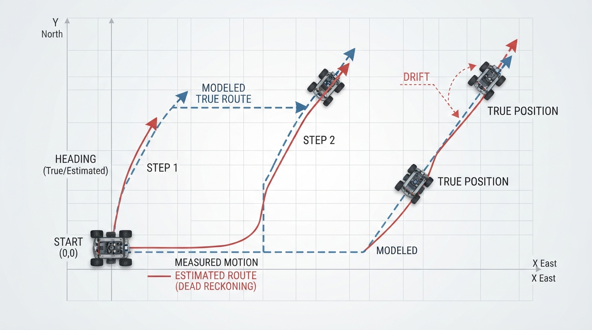
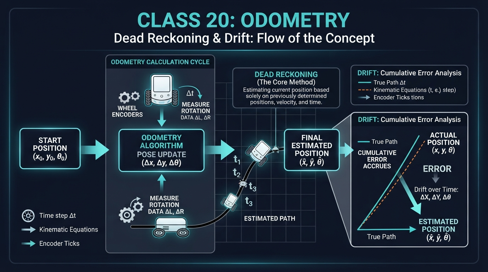
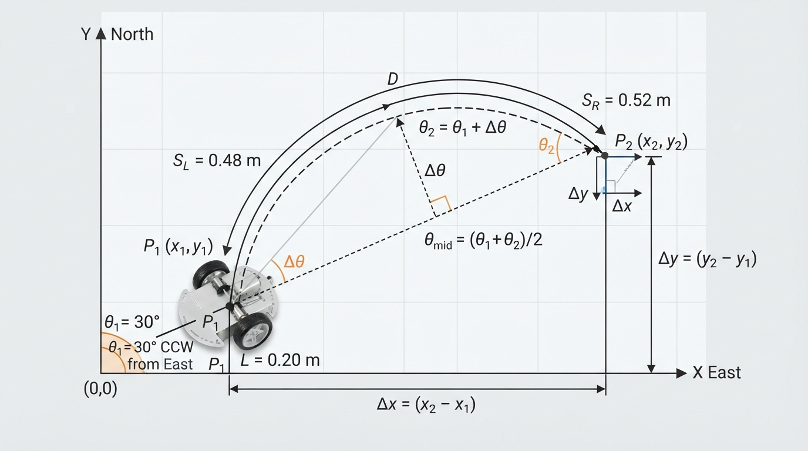
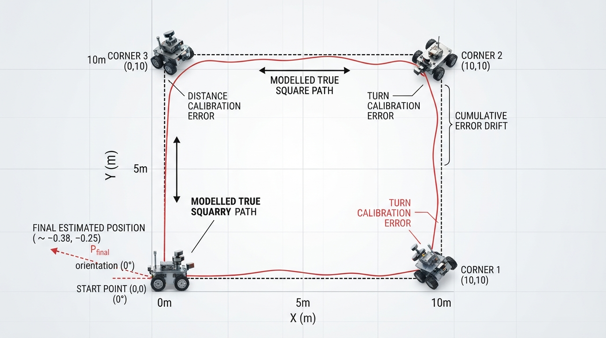

# Class 20: Odometry

## Where We Are in the Robotics Journey

In the previous class, RoboRover learned how a **differential-drive robot** moves. Two independently driven wheels allow the robot to travel forward, turn, or curve:

- both wheels move the same distance → straight motion;
- one wheel moves farther than the other → turning;
- the wheels move in opposite directions → turning in place.

Today we use those wheel movements to answer a new question:

> “Where does RoboRover think it is now?”

This is the job of **odometry**.

Odometry connects the robot’s measured wheel motion to an estimate of its position and orientation. It is useful, inexpensive, and available continuously. It is also imperfect. Small errors accumulate, causing **drift**.

In the next class, Probability for Robots, we will represent uncertain information mathematically. Today we will first understand why uncertainty appears in the first place.

## Today We Will Learn

By the end of this class, you should be able to:

1. explain dead reckoning in everyday language;
2. use wheel measurements to estimate a differential-drive robot’s pose;
3. distinguish robot pose from odometry’s estimate of pose;
4. explain why odometry drifts;
5. simulate true motion and estimated motion in Python;
6. identify practical causes of odometry error.

The central idea is:

> Odometry estimates motion by accumulating measurements from the robot’s own movement.

## 2-Minute Recap

A differential-drive robot has a left wheel and a right wheel.

Let:

- \( \Delta s_L \) = distance traveled by the left wheel during one time interval, in meters;
- \( \Delta s_R \) = distance traveled by the right wheel during that interval, in meters;
- \( b \) = distance between the wheel contact points, called the track width, in meters.

If both wheels move the same distance, the robot travels straight. If the right wheel travels farther than the left wheel, the robot turns left. The robot’s orientation changes because the two wheels trace circles with different radii.

For this lesson, use the following coordinate convention:

- positive \(x\) points east;
- positive \(y\) points north;
- positive \(\theta\) points counterclockwise from the positive \(x\)-axis.

RoboRover’s **pose** describes its location and heading:

\[
(x, y, \theta)
\]

where:

- \(x\) is horizontal position, in meters;
- \(y\) is vertical position, in meters;
- \(\theta\) is heading angle, in radians.

A pose is not the same as a motor command. “Move forward” is an instruction. “\(x=2.0\text{ m}, y=1.0\text{ m}, \theta=90^\circ\)” is a pose estimate.

## The Big Idea



**Figure:** Dead reckoning accumulates measured motion from a known starting pose.

Imagine walking through a dark room while counting your steps and turns:

1. You begin at the doorway.
2. You take ten steps forward.
3. You turn left.
4. You take six steps.
5. You turn right.

You can estimate where you are without looking at a map or checking a landmark. This is **dead reckoning**.

A robot performs a similar process using wheel encoders. An encoder is a sensor that measures wheel rotation or encoder counts. The robot converts those measurements into inferred wheel travel, combines the left and right distances, and updates its estimated pose.

A useful mental model is a pencil drawing RoboRover’s path:

- the pencil starts at the known starting position;
- every wheel measurement moves the pencil a little;
- the drawn line becomes the robot’s estimated path.

If every measured distance and turn were perfect, the line would match the modeled true path. In reality, the pencil gradually wanders away from the actual track.

That wandering is **drift**.

### Two kinds of error

Odometry error commonly has two broad forms:

- **Systematic error:** a repeatable bias, such as one wheel being slightly larger or one encoder scale being miscalibrated.
- **Random or changing error:** variation caused by floor texture, wheel slip, electrical noise, or changing contact with the ground.

A systematic error is like using a ruler that is always 2% too short. A changing error is like measuring with a ruler that sometimes slips.

Both can make the estimated pose wrong, but they behave differently.

## See It in Your Head

### AI-Generated Engineering Visual · Professor OS



**Figure:** Wheel-motion measurements are converted into forward displacement and heading change before the estimated pose is updated.

Use the displayed schematic as a guided interpretation activity:

1. Start at the wheel-motion inputs on the left.
2. Identify where the left and right wheel measurements are combined to estimate forward travel.
3. Identify where their difference and the track width determine heading change.
4. Follow the updated heading and displacement to the estimated pose on the right.
5. Predict what would happen if the right-wheel measurement were slightly too large.

A too-large right-wheel measurement would make the calculation report too much leftward turning. The resulting estimated path would gradually separate from the physical path, even if the rest of the calculation were implemented correctly.

The important visual fact is that drift does not require a dramatic error at one step. Several small errors can combine into a visible final mistake.

## Core Concept

### From wheel motion to robot motion

For a differential-drive robot, the average distance traveled by the two wheels is:

\[
\Delta s = \frac{\Delta s_R+\Delta s_L}{2}
\]

where:

- \(\Delta s\) is the robot’s approximate forward travel during the interval, in meters;
- \(\Delta s_R\) and \(\Delta s_L\) are the right- and left-wheel distances, in meters.

The change in heading is:

\[
\Delta\theta = \frac{\Delta s_R-\Delta s_L}{b}
\]

where:

- \(\Delta\theta\) is the change in heading, in radians;
- \(b\) is the track width, in meters.

Under the stated coordinate convention, a positive \(\Delta\theta\) is a counterclockwise, leftward turn.

The units work correctly:

\[
\frac{\text{meters}}{\text{meters}}=\text{radians}
\]

Radians are technically dimensionless ratios, but we write “rad” to make angular quantities clear.

If the robot’s old heading is \(\theta\), a useful update uses the heading halfway through the motion:

\[
\theta_{\text{mid}}=\theta+\frac{\Delta\theta}{2}
\]

Then:

\[
x_{\text{new}}=x+\Delta s\cos(\theta_{\text{mid}})
\]

\[
y_{\text{new}}=y+\Delta s\sin(\theta_{\text{mid}})
\]

\[
\theta_{\text{new}}=\theta+\Delta\theta
\]

This midpoint update is a practical approximation for one interval of differential-drive motion. It is especially accurate when each interval is short and the heading change is small. For a larger increment or a larger turn, treating the whole movement as if it occurred at one midpoint heading becomes less accurate. Higher-accuracy systems can use the exact differential-drive integration formula, which follows the circular arc implied by the two wheel distances.

### Why heading matters

Suppose RoboRover moves forward \(1\text{ m}\). If it faces east, most of that movement changes \(x\). If it faces north, most changes \(y\).

Therefore, odometry must track both:

- how far the robot moved;
- which direction it was facing while moving.

A distance measurement without a heading is not enough to determine a position.

## Math Without Fear

Suppose RoboRover begins at:

\[
x=0\text{ m},\qquad y=0\text{ m},\qquad \theta=30^\circ
\]

Its wheel measurements during one interval are:

\[
\Delta s_L=0.48\text{ m}
\]

\[
\Delta s_R=0.52\text{ m}
\]

The track width is:

\[
b=0.20\text{ m}
\]

First calculate the average travel:

\[
\Delta s=\frac{0.52+0.48}{2}\text{ m}
\]

\[
\Delta s=0.50\text{ m}
\]

Next calculate the heading change:

\[
\Delta\theta=\frac{0.52-0.48}{0.20}\text{ rad}
\]

\[
\Delta\theta=0.20\text{ rad}
\]

The initial angle must be converted to radians before using Python’s trigonometric functions:

\[
30^\circ = \frac{30\pi}{180}\text{ rad}\approx0.524\text{ rad}
\]

The midpoint heading is:

\[
\theta_{\text{mid}}=0.524+\frac{0.20}{2}
\]

\[
\theta_{\text{mid}}\approx0.624\text{ rad}
\]

Now estimate the position change:

\[
\Delta x=0.50\cos(0.624)\text{ m}\approx0.405\text{ m}
\]

\[
\Delta y=0.50\sin(0.624)\text{ m}\approx0.293\text{ m}
\]

So RoboRover’s estimated new pose is approximately:

\[
x=0.405\text{ m},\qquad y=0.293\text{ m}
\]

\[
\theta=0.524+0.20=0.724\text{ rad}
\]

The new heading in degrees is approximately:

\[
0.724\cdot\frac{180}{\pi}\approx41.5^\circ
\]

### Interpretation

The right wheel traveled \(0.04\text{ m}\) farther than the left wheel. Therefore, RoboRover turned toward the left while moving forward. It moved about half a meter, but not in a perfectly straight line.

The numbers are an **estimate**. They describe what the odometry calculation believes happened, not necessarily the exact physical motion.

## Worked Robotics Example



**Figure:** Unequal wheel travel creates both forward displacement and a change in heading.

RoboRover is placed on a smooth floor. Its initial heading is \(30^\circ\) counterclockwise from east, so it is not pointing exactly east. Its wheel encoders report these values during a short movement:

| Quantity | Value |
|---|---:|
| Left-wheel travel | \(0.48\text{ m}\) |
| Right-wheel travel | \(0.52\text{ m}\) |
| Track width | \(0.20\text{ m}\) |
| Starting heading | \(30^\circ\) counterclockwise from east |

The wheel difference is:

\[
0.52\text{ m}-0.48\text{ m}=0.04\text{ m}
\]

Because the right wheel moved farther, the robot turns left. The average forward travel is \(0.50\text{ m}\), and the heading change is \(0.20\text{ rad}\), or about \(11.5^\circ\).

The estimated heading changes from \(30^\circ\) to approximately \(41.5^\circ\). The estimated displacement is approximately:

- \(0.405\text{ m}\) eastward;
- \(0.293\text{ m}\) northward.

If the floor caused the right wheel to slip slightly, the encoders might still report \(0.52\text{ m}\) even though the wheel’s contact point did not move that far. Odometry would then calculate a turn that was larger than the true turn.

This is the beginning of drift: the robot uses a measurement that is plausible but not perfectly accurate.

## Python Lab



**Figure:** The simulation compares an ideal square route with an odometry estimate affected by small calibration errors.

This program simulates RoboRover driving around a square using wheel travel rather than independent pose commands. The **modeled true robot** is a mathematical reference path: it follows four perfect \(1\text{ m}\) sides and turns exactly \(90^\circ\) each time. It is not measured physical ground truth from a real robot. The turns are represented by opposite wheel travels for a differential-drive robot.

The **odometry estimate** has two small calibration errors:

- it interprets each \(1\text{ m}\) forward movement as \(2\%\) longer;
- it interprets each \(90^\circ\) turn as \(91^\circ\).

The midpoint differential-drive update is used for both paths. The program plots the modeled reference path and the odometry estimate.

```python
import math
import matplotlib.pyplot as plt


def apply_wheel_motion(pose, left_distance, right_distance, track_width):
    """Update a pose from measured left- and right-wheel travel."""
    x, y, theta = pose
    forward_distance = (left_distance + right_distance) / 2.0
    heading_change = (right_distance - left_distance) / track_width
    midpoint_heading = theta + heading_change / 2.0

    new_x = x + forward_distance * math.cos(midpoint_heading)
    new_y = y + forward_distance * math.sin(midpoint_heading)
    new_theta = theta + heading_change

    return new_x, new_y, new_theta


def simulate():
    track_width = 0.20
    side_length = 1.0
    true_turn_degrees = 90.0
    estimated_turn_degrees = 91.0
    estimated_distance_scale = 1.02

    true_pose = (0.0, 0.0, 0.0)
    estimated_pose = (0.0, 0.0, math.radians(0.0))

    true_path = [true_pose]
    estimated_path = [estimated_pose]

    # A turn in place through angle alpha requires opposite wheel
    # travels of magnitude track_width * alpha / 2.
    true_turn_travel = (
        track_width * math.radians(true_turn_degrees) / 2.0
    )
    estimated_turn_travel = (
        track_width * math.radians(estimated_turn_degrees) / 2.0
    )

    for step in range(4):
        # True forward wheel travel.
        true_pose = apply_wheel_motion(
            true_pose, side_length, side_length, track_width
        )

        # Estimated encoder-derived forward travel has a scale error.
        estimated_side_length = side_length * estimated_distance_scale
        estimated_pose = apply_wheel_motion(
            estimated_pose,
            estimated_side_length,
            estimated_side_length,
            track_width
        )

        true_path.append(true_pose)
        estimated_path.append(estimated_pose)

        # True 90-degree left turn in place.
        true_pose = apply_wheel_motion(
            true_pose,
            -true_turn_travel,
            true_turn_travel,
            track_width
        )

        # Estimated turn is 91 degrees instead of 90 degrees.
        estimated_pose = apply_wheel_motion(
            estimated_pose,
            -estimated_turn_travel,
            estimated_turn_travel,
            track_width
        )

        true_path.append(true_pose)
        estimated_path.append(estimated_pose)

    true_x = [pose[0] for pose in true_path]
    true_y = [pose[1] for pose in true_path]
    estimated_x = [pose[0] for pose in estimated_path]
    estimated_y = [pose[1] for pose in estimated_path]

    true_final = true_path[-1]
    estimated_final = estimated_path[-1]

    true_distance_from_start = math.hypot(
        true_final[0], true_final[1]
    )
    estimated_distance_from_start = math.hypot(
        estimated_final[0], estimated_final[1]
    )

    # Verification statements for the claims made by this simulation.
    assert len(true_path) == 9
    assert len(estimated_path) == 9
    assert true_distance_from_start < 1e-9
    assert estimated_distance_from_start > 0.04

    print("Modeled true final position: ({:.4f}, {:.4f}) m".format(
        true_final[0], true_final[1]
    ))
    print("Estimated final position: ({:.4f}, {:.4f}) m".format(
        estimated_final[0], estimated_final[1]
    ))
    print("Modeled true distance from start: {:.6f} m".format(
        true_distance_from_start
    ))
    print("Estimated distance from start: {:.6f} m".format(
        estimated_distance_from_start
    ))

    plt.figure(figsize=(7, 7))
    plt.plot(true_x, true_y, "o--", label="Modeled true path")
    plt.plot(estimated_x, estimated_y, "s-", label="Odometry estimate")
    plt.scatter([0], [0], color="black", label="Start", zorder=5)

    plt.axis("equal")
    plt.xlabel("x position (m)")
    plt.ylabel("y position (m)")
    plt.title("RoboRover: modeled path and odometry drift")
    plt.grid(True)
    plt.legend()
    plt.show()


if __name__ == "__main__":
    simulate()
```

### Important lines

- `apply_wheel_motion()` converts left- and right-wheel travel into forward motion and heading change.
- `math.cos(theta)` and `math.sin(theta)` split forward travel into horizontal and vertical components.
- `math.radians(angle_degrees)` converts degrees to radians.
- `true_path` and `estimated_path` store the history needed for plotting.
- `math.hypot(x, y)` calculates the straight-line distance from the origin.
- The turn-wheel travel is computed from the differential-drive relation, so the code models encoder-derived wheel motion rather than applying an independent pose rotation.
- The `assert` statements automatically check the important conclusions:
  - each path contains the start plus four forward-motion and four turn updates;
  - the modeled reference square returns to the start;
  - the estimated path does not return close to the start.

The simulation is deliberately simple. It does not model wheel slip, uneven flooring, encoder quantization, or motor response delay. Its purpose is to isolate one idea: small calibration errors can accumulate.

## Mini Simulation or Game

### The Sighted Tabletop Rover Challenge

Work with a partner on a clear floor or on a sturdy, enclosed, edge-protected table. Do not operate the rover near an unprotected table edge, stairs, or any surface from which it could fall. Do not blindfold anyone, and keep hands, feet, and obstacles clear of the rover’s path.

One person is the “motion recorder.” The other is RoboRover.

1. Mark a starting point on the floor or on the protected tabletop.
2. Define a short route such as:
   - move \(3\) marked units forward;
   - turn \(90^\circ\) left;
   - move \(2\) marked units;
   - turn \(90^\circ\) right;
   - move \(1\) marked unit.
3. The “robot” keeps its eyes open and looks at the route or a safe forward marker, but does not use a map or landmark to correct the estimate during the route.
4. The recorder writes down every commanded distance and turn.
5. At the end, compare the predicted location with the actual location.

Run at least three trials under the same nominal conditions. Record the final position error for each trial. Then change one condition:

- use smaller steps or marked increments;
- use a different floor or tabletop surface;
- deliberately make one turn \(5^\circ\) too large;
- have the recorder introduce one measurement error.

Discuss:

- Which error was repeatable across trials?
- Which error changed from trial to trial?
- Did the final position error come mostly from distance errors, turn errors, or both?
- Does a consistent offset suggest calibration bias, while varying errors suggest changing slip or measurement noise?

This is a human-scale dead-reckoning experiment. It is not a precise robot test, but it makes accumulated error physically noticeable without creating a collision or fall hazard.

## What Should Happen?

Before running the Python program, predict:

1. Will the modeled true path end exactly at the starting point?
2. Will the odometry estimate end exactly at the starting point?
3. Which path will be farther from the starting point after four sides?
4. If the turn error changed from \(1^\circ\) to \(3^\circ\), would the final disagreement usually become smaller, larger, or unchanged?

Your predictions should be:

1. The modeled true path returns to the start, apart from tiny floating-point calculation effects.
2. The estimated path does not return exactly to the start.
3. The odometry estimate is farther from the start.
4. The disagreement generally becomes larger because the heading error is greater at every corner.

The code’s assertions verify the first three claims numerically. The fourth is an engineering prediction that can be tested by changing `estimated_turn_degrees` from `91.0` to `93.0` and observing the plot.

## Common Mistakes

### Mixing degrees and radians

Python’s `math.sin()` and `math.cos()` expect radians. Passing `90` directly means 90 radians, not \(90^\circ\).

Use:

```python
import math

math.radians(90.0)
```

### Reversing the wheel order

The sign of:

\[
\Delta s_R-\Delta s_L
\]

determines the turn direction under the chosen coordinate convention. If left and right are swapped, RoboRover may appear to turn the wrong way.

### Treating odometry as ground truth

Odometry is an estimate based on internal measurements. It does not automatically know whether a wheel slipped or whether the track width was measured incorrectly. In the Python lab, the modeled true path is only a mathematical reference used for comparison; it is not a measurement from a physical robot.

### Ignoring coordinate conventions

You must define:

- which direction is positive \(x\);
- which direction is positive \(y\);
- which direction is positive heading;
- whether positive angles turn counterclockwise or clockwise.

A calculation can be internally consistent but still disagree with a robot program using the opposite convention.

### Expecting perfect square closure

Even if the robot is commanded to drive a square, the physical result may not close. Motors differ, wheels compress, the floor may not be level, and turns may be performed while the robot is still moving.

## Try It Yourself

### Challenge

Modify the Python program so that the estimated robot uses three error sources:

1. a \(2\%\) distance-scale error;
2. a \(1^\circ\) error at every turn;
3. a starting heading error of \(2^\circ\).

Keep the modeled true pose at `(0.0, 0.0, 0.0)`. Apply the starting-heading error only to `estimated_pose`, for example:

```python
import math

estimated_pose = (0.0, 0.0, math.radians(2.0))
```

Do not change `true_pose`; it remains the mathematical reference path. Plot the modeled true and estimated paths together.

Then answer:

- Which error changes the first side of the estimated path?
- Which error becomes especially visible at the corners?
- Does the estimated robot finish with the correct final heading?

The starting-heading error changes the direction of the first estimated side. The turn error changes the estimated heading at each corner and accumulates through the route. The estimated robot should not finish with the same final heading as the modeled reference robot.

### Optional extension

Replace the four fixed square commands with a list of commands such as:

```python
commands = [
    (1.0, 90.0),
    (0.5, -45.0),
    (1.2, 30.0),
    (0.8, 120.0)
]
```

Each pair means:

```text
(forward distance in meters, turn angle in degrees)
```

For a command with forward distance \(d\), turn angle \(\alpha\), and track width \(b\), use the wheel travels:

\[
\Delta s_L=d-\frac{b\alpha}{2}
\]

\[
\Delta s_R=d+\frac{b\alpha}{2}
\]

where \(\alpha\) is in radians. These equations combine forward motion with a turn: the average wheel travel is \(d\), and the wheel difference is \(b\alpha\).

A helper function can perform the conversion:

```python
import math


def command_to_wheel_travel(forward_distance, turn_degrees, track_width):
    turn_radians = math.radians(turn_degrees)
    left_distance = forward_distance - (
        track_width * turn_radians / 2.0
    )
    right_distance = forward_distance + (
        track_width * turn_radians / 2.0
    )
    return left_distance, right_distance
```

For the modeled path, use the command values directly. For the odometry path, create a second, slightly distorted wheel-travel list by applying a distance scale error or turn error before calling `apply_wheel_motion()`. Add a legend showing the final position error.

## Quick Quiz

1. What does dead reckoning mean in robotics?

2. A differential-drive robot has \(\Delta s_L=0.30\text{ m}\), \(\Delta s_R=0.50\text{ m}\), and \(b=0.40\text{ m}\). What is its estimated heading change?

3. RoboRover starts at \((x,y)=(0,0)\) with heading \(0\) radians. During one short interval, both wheels travel \(0.50\text{ m}\). Using the midpoint update, what are the approximate new \(x\) and \(y\) coordinates?

4. Why can odometry drift even when the program contains no software bug?

5. RoboRover’s right wheel travels farther than its left wheel. Under the standard coordinate convention used in this class, which way does the robot turn?

## Answers

1. Dead reckoning estimates the current pose by starting from a known pose and accumulating measured motion.

2. Use:

   \[
   \Delta\theta=\frac{\Delta s_R-\Delta s_L}{b}
   \]

   \[
   \Delta\theta=\frac{0.50\text{ m}-0.30\text{ m}}{0.40\text{ m}}
   =0.50\text{ rad}
   \]

   The estimated heading change is \(0.50\text{ rad}\), approximately \(28.6^\circ\).

3. Since both wheels travel the same distance:

   \[
   \Delta s=\frac{0.50+0.50}{2}=0.50\text{ m}
   \]

   \[
   \Delta\theta=\frac{0.50-0.50}{b}=0
   \]

   The midpoint heading is \(0\) radians. Therefore:

   \[
   x_{\text{new}}=0+0.50\cos(0)=0.50\text{ m}
   \]

   \[
   y_{\text{new}}=0+0.50\sin(0)=0\text{ m}
   \]

   The approximate new position is \((0.50\text{ m},0\text{ m})\).

4. Physical measurements can be imperfect. Wheel slip, unequal wheel diameters, incorrect track-width calibration, encoder errors, and uneven floors can all make measured motion differ from actual motion. Accumulating those errors produces drift.

5. It turns left. The right side moves farther, so the robot’s right side travels around the outside of the turn.

## Real Robot Connection

Real robots often use odometry because it is:

- fast;
- available at high frequency;
- relatively inexpensive;
- useful even in dark or visually confusing environments.

However, odometry alone is rarely trusted forever. A robot may periodically compare its estimate with another source of information, such as:

- a visible landmark;
- a known floor marker;
- a range measurement;
- inertial angular-rate, acceleration, or orientation information;
- a map-based observation.

An inertial measurement unit (IMU) can provide complementary motion information, especially about angular rate, acceleration, or orientation. By itself, however, an IMU does not generally provide an absolute position correction. Its position estimate can also drift when acceleration is integrated over time.

This is not because odometry is useless. It is because odometry is strongest at estimating **short-term motion**, while accumulated error becomes more important over longer distances and more complicated routes.

A practical engineering failure mode is wheel slip during a turn. The encoder measures wheel rotation, but the wheel may slide across the floor instead of rolling normally. The robot’s odometry then reports a movement that did not occur exactly as assumed.

Another failure mode is an incorrect track-width value. If the real wheel spacing is \(0.21\text{ m}\) but the program uses \(0.20\text{ m}\), every heading estimate will contain a scale error. Repeated turns can make the path bend too much or too little.

Odometry also depends on calibration:

- wheel diameter affects distance conversion;
- encoder counts per revolution affect scale;
- track width affects turning estimates;
- the sign conventions affect direction.

The next class introduces **probability for robots**. We will use probability to describe uncertain positions and sensor readings instead of pretending that one estimated coordinate is perfectly true.

## Vocabulary

- **Odometry:** Estimating a robot’s motion or pose from measurements of its own movement, commonly wheel encoder measurements.
- **Dead reckoning:** Updating an estimated position by starting from a known position and accumulating measured motion.
- **Drift:** The gradual difference between an estimated pose and the robot’s actual pose.
- **Wheel encoder:** A sensor that measures wheel rotation or encoder counts; those measurements are converted into inferred wheel travel using calibration.
- **Pose:** A robot’s position and orientation, written here as \((x,y,\theta)\).
- **Track width:** The distance between the left and right wheel contact points, measured in meters.
- **Systematic error:** A repeatable bias, such as a wheel-scale calibration error.
- **Slip:** Motion in which a wheel rotates without rolling across the floor as assumed.
- **Heading:** The direction in which the robot is facing, usually represented by an angle.
- **Dead-reckoning estimate:** The pose calculated from accumulated motion measurements, not a guaranteed measurement of the true pose.

## Further Learning

For additional practice, search for these resource topics:

- differential-drive odometry;
- wheel encoder calibration;
- robot coordinate frames;
- wheel slip experiments;
- pose integration for mobile robots;
- midpoint integration for differential-drive motion.

When studying examples, check three things carefully:

1. Are angles measured in degrees or radians?
2. Which direction is positive rotation?
3. Does the example describe actual position or only an estimate?

## Next Class

Next we begin **Probability for Robots**.

Odometry gives RoboRover an estimated pose, but that estimate may be uncertain. Instead of saying only:

> “RoboRover is at \(x=1.2\text{ m}\),”

we will begin asking:

> “How confident are we that RoboRover is near \(x=1.2\text{ m}\)?”

That question leads to probability distributions, uncertainty, and better ways to combine imperfect robot information.