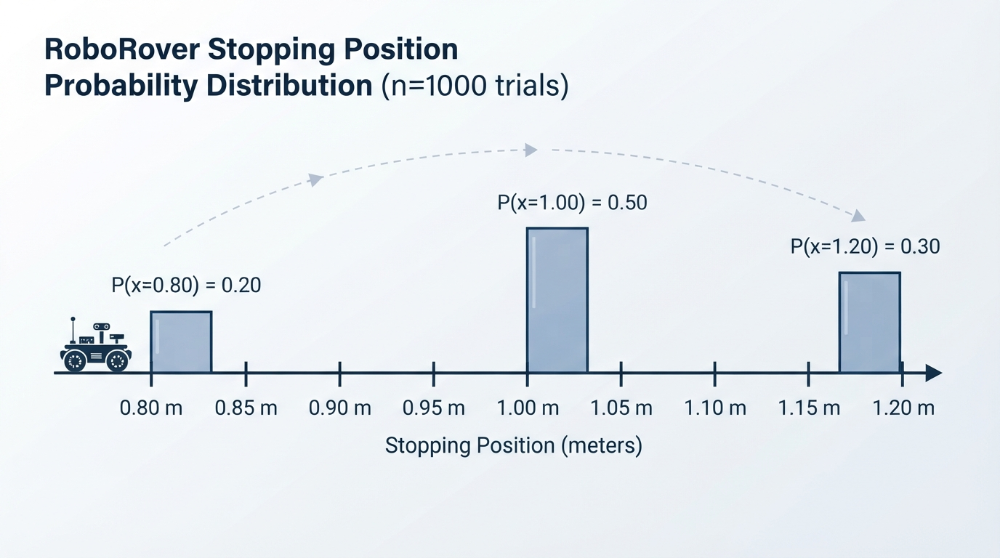
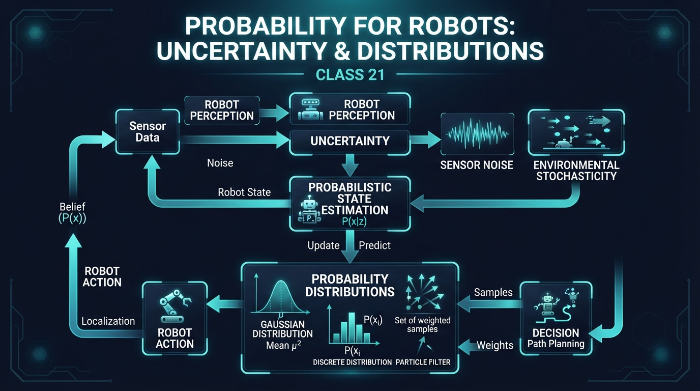
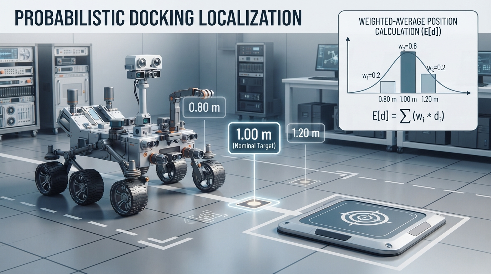
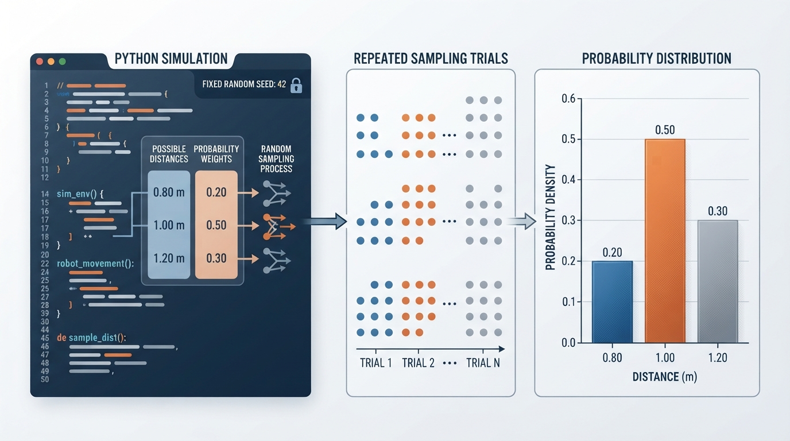
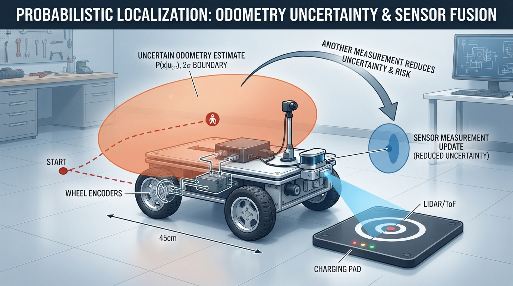

# Class 21: Probability for Robots

## Where We Are in the Robotics Journey

RoboRover has learned how to estimate its movement using **odometry**: it counts wheel rotation and converts that count into distance and turning.

But odometry is never perfectly reliable. A wheel may slip on dust. The measured wheel diameter may be slightly wrong. The floor may be uneven. Two journeys that receive the same motor command may not end at exactly the same place.

In previous classes, we often wrote an estimate such as:

\[
\text{RoboRover moved } 1.00\ \text{m}
\]

Today we will improve that statement:

\[
\text{RoboRover probably moved close to }1.00\ \text{m, but several distances are possible.}
\]

That is the beginning of **probabilistic robotics**: representing uncertainty with numbers instead of pretending every measurement is exact.

In the next class, **Sensor Noise**, we will study one important source of uncertainty: sensors that report slightly different values even when the world has not changed.

## Today We Will Learn

By the end of this class, you should be able to:

- explain why robots need probability;
- distinguish an outcome, an event, and a probability distribution;
- read a simple discrete distribution;
- calculate a weighted average, called an expected value;
- describe uncertainty using spread;
- simulate repeated robot movements in Python;
- explain why a probability model is useful but not automatically true.

## 2-Minute Recap

Odometry estimates motion from wheel movement.

For a simple wheeled robot, distance can be estimated from wheel circumference:

\[
d = N C
\]

where:

- \(d\) is estimated distance in metres \((\text{m})\);
- \(N\) is the number of wheel rotations;
- \(C\) is wheel circumference in metres \((\text{m})\).

The circumference is:

\[
C = \pi D
\]

where \(D\) is wheel diameter in metres.

This calculation gives a useful estimate. It does not guarantee the true distance because the wheel may slip, the diameter may be mismeasured, or the floor may change the motion.

Today we will treat the result not as one certain number, but as a collection of possible results with different likelihoods.

## The Big Idea




**Figure:** The bars show the relative likelihood of each possible travel distance, not three simultaneous robot positions.

Imagine RoboRover is commanded to drive from a blue starting line to a red marker exactly \(1.00\ \text{m}\) away.

On a clean, dry floor, it might travel:

- \(0.80\ \text{m}\) if its wheels slip;
- \(1.00\ \text{m}\) if the odometry is accurate;
- \(1.20\ \text{m}\) if the measured wheel size or motion calibration causes an overshoot.

A probability model assigns a likelihood to each possibility.

For example:

| Actual distance | Probability |
|---:|---:|
| \(0.80\ \text{m}\) | \(0.20\) |
| \(1.00\ \text{m}\) | \(0.50\) |
| \(1.20\ \text{m}\) | \(0.30\) |

The probabilities add to 1:

\[
0.20 + 0.50 + 0.30 = 1.00
\]

This three-distance table is a deliberately **discretized model**. Physical distance is usually continuous: a real robot may stop at many intermediate values, such as \(0.93\ \text{m}\) or \(1.07\ \text{m}\). The table groups or approximates those possibilities into three representative outcomes so that we can calculate with them easily.

This does not mean RoboRover travels all three distances at once. It means that before observing the result, we describe three possible outcomes and how plausible each one is according to our model.

A distribution is like a probability-shaped map of uncertainty.

## See It in Your Head

### AI-Generated Engineering Visual · Professor OS



**How to read this visual:** Trace the signal or idea from left to right. Match each block to the lesson explanation, then predict what would change if one block produced a wrong value.


Picture three vertical bars above a number line:

```text
Probability
0.50 |                 █
0.40 |                 █
0.30 |                 █       █
0.20 |       █         █       █
0.10 |       █         █       █
     +--------------------------------
          0.80 m    1.00 m    1.20 m
```

The tallest bar is at \(1.00\ \text{m}\), so that is the most likely result.

The bars do not show where RoboRover is currently located. They show our uncertainty before the movement is observed.

An illustrator could show:

1. RoboRover at a starting line.
2. Three faint possible stopping positions.
3. A short stopping position at \(0.80\ \text{m}\), a central one at \(1.00\ \text{m}\), and a long one at \(1.20\ \text{m}\).
4. Bar heights beneath the positions representing their probabilities.

## Core Concept

### Outcomes and events

An **outcome** is one possible result.

For the movement example, \(1.00\ \text{m}\) is an outcome.

An **event** is a collection of outcomes that we care about. For example:

> “RoboRover travels at least \(1.00\ \text{m}\).”

“At least \(1.00\ \text{m}\)” includes the boundary value \(1.00\ \text{m}\), as well as values greater than \(1.00\ \text{m}\). In our model, that event includes \(1.00\ \text{m}\) and \(1.20\ \text{m}\). Its probability is:

\[
P(d \geq 1.00\ \text{m}) = 0.50 + 0.30 = 0.80
\]

The symbol \(P(\cdot)\) means “the probability of.”

### Distributions

A **probability distribution** describes how probability is assigned to possible outcomes.

There are two useful beginner-level types:

- A **discrete distribution** lists separate outcomes, such as \(0.80\ \text{m}\), \(1.00\ \text{m}\), and \(1.20\ \text{m}\).
- A **continuous distribution** describes values along a continuous range, such as every distance between \(0.80\ \text{m}\) and \(1.20\ \text{m}\).

Today’s main example is discrete because it is easy to calculate and draw. It is a simplified, discretized representation of a physically continuous quantity. Real robot quantities such as distance, angle, and temperature are often modeled as continuous.

### Probability is not confidence in a single robot

If we say there is a \(0.50\) probability of \(1.00\ \text{m}\), we are not saying RoboRover is “halfway certain.” We are describing how often that outcome is expected across repeated comparable trials, or how plausible it is under a chosen model.

The model must match the situation. A distribution measured on a smooth laboratory floor may be poor on carpet.

## Math Without Fear

### Expected value

The **expected value** is a probability-weighted average. It is not necessarily an outcome that will actually occur.

For possible distances \(d_i\) and probabilities \(p_i\):

\[
E[d] = \sum_i p_i d_i
\]

where:

- \(E[d]\) is the expected distance, in metres \((\text{m})\);
- \(d_i\) is the \(i\)-th possible distance, in metres;
- \(p_i\) is the probability of that distance;
- \(\sum_i\) means “add all the terms.”

The probabilities must add to 1.

### Spread

Two robots could have the same expected distance but different reliability.

A simple measure of spread is the **standard deviation**, written \(\sigma\). A larger \(\sigma\) means the outcomes are more widely scattered around the expected value.

For a discrete distribution:

\[
\sigma =
\sqrt{\sum_i p_i(d_i-\mu)^2}
\]

where:

- \(\sigma\) is standard deviation, in metres \((\text{m})\);
- \(\mu\) is the expected distance, in metres;
- \(d_i\) is one possible distance, in metres;
- \(p_i\) is its probability.

The squared quantity \((d_i-\mu)^2\) has units of \(\text{m}^2\). Taking the square root returns the standard deviation to metres.

You do not need to memorize this equation yet. The important idea is:

- expected value tells us the center;
- standard deviation tells us how spread out the results are.

Standard deviation is a model-dependent measure of spread. It does not guarantee that most outcomes lie within one standard deviation of the expected value.

## Worked Robotics Example




**Figure:** The expected distance is a weighted average of possible outcomes; it describes the distribution's center, not a guaranteed stopping point.

RoboRover uses odometry to drive toward a charging pad. Based on repeated tests, the engineering team uses this distribution:

| Distance traveled \(d_i\) | Probability \(p_i\) |
|---:|---:|
| \(0.80\ \text{m}\) | \(0.20\) |
| \(1.00\ \text{m}\) | \(0.50\) |
| \(1.20\ \text{m}\) | \(0.30\) |

First calculate the expected distance:

\[
E[d]
=
(0.20)(0.80\ \text{m})
+
(0.50)(1.00\ \text{m})
+
(0.30)(1.20\ \text{m})
\]

\[
E[d] = 0.16\ \text{m} + 0.50\ \text{m} + 0.36\ \text{m}
\]

\[
E[d] = 1.02\ \text{m}
\]

The expected distance is \(1.02\ \text{m}\).

Now calculate the standard deviation. The squared differences from \(1.02\ \text{m}\) are:

\[
(0.80-1.02)^2 = 0.0484\ \text{m}^2
\]

\[
(1.00-1.02)^2 = 0.0004\ \text{m}^2
\]

\[
(1.20-1.02)^2 = 0.0324\ \text{m}^2
\]

Weighting them by probability:

\[
\sigma^2
=
(0.20)(0.0484)
+
(0.50)(0.0004)
+
(0.30)(0.0324)
\]

\[
\sigma^2 = 0.0196\ \text{m}^2
\]

Therefore:

\[
\sigma = \sqrt{0.0196\ \text{m}^2}
= 0.14\ \text{m}
\]

Interpretation:

- the expected travel distance is \(1.02\ \text{m}\);
- the model-dependent typical spread is \(0.14\ \text{m}\), or \(14\ \text{cm}\);
- the most likely single result is \(1.00\ \text{m}\);
- the expected value \(1.02\ \text{m}\) is not one of the listed outcomes;
- the standard deviation is not a guarantee that most individual results will fall within \(0.14\ \text{m}\) of the expected value.

This model warns the engineer that aiming for a charging pad only a few centimetres wide may be risky without another measurement or correction.

## Python Lab




**Figure:** A simulation draws repeated outcomes from a modeled distribution so the theoretical pattern can be compared with sampled trials.

This program simulates repeated RoboRover drives using the three-outcome distribution. It prints the theoretical expected value and standard deviation, estimates the distribution from simulated trials, and draws a grouped bar chart comparing theoretical probabilities with simulated relative frequencies.

Before running it, predict:

1. Which distance will have the tallest theoretical bar?
2. Will the simulated average be exactly \(1.02\ \text{m}\)?
3. Will the simulated average usually become closer to \(1.02\ \text{m}\) if we increase the number of trials?

```python
import random
import math
import matplotlib.pyplot as plt

# Possible distances in metres.
distances = [0.80, 1.00, 1.20]

# Probabilities for the corresponding distances.
probabilities = [0.20, 0.50, 0.30]

# Calculate the theoretical expected value.
expected_distance = sum(
    distance * probability
    for distance, probability in zip(distances, probabilities)
)

# Calculate the theoretical variance and standard deviation.
variance = sum(
    probability * (distance - expected_distance) ** 2
    for distance, probability in zip(distances, probabilities)
)
standard_deviation = math.sqrt(variance)

# Use a fixed seed so this experiment is repeatable.
random.seed(21)

number_of_trials = 5000
trials = random.choices(
    distances,
    weights=probabilities,
    k=number_of_trials
)

# Count how often each outcome appeared.
counts = []
for distance in distances:
    counts.append(trials.count(distance))

# Convert counts into simulated relative frequencies.
simulated_frequencies = [
    count / number_of_trials
    for count in counts
]

simulated_average = sum(trials) / number_of_trials

print("Theoretical expected distance: {:.3f} m".format(expected_distance))
print("Theoretical standard deviation: {:.3f} m".format(
    standard_deviation
))
print("Simulated average distance: {:.3f} m".format(simulated_average))
print("Counts for 0.80 m, 1.00 m, 1.20 m:", counts)
print("Simulated relative frequencies:", [
    "{:.3f}".format(frequency)
    for frequency in simulated_frequencies
])

# These assertions verify exact claims about the model and program setup.
assert abs(expected_distance - 1.02) < 1e-12
assert abs(standard_deviation - 0.14) < 1e-12
assert len(trials) == number_of_trials
assert sum(counts) == number_of_trials
assert abs(sum(probabilities) - 1.0) < 1e-12
assert abs(sum(simulated_frequencies) - 1.0) < 1e-12

# Plot theoretical probabilities and simulated relative frequencies
# as separate, directly labeled series.
positions = list(range(len(distances)))
bar_width = 0.36

plt.bar(
    [position - bar_width / 2 for position in positions],
    probabilities,
    width=bar_width,
    color="steelblue",
    hatch="//",
    label="Theoretical probability"
)
plt.bar(
    [position + bar_width / 2 for position in positions],
    simulated_frequencies,
    width=bar_width,
    color="white",
    edgecolor="darkorange",
    hatch="..",
    label="Simulated relative frequency"
)

plt.xticks(positions, ["{:.2f} m".format(distance) for distance in distances])
plt.ylim(0, 0.60)
plt.xlabel("Distance traveled")
plt.ylabel("Probability or relative frequency")
plt.title("Theoretical probabilities and simulated frequencies")
plt.legend()
plt.grid(axis="y", alpha=0.3)
plt.show()
```

Important lines:

- `distances` stores the possible outcomes.
- `probabilities` stores their likelihoods in the same order.
- `random.choices` selects repeated outcomes using weighted probabilities.
- `expected_distance` calculates the weighted average.
- `counts` records how many times each outcome appeared.
- `simulated_frequencies` converts those counts into observed relative frequencies.
- `assert` checks exact relationships that should always be true.
- The first bar series displays the theoretical probability mass.
- The second bar series displays the empirical, or observed, relative frequencies from the sampled trials.
- Different hatch patterns and a legend distinguish the two quantities without relying on color alone.

The simulated average will vary because random sampling varies. The theoretical values are the model’s values; the simulation is an experiment using that model. With a finite number of trials, the simulated relative frequencies will generally be close to, but not exactly equal to, the theoretical probabilities.

## Mini Simulation or Game

### RoboRover’s landing-zone game

Draw a line on paper with three landing zones:

- Zone A: \(0.80\ \text{m}\)
- Zone B: \(1.00\ \text{m}\)
- Zone C: \(1.20\ \text{m}\)

Assign the probabilities \(0.20\), \(0.50\), and \(0.30\).

Before each trial, predict the landing zone. Then use a random number from 0 to 99:

- 0–19 means \(0.80\ \text{m}\);
- 20–69 means \(1.00\ \text{m}\);
- 70–99 means \(1.20\ \text{m}\).

Record 20 trials.

Then calculate:

\[
\text{observed frequency}
=
\frac{\text{number of times an outcome occurred}}
{\text{number of trials}}
\]

Your frequencies may not equal the model probabilities exactly. That is normal. With only 20 trials, chance causes noticeable variation. Try 100 trials and compare.

This activity demonstrates a central probability idea:

> A probability describes a long-run pattern, not a promise about the next individual trial.

## What Should Happen?

Before running the Python program, your predictions should be:

1. The \(1.00\ \text{m}\) theoretical-probability bar is tallest because its probability is \(0.50\).
2. The simulated average is unlikely to be exactly \(1.02\ \text{m}\).
3. With more trials, the simulated average will generally tend to get closer to \(1.02\ \text{m}\), although it may not improve smoothly on every single increase.

The grouped chart displays two related but different quantities:

- the theoretical probability mass bars have heights exactly \(0.20\), \(0.50\), and \(0.30\);
- the simulated relative-frequency bars are calculated from the sampled counts and can change if the seed or trial count changes.

The simulated frequencies should generally become more representative of the theoretical probabilities as the number of trials increases, but finite samples can still fluctuate.

## Common Mistakes

### Mistake 1: Treating the expected value as a guaranteed result

An expected distance of \(1.02\ \text{m}\) does not mean every drive travels \(1.02\ \text{m}\). It is an average predicted by the model.

### Mistake 2: Forgetting that probabilities must add to 1

A valid complete distribution must account for all possible outcomes. If probabilities add to \(1.3\), something is wrong. If they add to \(0.7\), some possibility has been omitted.

### Mistake 3: Confusing likely with certain

A \(0.50\) probability is the most likely outcome in this example, but it still occurs only about half the time in the long run.

### Mistake 4: Assuming a distribution is automatically correct

A neat graph can still describe the wrong situation. If the floor changes from smooth tile to thick carpet, the measured distribution may change.

### Mistake 5: Ignoring bias

Suppose every wheel is slightly larger than the value used in the odometry calculation. RoboRover may consistently travel farther than expected. This is **bias**, a systematic error. Random probability alone cannot repair a badly calibrated robot.

### Mistake 6: Treating repeated trials as perfectly independent

One trial may affect the next. A warm motor, a patch of dust, or a battery voltage change can make several consecutive results similar. Independence is an assumption, not a guarantee.

## Try It Yourself

### Challenge: Choose a safer approach to a charging pad

RoboRover must stop near a charging pad centered at \(1.00\ \text{m}\). Its current distribution is:

| Distance | Probability |
|---:|---:|
| \(0.80\ \text{m}\) | \(0.20\) |
| \(1.00\ \text{m}\) | \(0.50\) |
| \(1.20\ \text{m}\) | \(0.30\) |

Calculate:

1. The probability that RoboRover travels at least \(1.00\ \text{m}\).
2. The probability that it travels more than \(1.00\ \text{m}\).
3. Whether traveling at least \(1.00\ \text{m}\) is more likely than traveling less than \(1.00\ \text{m}\).

Then explain, in words, why a second sensor measurement near the charging pad could be valuable.

**Optional extension:** Change the probabilities to represent a slippery floor. For example, make short travel more common. Recalculate the expected distance and standard deviation. Which quantity changes more: the center, the spread, or both?

### Worked answer

1. “At least \(1.00\ \text{m}\)” includes \(1.00\ \text{m}\) and \(1.20\ \text{m}\):

   \[
   P(d \geq 1.00\ \text{m}) = 0.50 + 0.30 = 0.80
   \]

2. “More than \(1.00\ \text{m}\)” excludes the boundary value \(1.00\ \text{m}\), so only \(1.20\ \text{m}\) counts:

   \[
   P(d > 1.00\ \text{m}) = 0.30
   \]

3. Traveling less than \(1.00\ \text{m}\) means traveling \(0.80\ \text{m}\), so:

   \[
   P(d < 1.00\ \text{m}) = 0.20
   \]

   Therefore, traveling at least \(1.00\ \text{m}\) is more likely: \(0.80 > 0.20\).

A second sensor measurement could provide information about the rover’s actual position near the charging pad. It could help the robot correct an odometry error before stopping, reducing the risk of stopping too far away or overshooting.

## Quick Quiz

1. What does a probability distribution describe?

2. RoboRover has possible travel distances of \(0.5\ \text{m}\) and \(1.0\ \text{m}\), each with probability \(0.5\). What is the expected distance?

3. In the worked example, what is the probability that RoboRover travels more than \(1.00\ \text{m}\)?

4. Why can a simulated average differ from the theoretical expected value?

## Answers

1. A probability distribution assigns likelihoods to possible outcomes.

2. The expected distance is:

\[
(0.5)(0.5\ \text{m}) + (0.5)(1.0\ \text{m})
= 0.75\ \text{m}
\]

3. Traveling more than \(1.00\ \text{m}\) means traveling \(1.20\ \text{m}\), so the probability is \(0.30\), or \(30\%\).

4. A simulation uses a finite number of random trials. Chance causes the observed frequencies and average to vary from the theoretical values.

## Real Robot Connection




**Figure:** A robot can use uncertainty to decide when wheel odometry is not reliable enough and another measurement is needed.

Probability allows a robot to represent uncertainty explicitly.

After odometry, RoboRover might not store only:

```text
distance = 1.00 m
```

It might store something closer to:

```text
likely distance: 1.00 m
possible spread: about 0.14 m
```

That information can influence later decisions. For example, RoboRover may decide that its position is uncertain enough to slow down, take another measurement, or avoid relying on the wheel estimate alone.

This class does not yet teach RoboRover how to combine many sensor readings or maintain a full position estimate. Those are later topics. Today’s foundation is simpler:

> A robot can represent several possible states, each with a different probability.

The practical engineering caveat is that the probability model must be tested under conditions similar to real operation. A model created from ten smooth-floor trials may fail on a ramp, carpet, or dusty surface.

Next class, we will examine **sensor noise**: random variation in sensor readings. We will see how repeated readings can form their own distributions and why calibration and filtering matter.

## Vocabulary

- **Probability:** A numerical description of how likely an outcome or event is.
- **Outcome:** One possible result of an experiment or robot action.
- **Event:** A group of outcomes described by a condition of interest.
- **Probability distribution:** A description assigning probabilities to possible outcomes.
- **Discrete distribution:** A distribution with separate listed outcomes.
- **Continuous distribution:** A distribution over a continuous range of possible values.
- **Expected value:** A probability-weighted average of possible outcomes.
- **Mean:** A common name for an average; in this class, the expected value is the model-based average.
- **Standard deviation:** A model-dependent measure of the spread of values around the expected value.
- **Variance:** The square of the standard deviation; its units are squared.
- **Uncertainty:** Limited knowledge about a quantity, condition, or future outcome.
- **Bias:** A systematic tendency for measurements or results to be too high or too low.
- **Trial:** One run of an experiment or one robot attempt.
- **Model:** A simplified mathematical description of a real system.

## Further Learning

Useful search terms and activities:

- “probability distributions for beginners”
- “expected value and standard deviation”
- “histogram versus probability distribution”
- “robot odometry uncertainty experiment”
- “Monte Carlo simulation introduction”

A good follow-up experiment is to repeat RoboRover’s movement test on two surfaces, such as smooth card and fabric. Keep the motor command the same and compare the two distributions.

## Next Class

In **Class 22: Sensor Noise**, we will connect probability to real sensor readings.

RoboRover will measure the same object repeatedly. The object will remain still, but the readings may vary because of electrical effects, lighting, reflections, resolution limits, and other causes. We will use distributions to describe those variations and learn why one sensor reading should not automatically be treated as perfect truth.
