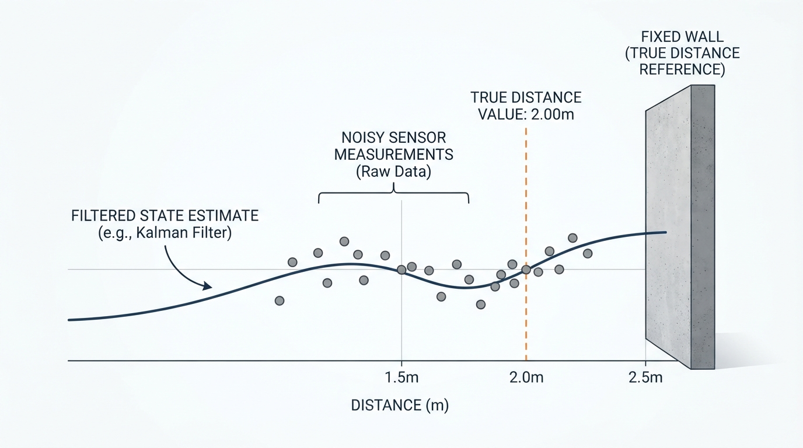
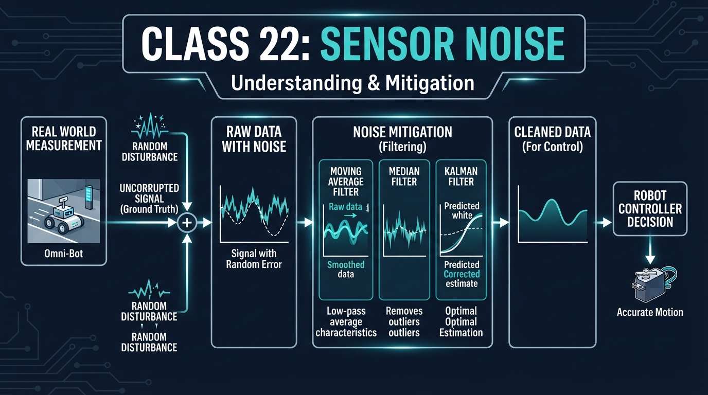
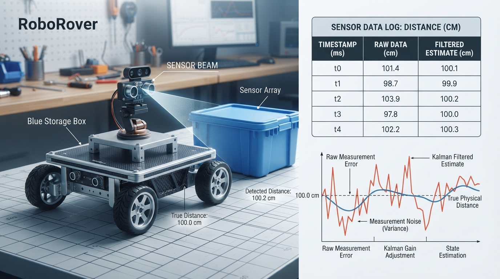
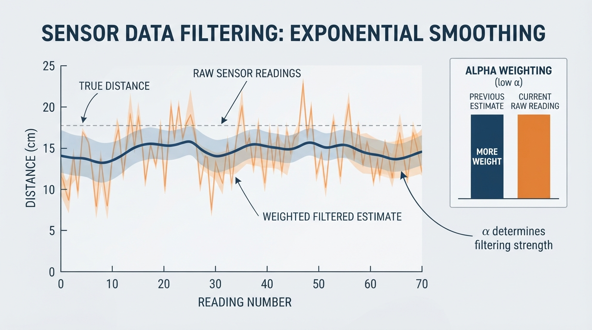

# Class 22: Sensor Noise

## Where We Are in the Robotics Journey

RoboRover has learned that robots do not receive perfect information. In the previous class, **Probability for Robots**, we described uncertain events and measurements using ideas such as average value, spread, and likelihood.

Today we apply those ideas to a real robot problem:

> RoboRover measures the same object several times, but the readings do not agree exactly.

This disagreement is called **sensor noise**. We will learn how to recognize random error and how a filter can make a measurement more useful without pretending that the sensor is perfect.

In the next class, **Moving Average Filters**, we will study one particular filter in detail. Today gives us the reason filters are needed and introduces the basic trade-off: smoother information versus slower response.

## Today We Will Learn

By the end of this class, you should be able to:

- explain sensor noise using the idea of random error;
- distinguish random error from a consistent bias;
- calculate measurement error and the average of several readings;
- explain why filtering can make a robot’s estimate more stable;
- describe two costs of filtering: delay and lost detail;
- explain conditions in which averaging or smoothing may fail;
- run a small Python simulation of noisy measurements and a filtered estimate.

## 2-Minute Recap

Imagine RoboRover is 100 centimeters from a cardboard wall. Its distance sensor reports:

- 98 cm
- 103 cm
- 101 cm
- 97 cm
- 100 cm

The wall did not rapidly move back and forth. The sensor is imperfect.

In the previous class, we used the idea of a **random variable**: a quantity whose value is uncertain before it is measured. A sensor reading can be treated this way. The actual distance may be nearly fixed, but the measured value varies.

A useful first question is:

> Are the errors scattered around the truth, or are they consistently pulled in one direction?

Scattered errors suggest random noise. A consistent shift suggests bias or calibration error. A filter can often reduce the visible effect of random noise, but it cannot automatically remove a badly calibrated sensor.

## The Big Idea




**Figure:** The wall is stationary, but individual measurements vary around the true distance; filtering produces a steadier estimate.

A sensor does not hand the robot “the truth.” It hands the robot a measurement that is related to the truth.

A simplified measurement model is:

\[
z = x + e
\]

where:

- \(z\) is the measured value, in the sensor’s units;
- \(x\) is the actual physical value, such as distance in centimeters;
- \(e\) is the measurement error, in the same units as \(x\).

This model assumes that the error is represented by \(e\). A more complete introductory model can include a systematic bias:

\[
z = x + b + e
\]

where \(b\) is a bias term. The simpler equation \(z=x+e\) is the special case in which \(b=0\), or in which bias has already been corrected.

For example, if the real distance is \(x = 100\ \text{cm}\) and the sensor reports \(z = 103\ \text{cm}\), then:

\[
e = z - x = 103\ \text{cm} - 100\ \text{cm} = 3\ \text{cm}
\]

when the bias term is being omitted from the simplified model.

The error is not necessarily the robot’s fault. It may come from electronic interference, surface texture, changing light, vibration, rounding, or limitations in the sensing method.

A robot can still operate successfully if its software understands that measurements are uncertain.

When filtering is first introduced, remember an important limitation: averaging and smoothing work best when errors are reasonably random, not strongly correlated, and the true value remains nearly constant. They can fail or become misleading when errors are correlated over time, depend on the robot’s motion or environment, are caused by repeatable vibration or reflections, or are dominated by outliers. Filtering also does not automatically remove bias.

## See It in Your Head

### AI-Generated Engineering Visual · Professor OS



**How to read this visual:** Trace the signal from the physical target and sensor on the left through noisy measurements and the filtering block to the robot’s estimate and decision on the right. The diagram shows why a smoother signal can still be delayed or biased.


RoboRover is trying to stop 50 cm from a blue storage box. It repeatedly measures the front distance:

| Reading number | Sensor reading |
|---:|---:|
| 1 | 49 cm |
| 2 | 52 cm |
| 3 | 48 cm |
| 4 | 51 cm |
| 5 | 50 cm |

The readings jump around, but none is wildly unreasonable. If RoboRover changed its motor command dramatically after every reading, it might move forward, backward, forward, and backward even though the box had not moved.

Now imagine placing a transparent sheet over the readings and drawing a gentler curve through them. That curve is the basic intuition behind filtering: do not allow every tiny measurement fluctuation to control the robot immediately.

Filtering does not mean “ignore the sensor.” It means combine or transform measurements so that random variation has less influence on the robot’s working estimate.

## Core Concept

### Random error

**Random error** is measurement variation that changes from one reading to another in an unpredictable way.

Suppose the true distance is \(100\ \text{cm}\):

- 98 cm has error \(-2\ \text{cm}\);
- 103 cm has error \(+3\ \text{cm}\);
- 101 cm has error \(+1\ \text{cm}\).

The errors have different signs and sizes. If enough readings are taken under stable conditions, positive and negative errors may partly cancel when averaged.

Random error does not mean that every possible value is equally likely. A sensor might usually be close to the truth and only occasionally produce a larger error.

However, averaging is not guaranteed to help. If an error persists across many readings, follows the robot’s motion, comes from a repeating vibration, or contains large outliers, the errors may not cancel. A changing target can also make an average represent no actual state that the robot occupied.

### Bias

A **bias** is a consistent error in one direction.

Suppose the actual distance is 100 cm, but a poorly calibrated sensor usually reports about 106 cm. The sensor has a positive bias of approximately 6 cm.

A filter may make those readings very smooth:

\[
106,\ 105,\ 106,\ 107,\ 106
\]

but smoothness does not make them correct. The filter has reduced random variation while preserving the wrong central value.

This is a practical engineering lesson:

> A smooth measurement can still be inaccurate.

Calibration and filtering solve different problems. Calibration attempts to correct systematic error. Filtering attempts to reduce the effect of variation, especially random variation.

### Filtering

A **filter** transforms sensor data into a more useful signal. In robotics, the output is often an estimate used by decision-making or control software.

A filter may:

- reduce rapid fluctuations;
- make a graph easier to interpret;
- prevent motors from reacting to every tiny change;
- introduce delay;
- hide a real rapid change if designed poorly.

There are many filters. Today we use a simple weighted filter as an illustration:

\[
y_k = \alpha z_k + (1-\alpha)y_{k-1}
\]

where:

- \(y_k\) is the filtered value at reading \(k\), in centimeters;
- \(z_k\) is the newest raw measurement at reading \(k\), in centimeters;
- \(y_{k-1}\) is the previous filtered value, in centimeters;
- \(\alpha\) is a unitless weight between 0 and 1.

This is a **first-order exponential smoothing filter**, also called a **one-pole low-pass filter**. We use the simpler phrase “weighted filter” because it is appropriate for this class.

A larger \(\alpha\) trusts the newest reading more. A smaller \(\alpha\) produces stronger smoothing but usually more delay.

This filter is useful only under suitable conditions. Correlated errors, motion-dependent errors, environmental changes, and outliers can pass through the filter or create misleading estimates. The filter also cannot correct a constant bias by itself.

This is not the moving average filter we will study next class. It is a compact example of the general filtering idea.

## Math Without Fear

Assume RoboRover’s true distance from a wall is \(100\ \text{cm}\), and it records:

\[
z_1=98\ \text{cm},\quad
z_2=103\ \text{cm},\quad
z_3=101\ \text{cm},\quad
z_4=99\ \text{cm},\quad
z_5=100\ \text{cm}
\]

The error for a reading is:

\[
e_k = z_k - x
\]

where:

- \(e_k\) is the error of reading \(k\), in centimeters;
- \(z_k\) is the measured distance, in centimeters;
- \(x\) is the true distance, in centimeters.

The five errors are:

\[
-2,\ 3,\ 1,\ -1,\ 0\ \text{cm}
\]

The arithmetic mean of the readings is:

\[
\bar{z} =
\frac{98+103+101+99+100}{5}\ \text{cm}
=
\frac{501}{5}\ \text{cm}
=
100.2\ \text{cm}
\]

where:

- \(\bar{z}\) is the average measured distance, in centimeters;
- the numerator adds the five readings, in centimeters;
- \(5\) is the number of readings.

The average is \(100.2\ \text{cm}\), which is \(0.2\ \text{cm}\) above the assumed true distance. In this small example, positive and negative errors mostly cancel.

Now use the weighted filter with \(\alpha=0.4\), starting with \(y_1=z_1=98\ \text{cm}\):

\[
y_1=98.0\ \text{cm}
\]

\[
y_2 = 0.4(103) + 0.6(98) = 100.0\ \text{cm}
\]

\[
y_3 = 0.4(101) + 0.6(100) = 100.4\ \text{cm}
\]

\[
y_4 = 0.4(99) + 0.6(100.4) = 99.84\ \text{cm}
\]

\[
y_5 = 0.4(100) + 0.6(99.84) = 99.904\ \text{cm}
\]

The complete calculation is:

| Reading \(k\) | Raw measurement \(z_k\) (cm) | Filtered value \(y_k\) (cm) |
|---:|---:|---:|
| 1 | 98 | 98.000 |
| 2 | 103 | 100.000 |
| 3 | 101 | 100.400 |
| 4 | 99 | 99.840 |
| 5 | 100 | 99.904 |

The filtered values move less sharply than the raw readings. However, this filter is still reacting to new data gradually. That gradual response is useful for noisy measurements but can be dangerous if the target suddenly moves or RoboRover approaches the wall rapidly.

### Student checkpoint

Using \(\alpha=0.4\), \(z_2=103\ \text{cm}\), and \(y_1=98\ \text{cm}\), calculate \(y_2\) before reading on:

\[
y_2 = 0.4(103) + 0.6(98) = \boxed{100.0\ \text{cm}}
\]

The newest reading contributes \(41.2\ \text{cm}\) to the weighted sum, and the previous filtered estimate contributes \(58.8\ \text{cm}\).

The assumed true value is available here because this is a teaching example and a controlled simulation. A real robot normally does not know the exact true distance. Engineers may use a carefully measured reference, a higher-quality instrument, or repeated experiments to evaluate sensor error, but the robot’s operating software generally has to estimate the state without being given the truth.

## Worked Robotics Example




**Figure:** RoboRover’s five measurements vary around 100 cm; averaging and filtering reduce the effect of random fluctuations.

RoboRover uses its front distance sensor to decide whether it is getting close to a box. The box is actually 100 cm away during five measurements. The known 100 cm value is available for this worked example so that we can calculate errors; a normal robot would not receive that value directly.

| Reading | Raw measurement \(z_k\) | Error \(e_k=z_k-100\) | Filtered value \(y_k\), \(\alpha=0.4\) |
|---:|---:|---:|---:|
| 1 | 98 cm | −2 cm | 98.000 cm |
| 2 | 103 cm | +3 cm | 100.000 cm |
| 3 | 101 cm | +1 cm | 100.400 cm |
| 4 | 99 cm | −1 cm | 99.840 cm |
| 5 | 100 cm | 0 cm | 99.904 cm |

The raw readings span from 98 cm to 103 cm, a range of 5 cm. If RoboRover used a rule such as “turn away whenever the reading is below 100 cm,” it would turn on readings 1 and 4 but not on readings 2, 3, and 5. That may create unnecessary changes in behavior near a threshold.

The average reading is \(100.2\ \text{cm}\). Its interpretation is:

> Across these five readings, the center of the measurements is close to the assumed true distance, even though individual readings are imperfect.

A filter can produce a steadier value for software that should not react to every small fluctuation. But the filter should not be treated as an oracle. If the box suddenly moves from 100 cm to 70 cm, a heavily smoothed estimate may take time to catch up.

### Engineering caveat: filter lag

Suppose a safety system needs to detect a rapidly approaching object. A very smooth filter may delay the warning. In that situation, reducing noise is valuable, but response time is also valuable.

Engineers often test filters using both:

- a steady signal with noise, to measure smoothness;
- a sudden change, to measure response delay.

A filter that looks excellent on a calm graph may perform poorly during a sudden obstacle movement.

## Python Lab




**Figure:** The simulated graph makes the filtering trade-off visible: the filtered line is smoother but does not instantly follow every raw reading.

This program does three things:

1. verifies the five-reading numerical example;
2. generates noisy measurements around a fixed distance;
3. applies a simple weighted filter and plots both signals.

It uses a fixed random seed so the simulation is repeatable. The random values are simulated sensor noise, not measurements from real hardware.

```python
import random
import matplotlib.pyplot as plt


def weighted_filter(readings, alpha):
    """Return filtered readings using first-order exponential smoothing."""
    if not 0.0 <= alpha <= 1.0:
        raise ValueError("alpha must be between 0 and 1")

    if not readings:
        return []

    filtered = [readings[0]]

    for reading in readings[1:]:
        previous = filtered[-1]
        new_value = alpha * reading + (1.0 - alpha) * previous
        filtered.append(new_value)

    return filtered


# Part 1: verify the worked numerical example.
example_readings = [98.0, 103.0, 101.0, 99.0, 100.0]
example_average = sum(example_readings) / len(example_readings)

assert abs(example_average - 100.2) < 1e-9

example_filtered = weighted_filter(example_readings, 0.4)

# The first filtered value is the first raw reading.
assert abs(example_filtered[0] - 98.0) < 1e-9

# These assertions verify all five filtering calculations.
expected_filtered = [98.0, 100.0, 100.4, 99.84, 99.904]
for actual, expected in zip(example_filtered, expected_filtered):
    assert abs(actual - expected) < 1e-9

print("Example average:", example_average, "cm")
print("Example filtered values:",
      [round(value, 3) for value in example_filtered])

# Part 2: simulate a sensor measuring a fixed 100 cm distance.
random.seed(22)

true_distance = 100.0
number_of_readings = 80
noise_standard_deviation = 4.0
alpha = 0.25

times = list(range(number_of_readings))
raw_readings = []

for unused_index in times:
    noise = random.gauss(0.0, noise_standard_deviation)
    raw_readings.append(true_distance + noise)

filtered_readings = weighted_filter(raw_readings, alpha)

assert len(raw_readings) == number_of_readings
assert len(filtered_readings) == number_of_readings

print("Simulated readings:", len(raw_readings))
print("True distance:", true_distance, "cm")
print("Filter weight alpha:", alpha)

# Part 3: draw the result.
plt.figure(figsize=(10, 5))
plt.plot(times, raw_readings, "o-", markersize=3,
         alpha=0.45, label="raw sensor readings")
plt.plot(times, filtered_readings, linewidth=2,
         label="weighted filtered estimate")
plt.axhline(true_distance, color="black", linestyle="--",
            label="true distance")

plt.xlabel("Reading number")
plt.ylabel("Distance (cm)")
plt.title("RoboRover: noisy distance measurements")
plt.legend()
plt.grid(True, alpha=0.3)
plt.tight_layout()
plt.show()
```

The important calculation is:

```python
alpha = 0.25
reading = 101.0
previous = 100.0
new_value = alpha * reading + (1.0 - alpha) * previous

assert abs(new_value - 100.25) < 1e-9
print("Filtered value:", new_value)
```

This is a runnable fragment: all three variables are assigned before they are used. It combines the newest reading with the previous filtered estimate. Because `alpha` is `0.25`, the newest measurement receives one quarter of the weight and the previous estimate receives three quarters.

The assertion verifies the exact result:

\[
0.25(101.0)+0.75(100.0)=100.25
\]

The assertion lines in the full program verify the exact average and all five filter values from the worked example rather than relying on a printed claim.

## Mini Simulation or Game

### The “trust the spike?” game

Before running the Python program, predict what the graph will look like.

1. The true distance is fixed at 100 cm.
2. The raw readings contain random noise.
3. The filter weight is \(\alpha=0.25\).
4. A single raw reading may jump noticeably above or below 100 cm.

**Predict before you run it:**

- Which line will look more jagged: the raw line or the filtered line?
- Which line will respond less dramatically to one unusual reading?
- Will the filtered line be exactly 100 cm at every reading?
- If the true distance suddenly changed, would the filtered line respond instantly?

Now run the program and inspect the graph. The nearby generated graph, `inline_03.png`, illustrates this same comparison: the raw trace varies more quickly, while the filtered estimate changes more gradually.

For an extra experiment, change:

```python
alpha = 0.25
```

to:

```python
alpha = 0.75
```

Predict again before running it. The filtered line should generally follow new readings more quickly, but it should also show more of their variation. Then try:

```python
alpha = 0.05
```

This should create stronger smoothing and more lag.

The experiment illustrates an engineering trade-off rather than a universal rule:

- high \(\alpha\): faster response, less smoothing;
- low \(\alpha\): slower response, more smoothing.

## What Should Happen?

You should observe that:

- the raw readings jump around the true-distance line;
- the filtered estimate is smoother than the raw signal;
- a single noisy reading has less influence when \(\alpha\) is small;
- the filtered estimate is not guaranteed to equal the true value;
- changing \(\alpha\) changes the balance between smoothness and responsiveness.

The exact random trace is controlled by the program’s seed, but the lesson is not that one particular graph shape is always correct. Different noise sequences can look different. The important behavior is the relationship between the raw signal and the filtered signal.

## Common Mistakes

### Mistake 1: treating every sensor reading as truth

A reading is evidence about the environment, not a perfect description of it. Software should consider sensor accuracy, resolution, and operating conditions.

### Mistake 2: confusing random error with bias

If all readings are shifted high, averaging or smoothing may produce a very stable wrong answer. Calibration is needed for systematic error.

### Mistake 3: making the filter too slow

A filter that removes nearly all visible variation may also hide a real change. This matters for obstacle detection, balancing, and other time-sensitive tasks.

### Mistake 4: assuming more data always solves the problem

Averaging many readings helps when the noise is reasonably random, approximately centered, and the true value stays nearly constant. It is less helpful when errors are correlated, when the object moves, when the sensor has bias, when repeatable vibration or reflections dominate, or when the environment changes during the measurements.

### Mistake 5: ignoring physical causes

Different physical causes have different signatures. Random electronic measurement noise may vary from sample to sample. Vibration can be repeatable or correlated with motor speed. Multipath reflections can produce repeatable distance errors for particular surfaces or angles. Electromagnetic interference may follow motor or power-system activity. Changing illumination can affect optical sensors systematically rather than randomly. Poor mounting can create motion-dependent errors. Software filtering cannot repair every mechanical, optical, electrical, or environmental problem.

## Try It Yourself

### Challenge: choose a filter for RoboRover

RoboRover must measure the distance to a slowly moving cardboard box. The raw sensor readings fluctuate by several centimeters.

1. Run the program with \(\alpha=0.25\).
2. Run it with \(\alpha=0.75\).
3. Compare smoothness and responsiveness.
4. Write a short recommendation: which value would you choose if the box moved slowly, and why?

Your answer should mention both:

- how much random variation remains;
- how quickly the estimate follows a real change.

**Optional extension:** modify the simulation so that the true distance changes from 100 cm to 70 cm halfway through the run. Add a second horizontal reference line or a piecewise true-distance list. Observe how the two filter settings respond differently.

## Quick Quiz

1. What is sensor noise?

2. A sensor measures a true distance of 40 cm but repeatedly reports values near 45 cm. Is this mainly random error, bias, or both?

3. In the weighted filter  
   \[
   y_k=\alpha z_k+(1-\alpha)y_{k-1},
   \]
   what generally happens when \(\alpha\) is made smaller?

4. Why can a filter be dangerous if it is made excessively smooth?

## Answers

1. Sensor noise is unwanted variation or uncertainty in measurements. It can cause repeated readings of a mostly unchanged quantity to differ.

2. This is mainly bias: the readings are consistently shifted above the true value. Random variation may also be present, but the repeated offset suggests a systematic error.

3. A smaller \(\alpha\) gives more weight to the previous filtered estimate and less to the newest reading. The result is usually smoother but slower to respond.

4. Excessive smoothing can introduce too much delay and hide a real rapid change, such as an approaching obstacle.

## Real Robot Connection

On a real RoboRover, a distance sensor might be mounted near motors, vibration sources, or a flexible panel. Even if the target is stationary, the reported distance may vary.

Different sensors and environments produce different error sources:

- ultrasonic sensors can be affected by target angle, surface shape, and multipath echoes;
- optical or time-of-flight sensors can respond to surface reflectivity, ambient illumination, and target geometry;
- electrical sensors can be affected by power fluctuations and electromagnetic interference;
- any sensor mounted on a vibrating structure can show repeatable or motion-dependent errors rather than independent random noise.

A robust engineering process would include:

1. measuring a stationary target many times;
2. examining the spread and average of the readings;
3. checking for a consistent bias;
4. checking whether errors change with motor speed, lighting, target surface, or robot motion;
5. testing the filter during both steady conditions and sudden changes;
6. choosing a filter setting that matches the robot’s task.

One possible acceptance test for a distance-estimation system is:

> With RoboRover stationary 100 cm from a specified target under specified lighting and motor conditions, at least 95% of filtered readings must lie within ±5 cm of a calibrated reference, and after a step change in target distance the estimate must enter the new ±5 cm band within 0.5 seconds.

These are example requirements, not results from the simulation. The actual limits and test conditions must be chosen for the robot’s task and verified with measurements.

For example, a slow inspection rover may value a stable distance estimate. A fast obstacle-avoidance system may need a quicker response and tolerate more noise.

Filtering is part of a larger sensing pipeline:

\[
\text{physical world}
\rightarrow
\text{sensor}
\rightarrow
\text{raw measurement}
\rightarrow
\text{filter}
\rightarrow
\text{robot decision}
\]

Each stage can introduce problems. The sensor can be noisy, the filter can lag, and the decision rule can use the estimate incorrectly. Good robotics engineering tests the entire chain.

## Vocabulary

- **Sensor noise:** unwanted variation or uncertainty in a sensor’s measurements.
- **Random error:** measurement error that varies unpredictably from reading to reading.
- **Bias:** a consistent tendency for measurements to be too high or too low.
- **Measurement:** a sensor’s numerical report about a physical quantity.
- **True value:** the physical quantity the robot is attempting to measure.
- **Filter:** a mathematical or computational process that transforms measurements to reduce unwanted variation or extract useful information.
- **Raw reading:** a measurement before filtering or other processing.
- **Filtered estimate:** a processed value used as the robot’s current working description of a quantity.
- **Filter lag:** delay caused when a filtered estimate responds gradually to a changing real value.
- **Calibration:** adjusting a sensor or its software so measurements better match known reference values.
- **Weight:** a unitless number that determines how strongly one value influences a calculation.
- **Exponential smoothing:** a filtering method in which the newest reading and the previous filtered estimate are combined with fixed weights.
- **Outlier:** a measurement that is unusually far from the other measurements and may not be well handled by a simple average.

## Further Learning

To continue building this topic, investigate these questions:

- How does repeated measurement help when errors are independent and approximately centered?
- What happens when sensor noise is not centered around zero?
- How can a robot detect that a sensor has become stuck at one value?
- Why might a robot combine two different sensors instead of filtering one sensor more aggressively?
- How can an engineer distinguish random noise from vibration that repeats with motor speed?

Useful search terms include **robotics sensor noise**, **measurement bias and calibration**, **low-pass filtering**, and **robot sensor response time**.

The next class will focus on **Moving Average Filters**, a particularly intuitive filter that uses a window of recent measurements.

## Next Class

In Class 23, RoboRover will learn the **moving average filter**.

We will:

- calculate the average of a fixed number of recent readings;
- see how changing the window size changes smoothness and delay;
- compare a short window with a long window;
- test what happens when the robot’s true environment changes.

Today’s main lesson was that noisy measurements need careful interpretation. Next class, we turn that idea into a specific, hands-on filtering method.