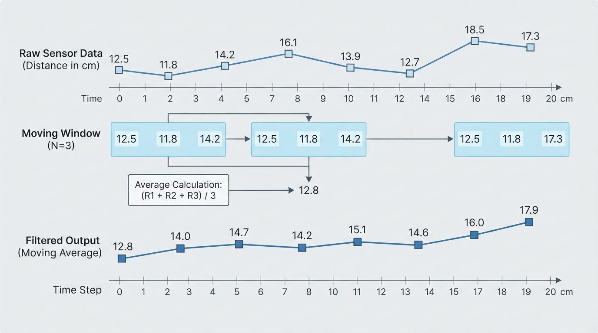
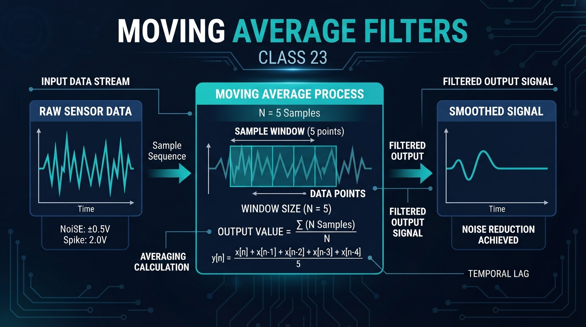
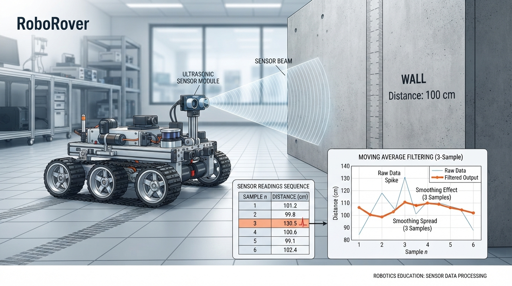
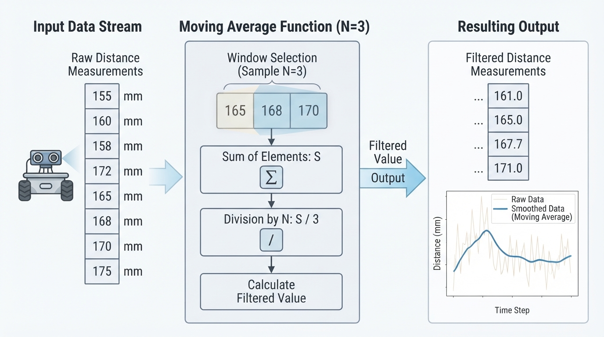

# Class 23: Moving Average Filters

## Where We Are in the Robotics Journey

In the previous class, RoboRover’s distance sensor produced **sensor noise**: small, unwanted variations in measurements even when the real distance stayed nearly constant.

For example, RoboRover might be 100 cm from a wall, but its sensor could report:

> 98 cm, 103 cm, 99 cm, 101 cm, 97 cm

The wall is not rapidly moving back and forth. The measurements are imperfect.

Today we will build a simple tool for **smoothing** those measurements: the **moving average filter**.

A moving average can make a noisy signal easier to interpret. However, smoothing always involves a trade-off. A smoother signal usually responds more slowly to real changes.

In the next class, we will preview the **Kalman filter**, which uses a model of motion and a more careful treatment of uncertainty. A moving average is much simpler, but it helps establish the central idea: do not trust one noisy measurement too quickly.

## Today We Will Learn

By the end of this class, you should be able to:

- explain what a moving average filter does;
- calculate a moving average by hand;
- choose a window size and describe its effect;
- implement a moving average in Python;
- recognize smoothing benefits and delays;
- explain why a moving average is not a complete solution for every robot sensor.

## 2-Minute Recap

A sensor measures some physical quantity, such as distance, temperature, or brightness.

Let:

- \(x_i\) be the \(i\)-th raw sensor reading;
- \(i\) be the reading number;
- the unit of \(x_i\) depend on the sensor, such as centimeters or degrees Celsius.

Sensor noise is unwanted variation in \(x_i\). It can come from electrical interference, reflections, vibration, limited resolution, or changes in the environment.

A noisy measurement is not necessarily useless. It may contain:

1. a real signal, such as RoboRover actually approaching a wall; and
2. unwanted variation, such as a brief reflection error.

The challenge is to reduce the unwanted variation without hiding important real changes.

## The Big Idea




**Figure:** The moving window drops the oldest sample, includes the newest sample, and recalculates the average.

Imagine RoboRover asking three nearby measurements:

> “How far away is the wall?”

Instead of acting on only the newest answer, RoboRover places the newest three answers in a small tray, adds them, and divides by three.

The tray then slides forward one measurement at a time:

```text
Measurements:   48   52   49   55   51
                  \  /  /  /  /
Window 1:       [48, 52, 49]       average = 49.67 cm
Window 2:           [52, 49, 55]   average = 52.00 cm
Window 3:               [49, 55, 51] average = 51.67 cm
```

This is a **moving average** because the group of measurements used for the average moves through the data.

The filter does not know which individual reading is “wrong.” It simply combines nearby readings. A single unusually high or low value has less influence than it would have by itself, although it can still affect several later averages.

A useful mental model is:

> A moving average turns a jagged measurement trace into a gentler trace by averaging neighboring samples.

It does not create new information. It combines existing measurements into a new representation that may be easier for a controller or human to use.

## See It in Your Head

### AI-Generated Engineering Visual · Professor OS



**How to read this visual:** Trace the signal or idea from left to right. Match each block to the lesson explanation, then predict what would change if one block produced a wrong value.


Picture two lines on a graph.

- The horizontal axis is time in seconds.
- The vertical axis is distance in centimeters.
- The true wall distance is a slowly descending line as RoboRover moves closer.
- The raw sensor line jumps above and below that trend.
- The filtered line follows the general trend but has fewer sharp zigzags.

Now imagine a sudden obstacle appearing closer to RoboRover.

The measured distance line may jump downward almost immediately because the distance to the nearest obstacle has decreased. The moving-average line falls more gradually because it is still including older, larger distance values.

An illustrator could show this as:

- a small rover approaching a wall;
- a sensor beam aimed at the wall;
- a scrolling row of the latest three numerical readings;
- a raw jagged graph above a smoother filtered graph;
- an arrow labeled “uses recent history.”

The important visual detail is that the filtered line should not respond instantly to a sudden change.

## Core Concept

For a window of \(N\) samples, a simple moving average is:

\[
y_i = \frac{x_i + x_{i-1} + x_{i-2} + \cdots + x_{i-N+1}}{N}
\]

where:

- \(x_i\) is the newest raw measurement;
- \(x_{i-1}\), \(x_{i-2}\), and so on are older measurements;
- \(N\) is the window size, measured in samples;
- \(y_i\) is the filtered output, with the same physical unit as \(x_i\).

If the sensor readings are in centimeters, \(y_i\) is also in centimeters. Adding measurements does not change the physical unit after division by the unitless number \(N\).

A window size of:

- \(N=1\) performs no smoothing;
- \(N=3\) averages the newest three readings;
- \(N=10\) averages the newest ten readings.

A larger window usually produces a smoother signal, but it also uses older information for longer.

### Startup behavior

At the very beginning, RoboRover may not yet have \(N\) readings. There are two common choices:

1. wait until the window is full; or
2. average the readings currently available.

For beginner software, we will use the second method. If only two readings are available and the intended window is three, the program averages those two.

This creates a useful output immediately, but it means the filter behaves slightly differently during startup. The usual delay approximation below describes a full trailing window in steady operation; startup outputs do not have that full window.

## Math Without Fear

Suppose RoboRover records these three distance measurements:

\[
48\text{ cm},\quad 52\text{ cm},\quad 49\text{ cm}
\]

With \(N=3\):

\[
y_3 = \frac{48\text{ cm} + 52\text{ cm} + 49\text{ cm}}{3}
\]

\[
y_3 = \frac{149\text{ cm}}{3}
\]

\[
y_3 \approx 49.67\text{ cm}
\]

The result is about 49.67 cm.

Now the newest measurement becomes 55 cm. The oldest value, 48 cm, leaves the window:

\[
y_4 = \frac{52\text{ cm} + 49\text{ cm} + 55\text{ cm}}{3}
\]

\[
y_4 = \frac{156\text{ cm}}{3}
= 52\text{ cm}
\]

### Interpretation

The newest raw measurement is 55 cm, but the filtered result is 52 cm. The filter does not immediately accept the entire change because two older readings are still included.

This is useful when a sensor occasionally produces a spike. It is dangerous when the environment changes quickly and RoboRover must react immediately.

### Sampling time matters

Suppose RoboRover samples at 10 readings per second. The time between samples is:

\[
\Delta t = 0.1\text{ s}
\]

For a three-sample window, the output includes the newest sample and two older samples. For a slowly changing signal and a full trailing window, the approximate steady-state group delay is:

\[
\text{delay} \approx \frac{N-1}{2}\Delta t
\]

where:

- \(N\) is the window size in samples;
- \(\Delta t\) is the time between samples in seconds.

For \(N=5\) and \(\Delta t=0.1\text{ s}\):

\[
\text{delay} \approx \frac{5-1}{2}(0.1\text{ s})
= 0.2\text{ s}
\]

This approximation applies to the steady-state group delay of a full trailing moving-average window for slowly varying signals. Startup behavior and abrupt steps do not follow this single delay exactly. A step can be spread across several outputs rather than appearing as one change after exactly 0.2 seconds.

The engineering lesson is more important than the formula:

> Larger windows can make RoboRover calmer, but they can also make it late.

## Worked Robotics Example




**Figure:** A single suspicious distance reading is reduced by averaging, but its influence remains in several later outputs.

RoboRover is traveling beside a wall. Its distance sensor reports:

| Reading number | Raw distance |
|---:|---:|
| 1 | 100 cm |
| 2 | 104 cm |
| 3 | 96 cm |
| 4 | 101 cm |
| 5 | 130 cm |
| 6 | 99 cm |
| 7 | 102 cm |

The 130 cm value is suspicious because it is much farther from the surrounding values. Perhaps the sensor briefly saw a reflective surface.

Use a three-reading moving average.

At reading 3:

\[
y_3=\frac{100+104+96}{3}\text{ cm}
=100\text{ cm}
\]

At reading 4:

\[
y_4=\frac{104+96+101}{3}\text{ cm}
=\frac{301}{3}\text{ cm}
\approx100.33\text{ cm}
\]

At reading 5:

\[
y_5=\frac{96+101+130}{3}\text{ cm}
=\frac{327}{3}\text{ cm}
=109\text{ cm}
\]

At reading 6:

\[
y_6=\frac{101+130+99}{3}\text{ cm}
=\frac{330}{3}\text{ cm}
=110\text{ cm}
\]

At reading 7:

\[
y_7=\frac{130+99+102}{3}\text{ cm}
=\frac{331}{3}\text{ cm}
\approx110.33\text{ cm}
\]

The moving average reduces the immediate size of the 130 cm spike, but the spike affects multiple filtered outputs because it remains in the moving window.

That is a key limitation:

> A moving average spreads the influence of an unusual measurement across time; it does not identify and remove the unusual measurement.

If RoboRover uses the filtered distance to steer, it may steer less violently than it would from the raw value. But it may also steer incorrectly for several samples.

## Python Lab




**Figure:** The program selects recent values, computes their average, stores the result, and plots raw versus filtered data.

This complete Python 3.7 program simulates RoboRover’s distance sensor. It calculates a moving average, prints selected values, verifies important results with assertions, and plots the raw and filtered measurements.

The program uses the external `matplotlib` package. In a typical Python environment, install it before running the lab:

```bash
python -m pip install matplotlib
```

If your school environment already provides a scientific Python distribution, such as Anaconda, `matplotlib` may already be installed. You can also run the calculation and assertions after temporarily removing the plotting lines if graphical packages are unavailable.

```python
import matplotlib.pyplot as plt


def moving_average(values, window_size):
    """Return a trailing moving average using available startup values."""
    if window_size <= 0:
        raise ValueError("window_size must be positive")

    filtered = []

    for index in range(len(values)):
        start = max(0, index - window_size + 1)
        window = values[start:index + 1]
        average = sum(window) / len(window)
        filtered.append(average)

    return filtered


# Simulated distance measurements from RoboRover's sensor.
# The intended wall distance is near 100 cm, with noise and one large spike.
raw_distance_cm = [
    100, 104, 96, 101, 130, 99,
    102, 98, 100, 97, 103, 101
]

WINDOW_SIZE = 3
filtered_distance_cm = moving_average(raw_distance_cm, WINDOW_SIZE)

# Executable checks for the worked idea.
assert filtered_distance_cm[0] == 100.0
assert filtered_distance_cm[1] == 102.0
assert filtered_distance_cm[2] == 100.0
assert filtered_distance_cm[4] == 109.0
assert len(filtered_distance_cm) == len(raw_distance_cm)

print("Raw distance at reading 5: {:.2f} cm".format(raw_distance_cm[4]))
print("Filtered distance at reading 5: {:.2f} cm".format(
    filtered_distance_cm[4]
))
print("All moving-average checks passed.")

sample_numbers = list(range(1, len(raw_distance_cm) + 1))

plt.figure(figsize=(9, 5))
plt.plot(
    sample_numbers,
    raw_distance_cm,
    "o-",
    label="Raw sensor distance"
)
plt.plot(
    sample_numbers,
    filtered_distance_cm,
    "s-",
    label="3-sample moving average"
)
plt.axhline(
    100,
    color="gray",
    linestyle="--",
    label="Reference distance: 100 cm"
)

plt.title("RoboRover Distance Sensor Smoothing")
plt.xlabel("Sensor reading number")
plt.ylabel("Distance (cm)")
plt.grid(True)
plt.legend()
plt.tight_layout()
plt.show()
```

### Important lines

`start = max(0, index - window_size + 1)` finds where the current window begins. The `max` prevents the program from asking for a negative list position during startup.

`window = values[start:index + 1]` selects the recent measurements. Python stops a slice before its ending index, which is why `index + 1` is used.

`sum(window) / len(window)` calculates the average of the selected values.

The assertions are executable checks. If the implementation is accidentally changed and no longer produces the verified results, the program stops with an error instead of silently teaching the wrong result.

## Mini Simulation or Game

Use the program as a filter-tuning experiment.

Before running it, predict:

1. Which line will have the sharp 130 cm spike: the raw line, the filtered line, or both?
2. Will the filtered line reach 130 cm?
3. What will happen if you change `WINDOW_SIZE` from 3 to 1?
4. What will happen if you change it from 3 to 5?

Now run the program several times, changing only:

```python
WINDOW_SIZE = 3
```

Try values of 1, 3, and 5.

For a small “RoboRover comfort test,” imagine that a steering system becomes uncomfortable if its distance signal changes sharply from one reading to the next. Your goal is to choose a window that makes the plot calmer without hiding the general movement of the sensor.

Do not judge only by smoothness. A perfectly smooth signal that reacts too late may be unsafe or ineffective.

## What Should Happen?

The raw line should show the large 130 cm spike directly.

With a three-sample window, the filtered line should rise much less sharply than the raw line, but the spike should influence several later filtered points. It should not reach 130 cm because the other two values in each window are smaller.

With a window size of 1, the moving average should equal the raw data exactly. There is no smoothing because each output uses only one measurement.

With a larger window, such as 5, the output should generally look smoother and less affected by one sample. However, it should also respond more slowly when the real distance changes.

The plot is not proving that the wall is exactly 100 cm away. It is showing how different processing choices represent the same noisy measurements.

## Common Mistakes

### Mistake 1: Believing smoothing removes noise completely

A moving average reduces variation under suitable conditions. It does not reveal the perfect true value, and it cannot guarantee that every unusual measurement is noise.

### Mistake 2: Using a huge window automatically

A large window can make the signal look impressive while introducing too much delay. A rover approaching an obstacle may need a recent measurement more than a beautiful graph.

### Mistake 3: Forgetting the units

If the inputs are centimeters, the output is centimeters. The average is not “three readings” or “sensor units”; it is an estimated distance in centimeters.

### Mistake 4: Ignoring startup behavior

The first few outputs may average fewer than \(N\) samples in this program. Another implementation might output nothing until the window is full. Both choices are possible, but the behavior must be intentional.

### Mistake 5: Treating every spike as noise

A sudden change might be a sensor error, or it might be a real obstacle. A filter alone cannot decide which explanation is correct.

### Mistake 6: Applying the filter inconsistently

If a controller sometimes uses raw data and sometimes filtered data without a clear reason, its behavior can become difficult to debug. Label signals clearly, such as `raw_distance_cm` and `filtered_distance_cm`.

## Try It Yourself

### Challenge

Modify the program so that it compares moving-average window sizes 1, 3, and 5 on the same sensor data.

Plot all three filtered lines together with the raw measurements. Then write two observations:

1. Which window is least affected by the 130 cm spike?
2. Which window appears most responsive to a real change?

Do not decide only from the single spike. Look at the whole signal.

### Optional extension

Replace the simulated data with a slowly changing sequence, such as:

```python
changing_distance_cm = [
    120, 118, 116, 114, 112, 110,
    108, 106, 104, 102, 100
]
```

Add a small amount of noise to some values and compare windows 1, 3, and 5.

Ask:

> Does the filtered line seem to trail behind the real trend?

This is a first introduction to **filter delay**. We will study more advanced ways to combine timing, models, and uncertainty in later classes.

## Quick Quiz

1. RoboRover records 20 cm, 23 cm, and 22 cm. What is the three-sample moving average, including units?

2. What usually happens when the moving-average window becomes larger?

   A. The output usually becomes smoother but slower to respond.  
   B. The output becomes identical to the newest reading.  
   C. The sensor gains a higher physical resolution.  
   D. The filter automatically detects which reading is false.

3. Why can one unusual reading affect several moving-average outputs?

4. At a 10 Hz sampling rate, what is the approximate steady-state group delay of a five-sample moving average for a slowly changing signal? Show the equation and units. What limitation applies to this approximation?

## Answers

1. The average is:

   \[
   \frac{20\text{ cm}+23\text{ cm}+22\text{ cm}}{3}
   =\frac{65\text{ cm}}{3}
   \approx21.67\text{ cm}
   \]

2. **A.** A larger window usually smooths more but uses older measurements for longer.

3. The unusual value remains inside the moving window as new measurements arrive. It therefore contributes to multiple consecutive averages.

4. A 10 Hz sampling rate means:

   \[
   \Delta t = 0.1\text{ s}
   \]

   For a full five-sample window:

   \[
   \text{delay} \approx \frac{5-1}{2}(0.1\text{ s})
   =0.2\text{ s}
   \]

   This is an approximation of the steady-state group delay for a slowly changing signal. Startup behavior and abrupt changes, such as a step, do not follow one exact 0.2-second delay.

## Real Robot Connection

In a real robot, a moving average may be useful for:

- reducing visible jitter in a distance sensor;
- stabilizing a displayed battery-voltage estimate;
- making a slowly changing temperature reading easier to interpret;
- reducing small fluctuations before a threshold decision.

But the right filter depends on the task.

For fast collision avoidance, a large moving-average window may be a poor choice because it delays the signal. For a temperature sensor, a larger window may be acceptable because temperature usually changes slowly.

Before using a filtered signal for a threshold or safety decision, validate the complete timing chain against the robot’s stopping distance and control-loop timing. Filtering can delay when a threshold crossing appears, and the robot must still have enough time and distance to respond safely.

A real implementation also needs to consider:

- **sampling rate:** how often measurements arrive;
- **latency:** how old some of the included measurements are;
- **memory:** storing recent readings;
- **computation:** adding and dividing values repeatedly;
- **sensor failure modes:** reflections, dropouts, saturation, or impossible values;
- **startup behavior:** what the controller does before the buffer fills.

A moving average is a simple **signal-processing tool**. It is not automatically a feedback controller, decision-maker, or autonomous behavior. If a filtered measurement later influences RoboRover’s motor command, then it becomes one part of a larger feedback system.

Next class, the Kalman filter will offer a different approach. Rather than merely averaging a fixed number of recent measurements, it combines measurements with a prediction of how the system is expected to move. That does not make it magic or infallible, but it gives the filter more information than a simple moving average.

## Vocabulary

- **Moving average:** An average calculated from a sliding group of recent measurements.
- **Window:** The group of samples currently used by the filter.
- **Window size, \(N\):** The number of samples in a full moving-average window.
- **Smoothing:** Reducing short-term variation so the general trend is easier to observe or use.
- **Raw measurement:** A sensor value before this filtering operation.
- **Filtered measurement:** The output after processing raw measurements.
- **Sample:** One measurement taken at a particular time.
- **Sampling rate:** The number of measurements collected per second, measured in hertz (Hz).
- **Filter delay:** The response lag caused by using older measurements along with the newest one.
- **Startup behavior:** The rule used before enough samples exist to fill the intended window.
- **Outlier or spike:** A measurement unusually far from nearby values. It may be noise, but it may also represent a real event.

## Further Learning

For additional study, search for these resource topics:

- “digital signal processing moving average filter”
- “causal filters and filter delay”
- “robot sensor filtering”
- “rolling average implementation”
- “Kalman filter intuition”

When reading about filters, always ask:

1. What assumptions does the filter make?
2. How much delay does it introduce?
3. What happens when the signal changes suddenly?
4. What happens when a sensor produces an impossible value?

## Next Class

In **Class 24: Kalman Filter Intuition**, RoboRover will combine two ideas:

- a prediction of where the robot or measured quantity should be; and
- a noisy sensor measurement of where it appears to be.

The moving average looks backward at recent readings. The Kalman-filter intuition lesson will begin looking at how prediction and measurement can be combined intelligently.
