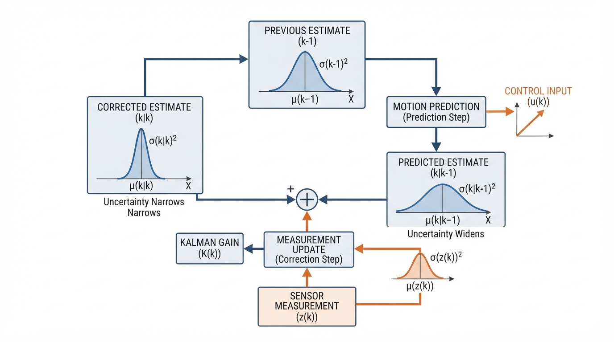
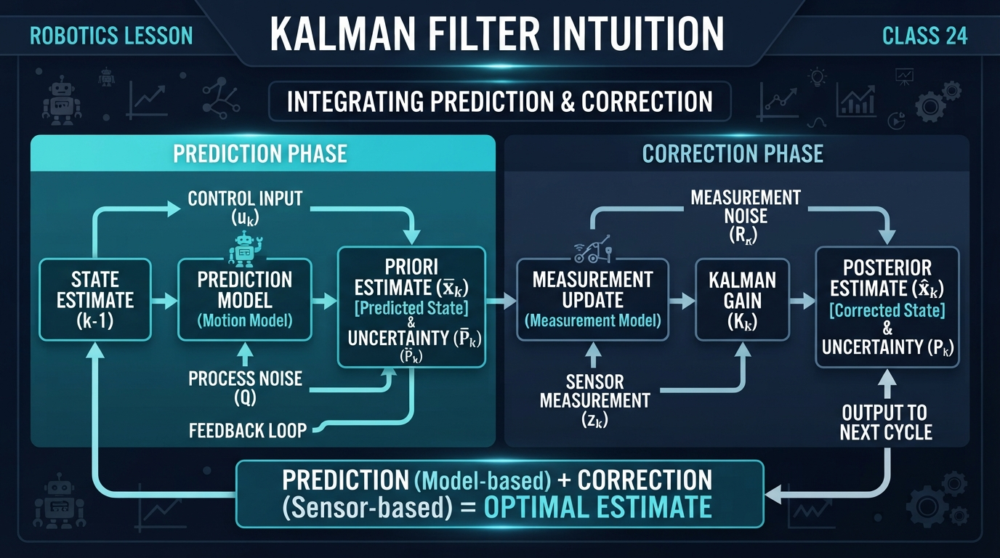
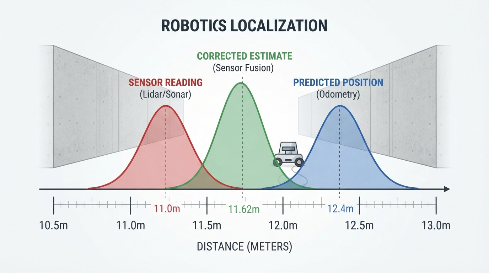
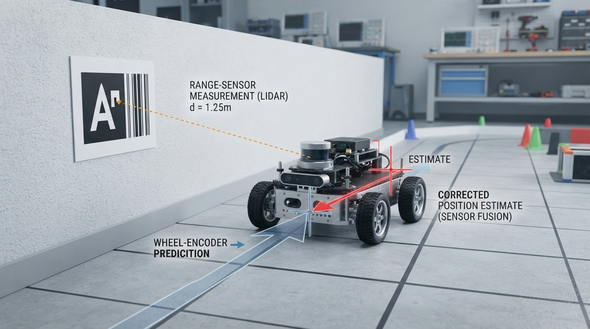
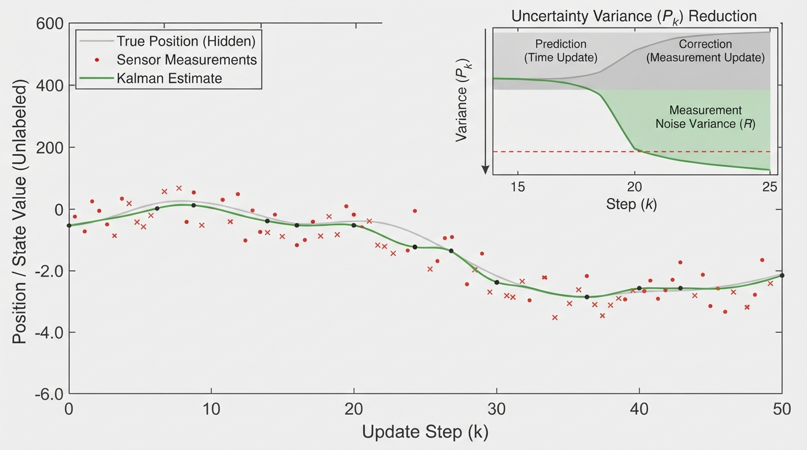

# Class 24: Kalman Filter Intuition

## Where We Are in the Robotics Journey

RoboRover has learned that sensors are imperfect. In the previous class, **Moving Average Filters** reduced random noise by combining several recent measurements. That worked well when the important answer changed slowly.

Today, RoboRover needs something more flexible. It is driving along a corridor and estimating its position. Its wheel encoders predict how far it moved, while a distance sensor occasionally reports its position relative to a landmark.

The encoder responds quickly but drifts. The distance sensor does not drift in the same way, but its readings are noisy and may arrive less often.

A **Kalman filter** combines these two sources of information by repeating two actions:

1. **Prediction:** use the robot’s motion model to estimate what should happen next.
2. **Correction:** compare that prediction with a measurement and move toward the measurement by an amount determined by their uncertainties.

This is the central idea of today’s class.

## Today We Will Learn

By the end of this class, you should be able to:

- explain prediction and correction using a physical analogy;
- describe why uncertainty is part of a useful estimate;
- calculate one simple, one-dimensional Kalman-filter update;
- understand the meaning of the Kalman gain;
- run a small Python simulation;
- identify situations where a Kalman filter can fail.

We will use a **scalar Kalman filter**, meaning we estimate one quantity at a time: RoboRover’s position along a straight corridor. Real robotics filters often estimate many quantities together, but the same reasoning remains visible in this small version.

## 2-Minute Recap

A moving average filter combines recent measurements:

\[
\text{average}=\frac{x_1+x_2+\cdots+x_n}{n}
\]

where each \(x_i\) is a measurement of the same quantity.

A moving average can reduce random noise, but it has two important weaknesses:

- it introduces delay because it waits for several measurements;
- it does not naturally use a model of how the robot is moving.

A Kalman filter also combines information, but it combines:

- a **prediction** from a motion model;
- a **measurement** from a sensor;
- an estimate of the uncertainty of each.

## The Big Idea




**Figure:** The Kalman filter repeats prediction and correction while carrying uncertainty from one cycle to the next.

Imagine two people estimating the location of a hidden treasure.

- Person A says, “I walked 10 meters from the starting point, then 2.4 meters more. I am fairly confident.”
- Person B measures with a noisy tape measure and says, “The treasure is at 11 meters. My measurement is somewhat uncertain.”

You would not blindly choose one answer. You would make a compromise, trusting the more reliable source more strongly.

A Kalman filter performs this compromise mathematically.

### Prediction

RoboRover first asks:

> “Given where I thought I was and how I moved, where do I expect to be now?”

The predicted position may be wrong because:

- the wheels slipped;
- the commanded speed was not achieved;
- the floor was uneven;
- the time measurement was slightly inaccurate.

Therefore, the filter stores not only a predicted position but also a predicted **uncertainty**.

### Correction

When a sensor measurement arrives, RoboRover asks:

> “How different is this measurement from my prediction, and which one should I trust more?”

If the prediction is very uncertain and the sensor is reliable, the corrected estimate moves close to the sensor reading.

If the prediction is reliable and the sensor is noisy, the corrected estimate moves only a little.

The filter does not simply average the two values equally.

## See It in Your Head

### AI-Generated Engineering Visual · Professor OS



**How to read this visual:** Trace the signal or idea from left to right. Match each block to the lesson explanation, then predict what would change if one block produced a wrong value.




**Figure:** The corrected estimate lies between prediction and measurement, closer according to their relative uncertainty.

Draw a horizontal corridor with distance marks.

1. Place a blue dot at RoboRover’s predicted position.
2. Draw a wide pale-blue cloud around it to represent high prediction uncertainty.
3. Place a red sensor mark somewhere nearby.
4. Draw a red cloud around the sensor mark to represent sensor uncertainty.
5. Put a green corrected dot between them.
6. Make the green dot closer to whichever cloud is narrower.

For the complete filtering cycle, draw this loop:

```text
previous estimate
        |
        v
  motion prediction
        |
        v
 predicted estimate + uncertainty
        |
        v
 new sensor measurement
        |
        v
  weighted correction
        |
        v
 current estimate + reduced uncertainty
```

The important visual detail is that the filter carries an uncertainty cloud forward. Prediction usually makes that cloud wider. Correction usually makes it narrower.

## Core Concept

A basic one-dimensional Kalman filter maintains two main values:

- \(x\): the current estimated state;
- \(P\): the uncertainty of that estimate, represented here as variance.

For this lesson, the state is position.

### Prediction step

Suppose RoboRover moves at estimated velocity \(v\) for a time interval \(\Delta t\).

\[
x_{\text{pred}}=x_{\text{old}}+v\Delta t
\]

where:

- \(x_{\text{pred}}\) is predicted position, in meters \((\text{m})\);
- \(x_{\text{old}}\) is the previous estimated position, in meters \((\text{m})\);
- \(v\) is estimated velocity, in meters per second \((\text{m/s})\);
- \(\Delta t\) is elapsed time, in seconds \((\text{s})\).

The uncertainty also changes:

\[
P_{\text{pred}}=P_{\text{old}}+Q
\]

where:

- \(P_{\text{pred}}\) is predicted position variance, in square meters \((\text{m}^2)\);
- \(P_{\text{old}}\) is previous position variance, in square meters \((\text{m}^2)\);
- \(Q\) is process variance, in square meters \((\text{m}^2)\), representing uncertainty added by motion.

The symbol \(Q\) might account for wheel slip or imperfect speed estimation.

### Correction step

Suppose a sensor reports position \(z\), with measurement variance \(R\).

First calculate the Kalman gain:

\[
K=\frac{P_{\text{pred}}}{P_{\text{pred}}+R}
\]

where:

- \(K\) is the Kalman gain, with no units;
- \(R\) is measurement variance, in \(\text{m}^2\).

Then calculate the measurement difference, called the innovation:

\[
y=z-x_{\text{pred}}
\]

where:

- \(y\) is the innovation, in meters;
- \(z\) is the sensor measurement, in meters.

Finally correct the estimate:

\[
x_{\text{new}}=x_{\text{pred}}+Ky
\]

and update the uncertainty:

\[
P_{\text{new}}=(1-K)P_{\text{pred}}
\]

The gain \(K\) is between 0 and 1 in this simple case.

- \(K\) near 1: trust the sensor more.
- \(K\) near 0: trust the prediction more.

This is not a permanent setting. The gain changes as the uncertainties change.

## Math Without Fear

### Worked numerical example

RoboRover’s previous estimated position is:

\[
x_{\text{old}}=10.0\ \text{m}
\]

Its previous position variance is:

\[
P_{\text{old}}=4.0\ \text{m}^2
\]

It estimates that it traveled at:

\[
v=1.2\ \text{m/s}
\]

for:

\[
\Delta t=2.0\ \text{s}
\]

The motion process variance is:

\[
Q=1.0\ \text{m}^2
\]

A distance sensor reports:

\[
z=11.0\ \text{m}
\]

with measurement variance:

\[
R=4.0\ \text{m}^2
\]

### Step 1: predict position

\[
x_{\text{pred}}=10.0\ \text{m}+(1.2\ \text{m/s})(2.0\ \text{s})
\]

\[
x_{\text{pred}}=12.4\ \text{m}
\]

### Step 2: predict uncertainty

\[
P_{\text{pred}}=4.0\ \text{m}^2+1.0\ \text{m}^2
\]

\[
P_{\text{pred}}=5.0\ \text{m}^2
\]

The uncertainty increased because motion is imperfect.

### Step 3: calculate the gain

\[
K=\frac{5.0\ \text{m}^2}{5.0\ \text{m}^2+4.0\ \text{m}^2}
=\frac{5}{9}\approx0.5556
\]

### Step 4: calculate the innovation

\[
y=11.0\ \text{m}-12.4\ \text{m}=-1.4\ \text{m}
\]

The sensor is 1.4 meters behind the prediction.

### Step 5: correct the position

\[
x_{\text{new}}=12.4\ \text{m}+(0.5556)(-1.4\ \text{m})
\]

\[
x_{\text{new}}\approx11.6222\ \text{m}
\]

### Step 6: update uncertainty

\[
P_{\text{new}}=(1-0.5556)(5.0\ \text{m}^2)
\]

\[
P_{\text{new}}\approx2.2222\ \text{m}^2
\]

Interpretation: RoboRover does not jump all the way to 11.0 m because its motion prediction still contains useful information. However, the estimate moves substantially toward the sensor reading, and its uncertainty decreases from \(5.0\ \text{m}^2\) to approximately \(2.2222\ \text{m}^2\).

Here is a direct verification:

```python
x_old = 10.0
p_old = 4.0
velocity = 1.2
dt = 2.0
process_variance = 1.0
measurement = 11.0
measurement_variance = 4.0

x_pred = x_old + velocity * dt
p_pred = p_old + process_variance
gain = p_pred / (p_pred + measurement_variance)
innovation = measurement - x_pred
x_new = x_pred + gain * innovation
p_new = (1.0 - gain) * p_pred

assert abs(x_pred - 12.4) < 1e-12
assert abs(p_pred - 5.0) < 1e-12
assert abs(gain - (5.0 / 9.0)) < 1e-12
assert abs(innovation - (-1.4)) < 1e-12
assert abs(x_new - (104.6 / 9.0)) < 1e-12
assert abs(p_new - (20.0 / 9.0)) < 1e-12

print("Predicted position:", x_pred, "m")
print("Corrected position:", x_new, "m")
print("Corrected variance:", p_new, "m^2")
```

## Worked Robotics Example




**Figure:** Wheel motion supplies the prediction while a wall measurement supplies evidence for correction.

RoboRover travels down a straight indoor track.

Its wheel encoders update frequently. From the encoder readings, the robot estimates that it moved forward 0.8 meters during one update interval. But wheel motion is not perfect: one wheel briefly slipped on dust.

At the same time, a range sensor observes a fixed wall marker. The sensor’s position estimate is lower than the encoder-based prediction.

The filter performs this reasoning:

1. **Prediction:** “The encoders say I moved forward 0.8 m.”
2. **Uncertainty growth:** “Wheel slip is possible, so my confidence decreases.”
3. **Measurement comparison:** “The range sensor says I am slightly less far forward.”
4. **Correction:** “I will move partway toward the sensor result, according to the two uncertainty estimates.”
5. **Next cycle:** “Now I begin from this corrected estimate.”

Notice what the filter is not doing:

- It is not declaring one sensor always correct.
- It is not removing all noise.
- It is not discovering the true position by magic.
- It is not necessarily controlling the motors directly.

It is producing a better estimate that another controller could use.

## Python Lab




**Figure:** A simulation makes the hidden true position, noisy measurements, and filtered estimate visible together.

The program below simulates a robot moving along one dimension. The true position is used only by the simulation to create synthetic sensor readings. The filter itself receives:

- a motion-based prediction;
- a noisy position measurement.

The program plots all three:

- hidden true position;
- noisy measurements;
- Kalman-filter estimate.

```python
import random
import math
import matplotlib.pyplot as plt


def kalman_update(estimate, variance, motion, process_variance,
                  measurement, measurement_variance):
    """Perform one prediction-and-correction cycle."""
    predicted_estimate = estimate + motion
    predicted_variance = variance + process_variance

    gain = predicted_variance / (
        predicted_variance + measurement_variance
    )

    innovation = measurement - predicted_estimate
    corrected_estimate = predicted_estimate + gain * innovation
    corrected_variance = (1.0 - gain) * predicted_variance

    return corrected_estimate, corrected_variance, gain


def main():
    random_generator = random.Random(24)

    steps = 30
    true_position = 0.0
    estimate = 0.0
    variance = 1.0

    true_positions = []
    measurements = []
    estimates = []
    gains = []

    commanded_motion = 0.8
    process_variance = 0.12
    measurement_variance = 1.44
    measurement_standard_deviation = math.sqrt(measurement_variance)

    for step in range(steps):
        # The simulated world moves by a mostly steady amount.
        true_position += commanded_motion

        # The sensor reports the true position plus random measurement noise.
        noise = random_generator.gauss(
            0.0, measurement_standard_deviation
        )
        measurement = true_position + noise

        # The filter predicts from motion, then corrects with the measurement.
        estimate, variance, gain = kalman_update(
            estimate,
            variance,
            commanded_motion,
            process_variance,
            measurement,
            measurement_variance
        )

        true_positions.append(true_position)
        measurements.append(measurement)
        estimates.append(estimate)
        gains.append(gain)

    assert len(true_positions) == steps
    assert len(measurements) == steps
    assert len(estimates) == steps
    assert len(gains) == steps
    assert all(0.0 < gain < 1.0 for gain in gains)
    assert variance > 0.0

    time_steps = list(range(1, steps + 1))

    plt.figure(figsize=(10, 5))
    plt.plot(
        time_steps,
        true_positions,
        label="Hidden true position",
        linewidth=2
    )
    plt.scatter(
        time_steps,
        measurements,
        label="Noisy sensor measurements",
        color="tab:red",
        alpha=0.65
    )
    plt.plot(
        time_steps,
        estimates,
        label="Kalman estimate",
        color="tab:green",
        linewidth=2
    )
    plt.xlabel("Update number")
    plt.ylabel("Position (m)")
    plt.title("RoboRover: prediction plus correction")
    plt.grid(True, alpha=0.3)
    plt.legend()
    plt.tight_layout()
    plt.show()

    print("The program completed", steps, "filter updates.")
    print("Last Kalman gain:", gains[-1])
    print("Last estimated position (m):", estimates[-1])


if __name__ == "__main__":
    main()
```

### Important lines

`predicted_estimate = estimate + motion` performs the motion prediction.

`predicted_variance = variance + process_variance` says that uncertainty grows when the robot moves under an imperfect model.

`gain = predicted_variance / (...)` calculates how strongly the correction should react to the sensor.

`innovation = measurement - predicted_estimate` measures disagreement between the sensor and the prediction.

The `assert` statements verify structural facts about the program: it created the expected number of data points, each gain is between 0 and 1, and the final variance remains positive.

## Mini Simulation or Game

Before running the Python program, predict what the graph will look like.

### Predict before you run it

The red measurement points are deliberately noisy. The green estimate uses both the red points and the motion prediction.

Which result do you expect?

A. The green line will exactly pass through every red point.  
B. The green line will be smoother than the red points but may lag or disagree with them.  
C. The green line will remain at zero because filtering removes all motion.  
D. The green line will always be closer to the red points than to the hidden true position.

Write down your choice and your reason before running the program.

The best answer is **B**. The filter usually smooths the measurements, but it does not force every estimate to equal a measurement. Its behavior depends on the uncertainty settings.

### Experiment game: change the trust

Run the program three times, changing only `measurement_variance`.

Try:

- `measurement_variance = 0.25`
- `measurement_variance = 1.44`
- `measurement_variance = 9.0`

Predict first:

- With a small measurement variance, will the estimate follow the red points more closely?
- With a large measurement variance, will the estimate rely more on the motion prediction?

Do not treat these settings as decoration. They express an engineering belief about the sensor. If the sensor is actually unreliable but you assign it a very small variance, the filter may be pulled toward bad measurements.

## What Should Happen?

With a small `measurement_variance`, the filter should give the sensor more influence during correction. The estimate may look more responsive, but it may also look noisier.

With a large `measurement_variance`, the filter should trust the motion model more strongly. The estimate may look smoother, but it can drift if the motion model is wrong.

The exact plotted locations depend on the program’s fixed random seed and settings. The code does not assume that filtering makes the estimate perfect. It only combines the available information according to the supplied uncertainty values.

## Common Mistakes

### “The Kalman filter always trusts the sensor.”

No. Trust is shared between prediction and measurement. The Kalman gain changes when the uncertainties change.

### “A smaller variance means a smaller error every time.”

No. Variance is the filter’s uncertainty model, not a guarantee. A sensor can be confidently wrong because of calibration failure, an obstacle, or an incorrect assumption.

### “Prediction means guessing randomly.”

No. Prediction comes from a model, such as position plus velocity multiplied by time. The model may be imperfect, but it should be based on the robot’s behavior.

### “Correction means replacing the prediction.”

Usually not. In the scalar example, correction moves the estimate partway toward the measurement.

### “More filtering is always better.”

No. A filter can become slow to respond if it trusts an outdated or overly certain model. In a real robot, delay can matter as much as noise.

### Practical failure mode: a biased sensor

Suppose the range sensor is consistently 2 meters too high because of a calibration error. The Kalman filter may repeatedly correct RoboRover toward the wrong position.

Random noise can often be reduced. A persistent bias requires calibration, a better sensor model, or an additional way to detect the problem.

Other real-world complications include:

- delayed measurements;
- sudden wheel slip;
- incorrect process variance \(Q\);
- incorrect measurement variance \(R\);
- sensor readings that do not match the assumed probability model.

## Try It Yourself

### Challenge

Modify the Python program so that the simulated robot changes motion after update 15:

- before update 15, it moves 0.8 m per update;
- after update 15, it moves 1.3 m per update.

Keep the filter’s commanded motion at 0.8 m per update.

Predict what will happen to the green estimate after the change. It should begin to fall behind because the filter’s motion model is now wrong. The sensor corrections may gradually pull it back.

### Optional extension

Add a second plotted estimate using a simple moving average of the measurements. Compare:

- the moving-average result;
- the Kalman estimate;
- the hidden true position.

Ask:

- Which responds sooner when motion changes?
- Which is smoother?
- Which method uses a motion model?

This is a comparison between the previous class and today’s class, not a contest with one universal winner.

## Quick Quiz

1. What are the two repeated stages of a simple Kalman filter?

2. If the predicted uncertainty is large and the measurement uncertainty is small, should the Kalman gain be closer to 0 or closer to 1?

3. In the worked example, why did the corrected position not become exactly 11.0 m?

4. What is one practical reason a Kalman filter can produce a poor estimate even when its equations are implemented correctly?

## Answers

1. **Prediction** using a motion model, followed by **correction** using a measurement.

2. The gain should be closer to **1**, so the correction trusts the measurement more strongly.

3. The filter still considered the motion prediction useful. The gain was about \(0.5556\), not 1, so the estimate moved partway toward the sensor reading.

4. Possible answers include sensor bias, incorrect uncertainty values, wheel slip not represented by the model, delayed measurements, or a sudden change in motion.

## Real Robot Connection

In a real mobile robot, an estimator may combine:

- wheel encoders for short-term motion;
- inertial sensors for acceleration and rotation;
- range sensors for environmental measurements;
- cameras for visual observations.

The key engineering pattern is the same:

1. predict using what the robot believes it is doing;
2. compare the prediction with new evidence;
3. correct the estimate;
4. carry the updated uncertainty into the next cycle.

A Kalman filter is therefore not merely a noise-removal trick. It is a compact way to maintain a changing estimate while admitting that the estimate is uncertain.

Today we used one position value. Advanced filters may estimate position, velocity, orientation, and other quantities together. That extension is powerful, but the prediction-correction rhythm remains the foundation.

## Vocabulary

- **Estimate:** a calculated belief about a quantity, such as RoboRover’s position.
- **Prediction:** an estimate produced from a model of motion or system behavior.
- **Correction:** an update that combines a prediction with a new measurement.
- **Uncertainty:** a numerical description of how unsure the filter is about an estimate.
- **Variance:** a nonnegative measure of uncertainty; for position, its units are often \(\text{m}^2\).
- **Process variance \(Q\):** uncertainty added because the motion model is imperfect.
- **Measurement variance \(R\):** uncertainty assigned to a sensor measurement.
- **Innovation:** the difference between a measurement and the predicted value.
- **Kalman gain:** a dimensionless weight controlling how strongly the measurement changes the prediction.
- **Scalar Kalman filter:** a Kalman filter estimating one numerical quantity at a time.

## Further Learning

For deeper study, search for these resource topics:

- “one-dimensional Kalman filter prediction correction”
- “Kalman gain intuitive explanation”
- “robot sensor fusion with wheel odometry and range sensors”
- “covariance and variance in state estimation”
- “extended Kalman filter introduction”

Keep the distinction clear: today’s scalar filter estimates a quantity. It does not yet solve the full problem of recognizing the world or understanding images.

## Next Class

In the next class, **Computer Vision: Pixels as Numbers**, RoboRover will receive information from a camera.

A camera image may look like a picture to a human, but a computer sees arrays of numbers:

- brightness values;
- color channels;
- rows and columns of pixels.

That class will connect sensing to data representation. Later, those pixel measurements could become observations used by an estimator—but first RoboRover must learn what a pixel is.
