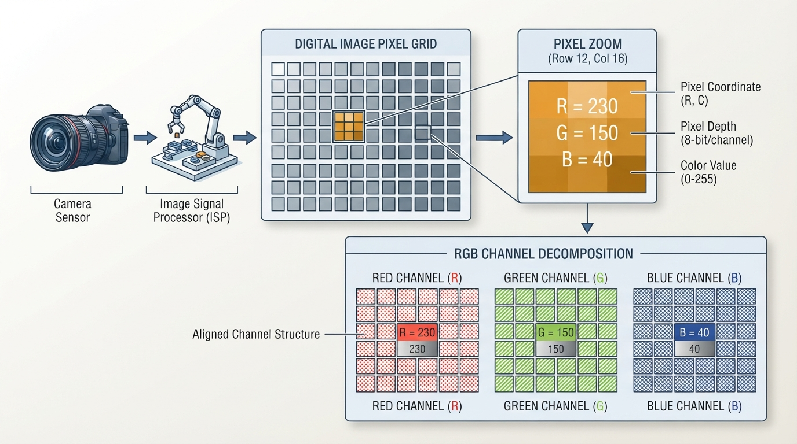
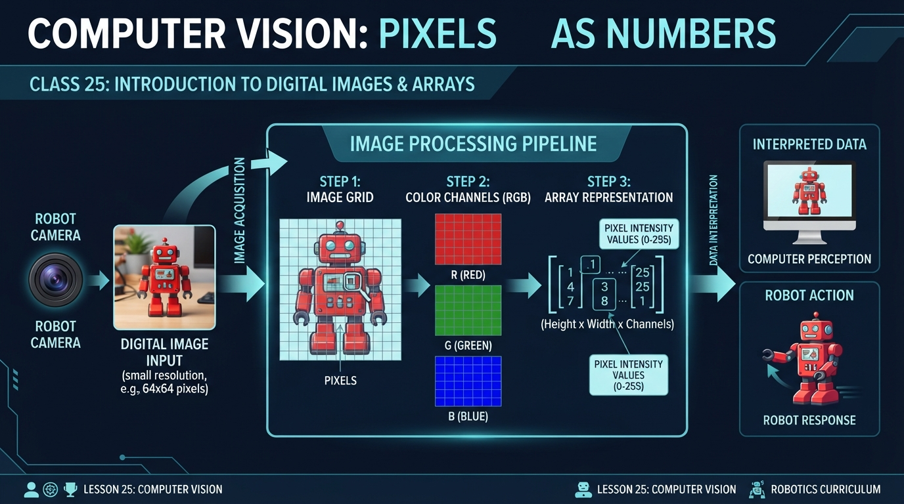
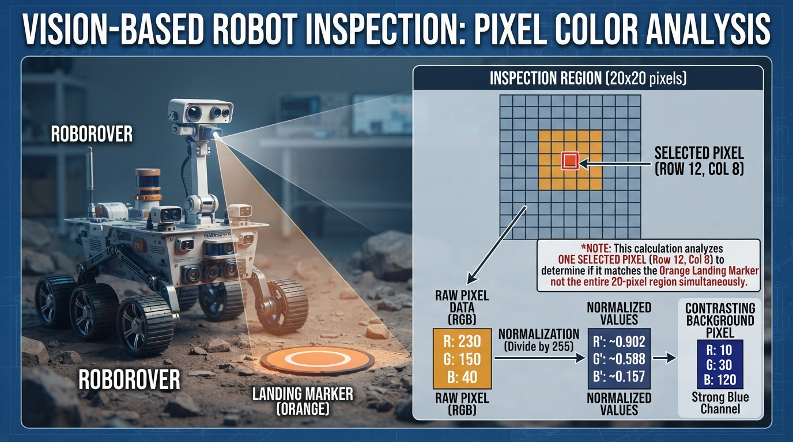
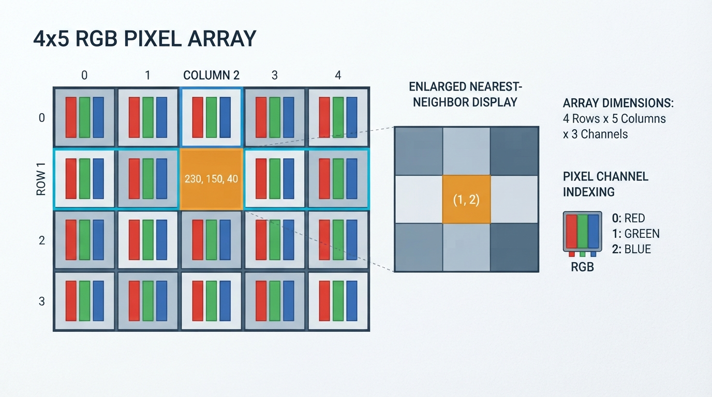
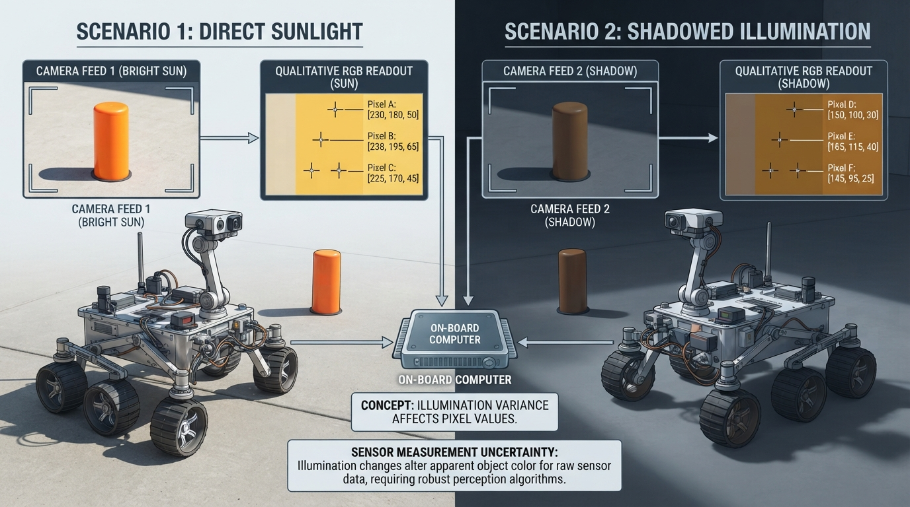

# Class 25: Computer Vision: Pixels as Numbers

## Where We Are in the Robotics Journey

RoboRover has learned to estimate its motion and surroundings using noisy measurements. In the previous class, **Kalman Filter Intuition**, we treated a hidden situation—such as RoboRover’s position—as something that can be estimated from imperfect sensor readings.

Now RoboRover receives a different kind of measurement: an image from a camera.

A camera does not directly report “orange traffic cone,” “wall,” or “open path.” It reports many small numerical measurements called **pixels**. Computer vision begins when we learn to organize and interpret those numbers.

In this class, we will build the foundation for the next class, **Thresholding and Segmentation**. There, RoboRover will use pixel values to separate likely objects or regions from the background.

## Today We Will Learn

By the end of this class, you should be able to:

- explain an image as a rectangular array of pixels;
- describe a color pixel using red, green, and blue values;
- distinguish image width, height, and color channels;
- convert an 8-bit RGB value to normalized values between 0 and 1;
- visualize a small RGB image in Python;
- explain why a camera image is a measurement, not a perfect description of the world;
- predict how changing one pixel or one channel changes an image or its average color.

## 2-Minute Recap

A **measurement** is information obtained from the world by a sensor. A camera is a sensor that measures patterns of light.

The previous class introduced the idea that measurements can be noisy and that a robot may maintain an estimate rather than trusting one reading perfectly. A camera also has uncertainty:

- lighting may change;
- surfaces may reflect light differently;
- pixels may contain sensor noise;
- objects may be partly hidden;
- the camera may be blurred or out of focus.

The important connection is this:

> A camera image is a large collection of measurements. Computer vision organizes those measurements so a robot can use them.

## The Big Idea




**Figure:** A color image is an array of pixel locations, with three channel values stored at each location.

Imagine placing a transparent square grid over a photograph. Each small square records the light measured in one tiny region. That square is a **pixel**, short for “picture element.”

A grayscale image might store one number per pixel:

```text
12   18   21   25
40   44   50   55
90   92   95   99
```

Small values usually represent darker pixels, and large values usually represent brighter pixels.

A color image commonly stores three numbers per pixel:

```text
(red, green, blue)
```

These are called the **RGB channels**.

For example:

```text
(230, 150, 40)
```

contains:

- red intensity: 230;
- green intensity: 150;
- blue intensity: 40.

Because red is strong, green is moderate, and blue is weak, this pixel will usually look orange or yellow-orange.

An image is therefore not just “a picture.” In a computer, it is an organized collection of numbers.

### An illustrator’s view

Draw a small camera looking at RoboRover’s orange marker. Beside the camera, show the image as a rectangular grid. Zoom into one cell and label it:

```text
R = 230
G = 150
B = 40
```

Then show the full image as a stack of three transparent grids:

1. a red-intensity grid;
2. a green-intensity grid;
3. a blue-intensity grid.

The three grids align perfectly. Together, they form the color image. Use high-contrast labels and distinguish the channel layers with both labels or patterns and color, rather than relying only on red, green, and blue hues.

## See It in Your Head

### AI-Generated Engineering Visual · Professor OS



**How to read this visual:** Trace the signal or idea from left to right. Match each block to the lesson explanation, then predict what would change if one block produced a wrong value.


Picture a 4-row by 5-column image.

- The **width** is 5 pixels.
- The **height** is 4 pixels.
- Each pixel has 3 channel values.
- The image therefore has the shape:

```text
height × width × channels
4 × 5 × 3
```

This does not mean there are only 60 “things to see.” It means the computer has 4 × 5 = 20 pixel locations, with 3 numbers stored at each location.

A useful indexing convention is:

```text
image[row][column]
```

The first row is row 0, and the first column is column 0. This is common in programming, even though people often describe locations starting from 1.

At one location, we might write:

```python
image = [[(0, 0, 0) for _ in range(4)] for _ in range(2)]
image[1][3] = (230, 150, 40)
```

This means:

- row 1;
- column 3;
- red value 230;
- green value 150;
- blue value 40.

The row comes before the column because a computer typically moves through an image one horizontal row at a time.

## Core Concept

### RGB values

In a common **8-bit RGB image**, each channel is represented by an integer from 0 through 255.

- `(0, 0, 0)` is black.
- `(255, 255, 255)` is white.
- `(255, 0, 0)` is pure red.
- `(0, 255, 0)` is pure green.
- `(0, 0, 255)` is pure blue.
- `(255, 255, 0)` is yellow because red and green are both strong.

The word “8-bit” means that each channel uses 8 binary digits. Those 8 bits can represent:

\[
2^8 = 256
\]

different integer values, numbered 0 through 255.

A computer may also store colors using floating-point values from 0.0 to 1.0. Conversion from an 8-bit value \(v\) to a normalized value \(n\) is:

\[
n = \frac{v}{255}
\]

where:

- \(v\) is the channel value in the range 0–255;
- \(n\) is the normalized channel value in the range 0–1;
- both values are dimensionless because they represent relative intensity, not a physical unit such as meters.

### Images as arrays

An **array** is an organized collection of values arranged by position. A one-dimensional array is like a row of numbered boxes. A two-dimensional array is like a spreadsheet. A color image is commonly treated as a three-dimensional array:

\[
\text{image}[r][c][k]
\]

where:

- \(r\) is the row index;
- \(c\) is the column index;
- \(k\) is the channel index;
- \(k=0\) means red, \(k=1\) means green, and \(k=2\) means blue.

In Python, an image may be represented by nested lists, although professional vision software often uses specialized numerical-array libraries for speed.

### Resolution

Image resolution describes how many pixels are available. An image with width \(W\) pixels and height \(H\) pixels has:

\[
N = W \times H
\]

pixel locations, where:

- \(W\) is width in pixels;
- \(H\) is height in pixels;
- \(N\) is the total number of pixels.

Resolution is commonly reported as **width × height**, such as 640 × 480. In an array, however, the shape is commonly reported as **height × width × channels**, such as 480 × 640 × 3. These descriptions refer to the same spatial dimensions in a different order.

More pixels can preserve more spatial detail, but more pixels also require more memory and processing. A robot may need to balance visual detail against response time.

## Math Without Fear

Suppose RoboRover sees one pixel from its orange marker:

\[
(R,G,B) = (230,150,40)
\]

The normalized values are:

\[
R_n=\frac{230}{255}\approx0.902
\]

\[
G_n=\frac{150}{255}\approx0.588
\]

\[
B_n=\frac{40}{255}\approx0.157
\]

Interpretation:

- red is about 90.2% of the available 8-bit channel range;
- green is about 58.8%;
- blue is about 15.7%.

This is not a measurement in meters or kilograms. It is a numerical description of the camera’s recorded color intensity.

A simple average brightness estimate can be calculated as:

\[
B_{\text{avg}}=\frac{R+G+B}{3}
\]

For this pixel:

\[
B_{\text{avg}}=\frac{230+150+40}{3}
=\frac{420}{3}
=140
\]

The average channel value is 140 on the 0–255 scale. This does **not** mean the pixel is visually “half bright” in every human sense. Human brightness perception is more complicated, and displays and cameras have their own response characteristics. The average is simply a useful introductory calculation.

A grayscale conversion may weight channels differently because the eye is more sensitive to some colors than others. One simple teaching formula is an **approximate luma-style weighting**:

\[
Y=0.21R+0.72G+0.07B
\]

where \(Y\) is an approximate brightness value on the same 0–255 scale. This is not a universal grayscale conversion; real imaging systems may use different color standards and transformations.

## Worked Robotics Example




**Figure:** Comparing RGB channel strengths gives RoboRover evidence about the marker's color, but not certainty about its identity.

RoboRover is inspecting a small orange landing marker. Its camera image contains a region of 20 pixels. That 20-pixel region is the context for the inspection. The following calculations analyze **one particular pixel within that region**, not all 20 pixels at once.

At the selected pixel, the camera records:

```text
R = 230
G = 150
B = 40
```

First, calculate the normalized RGB values:

\[
(230/255,\;150/255,\;40/255)
\]

This gives approximately:

```text
(0.902, 0.588, 0.157)
```

The red channel is much stronger than the blue channel. The pixel is therefore a plausible orange-marker pixel.

Now suppose a second pixel in the image records:

```text
(35, 140, 210)
```

This pixel has a strong blue channel and a much weaker red channel. It is more likely to belong to the sky-colored background than to the orange marker.

This is not yet object recognition. RoboRover has not proved that a pixel belongs to the marker. It has only compared numerical measurements. In the next class, we will use rules based on such values to create a **segmentation mask**: a new image that marks pixels as likely belonging to a selected region.

### Engineering interpretation

A single pixel is weak evidence. Many neighboring pixels with similar values provide stronger evidence that RoboRover is seeing a region rather than an isolated noisy measurement.

However, orange paint in bright sunlight may produce different RGB values than the same paint in shadow. A reliable robot must account for lighting, camera exposure, shadows, reflections, and sensor variation.

## Python Lab




**Figure:** The Python program treats the image as rows and columns of RGB tuples and displays the array without smoothing.

### Before you run the program

Make this numerical prediction first. The selected marker pixel is initially:

```python
(230, 150, 40)
```

If you change only its blue channel to make it:

```python
(230, 150, 80)
```

then:

1. the selected pixel’s normalized blue value should change from \(40/255\) to \(80/255\);
2. the image’s average blue channel should increase by

\[
\frac{80-40}{20}=2
\]

because the image contains 20 pixels and only one blue-channel value changes.

After editing the program and running it, compare the printed output with your prediction. The assertions verify the values for whatever marker tuple is currently assigned.

### Environment note

This lab requires Python 3.7 or later and a graphical environment in which Matplotlib can open a window. If Matplotlib is not installed, install it with:

```bash
python -m pip install matplotlib
```

The following complete Python 3.7-compatible program creates a small RGB image using nested lists, displays it, calculates its average channel values, and checks a selected pixel.

```python
import matplotlib.pyplot as plt


def image_shape(image):
    """Return height, width, and number of channels."""
    height = len(image)
    width = len(image[0])
    channels = len(image[0][0])
    return height, width, channels


def average_channels(image):
    """Return the average red, green, and blue values."""
    height, width, channels = image_shape(image)
    totals = [0, 0, 0]

    for row in image:
        for pixel in row:
            for channel in range(channels):
                totals[channel] += pixel[channel]

    number_of_pixels = height * width
    return [
        totals[channel] / number_of_pixels
        for channel in range(channels)
    ]


def normalized_pixel(pixel):
    """Convert an 8-bit RGB pixel to values from 0.0 to 1.0."""
    return [value / 255.0 for value in pixel]


def main():
    # RoboRover's small test image:
    # blue background, one-pixel orange marker, and dark ground.
    sky = (35, 140, 210)
    marker = (230, 150, 40)
    ground = (80, 65, 35)

    image = [
        [sky, sky, sky, sky, sky],
        [sky, sky, marker, sky, sky],
        [ground, ground, ground, ground, ground],
        [ground, ground, ground, ground, ground]
    ]

    height, width, channels = image_shape(image)
    averages = average_channels(image)
    selected_pixel = image[1][2]
    normalized = normalized_pixel(selected_pixel)

    print("Image shape: {} rows x {} columns x {} channels".format(
        height, width, channels
    ))
    print("Average RGB values: {}".format(averages))
    print("Selected pixel at row 1, column 2: {}".format(selected_pixel))
    print("Normalized selected pixel: {}".format(normalized))

    # Verification checks make the important claims executable.
    assert (height, width, channels) == (4, 5, 3)
    assert selected_pixel == marker
    assert normalized == [
        marker[0] / 255.0,
        marker[1] / 255.0,
        marker[2] / 255.0
    ]

    expected_averages = [
        (9 * sky[0] + marker[0] + 10 * ground[0]) / 20.0,
        (9 * sky[1] + marker[1] + 10 * ground[1]) / 20.0,
        (9 * sky[2] + marker[2] + 10 * ground[2]) / 20.0
    ]
    assert averages == expected_averages

    # Matplotlib accepts the nested RGB structure as image data.
    plt.figure(figsize=(7, 4))
    plt.imshow(image, interpolation="nearest")
    plt.title("RoboRover's RGB pixel array")
    plt.xlabel("Column index")
    plt.ylabel("Row index")
    plt.xticks(range(width))
    plt.yticks(range(height))
    plt.grid(True, color="white", linewidth=0.8)
    plt.show()


if __name__ == "__main__":
    main()
```

### Important lines

- `image` is a nested list: outer elements are rows, and inner elements are columns.
- Each pixel is a three-value tuple in RGB order.
- This example contains **one marker pixel**, at row 1, column 2.
- `image_shape` counts rows, columns, and channels.
- `average_channels` visits every pixel and adds each channel separately.
- `image[1][2]` selects row 1, column 2.
- `plt.imshow` displays the numerical array as an image.
- `interpolation="nearest"` keeps each small pixel visibly square instead of smoothing boundaries.
- The `assert` statements verify the exact shape, selected pixel, normalized values, and averages. Because the expected values are calculated from `marker`, the checks remain correct if you edit the marker tuple.

If the picture appears vertically inverted compared with your mental drawing, remember that image row 0 is displayed at the top by default. The row index increases downward.

## Mini Simulation or Game

### Pixel Detective

Before running the program, predict:

1. Which location contains the one-pixel orange marker?
2. Will the selected marker pixel have a larger red value or blue value?
3. If you change the marker pixel from `(230, 150, 40)` to `(20, 20, 240)`, will the image look more orange or more blue?
4. Will the average red channel increase or decrease after that change?

To experiment, edit this line:

```python
marker = (230, 150, 40)
```

Try these alternatives:

```python
marker = (20, 20, 240)
marker = (240, 240, 240)
marker = (0, 0, 0)
```

Run the program after each change. You are simulating a camera observing different marker colors. The assertions use the current `marker` value, so they should continue to pass.

For a more challenging version, change only one channel of the one-pixel marker. For example, change:

```python
marker = (230, 150, 40)
```

to:

```python
marker = (230, 150, 80)
```

Watch how that numerical change affects the displayed pixel and the average channel values.

## What Should Happen?

The original marker pixel at row 1, column 2 should be orange because its red value is high, its green value is moderate, and its blue value is low.

The image should show:

- a blue region across the upper part;
- a single orange marker pixel in the second row;
- a dark brown region below it.

If you change the marker to `(20, 20, 240)`, the marker should become blue. Its blue channel will become the strongest channel, and the average blue value should increase compared with the original image.

The program’s assertions should pass without producing an error. If an assertion fails, check whether you changed the image structure or the selected location rather than only changing the `marker` tuple.

## Common Mistakes

### Mistake 1: Confusing width and height

A 4-row by 5-column image has height 4 and width 5. In code, the shape is commonly written:

```text
4 × 5 × 3
```

not 5 × 4 × 3.

### Mistake 2: Reversing RGB order

The tuple `(230, 150, 40)` means red, green, blue in that order. Reordering it as blue, green, red changes the color interpretation.

### Mistake 3: Treating pixel values as physical color truth

A value of 230 does not mean “230 units of red in the world.” It is a camera and image-storage value. Exposure, lighting, sensor calibration, and software processing affect it.

### Mistake 4: Assuming one pixel identifies an object

A single orange pixel could be paint, a reflection, image noise, or part of another object. Object decisions usually use groups of pixels and additional checks.

### Mistake 5: Forgetting that images are measurements

The camera may be blurred, overexposed, underexposed, or blocked. RoboRover should not assume that every image perfectly represents the scene.

### Engineering caveat: lighting changes the numbers

Suppose RoboRover sees the same orange marker first in sunlight and then in shadow. The RGB values may be substantially different even though the physical marker has not changed.

This is a **modeling assumption** problem: a simple vision rule may assume that color values remain stable, but the real environment violates that assumption. Later techniques can improve robustness, but no color threshold is automatically reliable in every lighting condition.

## Try It Yourself

### Challenge: Build a tiny scene

Create a new 6-row by 6-column image containing:

- a light background;
- a two-pixel-wide vertical RoboRover charging stripe;
- a dark floor;
- one unusual “noise” pixel.

Then answer:

1. What is the image shape?
2. Which row and column contain the noise pixel?
3. Which channel is strongest at the charging stripe?
4. Does the noise pixel noticeably change the average channel values?

Use the existing program as a starting point. Keep every pixel as an RGB tuple.

### Optional extension

Write a function called `pixel_brightness(pixel)` that returns:

\[
B_{\text{avg}}=\frac{R+G+B}{3}
\]

Then print the brightness of the marker and background pixels. Add an assertion for one manually calculated result.

Do not try to identify the entire charging stripe yet. That is the subject of the next class.

## Quick Quiz

1. What does one RGB pixel usually contain in an 8-bit color image?

2. What is the shape of an image with 480 rows, 640 columns, and 3 color channels?

3. Normalize the RGB pixel `(255, 128, 0)` using \(n=v/255\). Which channel is absent?

4. Why might the same physical orange object produce different RGB values in sunlight and shadow?

## Answers

1. It contains three channel values: red, green, and blue. In an 8-bit image, each channel commonly ranges from 0 through 255.

2. Its array shape is:

   ```text
   480 × 640 × 3
   ```

   It has 480 rows, 640 columns, and 3 values per pixel. The corresponding width-by-height resolution description is 640 × 480.

3. The normalized values are:

   \[
   (255/255,\;128/255,\;0/255)
   \approx(1.0,\;0.502,\;0.0)
   \]

   The blue channel is absent because its value is 0.

4. Illumination changes the light reaching the camera. Exposure, shadows, reflections, and sensor behavior can therefore change the measured RGB values even when the object itself has not changed.

## Real Robot Connection




**Figure:** The same physical object can produce different pixel values when illumination, exposure, or shadows change.

A real RoboRover camera might produce an image with hundreds of thousands or millions of pixels. Processing every channel of every pixel takes time and computational effort.

A vision system may therefore:

- reduce the image resolution;
- examine only a region of interest;
- convert the image into a simpler representation;
- compare pixels with expected color ranges;
- combine image evidence with distance or motion sensors.

The camera does not directly tell RoboRover what action to take. It supplies measurements. Software interprets those measurements, and a separate decision and control system may command the motors.

This connects to the previous class: just as a Kalman filter helps manage uncertain sensor measurements, a vision system must account for uncertainty in image measurements. A camera reading is evidence, not certainty.

This also prepares us for the next class. RoboRover will use numerical conditions such as “the red value is high while the blue value is low” to classify pixels into categories. That process is called **thresholding**, and marking connected or selected regions is called **segmentation**.

## Vocabulary

- **Pixel**: A small picture element containing numerical image information.
- **Image**: An organized collection of pixel measurements.
- **RGB**: A color representation using red, green, and blue channels.
- **Channel**: One component of a pixel, such as the red component.
- **Array**: Values organized by position and dimensions.
- **Image resolution**: The number of pixel locations, commonly described by width and height.
- **8-bit channel**: A channel represented using values from 0 through 255.
- **Normalized value**: A value scaled to a standard range, here usually 0.0 through 1.0.
- **Grayscale image**: An image that stores one brightness-like value per pixel instead of three RGB values.
- **Noise**: Unwanted variation in a measurement.
- **Region of interest**: The selected part of an image that a robot chooses to analyze.
- **Computer vision**: The use of algorithms to extract useful information from images or video.

## Further Learning

For further study, search for these resource names:

- “RGB color model”
- “digital image pixels arrays”
- “image resolution and sampling”
- “camera exposure and white balance”
- “Matplotlib imshow image arrays”
- “computer vision thresholding”

When studying examples, always ask:

1. What is the image shape?
2. What does one pixel store?
3. What assumptions are being made about lighting?
4. What evidence would make the result unreliable?

## Next Class

In **Class 26: Thresholding and Segmentation**, RoboRover will turn pixel numbers into a simple decision map.

For each pixel, it may ask:

```text
Does this pixel look enough like the orange marker?
```

The answer can produce a binary mask:

- white or `True` for pixels that pass the rule;
- black or `False` for pixels that do not.

That will be RoboRover’s first step toward separating an object from its background.
