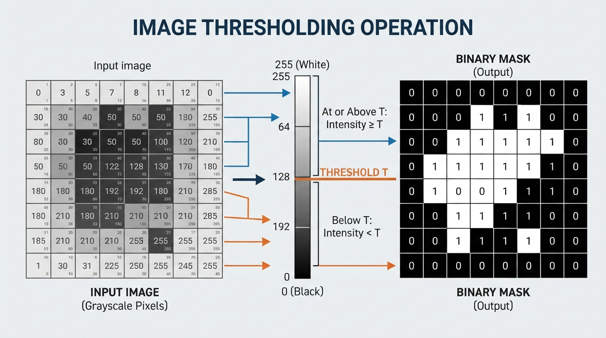
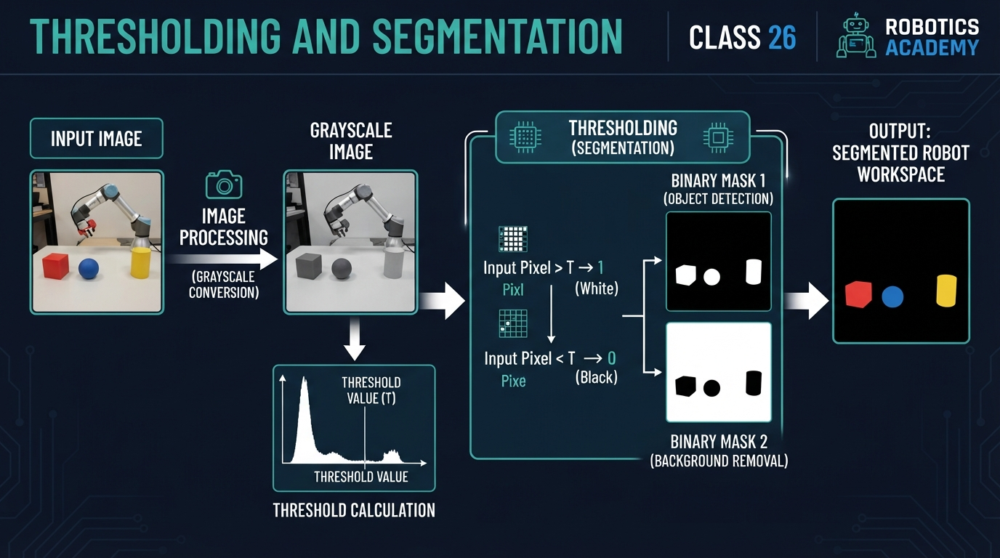
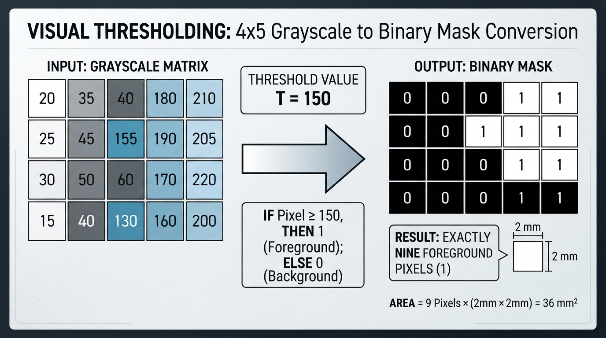
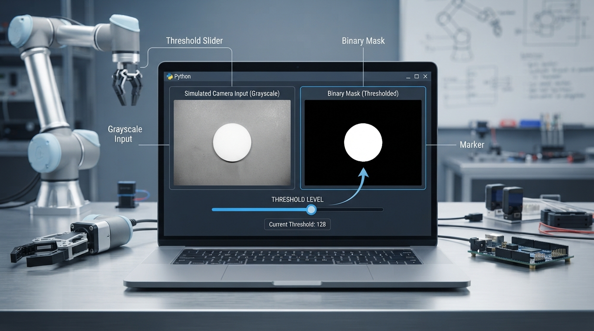

# Class 26: Thresholding and Segmentation

## Where We Are in the Robotics Journey

In the previous class, **Computer Vision: Pixels as Numbers**, RoboRover learned that an image is a grid of numbers. A grayscale image gives one brightness number per pixel. A color image gives several numbers per pixel, commonly describing red, green, and blue intensity.

That was the measurement stage:

> “What numbers does RoboRover’s camera see?”

Today we begin a simple but powerful interpretation stage:

> “Which pixels probably belong to the thing RoboRover cares about?”

We will use **thresholding** to turn a grayscale image into a **binary mask**. The mask separates pixels into two groups, such as:

- foreground: probably part of a bright floor marker;
- background: probably everything else.

In the next class, **Contours and Shape Detection**, RoboRover will use the boundary of a segmented region to estimate shapes and locations. Today’s mask is therefore an important intermediate representation.

## Today We Will Learn

By the end of this class, you should be able to:

1. Explain thresholding using a brightness cutoff.
2. Represent a binary mask using zeros and ones.
3. Calculate the number and approximate area of foreground pixels.
4. Explain how threshold choice changes a segmentation result.
5. Identify practical problems caused by shadows, reflections, and sensor noise.
6. Use a Python simulation to experiment with a threshold.
7. Identify false positives and false negatives in a segmentation mask.

## 2-Minute Recap

Imagine RoboRover’s camera as a square window made of tiny measuring tiles called **pixels**.

For a grayscale image:

- a low pixel value represents a dark measurement;
- a high pixel value represents a bright measurement;
- the values may be stored from 0 to 255 in an 8-bit image.

The number 0 does not mean “no object exists.” It means the pixel measurement is at the dark end of the chosen scale. Likewise, 255 means very bright, not necessarily physically perfect white.

A camera image is not the world itself. It is a measurement affected by lighting, exposure, reflections, lens behavior, and electronic noise.

## The Big Idea




**Figure:** Thresholding replaces each intensity value with a binary decision based on a cutoff.

Suppose RoboRover is searching for a bright strip of tape on a dark laboratory floor.

One pixel has brightness 42. Another has brightness 198. RoboRover could keep comparing every pixel as a complicated number, or it could ask a simpler question:

> “Is this pixel bright enough to be part of the tape?”

Choose a threshold \(T\), then classify each pixel:

\[
M(x,y)=
\begin{cases}
1, & I(x,y)\geq T\\
0, & I(x,y)<T
\end{cases}
\]

Here:

- \(I(x,y)\) is the original image intensity at column \(x\), row \(y\);
- \(T\) is the threshold, measured in intensity levels;
- \(M(x,y)\) is the binary mask value;
- 1 means “foreground” or “selected”;
- 0 means “background” or “not selected.”

This process is called **thresholding**.

A **segmentation** is the broader task of dividing an image into meaningful regions. Thresholding is one method of segmentation.

### A visual mental model

An illustrator could draw:

1. a grayscale image of a dark floor with a bright irregular **foreground patch**;
2. a vertical brightness ruler labeled 0 through 255;
3. a horizontal cutoff line at \(T=150\);
4. an arrow from every pixel below the line to a black mask pixel;
5. an arrow from every pixel at or above the line to a white mask pixel;
6. a legend stating that foreground may be stored logically as 1 or displayed as 255, while background is stored logically as 0.

The result looks less like a photograph and more like a map of selected regions.

## See It in Your Head

### AI-Generated Engineering Visual · Professor OS



**How to read this visual:** Trace the signal or idea from left to right. Match each block to the lesson explanation, then predict what would change if one block produced a wrong value.


Picture a black-and-white chessboard made from the camera image.

- Black squares represent mask value 0.
- White squares represent mask value 1.
- A connected white patch may correspond to RoboRover’s bright tape.
- Small isolated white dots may be noise or reflections.

The mask deliberately throws away information. It no longer remembers whether a selected pixel had intensity 151 or 240. Both become 1.

That loss can be useful. Later algorithms can work with a clear region instead of thousands of subtle brightness values.

It can also be dangerous. If the threshold is poorly chosen, the mask may:

- miss part of the tape;
- include unrelated bright objects;
- break one object into several pieces;
- join separate objects together.

## Core Concept

### One global threshold

The simplest method uses one threshold for the whole image.

For example, with \(T=150\):

- intensity 149 becomes 0;
- intensity 150 becomes 1;
- intensity 220 becomes 1.

The equality rule matters. In this lesson we use “greater than or equal to.”

A **global threshold** applies the same cutoff value throughout the image. An **adaptive threshold** uses thresholds that can vary across different image locations, often to handle spatially varying illumination.

### Binary mask versus original image

The original image answers:

> “How bright was this pixel?”

The mask answers:

> “Did this pixel pass the selection rule?”

These are different data products.

A mask can be stored as:

- Boolean values such as `True` and `False`;
- integers 0 and 1;
- display values 0 and 255, where 255 is white for viewing.

Do not confuse the display convention with the logical meaning. A displayed white pixel may contain the value 1 or 255 depending on the program.

### Segmentation is a hypothesis

When RoboRover selects bright pixels, it is making a hypothesis:

> “Brightness is a useful clue for identifying the target.”

That hypothesis works when the target and background differ reliably in brightness. It becomes weak when the floor has bright patches, the tape is shadowed, or lighting changes across the image.

A threshold is not intelligence by itself. It is a rule applied to measurements.

## Math Without Fear

Suppose a mask contains \(N_f\) foreground pixels. If each pixel represents a square with side length \(s\), then the approximate foreground area is:

\[
A \approx N_f s^2
\]

where:

- \(A\) is estimated area in square units, such as \(\text{mm}^2\);
- \(N_f\) is the number of foreground pixels;
- \(s\) is the physical width of one pixel on the observed surface, such as \(\text{mm/pixel}\).

The approximation is important. A pixel is an image sample, not a tiny physical tile permanently attached to the world. Its corresponding surface area depends on camera geometry. For a downward-facing camera over a flat surface, a calibrated central image region might be approximated by \(2\text{ mm/pixel}\), giving \(4\text{ mm}^2\) per pixel. Under perspective, pixels nearer the top or bottom of the image may represent different physical areas, so the scale can vary substantially. This formula is most reasonable when the surface is approximately flat and the camera geometry is known.

### Worked numerical example

Consider this \(4\times5\) grayscale image:

\[
I=
\begin{bmatrix}
20&35&40&180&210\\
25&45&155&190&205\\
30&50&60&170&220\\
15&40&130&160&200
\end{bmatrix}
\]

Let the threshold be:

\[
T=150
\]

The binary mask is:

\[
M=
\begin{bmatrix}
0&0&0&1&1\\
0&0&1&1&1\\
0&0&0&1&1\\
0&0&0&1&1
\end{bmatrix}
\]

There are \(N_f=9\) foreground pixels: two in the first row, three in the second, two in the third, and two in the fourth.

If each pixel represents a \(2\text{ mm}\times2\text{ mm}\) square, then:

\[
s=2\text{ mm/pixel}
\]

\[
A\approx N_f s^2
\]

\[
A\approx 9\text{ pixels}\times(2\text{ mm/pixel})^2
=36\text{ mm}^2
\]

So the mask estimates a bright region of approximately \(36\text{ mm}^2\), under the stated flat-surface assumption.

Notice that intensity values have no physical unit here; they are camera data levels. The area does have physical units because we supplied a pixel-to-millimetre scale.

## Worked Robotics Example




**Figure:** The worked example contains nine selected foreground pixels, giving an approximate area of 36 mm² when each pixel represents a 2 mm by 2 mm surface square.

RoboRover is driving over a test mat. Its downward-facing camera sees a bright rectangular inspection marker. The marker is brighter than most of the mat, so RoboRover creates a bright-pixel mask.

The processing chain is:

```text
camera image
     |
     v
grayscale intensity image
     |
     v
compare every pixel with threshold T
     |
     v
binary mask
     |
     v
estimate where the marker is
```

Suppose the mask contains a foreground patch near the right side of the image. RoboRover could use that information to decide whether the marker is visible.

However, today we stop before shape detection and navigation. The mask tells us **which pixels were selected**, not yet the exact outline, center, orientation, or distance of the marker. Those are subjects for later lessons.

The most important engineering question is:

> “Does the selected region correspond to the object I intended to select?”

A mask with many foreground pixels is not automatically a good mask. It may be selecting a shiny bolt, a reflection, or a sunlit patch of floor.

## Python Lab




**Figure:** The Python lab lets the learner change the threshold and observe how the selected region changes.

This complete Python 3.7 program creates a simulated camera image, thresholds it, and displays the result. A slider lets you change the threshold while the mask updates.

It also verifies the numerical example above with executable assertions and displays the foreground percentage for the simulated image. The two circular regions in this simulation are illustrative targets; they are separate from the rectangular inspection marker in the robotics narrative and the bright tape example.

If Matplotlib is not already installed, install it in the Python environment before running the program:

```bash
python -m pip install matplotlib
```

```python
import math
import matplotlib.pyplot as plt
from matplotlib.widgets import Slider


def make_simulated_image(width, height):
    """Create a dark floor with two bright circular marker-like regions."""
    image = []

    for y in range(height):
        row = []

        for x in range(width):
            # Base floor brightness.
            value = 45

            # Add a gentle brightness gradient from left to right.
            value += int(25.0 * x / float(width - 1))

            # Add a bright circular region near the left.
            left_distance = (x - 45) ** 2 + (y - 55) ** 2
            if left_distance < 22 ** 2:
                value = 205

            # Add a second, dimmer circular region near the right.
            right_distance = (x - 115) ** 2 + (y - 75) ** 2
            if right_distance < 18 ** 2:
                value = 135

            # Add a repeatable stripe-like lighting disturbance.
            # This stripe is below both circular regions, so it does
            # not overlap either circle.
            if 100 <= y <= 104 and 20 <= x <= 140:
                value += 25

            value = max(0, min(255, value))
            row.append(value)

        image.append(row)

    return image


def threshold_image(image, threshold):
    """Return a 0/1 mask using the rule intensity >= threshold."""
    mask = []

    for row in image:
        mask_row = []
        for value in row:
            if value >= threshold:
                mask_row.append(1)
            else:
                mask_row.append(0)
        mask.append(mask_row)

    return mask


def count_foreground(mask):
    """Count the number of 1-valued pixels."""
    total = 0

    for row in mask:
        total += sum(row)

    return total


# Verify the worked numerical example.
example_image = [
    [20, 35, 40, 180, 210],
    [25, 45, 155, 190, 205],
    [30, 50, 60, 170, 220],
    [15, 40, 130, 160, 200],
]

example_mask = threshold_image(example_image, 150)
assert count_foreground(example_mask) == 9

pixel_side_mm = 2.0
estimated_area_mm2 = count_foreground(example_mask) * pixel_side_mm ** 2
assert estimated_area_mm2 == 36.0

print("Worked example foreground pixels:", count_foreground(example_mask))
print("Worked example estimated area (mm^2):", estimated_area_mm2)

# Create the simulated camera image.
image = make_simulated_image(160, 120)
initial_threshold = 150
mask = threshold_image(image, initial_threshold)

figure, axes = plt.subplots(1, 2, figsize=(10, 5))
plt.subplots_adjust(bottom=0.22)

axes[0].set_title("Simulated grayscale camera image")
image_display = axes[0].imshow(
    image, cmap="gray", vmin=0, vmax=255, interpolation="nearest"
)
axes[0].axis("off")

axes[1].set_title("Binary mask")
mask_display = axes[1].imshow(
    mask, cmap="gray", vmin=0, vmax=1, interpolation="nearest"
)
axes[1].axis("off")

slider_axis = figure.add_axes([0.20, 0.08, 0.60, 0.04])
threshold_slider = Slider(
    slider_axis,
    "Threshold",
    0,
    255,
    valinit=initial_threshold,
    valstep=1
)


def update_display(new_threshold):
    new_mask = threshold_image(image, int(new_threshold))
    foreground_pixels = count_foreground(new_mask)
    total_pixels = len(image) * len(image[0])
    foreground_percentage = 100.0 * foreground_pixels / total_pixels

    mask_display.set_data(new_mask)
    axes[1].set_title(
        "Binary mask: {} pixels ({:.2f}%)".format(
            foreground_pixels,
            foreground_percentage
        )
    )
    figure.canvas.draw_idle()


threshold_slider.on_changed(update_display)

update_display(initial_threshold)
plt.show()
```

Important lines:

- `threshold_image` applies the rule \(I(x,y)\geq T\).
- `count_foreground` adds the 1-valued pixels.
- `imshow(..., vmin=0, vmax=1)` displays the mask as strictly binary.
- `Slider` creates an interactive threshold control.
- The callback recomputes the mask whenever the slider moves.
- `foreground_percentage` connects the displayed result to \(P=100N_f/N\).

The simulated image is not a physical camera. It is a controlled experiment so that you can isolate threshold behavior. Production robotics systems commonly use array operations or computer-vision libraries for speed and convenience; this pure-Python version keeps the individual operations visible for learning.

## Mini Simulation or Game

### Predict before you run it

Before running the program, predict what will happen when you move the threshold:

1. At a very low threshold, will the mask contain more white pixels or fewer?
2. At a very high threshold, will the dimmer right-hand circle remain selected?
3. What happens to the horizontal bright stripe near the lower part of the image?
4. Can a threshold change remove the stripe without also affecting another bright region?

The base floor ranges approximately from intensity 45 to 69 because of the left-to-right gradient. The stripe is below both circles and adds about 25 intensity levels, so away from the circular regions its intensity is approximately 70 to 94. At low thresholds, much of the base floor is also selected, so the stripe is not an isolated effect.

The stripe was deliberately placed below the circular regions. Therefore, it does not raise any overlapping circle pixels from 135 to approximately 160. A threshold between 135 and 160 rejects the dimmer circle and also rejects the stripe; there is no hidden overlap in this version of the simulation.

Now run the program and test thresholds near:

- 40;
- 100;
- 150;
- 210.

Treat the slider like a game: choose a threshold that selects the bright left marker while rejecting most of the floor and the dimmer right marker. A threshold near 150 is a useful candidate: it selects the left marker at intensity 205, rejects the right marker at intensity 135, and rejects the stripe whose maximum intensity is approximately 94.

Threshold 210 demonstrates over-thresholding rather than successful left-marker selection. Because the left marker has intensity 205, it also disappears when the threshold is raised to 210.

There may not be one perfect threshold. A useful threshold depends on the actual task. If the goal is “find every bright object,” a lower threshold may be helpful. If the goal is “select only the bright inspection marker,” a higher threshold may be better, but it must remain at or below the marker’s measured intensity.

## What Should Happen?

Your predictions should be:

1. **Lower threshold:** more pixels become foreground because more intensities satisfy \(I\geq T\).
2. **Higher threshold:** fewer pixels become foreground.
3. The dimmer right-hand circle, with brightness 135 in the simulation, disappears when the threshold is raised above 135.
4. The stripe, whose intensity is approximately 70 to 94, disappears when the threshold is raised above its local intensity range.
5. At threshold 210, the bright left marker also disappears because its simulated intensity is 205.
6. The stripe and the circles do not overlap in this simulation, so the stripe does not create a partially selected circle at thresholds between 135 and 160.

The key pattern is monotonic:

> Increasing the threshold cannot turn a previously rejected pixel into a selected pixel under this simple rule.

### False positives and false negatives

Use the displayed mask and the known simulated scene to identify errors:

- A **false positive** is a selected pixel that does not belong to the intended target. For example, a selected floor or stripe pixel is a false positive if the goal is only the left circle.
- A **false negative** is a target pixel that was rejected. At threshold 210, the left circle provides false negatives because its intensity is 205 and therefore fails \(I\geq210\).

This exercise separates “how many pixels were selected?” from “were the right pixels selected?”

## Common Mistakes

### Mistake 1: Thinking white always means “object”

White in the mask means “passed the threshold.” It does not prove that the pixel belongs to the desired object.

### Mistake 2: Forgetting the equality rule

With \(I\geq T\), a pixel equal to the threshold is selected. With \(I>T\), it is rejected. This matters when many pixels have similar values.

### Mistake 3: Treating a threshold as universal

A threshold that works in a bright laboratory may fail in a shadow. Camera exposure, lamp position, surface color, and lens reflections can all change pixel values.

### Mistake 4: Expecting a clean mask from noisy measurements

A real camera may produce isolated bright pixels. A shiny floor may create false foreground regions. Later image-processing lessons may remove small regions or repair holes, but those operations should not be confused with thresholding itself.

### Mistake 5: Ignoring color

A red object and a green object may have similar grayscale brightness. If color distinguishes the target, converting immediately to grayscale may discard useful information. A color-based threshold can compare a selected RGB channel or a derived color representation such as HSV. Thresholding one RGB channel is not equivalent to thresholding hue, saturation, or value in HSV; each representation produces a different measurement and therefore a different selection rule.

### Engineering caveat: lighting and camera exposure

Thresholding is sensitive to the relationship between object brightness and background brightness. If automatic camera exposure changes, the same physical marker can produce different numerical intensities from one frame to the next.

A practical robot may therefore need:

- controlled lighting;
- camera calibration;
- a threshold tested across expected conditions;
- a threshold that changes with local image brightness;
- additional evidence besides brightness.

These are engineering strategies, not guarantees. A more advanced method can still fail under unusual lighting.

## Try It Yourself

### Challenge: Find the useful threshold

Modify the program so that the slider’s title also displays the percentage of foreground pixels:

\[
P=100\frac{N_f}{N}
\]

where:

- \(P\) is the foreground percentage;
- \(N_f\) is the number of foreground pixels;
- \(N\) is the total number of image pixels.

The supplied program already displays this percentage. Examine the `update_display` function, then calculate \(N\) from the image dimensions rather than typing the number manually.

Choose a threshold that, in your judgment, identifies the bright left marker while rejecting most of the background. A threshold near 150 should select the left marker while rejecting the dimmer right marker and the nonoverlapping stripe. A threshold of 210 is intentionally too high: it also rejects the left marker.

### Optional extension

Add a third simulated region with brightness 175. Predict whether it will appear at threshold 150, then verify your prediction. Do not change the thresholding rule.

## Quick Quiz

1. What does a mask value of 1 mean in today’s thresholding convention?

2. If the threshold increases from 100 to 180, can a pixel with intensity 150 remain foreground?

3. An image has 12 foreground pixels, and each pixel represents a \(3\text{ mm}\times3\text{ mm}\) square. What area does the simple estimate produce?

4. Why can a bright reflection create a false foreground region?

## Answers

1. It means the pixel passed the selection rule and was classified as foreground. In this lesson, that means its intensity was greater than or equal to the threshold.

2. No. At threshold 180, intensity 150 fails the rule \(I\geq180\), so it becomes background.

3. The estimated area is:

\[
A\approx12\text{ pixels}\times(3\text{ mm/pixel})^2
=108\text{ mm}^2
\]

4. Thresholding uses brightness as evidence, not object identity. A reflection may be bright enough to pass the same threshold as the desired object.

## Real Robot Connection

A real RoboRover might use a binary mask to locate a bright landing marker, a colored inspection label, or a high-contrast strip on a test surface.

The mask can simplify later processing:

```text
raw camera image
       |
       v
selected foreground pixels
       |
       v
boundary and shape analysis
       |
       v
estimate marker location
```

That is the bridge to the next class. **Contours** describe the boundary around a selected region. Once RoboRover has a mask, it can begin asking:

- Where is the region’s edge?
- Is the region approximately circular or rectangular?
- Are there several separate regions?
- Which region has the shape expected for the marker?

Thresholding does not answer those questions. It prepares the data for them.

Also remember the three separate ideas involved:

- **measurement:** the camera records intensity values;
- **classification:** thresholding labels pixels as foreground or background;
- **action:** a robot controller might later use the result to move.

A wrong mask can cause a perfectly functioning controller to make a poor decision.

## Vocabulary

- **Pixel:** A small sample location in a digital image. It represents a sample of a scene, not necessarily a fixed-size physical patch.
- **Intensity:** A numerical measurement representing brightness in a grayscale image.
- **Threshold:** A cutoff value used to separate measurements into groups.
- **Thresholding:** Classifying pixels according to whether they meet a threshold rule.
- **Binary mask:** An image whose pixels have two logical classes, commonly represented as 0 and 1.
- **Foreground:** The selected class in a mask; for RoboRover, this may be the suspected target.
- **Background:** The unselected class in a mask.
- **Segmentation:** Dividing an image into regions that are meaningful for a task.
- **False foreground:** A background pixel incorrectly selected as foreground.
- **False negative:** A target pixel incorrectly rejected as background.
- **Pixel scale:** The estimated physical size represented by one image pixel, such as \(\text{mm/pixel}\). The scale may vary across an image because of perspective.
- **Contour:** The boundary of a region. Contours are the main topic of the next class.

## Further Learning

Useful search terms for continued study:

- “binary image thresholding”
- “global thresholding in computer vision”
- “adaptive thresholding”
- “binary mask morphology”
- “image segmentation robotics”
- “grayscale versus color thresholding”
- “RGB channel thresholding versus HSV thresholding”

When studying these topics, keep asking the same engineering question:

> “What measurement assumption makes this segmentation method work, and when will that assumption fail?”

## Next Class

In **Class 27: Contours and Shape Detection**, RoboRover will use the binary mask as input and examine the boundaries of selected regions.

We will move from:

> “Which pixels passed the threshold?”

to:

> “What shape and location does this selected region have?”

The quality of that future shape analysis will depend strongly on the quality of today’s mask.