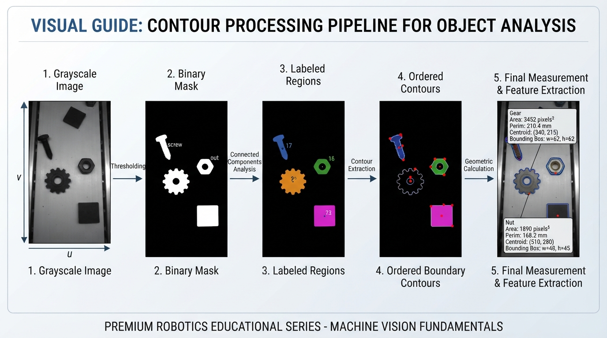
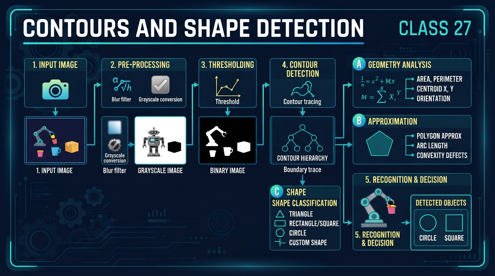
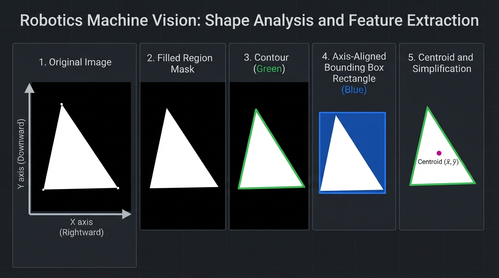
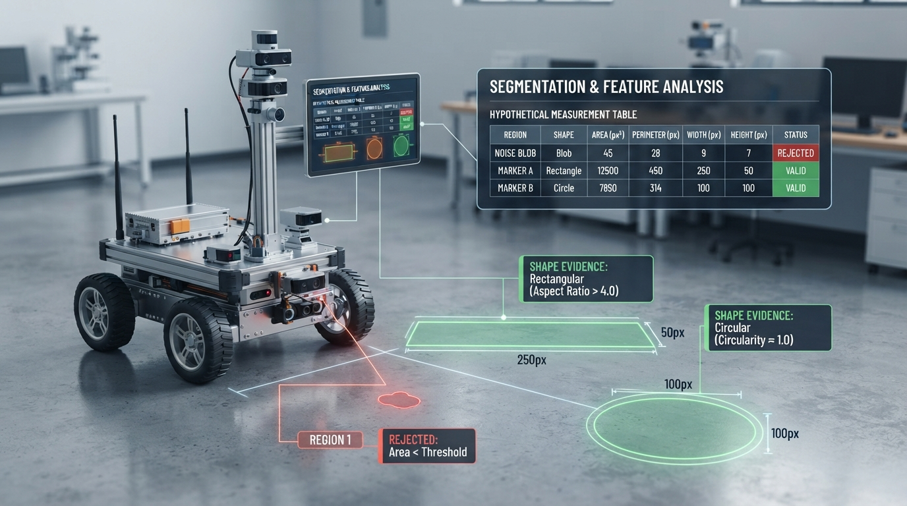
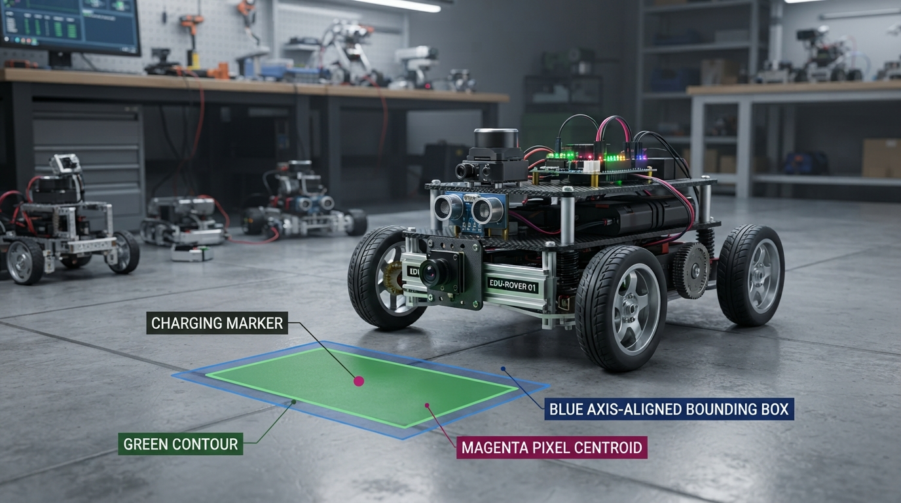

# Class 27: Contours and Shape Detection

## Where We Are in the Robotics Journey

In the previous class, RoboRover learned **thresholding and segmentation**. A camera image was converted to a simpler mask: pixels were classified as likely foreground or background.

That mask answers:

> “Which pixels belong to an object?”

Today we ask the next question:

> “What shape does that group of pixels make?”

We will use **contours**—boundaries around connected regions—to measure area, perimeter, position, and rough shape. These measurements help RoboRover distinguish a circular charging marker from a rectangular warning card or a triangular floor sign.

In the next class, **Camera Geometry**, we will examine how image coordinates relate to directions and distances in the real world. Today’s contour measurements happen mostly in **pixel units**. They describe the object’s appearance in the image, not yet its true physical size or 3D position.

---

## Today We Will Learn

By the end of this class, you should be able to:

- explain what a contour represents;
- distinguish a filled region from its boundary;
- calculate simple shape properties;
- describe how OpenCV finds and measures contours;
- use contour area, perimeter, bounding rectangles, image moments, and polygon approximation;
- recognize failure modes caused by noise, touching objects, holes, and poor threshold choices.

---

## 2-Minute Recap

A grayscale image stores brightness values. A **threshold** compares each pixel with a chosen cutoff:

\[
M(x,y)=
\begin{cases}
1 & \text{if } I(x,y)>T\\
0 & \text{if } I(x,y)\leq T
\end{cases}
\]

where:

- \(I(x,y)\) is the image brightness at pixel coordinate \((x,y)\);
- \(T\) is the threshold;
- \(M(x,y)\) is the binary mask, with 1 meaning foreground and 0 meaning background.

This strict-greater-than convention matches OpenCV's `cv2.THRESH_BINARY` behavior: a source pixel is set to the maximum value only when it is greater than the threshold. Other textbooks or thresholding functions may use \(I(x,y)\geq T\), so the comparison convention should always be stated.

In robotics, segmentation is useful but incomplete. A mask may contain several objects, holes, shadows, or noise islands. Contours give structure to those foreground regions.

**Predict before reading on:** If two bright objects touch in the binary mask, will a basic contour finder usually see one object or two?

The usual answer is **one connected contour**, because there is no longer a background gap separating them.

---

## The Big Idea




**Figure:** A contour pipeline converts segmented pixels into geometric measurements.

Imagine pressing a wet sponge onto paper. The printed outline tells you where the sponge ends, but not every detail about the inside.

A contour is similar: it is an ordered path around the edge of a connected foreground region.

For RoboRover, the process looks like this:

```text
camera image
     |
     v
thresholded mask
     |
     v
connected foreground regions
     |
     v
contours around regions
     |
     v
measurements and shape decisions
```

Suppose RoboRover sees a bright orange floor marker. A contour can tell it:

- the marker’s approximate area;
- its perimeter;
- its center in image coordinates;
- its bounding box;
- whether it has many corners or only a few;
- whether it is approximately circular, rectangular, or triangular.

A contour is not automatically a perfect mathematical boundary. It is estimated from discrete pixels. Diagonal edges become stair-step patterns, and small noise can create extra points.

When we describe pixels as a **connected region**, we also need a connectivity convention. With 4-connectivity, a pixel is connected through its horizontal and vertical neighbors. With 8-connectivity, diagonal neighbors count as connected too. For typical binary inputs, OpenCV's `cv2.findContours` effectively uses an 8-connected interpretation. Connected-component labeling, by contrast, may expose a separately selected 4- or 8-connectivity option. Contour results can therefore depend on the operation and convention used, especially for thin or diagonal structures.

---

## See It in Your Head

### AI-Generated Engineering Visual · Professor OS



**How to read this visual:** Trace the signal or idea from left to right. Match each block to the lesson explanation, then predict what would change if one block produced a wrong value.




**Figure:** The same object can be viewed as a filled region, a boundary, a box, a centroid, or a simplified polygon.

Picture a black image containing a white triangle.

- The **filled white triangle** is a region.
- The chain of pixels along its outside edge is the contour.
- A rectangle surrounding the triangle is its **bounding rectangle**.
- A small dot placed at the average location of its pixels is its approximate center, or centroid.
- A simpler three-corner outline is a **polygon approximation**.

An illustrator could show this as four nested views:

1. original camera image of RoboRover’s floor;
2. black-and-white segmentation mask;
3. colored contour line drawn around each white object;
4. labels showing area, perimeter, center, and bounding box.

OpenCV normally stores a contour as a sequence of image points:

\[
[(x_1,y_1),(x_2,y_2),\ldots,(x_n,y_n)]
\]

The points are ordered around the boundary. Image coordinates usually have \(x\) increasing to the right and \(y\) increasing downward. That differs from the usual graph convention in which \(y\) increases upward.

---

## Core Concept

### 1. Area

**Contour area** estimates how much image region lies inside the boundary.

Its unit is:

\[
\text{pixels}^2
\]

Area helps reject tiny noise. For example, RoboRover may ignore every contour with an area smaller than 30 pixels².

Area is also useful for comparing apparent object sizes. However, a nearby object usually occupies more pixels than the same object farther away.

`cv2.contourArea` operates on the contour representation. Its result can differ slightly from an ideal geometric formula because the contour is extracted from rasterized pixels and may be simplified.

### 2. Perimeter

The **perimeter**, also called arc length, is the distance around the contour.

Its unit is:

\[
\text{pixels}
\]

For a sequence of contour points, OpenCV approximates the perimeter by adding distances between neighboring points.

Like contour area, `cv2.arcLength` operates on the extracted contour. Its result can differ slightly from the ideal perimeter of a mathematical shape because of pixelation, contour extraction, and approximation.

### 3. Bounding rectangle

A bounding rectangle is the smallest axis-aligned rectangle that contains the contour.

It is described by:

- \(x\): left coordinate in pixels;
- \(y\): top coordinate in pixels;
- \(w\): width in pixels;
- \(h\): height in pixels.

“Axis-aligned” means the rectangle does not rotate to match the object.

A long, thin rectangle has a large aspect ratio:

\[
r=\frac{w}{h}
\]

where \(r\) has no units.

### 4. Polygon approximation

A real contour may contain hundreds of small points. **Polygon approximation** replaces it with fewer straight-line segments while staying near the original boundary.

A triangle may reduce to three major corners. A rectangle may reduce to four.

The approximation tolerance is often called epsilon, \(\varepsilon\), and is measured in pixels. A larger \(\varepsilon\) produces a simpler polygon but may erase meaningful corners.

### 5. Convexity

A contour is **convex** if it has no inward dents. A rubber band stretched around a convex object would touch its outermost points.

A crescent-shaped object is not convex. A filled disk and an ordinary rectangle are convex.

Convexity can help distinguish a simple marker from a notched or star-shaped object, but it is not enough by itself for reliable object recognition.

### 6. Image moments and centroid

Image moments summarize how contour points or pixels are distributed. For a contour, OpenCV returns a dictionary of moments:

```python
M = cv2.moments(contour)
```

The contour centroid is computed from the first-order moments:

\[
c_x=\frac{M_{10}}{M_{00}}, \qquad
c_y=\frac{M_{01}}{M_{00}}
\]

The calculation must be guarded because \(M_{00}\) can be zero for a degenerate contour:

```python
M = cv2.moments(contour)

if M["m00"] != 0:
    center_x = M["m10"] / M["m00"]
    center_y = M["m01"] / M["m00"]
else:
    center_x = None
    center_y = None
```

The centroid is an image-coordinate estimate. It is not necessarily a visible pixel, and it is not automatically the physical center of the object in three-dimensional space.

### Contour retrieval modes

OpenCV's retrieval mode determines which contours are returned and whether hierarchy information is maintained.

| Retrieval mode | What it returns | Typical use |
|---|---|---|
| `RETR_EXTERNAL` | Only outermost contours; inner hole boundaries are omitted | Count or measure only external objects |
| `RETR_LIST` | All contours without establishing parent-child hierarchy | Collect every boundary when hierarchy is unnecessary |
| `RETR_CCOMP` | All contours organized into a two-level hierarchy: outer boundaries and holes | Analyze objects and their immediate holes |
| `RETR_TREE` | All contours with a full nested hierarchy | Analyze holes and deeper contour relationships |

For example, a ring has an outer boundary and an inner boundary. `RETR_EXTERNAL` returns only the outer boundary, while a mode that preserves hierarchy can expose the hole boundary as well.

---

## Math Without Fear

Consider a rectangular floor marker that appears as 40 pixels wide and 25 pixels tall.

Assuming the contour follows the rectangle’s ideal edges:

\[
A=w h
\]

where:

- \(A\) is area in pixels²;
- \(w=40\) pixels is width;
- \(h=25\) pixels is height.

Therefore:

\[
A=(40\ \text{pixels})(25\ \text{pixels})
=1000\ \text{pixels}^2
\]

Its perimeter is:

\[
P=2(w+h)
\]

where \(P\) is perimeter in pixels:

\[
P=2(40+25)\ \text{pixels}
=130\ \text{pixels}
\]

Its aspect ratio is:

\[
r=\frac{w}{h}
=\frac{40}{25}
=1.6
\]

Interpretation:

- the marker covers approximately \(1000\ \text{pixels}^2\);
- walking once around its ideal boundary is approximately 130 pixels;
- it is 1.6 times wider than it is tall.

These are **image measurements**, not centimetres. If the camera moves closer, the same physical marker may become 80 pixels wide and 50 pixels tall. Its image area would become approximately four times larger, even though the physical marker did not change.

A useful shape score is **circularity**:

\[
C=\frac{4\pi A}{P^2}
\]

where:

- \(C\) is circularity with no units;
- \(A\) is contour area in pixels²;
- \(P\) is perimeter in pixels;
- \(\pi\) is approximately 3.14159.

A perfect mathematical circle has \(C=1\). Pixel stair-steps, lighting, and imperfect boundaries make real measurements lower. Circularity should be treated as evidence, not a magical identity test.

---

## Worked Robotics Example




**Figure:** Area filters remove noise, while perimeter and bounding-box measurements provide evidence about shape.

The following is a **hypothetical measurement table**, not output from the supplied Python program. RoboRover is inspecting three segmented regions from a camera image:

| Region | Area (pixels²) | Perimeter (pixels) | Bounding width (pixels) | Bounding height (pixels) |
|---|---:|---:|---:|---:|
| A | 18 | 19 | 5 | 5 |
| B | 960 | 128 | 40 | 24 |
| C | 420 | 92 | 21 | 21 |

RoboRover has been instructed to ignore regions smaller than 50 pixels². Region A is therefore likely noise.

For Region B:

\[
r_B=\frac{40}{24}\approx1.67
\]

It is substantially wider than tall, so it could be a rectangular marker.

For Region C:

\[
r_C=\frac{21}{21}=1
\]

It is roughly square in its bounding box. Its circularity is:

\[
C_C=\frac{4\pi(420)}{92^2}
\]

\[
C_C\approx0.62
\]

The value is not close to 1, so Region C is not a perfect circle in this image. It might be a rounded square, a rough circle, or a distorted region.

The important engineering decision is not “circularity says circle.” It is:

> “This region has enough evidence to be considered a possible circular marker, but another test or camera view may be needed.”

---

## Python Lab

### Environment setup

Use Python 3.7 or a later compatible Python environment. Install the required packages with:

```bash
python -m pip install opencv-python numpy matplotlib
```

On systems where `python` refers to another interpreter, use the corresponding Python 3 command, such as `python3 -m pip`.

You can verify the environment before running the lab:

```python
import cv2
import numpy as np
import matplotlib

print("OpenCV:", cv2.__version__)
print("NumPy:", np.__version__)
print("Matplotlib:", matplotlib.__version__)
```

The program below creates a synthetic binary image containing a rectangle and a triangle. It then uses OpenCV to find external contours, measures each contour, calculates and displays its centroid, draws a bounding box, and approximates the contour with a polygon.

The image is synthetic so that the lesson does not depend on a particular camera or lighting setup.

```python
import cv2
import numpy as np
import matplotlib.pyplot as plt


def main():
    # Create a black 240-by-320 pixel image.
    image = np.zeros((240, 320), dtype=np.uint8)

    # Draw two white filled shapes.
    cv2.rectangle(image, (35, 55), (125, 145), 255, -1)

    triangle = np.array([
        [205, 55],
        [275, 150],
        [155, 150]
    ], dtype=np.int32)
    cv2.fillPoly(image, [triangle], 255)

    # The image is already binary, but thresholding makes the pipeline explicit.
    _, mask = cv2.threshold(image, 127, 255, cv2.THRESH_BINARY)

    # OpenCV 3 and OpenCV 4 return different numbers of values.
    contour_result = cv2.findContours(
        mask,
        cv2.RETR_EXTERNAL,
        cv2.CHAIN_APPROX_SIMPLE
    )
    contours = contour_result[0] if len(contour_result) == 2 else contour_result[1]

    # We expect two separate outer contours in this synthetic image.
    assert len(contours) == 2

    # This is an RGB array. Therefore, drawing colors below use RGB order.
    display = cv2.cvtColor(mask, cv2.COLOR_GRAY2RGB)
    measurements = []

    for contour in contours:
        area = cv2.contourArea(contour)
        perimeter = cv2.arcLength(contour, True)
        x, y, width, height = cv2.boundingRect(contour)

        # Five percent of the perimeter is a moderate approximation tolerance.
        epsilon = 0.05 * perimeter
        polygon = cv2.approxPolyDP(contour, epsilon, True)

        # Calculate the centroid with the required zero-area guard.
        M = cv2.moments(contour)
        if M["m00"] != 0:
            center_x = M["m10"] / M["m00"]
            center_y = M["m01"] / M["m00"]
            centroid = (int(round(center_x)), int(round(center_y)))
        else:
            center_x = None
            center_y = None
            centroid = None

        measurements.append({
            "area": area,
            "perimeter": perimeter,
            "box": (x, y, width, height),
            "corners": len(polygon),
            "centroid": centroid
        })

        # display is RGB: green contour, blue box, magenta centroid.
        cv2.drawContours(display, [contour], -1, (0, 255, 0), 2)
        cv2.rectangle(
            display,
            (x, y),
            (x + width, y + height),
            (0, 0, 255),
            1
        )
        if centroid is not None:
            cv2.circle(display, centroid, 4, (255, 0, 255), -1)

    # Identify the shapes by their measured bounding-box locations rather than
    # relying on the order returned by findContours.
    rectangle_measurement = next(
        item for item in measurements
        if item["box"][0] < 100
    )
    triangle_measurement = next(
        item for item in measurements
        if item["box"][0] >= 100
    )

    # Verify the intended geometric claim directly.
    assert rectangle_measurement["area"] > triangle_measurement["area"]
    assert all(item["centroid"] is not None for item in measurements)

    print("Contours found:", len(contours))
    for index, item in enumerate(measurements):
        print(
            "Contour {}: area={:.1f} pixels^2, perimeter={:.1f} pixels, "
            "box={}, centroid={}, approximated corners={}".format(
                index + 1,
                item["area"],
                item["perimeter"],
                item["box"],
                item["centroid"],
                item["corners"]
            )
        )

    print(
        "Verified: rectangle area ({:.1f}) > triangle area ({:.1f})".format(
            rectangle_measurement["area"],
            triangle_measurement["area"]
        )
    )

    plt.figure(figsize=(8, 5))
    plt.imshow(display)
    plt.title("Contours in green, bounding boxes in blue, centroids in magenta")
    plt.axis("off")
    plt.tight_layout()
    plt.show()


if __name__ == "__main__":
    main()
```

Important lines:

- `cv2.RETR_EXTERNAL` asks for only the outside contour of each disconnected object. It ignores contours inside holes.
- `cv2.CHAIN_APPROX_SIMPLE` removes some redundant points while preserving the boundary shape.
- `cv2.contourArea` estimates area.
- `cv2.arcLength(contour, True)` measures the closed perimeter. The `True` means the contour should be treated as closed.
- `cv2.moments(contour)` supplies the moments used in the guarded centroid equations.
- `cv2.approxPolyDP` produces a simpler polygon.
- The assertions verify the two-contour expectation, the nonzero-centroid calculations, and the direct claim that the rectangle has greater measured area than the triangle.
- Because `display` is an RGB array, the rectangle color `(0, 0, 255)` is blue, not red.

The exact measured values are printed by the program rather than assumed in the lesson. They can differ slightly from ideal rectangle and triangle formulas because the shapes are rasterized into pixels and then represented by extracted contours.

If OpenCV is not installed, the program will stop at the import line. In a Python environment prepared for computer vision, the package is commonly imported as `cv2`.

---

## Mini Simulation or Game

Play **Contour Detective** with the program or with sketches.

Draw a black rectangle representing the image background. Add these white regions:

1. a large rectangle;
2. a small isolated square;
3. a ring with a black hole;
4. two touching circles;
5. ten isolated white noise dots.

Now predict what `RETR_EXTERNAL` will report:

- the large rectangle: one outer contour;
- the small square: one contour;
- the ring: one outer contour when only external contours are requested;
- the two touching circles: usually one combined outer contour;
- the isolated dots: potentially many tiny contours.

Give RoboRover an area filter, such as:

> Ignore every contour smaller than the chosen minimum area.

Then change the minimum area. A larger cutoff removes more noise, but it may also remove a genuinely small object.

For a more interactive experiment, modify the Python program:

- add small white dots to the image;
- use `cv2.RETR_LIST` instead of `cv2.RETR_EXTERNAL`;
- compare the result with a ring containing a hole;
- change the approximation factor from `0.05 * perimeter` to `0.01 * perimeter` and observe the number of polygon corners.

---

## What Should Happen?

Before running the program, predict:

1. How many separate contours should the synthetic image contain?
2. Which shape should have more approximated corners: the rectangle or the triangle?
3. Will the bounding rectangles be rotated to fit the shapes?
4. Where should the centroid markers appear?

Expected reasoning:

1. There are two disconnected white regions, so the program should find two external contours.
2. The triangle should usually simplify to about three major corners, while the rectangle should simplify to about four. Pixelization and the chosen tolerance can affect the exact result.
3. No. `cv2.boundingRect` is axis-aligned, so its sides remain horizontal and vertical.
4. Each magenta centroid marker should appear near the geometric center of its corresponding filled region in image coordinates.

The program verifies the robust claims—two contours, nonzero centroids, and a larger measured area for the rectangle—because exact contour measurements can depend on rasterization and OpenCV details.

---

## Common Mistakes

### Mistake 1: Treating every contour as a complete object

A contour is a boundary extracted from a mask. If two objects touch, they may produce one combined contour. If one object is broken by a dark gap, it may produce several contours.

### Mistake 2: Confusing pixels with physical measurements

An area of 1,000 pixels² is not 1,000 cm². Converting pixel lengths to real distances requires camera geometry, calibration, and assumptions about the object’s position.

### Mistake 3: Choosing a threshold once and trusting it forever

Lighting changes, shadows, reflections, and camera exposure can change the mask. A contour finder cannot repair a bad segmentation.

### Mistake 4: Using too much polygon simplification

A large epsilon may turn a detailed shape into an overly simple polygon. A small epsilon keeps noise and produces many unnecessary corners.

### Mistake 5: Ignoring holes

A washer-shaped marker has an outer boundary and an inner boundary. `RETR_EXTERNAL` deliberately keeps only the outside boundary. Other retrieval modes can preserve hierarchy information about holes.

### Mistake 6: Assuming area alone identifies an object

A nearby small object and a distant large object can occupy similar image areas. Shape, color, position, and temporal consistency may all be needed in a real robot.

---

## Try It Yourself

### Challenge: Find RoboRover’s Marker

Create a synthetic image containing:

- one rectangle;
- one triangle;
- one small noise blob.

Use contours to:

1. reject regions with area below a chosen threshold;
2. print each remaining region’s area and bounding box;
3. calculate and print each remaining region’s centroid using guarded image moments;
4. approximate each contour as a polygon;
5. classify a region as “triangle candidate” if its approximation has three corners;
6. classify a region as “rectangle candidate” if it has four corners.

Your program should not assume that the contour order is rectangle first or triangle first. Inspect the measurements and make the decision from the data.

A reasonable success criterion is that the noise blob is rejected while the rectangle and triangle remain, and that the two retained regions are assigned the expected candidate labels in a clean synthetic image. Choose the area threshold from the measured data rather than copying a universal value; the threshold should lie above the noise area and below the areas of the two intended markers.

This classification is intentionally simplified. Corner count alone is unreliable under occlusion, blur, perspective distortion, or noisy segmentation. In a real system, combine it with area, aspect ratio, color, position, and temporal consistency.

**Optional extension:** Add a circular region. Compare its polygon corner count using two epsilon values. Explain why a circle does not naturally have four corners, yet may be approximated by a polygon with many corners.

---

## Quick Quiz

1. What is the difference between a segmented region and its contour?

2. What are the units of contour area and perimeter when measured directly in an image?

3. If two white objects touch in a binary mask, what commonly happens when external contours are found?

4. Why can a contour’s pixel area not automatically be interpreted as physical area in square centimetres?

---

## Answers

1. A segmented region is the collection of foreground pixels. Its contour is an estimated ordered boundary around that region.

2. Area is measured in pixels², and perimeter is measured in pixels.

3. They commonly become one connected region and therefore one outer contour.

4. The camera projection changes the apparent size of objects. Physical conversion requires camera calibration and knowledge of scene geometry, which we will study next.

---

## Real Robot Connection




**Figure:** In a real robot, contour measurements are combined with color, position, and frame-to-frame consistency.

Imagine RoboRover searching for a painted charging symbol. A practical pipeline might be:

```text
camera frame
   -> threshold by color or brightness
   -> clean or filter the mask
   -> find contours
   -> reject tiny regions
   -> measure shape and location
   -> choose a candidate marker
```

The contour stage provides useful evidence, but it does not guarantee recognition. A shadow may create a false contour. Two floor markings may touch. A shiny surface may break one marker into pieces. Motion blur may round corners or enlarge the apparent boundary.

A robust robot often combines several clues:

- contour area;
- bounding-box proportions;
- polygon corner count;
- color or brightness;
- expected position in the image;
- consistency across multiple frames.

Today we measured location in pixels. In the next class, Camera Geometry will explain how image coordinates connect to viewing direction, perspective, and eventually physical measurements.

---

## Vocabulary

- **Contour:** An ordered set of points approximating the boundary of a connected image region.
- **Connected region:** Foreground pixels linked through neighboring foreground pixels; whether diagonal neighbors count depends on the chosen connectivity convention.
- **Contour area:** The estimated region enclosed by a contour, measured in pixels².
- **Perimeter / arc length:** The estimated distance around a contour, measured in pixels.
- **Bounding rectangle:** The smallest axis-aligned rectangle containing a contour.
- **Aspect ratio:** Width divided by height of a bounding rectangle; unitless.
- **Image moments:** Numerical summaries of a contour or region used to calculate properties such as area and centroid.
- **Centroid:** An image-coordinate center estimated from moments, using \(c_x=M_{10}/M_{00}\) and \(c_y=M_{01}/M_{00}\) when \(M_{00}\neq0\).
- **Polygon approximation:** A simplified contour represented by fewer straight-line segments.
- **Epsilon:** A tolerance, measured in pixels, controlling how closely a simplified polygon follows the original contour.
- **Convex:** Having no inward dents along the outer boundary.
- **External contour:** The outside boundary of a region, excluding inner hole boundaries when that retrieval mode is selected.
- **Circularity:** A unitless shape measure, commonly \(4\pi A/P^2\), comparing a region’s area and perimeter.

---

## Further Learning

Useful search terms for continued study include:

- “OpenCV findContours contour hierarchy”
- “OpenCV contour approximation”
- “binary morphology connected components”
- “image moments centroid OpenCV”
- “camera calibration and pixel geometry”

The next topic should come before trusting pixel measurements as real-world distances. A contour can tell RoboRover where an object appears in the image; camera geometry helps explain what that image position means in the physical environment.

---

## Next Class

**Class 28: Camera Geometry**

RoboRover will move from image measurements to image geometry. We will study image coordinates, camera perspective, viewing rays, and why objects change apparent size with distance.