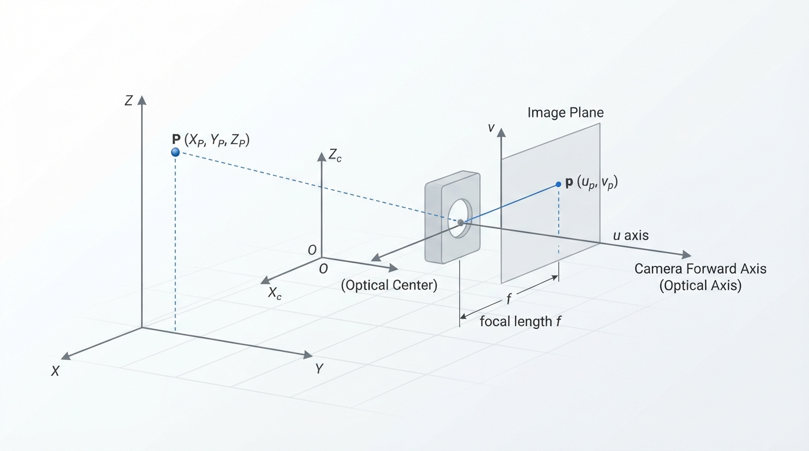
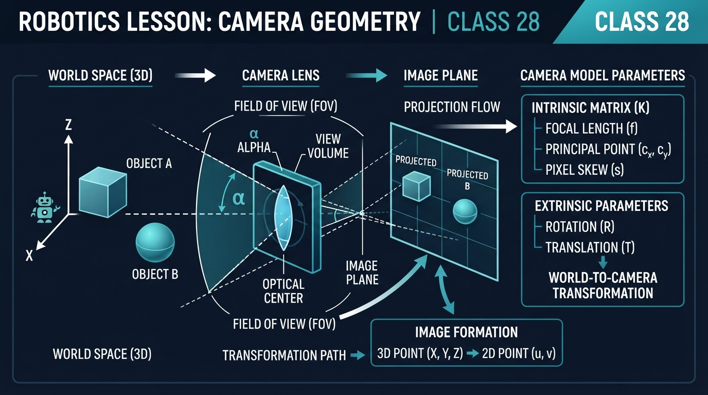
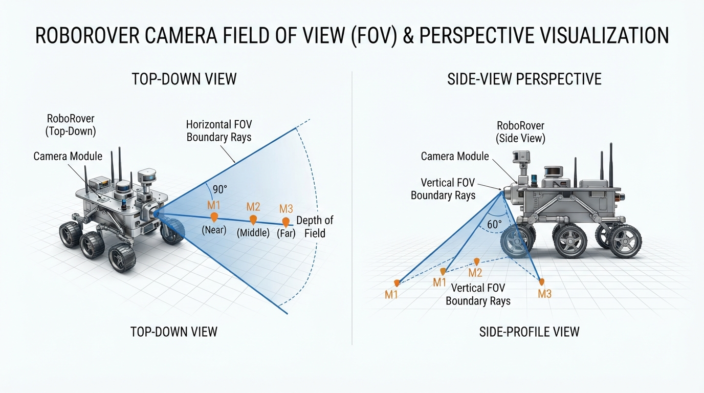
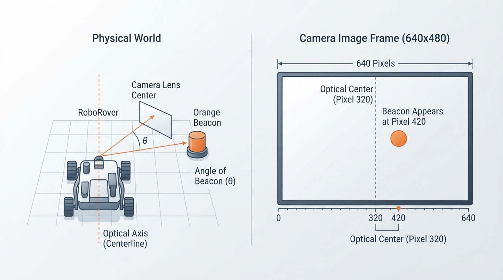
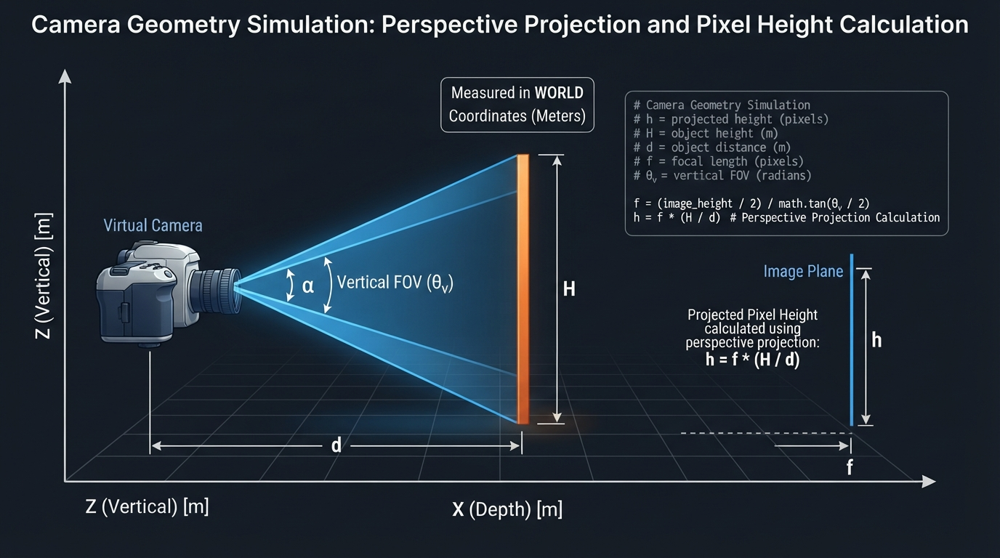

# Class 28: Camera Geometry

## Where We Are in the Robotics Journey

RoboRover has already learned to turn camera images into useful shapes. In the previous class, **Contours and Shape Detection**, it could trace the boundary of a bright orange marker and estimate its shape.

But a camera image is not a flat map of the world.

A large object nearby can look the same size as a small object far away. A straight corridor can appear to narrow toward the horizon. Objects near the edge of the image may look stretched or distorted. To reason about these effects, RoboRover needs **camera geometry**: the relationship between 3D objects in the world and their 2D positions and sizes in an image.

Today we will study two connected ideas:

- **Projection:** how a 3D point becomes a 2D image point.
- **Field of view:** how much of the world the camera can see.

In the next class, **Object Detection**, RoboRover will use image regions to locate objects. Camera geometry will help it interpret those regions: Is an object centered? How large might it be? Is it close enough to matter?

## Today We Will Learn

By the end of this class, you should be able to:

1. Explain why a camera converts a 3D scene into a 2D image.
2. Use the pinhole-camera equation to calculate image position and apparent size.
3. Distinguish camera **intrinsic** parameters from **extrinsic** transformations.
4. Calculate horizontal field of view from focal length and sensor width.
5. Predict how changing distance, focal length, or sensor size changes an image.
6. Identify practical errors caused by camera calibration, lens distortion, and image cropping.
7. Explain the coordinate convention and camera-frame assumptions used by projection equations.

## 2-Minute Recap

A **pixel** is one small location in a digital image. A camera image is an array of pixels arranged in rows and columns.

A **contour** is a curve describing the boundary of a region in an image. For example, RoboRover might threshold orange pixels and find the contour surrounding an orange traffic cone.

A contour tells us where a shape appears in the image. It does not automatically tell us its true 3D size or distance.

Before today, RoboRover could say:

> “The orange shape occupies pixels from column 210 to column 270.”

Today it begins asking:

> “What does that image position mean in the camera’s view of the world?”

## The Big Idea




**Figure:** Projection converts a 3D scene point into a 2D image coordinate, losing some depth information.

Imagine shining a lamp on a small object. The object casts a shadow on a wall. The shadow is a 2D projection of a 3D object.

A camera performs a related operation. Light from the scene passes through the lens and forms an image on a flat sensor. The sensor records only two coordinates:

- horizontal position, often called \(u\), measured in pixels;
- vertical position, often called \(v\), measured in pixels.

The real scene has three coordinates:

- \(X\): sideways position;
- \(Y\): vertical position;
- \(Z\): forward distance from the camera.

So the camera maps:

\[
(X, Y, Z) \longrightarrow (u, v)
\]

This mapping loses information. Different 3D points can land on the same image pixel. A small distant object and a large nearby object may produce equally sized image regions.

That is why a single ordinary camera image usually cannot determine an object’s distance and true size at the same time without additional information.

## See It in Your Head

### AI-Generated Engineering Visual · Professor OS



**How to read this visual:** Start at the camera and trace the optical axis and viewing rays toward the scene, then follow the projected point to the image plane. Identify the camera frame, the image plane, the optical center, and the field-of-view boundaries. Notice that the 3D point has a depth coordinate \(Z\), while its image location records only two coordinates. Ask which different 3D points could produce the same image position or apparent size.




**Figure:** The same physical object occupies fewer image pixels as its distance from the camera increases.

Picture RoboRover facing a long hallway.

Draw a small camera at the left side of the diagram. From the camera, draw two rays:

- one ray going upward and right;
- one ray going downward and right.

Between the rays, draw a triangular wedge. This wedge is a **2D slice** of the camera’s 3D viewing frustum, shown in a side or top view.

Now place three identical orange markers along the centerline:

- one close to RoboRover;
- one halfway down the hallway;
- one far away.

The markers should become smaller in the image as they move farther away. Their apparent height decreases because the same physical height occupies a smaller angle when viewed from farther away.

For a top-down view, draw the camera’s horizontal field of view as two rays spreading outward. A target lies inside the camera view if it falls between those rays.

For a camera image, draw a rectangle representing the sensor. Mark its center. A point directly in front of the camera appears near the image center. A point to the right in the world appears to the right in the image, assuming the camera is not rotated or mirrored.

## Core Concept

### 1. The pinhole-camera model

To make the geometry understandable, engineers often begin with an idealized **pinhole camera**.

A pinhole camera has:

- a tiny opening;
- no lens distortion;
- a flat image surface;
- straight light rays.

The model is not a complete description of a real camera, but it is an excellent first approximation.

The equations below use a camera-coordinate convention in which:

- \(Z\) points forward from the camera;
- \(X\) points to the camera’s right;
- \(Y\) points in the positive vertical image-coordinate direction.

For a computer-vision convention in which image rows increase downward, \(Y\) is commonly taken as positive downward. If a physical coordinate system instead takes vertical \(Y\) as positive upward, the vertical equation requires a minus sign:

\[
v=-f_y\frac{Y}{Z}+c_y
\]

The simple equations in this lesson use the computer-vision convention:

\[
u=f_x\frac{X}{Z}+c_x
\]

\[
v=f_y\frac{Y}{Z}+c_y
\]

Thus, \(u\) increases to the right and \(v\) increases in the selected positive image-coordinate direction. Digital image rows commonly increase downward, so a displayed image is not automatically a physical “upward” coordinate system.

The corresponding length-coordinate equations are written using a **virtual image plane** in front of the pinhole:

\[
x=f\frac{X}{Z}
\]

\[
y=f\frac{Y}{Z}
\]

A physical image plane behind the pinhole produces an inverted optical image; the virtual-plane convention removes that inversion for convenient geometric calculations.

Let:

- \(X\) = horizontal position of a 3D point, in metres;
- \(Y\) = vertical camera-coordinate position of the point, in metres;
- \(Z\) = forward distance from the camera, in metres;
- \(f\) = focal length, in millimetres or another length unit;
- \(x\) = horizontal image coordinate relative to the optical center, in the same length unit as \(f\).

Then the pinhole projection is:

\[
x = f\frac{X}{Z}
\]

Similarly, for the selected vertical convention:

\[
y = f\frac{Y}{Z}
\]

The key feature is the division by \(Z\). If the point moves farther away, its image position and apparent size become smaller.

#### Intrinsic parameters and extrinsic transformation

The parameters that describe how a camera turns camera-frame coordinates into pixel coordinates are called **intrinsic parameters**. In this lesson, the main intrinsic parameters are:

- \(f_x\) and \(f_y\): effective focal lengths in pixels;
- \(c_x\) and \(c_y\): optical-center or principal-point coordinates in pixels.

A camera’s position and orientation relative to a robot or world are described by **extrinsic parameters**. An extrinsic transformation uses rotation and translation to convert a point from a world or robot frame into the camera frame.

This distinction is useful:

- **Intrinsics:** how the camera forms image coordinates;
- **Extrinsics:** where the camera is located and how it is oriented.

A digital camera usually measures pixels rather than millimetres on the sensor. A practical pixel form is:

\[
u = f_x\frac{X}{Z}+c_x
\]

\[
v = f_y\frac{Y}{Z}+c_y
\]

where:

- \(u\) = horizontal pixel coordinate, in pixels;
- \(v\) = vertical pixel coordinate, in pixels;
- \(f_x\) = effective focal length in horizontal pixel units, pixels;
- \(f_y\) = effective focal length in vertical pixel units, pixels;
- \(c_x\) = horizontal coordinate of the optical center, pixels;
- \(c_y\) = vertical coordinate of the optical center, pixels.

The terms \(c_x\) and \(c_y\) shift the coordinate origin from the image corner to the camera’s optical center. They are often called the **principal point**, although the measured principal point may not be exactly at the geometric center of the image.

These equations assume that \((X,Y,Z)\) is already expressed in the **camera coordinate frame**. If a point is initially expressed in a world or robot frame, a camera pose transformation—rotation and translation, called an extrinsic transformation—must be applied first. A rotated or translated camera therefore cannot be handled by substituting world coordinates directly into these equations.

### 2. Field of view

The **field of view**, or FOV, is the angular width or height visible by a camera.

For horizontal field of view:

\[
\mathrm{FOV}_h =
2\arctan\left(\frac{W}{2f}\right)
\]

where:

- \(\mathrm{FOV}_h\) = horizontal field of view, usually in degrees or radians;
- \(W\) = sensor width, in millimetres;
- \(f\) = focal length, in millimetres;
- \(\arctan\) = inverse tangent function.

The factor of 2 appears because the camera’s center line divides the view into two equal halves.

A wider sensor increases the field of view. A longer focal length decreases the field of view.

In everyday language:

- **wide-angle camera:** sees a broad region but makes objects appear smaller;
- **narrow-angle camera:** sees a smaller region but gives more image detail to distant objects.

This description concerns the camera’s geometry. It does not by itself determine image quality, which also depends on resolution, lighting, focus, noise, and lens design.

When calculating FOV from an image rather than a physical sensor specification, use the **effective focal length in pixels** for the current image width:

\[
\mathrm{FOV}_h =
2\arctan\left(\frac{\text{image width in pixels}}{2f_x}\right)
\]

This calculation assumes that \(f_x\) was calibrated for that image resolution and crop. Resizing or cropping an image changes the corresponding pixel coordinates and may require scaled or recalibrated intrinsic parameters.

## Math Without Fear

### Worked numerical example: image position

RoboRover has a camera with:

- horizontal focal length \(f_x = 400\) pixels;
- optical center \(c_x = 320\) pixels.

An orange beacon is located at:

- \(X = 0.50\) metres to the right of the camera’s center line;
- \(Z = 2.00\) metres in front of the camera.

Use:

\[
u = f_x\frac{X}{Z}+c_x
\]

Substitute the values:

\[
u =
400\ \text{pixels}
\left(\frac{0.50\ \text{m}}{2.00\ \text{m}}\right)
+320\ \text{pixels}
\]

\[
u = 400\ \text{pixels}(0.25)+320\ \text{pixels}
\]

\[
u = 100\ \text{pixels}+320\ \text{pixels}
=420\ \text{pixels}
\]

**Interpretation:** the beacon appears at horizontal pixel coordinate \(u=420\). Since the image center is at \(320\) pixels, the beacon appears to the right of the image center.

The units work because metres divide out in \(X/Z\), leaving a unitless ratio. Multiplying by focal length in pixels gives pixels.

### Worked numerical example: horizontal field of view

Suppose the camera sensor is:

- \(W=6.4\) millimetres wide;
- \(f=4.0\) millimetres in focal length.

Then:

\[
\mathrm{FOV}_h =
2\arctan\left(\frac{6.4\ \text{mm}}{2(4.0\ \text{mm})}\right)
\]

The millimetres cancel inside the fraction:

\[
\mathrm{FOV}_h =
2\arctan(0.8)
\]

This gives approximately:

\[
\mathrm{FOV}_h \approx 77.3^\circ
\]

**Interpretation:** the camera sees an angular region about \(77.3^\circ\) wide from left edge to right edge.

The camera’s actual diagonal or vertical field of view may be different. Each direction has its own sensor dimension and effective focal length.

### Worked numerical example: estimating distance from apparent height

Suppose RoboRover knows that an orange marker is \(H=0.30\) metres tall. Its calibrated vertical focal length is \(f_y=400\) pixels, and the marker measures \(h_\text{image}=60\) pixels high.

The marker should be approximately **fronto-parallel**: its relevant face or vertical dimension should be oriented nearly perpendicular to the camera’s viewing direction. If it is tilted, perspective projection can make its projected height substantially different from the assumed physical height.

From:

\[
h_\text{image}=f_y\frac{H}{Z}
\]

solve for distance:

\[
Z=f_y\frac{H}{h_\text{image}}
\]

Substitute:

\[
Z=400\frac{0.30}{60}=2.0\ \text{m}
\]

So the estimated distance is \(2.0\) metres, provided the marker is approximately fronto-parallel, within the calibrated camera model, and measured reliably.

## Worked Robotics Example




**Figure:** A beacon to the right of the camera centerline appears to the right of the optical center in the image.

RoboRover must keep an orange inspection marker near the center of its camera image.

The camera image is 640 pixels wide, so its optical center is approximately:

\[
c_x = 320\ \text{pixels}
\]

After contour detection, the marker’s contour has left edge \(u_\text{left}=390\) pixels and right edge \(u_\text{right}=450\) pixels.

Its image center is:

\[
u_\text{marker}
=
\frac{u_\text{left}+u_\text{right}}{2}
=
\frac{390+450}{2}
=
420\ \text{pixels}
\]

The marker is therefore:

\[
420-320=100\ \text{pixels}
\]

to the right of the optical center.

RoboRover could use this measurement as a steering clue:

- marker left of center: turn slightly left;
- marker right of center: turn slightly right;
- marker near center: continue forward.

This is not yet object detection in the full modern sense. The contour system has only found a region matching earlier rules, such as color or shape. In the next class, Object Detection, we will study methods that identify objects as categories or instances.

A geometry warning is important here: image-center error is not automatically the same as physical sideways distance. A nearby object and a distant object can have the same horizontal pixel error but require different steering responses depending on RoboRover’s camera orientation, vehicle speed, and control design.

For a simple declared convention, define:

\[
e = u_\text{marker}-c_x
\]

where positive \(e\) means that the marker is to the right of the image center. If RoboRover’s steering command is also defined as positive for turning right, a minimal proportional controller could be written as:

\[
s=K_pe
\]

where \(K_p>0\) is a chosen gain. If the vehicle needs to turn left when the marker is right of center, use the opposite sign:

\[
s=-K_pe
\]

The sign is not determined by the image equation alone. It must be declared and tested for the camera mounting and vehicle steering arrangement.

The mapping from image error to a steering command also depends on camera-to-vehicle calibration, controller gains, and camera mounting geometry.

## Python Lab




**Figure:** The simulation combines a world-coordinate 2D slice of the camera frustum with a pinhole-model calculation of apparent image height.

This program models a camera looking at a vertical orange marker. It calculates the marker’s projected image height and draws the camera’s **vertical** field of view in a side view.

The marker has physical height \(H\), and its center is distance \(Z\) from the camera. Using the pinhole model, its approximate image height is:

\[
h_\text{image}=f_y\frac{H}{Z}
\]

Here, \(h_\text{image}\) is measured in pixels when \(f_y\) is measured in pixels.

```python
import math
import matplotlib.pyplot as plt
from matplotlib.patches import Rectangle

# Camera parameters
focal_length_px = 400.0
vertical_focal_length_px = 400.0
image_width_px = 640.0
image_height_px = 480.0

# Marker parameters
marker_height_m = 0.30
distance_m = 2.0

# Pinhole projection: apparent image height in pixels
projected_height_px = (
    vertical_focal_length_px * marker_height_m / distance_m
)

# Horizontal field of view, using the horizontal image dimension
horizontal_fov_rad = 2.0 * math.atan(
    image_width_px / (2.0 * focal_length_px)
)
horizontal_fov_deg = math.degrees(horizontal_fov_rad)

# Vertical field of view for the side-view drawing
vertical_fov_rad = 2.0 * math.atan(
    image_height_px / (2.0 * vertical_focal_length_px)
)
vertical_fov_deg = math.degrees(vertical_fov_rad)
half_vertical_fov_deg = vertical_fov_deg / 2.0

# Verification statements: these verify the numerical claims in the lesson.
assert abs(projected_height_px - 60.0) < 1e-6
assert abs(horizontal_fov_deg - 77.31961650818018) < 1e-6
assert abs(vertical_fov_deg - 61.92751306414704) < 1e-6
assert abs(
    2.0 * half_vertical_fov_deg - vertical_fov_deg
) < 1e-6

print("Projected marker height: {:.1f} pixels".format(
    projected_height_px
))
print("Horizontal field of view: {:.2f} degrees".format(
    horizontal_fov_deg
))
print("Vertical field of view: {:.2f} degrees".format(
    vertical_fov_deg
))

# Draw a side-view camera wedge and marker.
# The rays use the vertical FOV, not the horizontal FOV.
fig, ax = plt.subplots(figsize=(8, 5))

# Camera position
camera_x = 0.0
camera_y = 0.0

# Draw rays representing the top and bottom of the side-view FOV.
# This is a 2D slice of a 3D camera frustum.
view_distance_m = 3.0
ray_angle_rad = math.radians(half_vertical_fov_deg)
top_x = view_distance_m
top_y = math.tan(ray_angle_rad) * view_distance_m
bottom_x = view_distance_m
bottom_y = -top_y

ax.plot(
    [camera_x, top_x],
    [camera_y, top_y],
    color="steelblue",
    label="vertical FOV boundary"
)
ax.plot(
    [camera_x, bottom_x],
    [camera_y, bottom_y],
    color="steelblue"
)

# Draw the marker as a vertical rectangle at the chosen distance.
marker_bottom_m = -marker_height_m / 2.0
marker = Rectangle(
    (distance_m, marker_bottom_m),
    0.05,
    marker_height_m,
    facecolor="orange",
    edgecolor="black",
    label="orange marker"
)
ax.add_patch(marker)

ax.scatter(
    [camera_x],
    [camera_y],
    color="black",
    s=50,
    label="camera"
)
ax.axhline(0.0, color="gray", linewidth=0.8)

ax.set_xlim(-0.1, view_distance_m + 0.2)
ax.set_ylim(-2.0, 2.0)
ax.set_aspect("equal", adjustable="box")
ax.set_xlabel("Forward distance (m)")
ax.set_ylabel("Vertical position (m)")
ax.set_title("RoboRover camera vertical field of view")
ax.legend()
ax.grid(True, alpha=0.3)

plt.tight_layout()
plt.show()
```

Important lines:

- `projected_height_px = ...` applies the pinhole size relationship.
- `horizontal_fov_rad = ...` calculates horizontal FOV in radians.
- `vertical_fov_rad = ...` calculates the vertical FOV used by the side-view plot.
- `half_vertical_fov_deg = vertical_fov_deg / 2.0` derives the half-angle from the calculated FOV rather than duplicating a manually chosen constant.
- `math.degrees(...)` converts radians to degrees.
- The `assert` statements verify the numerical results used by the program with a tolerance appropriate for floating-point teaching code.
- The plot shows a 2D side-view slice of the camera frustum and a marker. The marker is not drawn at its pixel size; it is drawn in world coordinates so that the viewing geometry is easy to inspect.

The pixel-based FOV calculation assumes that the effective focal length is expressed in pixels and corresponds to the current image resolution and crop. If the image is resized or cropped before this calculation, the image dimensions and intrinsic parameters must be adjusted consistently.

## Mini Simulation or Game

### Predict before you run it

Suppose the marker moves from \(2.0\) metres to \(4.0\) metres away while its physical height stays \(0.30\) metres.

Will its projected height:

1. stay at 60 pixels,
2. become 30 pixels, or
3. become 120 pixels?

Write down your prediction before running the program.

The answer follows from:

\[
h_\text{image}=f_y\frac{H}{Z}
\]

Doubling \(Z\) halves the projected height. Therefore the expected answer is **30 pixels**.

To turn the lab into a small experiment, change:

```python
distance_m = 2.0
```

to:

```python
distance_m = 4.0
```

Then run the program again. The assertion for 60 pixels will no longer be appropriate, so change the relevant calculation and assertion to:

```python
vertical_focal_length_px = 400.0
marker_height_m = 0.30
distance_m = 4.0
projected_height_px = (
    vertical_focal_length_px * marker_height_m / distance_m
)

assert abs(projected_height_px - 30.0) < 1e-6
print("Projected marker height: {:.1f} pixels".format(
    projected_height_px
))
```

Now investigate three variables. For each trial, predict first, run the program, and record the result:

| Trial | Focal length \(f_y\) | Marker height \(H\) | Distance \(Z\) | Predicted height | Measured output |
|---|---:|---:|---:|---:|---:|
| 1 | 400 px | 0.30 m | 2.0 m | 60 px | |
| 2 | 400 px | 0.30 m | 4.0 m | 30 px | |
| 3 | 800 px | 0.30 m | 2.0 m | 120 px | |
| 4 | 400 px | 0.60 m | 2.0 m | 120 px | |

Try changing `marker_height_m` to `0.60`. Predict the new image height before running the program. Increasing the physical height by a factor of two should double the projected image height, provided the marker remains at the same distance and remains inside the camera view.

This experiment demonstrates a major camera principle:

> Apparent size depends on both physical size and distance.

It also shows that increasing focal length increases projected pixel size in this simplified model, while narrowing the camera’s field of view.

## What Should Happen?

For the original program values:

- marker height: \(0.30\) metres;
- distance: \(2.0\) metres;
- vertical focal length: \(400\) pixels;

the projected marker height is **60 pixels**, verified by the assertion in the code.

The calculated horizontal field of view is approximately **77.32 degrees**, also verified by the assertion. The vertical field of view used for the side-view drawing is approximately **61.93 degrees**.

When you double the distance to \(4.0\) metres, the projected height should become **30 pixels**. When you double the marker height to \(0.60\) metres at \(2.0\) metres distance, the projected height should become **120 pixels**. When you double the vertical focal length to \(800\) pixels while keeping marker size and distance unchanged, the projected height should also become **120 pixels**.

The plot should show the marker between the two vertical-field-of-view boundary rays.

For the investigation table, a correct implementation should produce outputs that agree with the predicted values to the displayed precision. If the output differs slightly after changing parameters, first check whether the changed parameter was used in the projection equation and whether the old assertion was updated. A large or inconsistent difference suggests an implementation error rather than measurement uncertainty, because these values are calculated exactly by the simplified model.

## Common Mistakes

### Mistake 1: Treating an image as a map

The top-left pixel is not automatically the top-left position in the world. The camera may be tilted, mounted sideways, or pointed downward.

### Mistake 2: Forgetting the optical center

The pixel coordinate \(u=0\) is an image edge, not usually the camera’s forward direction. The forward direction projects near \(c_x\), the optical center.

### Mistake 3: Ignoring the coordinate convention

The equations depend on the selected camera-frame and image-coordinate signs. Digital image rows commonly increase downward, while physical height is often described as increasing upward. A sign change may therefore be needed when converting between those conventions.

### Mistake 4: Applying camera-frame equations to world coordinates

The pinhole equations require \((X,Y,Z)\) to be expressed relative to the camera. A point in a robot or world frame must first be transformed using the camera’s rotation and translation.

### Mistake 5: Mixing millimetres, metres, and pixels

In:

\[
x=f\frac{X}{Z}
\]

\(f\), \(X\), and \(Z\) must use compatible length units. If \(X\) is in metres and \(Z\) is in centimetres, the ratio is wrong unless one is converted.

In the pixel form, \(f_x\) and \(f_y\) are effective focal lengths in pixels. They should correspond to the current image resolution and crop.

### Mistake 6: Assuming a wider FOV always improves vision

A wider FOV lets RoboRover see more area, but the same image width is spread over more angles. A distant object may occupy fewer pixels and become harder to recognize.

### Mistake 7: Ignoring lens distortion

Real lenses may bend straight lines, especially near the image edges. A wide-angle lens can make geometry near the borders noticeably different from the simple pinhole model. Calibration estimates correction parameters so that image measurements better match the physical scene.

### Mistake 8: Confusing cropping with a new lens

Cropping the image removes outer pixels and reduces the visible region. It may appear to “zoom in,” but it does not create new optical detail. Digital resizing also cannot recover detail that was never captured.

### Mistake 9: Using apparent height for a tilted object without checking orientation

The distance estimate \(Z=f_yH/h_\text{image}\) assumes that the measured image height corresponds reasonably to the known physical height. A tilted or oblique object may have a different projected height. Treat the estimate as a model-based approximation, not a guaranteed measurement.

## Try It Yourself

### Challenge: Find the camera’s horizontal field of view

Write a short Python calculation, or modify the lab, for:

- sensor width \(W=8.0\) millimetres;
- focal length \(f=5.0\) millimetres.

Use:

\[
\mathrm{FOV}_h =
2\arctan\left(\frac{W}{2f}\right)
\]

Report the result in degrees and explain whether it is wider or narrower than the original camera’s approximately \(77.32^\circ\) horizontal field of view.

The result should be approximately \(77.32^\circ\), so it is essentially the same width as the original example: both have \(W/f=1.6\).

A complete answer should include:

1. the substituted equation;
2. the numerical result in degrees;
3. the comparison with \(77.32^\circ\);
4. a statement that equal \(W/f\) ratios produce equal FOV values in this model.

**Optional extension:** keep the sensor width at \(8.0\) millimetres and compare focal lengths of \(3.0\) millimetres and \(8.0\) millimetres. Predict which camera gives RoboRover a wider view before calculating.

## Quick Quiz

1. What happens to the projected image size of an object if its distance from the camera doubles while its physical size stays constant?

2. In the equation \(u=f_xX/Z+c_x\), what does \(c_x\) represent?

3. A camera has sensor width \(W=6\) millimetres and focal length \(f=6\) millimetres. Is its horizontal field of view wider or narrower than a camera with the same sensor width and focal length \(f=3\) millimetres?

4. Why can a contour’s pixel width fail to reveal an object’s true physical width?

5. What must be done if a 3D point is given in a world coordinate frame rather than the camera coordinate frame?

## Answers

1. Its projected image size becomes half as large, according to the pinhole approximation \(h_\text{image}=fH/Z\).

2. \(c_x\) is the horizontal coordinate of the optical center, measured in pixels. It shifts the centered camera coordinate into image coordinates.

3. The \(f=6\) millimetre camera has the narrower field of view. Increasing focal length narrows the view for the same sensor width.

4. Pixel width depends on both the object’s physical width and its distance from the camera. Lens distortion, camera angle, and calibration errors can also affect the measurement.

5. Transform the point from the world frame into the camera frame using the camera’s extrinsic rotation and translation before applying the projection equations.

## Real Robot Connection

RoboRover can use camera geometry in several practical ways:

- center a detected marker in its image;
- estimate the distance to an object when the object’s physical size is known;
- decide whether an object is likely to leave the camera’s view;
- choose between a wide camera for search and a narrow camera for detail;
- convert pixel measurements into approximate angular directions.

However, the pinhole model is only an approximation. Real systems must account for:

- camera mounting angle;
- lens distortion;
- optical-center calibration;
- image resizing and cropping;
- rolling shutter, where different image rows are captured at slightly different times;
- motion blur;
- lighting and reflections;
- uncertain object dimensions.

A particularly important failure mode occurs when RoboRover assumes every orange contour is the same known-size marker. If a small orange object and a large orange object produce the same image size, distance estimates based only on image size can be wrong. Geometry provides a model; sensors and algorithms must still verify whether the model’s assumptions are true.

In the next class, **Object Detection**, RoboRover will move beyond “this group of pixels has a contour.” It will learn how systems locate and label objects such as markers, boxes, or wheels. Camera geometry will remain underneath that process, because every detected object still occupies a position and size in an image.

## Vocabulary

- **Projection:** The mapping of a 3D scene point to a 2D image location.
- **Pinhole-camera model:** An ideal camera model in which straight rays project 3D points onto an image plane.
- **Focal length:** A camera parameter controlling how strongly the scene is projected onto the image plane; longer focal length gives a narrower field of view for the same sensor size.
- **Field of view (FOV):** The angular region visible to a camera, usually specified horizontally, vertically, or diagonally.
- **Optical center:** The image location associated approximately with the camera’s forward viewing direction; commonly represented by \(c_x\) and \(c_y\).
- **Principal point:** The calibrated pixel location corresponding to the optical center in the image; it is represented by \(c_x\) and \(c_y\) in the simplified equations.
- **Intrinsic parameters:** Camera parameters describing image formation, including effective focal lengths and the principal point.
- **Pixel coordinate:** A numbered horizontal or vertical location in an image.
- **Camera coordinate frame:** The coordinate system whose origin and axes are fixed relative to the camera; projection equations require 3D points to be expressed in this frame.
- **Extrinsic transformation:** The rotation and translation used to convert coordinates between a world or robot frame and the camera frame.
- **Lens distortion:** A departure from ideal straight-line projection caused by the physical lens.
- **Calibration:** Measuring or estimating camera parameters so image coordinates can be related more accurately to physical geometry.
- **Apparent size:** The size an object occupies in an image, which depends on physical size, distance, camera parameters, and orientation.

## Further Learning

This section is self-directed search guidance rather than a list of vetted references. Useful search terms for continued study include:

- “pinhole camera model robotics”
- “camera intrinsic parameters”
- “horizontal vertical diagonal field of view”
- “camera calibration lens distortion”
- “image coordinates and optical center”
- “projective geometry for computer vision”
- “camera extrinsic transformation”

A good next experiment is to photograph a ruler or rectangular sign at several distances and compare its pixel height. Keep the camera fixed, record the distance, and examine whether doubling the distance approximately halves its image height.

For each trial, record:

| Trial | Distance | Measured pixel height | Predicted pixel height | Difference |
|---|---:|---:|---:|---:|

A reasonable beginner result should show the predicted and measured values following the same inverse-distance trend. They will not necessarily match exactly. Report the measurement uncertainty caused by pixel rounding, object-edge ambiguity, camera alignment, and lens distortion. For example, if each edge can be located only within about 2 pixels, the height uncertainty is approximately 4 pixels. Agreement within that uncertainty is more meaningful than exact equality.

If the measured values do not follow the inverse-distance trend at all, check the implementation and the experiment setup before blaming the model. A model error changes the pattern systematically; measurement uncertainty usually causes smaller variations around the pattern. A tilted target, changing camera position, inconsistent edge selection, or incorrect distance measurement can produce larger discrepancies.

## Next Class

**Class 29: Object Detection**

RoboRover will learn how a vision system can locate and identify objects in an image. We will connect detected bounding regions to the camera geometry learned here, while keeping a clear distinction between finding a shape, classifying an object, and estimating its 3D position.