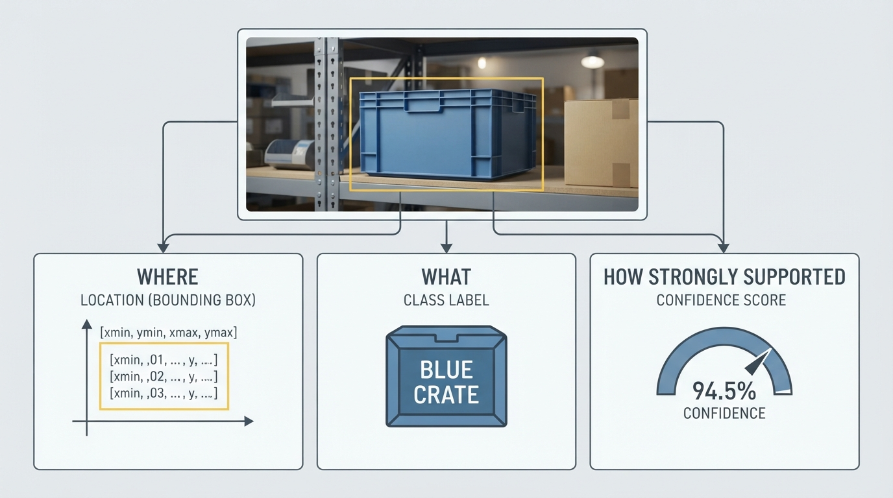
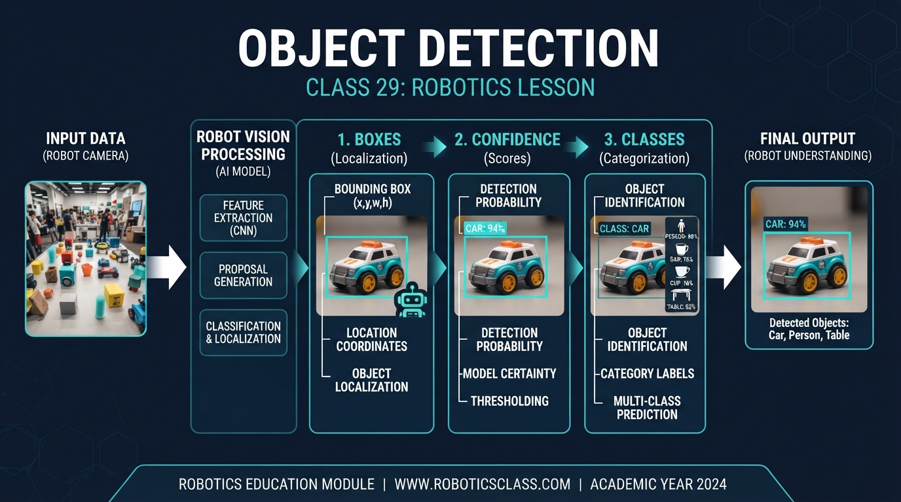
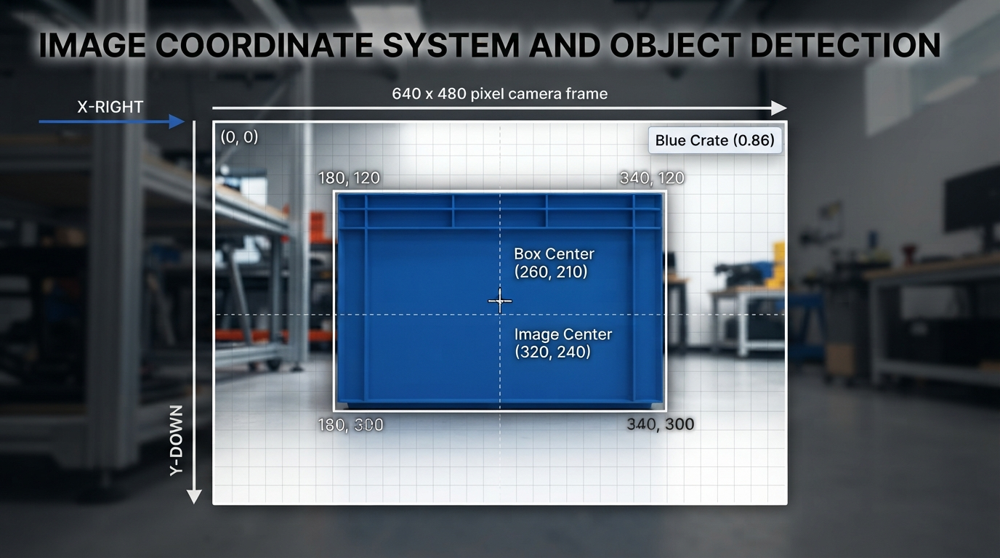
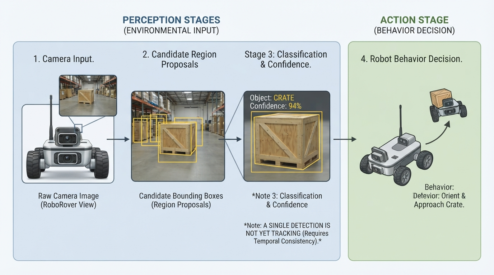

# Class 29: Object Detection

## Where We Are in the Robotics Journey

RoboRover has just learned **camera geometry**. Its camera produces an image made from pixels, and those pixels can be related to directions in the world. A pixel near the center of the image usually points along a different viewing direction from a pixel near the edge.

But camera geometry alone does not tell RoboRover what it is looking at.

A geometry system might tell RoboRover:

> “This bright shape is 120 pixels from the image center.”

Object detection adds a more useful answer:

> “There is probably a blue supply crate here, inside this rectangular image region, and the detector is fairly confident.”

In this class, we will learn three connected ideas:

1. **Boxes** describe where an object appears in an image.
2. **Classes** describe what kind of object it may be.
3. **Confidence** describes how strongly the detector supports that result.

In the next class, RoboRover will examine detections in several images and learn how to decide whether an object is the same object moving through time. That is **tracking**.

## Today We Will Learn

By the end of this class, you should be able to:

- explain what an object-detection result contains;
- read a bounding box using pixel coordinates;
- distinguish an object’s class from its confidence;
- calculate a box center and size;
- use a confidence threshold carefully;
- recognize why detections can be wrong;
- understand why one image is not enough for tracking.

## 2-Minute Recap

A camera image is a grid of pixels. We can describe a pixel using image coordinates:

- \(x\): horizontal position, measured in pixels, increasing to the right;
- \(y\): vertical position, measured in pixels, increasing downward in the usual image convention.

Camera geometry helps connect image positions to viewing directions. For example, if RoboRover sees an object to the right of the image center, the object is probably somewhere to the rover’s right—but perspective, camera mounting, and distance still matter.

A camera pixel does not automatically carry a label such as “crate.” It is only measured brightness or color information. An object detector is a software system that analyzes patterns across many pixels.

## The Big Idea




**Figure:** An object-detection result combines location, category, and evidence strength.

Imagine placing a transparent rectangle over every object RoboRover notices.

For each rectangle, the detector reports something like:

```text
class: supply_crate
box: left=180 px, top=120 px, right=340 px, bottom=300 px
confidence: 0.86
```

This result means:

- the detector thinks the object is a **supply crate**;
- it occupies an approximate rectangle in the image;
- the detector assigns a confidence score of 0.86.

A detection is therefore not just “I saw a crate.” It is a structured claim:

\[
\text{detection} =
(\text{where},\ \text{what},\ \text{how strongly supported})
\]

The three parts are related but different.

- **Where:** the bounding box.
- **What:** the class.
- **How strongly supported:** the confidence score.

A detector may get one part right and another part wrong. It might draw a good box around an object but call a cone a beacon. It might identify a crate correctly but draw a box that is too large.

## See It in Your Head

### AI-Generated Engineering Visual · Professor OS



**How to read this visual:** Trace the signal or idea from left to right. Match each block to the lesson explanation, then predict what would change if one block produced a wrong value.


Picture RoboRover facing a small indoor test arena.

At the front left is a blue supply crate. Near the center is a yellow traffic cone. At the right edge is a glowing navigation beacon.

An illustrator could draw:

- the full camera image as a 640-pixel-wide by 480-pixel-high rectangle;
- a blue box around the crate;
- a yellow box around the cone;
- a red box around the beacon;
- a label above each box, such as `crate 0.86`;
- coordinate arrows showing \(x\) increasing rightward and \(y\) increasing downward;
- a small dot at the center of each box.

The box does not show the object’s exact physical boundary. It is an image-space approximation. It may include a little floor, shadow, or background.

## Core Concept

### 1. Bounding boxes

A common box representation uses four values:

\[
B=(x_{\min},y_{\min},x_{\max},y_{\max})
\]

where:

- \(x_{\min}\) is the left edge, in pixels;
- \(y_{\min}\) is the top edge, in pixels;
- \(x_{\max}\) is the right edge, in pixels;
- \(y_{\max}\) is the bottom edge, in pixels.

The box width and height are:

\[
w=x_{\max}-x_{\min}
\]

\[
h=y_{\max}-y_{\min}
\]

where \(w\) and \(h\) are measured in pixels.

The box center is:

\[
c_x=\frac{x_{\min}+x_{\max}}{2}
\]

\[
c_y=\frac{y_{\min}+y_{\max}}{2}
\]

A different common representation is:

\[
B=(c_x,c_y,w,h)
\]

Both formats describe the same rectangle if converted correctly. Engineering mistakes often happen when code expects one format but receives the other.

### 2. Classes

A **class** is a category chosen from the detector’s known vocabulary.

For RoboRover, a small vocabulary might be:

```text
crate
cone
beacon
person
```

A class is not necessarily a complete description. “Crate” does not tell us the crate’s distance, orientation, or physical size. It only identifies the category the detector believes fits best.

A detector trained with classes `crate`, `cone`, and `beacon` cannot reliably produce a meaningful `wheel` result unless `wheel` was included in its design and training. The class list is part of the system specification.

### 3. Confidence

A confidence score is a numerical measure of how strongly the detector supports a proposed result. It is often written between 0 and 1:

- 0.95: strong support;
- 0.55: uncertain;
- 0.10: weak support.

Do not automatically interpret confidence as a perfectly calibrated probability. A score of 0.80 does not guarantee that exactly 80 out of 100 such detections are correct. Its meaning depends on the detector, training data, evaluation method, and operating conditions.

A robot usually applies a **confidence threshold**. If the threshold is 0.60, it may accept detections with confidence at least 0.60 and reject weaker candidates.

That is a decision rule, not a magical truth detector.

- A high threshold reduces many weak false alarms but may miss real objects.
- A low threshold finds more possible objects but may produce more false alarms.

The correct threshold depends on the task. Missing a person near a moving robot is more serious than displaying an extra box in a harmless monitoring application.

## Math Without Fear

Suppose an image is 640 px wide and 480 px high. A crate is detected with:

\[
B=(180\text{ px},120\text{ px},340\text{ px},300\text{ px})
\]

The width is:

\[
w=340\text{ px}-180\text{ px}=160\text{ px}
\]

The height is:

\[
h=300\text{ px}-120\text{ px}=180\text{ px}
\]

The center is:

\[
c_x=\frac{180\text{ px}+340\text{ px}}{2}=260\text{ px}
\]

\[
c_y=\frac{120\text{ px}+300\text{ px}}{2}=210\text{ px}
\]

The box area in the image is:

\[
A=w h=(160\text{ px})(180\text{ px})=28{,}800\text{ px}^2
\]

The unit \(\text{px}^2\) means square pixels. It is an image measurement, not the physical area of the crate.

The image center is:

\[
(320\text{ px},240\text{ px})
\]

So the detected crate center, \((260\text{ px},210\text{ px})\), is 60 px left and 30 px above the image center. This tells RoboRover where the crate appears in the camera image. It does **not**, by itself, tell RoboRover the crate’s distance in meters.

If the confidence is 0.86 and the operating threshold is 0.60, the detection passes the threshold because:

\[
0.86 \geq 0.60
\]

Interpretation: RoboRover may use this candidate as an accepted crate detection, while remembering that the result remains an estimate.

## Worked Robotics Example




**Figure:** The box edges can be used to calculate width, height, and center in pixel units.

RoboRover must look for a blue supply crate before driving toward a loading station. Its detector returns this result:

```text
image size: 640 px by 480 px
class: crate
box: (180 px, 120 px, 340 px, 300 px)
confidence: 0.86
```

First, RoboRover calculates the box center: \((260\text{ px},210\text{ px})\).

Because the image center is \((320\text{ px},240\text{ px})\), the crate appears left of and above the image center. A steering controller might later use this image offset, but that is beyond today’s main topic.

Now suppose a second candidate is:

```text
class: crate
box: (170 px, 110 px, 350 px, 315 px)
confidence: 0.42
```

This second candidate may be a duplicate, a shadow, or a weak alternative interpretation. With a threshold of 0.60, RoboRover rejects it for now.

Important engineering point: rejecting a low-confidence candidate does not prove that no crate exists. It only means the current detection system does not have enough support under the chosen rule.

## Python Lab

This program creates a small, artificial detection scene. It draws three candidate detections and applies a confidence threshold. It is not a trained vision model; it is a transparent simulation for learning boxes, classes, and confidence.

**Predict before you run it:**  
Which candidates will remain when the threshold is `0.60`? What will be the center of the accepted crate box?

```python
import matplotlib.pyplot as plt
from matplotlib.patches import Rectangle

# Each detection uses:
# class name, (left, top, right, bottom) in pixels, confidence.
detections = [
    ("crate", (180, 120, 340, 300), 0.86),
    ("cone", (390, 170, 455, 315), 0.73),
    ("beacon", (500, 80, 580, 190), 0.42),
]

threshold = 0.60

accepted = []
for class_name, box, confidence in detections:
    if confidence >= threshold:
        accepted.append((class_name, box, confidence))

# Verify exact simulation facts used in the lesson.
assert len(accepted) == 2
assert accepted[0][0] == "crate"
assert accepted[1][0] == "cone"

crate_box = accepted[0][1]
crate_center_x = (crate_box[0] + crate_box[2]) / 2.0
crate_center_y = (crate_box[1] + crate_box[3]) / 2.0

assert crate_center_x == 260.0
assert crate_center_y == 210.0

print("Confidence threshold:", threshold)
print("Accepted detections:", len(accepted))
print("Accepted classes:", [item[0] for item in accepted])
print("Crate center: ({:.0f} px, {:.0f} px)".format(
    crate_center_x, crate_center_y
))

# Draw a simple camera image.
fig, ax = plt.subplots(figsize=(8, 5))
ax.set_xlim(0, 640)
ax.set_ylim(480, 0)  # Image coordinates: y increases downward.
ax.set_aspect("equal")
ax.set_title("RoboRover's simulated object detections")
ax.set_xlabel("x position (pixels)")
ax.set_ylabel("y position (pixels)")

colors = {
    "crate": "royalblue",
    "cone": "darkorange",
    "beacon": "crimson",
}

for class_name, box, confidence in detections:
    left, top, right, bottom = box
    width = right - left
    height = bottom - top

    # Dashed boxes show candidates that fail the threshold.
    linestyle = "-" if confidence >= threshold else "--"
    alpha = 1.0 if confidence >= threshold else 0.45

    rectangle = Rectangle(
        (left, top),
        width,
        height,
        fill=False,
        linewidth=2,
        linestyle=linestyle,
        edgecolor=colors[class_name],
        alpha=alpha,
    )
    ax.add_patch(rectangle)

    label = "{} {:.2f}".format(class_name, confidence)
    ax.text(
        left,
        max(15, top - 5),
        label,
        color=colors[class_name],
        alpha=alpha,
    )

# Mark the image center.
ax.plot(320, 240, "k+", markersize=10, label="image center")
ax.legend(loc="lower left")
plt.tight_layout()
plt.show()
```

Important lines:

- `detections` stores the class, box, and confidence together.
- `if confidence >= threshold` applies the acceptance rule.
- The center calculation converts left/right and top/bottom edges into a useful point.
- `ax.set_ylim(480, 0)` makes the graph follow the usual image convention, where downward is increasing \(y\).
- Dashed, faint boxes represent candidates that were not accepted.

## Mini Simulation or Game

Play “detector operator” with the program.

Change `threshold` to:

1. `0.80`
2. `0.50`
3. `0.30`

Before each run, predict:

- how many candidates will be accepted;
- which class names will remain;
- whether the beacon will appear as an accepted detection.

Then run the program and inspect the solid and dashed boxes.

This is a miniature version of a real engineering trade-off:

- At a high threshold, RoboRover may be cautious and miss uncertain objects.
- At a low threshold, RoboRover may see more possibilities but need another method to reject mistakes.

The boxes themselves do not change when the threshold changes. Only the decision about which candidates to use changes.

## What Should Happen?

For the original threshold of `0.60`:

- the crate with confidence 0.86 is accepted;
- the cone with confidence 0.73 is accepted;
- the beacon with confidence 0.42 is rejected;
- two boxes are accepted;
- the crate center is \((260\text{ px},210\text{ px})\).

At threshold `0.80`, only the crate should remain.

At threshold `0.50`, the crate and cone should remain, while the beacon should still be rejected.

At threshold `0.30`, all three candidates should remain.

These results follow directly from comparing each confidence value with the threshold. The simulation does not improve the detector; it only demonstrates how a later decision rule uses detector output.

## Common Mistakes

### Treating confidence as certainty

A confidence score is evidence, not a guarantee. A detector can be confidently wrong when lighting, viewpoint, or object appearance differs from its training examples.

### Mixing coordinate conventions

Some programs use `(left, top, right, bottom)`. Others use `(center_x, center_y, width, height)`. Confusing these formats can produce boxes in absurd locations or with negative dimensions.

### Forgetting image coordinates

In ordinary mathematical graphs, \(y\) often increases upward. In most image arrays and displays, \(y\) increases downward. A vertical sign mistake can make RoboRover steer in the wrong direction.

### Assuming the box is a physical measurement

A 160-pixel-wide box does not mean the object is 160 millimeters wide. Pixel size depends on distance, camera focal length, and perspective.

### Using one threshold for every situation

A threshold suitable for a classroom display may be unsuitable for a safety-related robot. The cost of a false positive and a missed detection matters.

### Ignoring partial visibility

A crate partly hidden behind a wall may receive a smaller or poorly positioned box. The detector is estimating from visible evidence, not seeing through the wall.

## Try It Yourself

### Challenge

Add a fourth candidate detection to the program:

```text
class: crate
box: (190, 130, 330, 290)
confidence: 0.58
```

Then answer:

1. Is it accepted at threshold 0.60?
2. Is it accepted at threshold 0.50?
3. What is its center in pixels?

Use the same center equations from the lesson.

### Optional extension

Add a printed message for every candidate:

```text
ACCEPT crate 0.86
REJECT beacon 0.42
```

Then change the code so the message includes the box center for accepted detections.

Do not add tracking yet. In the next class, we will use detections from multiple frames to study that problem properly.

## Quick Quiz

1. What three kinds of information are commonly included in an object-detection result?

2. A box is represented as \((40\text{ px},50\text{ px},140\text{ px},170\text{ px})\). What are its width, height, and center?

3. A detector reports confidence 0.48 and the chosen threshold is 0.60. Should the candidate pass the threshold?

4. Why does a bounding box width measured in pixels not directly tell RoboRover the object’s physical width in meters?

## Answers

1. The result includes where the object is, usually as a bounding box; what it is, as a class; and how strongly the detector supports it, as a confidence score.

2. Width:

\[
140\text{ px}-40\text{ px}=100\text{ px}
\]

Height:

\[
170\text{ px}-50\text{ px}=120\text{ px}
\]

Center:

\[
\left(\frac{40+140}{2},\frac{50+170}{2}\right)
=(90\text{ px},110\text{ px})
\]

3. No. Since \(0.48<0.60\), it fails this threshold rule.

4. Pixel size depends on distance, perspective, and camera geometry. The same physical object can occupy different numbers of pixels when it moves closer to or farther from the camera.

## Real Robot Connection




**Figure:** Detection supplies evidence to later robot behaviors; it does not by itself decide what the robot should do.

A real RoboRover detection pipeline may look like this:

```text
camera image
    ↓
detector proposes candidate boxes
    ↓
each candidate receives a class and confidence
    ↓
software applies thresholds and task rules
    ↓
robot may display, avoid, approach, or ignore an object
```

The detector itself does not automatically decide what the robot should do. “There is probably a crate at this image location” is perception. “Drive toward the crate” is a later behavior decision.

Practical failure modes include:

- dim or changing illumination;
- glare on shiny surfaces;
- motion blur while the rover moves;
- objects partly hidden;
- unusual object colors or shapes;
- camera vibration;
- processing delay, so the displayed box describes an older image;
- a threshold that is too strict or too permissive.

The connection to **camera geometry** is direct: a box gives image-space location, while geometry helps interpret image position and possibly estimate direction or distance under suitable assumptions.

The connection to **tracking** is also direct. A single detection says, “I see a candidate here in this frame.” Tracking asks, “Is the candidate in the next frame the same object, and where did it move?” Tracking over time will be the focus of the next class.

## Vocabulary

**Object detection:** Finding possible objects in an image and reporting their locations, classes, and confidence scores.

**Bounding box:** A rectangle in image coordinates that approximately surrounds a detected object.

**Class:** A category assigned to a detection, such as `crate`, `cone`, or `beacon`.

**Confidence score:** A numerical score indicating how strongly a detector supports a proposed class-and-box result. It is not automatically a perfectly calibrated probability.

**Confidence threshold:** A rule that accepts or rejects a candidate according to its confidence score.

**Pixel:** A small picture element in a digital image.

**Image coordinates:** A coordinate system used to locate pixels or boxes. In this lesson, \(x\) increases rightward and \(y\) increases downward.

**Candidate detection:** A proposed result that may later be accepted or rejected.

## Further Learning

For further study, look for resources on:

- image coordinate systems and bounding-box formats;
- precision and recall in object detection;
- confusion matrices for classification;
- intersection over union, often abbreviated IoU;
- confidence-threshold selection;
- detector latency and real-time perception;
- synthetic images for testing vision software.

Intersection over union and duplicate-box handling are useful next steps, but they are not required to understand today’s three foundations: box, class, and confidence.

## Next Class

# Class 30: Tracking Objects Over Time

Next, RoboRover will receive detections from several camera frames. We will compare box positions over time and ask whether a crate in one frame is probably the same crate in the next.

The key transition is:

\[
\text{one detection in one image}
\quad\longrightarrow\quad
\text{an object hypothesis across many images}
\]

That is the beginning of object tracking.
