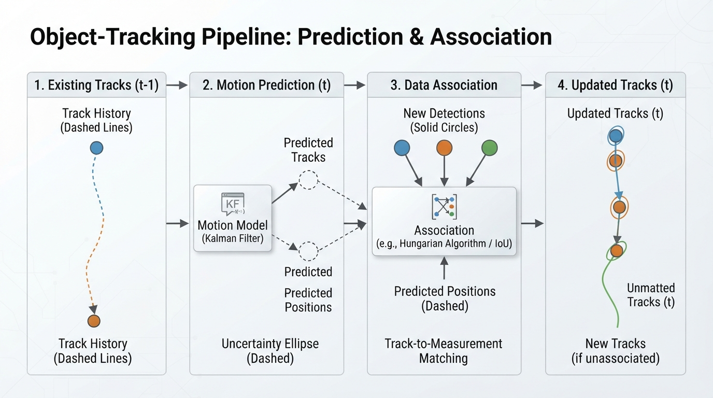
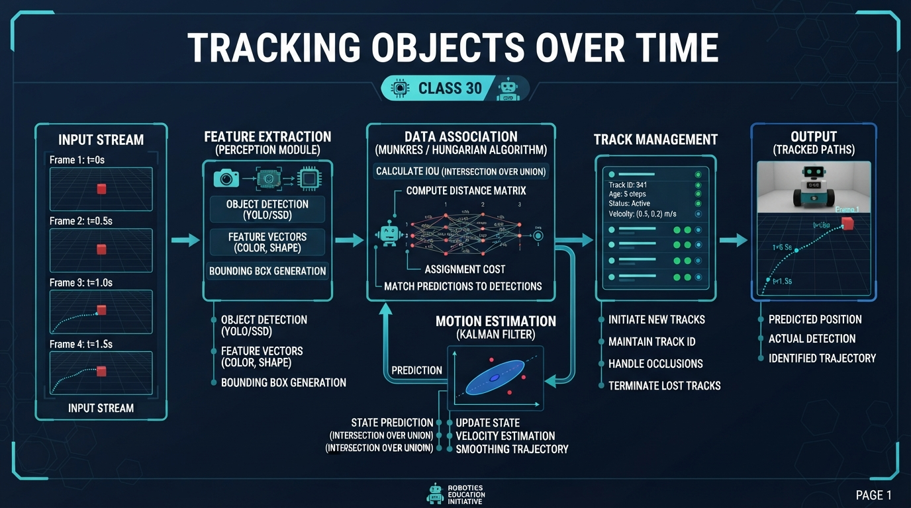
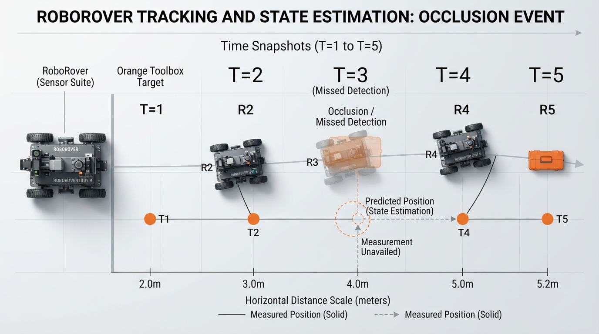
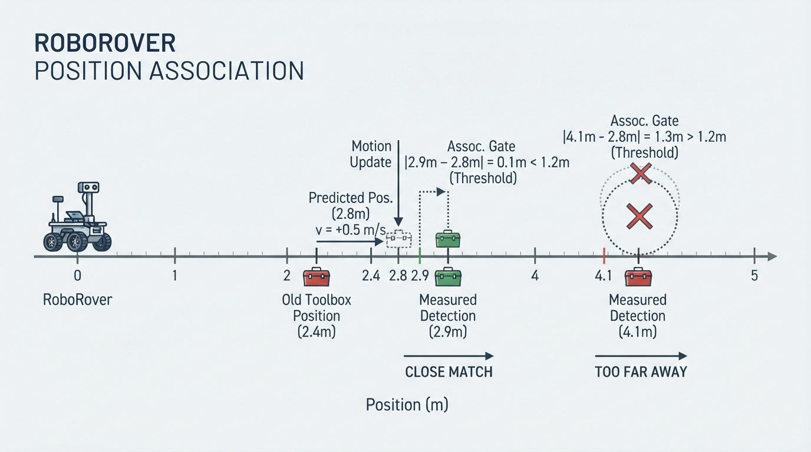
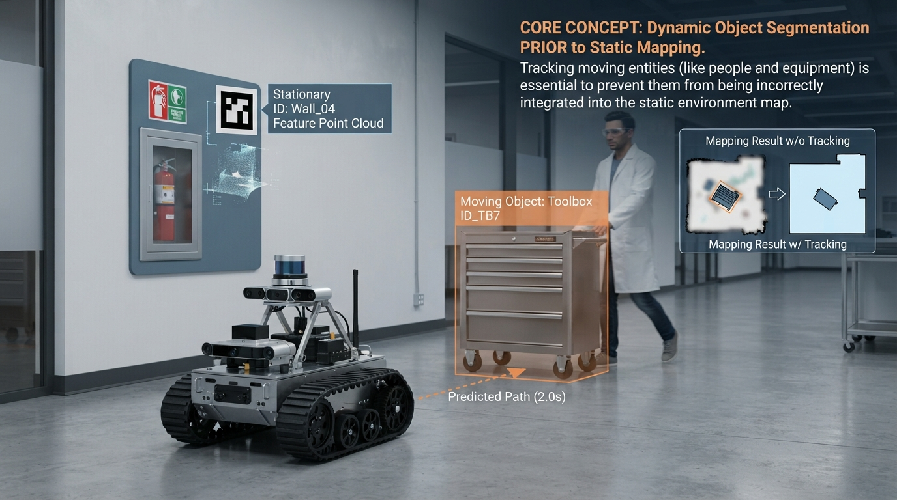

# Class 30: Tracking Objects Over Time

## Where We Are in the Robotics Journey

RoboRover can now perform **object detection**. In the previous class, its camera examined one image and reported things such as:

- “There is a red toolbox.”
- “Its center is at image coordinate \(x=240\) pixels.”
- “Its bounding box is 80 pixels wide and 60 pixels tall.”

That is useful, but a single image does not tell RoboRover whether the toolbox is moving, where it was one second ago, or whether the toolbox in the next image is the same toolbox.

Today we add memory.

RoboRover will compare detections from one moment with detections from the next moment. This process is called **tracking**. The two central ideas are:

1. **Association:** deciding which new detection belongs to which existing tracked object.
2. **Motion:** using the object’s recent movement to predict where it should appear next.

In the next class, RoboRover will use information about objects and places to begin building a **map**. Tracking is an important bridge: a map becomes more useful when the robot can distinguish a stationary landmark from a moving object.

## Today We Will Learn

By the end of this class, you should be able to:

- explain why detection and tracking are different;
- describe association as matching new measurements to existing tracks;
- predict an object’s next position using simple motion;
- calculate a position prediction and measurement error with units;
- explain why object identity can be lost when objects cross, disappear, or look alike;
- run a small Python tracking simulation;
- explain why image coordinates and world-distance coordinates are not interchangeable without calibration or a geometric transformation.

## 2-Minute Recap

A detector looks at one observation and produces a measurement. For example, it might locate the center of a ball in an image.

A measurement is not perfectly reliable. The reported position may shift because of:

- camera noise;
- changing lighting;
- motion blur;
- partial occlusion, when another object hides part of the target;
- imperfect image processing.

A detector might report these positions for a toolbox along a calibrated one-dimensional rail:

| Time | Measured horizontal position |
|---|---:|
| \(t=0\) | 2.4 m |
| \(t=1\) | 2.9 m |
| \(t=2\) | 3.3 m |

The detector gives separate observations. A tracker connects them into one continuing story: “This is probably the same toolbox moving forward.”

Image coordinates are often measured in pixels, such as \(x=240\) pixels. The examples in this lesson use metres to represent distance along a rail or another calibrated one-dimensional coordinate. Converting image position to metres requires calibration and, in general, depth or other geometric information. A pixel displacement cannot automatically be interpreted as a world-distance displacement.

**Prediction:** Before reading further, what could RoboRover do if the toolbox suddenly does not appear in one camera frame? A reasonable first answer is to predict where it should be and wait briefly for another detection.

## The Big Idea




**Figure:** Tracking repeatedly predicts, associates, and updates rather than treating every image as an unrelated observation.

Imagine RoboRover watching two cyclists pass through a park.

At time 1, the camera sees:

- cyclist A near the left side;
- cyclist B near the right side.

At time 2, the camera sees two new shapes. Detection tells us that two shapes exist, but not automatically which new shape is A or B.

Tracking performs this cycle:

```text
Existing tracks
      ↓
Predict where each object should be
      ↓
Receive new detections
      ↓
Associate detections with predictions
      ↓
Update positions and motion
      ↓
Repeat
```

A **track** is a temporary record containing information such as:

- an identifier, such as Track 3;
- the latest measured or predicted position;
- an estimated velocity;
- how many frames have passed since a successful detection;
- a history of earlier positions.

The identifier is not a permanent name engraved on the object. It is a working label maintained by the tracker.

### Association is a matching problem

Suppose RoboRover predicts:

- Track 1 should be at 3.0 m;
- Track 2 should be at 7.2 m.

The new detections are at:

- 3.2 m;
- 7.0 m.

The natural association is:

- detection at 3.2 m → Track 1;
- detection at 7.0 m → Track 2.

This looks obvious when objects are far apart. It becomes difficult when:

- two objects are close together;
- one object moves unpredictably;
- a detection is missing;
- a false detection appears;
- two objects cross paths.

Association is therefore not the same as recognizing an object’s appearance. A simple tracker may use only position and motion. It can lose identity even when a human would say, “That is clearly the same red ball.”

The greedy nearest-neighbor method used in the lab is only a teaching approximation and is order-dependent. For example, with predictions at \(0\) m and \(4\) m, detections at \(3\) m and \(5\) m, and a \(3\)-m threshold, the closest pair involving the \(4\)-m prediction can claim the \(3\)-m detection first. The \(0\)-m prediction is then left unmatched, even though the globally better assignment is \(0\rightarrow3\) and \(4\rightarrow5\). More advanced systems can use global assignment methods.

## See It in Your Head

### AI-Generated Engineering Visual · Professor OS



**How to read this visual:** Trace the signal or idea from left to right. Match each block to the lesson explanation, then predict what would change if one block produced a wrong value.




**Figure:** A tracker can preserve a short-lived motion hypothesis when an object is missing from one frame.

Picture a top-down view of RoboRover observing a rolling orange toolbox.

Draw five snapshots from left to right:

1. At time \(t_0\), the toolbox is at position 2 m.
2. At \(t_1\), it is at 2.8 m.
3. At \(t_2\), it is at 3.6 m.
4. At \(t_3\), the detector misses it.
5. At \(t_4\), it is detected at 5.2 m.

Use a solid orange circle for measured positions. Between \(t_2\) and \(t_4\), draw a dashed predicted position. The tracker does not need to declare, “The toolbox vanished.” It can say, “The expected location is here, but confidence is temporarily lower.”

For two objects, draw two colored trails crossing. Before the crossing, each trail has a clear identity. At the crossing, place two possible connecting lines. This makes the key difficulty visible: **the measurements are easy to detect, but their identity over time is uncertain.**

## Core Concept

### 1. Detection gives observations; tracking gives continuity

A detector answers:

> What appears to be present now?

A tracker answers:

> Which current observation continues which earlier object, and where will it probably be next?

Tracking does not magically create certainty. It creates a reasoned hypothesis based on recent evidence.

### 2. Motion provides a useful prediction

If an object has been moving steadily to the right, its next position is probably farther to the right. A tracker uses that expectation to make association easier.

The simplest motion model assumes constant velocity over a short interval. This assumption is often imperfect, but it can be useful for a few camera frames.

### 3. Association should respect physical plausibility

If a detection appears 20 m away from the predicted position in 0.1 s, a small ground robot should be suspicious. The object may be:

- a false detection;
- a different object;
- a detection caused by a camera glitch;
- an object moving faster than the assumed model allows.

A tracker commonly uses a **gating threshold**: only matches close enough to the prediction are considered acceptable.

### 4. Track management matters

A tracker must decide what to do when counts change.

- **New detection with no matching track:** start a new track.
- **Existing track with no matching detection:** keep it briefly as a missed track and advance its predicted state.
- **Track missed repeatedly:** delete it after a configured limit.
- **Track matched again:** update it.

This is engineering bookkeeping, but it strongly affects behavior. Deleting a track immediately can cause identity flicker. Keeping it forever can fill the system with stale objects.

## Math Without Fear

We will use one-dimensional motion first. This means we track only position along a line, such as left-to-right image position after calibration or distance along a hallway.

The prediction equation is:

\[
x_{\text{pred}} = x_{\text{old}} + v\Delta t
\]

where:

- \(x_{\text{pred}}\) is predicted position, in metres \((\text{m})\);
- \(x_{\text{old}}\) is the previous position, in metres \((\text{m})\);
- \(v\) is estimated velocity, in metres per second \((\text{m/s})\);
- \(\Delta t\) is elapsed time, in seconds \((\text{s})\).

The difference between a new measurement and the prediction is a **signed prediction residual**:

\[
r = x_{\text{measured}} - x_{\text{pred}}
\]

The units of \(r\) are metres. In filtering contexts, **innovation** commonly refers to a measurement-minus-prediction quantity, but terminology can vary. In this lesson, “signed prediction residual” is the precise term we will use.

A simple association rule is:

\[
|r| \leq d_{\text{max}}
\]

where:

- \(|r|\) is the absolute size of the position difference, in metres;
- \(d_{\text{max}}\) is the maximum allowed matching distance, in metres.

This threshold is not a law of nature. It is a design choice based on object speed, camera rate, sensor noise, and the consequences of a wrong match.

If a track is missed for several frames, its state can be propagated repeatedly. For \(k\) missed intervals under a constant-velocity model:

\[
x_{\text{pred},k} = x_{\text{last measured}} + vk\Delta t
\]

A practical tracker can store the latest measured position separately from the current predicted position. When a later measurement arrives, the velocity estimate should account for the time since the last successful measurement.

## Worked Robotics Example




**Figure:** The predicted position and gating threshold make one detection plausible and reject the distant alternative.

RoboRover is watching a toolbox along a straight laboratory rail.

At the previous frame:

- \(x_{\text{old}} = 2.4\ \text{m}\)
- \(v = 0.8\ \text{m/s}\)
- \(\Delta t = 0.5\ \text{s}\)

The prediction is:

\[
x_{\text{pred}}
= 2.4\ \text{m} + (0.8\ \text{m/s})(0.5\ \text{s})
= 2.4\ \text{m} + 0.4\ \text{m}
= 2.8\ \text{m}
\]

The detector now reports two possible object positions:

- Detection A: \(2.9\ \text{m}\)
- Detection B: \(4.1\ \text{m}\)

For Detection A, the signed prediction residual is:

\[
r_A = 2.9\ \text{m} - 2.8\ \text{m}
= 0.1\ \text{m}
\]

For Detection B:

\[
r_B = 4.1\ \text{m} - 2.8\ \text{m}
= 1.3\ \text{m}
\]

If RoboRover uses \(d_{\text{max}}=0.6\ \text{m}\), Detection A is a plausible match and Detection B is rejected for this track.

After matching Detection A, a simple updated velocity estimate is:

\[
v_{\text{new}}
=
\frac{x_{\text{measured}}-x_{\text{old}}}{\Delta t}
=
\frac{2.9\ \text{m}-2.4\ \text{m}}{0.5\ \text{s}}
=
1.0\ \text{m/s}
\]

Interpretation: the new measurement suggests the toolbox moved at approximately \(1.0\ \text{m/s}\) during this interval. The tracker can use that estimate for its next prediction.

This is not a perfect physical model. It assumes the measured position is trustworthy and the object moved smoothly between frames.

## Python Lab

The following program tracks two objects moving along a one-dimensional line. Each list contains the detections in one frame. The tracker:

1. predicts each existing track’s position;
2. computes distances between predictions and detections;
3. accepts close, one-to-one matches;
4. updates position and velocity;
5. advances unmatched tracks to their predicted positions;
6. deletes tracks after `max_missed` consecutive missed frames;
7. creates tracks for unmatched detections;
8. plots the resulting trails.

The track stores both its current state and its `last_measured_position`. This distinction matters: during an occlusion, the current state advances through prediction, while the last measured position remains available for a velocity estimate when the object is observed again.

Before running it, **predict**:

- Which track should end near position \(5.0\)?
- Which track should end near position \(4.0\)?
- What should happen when the two objects become close?

```python
import math
import matplotlib.pyplot as plt


def track_detections(frames, dt=1.0, match_threshold=1.5,
                     max_missed=2):
    """Track one-dimensional detections with greedy nearest matching."""
    tracks = {}
    next_track_id = 1
    association_log = []

    for frame_index, detections in enumerate(frames):
        # Predict where every existing track should be in this frame.
        predictions = {}
        for track_id, track in tracks.items():
            predictions[track_id] = (
                track["position"] + track["velocity"] * dt
            )

        # Build every possible track-detection pair within the threshold.
        candidates = []
        for track_id, predicted_position in predictions.items():
            for detection_index, detection in enumerate(detections):
                distance = abs(detection - predicted_position)
                if distance <= match_threshold:
                    candidates.append(
                        (distance, track_id, detection_index)
                    )

        # Greedily accept closest pairs, never reusing a track or detection.
        candidates.sort()
        matched_tracks = set()
        matched_detections = set()

        for distance, track_id, detection_index in candidates:
            if track_id in matched_tracks:
                continue
            if detection_index in matched_detections:
                continue

            detection = detections[detection_index]
            track = tracks[track_id]

            # Estimate velocity using the time since the last successful
            # measurement, not merely the time since the last prediction.
            elapsed_measurements = (
                track["missed"] + 1
            ) * dt
            track["velocity"] = (
                detection - track["last_measured_position"]
            ) / elapsed_measurements
            track["position"] = detection
            track["last_measured_position"] = detection
            track["missed"] = 0
            track["time_since_measurement"] = 0.0
            track["history"].append(detection)

            matched_tracks.add(track_id)
            matched_detections.add(detection_index)
            association_log.append(
                (frame_index, track_id, detection_index)
            )

        # Unmatched tracks survive briefly as propagated predictions.
        tracks_to_delete = []
        for track_id, track in tracks.items():
            if track_id not in matched_tracks:
                track["missed"] += 1
                track["time_since_measurement"] += dt
                track["position"] = predictions[track_id]
                track["history"].append(None)

                if track["missed"] >= max_missed:
                    tracks_to_delete.append(track_id)

        for track_id in tracks_to_delete:
            del tracks[track_id]

        # Any unused detection starts a new track.
        for detection_index, detection in enumerate(detections):
            if detection_index not in matched_detections:
                tracks[next_track_id] = {
                    "position": detection,
                    "last_measured_position": detection,
                    "velocity": 0.0,
                    "missed": 0,
                    "time_since_measurement": 0.0,
                    "history": [None] * frame_index + [detection],
                }
                next_track_id += 1

    return tracks, association_log


frames = [
    [1.1, 7.9],
    [2.0, 7.0],
    [3.1, 6.1],
    [4.0, 5.0],
    [5.0, 4.0],
]

tracks, association_log = track_detections(frames)

# Verification: these are checked by the program, not merely claimed.
assert len(tracks) == 2
assert abs(tracks[1]["position"] - 5.0) < 1e-9
assert abs(tracks[2]["position"] - 4.0) < 1e-9
assert len(association_log) == 8

print("Track 1 final position: {:.1f}".format(tracks[1]["position"]))
print("Track 2 final position: {:.1f}".format(tracks[2]["position"]))
print("Successful associations:", len(association_log))

for track_id in sorted(tracks):
    history = tracks[track_id]["history"]
    x_values = []
    y_values = []
    for frame_index, position in enumerate(history):
        if position is not None:
            x_values.append(frame_index)
            y_values.append(position)
    plt.plot(x_values, y_values, marker="o", label="Track {}".format(track_id))

plt.xlabel("Frame number")
plt.ylabel("Position along line (m)")
plt.title("RoboRover: object tracks over time")
plt.grid(True)
plt.legend()
plt.show()
```

### Important lines

`predictions[track_id]` uses the current position and velocity to estimate the next position.

The following small, self-contained example demonstrates that prediction and the update of a missed track:

```python
tracks = {
    1: {
        "position": 2.0,
        "velocity": 1.0,
        "missed": 0,
        "history": [2.0],
    }
}

predictions = {}
for track_id, track in tracks.items():
    predictions[track_id] = (
        track["position"] + track["velocity"] * 1.0
    )

track_id = 1
track = tracks[track_id]
track["missed"] += 1
track["position"] = predictions[track_id]
track["history"].append(None)

assert predictions[1] == 3.0
assert tracks[1]["position"] == 3.0
assert tracks[1]["history"] == [2.0, None]

print("Predicted position after a missed frame:",
      tracks[1]["position"])
```

When a track is missed, this line advances its state:

```python
tracks = {
    1: {
        "position": 2.0,
        "velocity": 1.0,
        "missed": 0,
        "history": [2.0],
    }
}

predictions = {}
for track_id, track in tracks.items():
    predictions[track_id] = (
        track["position"] + track["velocity"] * 1.0
    )

track_id = 1
track = tracks[track_id]
track["missed"] += 1
track["position"] = predictions[track_id]
track["history"].append(None)
```

The previous measured location is preserved in `last_measured_position`. If the object is detected later, the velocity estimate uses the elapsed number of missed intervals rather than pretending that only one interval passed.

The `candidates` list stores possible matches. Each candidate contains:

- distance from prediction;
- track identifier;
- detection index.

Sorting candidates means the closest possible match is considered first. The sets `matched_tracks` and `matched_detections` prevent one track from claiming two detections or one detection from belonging to two tracks.

The `history` list is used for drawing. A `None` value means that the tracker retained and propagated the track during a missed frame but had no measured position to plot.

`max_missed=2` means that a track is deleted when it reaches two consecutive missed frames. A single missed frame is therefore retained, while repeated misses eventually remove stale tracks.

This is a deliberately small tracker. More advanced systems may use probabilistic methods, appearance information, or global assignment algorithms. Those are later topics; the essential lesson here is the connection between prediction, association, updating, and track management.

## Mini Simulation or Game

Play this on paper with a partner.

Draw a number line from 0 m to 10 m. Your partner gives you two detections per round. You maintain two tracks:

- Track A begins at 2 m and moves \(+1\ \text{m/s}\).
- Track B begins at 8 m and moves \(-1\ \text{m/s}\).
- Each round lasts \(1\ \text{s}\).

At every round:

1. predict each track’s next position;
2. receive two measured positions;
3. connect each measurement to the closest prediction;
4. write the new velocity;
5. mark a measurement as “unmatched” if it is more than 1 m away.

Try these detections:

| Round | Detections |
|---|---|
| 0 | 2.0 m, 8.0 m |
| 1 | 3.1 m, 6.9 m |
| 2 | 4.0 m, 6.0 m |
| 3 | 4.9 m, 5.1 m |

**Predict before you calculate:** At Round 3, which detection belongs to Track A? Is the answer highly certain, or is the situation becoming ambiguous?

This game demonstrates that association becomes difficult near a crossing. If the two objects have identical motion and no appearance information, position alone may not be enough to preserve identity.

## What Should Happen?

In the Python lab:

- Track 1 should finish at \(5.0\ \text{m}\).
- Track 2 should finish at \(4.0\ \text{m}\).
- The program should report 8 successful associations.
- The plot should show two trails approaching one another and crossing in position order.
- The default `max_missed=2` setting should not delete either track in the baseline data because neither track is missed.

What happens when a track is missed can be demonstrated independently:

- the current position advances to the predicted position;
- the missed count increases;
- the history records `None`;
- the last measured position remains available for later velocity estimation.

The code verifies the exact final positions and association count with `assert` statements. If an assertion fails after you modify the program, your change has altered the behavior and deserves investigation.

In the paper game, the final pair is intentionally difficult. At the crossing, a nearest-position rule can preserve identity if the predicted positions are distinct. If both predictions become nearly identical, there may be no reliable answer from position alone.

## Common Mistakes

### Mistake 1: Treating every detection as a new object

This creates many short-lived IDs. RoboRover might report “new toolbox,” “new toolbox,” and “new toolbox” even though one toolbox is moving continuously.

### Mistake 2: Matching by current distance only

The nearest detection to the old position may not be the correct one if the object is moving quickly. Prediction uses both position and recent motion.

### Mistake 3: Failing to advance an unmatched track

If a track is missed, leaving its stored position unchanged makes later predictions start from an obsolete location. A tracker should propagate the predicted state through the missed interval while preserving the last measured state separately when that state is needed for later velocity estimation.

### Mistake 4: Assuming an ID is permanent truth

Track 1 is an internal label, not proof of identity. If two objects cross or one is hidden, the tracker can accidentally swap labels.

### Mistake 5: Using a threshold without considering time

A threshold of 1 m might be reasonable when frames are 1 s apart. It may be too small when frames are 5 s apart and too large when objects are crowded.

### Mistake 6: Deleting a track after one missed detection

A camera can miss an object because of blur or temporary occlusion. Keeping a track briefly can prevent unnecessary identity loss.

### Engineering caveat: wrong association can be worse than no association

A missed detection is visible uncertainty: “I do not currently see the object.” A wrong association silently attaches new measurements to the wrong object. That false history can produce bad velocity estimates and poor future predictions.

Real systems often use confidence scores, appearance features, uncertainty estimates, and more careful assignment rules. Even then, tracking remains a problem of managing imperfect evidence.

## Try It Yourself

### Challenge

Modify the Python program so that the second frame contains only one detection:

```python
frames = [
    [1.1, 7.9],
    [2.0],
    [3.1, 6.1],
    [4.0, 5.0],
    [5.0, 4.0],
]
```

Use the implementation's default `max_missed=2`. Predict before running:

- Which track will be temporarily missed?
- Will it still appear in the final plot?
- How many successful associations will the program report?
- Will the missed track's predicted position advance during the missing frame?

For this data, Track 2 is missed in the second frame, remains active because only one frame is missed, and is matched again at the next frame. The program should report **7 successful associations**: Track 1 is matched in all five frames, while Track 2 is matched in four frames. Both tracks should still be present at the end, and the track history should contain a gap for the missed measurement.

Then run the modified program and inspect the result. Notice that the program keeps an unmatched track, advances its predicted state, and records `None` in its history for the missed measurement.

### Deletion experiment

Test the deletion rule by making one object disappear for two consecutive frames:

```python
frames = [
    [1.1, 7.9],
    [2.0],
    [3.1],
    [4.0, 5.0],
    [5.0, 4.0],
]
```

With the default `max_missed=2`, the second track is deleted during the second consecutive missed frame. When a later detection appears, it starts a new track rather than automatically receiving the deleted track's old ID.

Ask yourself: should the returning object receive its old ID or a new ID? There is no universally correct answer; the choice depends on how much identity continuity matters in the robot’s task.

## Quick Quiz

1. What is the difference between object detection and object tracking?

2. RoboRover predicts an object at \(6.0\ \text{m}\), and a new detection appears at \(6.3\ \text{m}\). If the association threshold is \(0.5\ \text{m}\), is this match accepted?

3. Why can two objects crossing cause an identity swap?

4. Why might a tracker keep an object after one missed detection?

## Answers

1. Detection reports what appears in one observation. Tracking links observations across time and maintains information such as identity label, position, and motion.

2. Yes. The distance is \(|6.3-6.0|=0.3\ \text{m}\), which is less than \(0.5\ \text{m}\).

3. Near a crossing, multiple detections may be similarly close to the predicted positions. Position alone may not provide enough information to decide which object is which.

4. The detector may fail temporarily because of occlusion, blur, noise, or lighting. Keeping and propagating the track briefly allows the object to reappear without immediately creating a new identity.

## Real Robot Connection




**Figure:** Tracking helps RoboRover separate moving objects from features that may belong in a map.

RoboRover’s camera detector might identify a toolbox, a person, or another robot in each frame. A tracker adds temporal structure:

- a person’s position changes gradually;
- a stationary wall feature is stable in the environment or world frame, but it generally moves in the camera image when RoboRover moves;
- a moving object should not automatically be treated as part of the environment;
- a missed frame should not immediately erase a useful hypothesis.

To compare observations over time in a consistent world coordinate system, RoboRover needs an estimate of its own pose and a transformation between the camera frame and the robot or world frame. Without that transformation, a stationary wall feature can appear to move across the image as the robot drives past it. At an introductory level, robot pose estimation and frame transformation provide the basis for recognizing that the feature is stationary in the environment even though its image coordinates change.

This matters for the next class, **Mapping**. Mapping tries to organize observations into a representation of the environment. If RoboRover mistakes a moving toolbox for a fixed wall feature, the map can become distorted. If it tracks the toolbox separately, it can treat the toolbox as a moving object rather than a permanent landmark.

The distinction is practical:

- **tracking** asks, “Which observation belongs to which object over time?”
- **mapping** asks, “Where are important places or features in the environment?”

Tracking does not solve mapping, but it supplies cleaner, time-linked observations.

## Vocabulary

- **Association:** Matching a new detection with an existing track.
- **Detection:** A measurement produced from one sensor observation, such as an object position or bounding box.
- **Track:** A maintained record describing a hypothesized object across multiple observations.
- **Prediction:** An estimate of where a tracked object should appear next.
- **Velocity:** Change in position per unit time, commonly measured in metres per second \((\text{m/s})\).
- **Residual:** The signed difference between a measurement and a prediction.
- **Gating threshold:** A limit on how far a detection may be from a prediction before the match is rejected.
- **Occlusion:** A condition in which an object is partly or completely hidden from a sensor.
- **Missed detection:** A frame in which the sensor-processing system fails to produce a usable detection for an object.
- **Identity switch:** An error in which a track label changes from one physical object to another.

## Further Learning

For deeper study, search for these topics by name:

- nearest-neighbor data association;
- multi-object tracking;
- constant-velocity motion model;
- track initiation and track deletion;
- occlusion handling in computer vision;
- global data association;
- Kalman filter tracking.

The first three extend today’s ideas directly. The later topics introduce methods for representing uncertainty and resolving difficult associations.

## Next Class

Next class is **Mapping**.

RoboRover will begin combining observations into a spatial representation of its surroundings. We will ask:

> How can a robot record where important features are located, rather than merely remembering what it saw in the latest image?

Keep today’s distinction in mind: a moving object should not automatically become a fixed map feature.
