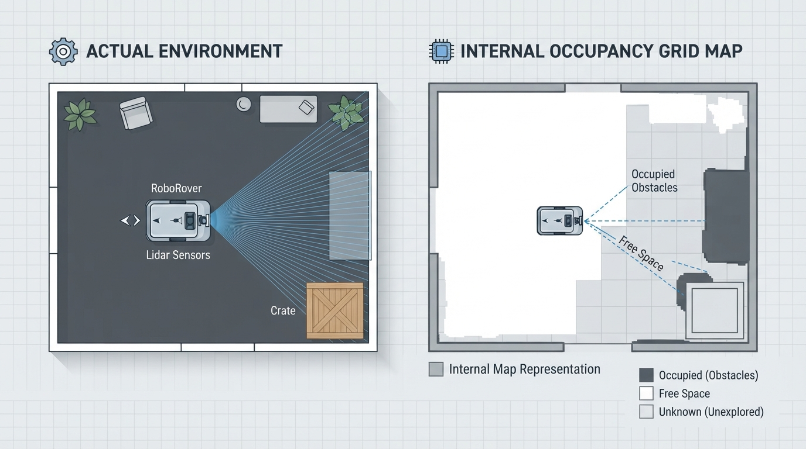
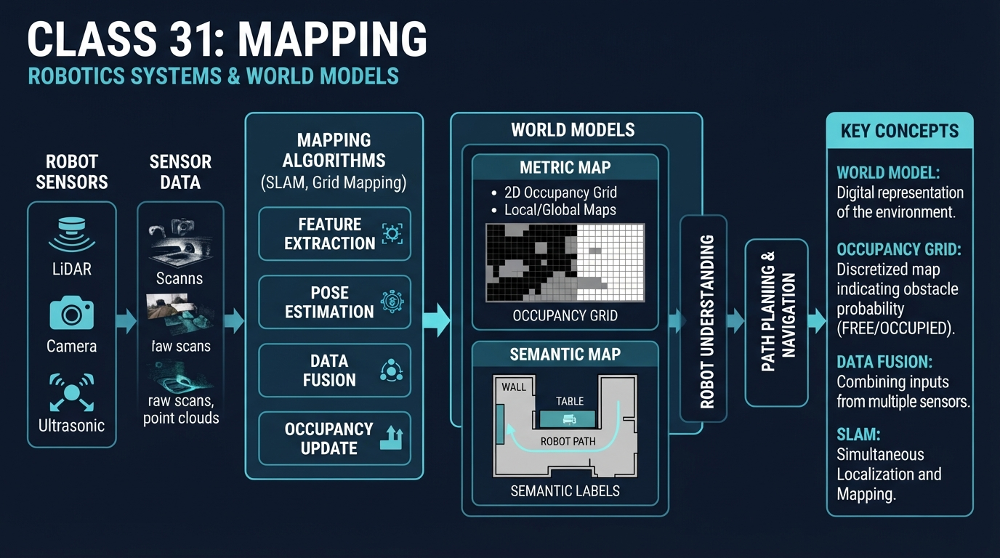
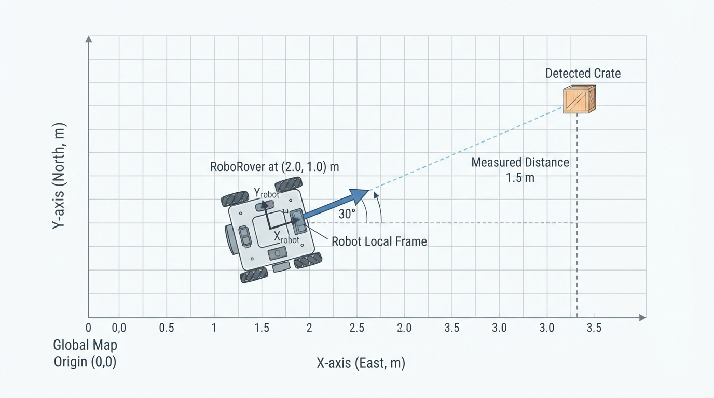
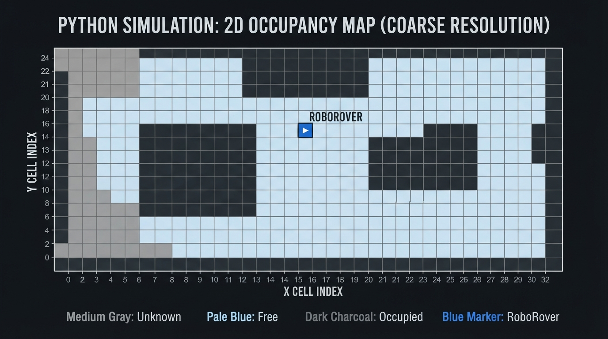
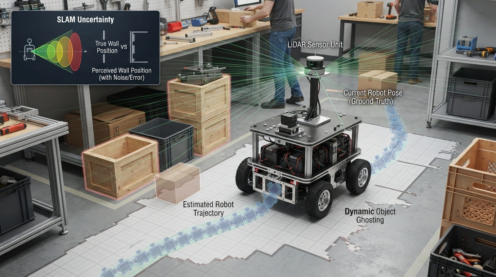

# Class 31: Mapping

## Where We Are in the Robotics Journey

RoboRover has just learned to **track objects over time**. Tracking answers a local question:

> “Where is that moving object now, and where might it be next?”

Mapping asks a broader question:

> “What does the surrounding world look like, and where are important things located?”

A tracked object is usually represented as one changing estimate. A map is a longer-lasting **world model**: a structured record that RoboRover uses to remember walls, open areas, obstacles, landmarks, and possibly moving objects.

Today we will build the ideas behind mapping and occupancy. In the next class, **Occupancy Grids**, we will turn these ideas into a more formal grid-based representation.

## Today We Will Learn

By the end of this class, you should be able to:

- explain what a robot’s world model is;
- distinguish a sensor snapshot from a map;
- describe occupied, free, and unknown space;
- place a detected object into a map coordinate system;
- explain why coordinate frames and calibration matter;
- update a simple map when new observations arrive;
- recognize why maps can contain uncertainty and errors.

## 2-Minute Recap

In the previous class, RoboRover tracked a blue storage box.

At one moment, its camera estimated:

\[
\mathbf{p}_1=(1.2\text{ m},0.8\text{ m})
\]

Later, it estimated:

\[
\mathbf{p}_2=(1.5\text{ m},0.9\text{ m})
\]

The two measurements described the same object at different times. Tracking connected those measurements into a history.

A tracker often cares about:

- identity: “Is this still the same object?”
- position: “Where is it?”
- velocity: “How is it moving?”
- prediction: “Where might it be next?”

Mapping is different. A map may remember that a wall is at a location even when the wall is not currently in the camera image.

## The Big Idea




**Figure:** The physical room generates observations; the robot stores a simplified world model rather than a perfect copy of reality.

Imagine RoboRover entering a dark storage room with a small flashlight. Each sensor reading reveals only a small patch of the room. If RoboRover kept only the latest reading, it would forget what it saw moments ago.

A map is like a carefully organized notebook:

- one page records where the robot is;
- another records stable obstacles;
- another records named places;
- another records which areas are known to be open;
- some entries are marked uncertain.

This notebook is a **world model**.

A world model is not the world itself. It is an internal representation used by the robot. It may be incomplete, outdated, noisy, or based on assumptions.

### Sensor snapshot versus map

A sensor snapshot answers:

> “What do I observe right now?”

A map answers:

> “What do I currently believe is located in this area, based on observations collected over time?”

For example, a laser sensor may see a wall 2.4 m ahead. That is one observation. RoboRover can place that wall into a map, combine it with earlier observations, and remember it after turning away.

### Occupancy

For mapping, **occupancy** means whether a region of space is believed to contain something solid.

A simple occupancy description has three states:

| State | Meaning |
|---|---|
| Unknown | RoboRover has not gathered enough evidence |
| Free | The sensor evidence suggests the region is open |
| Occupied | The evidence suggests the region contains an obstacle or object |

These states are not perfect truths. A region can be labeled “free” because no obstacle was detected, even though a thin cable or transparent object was missed.

## See It in Your Head

### AI-Generated Engineering Visual · Professor OS



**How to read this visual:** Trace the signal or idea from left to right. Match each block to the lesson explanation, then predict what would change if one block produced a wrong value.


Picture a rectangular room from above.

- RoboRover is a small circle near the lower-left corner.
- A long wall runs across the upper part of the room.
- A crate sits near the right-hand side.
- Several areas are gray because the robot has not observed them.
- A cone-shaped set of rays extends from RoboRover toward the wall.
- The space before the wall is colored pale blue for “probably free.”
- The wall is colored dark red for “probably occupied.”
- The unseen region remains gray for “unknown.”

Now imagine RoboRover turns 90 degrees. Its sensor rays illuminate a new part of the room. The map should grow by combining the new evidence with the old evidence.

An illustrator should show two layers:

1. **The physical room:** walls, floor, crate, robot, sensor rays.
2. **The internal map:** a simplified top-down record of free, occupied, and unknown regions.

The physical room and the internal map should not look identical. The map is a model, not a photograph.

## Core Concept

### 1. A map needs a reference frame

To place observations consistently, RoboRover needs a coordinate system.

For this class, use a two-dimensional map:

- \(x\): horizontal position, measured in metres;
- \(y\): vertical position, measured in metres;
- the origin \((0\text{ m},0\text{ m})\): a chosen reference point;
- the positive \(x\)-direction: the map’s rightward direction;
- the positive \(y\)-direction: the map’s upward direction.

The robot also has a pose:

\[
(x_R,y_R,\theta_R)
\]

where:

- \(x_R\) and \(y_R\) are the robot’s position in metres;
- \(\theta_R\) is its heading, measured in degrees or radians.

A sensor usually measures something relative to the robot. A map stores it in a common world frame.

### 2. A map combines observations

Suppose RoboRover sees a crate from one side. Later, it sees the same crate from another side. A useful mapping system does not blindly create two crates. It combines evidence and maintains one world-model object, perhaps:

```text
crate_7:
    estimated position: (3.3 m, 1.75 m)
    status: occupied
    last observed: recent
```

This example uses an identified object. Other mapping systems do not name individual objects. They simply record that regions are likely free or occupied.

### 3. Occupancy is about space, not only objects

A wall, chair, crate, and closed door can all occupy space. For navigation and collision avoidance, the important question may be:

> “Can RoboRover’s body safely enter this region?”

Therefore, an occupancy map usually represents physical space rather than a list of object names.

### 4. Unknown is useful information

Unknown does not mean free.

If a sensor has not looked behind a cabinet, RoboRover should not treat that space as safely empty. Keeping “unknown” separate from “free” helps prevent overconfident decisions.

### 5. Maps can change

Some parts of an environment are stable:

- walls;
- floor boundaries;
- support pillars.

Other parts can move:

- people;
- carts;
- doors;
- boxes.

A map may therefore contain both persistent structure and temporary observations. A stale map can be dangerous if it remembers a cart that has moved or fails to record a newly placed box.

## Math Without Fear

Suppose RoboRover is at:

\[
(x_R,y_R)=(2.0\text{ m},1.0\text{ m})
\]

It detects a crate \(1.5\text{ m}\) directly in front of it. The robot is heading at:

\[
\theta_R=30^\circ
\]

For a distance \(d\) in the robot’s forward direction, the crate’s map coordinates are:

\[
x_C=x_R+d\cos(\theta_R)
\]

\[
y_C=y_R+d\sin(\theta_R)
\]

where:

- \(x_C\) is the crate’s map \(x\)-coordinate, in metres;
- \(y_C\) is the crate’s map \(y\)-coordinate, in metres;
- \(x_R,y_R\) are RoboRover’s map coordinates, in metres;
- \(d\) is the measured forward distance, in metres;
- \(\theta_R\) is the robot heading.

Using:

\[
\cos(30^\circ)\approx0.866
\]

\[
\sin(30^\circ)=0.5
\]

we obtain:

\[
x_C=2.0\text{ m}+(1.5\text{ m})(0.866)\approx3.30\text{ m}
\]

\[
y_C=1.0\text{ m}+(1.5\text{ m})(0.5)=1.75\text{ m}
\]

So RoboRover should place the crate near:

\[
(3.30\text{ m},1.75\text{ m})
\]

### Interpretation

This does not mean the crate’s location is known exactly. The distance measurement may be off by several centimetres, and the heading may also be imperfect. The calculated point is an **estimate**.

A map is therefore not just geometry. It is geometry plus evidence quality.

## Worked Robotics Example




**Figure:** A robot-relative distance and heading are converted into the crate's estimated position in the fixed map frame.

RoboRover explores a workshop.

At the beginning, it knows only its starting position. It looks forward and receives this simplified observation:

- the first \(2.0\text{ m}\) in front appears clear;
- an obstacle begins at \(2.0\text{ m}\);
- the sensor cannot see beyond the obstacle.

RoboRover records:

```text
near region: free
obstacle boundary: occupied
far region behind obstacle: unknown
```

This is an important detail. The area behind the obstacle is not automatically free. The obstacle blocks the sensor’s view.

Now RoboRover moves \(1.0\text{ m}\) sideways and looks again. It can see around the obstacle. The new observation suggests that some space behind the obstacle is clear.

The map update becomes:

```text
near region: free
obstacle boundary: occupied
newly visible region behind obstacle: free
```

The map has become more informative because the robot changed its viewpoint.

### What the map does not know

Even after this update, RoboRover may not know:

- whether the obstacle is a crate or a wall;
- whether the crate will move;
- whether a narrow gap is wide enough for the whole robot;
- whether a shiny surface caused a false sensor reading.

Mapping records useful beliefs, not guaranteed facts.

## Python Lab




**Figure:** The program stores each coarse map cell as unknown, free, or occupied and displays the result from above.

This program creates a small top-down occupancy sketch. It uses:

- `?` internally for unknown;
- `.` for free;
- `#` for occupied.

The program applies two observation batches. Notice that observing an already occupied cell again does not create a second obstacle.

### Predict before you run it

Before running the code, predict:

1. How many cells will be free after both observation batches?
2. How many cells will be occupied?
3. How many cells will remain unknown?
4. Will the repeated observation of `(3, 3)` increase the occupied count?

```python
import matplotlib.pyplot as plt

ROWS = 7
COLS = 9

# The map is stored as rows of cells.
# Each cell starts unknown.
world = [["?" for _ in range(COLS)] for _ in range(ROWS)]

def update_map(world, observations):
    """Apply (x, y, state) observations to the map."""
    for x, y, state in observations:
        if state not in ("free", "occupied"):
            raise ValueError("state must be 'free' or 'occupied'")
        if not (0 <= x < COLS and 0 <= y < ROWS):
            raise ValueError("observation is outside the map")
        world[y][x] = state

def count_states(world):
    counts = {"unknown": 0, "free": 0, "occupied": 0}
    for row in world:
        for cell in row:
            if cell == "?":
                counts["unknown"] += 1
            elif cell == "free":
                counts["free"] += 1
            elif cell == "occupied":
                counts["occupied"] += 1
    return counts

def display_symbol(state):
    if state == "free":
        return "."
    if state == "occupied":
        return "#"
    return "?"

# First sensor observation.
first_observation = [
    (1, 3, "free"),
    (2, 3, "free"),
    (3, 3, "occupied"),
    (1, 2, "free"),
    (1, 1, "occupied"),
]

# Second observation includes a repeated occupied cell.
second_observation = [
    (3, 3, "occupied"),
    (1, 4, "free"),
]

update_map(world, first_observation)
update_map(world, second_observation)

# Convert symbolic states into numbers for plotting.
# 1.0 = free, 0.0 = occupied, 0.5 = unknown.
plot_values = []
for row in world:
    numeric_row = []
    for cell in row:
        if cell == "free":
            numeric_row.append(1.0)
        elif cell == "occupied":
            numeric_row.append(0.0)
        else:
            numeric_row.append(0.5)
    plot_values.append(numeric_row)

counts = count_states(world)

# These assertions verify the exact map counts.
assert counts == {"unknown": 57, "free": 4, "occupied": 2}
assert world[3][3] == "occupied"
assert sum(counts.values()) == ROWS * COLS

print("Map counts:", counts)
print("Repeated occupied cell remains one occupied cell.")
print("Total cells:", sum(counts.values()))

plt.imshow(
    plot_values,
    cmap="gray",
    vmin=0.0,
    vmax=1.0,
    origin="lower",
    interpolation="nearest"
)

# RoboRover's drawing position is shown in map coordinates.
plt.scatter([1], [3], marker="o", s=120, color="tab:blue",
            label="RoboRover")

plt.xticks(range(COLS))
plt.yticks(range(ROWS))
plt.grid(True, color="black", linewidth=0.5, alpha=0.4)
plt.xlabel("Map x cell")
plt.ylabel("Map y cell")
plt.title("RoboRover's coarse occupancy sketch")
plt.legend()
plt.show()
```

### Important lines

`world = [["?" ...]]` creates a map in which every cell begins unknown.

`world[y][x] = state` updates one location. The order matters: rows are indexed by \(y\), while columns are indexed by \(x\).

The second observation repeats `(3, 3)`. Assignment replaces the old value; it does not add another cell. This models a basic map update rather than a list of raw sensor readings.

The plotting code is only a visual aid. The map itself is the stored data structure.

## Mini Simulation or Game

Play “Map Detective” before changing the program.

Use this small map, viewed from above:

```text
y=4   ?  ?  ?  ?  ?  ?  ?
y=3   ?  R  .  .  #  ?  ?
y=2   ?  .  ?  ?  ?  ?  ?
y=1   ?  #  ?  ?  ?  ?  ?
y=0   ?  ?  ?  ?  ?  ?  ?
      x=0 1  2  3  4  5  6
```

Here:

- `R` is RoboRover;
- `.` is believed free;
- `#` is believed occupied;
- `?` is unknown.

Answer these questions:

1. Is the cell at \((5,3)\) known to be free?
2. Is the cell at \((2,2)\) known to be occupied?
3. Which occupied cell is currently closer to RoboRover at \((1,3)\), using straight-line distance?
4. What additional sensor viewpoint might reveal information near \((5,3)\)?

For the last question, there is no single required answer. A useful answer would place RoboRover somewhere from which the obstacle at \((4,3)\) no longer blocks the view.

## What Should Happen?

After running the Python program:

- the printed map counts should be `{'unknown': 57, 'free': 4, 'occupied': 2}`;
- the assertion statements should complete without an error;
- the plotted map should show a blue RoboRover near the lower-left region;
- free cells should appear light;
- occupied cells should appear dark;
- unknown cells should appear medium gray;
- the repeated observation should not increase the occupied count.

If an assertion fails, the program and your prediction disagree. Inspect the coordinate order carefully: `world[y][x]` means the first index selects the row and the second selects the column.

## Common Mistakes

### Treating unknown as free

A sensor that has not observed a region has not proved that the region is empty. Unknown should remain distinct.

### Mixing robot coordinates and map coordinates

“Two metres ahead” is relative to RoboRover’s heading. A map coordinate is relative to the fixed world frame. Forgetting this distinction can place an obstacle in the wrong location.

### Ignoring the robot’s physical size

A map may show a narrow gap as free, but RoboRover’s body may not fit. Occupancy mapping records space; safe movement also requires considering the robot’s shape and measurement margins.

### Believing every sensor return

Sensors produce noise and can miss objects. Transparent surfaces, dark materials, shiny surfaces, dust, and narrow obstacles can cause errors depending on the sensor technology.

### Forgetting that the world changes

A map made yesterday may be wrong today. A moving cart can turn an old “free” region into an occupied one.

### Overwriting useful information carelessly

A single bad reading should not necessarily erase a long history of reliable evidence. More advanced systems combine evidence with confidence rather than using a simple last-reading-wins rule.

## Try It Yourself

### Challenge: Map a mystery corner

Modify the Python program so that RoboRover receives a third observation batch:

```text
(4, 3) is occupied
(5, 3) is free
(5, 4) is free
(6, 4) is occupied
```

Then update the assertions to match the new counts.

**Optional extension:** Add a function that prints the map as text, with the highest \(y\)-row printed first so the display resembles the plotted coordinate system. Add an assertion that exactly four occupied cells exist after the third batch.

Think carefully: one of the new observations adds an occupied cell at `(4, 3)`, while the others add free cells. The earlier occupied cell at `(3, 3)` remains occupied.

## Quick Quiz

1. What is the difference between a sensor snapshot and a world model?

2. Why should an occupancy map keep “unknown” separate from “free”?

3. RoboRover is at \((1.0\text{ m},2.0\text{ m})\), facing directly along positive \(x\). It detects an obstacle \(3.0\text{ m}\) ahead. What is the obstacle’s estimated map position?

4. Name one practical reason a real robot’s map can become wrong over time.

## Answers

1. A sensor snapshot describes what the robot observes at one moment. A world model combines observations into an internal representation that can persist over time.

2. Unknown means there is insufficient evidence. Free means the available evidence suggests the region is open. Treating unknown as free can cause unsafe assumptions.

3. Because the robot is facing positive \(x\), the obstacle is:

\[
x=1.0\text{ m}+3.0\text{ m}=4.0\text{ m}
\]

\[
y=2.0\text{ m}
\]

So the estimated position is \((4.0\text{ m},2.0\text{ m})\).

4. Possible answers include sensor noise, robot movement errors, incorrect calibration, moving objects, changed furniture, or a map that has not been updated recently.

## Real Robot Connection




**Figure:** Real maps can be distorted by calibration errors, noisy measurements, movement uncertainty, and changes in the environment.

RoboRover’s map depends on several engineering systems working together:

- sensors measure distances or images;
- the robot records its own changing position;
- observations are converted from robot-relative coordinates into map coordinates;
- repeated observations are combined;
- uncertain or conflicting evidence is handled.

A small heading error can move every detected obstacle to the wrong place. For example, if RoboRover believes it is facing \(30^\circ\) when it is actually facing \(35^\circ\), a distant wall may be placed noticeably incorrectly. This is one reason mapping systems must account for calibration, sensor noise, timing delays, and movement errors.

A useful engineering principle is:

> A map should represent what the robot knows, how strongly it knows it, and when that knowledge was last checked.

The next class will develop the occupancy-grid representation more systematically. We will divide space into regular cells and study how each cell stores occupancy information.

## Vocabulary

- **Map:** A representation of locations and features in an environment.
- **World model:** An internal robot representation of relevant parts of the physical world, built from observations and assumptions.
- **Occupancy:** Whether a region is believed to contain a physical obstacle or object.
- **Occupied:** A region believed to contain something solid or impassable.
- **Free:** A region that sensor evidence suggests is open.
- **Unknown:** A region about which the robot lacks sufficient evidence.
- **Coordinate frame:** A defined origin, direction, and unit system used to describe positions.
- **Map frame:** The fixed coordinate system in which mapped locations are recorded.
- **Robot-relative measurement:** A measurement described relative to the robot’s current position and heading.
- **Pose:** A robot’s position and orientation; in two dimensions, commonly \((x,y,\theta)\).
- **World model update:** The process of combining a new observation with an existing internal map.

## Further Learning

For additional study, search for these resource topics:

- “robot coordinate frames and transformations”
- “occupancy mapping for mobile robots”
- “robot sensor noise and calibration”
- “2D range sensor mapping”
- “occupancy grid mapping fundamentals”

As you study, keep asking two questions:

1. What part of the environment does the robot actually observe?
2. What assumptions does the robot make when it fills in the map?

## Next Class

In **Class 32: Occupancy Grids**, RoboRover will replace the rough map sketch with a formal grid of cells. Each cell will represent a small region of space, allowing us to discuss map resolution, cell updates, and the trade-off between detail and memory.

The connection is direct:

- today: a world model records free, occupied, and unknown regions;
- next class: an occupancy grid organizes those regions into a precise spatial structure.
