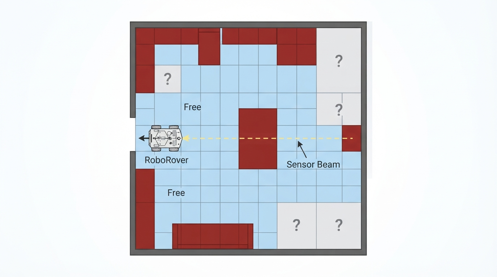
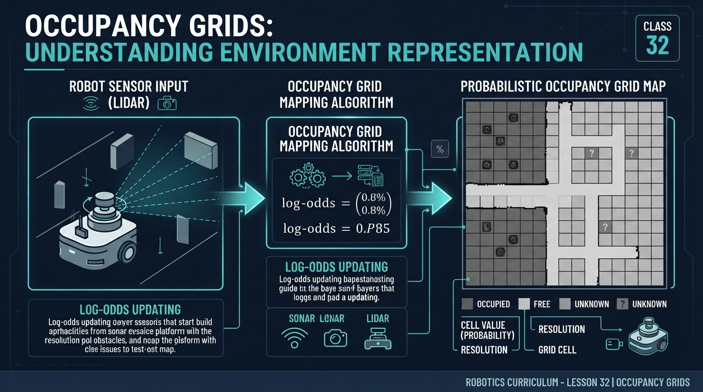
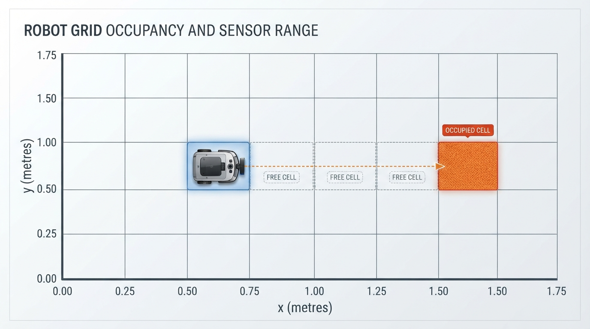
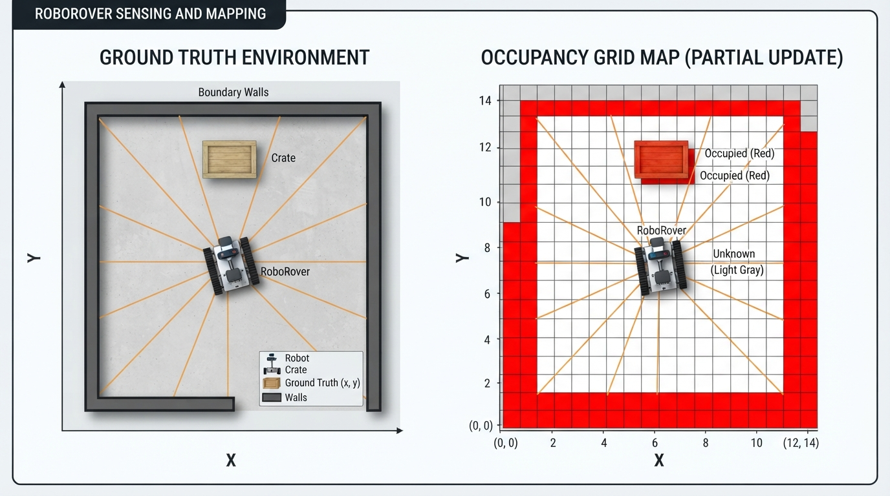

# Class 32: Occupancy Grids

## Where We Are in the Robotics Journey

In the previous class, **Mapping**, RoboRover learned that a map is a representation of an environment. A map might show walls, furniture, landmarks, or safe routes.

Today we make that idea precise for a common kind of robot map: the **occupancy grid**.

An occupancy grid divides the world into many small square cells. Each cell stores what RoboRover currently believes about that small patch of space:

- **Free**: sensor evidence suggests that the robot can pass through that cell along the observed beam, subject to the robot's size and uncertainty.
- **Occupied**: sensor evidence suggests an obstacle is present.
- **Unknown**: the robot has not gathered enough information yet.

In the next class, **Localization**, RoboRover will use observations and a map to estimate where it is. An occupancy grid can serve as that map, but a map alone does not tell the robot its current position.

## Today We Will Learn

By the end of this class, you should be able to:

1. Explain why a large environment can be represented as a grid of cells.
2. Distinguish free, occupied, and unknown cells.
3. Convert physical distances into grid-cell indices using a stated coordinate convention.
4. Understand how a range sensor can update cells along a beam.
5. Recognize practical problems such as sensor noise, limited resolution, incorrect robot pose, and robot footprint.
6. Run a small Python simulation that builds part of an occupancy grid.
7. Calculate the number of cells and approximate memory required at different grid resolutions.

## 2-Minute Recap

Imagine RoboRover driving through a room with a distance sensor pointing forward.

The sensor might report:

> “The nearest obstacle is 1.5 metres away.”

That one measurement says something about several locations:

- Space between RoboRover and the obstacle is probably **free along the observed beam**.
- The location where the sensor beam ends is probably **occupied**.
- Areas outside the beam are still **unknown**.

This is the central mapping idea:

> A sensor measurement can provide information about multiple cells, not just the cell containing the robot.

An occupancy grid is one map representation that turns continuous geometry into a regular array of small, manageable regions.

## The Big Idea



**Figure:** An occupancy grid stores local evidence about each small region of space.

Think of an occupancy grid as graph paper placed over a room.

Each square has a status:

```text
? ? ? ? ? ? ? ? ?
? . . . . # ? ? ?
? . R . . # ? ? ?
? . . . . . ? ? ?
? ? ? ? ? ? ? ? ?
```

Here:

- `.` means free;
- `#` means occupied;
- `?` means unknown;
- `R` marks RoboRover’s approximate position.

The grid does not claim that a real wall has square edges. The squares are a **discretization**: a continuous physical world is being approximated using separate pieces.

A small cell gives more detail but requires more memory and computation. A large cell is cheaper to store but may hide narrow obstacles or doorways.

An occupancy grid is therefore not a perfect photograph. It is a structured record of evidence.

When inspecting a grid visual, use its legend and symbols as well as its colors. For accessibility, free, occupied, and unknown should not be distinguished by color alone.

## See It in Your Head

### AI-Generated Engineering Visual · Professor OS



**How to read this visual:** Trace the signal or idea from left to right. Match each block to the lesson explanation, then predict what would change if one block produced a wrong value.

When inspecting the schematic, distinguish:

1. the continuous world-coordinate axes;
2. the grid-cell boundaries;
3. the integer row and column indices;
4. the sensor ray and its detected endpoint.

These are related, but they are not the same representation. A world position is measured in metres, while a grid index identifies a discrete cell. With the half-open convention, \(x=is\) starts column \(i\), while \(x=(i+1)s\) starts the next column.

Picture RoboRover at the left side of a corridor. Its forward sensor sends a narrow beam:

```text
R  →  →  →  →  X
```

The arrows represent cells through which the beam traveled. `X` is the detected obstacle.

After the measurement:

```text
R  .  .  .  .  #
```

The cells before the obstacle are marked **free along the observed beam** because the sensor traveled through them without hitting anything. The obstacle cell is marked **occupied** because the beam stopped there.

A cell two metres to the side remains **unknown**, even if it looks free to a human observer.

> Unknown does not mean occupied, and unknown does not mean free. It means that the robot does not currently have enough evidence.

## Core Concept

### Cells and coordinates

A grid uses integer indices such as:

- column \(i\), increasing from left to right;
- row \(j\), increasing from bottom to top.

For the equations in this class, assume that:

- world coordinates are expressed in the grid’s coordinate frame;
- the grid origin is defined at a known physical location;
- the positive \(x\)-axis points toward increasing columns;
- the positive \(y\)-axis points toward increasing rows;
- cells use half-open boundaries: cell \(i\) covers \(is \leq x < (i+1)s\), and cell \(j\) covers \(js \leq y < (j+1)s\).

If each square has side length \(s\), measured in metres, a position \((x,y)\) can be associated with a grid cell using:

\[
i = \left\lfloor \frac{x}{s} \right\rfloor
\]

\[
j = \left\lfloor \frac{y}{s} \right\rfloor
\]

where:

- \(x\) and \(y\) are positions in metres;
- \(s\) is the cell width and height in metres;
- \(i\) and \(j\) are integer indices;
- \(\lfloor \ \rfloor\) means “round down to the nearest integer.”

The grid also needs an **origin**: the physical location considered to be \((0,0)\). Changing the origin or axis directions changes the cell indices even though the physical room has not moved.

Floor-based indexing requires particular care for negative coordinates. For example:

\[
\left\lfloor \frac{-0.10}{0.25} \right\rfloor
=
\lfloor -0.4 \rfloor
=
-1
\]

It is not \(0\). A real implementation must define how coordinates outside the chosen map are handled and must use the same boundary convention everywhere.

### Three states

For this class, we use a simple three-state model:

| Symbol | Meaning | Typical interpretation |
|---|---|---|
| `?` | Unknown | No useful measurement yet |
| `.` | Free | Sensor evidence suggests the cell is passable along the observed beam |
| `#` | Occupied | Sensor evidence suggests an obstacle is present |

The program represents these states with integer labels: `-1` for unknown, `0` for free, and `1` for occupied. These labels are not probabilities. They are a simplified, discrete representation of the current map state.

A probabilistic map might instead store a value such as `0.70`, meaning that the current estimate gives a 70% probability of occupancy. Repeated observations can raise or lower that confidence. The three-state model is sufficient for understanding the basic information flow.

### Updating along a sensor beam

A range sensor measures distance in a direction. A basic grid update usually does two things:

1. Mark cells between the robot and the detected obstacle as free.
2. Mark the endpoint cell as occupied.

For this lesson, RoboRover’s own cell is initialized as free because the robot is known to occupy that location. The code then processes cells beginning one step away.

If the sensor reaches its maximum distance without detecting an obstacle, the cells it inspected may be marked free, but there is no occupied endpoint to mark.

A reported range identifies the location of the sensor return along the beam. It does not usually identify the exact centre of an occupied grid cell. The return may come from an obstacle’s near surface or boundary, and the obstacle may occupy only part of the endpoint cell. The **sensor return point**, obstacle’s **near surface**, and selected **occupied grid cell** are related but not identical.

This update assumes that:

- the sensor beam direction is known;
- RoboRover’s position and orientation are approximately correct;
- the sensor measurement is not badly corrupted;
- the obstacle reflects or blocks the signal;
- the robot’s own footprint is handled separately from the free-space evidence.

Real systems model the robot’s physical footprint and may inflate nearby obstacle cells so the full body remains clear.

If multiple rays or later observations touch the same cell, this simple integer-map implementation overwrites the previous label according to update order. That is convenient for demonstration but is not a complete uncertainty model.

## Math Without Fear

Suppose a grid cell is \(0.25\ \text{m}\) wide.

A rectangular map containing 8 columns and 6 rows covers:

\[
\text{width} = 8 \times 0.25\ \text{m} = 2.00\ \text{m}
\]

\[
\text{height} = 6 \times 0.25\ \text{m} = 1.50\ \text{m}
\]

The area represented is:

\[
A = 2.00\ \text{m} \times 1.50\ \text{m} = 3.00\ \text{m}^2
\]

Now place RoboRover at \(x=0.50\ \text{m}\), \(y=0.50\ \text{m}\), with the grid origin at the lower-left corner:

\[
i = \left\lfloor \frac{0.50\ \text{m}}{0.25\ \text{m}} \right\rfloor
= \lfloor 2 \rfloor = 2
\]

\[
j = \left\lfloor \frac{0.50\ \text{m}}{0.25\ \text{m}} \right\rfloor = 2
\]

The units cancel, leaving dimensionless cell indices.

Suppose a forward beam encounters an obstacle beginning at \(x=1.25\ \text{m}\):

\[
i_{\text{obstacle}} =
\left\lfloor \frac{1.25\ \text{m}}{0.25\ \text{m}} \right\rfloor
= 5
\]

The beam’s supported cells are therefore:

- column 2: free, because it contains the known robot position;
- column 3: free;
- column 4: free;
- column 5: occupied.

The distance from RoboRover’s position to the reported obstacle surface is:

\[
1.25\ \text{m} - 0.50\ \text{m} = 0.75\ \text{m}
\]

That is three cell widths:

\[
\frac{0.75\ \text{m}}{0.25\ \text{m/cell}} = 3\ \text{cells}
\]

This remains an approximation. A real sensor may hit the obstacle’s near surface anywhere inside a cell, and the robot itself has physical width.



**Figure:** World distances are converted into grid indices, allowing a sensor measurement to update several cells.

## Worked Robotics Example

RoboRover is inspecting a small storage room. Its grid uses \(0.20\ \text{m}\) cells. RoboRover is at:

\[
(x,y) = (0.60\ \text{m}, 0.40\ \text{m})
\]

Its sensor points directly east, toward increasing \(x\). The sensor detects an obstacle at \(x=1.40\ \text{m}\).

The robot’s column is:

\[
i_R = \left\lfloor \frac{0.60\ \text{m}}{0.20\ \text{m}} \right\rfloor = 3
\]

The obstacle’s column is:

\[
i_O = \left\lfloor \frac{1.40\ \text{m}}{0.20\ \text{m}} \right\rfloor = 7
\]

Assuming the robot and obstacle are in the same row:

- column 3 contains RoboRover and is treated as free;
- columns 4, 5, and 6 are free along the beam;
- column 7 is occupied.

The beam has provided evidence about five cells, including the robot’s cell.

> RoboRover does not know that every other cell in the room is free. It only knows what this particular measurement supports.

### Coordinate practice

Use cells of width \(0.25\ \text{m}\), with the grid origin at world coordinate \(x=1.00\ \text{m}\).

1. Which column contains \(x=1.60\ \text{m}\)?
2. Which column contains \(x=0.90\ \text{m}\)?
3. Explain why the second answer is negative.

**Expected results:**

\[
\left\lfloor \frac{1.60-1.00}{0.25} \right\rfloor
=
\lfloor 2.4 \rfloor
=
2
\]

\[
\left\lfloor \frac{0.90-1.00}{0.25} \right\rfloor
=
\lfloor -0.4 \rfloor
=
-1
\]

The second point lies one cell before the origin-side boundary under this coordinate convention. A finite map would need an explicit rule for rejecting or handling that outside-map index.

## Python Lab



**Figure:** The simulator separates the hidden physical environment from the incomplete map available to RoboRover.

This program simulates a small room. The hidden environment contains boundary walls and a rectangular crate. RoboRover begins with an entirely unknown grid. Eight simple sensor rays inspect nearby cells and update the map.

The hidden `environment` is available only to the simulator so that it can generate synthetic sensor returns. RoboRover does not receive the complete environment in a physical sensing situation; it would receive measurements and update `occupancy_map` from those measurements.

The code uses:

- `-1` for unknown;
- `0` for free;
- `1` for occupied.

```python
import math

import matplotlib.pyplot as plt
from matplotlib.colors import BoundaryNorm, ListedColormap
from matplotlib.patches import Patch, Rectangle

# Grid dimensions: columns run left-right, rows run bottom-top.
WIDTH = 12
HEIGHT = 9
MAX_RANGE_CELLS = 8
CELL_SIZE = 0.25
GRID_ORIGIN = (0.0, 0.0)


def world_to_grid(x, y, resolution, origin=(0.0, 0.0)):
    """Convert a world-frame position to (column, row) indices."""
    column = math.floor((x - origin[0]) / resolution)
    row = math.floor((y - origin[1]) / resolution)
    return column, row


# RoboRover's physical starting position, expressed in the grid frame.
ROVER_WORLD_X = 0.75
ROVER_WORLD_Y = 1.00
ROVER_X, ROVER_Y = world_to_grid(
    ROVER_WORLD_X,
    ROVER_WORLD_Y,
    CELL_SIZE,
    GRID_ORIGIN
)

# Verify the physical-to-grid conversion used by the simulation.
assert (ROVER_X, ROVER_Y) == (3, 4)

# Build the hidden environment.
# 0 means physically free; 1 means physically occupied.
environment = [[0 for x in range(WIDTH)] for y in range(HEIGHT)]

# Add walls around the boundary.
for x in range(WIDTH):
    environment[0][x] = 1
    environment[HEIGHT - 1][x] = 1

for y in range(HEIGHT):
    environment[y][0] = 1
    environment[y][WIDTH - 1] = 1

# Add a rectangular crate.
crate_cells = [(7, 4), (7, 5), (8, 4), (8, 5)]
for x, y in crate_cells:
    environment[y][x] = 1

# Validate the configured starting position before marking it free.
assert 0 <= ROVER_X < WIDTH
assert 0 <= ROVER_Y < HEIGHT
assert environment[ROVER_Y][ROVER_X] == 0, (
    "RoboRover's starting cell must be physically free."
)

# RoboRover starts with no map knowledge.
occupancy_map = [[-1 for x in range(WIDTH)] for y in range(HEIGHT)]

# Eight directions: four cardinal and four diagonal.
directions = [
    (-1, 0), (1, 0), (0, -1), (0, 1),
    (-1, -1), (-1, 1), (1, -1), (1, 1)
]

# The robot's own cell is known to be free.
occupancy_map[ROVER_Y][ROVER_X] = 0

# Simulate one ray in each direction.
for dx, dy in directions:
    for step in range(1, MAX_RANGE_CELLS + 1):
        x = ROVER_X + dx * step
        y = ROVER_Y + dy * step

        # Stop if the ray leaves the grid.
        if x < 0 or x >= WIDTH or y < 0 or y >= HEIGHT:
            break

        if environment[y][x] == 1:
            # The beam hit an obstacle.
            occupancy_map[y][x] = 1
            break
        else:
            # The beam traveled through this cell.
            occupancy_map[y][x] = 0

# Basic verification of the simulation's meaning.
assert occupancy_map[ROVER_Y][ROVER_X] == 0
assert any(
    occupancy_map[y][x] == 1
    for y in range(HEIGHT)
    for x in range(WIDTH)
)
assert all(
    occupancy_map[y][x] in (-1, 0, 1)
    for y in range(HEIGHT)
    for x in range(WIDTH)
)

known_cells = sum(
    occupancy_map[y][x] != -1
    for y in range(HEIGHT)
    for x in range(WIDTH)
)

# With the original constants, the eight rays visit 29 distinct cells,
# plus the known starting cell, for 30 known cells total.
assert known_cells == 30
print("Known cells:", known_cells)
print("Expected known cells for the original constants: 30")
print("Unknown cells:", WIDTH * HEIGHT - known_cells)
print("The verification checks passed.")

# Display the hidden environment and the partial occupancy grid.
fig, axes = plt.subplots(1, 2, figsize=(11, 5))

axes[0].imshow(environment, origin="lower", cmap="Greys", vmin=0, vmax=1)
axes[0].scatter([ROVER_X], [ROVER_Y], c="blue", s=90, label="RoboRover")
axes[0].set_title("Hidden physical environment")
axes[0].set_xlabel("Column")
axes[0].set_ylabel("Row")
axes[0].legend()

map_colors = ["lightgray", "white", "firebrick"]
map_cmap = ListedColormap(map_colors)
map_norm = BoundaryNorm([-1.5, -0.5, 0.5, 1.5], map_cmap.N)

axes[1].imshow(
    occupancy_map,
    origin="lower",
    cmap=map_cmap,
    norm=map_norm
)
axes[1].scatter([ROVER_X], [ROVER_Y], c="blue", s=90, label="RoboRover")
axes[1].set_title("RoboRover's partial occupancy grid")
axes[1].set_xlabel("Column")
axes[1].set_ylabel("Row")

# imshow does not render hatch patterns. Add one Rectangle patch per
# unknown cell so that the plotted cells themselves, not only the legend,
# display the hatch pattern.
for y in range(HEIGHT):
    for x in range(WIDTH):
        if occupancy_map[y][x] == -1:
            axes[1].add_patch(
                Rectangle(
                    (x - 0.5, y - 0.5),
                    1,
                    1,
                    facecolor="none",
                    edgecolor="black",
                    hatch="///",
                    linewidth=0
                )
            )

map_legend = [
    Patch(facecolor="lightgray", edgecolor="black", hatch="///",
          label="Unknown (-1)"),
    Patch(facecolor="white", edgecolor="black",
          label="Free (0)"),
    Patch(facecolor="firebrick", edgecolor="black",
          label="Occupied (1)")
]
axes[1].legend(handles=map_legend, loc="upper right")

plt.tight_layout()
plt.show()
```

The diagonal directions in this program are a **cell-neighbor approximation**, not geometrically exact narrow sensor beams. Each diagonal step advances one column and one row. A true 45-degree ray may cross cell corners, pass through cells that this loop skips, or require a tie-breaking rule when it crosses a boundary.

The difference can be tested by drawing a small \(5 \times 5\) grid and comparing:

```text
Cell-neighbor approximation       Possible line traversal
. . . . X                          . . . X X
. . . X .                          . . X . .
. . X . .                          . X . . .
. X . . .                          X . . . .
R . . . .                          R . . . .
```

The exact pattern depends on the ray-traversal convention, but the important point is that stepping by `(1, 1)` is not the same as calculating every cell crossed by a continuous line.

Important lines:

- `world_to_grid` converts metre-based world coordinates into integer grid indices using the stated origin and resolution.
- `environment` is the hidden truth used to generate synthetic sensor returns. RoboRover does not receive this entire structure.
- The boundary walls and crate are both physically occupied cells in `environment`; therefore red occupied cells in the displayed map may represent either a boundary wall or the crate.
- The starting-cell assertions ensure that the configured robot location is inside the map and physically free before the map marks it free.
- `occupancy_map` is what the robot currently believes.
- The nested ray loop advances one cell at a time.
- A free cell is marked `0`.
- The first occupied cell is marked `1`, and that ray stops.
- Cells not visited by a ray remain `-1`, meaning unknown.
- The `assert` statements check the intended representation, validate the coordinate conversion, and confirm the expected original known-cell count.
- The legend and hatch overlays provide state information without relying on gray, white, and red alone.

This is deliberately simpler than a real laser scanner. Its purpose is to make the information flow visible.

## Mini Simulation or Game

Before running the program, predict:

1. Which side of RoboRover should reveal the crate?
2. Will every cell in the map become known?
3. What pattern and color should unknown cells have in the second plot?
4. If you change `MAX_RANGE_CELLS` from `8` to `2`, will the robot discover more or less of the room?
5. Which parts of the simulated diagonal paths would differ from the coverage of true 45-degree sensor beams?

Run the program, then change one thing at a time:

- Move RoboRover by changing `ROVER_WORLD_X` and `ROVER_WORLD_Y`, or by changing `ROVER_X` and `ROVER_Y` after understanding the conversion.
- Change the crate coordinates.
- Replace the eight directions with only the four cardinal directions.
- Change `MAX_RANGE_CELLS`.
- Add a second crate.

If you change the physical starting position, keep it inside the map and ensure that its converted cell is free in `environment`; otherwise the validation assertion should correctly stop the simulation.

The activity is a small mapping game: try to place RoboRover where it can reveal a chosen obstacle while leaving as few unknown cells as possible. Do not edit the map-update logic at first. Change only the robot location or sensor directions, then explain the result.

For the four-direction version, use this table to self-check the qualitative result:

| Change | Expected result |
|---|---|
| Keep only \((-1,0),(1,0),(0,-1),(0,1)\) | No diagonal ray updates |
| Keep `MAX_RANGE_CELLS = 8` | Cardinal rays continue until a wall, obstacle, or map edge |
| Keep the original crate | The east-facing ray can encounter the crate if no nearer wall blocks it |
| Remove diagonal directions | More cells remain unknown away from the four axes |

## What Should Happen?

The original simulation should show:

- the complete hidden room on the left;
- a much less complete map on the right;
- a blue marker for RoboRover;
- gray, hatched unknown cells in places no ray inspected;
- white free cells along sensor rays;
- red occupied cells where rays encountered boundary walls or the crate;
- a legend identifying the three map states.

For the original constants, the verification output should report:

```text
Known cells: 30
Expected known cells for the original constants: 30
Unknown cells: 78
The verification checks passed.
```

The 30 known cells consist of the robot's starting cell and 29 distinct cells visited or hit by the eight rays. If you change the robot position, directions, range, or environment, the exact count can change. Overlapping rays or later observations can also make the final count and labels depend on update order in this simplified integer-map implementation.

With a shorter maximum range, RoboRover should inspect fewer cells. With only four directions, diagonal areas should remain less explored.

The partial map will not look like a complete room plan because the robot has taken only a small number of measurements. That is a realistic consequence of limited sensing.

## Common Mistakes

### Treating unknown as free

An unmeasured cell is not automatically safe. Planning through unknown space can cause collisions. Unknown means that the robot lacks sufficient sensor evidence.

### Marking the entire sensor range as occupied

A range sensor usually reports the first detected obstacle, not a solid wall filling every cell from the robot to the obstacle. Cells before the hit are generally treated as free along the observed beam, subject to sensor uncertainty.

### Forgetting cell size

A grid index is not a metre measurement. If cells are \(0.05\ \text{m}\) wide, moving 10 columns corresponds to:

\[
10 \times 0.05\ \text{m} = 0.50\ \text{m}
\]

The same index distance means something different when the resolution changes.

### Ignoring the robot’s size

A cell may be technically free at its centre while the robot’s body would still collide with a nearby wall. Real navigation systems often inflate obstacles by an amount related to the robot’s footprint.

### Trusting one noisy measurement

A shiny surface, glass panel, soft object, or angled wall can confuse a distance sensor. Real systems often combine repeated observations rather than permanently accepting one measurement as perfect truth.

### Assuming the robot pose is exact

If RoboRover believes it is 20 centimetres farther east than it really is, its measurements may be drawn into the wrong cells. This is one reason occupancy mapping and localization are closely connected.

### Treating diagonal cell stepping as an exact beam model

The simulator’s diagonal loop visits one cell per row-and-column step. A physical beam may cross additional cells or pass near cell corners. The simplified result is useful for learning the update idea, but it is not a precise model of beam geometry.

## Try It Yourself

**Challenge:** Modify the program so that the robot marks its starting cell and all four cardinal directions, but does not use diagonal rays. Compare the resulting map with the original eight-direction version.

Explain:

- Which cells become unknown?
- Which obstacles are still detected?
- Why does the map have less angular coverage?

**Resolution exercise:** Use the same physical square region, 6 metres by 4 metres. Calculate the number of cells for:

- \(0.5\ \text{m}\) cells;
- \(0.25\ \text{m}\) cells.

For this exercise, both dimensions divide evenly by both resolutions:

\[
6/0.5=12,\quad 4/0.5=8
\]

\[
6/0.25=24,\quad 4/0.25=16
\]

For arbitrary dimensions, a program must choose whether to reject a non-dividing resolution, pad the map, or round the number of cells upward. If it rounds upward, the represented physical map becomes slightly larger than the requested region.

Then compare the storage required if each cell uses one byte:

\[
\text{memory} \approx \text{number of cells} \times 1\ \text{byte}
\]

What happens to the number of cells when the cell width is halved? Changing resolution in both dimensions increases the cell count by approximately a factor of four.

**Optional extension:** Add a second robot position. Let RoboRover take measurements from both positions and combine them into the same `occupancy_map`. Make sure a later measurement does not accidentally erase useful information without a reason. In this three-label program, such overwriting is order-dependent; a probabilistic update would provide a more principled way to combine conflicting evidence.

## Quick Quiz

1. What are the three basic occupancy-grid states used in this class?

2. A grid has \(0.10\ \text{m}\) cells. Which column contains a point at \(x=0.37\ \text{m}\), assuming the grid origin is at \(x=0\)?

3. A sensor beam travels through four cells and then detects an obstacle in the fifth cell. Which cells are normally marked free, and which cell is marked occupied?

4. Why should an unmeasured cell not automatically be treated as free?

5. A \(6\ \text{m} \times 4\ \text{m}\) map uses \(0.5\ \text{m}\) cells. How many cells does it contain, and how many bytes are needed if each cell uses one byte?

## Answers

1. **Free, occupied, and unknown.**

2. Use:

   \[
   i=\left\lfloor \frac{0.37\ \text{m}}{0.10\ \text{m}}\right\rfloor
   =\lfloor 3.7\rfloor=3
   \]

   The point is in column 3, counting from column 0.

3. The four cells before the detected obstacle are marked free along the observed beam. The fifth cell, where the obstacle is detected, is marked occupied. The exact occupied cell is a grid-cell approximation of the return and is not necessarily the obstacle's centre.

4. The robot has no evidence about that cell. Unknown means “not observed sufficiently,” not “safe.”

5. The map has:

   \[
   \frac{6}{0.5} = 12
   \]

   columns and:

   \[
   \frac{4}{0.5} = 8
   \]

   rows. Therefore:

   \[
   12 \times 8 = 96
   \]

   cells are required. At one byte per cell, the storage is approximately **96 bytes**.

## Real Robot Connection

An actual occupancy-grid system may receive data from lidar, sonar, depth cameras, or other range sensors. Instead of directly assigning a permanent three-state label, it may maintain a confidence value for each cell.

For example:

- repeated measurements through a location increase confidence that it is free;
- repeated obstacle returns increase confidence that it is occupied;
- contradictory measurements reduce confidence or leave the cell uncertain.

Several engineering effects matter:

- **Resolution:** smaller cells show more detail but consume more memory. For a fixed map area, halving the cell width in both directions requires approximately four times as many cells.
- **Sensor noise:** measurements vary even when the robot does not move.
- **Latency:** the map may describe a scene from a short time earlier.
- **Moving objects:** a person or chair may occupy different cells at different times.
- **Pose error:** a wrong robot position shifts the entire sensor update.
- **Mechanical limits:** the sensor may not see behind the robot, under a table, or through an obstacle.
- **Model assumptions:** a simple ray model may not represent a wide laser beam or multiple reflections.

The occupancy grid is therefore an evidence map, not an unquestionable copy of reality.

The connection to the next class is essential. To place a sensor measurement into the correct grid cells, RoboRover needs an estimate of its own position and orientation. **Localization** is the problem of estimating that pose. If the pose estimate is wrong, even a highly accurate sensor can update the wrong part of the map.

## Vocabulary

- **Occupancy grid:** A map that divides space into cells and records whether each cell is believed to be free, occupied, or unknown.
- **Cell:** One small region of the grid representing a corresponding region of physical space.
- **Free:** A cell for which sensor evidence suggests that the robot can pass through along the observed beam, subject to robot size and uncertainty.
- **Occupied:** A cell for which sensor evidence suggests that an obstacle is present.
- **Unknown:** A cell for which the robot does not yet have sufficient information.
- **Grid resolution:** The physical width of one cell, such as \(0.10\ \text{m}\).
- **Grid origin:** The physical reference point used as \((0,0)\) for converting world positions into grid indices.
- **Grid frame:** The coordinate frame whose origin, axis directions, and units define how physical positions are converted into grid cells.
- **Range sensor:** A sensor that estimates distance to an object or surface.
- **Sensor beam:** A simplified model of the direction in which a range measurement is taken.
- **Discretization:** Representing a continuous quantity or space using separate finite pieces.
- **Pose:** A robot’s position and orientation. Localization estimates the pose.
- **Robot footprint:** The physical area occupied by the robot, which must be considered when deciding whether nearby cells are safe to traverse.

## Further Learning

For continued study, explore these topics in order:

- grid resolution and memory usage;
- coordinate frames and transformations;
- ray casting through a grid;
- probabilistic occupancy updates;
- obstacle inflation for a robot’s physical footprint;
- sensor models for lidar and sonar;
- map alignment and localization.

Useful search terms include **robot occupancy grid mapping**, **grid map coordinate conversion**, **ray casting in a grid**, and **probabilistic occupancy mapping**.

## Next Class

In **Class 33: Localization**, RoboRover will estimate where it is in the world.

We will connect three ideas:

1. a map, such as an occupancy grid;
2. sensor observations;
3. a pose estimate describing position and orientation.

An occupancy grid tells RoboRover what parts of the environment may contain obstacles. Localization helps RoboRover determine which part of that map is currently around it.