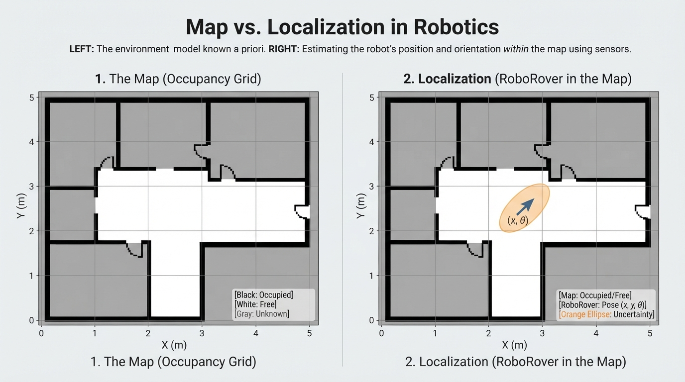
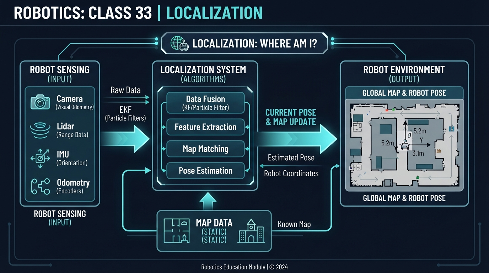
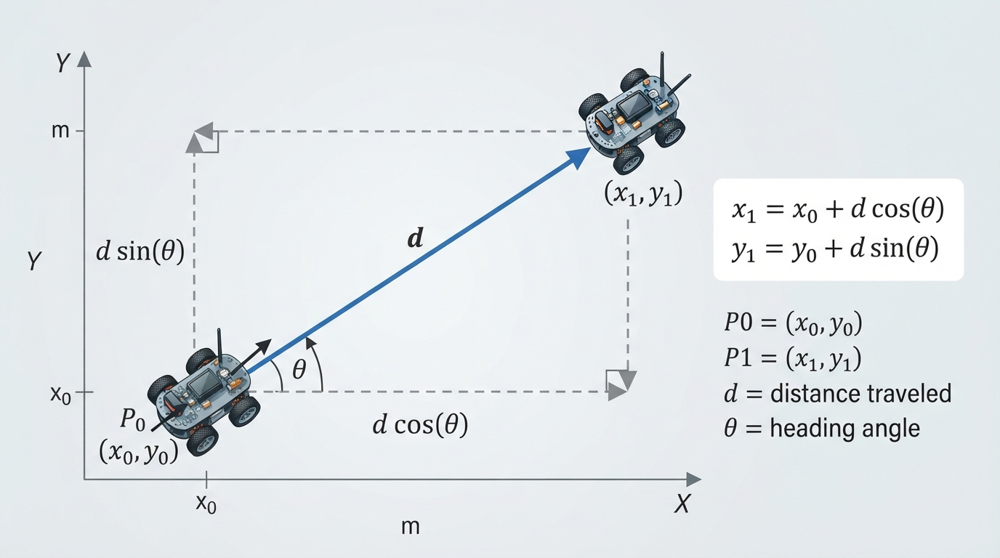
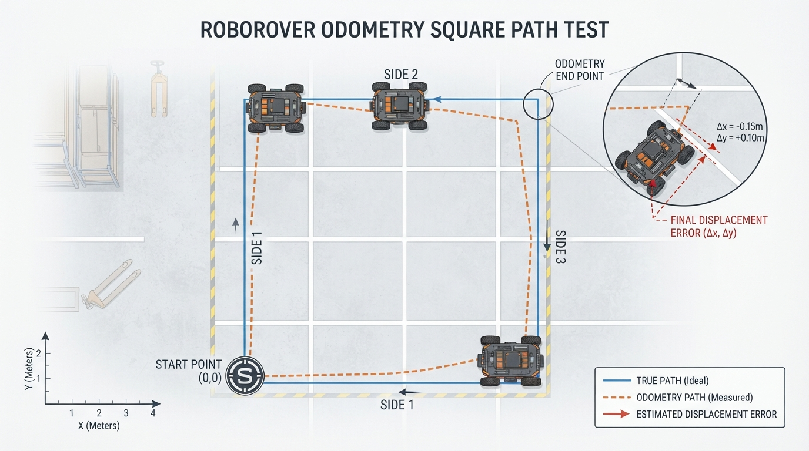

# Class 33: Localization

## Where We Are in the Robotics Journey

In the previous class, RoboRover learned about **occupancy grids**: maps made of small cells that describe which areas are probably free, occupied, or unknown.

But a map alone does not tell RoboRover where it is on that map.

Imagine placing a city map on a table and then closing your eyes. You may possess the map, but you still do not know whether you are near the library, the bridge, or the stadium. A robot faces the same problem.

**Localization** is the process of estimating a robot’s position and orientation inside an environment.

Today, RoboRover already has:

- an occupancy-grid map;
- wheel-encoder measurements, from which it computes an odometry estimate of motion;
- a range sensor that can detect nearby walls or landmarks.

Its new question is:

> “Given what I have measured, where am I on my map?”

**Odometry is the motion estimate computed from measurements such as wheel-encoder readings; the encoder readings themselves are not odometry.** Because those measurements can disagree with the robot’s actual motion, the odometry estimate can drift.

In the next class, we will study **Bayes Rule for Robot Localization**, which gives us a precise mathematical method for combining uncertain evidence.

## Today We Will Learn

By the end of this class, you should be able to:

1. Explain what a robot pose is.
2. Distinguish a map from a robot’s location within that map.
3. Describe how odometry provides a motion-based location estimate.
4. Explain why odometry gradually drifts.
5. Understand how landmarks and sensor observations can correct a location estimate.
6. Represent uncertainty instead of pretending that a location estimate is perfectly exact.
7. Distinguish dead reckoning from localization.
8. Run a small Python simulation of localization drift.

## 2-Minute Recap

An occupancy grid divides an environment into cells. Each cell stores information such as:

- probably free;
- probably occupied;
- not yet observed.

For example, a small map might look like this:

```text
. . . # # . .
. . . # . . .
. . . . . . .
# # . . . . .
```

Here, `.` might represent free space and `#` might represent an obstacle.

The grid is a **map**. It describes the environment.

It does not automatically identify the robot’s current cell.

That distinction is central today:

> Mapping describes the world. Localization estimates where the robot is within that world.

## The Big Idea




**Figure:** An occupancy grid describes the environment; localization adds an estimate of where the robot is and which way it faces.

A robot’s location is more than a pair of coordinates.

A robot can be at the same `(x, y)` position while facing east, west, north, or south. Its orientation matters because the next sensor measurement and motion depend on which way it faces.

Robotics commonly calls this complete position-and-orientation description a **pose**.

For a flat indoor robot, we often write:

\[
\mathbf{x} =
\begin{bmatrix}
x \\
y \\
\theta
\end{bmatrix}
\]

where:

- \(x\) is horizontal position, measured in metres (m);
- \(y\) is vertical position, measured in metres (m);
- \(\theta\) is orientation or facing angle, measured in radians (rad) or degrees.

In this lesson, we choose the following coordinate convention:

- the positive \(x\)-axis points east or to the right;
- the positive \(y\)-axis points north or upward;
- \(0^\circ\) points along the positive \(x\)-axis;
- positive angles rotate counterclockwise toward the positive \(y\)-axis.

These are assumptions chosen for this lesson. A real robot can use a different coordinate frame, positive-axis convention, or zero-angle direction, provided the convention is defined and used consistently.

The bold symbol \(\mathbf{x}\) means that the pose is a collection of related values.

A simple mental picture is a tiny arrow drawn on the map:

```text
             y
             ^
             |
       wall  |       RoboRover
       ##### |          ↗
             |
-------------+----------------> x
```

The arrow’s base marks position. The arrowhead marks orientation.

Localization means estimating the arrow’s pose from imperfect information.

## See It in Your Head

### AI-Generated Engineering Visual · Professor OS



**How to read this visual:** Trace the signal or idea from left to right. Match each block to the lesson explanation, then predict what would change if one block produced a wrong value. The visual should distinguish the map coordinate axes, the robot’s body heading, a sensor ray, and the uncertainty region around the pose estimate.


Imagine RoboRover exploring a warehouse containing:

- a long wall on its left;
- a square storage column;
- a charging station near one corner;
- a narrow doorway.

At the beginning, the robot may know its starting pose fairly well. It then drives forward.

Its wheel encoders report how far the wheels turned. RoboRover uses those readings, together with a motion model, to compute an estimate of how far it moved. This estimate is called **odometry**.

Now suppose one wheel slips slightly. The encoders report wheel rotation, but the wheel’s motion does not perfectly match its movement across the floor. The odometry estimate becomes a little wrong.

After several turns, the error may be large enough that RoboRover believes it is beside the charging station when it is actually near the doorway.

A range sensor now sees a wall 1.2 m away. That observation can be compared with the occupancy grid. If only one region of the map has a wall at approximately that distance and direction, RoboRover gains evidence about where it really is.

The important cycle is:

```text
previous pose estimate
        |
        v
motion measurements ---> predicted new pose
                              |
                              v
                    compare sensor observation
                    with what the map predicts
                              |
                              v
                    improved pose estimate
```

Today we will understand this cycle conceptually. The next class will formalize the combination of uncertain evidence using Bayes Rule.

## Core Concept

### 1. Pose is the robot’s “where and which way”

For a ground robot, pose usually includes:

- position: \(x\) and \(y\);
- orientation: \(\theta\).

A pose such as

\[
(x, y, \theta) = (2.0\text{ m}, 1.5\text{ m}, 90^\circ)
\]

means:

- 2.0 m along the map’s \(x\)-axis;
- 1.5 m along the map’s \(y\)-axis;
- facing in the positive \(y\)-axis direction under this lesson’s convention.

Position without orientation is incomplete for many robotics tasks.

**Orientation is not always the same as direction of travel.** A robot may face one direction while moving another, for example while slipping, being pushed, or using a holonomic drive to move laterally. In this lesson’s simple forward-motion examples, the direction of travel is aligned with the robot’s orientation, but that is an assumption of the example rather than a universal rule.

### 2. Localization is estimation, not instant truth

A real robot usually does not know its exact pose. Instead, it maintains an **estimate**.

For example:

```text
estimated x = 2.0 m ± 0.1 m
estimated y = 1.5 m ± 0.1 m
estimated orientation = 90° ± 4°
```

The symbol `±` means that the estimate has uncertainty. The robot is saying, approximately:

> “I believe I am near this pose, but I could be somewhat different.”

A useful visual is an ellipse around the robot icon. A narrow ellipse means high confidence in position along that direction. A wide ellipse means greater uncertainty.

### 3. Odometry predicts motion

Odometry uses internal motion measurements, often wheel rotation, to estimate how the robot moved.

If RoboRover believes it moved 0.50 m east, its predicted pose changes accordingly.

Odometry is useful because it is:

- available while the robot moves;
- often fast;
- independent of seeing a special landmark.

However, odometry is not perfect. Small errors accumulate. This accumulation is called **drift**.

### 4. Sensors provide evidence about location

A sensor may observe:

- distance to a wall;
- bearing to a known marker;
- a visual feature;
- a magnetic field pattern;
- a recognizable room shape.

The robot compares the observation with its map or known landmarks.

A single sensor reading may not identify one unique location. Several places might contain a wall 1.2 m away. More observations, or observations from different directions, usually provide stronger evidence.

### 5. Localization is different from mapping

These tasks are related but not identical:

| Task | Main question |
|---|---|
| Mapping | “What is in the environment?” |
| Localization | “Where am I in the map?” |

A robot may use localization to interpret new sensor readings in the correct part of a map. Conversely, a robot that is badly localized may place new map data in the wrong location.

### 6. Dead reckoning and localization are related but different

**Dead reckoning** propagates a pose estimate from a known or assumed starting pose using measured motion. Wheel odometry is a common source of dead-reckoning updates.

**Localization** estimates pose relative to an environment or map by using available evidence, which may include dead reckoning, landmarks, range observations, camera observations, or other sensors.

Thus, the Python activity below is an **odometry precursor**: it demonstrates dead-reckoning drift, but it does not perform full map-based localization because it does not implement a sensor correction.

## Math Without Fear




**Figure:** A measured forward distance becomes horizontal and vertical displacement through the robot's heading angle.

Suppose a robot begins at pose

\[
(x_0, y_0, \theta_0)
\]

and estimates that it moves a distance \(d\) in its current orientation. Under the lesson’s convention, the simple motion update is:

\[
x_1 = x_0 + d\cos(\theta_0)
\]

\[
y_1 = y_0 + d\sin(\theta_0)
\]

where:

- \(x_0, y_0\) are the starting coordinates in metres (m);
- \(x_1, y_1\) are the updated coordinates in metres (m);
- \(d\) is travelled distance in metres (m);
- \(\theta_0\) is orientation in radians (rad);
- \(\cos\) and \(\sin\) are trigonometric functions.

The angle must be in radians when using most Python trigonometric functions. The equation also assumes that the robot travels forward in the direction of its current orientation, with no sideways motion during this update.

### Worked numerical example

RoboRover starts at:

\[
x_0 = 1.0\text{ m}, \qquad y_0 = 2.0\text{ m}
\]

It faces:

\[
\theta_0 = 60^\circ
\]

and estimates that it travels:

\[
d = 0.80\text{ m}
\]

Convert the angle:

\[
60^\circ = \frac{\pi}{3}\text{ rad}
\]

Then:

\[
x_1 = 1.0 + 0.80\cos(60^\circ)
\]

\[
x_1 = 1.0 + 0.80(0.5) = 1.40\text{ m}
\]

For the vertical direction:

\[
y_1 = 2.0 + 0.80\sin(60^\circ)
\]

Since \(\sin(60^\circ)\) is approximately \(0.866\):

\[
y_1 \approx 2.0 + 0.80(0.866)
\]

\[
y_1 \approx 2.693\text{ m}
\]

So the estimated new position is approximately:

\[
(x_1, y_1) = (1.40\text{ m}, 2.693\text{ m})
\]

Interpretation: RoboRover moves 0.40 m in the positive \(x\)-direction and approximately 0.693 m in the positive \(y\)-direction. This is a prediction based on motion measurement, not a guaranteed truth.

If the wheels slipped, the actual position could differ.

### Optional uncertainty extension: a simple error ellipse

Uncertainty can be represented numerically as well as visually. In a simplified two-dimensional example, suppose the position uncertainty before a short motion is represented by the covariance matrix

\[
P_{\text{before}} =
\begin{bmatrix}
0.05^2 & 0 \\
0 & 0.05^2
\end{bmatrix}
\text{ m}^2.
\]

This says that the standard deviation is 0.05 m in both coordinate directions, with no correlation in this simplified model.

Suppose the motion model adds independent position uncertainty of 0.02 m in \(x\) and 0.01 m in \(y\):

\[
Q =
\begin{bmatrix}
0.02^2 & 0 \\
0 & 0.01^2
\end{bmatrix}
\text{ m}^2.
\]

For this simplified axis-aligned case:

\[
P_{\text{after}} = P_{\text{before}} + Q
=
\begin{bmatrix}
0.0029 & 0 \\
0 & 0.0026
\end{bmatrix}
\text{ m}^2.
\]

The corresponding standard deviations are approximately:

\[
\sigma_x = \sqrt{0.0029} \approx 0.0539\text{ m},
\qquad
\sigma_y = \sqrt{0.0026} \approx 0.0510\text{ m}.
\]

The uncertainty ellipse therefore becomes slightly wider after motion. Real systems also account for orientation uncertainty, correlations, nonlinear motion, and sensor corrections. This calculation is only an introductory illustration of how uncertainty can grow during dead reckoning.

## Worked Robotics Example




**Figure:** Small distance errors on four sides leave the odometry estimate slightly displaced from the true starting point.

RoboRover drives around a small marked floor. Its true path is known to the experimenter, but RoboRover only uses noisy distance measurements.

The planned motion is:

1. drive 1.0 m east;
2. turn 90°;
3. drive 1.0 m north;
4. turn 90°;
5. drive 1.0 m west;
6. turn 90°;
7. drive 1.0 m south.

Ideally, the robot returns to its starting position.

This calculation assumes exact 90° turns and perfect knowledge of the commanded headings. It isolates distance errors. In a real robot, heading errors can create larger cross-track and final-position errors than this distance-only calculation shows.

Now suppose each measured drive distance has a small error:

- first estimate: 1.02 m;
- second estimate: 0.97 m;
- third estimate: 1.04 m;
- fourth estimate: 0.96 m.

The odometry estimate after the four sides is displaced by:

\[
\Delta x = 1.02 - 1.04 = -0.02\text{ m}
\]

\[
\Delta y = 0.97 - 0.96 = 0.01\text{ m}
\]

The estimated final position is therefore 2 cm west and 1 cm north of the estimated starting point.

This result is not necessarily a serious failure in a small demonstration. In a larger warehouse, repeated motion and turning errors can accumulate into much larger displacement.

A wall observation or known landmark can help correct the estimate. However, the sensor itself also has noise, and the map may be imperfect. Localization is therefore a process of combining imperfect clues.

## Python Lab

This program simulates RoboRover driving a square. The true robot follows exact 1 m sides. The odometry estimate uses slightly incorrect distances. The program plots both paths.

It also verifies the calculated final odometry error with assertions. The code uses Python’s standard library and `matplotlib`.

If `matplotlib` is not installed, install it for the current Python environment with:

```bash
python -m pip install matplotlib
```

On some systems, the command may be:

```bash
python3 -m pip install matplotlib
```

Without `matplotlib`, the motion calculations and assertions can still be run after removing the plotting import and plotting block, but the graph will not be displayed.

```python
import math
import matplotlib.pyplot as plt


def move(x, y, heading_degrees, distance):
    """Return the new x and y after moving a measured distance."""
    heading_radians = math.radians(heading_degrees)
    new_x = x + distance * math.cos(heading_radians)
    new_y = y + distance * math.sin(heading_radians)
    return new_x, new_y


def make_path(distances):
    """Build a square-like path using east, north, west, south headings."""
    headings = [0.0, 90.0, 180.0, 270.0]
    x = 0.0
    y = 0.0
    path = [(x, y)]

    for heading, distance in zip(headings, distances):
        x, y = move(x, y, heading, distance)
        path.append((x, y))

    return path


true_distances = [1.00, 1.00, 1.00, 1.00]
odometry_distances = [1.02, 0.97, 1.04, 0.96]

true_path = make_path(true_distances)
odometry_path = make_path(odometry_distances)

true_final = true_path[-1]
odometry_final = odometry_path[-1]

# Verification of the final positions for this floating-point model.
assert math.isclose(true_final[0], 0.0, abs_tol=1e-12)
assert math.isclose(true_final[1], 0.0, abs_tol=1e-12)
assert math.isclose(odometry_final[0], -0.02, abs_tol=1e-12)
assert math.isclose(odometry_final[1], 0.01, abs_tol=1e-12)

error_x = odometry_final[0] - true_final[0]
error_y = odometry_final[1] - true_final[1]
error_distance = math.hypot(error_x, error_y)

print("True final position: ({:.2f}, {:.2f}) m".format(
    true_final[0], true_final[1]
))
print("Odometry final position: ({:.2f}, {:.2f}) m".format(
    odometry_final[0], odometry_final[1]
))
print("Odometry error: ({:.2f}, {:.2f}) m".format(error_x, error_y))
print("Error distance: {:.5f} m".format(error_distance))

true_x = [point[0] for point in true_path]
true_y = [point[1] for point in true_path]
odom_x = [point[0] for point in odometry_path]
odom_y = [point[1] for point in odometry_path]

plt.figure(figsize=(7, 7))
plt.plot(true_x, true_y, "o-", label="True path")
plt.plot(odom_x, odom_y, "s--", label="Odometry estimate")
plt.scatter([0.0], [0.0], marker="*", s=150, label="Start")

plt.xlabel("x position (m)")
plt.ylabel("y position (m)")
plt.title("RoboRover: true path and odometry estimate")
plt.axis("equal")
plt.grid(True)
plt.legend()
plt.show()
```

Important lines:

- `move(...)` applies the motion equations from the previous section.
- `math.radians(...)` converts degrees to radians.
- `make_path(...)` applies four motions in sequence.
- `true_distances` represent ideal motion.
- `odometry_distances` represent RoboRover’s imperfect measurements.
- The `assert` statements verify the final results used by the program, allowing for tiny floating-point rounding differences.
- `plt.axis("equal")` prevents the plot from visually stretching one axis more than the other.

This lab is an **odometry precursor**, not a complete localization system. It demonstrates dead-reckoning drift because the program does not use a landmark or range-sensor measurement to correct the odometry path.

## Mini Simulation or Game

Play “Where Is RoboRover?”

Use graph paper or a sheet of squared paper.

1. Draw a 6-by-6 grid.
2. Mark a starting pose with an arrow.
3. Choose three hidden landmarks, such as:
   - a wall;
   - a square column;
   - a charging station.
4. Give RoboRover a sequence of motion instructions.
5. Add a small error to one movement, such as “the robot thinks it moved 4 squares, but it really moved 3.5.”
6. After each move, draw:
   - the true position;
   - the odometry estimate;
   - an uncertainty circle around the estimate.
7. Reveal one landmark observation and ask: which possible positions are now less likely?

For a simple version, use only north, south, east, and west movement. Do not worry about Bayes Rule yet. The goal is to notice that:

- motion creates a prediction;
- errors accumulate;
- observations can eliminate some possible locations.

### Predict before you run it

Before running the Python program, predict:

1. Will the true path end exactly at the start?
2. Will the odometry estimate end exactly at the start?
3. Will the final error be zero, small, or large compared with a 1 m square?

Write down your prediction before looking at the plot.

## What Should Happen?

The true path returns to the starting point because its four distances are all exactly 1.00 m.

The odometry estimate does not return exactly to the starting point because its four measured distances are different. The plot should show the estimated final point slightly away from the start.

The final displacement components are:

- \(-0.02\) m in \(x\);
- \(+0.01\) m in \(y\).

The displacement magnitude is:

\[
\sqrt{(-0.02\text{ m})^2 + (0.01\text{ m})^2}
\approx 0.02236\text{ m}
\]

That is approximately 2.24 cm.

The result is a small error for this four-step example, but the lesson is not that odometry is always accurate. The lesson is that even small errors can accumulate, and the size of the error depends on the robot, floor, wheels, sensors, turning, and time.

## Common Mistakes

### Mistake 1: Treating the map as the robot’s location

An occupancy grid may be perfectly detailed while RoboRover is still unsure where it is on that grid.

### Mistake 2: Forgetting orientation

The pose `(2 m, 1 m, 0°)` is not equivalent to `(2 m, 1 m, 180°)`. The robot is at the same position but faces opposite directions.

### Mistake 3: Assuming odometry is the true path

Odometry is a motion estimate computed from measurements. Wheel slip, uneven floors, incorrect wheel diameter, and encoder errors can all make it inaccurate.

### Mistake 4: Expecting one sensor reading to identify one location

A wall 1 m away may occur in many places on a map. Localization usually needs multiple observations, motion history, or distinctive landmarks.

### Mistake 5: Confusing precision with accuracy

A robot may report a pose with many decimal places while still being wrong. More digits do not automatically mean a better estimate.

### Practical engineering caveat: calibration and wheel slip

Suppose one wheel has a slightly different effective diameter from the other. During a supposedly straight drive, RoboRover may slowly curve. If its software assumes both wheels are identical, the localization estimate will drift even on a smooth floor.

Engineers reduce this problem through calibration, better models, sensor fusion, and occasional corrections from external observations. No method removes every source of uncertainty.

## Try It Yourself

### Challenge

Change the Python program so that the odometry errors are larger:

```python
odometry_distances = [1.10, 0.90, 1.08, 0.92]
```

Predict the final error before running the program.

Then answer:

1. Does the true path change?
2. Does the odometry path change?
3. Which direction is the final estimated displacement?
4. Why might a real robot need a landmark or wall observation after a long journey?

### Challenge answer check

For the altered distances and the same exact headings:

\[
\Delta x = 1.10 - 1.08 = 0.02\text{ m}
\]

\[
\Delta y = 0.90 - 0.92 = -0.02\text{ m}
\]

Therefore, the odometry estimate finishes 2 cm east and 2 cm south of the starting point. Its displacement magnitude is:

\[
\sqrt{(0.02\text{ m})^2 + (-0.02\text{ m})^2}
\approx 0.02828\text{ m}
\]

or approximately 2.83 cm.

| Quantity | Expected result |
|---|---|
| True path | Unchanged; it still uses four 1.00 m sides |
| Odometry path | Changed; it uses the altered distances |
| Final \(x\) displacement | \(+0.02\) m |
| Final \(y\) displacement | \(-0.02\) m |
| Final displacement magnitude | Approximately \(0.02828\) m |
| Direction | East and south relative to the start |

### Optional extension

Add a fifth point representing a landmark at `(0.0, 1.0)` m. Draw it with a different marker.

Pretend RoboRover recognizes this landmark at the end. Add a text comment explaining:

> “The observation does not magically prove the exact pose; it provides evidence that can be compared with possible poses.”

Do not implement Bayes Rule yet. That is the next class.

## Quick Quiz

1. What three quantities usually make up a flat-ground robot pose?

2. Why does odometry drift over time?

3. A robot has an occupancy grid but no estimate of its position on that grid. Which robotics problem remains unsolved: mapping or localization?

4. RoboRover moves 2.0 m while facing \(90^\circ\). If it starts at \((1.0\text{ m}, 1.5\text{ m})\), what position does the simple motion model predict? Assume \(0^\circ\) points along positive \(x\), and \(90^\circ\) points along positive \(y\).

5. What is the difference between dead reckoning and localization?

## Answers

1. Position \(x\), position \(y\), and orientation or heading \(\theta\).

2. Motion measurements are imperfect. Wheel slip, calibration errors, uneven surfaces, and turning errors cause the estimated motion to differ from the actual motion. Repeated errors accumulate.

3. Localization remains unsolved. The map describes the environment, but localization estimates where the robot is within it.

4. At \(90^\circ\), the robot moves entirely in the positive \(y\)-direction in this simplified model:

\[
x_1 = 1.0\text{ m}
\]

\[
y_1 = 1.5\text{ m} + 2.0\text{ m} = 3.5\text{ m}
\]

The predicted position is:

\[
(1.0\text{ m}, 3.5\text{ m})
\]

5. Dead reckoning propagates a pose estimate from motion measurements. Localization estimates pose relative to an environment or map by combining available evidence, which can include dead reckoning and sensor observations.

## Real Robot Connection

A mobile robot often maintains a continuously updated pose estimate while it moves.

A typical system may:

1. use wheel encoders to predict motion;
2. use an inertial sensor to measure turning or acceleration;
3. compare camera or range-sensor observations with the map;
4. update the pose estimate;
5. continue moving using the improved estimate.

Different sensors have different weaknesses:

- wheel odometry can drift;
- cameras can struggle with darkness or repetitive surfaces;
- range sensors can be confused by glass or shiny surfaces;
- inertial sensors can accumulate bias;
- maps can become outdated when furniture moves.

Localization is therefore not simply “read the robot’s coordinates.” It is the engineering problem of maintaining a useful estimate despite uncertain motion, imperfect observations, and changing environments.

In the next class, Bayes Rule will provide a language for answering questions such as:

> “Given this sensor observation, how much should RoboRover increase or decrease its belief that it is in this location?”

## Vocabulary

- **Localization:** Estimating a robot’s position and orientation within an environment or map.
- **Pose:** A robot’s position and orientation. For a flat-ground robot, this is commonly represented by \(x\), \(y\), and orientation \(\theta\).
- **Position:** A location described by coordinates, such as \(x\) and \(y\).
- **Orientation:** The direction in which the robot is facing.
- **Heading:** The robot’s orientation or facing direction, often represented by an angle. Heading is not necessarily the direction of travel; a robot may face one direction while moving another.
- **Odometry:** A motion estimate computed from internal measurements, commonly wheel-encoder or joint-motion measurements.
- **Dead reckoning:** Propagating a pose estimate from a starting estimate using measured motion, without necessarily using external location evidence.
- **Drift:** Gradual growth of error in an estimate as motion or sensor errors accumulate.
- **Landmark:** A recognizable environmental feature that can provide location evidence.
- **Pose estimate:** The robot’s current best description of its pose, including uncertainty.
- **Uncertainty:** The range of possible values or poses still consistent with the available evidence.
- **Occupancy grid:** A map divided into cells that store information about whether areas are likely free, occupied, or unknown.

## Further Learning

To deepen this class, try the following investigations:

- Search for educational material on **robot pose representation**.
- Study **wheel odometry for differential-drive robots**.
- Compare **dead reckoning** with landmark-based localization.
- Draw several possible robot poses that could produce the same single wall-distance measurement.
- Review occupancy-grid maps and mark which map regions are visually distinctive enough to help localization.

The next lesson will introduce Bayes Rule. It will not treat every possible pose as equally likely automatically; instead, it will show how prior belief and sensor evidence can be combined mathematically.

## Next Class

**Class 34: Bayes Rule for Robot Localization**

RoboRover now has a map, motion predictions, and sensor observations. Next, we will learn how to update its belief about location when new evidence arrives.