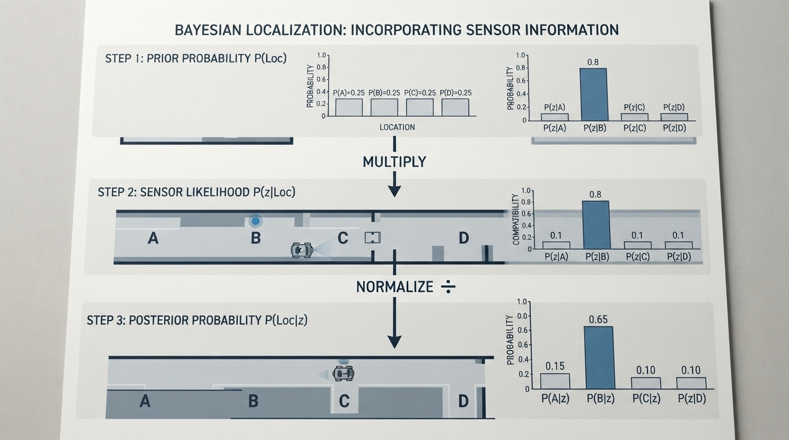
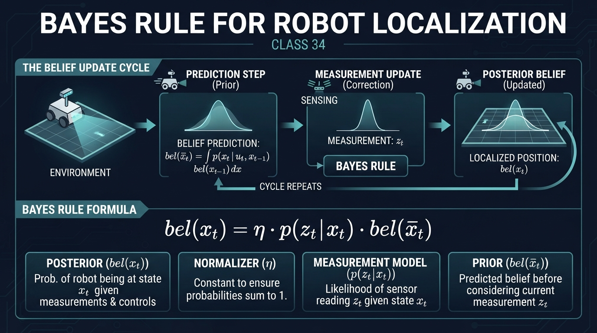
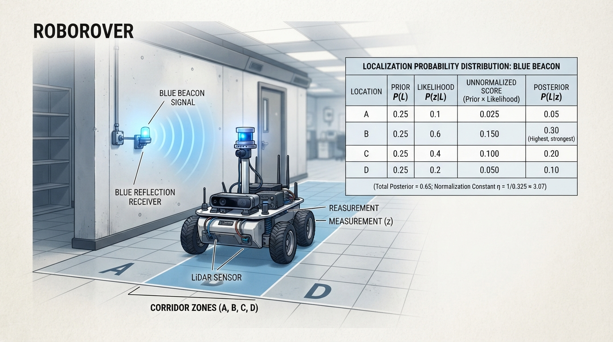
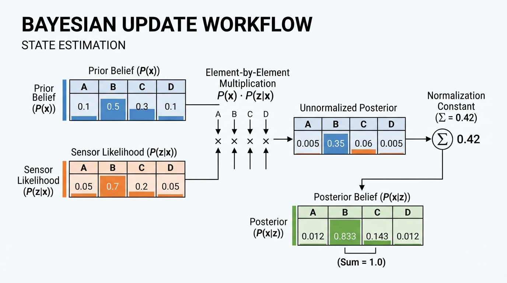
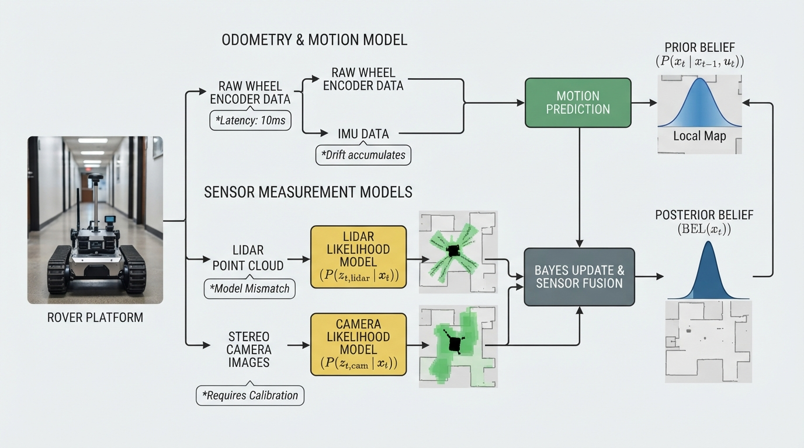

# Class 34: Bayes Rule for Robot Localization

## Where We Are in the Robotics Journey

In the previous class, we studied **localization**: estimating where RoboRover is when motion and sensors are imperfect.

A robot rarely knows its exact position. Instead, it maintains a **belief**: a probability distribution over possible positions. Today we make one belief update systematic using **Bayes rule**.

In the next class, particle filters will represent beliefs with many sample guesses. The reasoning behind their sensor update is still Bayesian.

## Today We Will Learn

By the end of this class, you should be able to:

1. Explain a Bayesian belief update in ordinary language.
2. Distinguish a prior, likelihood, and posterior.
3. Update a small discrete localization problem.
4. Implement the update in Python.
5. Explain why equal likelihoods provide no localization information.
6. Recognize why impossible observations and dependent evidence require care.

The worked example and Python lab are the core lesson. The second observation and engineering notes are extensions.

## 2-Minute Recap

Imagine RoboRover is somewhere in a four-cell corridor:

```text
[ A ] [ B ] [ C ] [ D ]
```

Before sensing:

```text
A: 0.25     B: 0.25     C: 0.25     D: 0.25
```

These values describe uncertainty, not distance.

A localization cycle usually repeats:

1. **Predict:** use motion information to estimate the new position.
2. **Sense:** receive a measurement.
3. **Update:** increase belief in states that make the measurement likely.

Today focuses on step 3. Assume A, B, C, and D are mutually exclusive and collectively exhaustive: RoboRover occupies exactly one of these listed states.

### Prerequisite: Conditional Probability

The expression \(P(z\mid x)\) means:

> the probability of observation \(z\), given that state \(x\) is true.

For example, \(P(\text{blue}\mid B)=0.80\) means that the sensor reports blue 80% of the time when RoboRover is at B. This is different from \(P(B\mid\text{blue})\), the probability that RoboRover is at B after seeing blue.

## The Big Idea



**Figure:** The update process multiplies prior belief by sensor compatibility, then normalizes the results.

Suppose the sensor reports:

> “I detect a blue beacon.”

For this observation:

| Location | Likelihood \(P(\text{blue}\mid x)\) |
|---|---:|
| A | 0.10 |
| B | 0.80 |
| C | 0.20 |
| D | 0.10 |

The likelihood entries are conditional probabilities indexed by state. They are not a probability distribution across locations, so they do not need to sum to 1.

Bayes rule can be summarized as:

> Multiply old belief by evidence compatibility, then rescale the results so they sum to 1.

A location needs both a plausible prior and a compatible observation to receive a large posterior. With equal priors, B becomes the strongest candidate because its blue likelihood is largest. It is not certain: the sensor is noisy.

## See It in Your Head

### AI-Generated Engineering Visual · Professor OS



**How to read this visual:** The left panel shows the prior belief, the middle panel shows the likelihood of the specific observation “blue,” and the right panel shows the normalized posterior. The visual represents these numerical values:

```text
Before sensing       P(blue | location)       After update
A  0.25              A  0.10                  A  0.0833
B  0.25              B  0.80                  B  0.6667
C  0.25              C  0.20                  C  0.1667
D  0.25              D  0.10                  D  0.0833
```

The middle column is evidence compatibility, not belief. The right column is a probability distribution. Large, high-contrast labels should remain readable, and color should not be the only way to distinguish the panels.

**Text-only equivalent:** For each row, multiply the prior by the matching likelihood, add all products, and divide each product by that total.

## Core Concept

Bayes rule is:

\[
P(x\mid z)=\frac{P(z\mid x)P(x)}{P(z)}
\]

where:

- \(P(x)\) is the **prior**, belief before the observation;
- \(P(z\mid x)\) is the **likelihood**, probability of the observation at state \(x\);
- \(P(x\mid z)\) is the **posterior**, belief after the observation;
- \(P(z)\) is the observation probability used for normalization.

For a complete set of possible states, calculate scores first:

\[
\text{score}(x)=P(z\mid x)P(x)
\]

Then normalize:

\[
P(x\mid z)=
\frac{\text{score}(x)}
{\sum_i\text{score}(x_i)}
\]

The denominator is:

\[
P(z)=\sum_iP(z\mid x_i)P(x_i)
\]

It includes every state in the defined state set. If a possible state was omitted, the denominator would not represent the full observation probability.

This update changes a belief; it does not command the robot. A separate decision or control system chooses an action.

## Math Without Fear

With equal priors and the blue likelihoods above:

\[
\begin{aligned}
s_A&=0.10(0.25)=0.025\\
s_B&=0.80(0.25)=0.200\\
s_C&=0.20(0.25)=0.050\\
s_D&=0.10(0.25)=0.025
\end{aligned}
\]

The normalization total is:

\[
0.025+0.200+0.050+0.025=0.300
\]

Therefore:

\[
P(x\mid\text{blue})=
[0.0833\ldots,\;0.6667\ldots,\;0.1667\ldots,\;0.0833\ldots]
\]

or exactly:

\[
[1/12,\;2/3,\;1/6,\;1/12]
\]

B is most likely, but the posterior is not certainty.

A strong prior can outweigh a favorable likelihood. For example, with prior:

```text
A: 0.60     B: 0.10     C: 0.20     D: 0.10
```

the scores are:

```text
A: 0.060    B: 0.080    C: 0.040    D: 0.010
```

After normalization, B is still largest, but A retains substantial probability because its prior was much stronger.

## Worked Robotics Example



**Figure:** A sensor report favors B because blue detection is most likely there, but the other locations retain nonzero probability.

RoboRover’s prior and blue sensor model are:

| Location | Prior | \(P(\text{blue}\mid x)\) |
|---|---:|---:|
| A | 0.25 | 0.10 |
| B | 0.25 | 0.80 |
| C | 0.25 | 0.20 |
| D | 0.25 | 0.10 |

**Prediction pause:** Which location should have the highest posterior, and why? With equal priors, the largest likelihood produces the largest score, so predict B.

| Location | Score | Posterior |
|---|---:|---:|
| A | 0.025 | 0.0833 |
| B | 0.200 | 0.6667 |
| C | 0.050 | 0.1667 |
| D | 0.025 | 0.0833 |

### Advanced extension: a second observation

Suppose the next report is “no blue.” For this binary observation model:

\[
P(\text{no blue}\mid x)=1-P(\text{blue}\mid x)
\]

so the likelihoods are `[0.90, 0.20, 0.80, 0.90]`.

Assume the two readings are conditionally independent given location:

\[
P(z_2\mid x,z_1)=P(z_2\mid x)
\]

Then the second update can use the first posterior as its prior. The final result is:

```text
A: 0.18     B: 0.32     C: 0.32     D: 0.18
```

B and C tie. Without conditional independence, use \(P(z_2\mid x,z_1)\) rather than multiplying separate likelihoods.

## Python Lab



**Figure:** The Python function performs the same three operations as the equation: multiply, sum, and divide.

### First, implement the core yourself

Before reading the defensive version below, write a function that:

1. multiplies matching prior and likelihood values;
2. adds the scores;
3. divides each score by the total.

Test it with:

```python
prior = [0.25, 0.25, 0.25, 0.25]
likelihood = [0.10, 0.80, 0.20, 0.10]
```

Your result should sum to 1 and place the largest value at index 1, location B.

### Defensive implementation

This Python 3.7-compatible version adds length, range, finite-value, valid-prior, and impossible-observation checks. The likelihood values do not need to sum to 1 across locations.

```python
import math


def bayes_update(prior, likelihood):
    if len(prior) != len(likelihood) or not prior:
        raise ValueError("Inputs must have the same nonzero length.")

    tolerance = 1e-12
    for value in prior + likelihood:
        if not math.isfinite(value) or value < 0.0 or value > 1.0:
            raise ValueError("Values must be finite and between 0 and 1.")

    if abs(sum(prior) - 1.0) > tolerance:
        raise ValueError("Prior must sum to 1.")

    scores = [p * l for p, l in zip(prior, likelihood)]
    total = sum(scores)
    if total <= 0.0:
        raise ValueError("Observation is impossible under this model.")

    posterior = [score / total for score in scores]
    assert abs(sum(posterior) - 1.0) < tolerance
    return posterior


def print_belief(label, belief):
    print(label)
    print(["{:.6f}".format(value) for value in belief])
    print("total: {:.6f}".format(sum(belief)))


prior = [0.25, 0.25, 0.25, 0.25]
blue = [0.10, 0.80, 0.20, 0.10]
no_blue = [0.90, 0.20, 0.80, 0.90]

after_blue = bayes_update(prior, blue)
after_no_blue = bayes_update(after_blue, no_blue)

assert all(
    abs(actual - expected) < 1e-12
    for actual, expected in zip(
        after_blue, [1.0 / 12.0, 2.0 / 3.0, 1.0 / 6.0, 1.0 / 12.0]
    )
)
assert all(
    abs(actual - expected) < 1e-12
    for actual, expected in zip(
        after_no_blue, [9.0 / 50.0, 8.0 / 25.0,
                        8.0 / 25.0, 9.0 / 50.0]
    )
)

equal_evidence = bayes_update(after_blue, [0.5, 0.5, 0.5, 0.5])
assert all(
    abs(actual - expected) < 1e-12
    for actual, expected in zip(equal_evidence, after_blue)
)

print_belief("After blue:", after_blue)
print_belief("After blue, then no blue:", after_no_blue)
print("All checks passed.")
```

Expected output:

```text
After blue:
['0.083333', '0.666667', '0.166667', '0.083333']
total: 1.000000
After blue, then no blue:
['0.180000', '0.320000', '0.320000', '0.180000']
total: 1.000000
All checks passed.
```

The assertions verify every exact numerical result used above. If all likelihoods are equal, normalization removes their common scale factor, so the supplied prior remains unchanged.

## Mini Simulation or Game

Play **RoboRover’s Evidence Detective**. Before running the program, predict:

| Experiment | Highest-probability location(s) | Why? |
|---|---|---|
| After blue |  |  |
| After blue, then no blue |  |  |
| Second likelihood equal everywhere |  |  |
| Prior changed to `[0.70, 0.10, 0.10, 0.10]` |  |  |

Change only one input at a time:

```python
no_blue = [0.5, 0.5, 0.5, 0.5]
```

This second observation is equally likely everywhere, so it leaves the already-updated belief unchanged.

Then try:

```python
no_blue = [0.99, 0.01, 0.99, 0.99]
```

This strongly rejects B when the sensor reports no blue.

Finally, replace the prior with:

```python
prior = [0.70, 0.10, 0.10, 0.10]
```

Explain why a strong prior can keep A competitive even though blue is most likely at B. Do not merely check which answer wins: describe the multiplication of prior and likelihood.

## What Should Happen?

For the baseline:

- B is highest after blue.
- B and C tie after blue followed by no blue.
- Every printed belief totals 1.000000.
- The program reports that all checks passed.

For equal second-step likelihoods, the belief after blue does not change. Equal evidence rescales every score by the same amount and normalization removes that scale.

For the changed prior, A receives a large starting weight. The blue observation favors B, but the posterior depends on both factors.

The diagnostic principle is:

> Evidence changes relative belief only when it distinguishes between states.

## Common Mistakes

**Reversing the conditional.**  
\(P(z\mid x)\) asks how likely the observation is at a known location. \(P(x\mid z)\) is the posterior being calculated.

**Treating likelihoods as a distribution across locations.**  
Likelihood entries describe one observation at different states. They need not sum to 1 across states.

**Skipping normalization.**  
Products are scores, not yet a probability distribution.

**Treating the maximum as certainty.**  
A posterior of 0.667 means about two-thirds under this model, not “definitely.”

**Making the sensor unrealistically certain.**  
Assigning likelihood zero to every state except one can make the robot overconfident.

**Assuming dependent observations are independent.**  
Repeated readings from the same blurry image may duplicate information and exaggerate confidence if multiplied as independent.

**Ignoring an impossible observation.**  
If every score is zero, the model cannot explain the measurement. The code raises an error rather than inventing a belief.

**Using an invalid prior.**  
A prior must contain finite, nonnegative values that sum to 1.

## Try It Yourself

### Challenge: Find RoboRover’s Starting Zone

RoboRover has this prior:

```text
A: 0.10
B: 0.40
C: 0.40
D: 0.10
```

For observation “red,” the likelihoods are:

```text
A: 0.70
B: 0.20
C: 0.60
D: 0.10
```

Calculate scores, normalize them, and identify the most likely zone before opening the solution.

<details>
<summary>Solution check</summary>

The scores are:

\[
[0.07,\;0.08,\;0.24,\;0.01]
\]

Their total is \(0.40\), so the posterior is:

```text
A: 0.175
B: 0.200
C: 0.600
D: 0.025
```

C is most likely.

</details>

As an extension, apply a second likelihood:

```text
P(no red | A) = 0.30
P(no red | B) = 0.80
P(no red | C) = 0.40
P(no red | D) = 0.90
```

Assuming conditional independence, the scores from the first posterior are:

```text
A: 0.0525
B: 0.1600
C: 0.2400
D: 0.0225
```

They total \(0.475\), producing approximately:

```text
A: 0.110526
B: 0.336842
C: 0.505263
D: 0.047368
```

Add an assertion that this new posterior sums to 1.

## Quick Quiz

1. What is the difference between a prior and a posterior?
2. In \(P(z\mid x)\), what does the vertical bar mean?
3. Why are scores normalized?
4. What happens when every state has the same likelihood?
5. How can a strong prior outweigh a favorable likelihood?

## Answers

1. The prior is belief before the observation; the posterior is belief after incorporating it.
2. It means “given.” \(P(z\mid x)\) is the probability of observation \(z\) when state \(x\) is true.
3. Multiplication creates relative scores. Normalization makes them sum to 1.
4. The relative belief does not change because every score is multiplied by the same factor.
5. The posterior uses the product \(P(z\mid x)P(x)\). A state with a less favorable likelihood can still win if its prior is sufficiently larger.

## Real Robot Connection



**Figure:** Real localization systems must combine uncertain motion and sensor models while accounting for calibration and timing problems.

A real robot may use wheel encoders, cameras, lidar, radio signals, or landmarks. Each sensor is uncertain, so localization combines a prior with a sensor model rather than trusting one reading absolutely.

**Text-only equivalent:** Motion prediction produces a prior. A sensor model supplies a likelihood for each state. The system multiplies and normalizes to obtain the updated belief.

Practical issues include:

- **Calibration:** the likelihood model must match the real sensor.
- **Latency:** a camera image may describe an earlier position.
- **Drift:** wheel estimates become less reliable over time.
- **Model mismatch:** lighting, dust, or changed surroundings can invalidate old likelihoods.
- **Numerical underflow:** many tiny products may require logarithmic methods in larger systems.

A full localization algorithm alternates motion prediction and measurement updates. Today isolates the measurement update so its logic is visible.

The engineering question is:

> What evidence would this sensor produce at each possible state, and how trustworthy is that model?

## Vocabulary

- **Belief:** A probability distribution representing uncertainty about the robot’s state.
- **Prior:** Belief before a new observation.
- **Likelihood:** The probability of an observation assuming a particular state.
- **Posterior:** Belief after incorporating an observation.
- **Measurement update:** Incorporating an observation into a prior to produce a posterior.
- **Bayesian measurement update:** A measurement update using a prior, likelihood, and normalization.
- **Bayes rule:** A rule for updating probabilities using prior belief and evidence.
- **Normalization:** Rescaling scores so a distribution sums to 1.
- **Sensor model:** A description of how likely readings are in different states.
- **State:** The quantity being estimated, such as position, orientation, or velocity.
- **Evidence:** A measurement used to update belief.

## Further Learning

For further study, search for:

- “Bayesian filtering robotics”
- “discrete Bayes localization”
- “probabilistic robotics sensor models”
- “likelihood versus posterior probability”

Always label the direction of a conditional probability. Confusing \(P(z\mid x)\) with \(P(x\mid z)\) is a common localization error.

## Next Class

Next class introduces **particle filters**.

Instead of storing one probability for each cell, RoboRover will represent its belief with many particles: sampled guesses of its state. Sensor evidence will weight those particles, and higher-weight particles will be more likely to survive.

The same Bayes idea remains; the representation becomes more flexible for continuous or irregular environments.