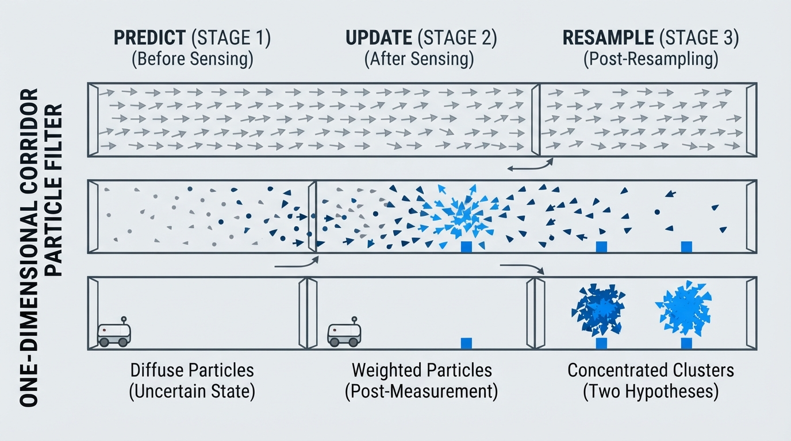
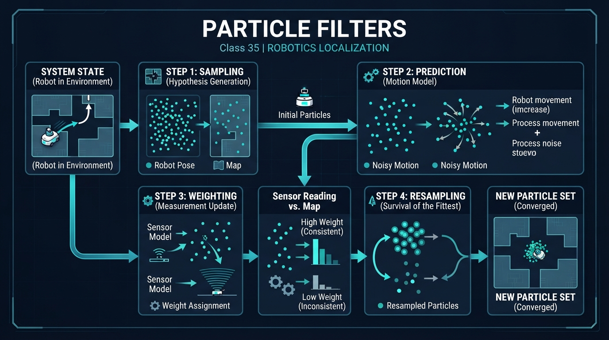
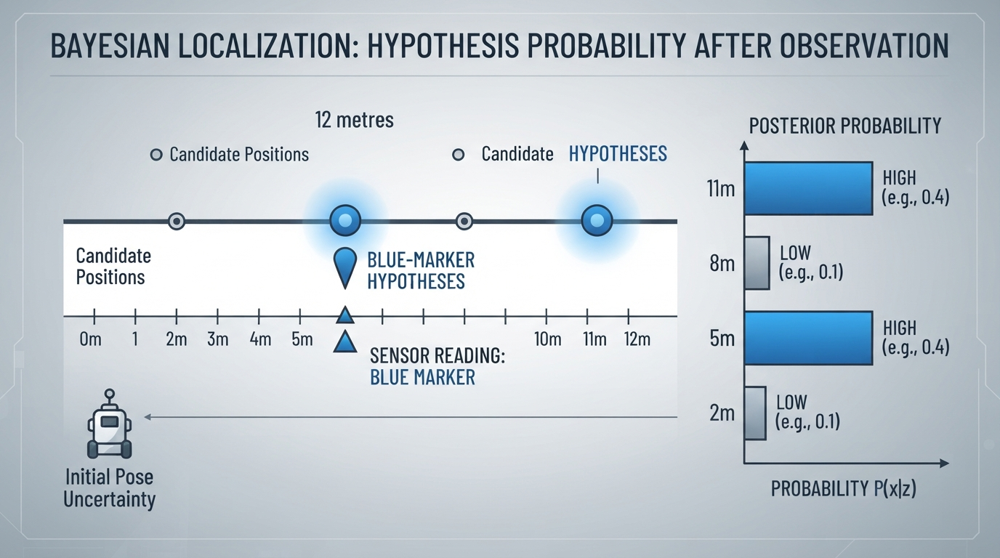
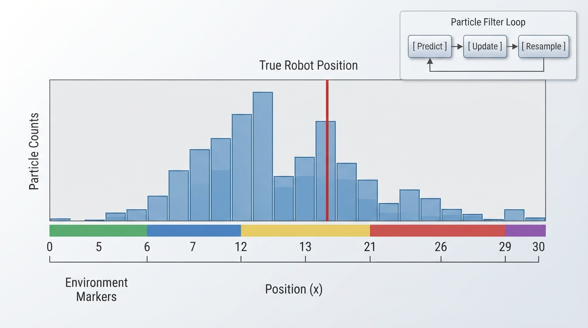

# Class 35: Particle Filters

## Where We Are in the Robotics Journey

In the previous class, RoboRover used **Bayes Rule** to update a belief about its location:

\[
P(x \mid z) \propto P(z \mid x)P(x)
\]

The robot began with a prior belief, received a sensor measurement, and calculated a new belief.

That method works neatly when we can list every possible state and calculate its probability. Real robots often face a much larger problem:

- position may include \(x\), \(y\), and orientation;
- the map may contain many possible locations;
- motion and sensors are noisy;
- several locations may look equally plausible.

A **particle filter** handles this by representing belief with many random samples, called **particles**. Each particle is a hypothesis: “Perhaps RoboRover is here.” In a practical filter, these are samples from an approximate belief distribution generated through a motion model and weighted by sensor evidence; they are not usually direct samples from the exact posterior distribution.

Today we turn Bayes Rule into a practical estimation method. In the next class, we will use related ideas for **SLAM**, where RoboRover estimates its location while also building a map.

## Today We Will Learn

By the end of this class, you should be able to:

1. Explain a particle as a possible robot-state hypothesis.
2. Describe the particle-filter cycle: **predict, update, resample**.
3. Calculate measurement weights for several hypotheses.
4. Explain why sampling can represent multiple possible locations.
5. Recognize particle-filter weaknesses such as too few particles, poor sensor models, and particle collapse.

## 2-Minute Recap

Suppose RoboRover believes it is at one of several places. Bayes Rule says:

\[
P(x \mid z)=\frac{P(z \mid x)P(x)}{P(z)}
\]

where:

- \(x\) is a possible robot state, such as position, measured in metres;
- \(z\) is a sensor measurement;
- \(P(x)\) is the prior probability before the measurement;
- \(P(z \mid x)\) is the likelihood of receiving the measurement if the robot were at \(x\);
- \(P(x \mid z)\) is the updated, or posterior, probability;
- \(P(z)\) is a normalizing probability.

The particle filter keeps the useful part of this calculation—prior multiplied by likelihood—but represents the result with samples instead of a giant table.

## The Big Idea




**Figure:** The predict-update-resample cycle changes a broad cloud of hypotheses into evidence-weighted clusters.

Imagine asking 500 imaginary RoboRovers:

> “Where do you think the real RoboRover is?”

Each imaginary RoboRover gives a location. These are the particles.

At first, the particles may be spread throughout the map because the robot is uncertain. After RoboRover moves, each particle moves according to a noisy motion model. After the sensor reports something, particles that agree with the measurement become more important. Particles that disagree become less important.

Then the filter **resamples**: it copies likely particles more often and unlikely particles less often.

A particle filter is therefore a repeated process:

```text
1. Predict: move every hypothesis according to the command.
2. Update: score each hypothesis using the sensor measurement.
3. Resample: keep more copies of likely hypotheses.
```

The particles are not tiny physical robots. They are computational guesses sampled from an approximate belief distribution.

A useful visual would show:

```text
Before sensing:     . . . . . . . . . . . . .
After weighting:    .   .       ●●●     .  ●
After resampling:               ●●●●●●
```

The exact positions depend on the robot, map, noise, and sensor model. The important idea is that **a cloud of hypotheses becomes concentrated where the evidence is strongest**.

## See It in Your Head

### AI-Generated Engineering Visual · Professor OS



**How to read this visual:** Trace the signal or idea from left to right. Match each block to the lesson explanation, then predict what would change if one block produced a wrong value.


Picture RoboRover in a long corridor with coloured floor markers.

- A particle is a small arrow drawn at one possible corridor position.
- The arrow may include orientation, such as “facing east.”
- A command says, “Move forward \(2\text{ m}\).”
- Because wheels slip, each particle moves approximately \(2\text{ m}\), but not exactly.
- RoboRover’s colour sensor reports “blue.”
- Particles sitting at blue markers receive high weight.
- Particles sitting at red or green markers receive low weight.
- Resampling creates several copies near likely blue locations.

If the corridor contains blue markers at two different places, the particle cloud may remain in two groups. This is valuable: the filter does not have to choose one answer too early.

This is one of its major differences from a single best guess.

## Core Concept

### 1. Particles are hypotheses

A particle usually stores a possible state:

\[
x_t^{(i)} =
\begin{bmatrix}
x & y & \theta
\end{bmatrix}
\]

where:

- \(x\) is horizontal position in metres;
- \(y\) is vertical position in metres;
- \(\theta\) is orientation in radians;
- \(t\) is the current time step;
- \(i\) identifies particle \(i\).

For a simple corridor lesson, a particle may contain only one number: position in metres.

For a real rover, it may contain position, orientation, wheel-bias estimates, or other state variables. The state choice depends on what the robot must estimate.

### 2. Predict

The motion command \(u_t\) changes each particle:

\[
x_t^{(i)} \sim p(x_t \mid x_{t-1}^{(i)},u_t)
\]

The symbol \(\sim\) means “sample from.” It does not mean that every particle moves identically.

For example, if RoboRover commands \(2.0\text{ m}\) forward, a particle might move \(1.8\text{ m}\), another \(2.1\text{ m}\), and another \(2.3\text{ m}\), depending on the assumed motion noise.

### 3. Update

The sensor measurement \(z_t\) gives each particle a weight:

\[
w_t^{(i)} = p(z_t \mid x_t^{(i)})
\]

Here:

- \(w_t^{(i)}\) is the weight of particle \(i\), with no physical unit;
- \(z_t\) is the measured sensor value;
- \(x_t^{(i)}\) is the particle’s predicted state;
- \(p(z_t \mid x_t^{(i)})\) is the likelihood of that measurement at that state.

A particle near a location that should produce the observed sensor reading receives a high weight.

Before resampling, the particles form a **weighted particle set**. The weights express how strongly the current hypotheses are supported. After resampling, the new set is usually treated as approximately unweighted: likely particles appear several times, while unlikely particles may disappear.

### 4. Resample

Particles are drawn again, with probability related to their weights.

A particle with weight \(0.4\) is four times as likely to be selected as a particle with weight \(0.1\), assuming all other details are unchanged.

Resampling does not magically create new information. It reallocates computational attention toward hypotheses supported by the evidence.

In the bootstrap particle-filter convention used here, resampling produces a new set whose particles are treated as having equal weight. More advanced particle filters may retain, transform, or otherwise manage weights differently, so equal post-resampling weights are a convention of this algorithmic structure rather than a universal rule.

## Math Without Fear

The following is a **discrete Bayesian calculation that provides intuition for particle weighting**. The four candidate positions are not themselves a complete particle-filter implementation; a practical particle filter would usually represent a larger continuous or high-dimensional state with many samples.

Suppose RoboRover has four possible positions:

| Position | Prior probability | Likelihood of “blue” |
|---:|---:|---:|
| \(2\text{ m}\) | \(0.25\) | \(0.1\) |
| \(5\text{ m}\) | \(0.25\) | \(0.8\) |
| \(8\text{ m}\) | \(0.25\) | \(0.1\) |
| \(11\text{ m}\) | \(0.25\) | \(0.8\) |

The unnormalized weight is:

\[
\tilde{w}_i=P(x_i)P(z\mid x_i)
\]

For the position \(5\text{ m}\):

\[
\tilde{w}_{5}=0.25(0.8)=0.20
\]

For the position \(2\text{ m}\):

\[
\tilde{w}_{2}=0.25(0.1)=0.025
\]

The total unnormalized weight is:

\[
0.025+0.20+0.025+0.20=0.45
\]

The normalized probability at \(5\text{ m}\) is:

\[
P(5\text{ m}\mid\text{blue})
=
\frac{0.20}{0.45}
=
\frac{4}{9}
\approx 0.444
\]

The units of position are metres, but probabilities and weights are unitless.

If we resample 12 particles, the expected number near \(5\text{ m}\) is:

\[
12\left(\frac{4}{9}\right)=\frac{16}{3}\approx5.33
\]

This is an expected count, not a guaranteed count. Random sampling might produce 4, 5, 6, or another nearby number.

The two blue-compatible positions remain possible. A particle filter can preserve both hypotheses instead of incorrectly deciding that only one must be correct.

## Worked Robotics Example




**Figure:** A blue measurement increases both blue-marker hypotheses; it does not yet identify which marker RoboRover is near.

RoboRover drives along a \(12\text{ m}\) corridor. Blue floor markers are at \(5\text{ m}\) and \(11\text{ m}\). Its colour sensor reports blue, but the sensor is imperfect:

- if RoboRover is at a blue marker, it reports blue with probability \(0.8\);
- elsewhere, it reports blue with probability \(0.1\).

Before sensing, the four candidate positions \(2\text{ m}\), \(5\text{ m}\), \(8\text{ m}\), and \(11\text{ m}\) are equally likely.

The measurement strongly supports the two blue-marker hypotheses. After updating:

- \(2\text{ m}\): probability \(1/18\approx0.056\);
- \(5\text{ m}\): probability \(4/9\approx0.444\);
- \(8\text{ m}\): probability \(1/18\approx0.056\);
- \(11\text{ m}\): probability \(4/9\approx0.444\).

Interpretation: RoboRover has learned that it is probably near a blue marker, but it has not learned which blue marker. This is not a failure. It is an honest representation of ambiguity.

If RoboRover moves and receives another measurement, the two groups may shift, merge, or one may become more likely. Repeated motion and sensing gradually resolve uncertainty—provided the motion and sensor models are useful.

## Python Lab




**Figure:** The histogram displays the particle cloud while the red line marks the simulated true position used only for comparison.

This program simulates a one-dimensional RoboRover corridor.

Each particle is an integer corridor position. The colour sequence is known to the filter. The robot moves two cells per step, with motion noise of \(-1\), \(0\), or \(+1\) cell. The colour sensor uses a valid four-colour observation model: conditional on the true colour, it reports that colour with likelihood \(0.85\) and each of the three alternative colours with likelihood \(0.05\). These probabilities sum to \(0.85+3(0.05)=1.00\). The simulated sensor actually samples an observation from this model, so the measurement generator and the filter's assumed likelihood model are consistent.

This code uses a discrete corridor and integer positions, whereas the earlier four-position calculation was a small Bayesian example. The 400 particles here are repeated approximate state hypotheses, not merely the four candidate states from that calculation. A practical particle filter can use many particles over a continuous or higher-dimensional state.

The program uses `random.choices` for weighted resampling and plots the **final** particle distribution after all updates. It also records the post-resampling particle set at every step in `history` for later extensions, and reports a particle mean, mode, and effective sample size (ESS).

If Matplotlib is not already installed in your Python environment, install it with:

```bash
python -m pip install matplotlib
```

Then run the program with Python 3.7 or a later compatible Python 3 release.

```python
import random
from collections import Counter

import matplotlib.pyplot as plt

# A corridor with one colour at each integer position.
WORLD = [
    "red", "green", "blue", "yellow", "red",
    "blue", "green", "yellow", "blue", "red",
    "green", "blue", "yellow", "red", "green",
    "blue", "yellow", "red", "blue", "green"
]

NUMBER_OF_PARTICLES = 400
COMMAND = 2
STEPS = 6

random.seed(7)

# The real robot starts at position 3.
true_position = 3

# Begin with no location preference: particles are spread uniformly.
particles = [
    random.randrange(len(WORLD))
    for _ in range(NUMBER_OF_PARTICLES)
]

history = []
observations = []
diagnostics = []

for step in range(STEPS):
    # Move the real robot with motion noise.
    true_position += COMMAND + random.choice([-1, 0, 1])
    true_position = max(0, min(len(WORLD) - 1, true_position))

    # Predict: move every particle with independent motion noise.
    predicted_particles = []
    for particle in particles:
        moved = particle + COMMAND + random.choice([-1, 0, 1])
        moved = max(0, min(len(WORLD) - 1, moved))
        predicted_particles.append(moved)

    particles = predicted_particles

    # The real sensor samples an observation from the stated
    # four-colour confusion model.
    true_colour = WORLD[true_position]
    colour_choices = ["red", "green", "blue", "yellow"]
    observation_weights = [
        0.85 if colour == true_colour else 0.05
        for colour in colour_choices
    ]
    observation = random.choices(
        colour_choices,
        weights=observation_weights,
        k=1
    )[0]
    observations.append(observation)

    # Update: assign a likelihood to every particle.
    # The observed colour has probability 0.85 if it is the
    # particle's predicted colour; each alternative has probability 0.05.
    weights = []
    for particle in particles:
        if WORLD[particle] == observation:
            weights.append(0.85)
        else:
            weights.append(0.05)

    # These checks verify the particle and weight counts.
    assert len(particles) == NUMBER_OF_PARTICLES
    assert len(weights) == NUMBER_OF_PARTICLES

    # Resampling: high-weight hypotheses are selected more often.
    particles = random.choices(
        particles,
        weights=weights,
        k=NUMBER_OF_PARTICLES
    )

    # Store the post-resampling set for optional history visualizations.
    history.append(list(particles))

    # ESS describes the diversity of support before resampling.
    weight_sum = sum(weights)
    squared_weight_sum = sum(weight * weight for weight in weights)
    effective_sample_size = (
        weight_sum * weight_sum / squared_weight_sum
    )
    diagnostics.append({
        "step": step + 1,
        "observation": observation,
        "effective_sample_size": effective_sample_size
    })

# Verify the simulation produced one particle set per time step.
assert len(history) == STEPS
assert len(observations) == STEPS
assert len(diagnostics) == STEPS

# Estimate the final particle distribution.
particle_mean = sum(particles) / float(len(particles))
particle_mode = Counter(particles).most_common(1)[0][0]
final_ess = diagnostics[-1]["effective_sample_size"]

print("Simulation checks passed.")
print("Number of particles:", NUMBER_OF_PARTICLES)
print("Number of observations:", len(observations))
print("Final particle mean: {:.2f}".format(particle_mean))
print("Final particle mode:", particle_mode)
print("Final pre-resampling ESS: {:.2f}".format(final_ess))

# Draw the final particle distribution and the true position.
plt.figure(figsize=(10, 5))
plt.hist(
    particles,
    bins=range(len(WORLD) + 1),
    align="left",
    rwidth=0.85,
    color="steelblue",
    edgecolor="black"
)
plt.axvline(
    true_position,
    color="crimson",
    linewidth=3,
    label="True robot position"
)
plt.xticks(range(len(WORLD)))
plt.xlabel("Corridor position (cells)")
plt.ylabel("Number of particles")
plt.title("RoboRover particle filter after repeated sensing")
plt.legend()
plt.tight_layout()
plt.show()
```

Important lines:

- `particles` stores the current hypotheses.
- The loop that adds `COMMAND` performs prediction.
- The sensor block samples an imperfect observation from the stated \(0.85/0.05\) four-colour model.
- `weights.append(...)` performs the sensor update.
- `random.choices(..., weights=weights, ...)` performs resampling.
- `history` stores the post-resampling particle set from each time step, but the supplied plot displays only the final set.
- The histogram shows where computational belief is concentrated.
- The particle mean summarizes the cloud, but it can fall between two plausible clusters and therefore may not represent either likely location.
- The particle mode identifies the most frequently sampled position, although it can change with random sampling.
- The effective sample size is calculated from the pre-resampling weights and gives a rough indication of how concentrated the weighted support is.
- The red vertical line shows the simulated true position, which the filter itself does not directly receive.

The program’s random seed makes its run reproducible on ordinary Python 3.7 installations, but the main lesson is the shape of the particle distribution rather than a particular random trace.

## Mini Simulation or Game

Before running the program, play “human particle filter.”

1. Draw 20 boxes in a line.
2. Mark some boxes red, green, blue, or yellow using the `WORLD` list.
3. Place one token secretly at the true robot position.
4. Scatter 20 paper particles across the boxes.
5. Announce a movement command of two boxes.
6. Move every paper particle by roughly two boxes, allowing a small error.
7. Announce the colour observed by the hidden robot.
8. For each paper particle, assign the matching-colour particles high weight and the others low weight. Then redraw 20 particles from the current 20, putting each particle's name into the redraw pool with frequency proportional to its weight; equivalently, copy high-weight particles more often and remove low-weight particles.
9. Repeat.

### Predict before you run it

Before executing the Python program, predict:

- Will the final particles occupy every corridor position equally?
- Will the true position always have the tallest bar?
- If the same colour appears in several places, will the filter necessarily choose one location immediately?
- Why can resampling alone not recover a location hypothesis if every particle representing it has disappeared?

Write your predictions down. Then run the program and inspect the histogram.

## What Should Happen?

A sensible prediction is that the particles should become more concentrated than the initial uniform distribution, but they may form several groups. The true position may not have the tallest bar because both motion and sensing are noisy.

The particle mean may also be misleading when two clusters remain. For example, if half the particles are near positions 2 and 10, the mean may be near 6 even though few or no particles are actually near 6.

## Common Mistakes

### Mistake 1: Treating particles as measurements

A particle is not a sensor reading. It is a possible state generated by the filter.

### Mistake 2: Moving every particle identically

If every particle receives exactly the same motion, the filter preserves whatever uncertainty it already has but fails to represent new motion uncertainty. After resampling, this can contribute to particle impoverishment because the particle set may lack the diversity needed to represent future possibilities.

### Mistake 3: Giving every hypothesis equal sensor weight

The update step exists to distinguish hypotheses. If every particle receives the same weight, the measurement adds no information.

### Mistake 4: Assuming resampling guarantees the truth

Resampling favours high-weight particles; it does not prove they are correct. A misleading sensor model can concentrate particles around the wrong location.

### Mistake 5: Using too few particles

With only a few particles, a plausible region may receive no samples at all. Once a hypothesis disappears, ordinary resampling cannot recover it because resampling selects only from the particles that still exist.

### Engineering caveat: particle impoverishment

Repeated resampling can cause many particles to become identical. The filter then loses diversity and may struggle if the robot later moves into a different plausible region.

Engineers address this with suitable process noise, better resampling methods, enough particles, occasional recovery strategies, or a more suitable estimator. These are design choices, not automatic guarantees.

The code also clamps particles at the corridor boundaries with `max` and `min`. This is a simplifying simulation artifact, not a general motion model. In a real system, clamping can create boundary bias by accumulating particles at an edge. A more realistic model would represent walls, collisions, slipping, or invalid motions explicitly.

Another practical problem is computation. A three-dimensional state with orientation requires more particles than a one-dimensional corridor if similar accuracy is desired.

## Try It Yourself

### Challenge

Modify the Python program so that the sensor is less reliable:

- matching colour weight: \(0.60\);
- non-matching colour weight: \(0.40/3\) for each of the three alternative colours.

The four likelihoods must still sum to one:

\[
0.60+3\left(\frac{0.40}{3}\right)=1.00
\]

In the code, change both the observation-generation weights and the particle-update weights so that the simulated sensor and the filter's assumed model remain consistent. Predict how this affects the histogram. Then run the program and compare it with the original. A less reliable sensor should generally produce weaker concentration, although the exact random result depends on the simulation.

### Optional extension

Add a second plot showing the particle histogram after every time step instead of only the final histogram. Use `plt.subplots` and one subplot per step.

For each subplot, label:

- time step;
- observed colour;
- particle count by position.

This creates a visual history of belief changing over time. The existing `history` list already contains the post-resampling particle set for each step.

## Quick Quiz

1. What does one particle represent in a particle filter?

2. During the predict step, why should particles usually move with slightly different outcomes?

3. If two separated locations both explain the sensor measurement well, what might the particle distribution look like?

4. What is the purpose of resampling?

5. Why can resampling alone not recover a hypothesis that has disappeared from the particle set?

## Answers

1. A particle represents one possible robot state, or hypothesis, such as a possible position and orientation.

2. Motion is uncertain because of effects such as wheel slip, uneven surfaces, actuator error, and imperfect models. Different samples represent that uncertainty.

3. The particles may form two separated clusters. The filter can preserve both hypotheses instead of choosing one without enough evidence.

4. Resampling selects particles with probabilities related to their weights, producing more copies of likely hypotheses and fewer copies of unlikely hypotheses.

5. Resampling draws only from the particles currently present. If every particle representing a hypothesis disappears, ordinary resampling has no source from which to recreate it.

## Real Robot Connection

A physical RoboRover might combine:

- wheel encoder measurements for predicted motion;
- a camera, lidar, sonar, or radio signal for sensor updates;
- a map that predicts what each location should look like;
- hundreds, thousands, or more particles depending on the state space.

The particle filter does not directly control the motors. It estimates where the robot may be. A separate controller can use that estimate to decide how to drive.

This distinction matters:

- **estimation** asks, “Where might I be?”
- **control** asks, “What motor command should I send?”
- **planning** asks, “Which route or action should I choose?”

In the next class, SLAM will make the problem harder. RoboRover will not merely estimate its location on a known map. It will also estimate or build parts of the map while moving. Particle-based methods can help represent multiple possible robot trajectories and map relationships, although practical SLAM systems use several algorithm families.

## Vocabulary

- **Particle filter:** A probabilistic state-estimation method that represents belief with many samples. During the update step, the samples have weights; after resampling, the resulting particle set is usually treated as approximately unweighted.
- **Particle:** One possible state hypothesis, such as a candidate robot position and orientation.
- **Hypothesis:** A proposed explanation of the robot’s state or sensor data.
- **Sampling:** Randomly drawing examples from a probability distribution.
- **Predict step:** Moving each particle according to the motion command and motion-noise model.
- **Update step:** Assigning particle weights according to how well each hypothesis explains the sensor measurement.
- **Weight:** A unitless numerical value expressing how strongly a particle is supported before normalization and resampling.
- **Resampling:** Drawing a new particle set so that high-weight particles are selected more often.
- **Particle cloud:** The spatial pattern formed by all particles.
- **Belief:** The robot’s probability distribution over possible states.
- **Motion model:** A mathematical description of how a command is expected to change the robot’s state.
- **Sensor model:** A mathematical description of how likely a measurement is for a given state.
- **Effective sample size:** A diagnostic estimate of how concentrated a weighted particle set is before resampling.
- **Particle impoverishment:** Loss of variety when resampling produces many identical or nearly identical particles.

## Further Learning

To deepen this topic, study these ideas in order:

1. probability distributions and random variables;
2. conditional probability and Bayes Rule;
3. discrete and continuous sensor models;
4. Gaussian noise and likelihood functions;
5. effective sample size and resampling strategies;
6. Monte Carlo localization;
7. particle-filter approaches to robot mapping and SLAM.

When studying a new algorithm, keep asking:

> What does one sample represent, what evidence changes its weight, and what uncertainty can disappear accidentally?

## Next Class

Next we move from localization to **SLAM: Simultaneous Localization and Mapping**.

RoboRover will face a deeper question:

> How can it estimate where it is when the map itself is incomplete or unknown?

Particle filters provide useful intuition because they show how a robot can maintain multiple possible explanations. SLAM extends that challenge by coupling the robot’s possible paths with possible map structures.
