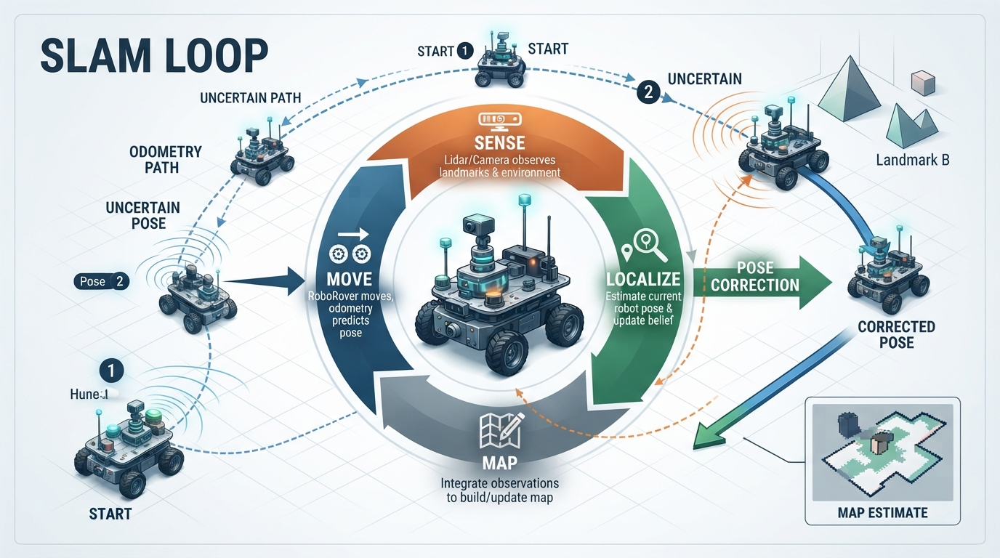
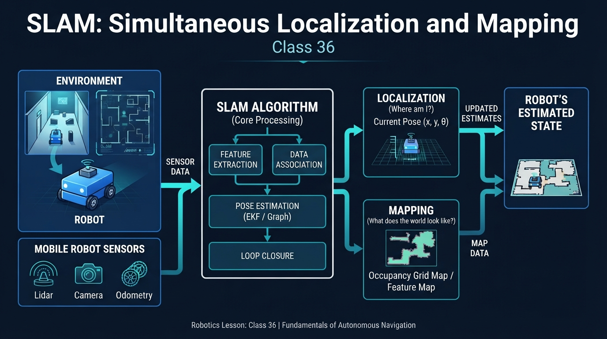
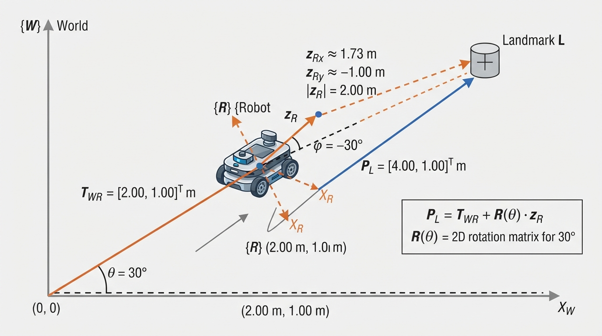
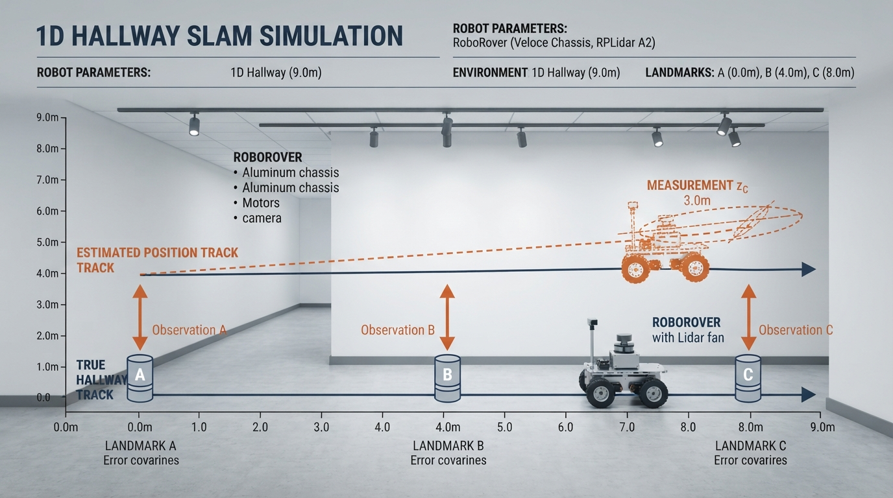
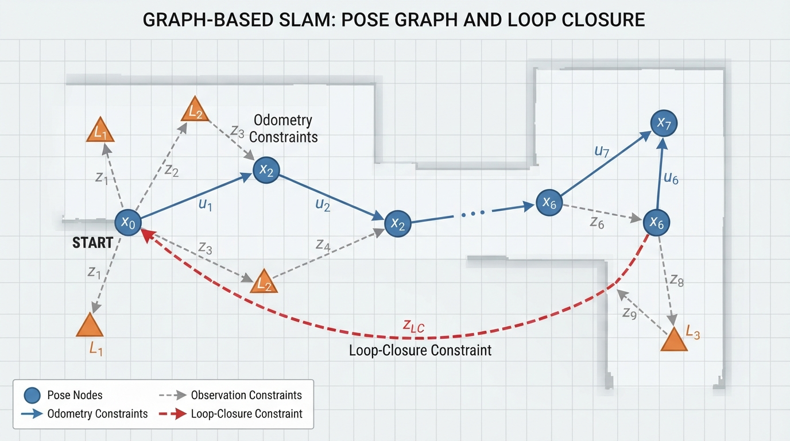

# Class 36: SLAM

## Where We Are in the Robotics Journey

RoboRover can now estimate its pose with a **particle filter**. In the previous class, many pose hypotheses competed with one another. Sensor measurements reduced the weight of unlikely hypotheses and preserved more plausible ones.

That addressed an important question:

> **Where might RoboRover be?**

Today we add two harder questions:

> **What does the environment look like, and where am I inside it?**

This is **SLAM**, or **Simultaneous Localization and Mapping**.

- **Localization** estimates the robot’s pose: position and orientation.
- **Mapping** estimates the positions or shapes of environmental features.
- **Simultaneous** means that pose and map estimates improve together.

Landmark-based SLAM is a **family of approaches**, not a complete description of every production SLAM system. Production systems may use landmarks, occupancy grids, scan matching, visual features, factor graphs, or combinations of these.

In the next class, RoboRover will use its map to choose useful routes. That is **path planning**. A planner is only as reliable as the map and pose estimate it receives, so SLAM forms an important bridge between sensing and planning.

## Today We Will Learn

By the end of this class, you should be able to:

1. Explain why localization and mapping depend on each other.
2. Describe a landmark-based SLAM system.
3. Transform a landmark observation from robot coordinates into map coordinates.
4. Identify odometry drift, loop closure, and the unknown-global-origin problem.
5. Run a small Python simulation in which RoboRover estimates its position while building a landmark map.
6. Distinguish a landmark map from an occupancy-grid map.
7. Explain why the simulation is an educational model rather than production SLAM.

## 2-Minute Recap

A robot’s **pose** describes where it is and which direction it faces. In a flat environment, we often write it as

\[
\mathbf{p}=(x,y,\theta),
\]

where \(x\) and \(y\) are positions in metres and \(\theta\) is heading in radians.

Wheel odometry predicts how the pose changes. However, wheel measurements are imperfect. Wheels can slip, their diameters can differ slightly from their assumed values, and the floor may provide uneven traction. Repeated small errors create **drift**.

A particle filter represents uncertainty with many possible pose hypotheses. SLAM extends the estimation problem: the robot is uncertain not only about its pose, but also about the positions of features in its map.

## The Big Idea




**Figure:** SLAM repeatedly combines motion prediction, sensor observations, pose correction, and map updates.

Imagine entering a dark warehouse with a measuring tape but no floor plan.

You estimate your position by counting steps. That estimate gradually drifts. Then you notice a distinctive blue post and measure its direction and distance.

If the blue post is already on your map, you can use it as a reference to correct your pose.

If it is not on the map, you can add it—but its mapped position depends on your current pose estimate.

This produces the central SLAM loop:

1. **Move:** predict a new pose from motion.
2. **Sense:** observe landmarks, walls, or other features.
3. **Localize:** compare observations with the existing map.
4. **Map:** add new features or refine existing ones.
5. Repeat.

The dependency works in both directions:

- A better pose estimate places new landmarks more accurately.
- A better map provides stronger references for correcting the pose.

SLAM is therefore not simply “make a map first, then localize.” Both estimates develop together.

## See It in Your Head

### AI-Generated Engineering Visual · Professor OS



**How to read this visual:** Trace the signal or idea from left to right. Match each block to the lesson explanation, then predict what would change if one block produced a wrong value.


Picture RoboRover driving through a room containing three floor markers.

- A solid line represents the true path.
- A dashed line represents the odometry-based estimated path.
- Labeled points represent physical landmarks.
- At first, RoboRover sees a marker and places it on its map using an uncertain pose.
- Later, it sees that same marker again.
- The disagreement between the predicted and observed marker positions provides evidence for correction.

**Text-only diagram description:** Draw a room as a rectangle. Place three labeled markers inside it. Draw the robot’s true path as a solid line and its drifting estimate as a dashed line. At one marker, draw a measurement ray from the robot. At a later pose, draw a second ray to the same marker and show a correction arrow between the predicted and observed locations.

The landmarks are not merely decoration. They connect different moments in the robot’s journey.

## Core Concept

### Landmark-based SLAM

A **landmark** is a recognizable feature whose position can be estimated. Examples include:

- a high-contrast marker,
- a corner,
- a pillar,
- a docking station,
- a distinctive wall feature.

A camera, laser scanner, depth sensor, or other sensor may detect a landmark. The sensor usually reports the landmark relative to the robot using quantities such as distance, bearing, and an identifying appearance or label.

Suppose RoboRover observes landmark \(i\). In a two-dimensional example, the observation may be

\[
\mathbf{z}_i =
\begin{bmatrix}
z_x\\
z_y
\end{bmatrix},
\]

where \(z_x\) and \(z_y\) are the landmark’s coordinates in RoboRover’s own coordinate frame.

The robot also has an estimated pose. It transforms the observation into map coordinates and estimates where the landmark belongs.

When the same landmark is observed again, RoboRover compares:

- where the map predicts the landmark should appear;
- where the current sensor measurement says it appears.

The difference is a **measurement residual**, also called an **innovation**. A SLAM algorithm uses this disagreement to improve the pose estimate, the landmark position, or both.

### Loop closure

Suppose RoboRover drives around a room and eventually returns near its starting point. Wheel odometry may claim that the final position is several tens of centimetres from the start.

If RoboRover recognizes landmarks from the beginning again, it has detected a **loop closure**. It now has evidence that two apparently separate parts of its trajectory are actually nearby.

A complete SLAM system may use that evidence to adjust many earlier poses, not merely the newest one. This distributes the correction through the trajectory and makes the whole map more consistent.

The one-dimensional program in this lesson does **not** perform loop closure. It repeatedly corrects against known landmarks in a hallway, but it does not return to a previously visited pose or optimize an entire trajectory after recognizing a completed loop. That distinction matters: repeated landmark correction is broader than loop-closure optimization.

### SLAM is not a perfect memory

A map can be wrong if:

- the robot confuses two similar landmarks;
- a landmark moves;
- sensor measurements are noisy;
- the orientation estimate is poor;
- the robot never revisits useful features;
- the environment changes.

A map is an estimate, not a photograph of reality.

## Math Without Fear

For this lesson, use a robot frame with:

- \(x_r\) pointing forward from the robot;
- \(y_r\) pointing to the robot’s left;
- positive heading \(\theta\) measured counterclockwise from the map’s positive \(x\)-axis.

Let the robot pose be

\[
\mathbf{p}=(x,y,\theta)
\]

and let a landmark observation in robot coordinates be

\[
\mathbf{z}=
\begin{bmatrix}
z_x\\
z_y
\end{bmatrix}.
\]

The two-dimensional rotation matrix is

\[
R(\theta)=
\begin{bmatrix}
\cos\theta & -\sin\theta\\
\sin\theta & \cos\theta
\end{bmatrix}.
\]

The estimated landmark position in the map frame is

\[
\mathbf{m}
=
\begin{bmatrix}
m_x\\
m_y
\end{bmatrix}
=
\begin{bmatrix}
x\\
y
\end{bmatrix}
+
R(\theta)\mathbf{z}.
\]

Here, \(x,y,m_x,m_y,z_x,z_y\) are distances in metres, while \(\theta\) is an angle in radians.

To predict how a known landmark should appear from the robot, reverse the transformation:

\[
\mathbf{z}_{\text{predicted}}
=
R(-\theta)(\mathbf{m}-\mathbf{p}_{xy}),
\]

where

\[
\mathbf{p}_{xy}=
\begin{bmatrix}
x\\
y
\end{bmatrix}.
\]

### Quick check

If \(\theta=0\), then

\[
R(0)=
\begin{bmatrix}
1&0\\
0&1
\end{bmatrix},
\]

so the transformation becomes

\[
\mathbf{m}=
\begin{bmatrix}
x\\
y
\end{bmatrix}
+
\mathbf{z}.
\]

In words, with no rotation, the robot-frame coordinates are simply added to the robot’s map-frame position.

The forward and reverse equations are mutually consistent because

\[
R(-\theta)R(\theta)=I.
\]

For example, with \(\theta=30^\circ\), \(\mathbf{p}_{xy}=(2,1)\), and \(\mathbf{z}=(1.73,-1)\), the forward transform gives approximately \(\mathbf{m}=(4,1)\), and substituting that result into the reverse transform gives

\[
R(-30^\circ)
\left(
\begin{bmatrix}4\\1\end{bmatrix}
-
\begin{bmatrix}2\\1\end{bmatrix}
\right)
\approx
\begin{bmatrix}1.73\\-1.00\end{bmatrix}
=\mathbf{z}.
\]

### Worked numerical example

RoboRover estimates its pose as

\[
x=2.00\text{ m},\qquad y=1.00\text{ m},\qquad \theta=30^\circ.
\]

Its sensor sees a landmark at

\[
\mathbf{z}=
\begin{bmatrix}
1.73\text{ m}\\
-1.00\text{ m}
\end{bmatrix}.
\]

Because Python’s trigonometric functions use radians,

\[
30^\circ=\frac{\pi}{6}\text{ rad}.
\]

Using \(\cos 30^\circ\approx0.866\) and \(\sin 30^\circ=0.5\),

\[
R(\theta)\mathbf{z}
=
\begin{bmatrix}
0.866(1.73)-0.5(-1.00)\\
0.5(1.73)+0.866(-1.00)
\end{bmatrix}
\approx
\begin{bmatrix}
2.00\\
0.00
\end{bmatrix}\text{ m}.
\]

Therefore,

\[
\mathbf{m}
=
\begin{bmatrix}
2.00\\
1.00
\end{bmatrix}
+
\begin{bmatrix}
2.00\\
0.00
\end{bmatrix}
=
\begin{bmatrix}
4.00\\
1.00
\end{bmatrix}\text{ m}.
\]

According to RoboRover’s current estimate, the landmark is about **4.00 m east and 1.00 m north** of the selected map origin.

The residual connects directly to this transformation. If the predicted observation is

\[
\mathbf{z}_{\text{predicted}}=
\begin{bmatrix}
1.53\\
-0.90
\end{bmatrix}\text{ m}
\]

but the sensor measures

\[
\mathbf{z}_{\text{measured}}=
\begin{bmatrix}
1.73\\
-1.00
\end{bmatrix}\text{ m},
\]

then

\[
\mathbf{r}
=
\mathbf{z}_{\text{measured}}
-
\mathbf{z}_{\text{predicted}}
=
\begin{bmatrix}
0.20\\
-0.10
\end{bmatrix}\text{ m}.
\]

The residual says that the measured landmark is 20 cm farther forward and 10 cm to the robot’s right than the current estimate predicts. A real estimator would use this residual together with uncertainty information.

## Worked Robotics Example




**Figure:** A landmark measured in robot coordinates is rotated and translated into the map coordinate frame.

RoboRover explores a rectangular test area containing three identifiable markers:

- Marker A near the charging station;
- Marker B beside a storage box;
- Marker C near a doorway.

During its first pass, wheel odometry gradually overestimates forward motion. RoboRover sees Marker A and adds it to the map. Because its pose estimate is already biased, the mapped position of A may also be biased.

Later, RoboRover sees Marker A again. Define a one-dimensional lateral coordinate in which **positive values point to the robot’s left** and negative values point to its right. The current estimate predicts that A is 30 cm to the left:

\[
r_{\text{predicted}}=+30\text{ cm}.
\]

The sensor measures A 10 cm to the left:

\[
r_{\text{measured}}=+10\text{ cm}.
\]

The residual is therefore

\[
r=r_{\text{measured}}-r_{\text{predicted}}
=(+10\text{ cm})-(+30\text{ cm})
=-20\text{ cm}.
\]

The negative residual means that the measured feature is 20 cm less to the left than predicted, or equivalently 20 cm to the right relative to the prediction. That disagreement is evidence that the pose estimate, the landmark estimate, or both are inconsistent.

A practical SLAM system does not usually snap to one answer. It combines motion prediction, sensor noise, landmark uncertainty, pose uncertainty, and constraints from other observations. For example, a Kalman-filter update would weight the residual according to uncertainty, while graph-based SLAM would add constraints and optimize several poses and landmarks together.

This lesson uses a simpler direct-snap rule:

- if a landmark is new, add it;
- if it is known, use it to correct the estimated position.

The rule is useful for exposing the map–pose relationship, but it is **not probabilistic fusion** and should not be generalized to production SLAM. Its direct-snap corrections can produce discontinuous changes in the plotted estimated trajectory, unlike the smoother updates often produced by probabilistic filters or graph optimization.

## Python Lab




**Figure:** The simulation shows how biased odometry drifts while repeated landmark observations provide corrections.

The following program is a deliberately small **one-dimensional landmark-SLAM simulation**. RoboRover moves along a hallway. The true landmarks are known to the simulator, but RoboRover does not initially know their positions.

**Model limitation:** This is a conceptual map-initialization and landmark-localization model, not a full joint SLAM estimator. Its landmark estimates are frozen after first insertion, and only the pose is directly corrected afterward. Real SLAM systems normally maintain uncertainty and update multiple poses and landmarks together, often through filtering or optimization.

The observations supplied to the program have:

- deterministic landmark selection: the closest visible landmark is reported; ties select the landmark farther along the hallway;
- perfect landmark identity: `"A"` always means Marker A;
- noiseless relative position;
- no missed detections for the selected landmark when one is within range.

This single-landmark observation rule keeps the trace deterministic and avoids using simultaneous observations as an additional, unstated source of correction. A real sensor may detect several landmarks at once.

RoboRover’s odometry overestimates every 1 m move as 1.1 m. When RoboRover sees a known landmark, the program directly sets the estimated position from the landmark’s stored map position and the new relative measurement.

```python
import math

TRUE_LANDMARKS = {
    "A": 3.0,
    "B": 7.0,
    "C": 11.0,
}

TRUE_PATH = list(range(13))
ODOMETRY_STEP = 1.1
SENSOR_RANGE = 2.2

# Keep this True for the supplied baseline settings.
# Set it to False before changing ODOMETRY_STEP, SENSOR_RANGE, or TRUE_PATH.
RUN_BASELINE_TESTS = True


def visible_landmarks(true_x, sensor_range):
    """Return the closest visible landmark, with deterministic tie-breaking."""
    candidates = []

    for name, landmark_x in TRUE_LANDMARKS.items():
        distance = abs(landmark_x - true_x)
        if distance <= sensor_range:
            candidates.append((distance, -landmark_x, name, landmark_x))

    if not candidates:
        return []

    _, _, name, landmark_x = min(candidates)
    relative_x = landmark_x - true_x
    return [(name, relative_x)]


def run_simulation(true_path, odometry_step, sensor_range):
    """Run the conceptual landmark-localization simulation."""
    estimated_x = 0.0
    landmark_map = {}
    history = []

    for step_number, true_x in enumerate(true_path):
        if step_number > 0:
            estimated_x += odometry_step

        observations = visible_landmarks(true_x, sensor_range)

        for name, relative_x in observations:
            if name not in landmark_map:
                landmark_map[name] = estimated_x + relative_x
            else:
                estimated_x = landmark_map[name] - relative_x

        history.append((true_x, estimated_x))

    return history, landmark_map


history, landmark_map = run_simulation(
    TRUE_PATH,
    ODOMETRY_STEP,
    SENSOR_RANGE,
)

final_true_x, final_estimated_x = history[-1]
final_error = abs(final_estimated_x - final_true_x)

print("Mapped landmark names:", sorted(landmark_map.keys()))
print("Mapped landmark positions: {}".format(
    {name: round(landmark_map[name], 1)
     for name in sorted(landmark_map)}
))
print("Final true position: {:.1f} m".format(final_true_x))
print("Final estimated position: {:.1f} m".format(final_estimated_x))
print("Final absolute error: {:.1f} m".format(final_error))

# These checks always verify structural invariants and therefore remain
# useful when students change the parameters.
assert set(landmark_map).issubset(set(TRUE_LANDMARKS))
assert len(history) == len(TRUE_PATH)
assert final_error >= 0.0

# These checks apply only to the documented baseline configuration.
if RUN_BASELINE_TESTS:
    assert sorted(landmark_map.keys()) == ["A", "B", "C"]
    assert math.isclose(landmark_map["A"], 3.1, abs_tol=1e-9)
    assert math.isclose(landmark_map["B"], 7.2, abs_tol=1e-9)
    assert math.isclose(landmark_map["C"], 11.3, abs_tol=1e-9)
    assert final_true_x == 12
    assert math.isclose(final_estimated_x, 12.3, abs_tol=1e-9)
    assert math.isclose(final_error, 0.3, abs_tol=1e-9)
    print("Verification: all baseline values passed.")
```

With the documented baseline settings and `RUN_BASELINE_TESTS = True`, the verified output is:

```text
Mapped landmark names: ['A', 'B', 'C']
Mapped landmark positions: {'A': 3.1, 'B': 7.2, 'C': 11.3}
Final true position: 12.0 m
Final estimated position: 12.3 m
Final absolute error: 0.3 m
Verification: all baseline values passed.
```

When experimenting, set `RUN_BASELINE_TESTS = False`. The structural checks still run, but the code no longer incorrectly requires the original baseline values.

A compact trace of the first observation and correction events is:

| True position | Estimated position before observation | Landmark event | Estimated position after event | Stored map position |
|---:|---:|---|---:|---:|
| 1.0 m | 1.1 m | First observation of A | 1.1 m | A = 3.1 m |
| 2.0 m | 2.2 m | Correct using A | 2.1 m | A = 3.1 m |
| 3.0 m | 3.2 m | Correct using A | 3.1 m | A = 3.1 m |
| 4.0 m | 4.2 m | Correct using A | 4.1 m | A = 3.1 m |
| 5.0 m | 5.2 m | First observation of B | 5.2 m | B = 7.2 m |
| 6.0 m | 6.3 m | Correct using B | 6.2 m | B = 7.2 m |
| 7.0 m | 7.3 m | Correct using B | 7.2 m | B = 7.2 m |
| 8.0 m | 8.3 m | Correct using B | 8.2 m | B = 7.2 m |
| 9.0 m | 9.3 m | First observation of C | 9.3 m | C = 11.3 m |
| 10.0 m | 10.4 m | Correct using C | 10.3 m | C = 11.3 m |
| 11.0 m | 11.4 m | Correct using C | 11.3 m | C = 11.3 m |
| 12.0 m | 12.4 m | Correct using C | 12.3 m | C = 11.3 m |

Important lines:

- `TRUE_LANDMARKS` describes the hidden physical world used by the simulator.
- `estimated_x` is RoboRover’s belief, not guaranteed truth.
- `visible_landmarks` supplies an ideal deterministic relative measurement.
- A new landmark is placed using the current estimated pose.
- A known landmark provides a reference for correcting the pose.
- The correction is a direct snap, not a weighted or probabilistic update.
- The baseline assertions verify the deterministic map and final values.
- Parameter-independent checks remain active during experiments.

The simulator knows the true world only to generate test data. RoboRover’s map frame is established by its assumed initial pose. Without an external reference, a map can be internally consistent while shifted, rotated, or otherwise misaligned with the physical world.

## Mini Simulation or Game

Play “Map or Move?”

Before running the program, predict what happens in each situation:

1. **RoboRover has never seen Marker B before.**  
   Does it correct its pose using B, or add B to the map?

2. **RoboRover sees Marker A again.**  
   Does it ignore A, or use A as a reference?

3. **The odometry overestimates every move.**  
   Does the estimated path tend to stretch, shrink, or remain exact?

4. **RoboRover explores an unknown hallway but never sees a landmark twice.**  
   Can it strongly correct its accumulated drift?

Run the program, then set `RUN_BASELINE_TESTS = False` and change:

```text
ODOMETRY_STEP = 1.1
```

to:

```text
ODOMETRY_STEP = 1.3
```

Predict whether the final error becomes larger or smaller. Then run the program.

For another experiment, leave `RUN_BASELINE_TESTS = False` and change:

```text
SENSOR_RANGE = 2.2
```

to:

```text
SENSOR_RANGE = 0.5
```

With a shorter sensing range, RoboRover sees fewer landmarks. Consider how fewer repeated observations affect localization.

## What Should Happen?

Before changing the code, record your predictions.

- A first observation of a landmark adds it to the map.
- A repeated observation can correct the pose estimate.
- Larger odometry bias generally increases drift between useful observations.
- A shorter sensor range reduces opportunities for correction.
- If no landmark is revisited, the map and pose can drift together without strong evidence that they are wrong.

With the supplied baseline settings, the program finishes with:

- true position: \(12.0\text{ m}\);
- estimated position: \(12.3\text{ m}\);
- absolute error: \(0.3\text{ m}\).

The baseline assertions and verification output confirm these exact values.

The error is not zero because the first landmark placements were created using biased odometry. The simple algorithm has no outside reference telling it the hallway’s surveyed global coordinates. It can maintain useful relative relationships without recovering a perfectly aligned global position.

## Common Mistakes

### “SLAM means the robot already has a map”

SLAM generally means that the robot builds or refines a map while estimating its pose. Localizing within a pre-existing map is a related but different problem.

### “A sensor reading automatically gives the robot’s position”

A sensor reading usually gives information relative to the robot. The robot still needs a pose estimate, a coordinate transformation, and often a known landmark or geometric structure.

### “The first map is definitely correct”

The first placement of a landmark depends on the current pose estimate. Early errors can enter the map and influence later corrections.

### “More landmarks always solve the problem”

Only if the robot can detect and associate them correctly. Repeated identical objects can cause **data-association errors**, in which the robot matches one landmark to another.

### “A map can never change”

Real environments change. Chairs move, doors open, people block sensor views, and lighting affects camera measurements. Long-term mapping must handle dynamic objects and changing conditions.

### “Repeated correction is automatically loop closure”

A robot may repeatedly correct its position using a nearby known landmark without returning to a previously visited pose. Loop closure specifically involves recognizing a previously visited place or a trajectory-wide connection and using that constraint to improve the larger estimate.

## Try It Yourself

### Challenge

Modify the Python program so that RoboRover moves forward from 0 m to 12 m and then backward to 0 m.

Use this replacement path:

```python
TRUE_PATH = list(range(13)) + list(range(11, -1, -1))
```

Because the original loop assumes every step is forward, also replace the motion part of `run_simulation` with the following direction-aware version:

```python
def run_simulation(true_path, odometry_step, sensor_range):
    """Run the conceptual simulation for forward or backward motion."""
    estimated_x = 0.0
    landmark_map = {}
    history = []
    previous_true_x = None

    for true_x in true_path:
        if previous_true_x is not None:
            direction = 1.0 if true_x > previous_true_x else -1.0
            estimated_x += direction * odometry_step

        for name, relative_x in visible_landmarks(true_x, sensor_range):
            if name not in landmark_map:
                landmark_map[name] = estimated_x + relative_x
            else:
                estimated_x = landmark_map[name] - relative_x

        history.append((true_x, estimated_x))
        previous_true_x = true_x

    return history, landmark_map
```

Record:

- the true position;
- the estimated position;
- which landmarks are visible;
- the estimated map position of each landmark.

Then answer:

1. Which landmark observations correct the estimate most often?
2. Does moving backward create more repeated observations?
3. Does the simple correction rule make the map globally accurate, or merely internally consistent?

Qualitatively, the return trip should produce additional observations of the same landmarks and therefore additional direct pose corrections. It should not convert this simplified model into joint SLAM or guarantee globally accurate landmark coordinates.

### Optional extension

The reusable `run_simulation()` function allows the plotting block to avoid duplicating the simulation logic:

```python
import matplotlib.pyplot as plt

TRUE_LANDMARKS = {
    "A": 3.0,
    "B": 7.0,
    "C": 11.0,
}

TRUE_PATH = list(range(13))
ODOMETRY_STEP = 1.1
SENSOR_RANGE = 2.2


def visible_landmarks(true_x, sensor_range):
    """Return the closest visible landmark, with deterministic tie-breaking."""
    candidates = []

    for name, landmark_x in TRUE_LANDMARKS.items():
        distance = abs(landmark_x - true_x)
        if distance <= sensor_range:
            candidates.append((distance, -landmark_x, name, landmark_x))

    if not candidates:
        return []

    _, _, name, landmark_x = min(candidates)
    return [(name, landmark_x - true_x)]


def run_simulation(true_path, odometry_step, sensor_range):
    estimated_x = 0.0
    landmark_map = {}
    history = []

    for step_number, true_x in enumerate(true_path):
        if step_number > 0:
            estimated_x += odometry_step

        for name, relative_x in visible_landmarks(true_x, sensor_range):
            if name not in landmark_map:
                landmark_map[name] = estimated_x + relative_x
            else:
                estimated_x = landmark_map[name] - relative_x

        history.append((true_x, estimated_x))

    return history, landmark_map


history, landmark_map = run_simulation(
    TRUE_PATH,
    ODOMETRY_STEP,
    SENSOR_RANGE,
)

steps = list(range(len(history)))
true_positions = [item[0] for item in history]
estimated_positions = [item[1] for item in history]

plt.figure()
plt.plot(
    steps,
    true_positions,
    linestyle="-",
    marker="o",
    label="True position",
)
plt.plot(
    steps,
    estimated_positions,
    linestyle="--",
    marker="x",
    label="Estimated position",
)
plt.xlabel("Step")
plt.ylabel("Position (m)")
plt.title("Position estimate over time")
plt.legend()
plt.tight_layout()

plt.figure()
landmark_names = sorted(landmark_map.keys())
map_positions = [landmark_map[name] for name in landmark_names]
true_positions_for_map = [TRUE_LANDMARKS[name] for name in landmark_names]

plt.plot(
    landmark_names,
    true_positions_for_map,
    linestyle="",
    marker="o",
    label="True landmark position",
)
plt.plot(
    landmark_names,
    map_positions,
    linestyle="",
    marker="x",
    label="Estimated map position",
)
for name, true_position, estimated_position in zip(
    landmark_names,
    true_positions_for_map,
    map_positions,
):
    plt.annotate(
        "true {}".format(true_position),
        (name, true_position),
        textcoords="offset points",
        xytext=(0, 8),
        ha="center",
    )
    plt.annotate(
        "map {:.1f}".format(estimated_position),
        (name, estimated_position),
        textcoords="offset points",
        xytext=(0, -14),
        ha="center",
    )

plt.xlabel("Landmark")
plt.ylabel("Position along hallway (m)")
plt.title("Landmark positions: physical world and estimated map")
plt.legend()
plt.tight_layout()
plt.show()
```

The first figure should show the estimated position separating from the true position during odometry-only motion, then making direct, potentially discontinuous corrections when known landmarks are observed. The second figure compares landmark positions directly; it avoids representing landmark locations as horizontal reference lines on a position-versus-time graph.

## Quick Quiz

1. What two tasks are performed simultaneously in SLAM?

2. Why can a known landmark help localize RoboRover?

3. What is loop closure, and how does it differ from the repeated corrections in this lesson’s hallway simulation?

4. Why can a map be internally consistent but still have an incorrect absolute position?

## Answers

1. SLAM estimates the robot’s pose while also building or refining a map of the environment.

2. RoboRover compares the landmark’s expected relative position with its measured relative position. Their disagreement provides evidence that the current pose estimate needs correction.

3. Loop closure occurs when the robot recognizes that it has returned to a previously visited place or observed a previously mapped feature in a way that connects different parts of its trajectory. The hallway simulation repeatedly corrects against known landmarks, but it does not return to a previous pose or perform trajectory-wide loop-closure optimization.

4. The initial pose establishes the map frame. Without an external reference, the entire map may be shifted or rotated, or may contain coordinated distortions. Relative relationships can look reasonable even when absolute coordinates are wrong.

## Real Robot Connection




**Figure:** Real SLAM systems combine motion and observation constraints, including loop closures, to make the whole map more consistent.

Production SLAM systems commonly combine:

- wheel odometry;
- cameras;
- laser or depth sensors;
- inertial measurements;
- geometric feature matching;
- probabilistic estimation;
- optimization across many poses and landmarks.

A common engineering failure is **poor data association**. If RoboRover mistakes a new pillar for an old pillar, it may “correct” itself in the wrong direction and damage the map.

Another failure is **insufficient geometric information**. If a robot sees only one feature directly ahead, some combinations of position and orientation may remain difficult to distinguish. Multiple landmarks viewed from different directions usually provide stronger constraints.

A landmark map and an occupancy-grid map represent the environment differently:

- A **landmark map** stores discrete features, such as marker centres, corners, or pillar locations. It is compact and useful when features can be recognized reliably.
- An **occupancy grid** divides space into cells and estimates whether each cell is free, occupied, or unknown. It represents surfaces and obstacles more continuously, but can require more memory.

Both may support navigation, and a real robot may use both. They are not identical map representations.

The next class will use maps and robot poses for **path planning**. Planning answers questions such as:

> **Which collision-free route should RoboRover take to reach the charging station?**

SLAM does not decide the best route. It supplies the estimated world and robot position that a planner needs.

## Vocabulary

- **SLAM:** Simultaneous Localization and Mapping; estimating a robot’s pose while constructing or refining a map.
- **Localization:** Estimating where the robot is and, when relevant, which direction it faces.
- **Mapping:** Constructing a representation of environmental features and their estimated positions.
- **Landmark:** A recognizable environmental feature used as a reference.
- **Pose:** Position and orientation, often written \((x,y,\theta)\).
- **Drift:** Accumulated error in an estimated position or orientation.
- **Loop closure:** Recognizing a previously visited place or previously mapped feature in a way that connects different parts of a trajectory.
- **Measurement residual:** The difference between an observation and the measurement predicted by the current estimate.
- **Data association:** Deciding which map feature corresponds to a new sensor observation.
- **Map frame:** The coordinate system used to describe the environment.
- **Occupancy grid:** A map divided into cells whose estimated states describe free, occupied, or unknown space.
- **Gauge freedom:** The fact that, without an external reference, a map and trajectory can often be shifted or rotated together while preserving their internal relationships.

## Further Learning

For further study, search for these topics by name:

- “landmark-based SLAM”
- “occupancy grid mapping”
- “EKF-SLAM”
- “particle-filter SLAM”
- “graph-based SLAM”
- “loop closure detection”
- “data association in robotics”
- “robot coordinate transformations”

Keep the central distinction clear: some methods represent uncertainty with particles, some with probability distributions, and some with graphs of poses and constraints. They all address the coupled problem of estimating the robot and its environment.

## Next Class

**Class 37: Path Planning**

RoboRover now has an estimated map and pose. Next, it will learn how to choose a route through that map while avoiding obstacles and reaching a goal.
