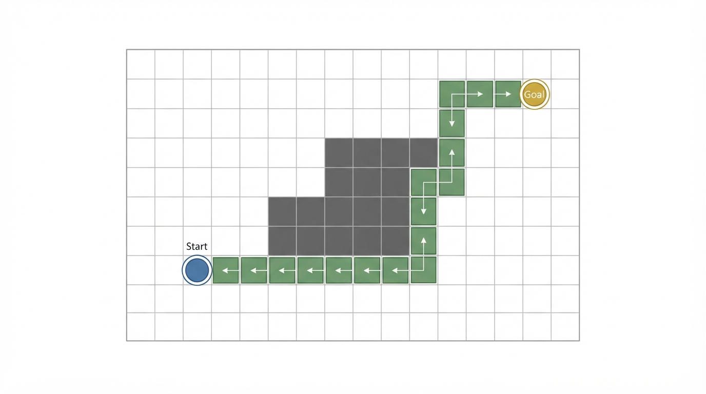
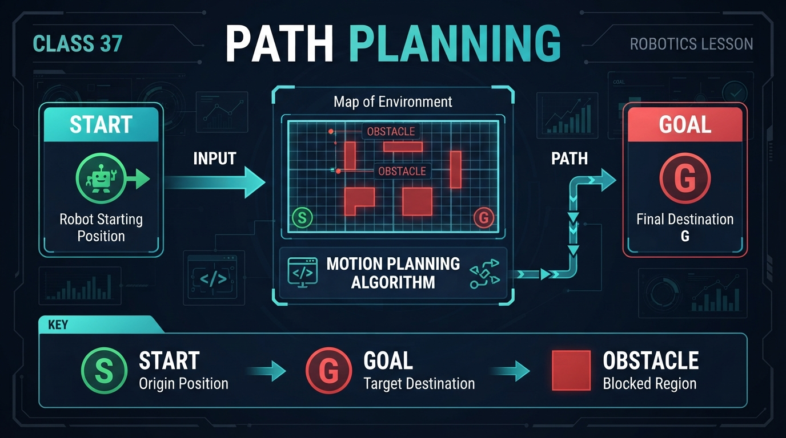
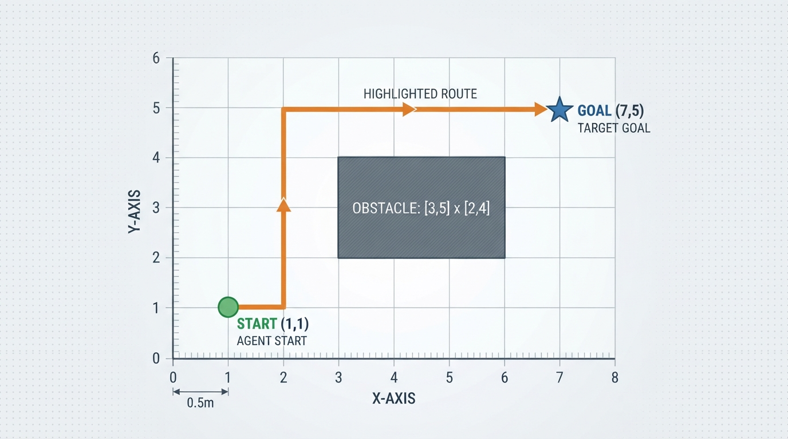
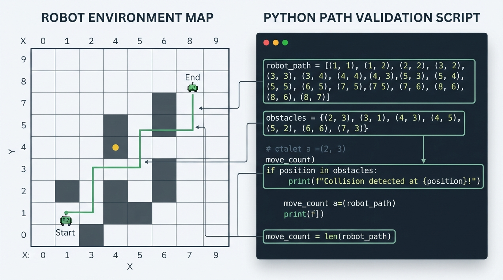

# Class 37: Path Planning

## Where We Are in the Robotics Journey

RoboRover has just learned how to build a map while moving. In the previous class, **SLAM**—simultaneous localization and mapping—helped RoboRover estimate:

- where it is;
- what parts of the environment may contain walls or objects;
- how uncertain those estimates are.

A map alone does not tell RoboRover what route to take. Today, we use that map to plan a route from a **start** position to a **goal** position while avoiding an **obstacle**.

In the next class, **Graph Search**, we will study how a computer can systematically discover a good route instead of relying on a human to write the route by hand.

## Today We Will Learn

By the end of this class, you should be able to:

1. identify a path-planning problem’s start, goal, and obstacles;
2. describe a path as a sequence of positions or movements;
3. calculate the length of a simple grid-based path;
4. check whether a proposed path enters an obstacle;
5. verify that consecutive path positions are valid one-cell movements;
6. explain why a path that looks short on a map may be unsafe for a real robot;
7. connect SLAM’s map to the planning process.

## 2-Minute Recap

Imagine RoboRover driving through a warehouse. Its sensors do not provide a perfect blueprint. Instead, RoboRover gradually combines sensor measurements with motion estimates to create a map and estimate its own position.

That is the role of SLAM.

Today’s question is:

> Given the map and RoboRover’s estimated position, where should it drive next?

A useful separation is:

- **Mapping:** What is around me?
- **Localization:** Where am I on the map?
- **Planning:** Which route should I take?
- **Control:** How should I command the motors to follow that route?

These tasks interact, but they are not the same task. A planner may produce a route, while a lower-level controller later turns that route into steering and wheel commands.

## The Big Idea




**Figure:** A path connects start to goal while avoiding every obstacle cell.

Path planning is like drawing a route on a floor plan before walking through a crowded room.

A path-planning problem usually contains three important ingredients:

- **Start:** RoboRover’s current position.
- **Goal:** the desired destination.
- **Obstacle:** a region RoboRover must not enter.

A planned path is a connected sequence of positions leading from start to goal without crossing forbidden regions.

For example:

```text
S . . . . . . . .
. . . # # # . . .
. . . # # # . . .
. . . # # # . . .
. . . . . . . G .
```

Here:

- `S` is the start;
- `G` is the goal;
- `#` cells are obstacles;
- `.` cells are available space.

The planner must choose a safe route around the obstacle.

The first route a person notices is not necessarily the best route. A useful planner may consider:

- distance;
- number of turns;
- clearance from obstacles;
- battery use;
- time;
- uncertainty in the map.

For this introductory class, we will focus on the most basic requirements: **connect start to goal, make each move valid, and avoid obstacles**.

## See It in Your Head

### AI-Generated Engineering Visual · Professor OS



**How to read this visual:** Trace the signal or idea from left to right. Match each block to the lesson explanation, then predict what would change if one block produced a wrong value.


Picture a tiled warehouse floor viewed from above.

RoboRover begins near the lower-left corner. Its destination is near the upper-right corner. A stack of crates occupies several tiles in the middle.

An illustrator could show:

1. a blue circular RoboRover icon at the start;
2. a gold target marker at the goal;
3. a gray rectangular obstacle;
4. a thick green line bending around the obstacle;
5. faint square grid lines;
6. arrows along the green line showing travel direction.

The important visual idea is that the path is not merely a line between two points. It is a **sequence of safe movements through free space**.

If the robot has noticeable width, the illustrator should also show a pale safety border around the obstacle. That border represents space RoboRover needs in order not to scrape the crates.

## Core Concept

### Start

The start is the robot’s current or planned initial position.

In this lesson, coordinates such as \((1,1)\) identify **grid cells by their indices**. When we draw a route, we plot each coordinate at the center of its corresponding cell.

We can describe the start with:

\[
S=(1,1)
\]

The first number is the horizontal coordinate, and the second is the vertical coordinate.

### Goal

The goal is the destination position or region.

A goal is often a region rather than one mathematically perfect point. For example, RoboRover may only need to arrive within 0.3 meters of a charging station.

For a simple exercise, we can represent it as one cell:

\[
G=(7,5)
\]

### Obstacle

An obstacle is a region that the robot should not occupy or cross.

An obstacle may be:

- a wall;
- a crate;
- a person;
- a closed doorway;
- a hole;
- an area marked unsafe.

In a map, an obstacle might be represented by one cell or by many neighboring cells.

### Path

A path is an ordered list of positions:

\[
P=[p_0,p_1,p_2,\ldots,p_n]
\]

where:

- \(P\) is the complete path;
- \(p_i\) is the position at step \(i\);
- \(p_0\) is the start;
- \(p_n\) is the goal;
- \(n\) is the number of movements between listed positions.

For the four-direction grid model used in this lesson, consecutive positions must be adjacent grid cells. A valid single move changes exactly one coordinate by one:

\[
|x_{i+1}-x_i|+|y_{i+1}-y_i|=1
\]

A valid path must satisfy three basic conditions:

1. it begins at the start and ends at the goal;
2. every consecutive pair of positions is one valid grid move apart;
3. none of its positions enters an obstacle.

Checking listed obstacle cells is sufficient for collision detection only after the one-cell movement condition has also been verified. Otherwise, a path could jump over an obstacle or move diagonally between listed positions without representing a valid route.

A path can still be poor even when it is valid. It may be unnecessarily long or pass dangerously close to an obstacle.

## Math Without Fear

Suppose a grid allows only horizontal and vertical movement. Each move changes one coordinate by one cell.

If the distance between neighboring cell centers is \(c\) meters, and the path contains \(n\) one-cell moves, then its length is:

\[
L=n c
\]

where:

- \(L\) is path length in meters;
- \(n\) is the number of grid moves;
- \(c\) is the cell size in meters per move.

### Worked numerical example

RoboRover uses a grid with cell spacing:

\[
c=0.5\ \text{m}
\]

A hand-designed path contains 10 horizontal or vertical moves. Therefore:

\[
L=(10\ \text{moves})(0.5\ \text{m/move})=5.0\ \text{m}
\]

The “moves” unit cancels because each move represents 0.5 meters.

**Interpretation:** if RoboRover travels through the centers of these cells and each move is exactly one cell, the planned center-to-center distance is 5.0 meters.

This is not automatically the robot’s real traveled distance. Real motion may be longer because of:

- turning arcs;
- wheel slip;
- corrections;
- stopping and restarting;
- a controller following the path imperfectly.

### Checking an obstacle

If an obstacle occupies the set of cells

\[
O=\{(3,2),(4,2),(5,2),(3,3),\ldots\}
\]

then a simple collision test asks whether any path position belongs to \(O\).

In plain language:

> If even one planned cell is an obstacle cell, the path is invalid.

This assumes a simplified model in which RoboRover is a point occupying one cell center and every transition is a valid one-cell move. We will improve this assumption later in the course.

## Worked Robotics Example




**Figure:** The example route uses 10 grid moves, each representing 0.5 meters, for a planned distance of 5.0 meters.

RoboRover is inspecting a warehouse floor represented by 0.5-meter grid cells.

- Start: \((1,1)\)
- Goal: \((7,5)\)
- Obstacle cells: a rectangular block from \(x=3\) through \(x=5\), and \(y=2\) through \(y=4\)

A safe route is:

\[
\begin{aligned}
&(1,1)\rightarrow(2,1)\rightarrow(2,2)\rightarrow(2,3)\\
&\rightarrow(2,4)\rightarrow(2,5)\rightarrow(3,5)\\
&\rightarrow(4,5)\rightarrow(5,5)\rightarrow(6,5)\rightarrow(7,5)
\end{aligned}
\]

Count the arrows between positions:

- 1 move right;
- 4 moves up;
- 5 moves right.

Total:

\[
n=1+4+5=10\ \text{moves}
\]

With \(c=0.5\ \text{m/move}\):

\[
L=10(0.5\ \text{m})=5.0\ \text{m}
\]

The path travels upward along \(x=2\), then moves right along \(y=5\). Since the obstacle ends at \(y=4\), the final horizontal section is above the obstacle.

This route is valid under the point-robot grid model. It has two major turns:

1. from rightward movement to upward movement;
2. from upward movement to rightward movement.

A different valid route might travel right first and then down or up around the obstacle. Two routes can have the same length but different turning patterns.

## Python Lab




**Figure:** The program checks every path cell, counts movements, calculates distance, and draws the result.

This program draws RoboRover’s map, checks the path for obstacle collisions, verifies that every transition is a valid one-cell movement, counts its moves, and calculates the distance.

Before running it, predict:

1. Will the path be accepted as collision-free and geometrically valid?
2. How many moves will it contain?
3. What distance will the program calculate when each cell is 0.5 meters wide?

```python
import matplotlib.pyplot as plt
from matplotlib.patches import Rectangle

# Each grid move represents this physical distance.
cell_size_m = 0.5

# RoboRover's start and goal cells.
start = (1, 1)
goal = (7, 5)

# A rectangular obstacle occupying nine cells.
obstacles = set()
for x in range(3, 6):
    for y in range(2, 5):
        obstacles.add((x, y))

# A hand-designed path from start to goal.
path = [
    (1, 1), (2, 1),
    (2, 2), (2, 3), (2, 4), (2, 5),
    (3, 5), (4, 5), (5, 5), (6, 5), (7, 5)
]

def is_single_grid_step(a, b):
    """Return True only when a and b are horizontally or vertically adjacent."""
    dx = abs(a[0] - b[0])
    dy = abs(a[1] - b[1])
    return dx + dy == 1

# Verify the endpoints.
assert path[0] == start
assert path[-1] == goal

# Verify that no path cell is an obstacle.
collision_cells = [cell for cell in path if cell in obstacles]
assert collision_cells == []

# Verify that every consecutive pair is one valid grid move apart.
invalid_steps = [
    (a, b) for a, b in zip(path, path[1:])
    if not is_single_grid_step(a, b)
]
assert invalid_steps == []

# Count movements between consecutive path cells.
move_count = len(path) - 1
path_length_m = move_count * cell_size_m

# Verify the exact results for this planned route.
assert move_count == 10
assert path_length_m == 5.0

print("Path is collision-free and uses valid one-cell moves.")
print("Number of moves:", move_count)
print("Planned center-to-center distance: {:.1f} m".format(path_length_m))

# Draw the grid.
fig, ax = plt.subplots(figsize=(8, 6))
ax.set_xlim(0, 9)
ax.set_ylim(0, 7)
ax.set_aspect("equal")

# Draw obstacle cells.
for x, y in obstacles:
    ax.add_patch(Rectangle(
        (x - 0.5, y - 0.5), 1, 1,
        facecolor="dimgray",
        edgecolor="black"
    ))

# Draw the path as connected line segments.
path_x = [cell[0] for cell in path]
path_y = [cell[1] for cell in path]
ax.plot(path_x, path_y, color="seagreen", linewidth=3, marker="o")

# Mark start and goal.
ax.scatter([start[0]], [start[1]], color="royalblue", s=130, zorder=3)
ax.scatter([goal[0]], [goal[1]], color="gold", edgecolors="black",
           s=180, marker="*", zorder=3)

ax.text(start[0] + 0.12, start[1] + 0.12, "Start")
ax.text(goal[0] + 0.12, goal[1] + 0.12, "Goal")

ax.set_xticks(range(0, 9))
ax.set_yticks(range(0, 7))
ax.set_xlabel("Grid x-coordinate")
ax.set_ylabel("Grid y-coordinate")
ax.set_title("RoboRover's Planned Path")
ax.grid(True)
plt.show()
```

Important lines include:

- `obstacles = set()` creates a collection that makes obstacle membership checks convenient.
- `collision_cells = [...]` collects any path cells that are also obstacle cells.
- `is_single_grid_step(a, b)` rejects jumps and diagonal transitions.
- `invalid_steps = [...]` identifies consecutive path positions that are not valid one-cell moves.
- `len(path) - 1` counts movements, because 11 listed positions create 10 connecting steps.
- `ax.plot(...)` draws the route as a connected line.
- `assert` statements stop the program if an expected condition is false.

The program does not discover the route. A human supplied the path list. The next class will begin replacing hand-designed routes with systematic search.

## Mini Simulation or Game

Try changing the path in the Python program.

### Round 1: Make an unsafe path by entering an obstacle

Change the middle of the path so that it includes:

```text
(3, 3)
```

That cell is inside the obstacle. Run the program.

The assertion

```text
assert collision_cells == []
```

should fail. This is useful: the program has caught a planned collision before RoboRover moves.

### Round 2: Make a geometrically invalid path

Try replacing a sequence of adjacent positions with a jump that avoids all listed obstacle cells, such as:

```python
path = [
    (1, 1), (2, 1), (7, 5)
]
```

This path ends at the goal and does not list an obstacle cell, but `(2, 1)` to `(7, 5)` is not one horizontal or vertical grid move. The assertion

```text
assert invalid_steps == []
```

should fail.

This demonstrates why obstacle membership alone is not a complete path validator. A valid path must both avoid obstacle cells and connect consecutive positions with allowed movements.

### Round 3: Design your own safe path

Keep the same start, goal, and obstacle. Create a different path that:

- begins at `(1, 1)`;
- ends at `(7, 5)`;
- changes only one coordinate at a time;
- avoids every obstacle cell.

Before running, predict:

- whether it is safe;
- how many moves it uses;
- whether it is shorter, equal, or longer than 10 moves.

Do not worry about finding the best possible route yet. The objective is to practice translating a visual route into a sequence of coordinates.

## What Should Happen?

With the original program:

- the path should be accepted as collision-free and geometrically valid;
- the path should contain 10 moves;
- the calculated planned distance should be 5.0 meters;
- the plot should show a green route rising along the left side of the obstacle and then moving right above it.

If you insert `(3, 3)`, the program should stop at the collision assertion rather than display a completed plot.

If you replace adjacent positions with a jump such as `(2, 1)` to `(7, 5)`, the program should stop at the single-grid-step assertion, even if the listed cells themselves avoid the obstacle.

Why does the program use assertions instead of simply printing “warning”? An assertion expresses a condition that must be true for the rest of the program to be trusted. In a larger robotics system, a detected invalid path would normally be rejected, replanned, or sent to a safety procedure rather than executed.

## Common Mistakes

### Mistake 1: Treating the goal as a direction

“Drive northeast” is not a complete plan. RoboRover needs a route that accounts for obstacles and the robot’s position.

### Mistake 2: Checking only the final position

A path can end at the correct goal while crossing an obstacle on the way. Collision checking must examine the entire route, not just the endpoint.

### Mistake 3: Checking obstacle cells without checking transitions

A list of positions may avoid every listed obstacle cell but still jump over an obstacle or move diagonally. The path validator must verify that each consecutive pair is an allowed movement.

### Mistake 4: Counting positions instead of moves

The example has 11 listed positions but 10 movements between them. Distance is based on the connecting movements.

### Mistake 5: Assuming a map is perfectly accurate

SLAM maps contain uncertainty. A wall may be a little farther left or right than estimated. A movable box may no longer be where the map recorded it.

### Mistake 6: Treating RoboRover as a mathematical point

A real rover has width and length. If its center passes 2 centimeters from a wall, its body may still hit the wall.

A practical planner usually reserves extra space around obstacles. This is often called **obstacle inflation** or adding a **safety margin**. We will not calculate that in detail today, but it is a major engineering difference between a paper route and a safe robot route.

### Mistake 7: Confusing a path with perfect motion

The plotted line is a geometric plan. Motors have delay, wheels may slip, and the rover may need to turn gradually. A motion controller must later work to follow the planned route.

## Try It Yourself

### Challenge: The Warehouse Detour

Create a new map with:

- start at `(0, 0)`;
- goal at `(8, 5)`;
- an obstacle rectangle occupying `x = 3` through `x = 5` and `y = 1` through `y = 4`;
- cell size of `0.5` meters.

Write a path list by hand and modify the Python program so that it checks your route.

Your path must:

1. begin at the start;
2. end at the goal;
3. move one grid cell at a time;
4. never enter an obstacle.

Then calculate its length.

**Optional extension:** Add a second candidate path and let the program calculate both lengths. Print which candidate is shorter. If they have equal lengths, compare the number of turns and explain why a rover might prefer fewer turns.

For example, two routes can have equal length but different turn counts. From `(0, 0)` to `(4, 2)`, a route with four right moves followed by two up moves has length six and two direction runs, while a route that alternates right and up movements also has length six but many more turns. A rover may prefer the first route because repeated turning can increase control difficulty and execution time.

Do not try to build a general route-finding algorithm yet. That is the subject of Graph Search.

## Quick Quiz

1. What are the three core ingredients of the path-planning problem in this class?

2. A grid path contains 14 one-cell movements, and each cell is 0.25 meters wide. What is its planned center-to-center length?

3. Why is a path that avoids obstacles for most of its route still invalid if one path cell is an obstacle cell?

4. Why must a validator check consecutive path positions in addition to checking obstacle cells?

5. How does SLAM help path planning, and why is SLAM not itself a path planner?

## Answers

1. The start, the goal, and the obstacles.

2. Let \(n=14\) moves and \(c=0.25\ \text{m/move}\). Then:

   \[
   L=nc=14(0.25\ \text{m})=3.5\ \text{m}
   \]

3. The robot would enter forbidden space during that step. A valid path must avoid obstacles throughout the complete route, not only at its beginning and end.

4. Without a transition check, a path could jump over an obstacle or move diagonally even though none of its listed cells is an obstacle. In this lesson, every consecutive pair must be one horizontal or vertical grid move apart.

5. SLAM supplies an estimated map and an estimated robot position. Path planning uses that information to choose a route. SLAM answers “What is around me, and where am I?” while planning answers “Which route should I take?”

## Real Robot Connection

A real RoboRover might receive a map from SLAM in the form of a grid where each cell has a status such as:

- likely free;
- likely occupied;
- unknown.

Planning through an unknown cell can be risky. The planner may choose to avoid unknown areas, or it may allow them if exploration is part of the mission.

There is also a timing issue. A map can become outdated while the rover is moving. A person may step into the planned route, or a box may be moved. Therefore, practical robots repeatedly compare sensor measurements with the plan and may stop, update the map, or create a new route.

That does not mean every sensor event automatically creates a new plan. The planning system must decide how to respond to changed information. In the next class, we will focus on the computational problem of searching possible routes through a map.

## Vocabulary

- **Path planning:** Choosing a route from a starting state to a desired goal while respecting constraints such as obstacles.
- **Start:** The robot’s initial or current position for the planning problem.
- **Goal:** The destination position or acceptable destination region.
- **Obstacle:** A region that the robot should not enter or cross.
- **Path:** An ordered sequence of positions connecting start to goal, with consecutive positions satisfying the allowed movement model.
- **Grid map:** A map divided into regular cells used to represent space.
- **Collision check:** A test that determines whether a path enters an obstacle.
- **Single-grid-step check:** A test that verifies that consecutive grid positions are adjacent under the selected movement model.
- **Cell size:** The physical distance represented by one grid spacing, usually measured in meters.
- **Safety margin:** Extra clearance reserved around an obstacle or boundary.
- **Obstacle inflation:** A planning technique that represents an obstacle as larger to account for robot body size and uncertainty.
- **Geometric path:** A spatial route described by positions, without fully specifying motor timing or speeds.

## Further Learning

To extend this class, study these topics in sequence:

1. occupancy-grid maps;
2. configuration space and obstacle inflation;
3. grid connectivity, such as four-direction and eight-direction movement;
4. route cost functions;
5. graph search algorithms;
6. path following and motion control.

Useful search terms include **robot path planning basics**, **occupancy grid robotics**, **configuration space robotics**, and **grid graph search**.

## Next Class

In **Class 38: Graph Search**, RoboRover will stop relying on a hand-written route. We will represent possible positions and movements as a graph, then examine how a search procedure can explore that graph to find a route from start to goal.

Today we defined the route’s ingredients and the conditions a grid path must satisfy. Next class, we will build a method for discovering the route.
