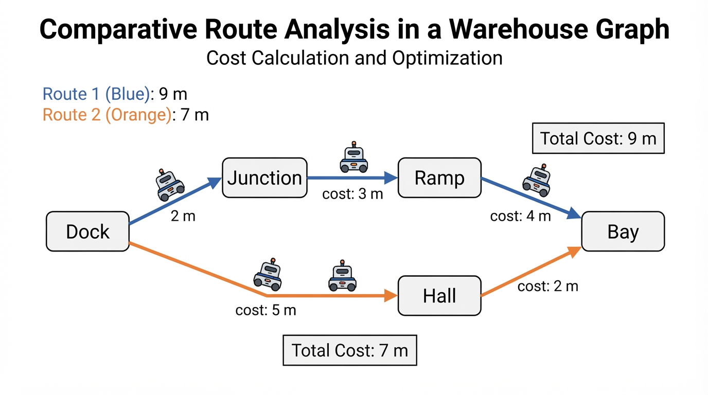
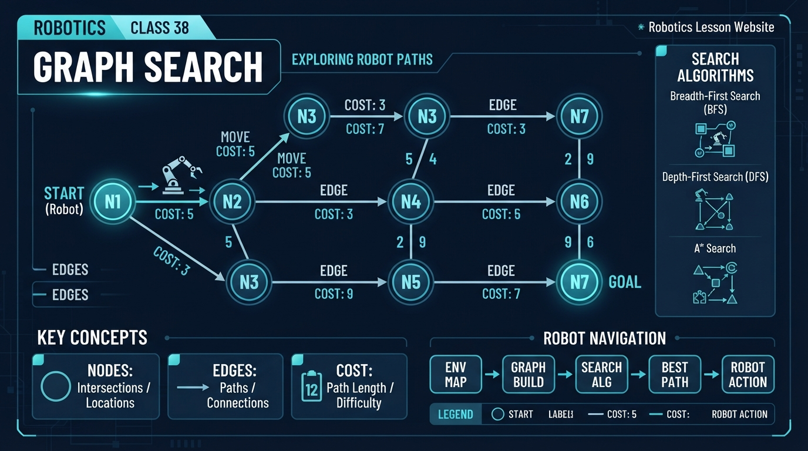
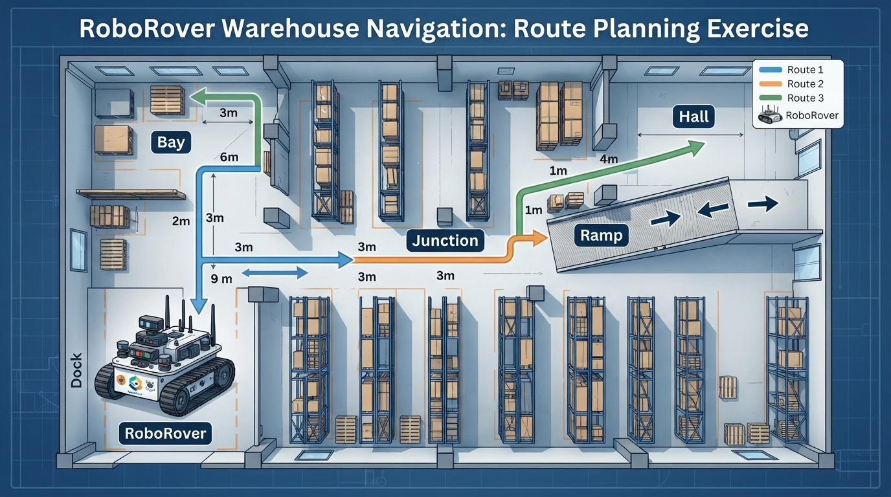
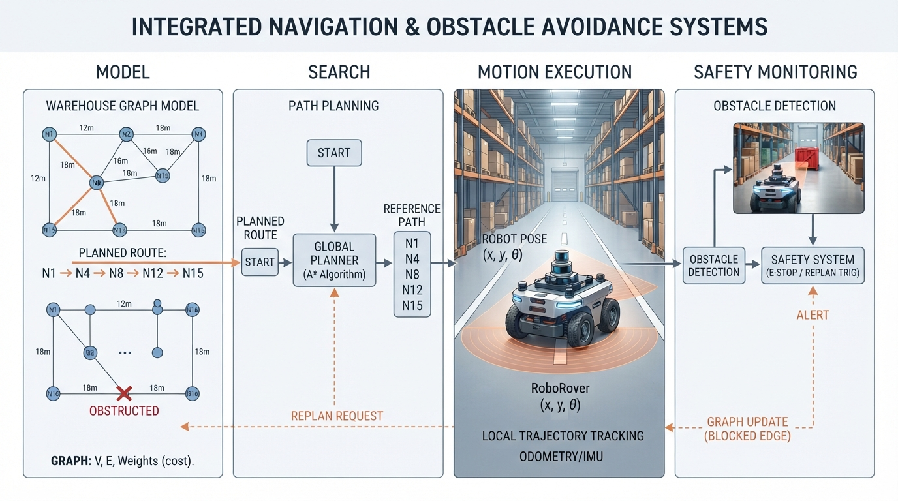

# Class 38: Graph Search

## Where We Are in the Robotics Journey

RoboRover has already learned that **path planning** means choosing a route through an environment. In the previous class, we described routes geometrically: move through free space while avoiding blocked regions.

Today we change the representation.

Instead of treating the whole floor as one continuous picture, we will describe important places as **nodes** and possible movements between them as **edges**. Each edge can have a **cost**, such as distance, travel time, battery energy, or risk.

This gives us a compact map that a computer can search.

In the next class, we will study **Dijkstra’s Algorithm**, a systematic method for finding a lowest-cost route when edge costs are nonnegative. Today is about understanding the objects that algorithm will use—not yet performing Dijkstra’s full procedure.

## Today We Will Learn

By the end of this class, you should be able to:

- identify nodes and edges in a robot environment;
- explain what an edge cost represents;
- calculate the cost of a complete route;
- compare several routes;
- describe graph search as exploring connected possibilities;
- recognize why the cheapest-looking next edge is not always part of the cheapest complete route.

## 2-Minute Recap

In path planning, RoboRover needs answers to three questions:

1. **Where am I?**
2. **Where do I want to go?**
3. **Which sequence of movements gets me there safely and efficiently?**

A path is a continuous or step-by-step route from a start position to a goal position.

For a small warehouse, we might draw every possible position on a grid. That can be useful, but it may contain thousands of locations that are not important. A different approach is to keep only meaningful places:

- the charging dock;
- aisle intersections;
- the entrance to a loading bay;
- a narrow ramp;
- the delivery station.

This simplified map is called a **graph**.

## The Big Idea




**Figure:** A route is evaluated by its total edge cost, not by its cheapest first move.

Imagine a city subway map. It does not draw every centimeter of tunnel. It shows stations and the connections between them.

A robotics graph works similarly:

- a **node** represents a place, state, or situation;
- an **edge** represents a possible connection or action;
- a **cost** measures how expensive that connection is.

For RoboRover, a node might mean “RoboRover is at the north end of Aisle 2.” An edge might mean “drive from Aisle 2 to the loading bay.” The edge cost might be 4 meters of travel.

A route is a sequence of nodes connected by edges.

```text
Dock --2 m-- Junction --3 m-- Ramp --4 m-- Bay
  \
   \--5 m-- Hall --2 m-- Bay
```

The top route costs:

\[
2\ \text{m} + 3\ \text{m} + 4\ \text{m} = 9\ \text{m}
\]

The lower route costs:

\[
5\ \text{m} + 2\ \text{m} = 7\ \text{m}
\]

Even though the lower route begins with a longer 5-meter edge, it is the cheaper complete route.

That is a central lesson: **a route is judged by its total cost, not just by its first move**.

## See It in Your Head

### AI-Generated Engineering Visual · Professor OS



**How to read this visual:** Trace the signal or idea from left to right. Match each block to the lesson explanation, then predict what would change if one block produced a wrong value.


Ask an illustrator to draw a top-down warehouse map with five large labeled locations:

- **Dock**: RoboRover’s start;
- **Junction**: a central crossing;
- **Ramp**: a passage toward storage;
- **Hall**: a long side corridor;
- **Bay**: the goal.

Draw each possible corridor as a thick line. Put the cost beside every corridor. Use arrows if movement is one-way; use plain connecting lines if movement is allowed in both directions.

Now highlight two complete routes:

- Dock → Junction → Ramp → Bay;
- Dock → Hall → Bay.

The first route should be visually longer even though its first segment is short. The second route should have a longer first segment but a smaller total.

This drawing teaches three different levels of thought:

1. **Node level:** Where could RoboRover be?
2. **Edge level:** Which movements are possible?
3. **Route level:** Which sequence has the best total cost?

## Core Concept

### Nodes

A **node**, also called a vertex, is one item in a graph.

In robotics, a node might represent:

- a physical location;
- a grid cell;
- a doorway;
- a charging station;
- a robot configuration;
- a situation such as “gripper holding a box.”

A node is not necessarily a point sensor measurement. It is a useful discrete description chosen for the planning problem.

For example, if the warehouse floor is divided into named areas, the node “Hall” may represent an entire corridor rather than one exact coordinate.

### Edges

An **edge** connects two nodes when the robot can move or transition between them.

An edge may represent:

- driving along a corridor;
- turning through an intersection;
- moving an arm between two safe configurations;
- taking an elevator;
- performing an action that changes the robot’s state.

If RoboRover can travel from Dock to Hall and back, the connection may be modeled as **undirected**. If a narrow aisle allows travel only one way, it is modeled as a **directed edge**.

The graph must reflect reality. Drawing an edge does not make the movement physically possible.

### Cost

An edge cost is a numerical measure of what we want to minimize.

Common choices include:

- distance in meters;
- time in seconds;
- energy in joules;
- monetary expense;
- risk score;
- a weighted combination of several concerns.

The word “cost” does not automatically mean money. It means the quantity used to compare alternatives.

A path cost is usually the sum of the costs of its edges:

\[
C(P) = \sum_{i=1}^{k} c(e_i)
\]

where:

- \(C(P)\) is the total cost of path \(P\), in the chosen cost unit;
- \(e_i\) is the \(i\)-th edge in the path;
- \(c(e_i)\) is the cost of that edge;
- \(k\) is the number of edges in the path.

This addition rule is appropriate when each edge contributes independently to the total. Real systems may later add turning penalties, waiting time, or changing battery conditions.

### Graph Search

**Graph search** means systematically exploring a graph to find a route, answer a reachability question, or compare possible routes.

A search may ask:

- Can RoboRover reach the delivery bay?
- Which nodes are connected to the dock?
- What is the lowest-cost route?
- How many movements are needed?

Searching a graph requires remembering what has already been explored. Otherwise, a loop such as Dock → Junction → Dock → Junction could continue forever.

## Math Without Fear

Suppose a route contains three edges with costs:

- \(c(e_1) = 2\ \text{m}\)
- \(c(e_2) = 3\ \text{m}\)
- \(c(e_3) = 4\ \text{m}\)

Its total distance is:

\[
C(P) = 2\ \text{m} + 3\ \text{m} + 4\ \text{m}
\]

\[
C(P) = 9\ \text{m}
\]

Now compare a second route:

- \(c(f_1) = 5\ \text{m}\)
- \(c(f_2) = 2\ \text{m}\)

\[
C(Q) = 5\ \text{m} + 2\ \text{m} = 7\ \text{m}
\]

Therefore:

\[
C(Q) < C(P)
\]

The second route is shorter by:

\[
9\ \text{m} - 7\ \text{m} = 2\ \text{m}
\]

The unit matters. If costs represented seconds instead, the same arithmetic would compare travel times, not distances.

A graph can also mix physical quantities through a designed score, but that requires care. Adding “4 meters + 3 seconds” is not meaningful until an engineer defines how meters and seconds are converted into a common score.

## Worked Robotics Example




**Figure:** Three complete routes can be compared by adding the costs of their edges.

RoboRover starts at **Dock** and must reach **Bay**. The warehouse graph has these undirected connections:

| Edge | Cost |
|---|---:|
| Dock–Junction | 2 m |
| Junction–Ramp | 3 m |
| Ramp–Bay | 4 m |
| Dock–Hall | 5 m |
| Hall–Bay | 2 m |
| Junction–Hall | 4 m |

Consider three possible routes.

### Route A

Dock → Junction → Ramp → Bay

\[
C_A = 2\ \text{m} + 3\ \text{m} + 4\ \text{m}
\]

\[
C_A = 9\ \text{m}
\]

### Route B

Dock → Hall → Bay

\[
C_B = 5\ \text{m} + 2\ \text{m}
\]

\[
C_B = 7\ \text{m}
\]

### Route C

Dock → Junction → Hall → Bay

\[
C_C = 2\ \text{m} + 4\ \text{m} + 2\ \text{m}
\]

\[
C_C = 8\ \text{m}
\]

Route B is the lowest-distance route among these three:

\[
7\ \text{m} < 8\ \text{m} < 9\ \text{m}
\]

Interpretation: RoboRover should travel first toward Hall, even though Dock–Hall is not the shortest individual edge. Choosing only the cheapest next edge would send it to Junction and could lead to a longer complete route.

An engineer must also check assumptions. Are all corridors open? Can RoboRover physically turn into Hall? Are the measured distances accurate? Is Hall crowded or slippery? A graph is a model, not the warehouse itself.

## Python Lab

The program below stores the warehouse as a graph and searches for simple routes from Dock to Bay. “Simple” means the route does not visit the same node twice. The recursive function explores one possible next edge, then continues from the new node.

```python
# Python 3.7-compatible graph search example

GRAPH = {
    "Dock": [("Junction", 2), ("Hall", 5)],
    "Junction": [("Dock", 2), ("Ramp", 3), ("Hall", 4)],
    "Ramp": [("Junction", 3), ("Bay", 4)],
    "Hall": [("Dock", 5), ("Junction", 4), ("Bay", 2)],
    "Bay": [("Ramp", 4), ("Hall", 2)]
}


def find_routes(graph, current, goal, visited, route, cost):
    """Return every simple route from current to goal."""
    visited.add(current)
    route.append(current)

    if current == goal:
        routes = [(list(route), cost)]
    else:
        routes = []
        for neighbor, edge_cost in graph[current]:
            if neighbor not in visited:
                new_cost = cost + edge_cost
                routes.extend(
                    find_routes(
                        graph,
                        neighbor,
                        goal,
                        visited,
                        route,
                        new_cost
                    )
                )

    route.pop()
    visited.remove(current)
    return routes


def main():
    routes = find_routes(
        GRAPH,
        "Dock",
        "Bay",
        set(),
        [],
        0
    )

    routes.sort(key=lambda item: item[1])

    print("Routes from Dock to Bay:")
    for path, cost in routes:
        print(" -> ".join(path), "=", cost, "m")

    best_path, best_cost = routes[0]
    print("Best route:", " -> ".join(best_path))
    print("Best cost:", best_cost, "m")

    # These assertions verify the exact claims made by this program.
    assert best_path == ["Dock", "Hall", "Bay"]
    assert best_cost == 7
    assert len(routes) == 4


if __name__ == "__main__":
    main()
```

Important lines:

- `GRAPH` maps each node to neighboring nodes and edge costs.
- `visited` prevents a route from looping back through an earlier node.
- `route` stores the current sequence of nodes.
- `cost` stores the sum accumulated so far.
- `routes.extend(...)` collects routes found deeper in the graph.
- `routes.sort(...)` places the smallest total cost first.
- The assertions make the program check its own exact result.

The program is deliberately not Dijkstra’s Algorithm. It explores all simple routes in this small example and then compares their costs. That is acceptable for a tiny graph, but it becomes inefficient as the graph grows. The next class introduces a smarter lowest-cost search method.

## Mini Simulation or Game

Play **RoboRover Route Captain** with a partner.

One person is the robot operator. The other is the graph designer.

1. Draw six nodes on paper.
2. Connect them with corridors.
3. Write a distance in meters beside every corridor.
4. Mark one node as Start and one as Goal.
5. The operator chooses a route before adding the costs.
6. The designer calculates the total.
7. Try again with a different route.

Add one rule: one edge is suddenly blocked. The operator must find another route without using it.

For a more challenging version, change the meaning of cost:

- Round 1: cost = distance in meters.
- Round 2: cost = travel time in seconds.
- Round 3: cost = distance plus a 3-point penalty for passing through a busy intersection.

Discuss whether the best route changes when the meaning of cost changes.

## What Should Happen?

**Predict before you run the Python program.**

For the warehouse graph, predict:

1. Which route will appear first after sorting?
2. What will its cost be?
3. Will Dock → Junction → Ramp → Bay be the best route?
4. Why must the program remember visited nodes?

Write your predictions down. Then run the program and compare them with the printed result.

The exact best-route and cost claims are checked by the assertions in the program. The number of discovered routes is also checked, so a change to the graph or search logic will be detected rather than silently accepted.

## Common Mistakes

### Mistake 1: Treating every node as a physical dot

A node may represent a region, state, or useful decision point. Its meaning depends on the model.

### Mistake 2: Choosing the cheapest immediate edge

The cheapest next move may lead to an expensive dead end. Compare complete routes, not just the first edge.

### Mistake 3: Forgetting direction

A one-way aisle should not automatically be searchable in both directions. Directed and undirected graphs model different physical situations.

### Mistake 4: Mixing cost units carelessly

Meters, seconds, energy, and risk are different quantities. They can only be combined after an engineering rule converts them into a common score.

### Mistake 5: Trusting an outdated map

A graph may say an edge exists even when a pallet blocks the corridor. Sensors and safety checks must confirm that the planned movement is still possible.

### Mistake 6: Ignoring loops

A graph can contain cycles. A search that does not track visited nodes may revisit the same locations indefinitely.

## Try It Yourself

**Challenge:** Add a new node called `ColdStorage`.

Give it these connections:

- Hall to ColdStorage: 3 m
- ColdStorage to Bay: 1 m

Modify the Python graph and predict whether the best Dock-to-Bay route changes.

Then verify your prediction by updating the assertions in the program.

**Optional extension:** Change the edge costs from distance to travel time. Suppose RoboRover travels through normal corridors at \(1\ \text{m/s}\), but the Ramp requires a slower speed of \(0.5\ \text{m/s}\). Compute travel time for each edge instead of using distance directly. State clearly which edges are affected and why.

## Quick Quiz

1. In a robotics graph, what does a node represent?

2. What does an edge cost measure?

3. A route has edge costs \(4\ \text{m}\), \(2\ \text{m}\), and \(5\ \text{m}\). What is its total distance?

4. Why is remembering visited nodes important during graph search?

## Answers

1. A node represents a modeled place, state, or situation in which the robot can be considered to be.

2. An edge cost measures the quantity being used to compare a movement or transition, such as distance, time, energy, or risk.

3. The total is:

\[
4\ \text{m} + 2\ \text{m} + 5\ \text{m} = 11\ \text{m}
\]

4. Visited-node tracking prevents the search from repeatedly following cycles and helps it avoid treating looping routes as new progress.

## Real Robot Connection




**Figure:** A graph is a useful model, but sensors must check whether its assumptions still match the real warehouse.

Real robots rarely move through a perfectly permanent graph.

A warehouse map may change because:

- shelves are moved;
- people enter an aisle;
- a wheel slips, making the estimated position inaccurate;
- a corridor becomes temporarily blocked;
- wireless communication introduces delay;
- the measured edge distance is slightly wrong;
- the robot cannot turn as sharply as the map assumes.

A practical robot therefore separates several tasks:

1. **Graph model:** what connections are believed to exist;
2. **Search:** which route appears best;
3. **Motion execution:** how the robot follows the selected route;
4. **Safety monitoring:** whether the route remains safe and available.

A planned edge is not permission to drive blindly. RoboRover should recheck its surroundings while moving and stop or revise the plan if the environment disagrees with the graph.

There is also a modeling tradeoff. A graph with only five large nodes is easy to search, but it may hide important obstacles inside a corridor. A graph with thousands of tiny nodes describes space more accurately, but requires more computation and more careful map maintenance.

Next class, Dijkstra’s Algorithm will use node labels and accumulated costs to find a lowest-cost route more efficiently than listing every possible route.

## Vocabulary

- **Graph:** A mathematical model made of nodes and edges.
- **Node:** A modeled location, state, or situation.
- **Edge:** A possible connection or transition between two nodes.
- **Directed edge:** An edge that permits movement in a specified direction.
- **Undirected edge:** A connection modeled as usable in both directions.
- **Cost:** A numerical measure used to compare an edge or route.
- **Path or route:** An ordered sequence of connected nodes.
- **Path cost:** The total cost obtained by adding the costs of the route’s edges.
- **Graph search:** Systematically exploring graph connections to answer a reachability or route question.
- **Cycle:** A route that can return to a node already visited.
- **Visited set:** A record of nodes already included in the current search route or exploration.
- **Model:** A simplified representation of a real system used for reasoning or computation.

## Further Learning

To prepare for the next class:

- redraw the warehouse graph with arrows to represent one-way aisles;
- choose a different cost, such as seconds instead of meters;
- identify which real-world measurements would be needed to estimate each edge cost;
- search for learning resources using the terms **weighted graph**, **graph representation**, **path cost**, and **Dijkstra’s Algorithm**.

Do not try to memorize an algorithm before understanding what its nodes, edges, and costs mean. Those objects are the foundation.

## Next Class

In **Class 39: Dijkstra’s Algorithm**, RoboRover will learn a systematic way to find a lowest-cost route in a graph with nonnegative edge costs.

Today we compared complete routes. Next class, we will organize that comparison so the robot does not need to list every possible route first.
