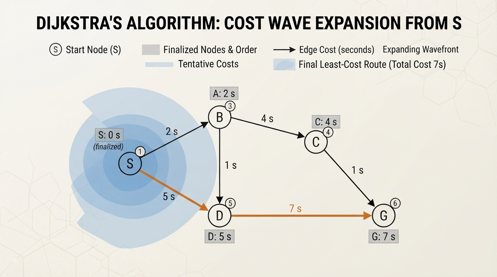
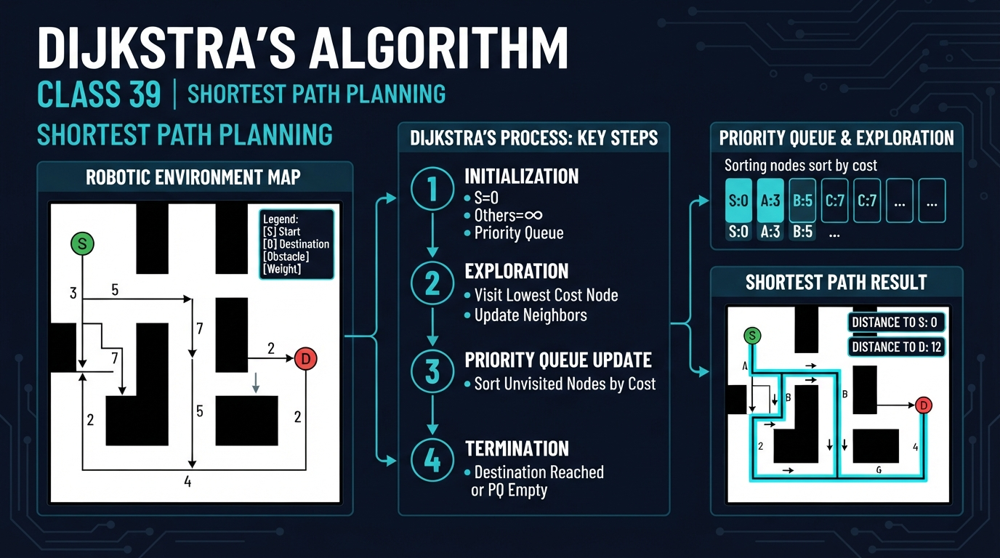
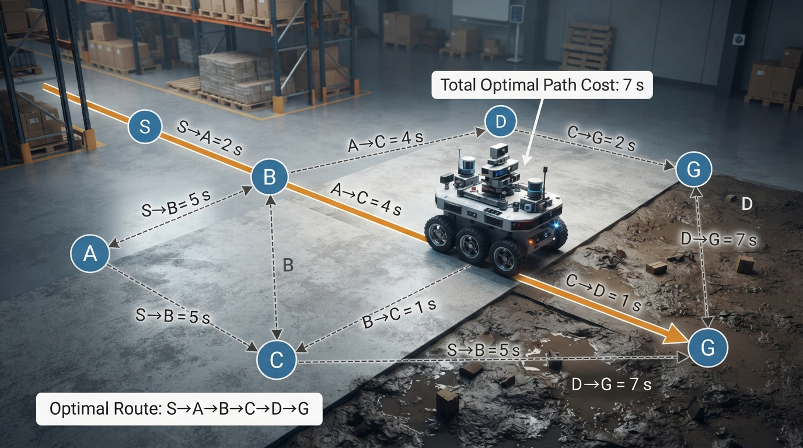
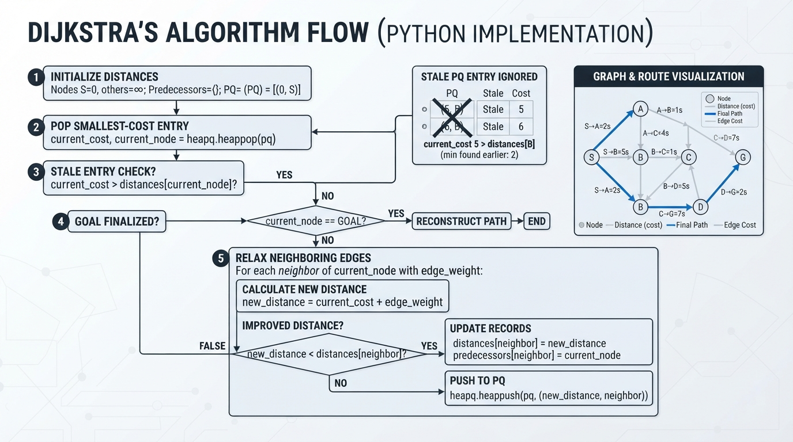
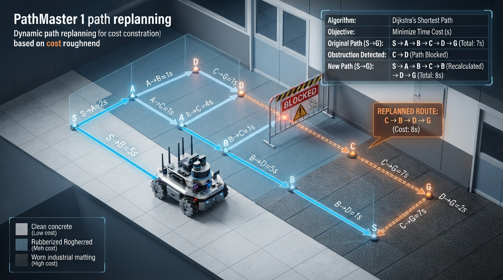

# Class 39: Dijkstra's Algorithm

## Where We Are in the Robotics Journey

In the previous class, **Graph Search**, we learned to represent a problem as:

- **nodes**: places or situations,
- **edges**: allowed moves,
- **a path**: a sequence of connected edges.

RoboRover used graph search to find a route through a map. That was enough when every move had the same cost. For example, moving one square might always count as one step.

Real robots rarely experience a world where every move costs the same. Driving across smooth floor may be easy, while crossing carpet, gravel, or a narrow ramp may be slower and use more battery.

Today we learn **Dijkstra's algorithm**, which finds a least-cost path when edges have different, nonnegative costs.

In the next class, we will study **A* Search**. A* improves the search process by using an estimate of how far remains to the goal.

## Today We Will Learn

By the end of this class, you should be able to:

1. Explain the difference between a shortest path and a path with the fewest edges.
2. Describe how Dijkstra's algorithm grows outward from a starting node.
3. Calculate tentative path costs by hand.
4. Implement Dijkstra's algorithm in Python 3.7.
5. Recognize when Dijkstra's assumptions do not fit a real robot.

## 2-Minute Recap

Imagine RoboRover is at node `S` and wants to reach node `G`.

A graph search algorithm must answer two questions:

1. Which places can RoboRover reach?
2. Which route should it use?

In an **unweighted graph**, every edge has equal cost. A route with three edges is cheaper than a route with five edges.

In a **weighted graph**, edges have costs. A three-edge route might be worse than a five-edge route if its edges represent steep hills, mud, or long driving distances.

The key new idea is:

> Dijkstra's algorithm chooses the not-yet-finalized node with the smallest known total cost from the start.

“Finalized” means that, under Dijkstra's assumptions, we now know the cheapest possible cost to that node.

## The Big Idea




**Figure:** Dijkstra expands through the graph according to accumulated cost, not geometric distance or edge count alone.

Think of RoboRover dropping a glowing marker at its starting location. The marker spreads through the map, but not as a simple circular wave. It spreads according to **travel cost**.

A smooth tile might cost `1.0 s` of driving time. A muddy tile might cost `4.0 s`. The wave reaches cheap areas first, even if they are geometrically farther away.

Dijkstra's algorithm keeps a table:

| Node | Best cost currently known | Previous node |
|---|---:|---|
| S | 0 s | — |
| A | 2 s | S |
| B | 5 s | S |
| C | infinity | — |

When the algorithm discovers a cheaper route to a node, it updates the table. This update is called **relaxation**.

For example, if RoboRover can reach `A` in `2 s`, and moving from `A` to `B` costs `1 s`, then a route to `B` through `A` costs:

\[
2\text{ s} + 1\text{ s} = 3\text{ s}
\]

If the old best-known route to `B` cost `5 s`, we replace it with `3 s`.

Dijkstra does not merely remember the total cost. It also remembers the previous node. Those previous-node links allow us to reconstruct the actual route at the end.

## See It in Your Head

### AI-Generated Engineering Visual · Professor OS



**How to read this visual:** Trace the signal or idea from left to right. Match each block to the lesson explanation, then predict what would change if one block produced a wrong value.


Use this verified edge list rather than a crowded monospace drawing:

| Directed edge | Cost |
|---|---:|
| S → A | 2 s |
| S → B | 5 s |
| A → B | 1 s |
| A → C | 4 s |
| B → C | 1 s |
| B → D | 5 s |
| C → D | 1 s |
| C → G | 7 s |
| D → G | 2 s |

The complete directed graph is therefore:

```text
S → A (2), S → B (5)
A → B (1), A → C (4)
B → C (1), B → D (5)
C → D (1), C → G (7)
D → G (2)
```

Important candidate routes include:

- `S → A → B → C → D → G`, cost `7 s`;
- `S → A → C → D → G`, cost `9 s`;
- `S → B → D → G`, cost `12 s`;
- `S → B → C → G`, cost `13 s`.

Dijkstra compares their **total costs**, not just their number of edges. The winning route is:

```text
S → A → B → C → D → G
```

with total cost:

\[
2+1+1+1+2=7\text{ s}
\]

A useful illustration would show:

1. `S` colored as the starting node.
2. Candidate distances written beside nodes.
3. The currently cheapest candidate highlighted.
4. Final predecessor arrows pointing backward from `G` to `S`.
5. The winning route `S → A → B → C → D → G` drawn in a bright color.
6. Every edge labeled with the exact cost from the table above.

## Core Concept

Dijkstra follows this cycle:

1. Set the start node's cost to `0`.
2. Set every other node's cost to infinity.
3. Select the unprocessed node with the smallest known cost.
4. Examine each neighbor.
5. Calculate the cost of reaching that neighbor through the selected node.
6. If this route is cheaper, update the neighbor's cost and predecessor.
7. Mark the selected node as finalized.
8. Repeat until the goal is finalized or no reachable nodes remain.
9. Follow predecessor links backward to reconstruct the path.

The central rule is:

> Once the smallest tentative-cost node is selected, its cost cannot be improved later, provided every edge cost is nonnegative.

That condition matters. Dijkstra's algorithm is designed for edge costs such as:

- distance in meters,
- travel time in seconds,
- energy use in joules,
- risk scores,
- or a weighted combination of these.

These costs must not be negative.

### Shortest does not always mean fewest moves

Suppose RoboRover has two routes:

- Route 1: 3 edges, total cost `12 s`
- Route 2: 5 edges, total cost `8 s`

Dijkstra chooses Route 2 because it is cheaper according to the cost model.

This is an engineering decision. If the cost represents time, the route minimizes estimated time. If it represents battery energy, it minimizes estimated energy. The algorithm cannot decide what “best” means until we define the edge costs.

### Complexity and the priority queue

With an adjacency-list graph and a binary heap priority queue, the heap-based implementation has:

- **time complexity:** \(O((V+E)\log V)\),
- **space complexity:** \(O(V+E)\),

where \(V\) is the number of nodes and \(E\) is the number of directed edges.

A priority queue is useful because it returns the smallest tentative cost without scanning every unprocessed node after every update. Repeatedly scanning all nodes would generally take \(O(V^2)\) time, which can be much slower on sparse, large maps.

## Math Without Fear

Let:

- \(G = (V, E)\) be a graph,
- \(V\) be the set of nodes,
- \(E\) be the set of directed edges,
- \(s\) be the start node,
- \(d(v)\) be the best-known cost from \(s\) to node \(v\),
- \(w(u,v)\) be the cost of traveling from node \(u\) to node \(v\).

The units of \(d\) and \(w\) must match. If \(w\) is measured in seconds, then \(d\) is measured in seconds.

Initially:

\[
d(s)=0\text{ s}
\]

and for every other node:

\[
d(v)=\infty\text{ s}
\]

When examining an edge from \(u\) to \(v\), calculate:

\[
\text{candidate}=d(u)+w(u,v)
\]

Here:

- \(d(u)\) is the known cost to reach \(u\), in seconds, meters, or another chosen unit;
- \(w(u,v)\) is the edge cost, in the same unit;
- `candidate` is the proposed cost to reach \(v\).

If:

\[
\text{candidate}<d(v)
\]

then update:

\[
d(v)\leftarrow\text{candidate}
\]

and record:

\[
\text{previous}(v)\leftarrow u
\]

The algorithm's correctness depends on:

\[
w(u,v)\geq 0
\]

for every edge.

## Worked Robotics Example




**Figure:** The winning route may contain more edges while still having the smallest total estimated travel time.

RoboRover must travel from charging station `S` to delivery station `G`. Edge costs represent estimated driving time.

| Edge | Travel time |
|---|---:|
| S → A | 2 s |
| S → B | 5 s |
| A → B | 1 s |
| A → C | 4 s |
| B → C | 1 s |
| B → D | 5 s |
| C → D | 1 s |
| C → G | 7 s |
| D → G | 2 s |

Start with:

- \(d(S)=0\text{ s}\)
- all other distances \(=\infty\text{ s}\)

From `S`:

- `A` becomes `2 s`
- `B` becomes `5 s`

The smallest unprocessed value is `A` at `2 s`.

From `A`:

- route to `B` through `A`: \(2+1=3\text{ s}\), so `B` improves from `5 s` to `3 s`;
- route to `C` through `A`: \(2+4=6\text{ s}\), so `C` becomes `6 s`.

The smallest unprocessed value is now `B` at `3 s`.

From `B`:

- route to `C`: \(3+1=4\text{ s}\), improving `C` from `6 s` to `4 s`;
- route to `D`: \(3+5=8\text{ s}\), so `D` becomes `8 s`.

From `C`:

- route to `D`: \(4+1=5\text{ s}\), improving `D` to `5 s`;
- route to `G`: \(4+7=11\text{ s}\), so `G` becomes `11 s`.

From `D`:

- route to `G`: \(5+2=7\text{ s}\), improving `G` to `7 s`.

The following compact table records the finalized-node order, distance values after relaxation, predecessor changes, and next priority-queue choice. An em dash means that no predecessor changed during that iteration.

| Iteration | Finalized node and cost | Tentative distances `(S,A,B,C,D,G)` in seconds | Predecessor updates | Next queue choice |
|---:|---|---|---|---|
| 0 | none | `(0, ∞, ∞, ∞, ∞, ∞)` | — | `S (0)` |
| 1 | `S (0)` | `(0, 2, 5, ∞, ∞, ∞)` | `A←S`, `B←S` | `A (2)` |
| 2 | `A (2)` | `(0, 2, 3, 6, ∞, ∞)` | `B←A`, `C←A` | `B (3)` |
| 3 | `B (3)` | `(0, 2, 3, 4, 8, ∞)` | `C←B`, `D←B` | `C (4)` |
| 4 | `C (4)` | `(0, 2, 3, 4, 5, 11)` | `D←C`, `G←C` | `D (5)` |
| 5 | `D (5)` | `(0, 2, 3, 4, 5, 7)` | `G←D` | `G (7)` |
| 6 | `G (7)` | `(0, 2, 3, 4, 5, 7)` | — | stop |

The resulting path is:

\[
S\rightarrow A\rightarrow B\rightarrow C\rightarrow D\rightarrow G
\]

Its total travel time is:

\[
2+1+1+1+2=7\text{ s}
\]

Notice that this path uses five edges. A route with fewer edges is not automatically better.

## Python Lab




**Figure:** The implementation combines a distance table, predecessor records, and a priority queue.

This complete Python 3.7 program implements Dijkstra's algorithm with `heapq`, Python's standard priority-queue module.

The graph representation is an adjacency-list dictionary: every node must appear as a key, even if it has no outgoing edges, such as `"G": []`. Each neighbor named in an adjacency list must also be a key in the same dictionary. The validation in `dijkstra` checks this assumption and rejects negative edge costs.

```python
import heapq


def dijkstra(graph, start, goal):
    """Return the cheapest path and its total cost."""
    if start not in graph or goal not in graph:
        raise ValueError("start and goal must be graph keys")

    for node, neighbors in graph.items():
        for neighbor, edge_cost in neighbors:
            if neighbor not in graph:
                raise ValueError(
                    "neighbor {!r} is not a graph key".format(neighbor)
                )
            if edge_cost < 0:
                raise ValueError("Dijkstra requires nonnegative edge costs")

    distances = {}
    previous = {}

    for node in graph:
        distances[node] = float("inf")
        previous[node] = None

    distances[start] = 0.0
    priority_queue = [(0.0, start)]

    while priority_queue:
        current_cost, current = heapq.heappop(priority_queue)

        # Ignore an older queue entry if a cheaper route was found later.
        if current_cost > distances[current]:
            continue

        if current == goal:
            break

        for neighbor, edge_cost in graph[current]:
            candidate_cost = current_cost + edge_cost

            if candidate_cost < distances[neighbor]:
                distances[neighbor] = candidate_cost
                previous[neighbor] = current
                heapq.heappush(
                    priority_queue,
                    (candidate_cost, neighbor)
                )

    if distances[goal] == float("inf"):
        return [], float("inf")

    path = []
    node = goal

    while node is not None:
        path.append(node)
        node = previous[node]

    path.reverse()
    return path, distances[goal]


def build_graph():
    """Create RoboRover's weighted map. Costs are travel times in seconds."""
    return {
        "S": [("A", 2.0), ("B", 5.0)],
        "A": [("B", 1.0), ("C", 4.0)],
        "B": [("C", 1.0), ("D", 5.0)],
        "C": [("D", 1.0), ("G", 7.0)],
        "D": [("G", 2.0)],
        "G": []
    }


def run_experiment(graph, label, start="S", goal="G"):
    path, cost = dijkstra(graph, start, goal)
    print(label)
    print("Path:", " -> ".join(path) if path else "(unreachable)")
    print("Estimated travel time: {:.1f} s".format(cost))
    print()

    return path, cost


def main():
    graph = build_graph()

    path, cost = run_experiment(
        graph,
        "Experiment 1: normal floor"
    )

    assert path == ["S", "A", "B", "C", "D", "G"]
    assert abs(cost - 7.0) < 1e-9

    # Simulate a muddy connection from C to D.
    muddy_graph = build_graph()
    muddy_graph["C"] = [("D", 6.0), ("G", 7.0)]

    muddy_path, muddy_cost = run_experiment(
        muddy_graph,
        "Experiment 2: C -> D becomes muddy"
    )

    assert muddy_path == ["S", "A", "B", "D", "G"]
    assert abs(muddy_cost - 10.0) < 1e-9

    # Verify the unreachable-goal behavior.
    unreachable_graph = build_graph()
    unreachable_graph["X"] = []

    unreachable_path, unreachable_cost = run_experiment(
        unreachable_graph,
        "Experiment 3: X is unreachable",
        goal="X"
    )

    assert unreachable_path == []
    assert unreachable_cost == float("inf")

    print("All verified assertions passed.")


if __name__ == "__main__":
    main()
```

Important lines:

- `distances` stores the cheapest known cost to each node.
- `previous` stores the node used immediately before each node on the best route.
- `priority_queue` makes the smallest current cost come out first.
- `heapq.heappush` adds an improved candidate.
- The stale-entry check uses `>` because a node may enter the queue several times. An old, more expensive entry can remain in the queue after a cheaper route is discovered. This comparison is also safer if learners later use computed non-integer costs.
- The final `while` loop walks backward from the goal and reverses the result.
- If the goal is unreachable, the function returns an empty path and `float("inf")`, meaning that no finite route was found in the supplied graph.

The second experiment changes only the cost from `C` to `D`. The algorithm responds by selecting another route. This is a small model of changing floor conditions.

## Mini Simulation or Game

Treat each edge cost as a floor condition:

- normal floor: original cost,
- mud: increase one edge cost,
- shortcut: decrease one edge cost,
- blocked passage: remove an edge completely.

Before running the program, make predictions for at least two changes:

1. If `C → D` changes from `1.0 s` to `6.0 s`, will RoboRover still use `C → D`?
2. What route and total cost will result?
3. If `B → D` changes from `5.0 s` to `2.0 s`, what route and total cost will result?
4. If a new goal node has no incoming edges, what path and cost should the program return?

Do not calculate by counting edges alone. Add the edge costs.

Then run the program. It performs the normal-floor experiment, the muddy-edge experiment, and an unreachable-goal experiment. The assertions verify the exact path and cost for each case.

You can continue the experiment by editing one number:

```text
muddy_graph["C"] = [("D", 6.0), ("G", 7.0)]
```

For example, change `6.0` to `20.0`. RoboRover still has the route `S → A → B → D → G`, with cost \(3+5+2=10\text{ s}\), while the route through `C → G` costs \(4+7=11\text{ s}\). You can also remove the `C → D` option entirely:

```text
muddy_graph["C"] = [("G", 7.0)]
```

This is not a full physical simulation. It is a **cost-map experiment**: the graph represents the robot's planning model, and changing an edge represents changed environmental conditions.

## What Should Happen?

For the normal map:

- the selected path is `S → A → B → C → D → G`;
- its total cost is `7.0 s`.

For the muddy map:

- `C → D` costs `6.0 s`;
- the route through `D` via `B` costs \(3+5+2=10\text{ s}\);
- the route through `C → G` costs \(4+7=11\text{ s}\);
- therefore the selected path is `S → A → B → D → G`;
- its total cost is `10.0 s`.

If `B → D` is changed to `2.0 s` while the other original costs remain unchanged:

- the route `S → A → B → D → G` costs \(2+1+2+2=7\text{ s}\);
- the selected path is `S → A → B → D → G`;
- its total cost is `7.0 s`.

For an unreachable goal, the program returns:

- an empty path, `[]`;
- infinite cost, `float("inf")`.

That result means the graph contains no connected route from the selected start to that goal. The program's assertions verify these exact results.

## Common Mistakes

### Mistake 1: Choosing the edge with the smallest local cost

RoboRover should not always choose the cheapest next edge. A cheap-looking move can lead to an expensive dead end.

Dijkstra compares the **total cost from the start**, not just the next edge.

### Mistake 2: Counting edges instead of adding costs

A path with fewer moves may still take longer. Use the units in the cost model.

### Mistake 3: Forgetting predecessor information

Distances tell us the price of the best route, but not the route itself. The `previous` table is required for path reconstruction.

### Mistake 4: Using negative costs

Dijkstra is not valid when an edge can have a negative cost. A “negative travel time” is not physically meaningful, but negative scores can accidentally appear in poorly designed cost functions. The provided implementation rejects negative edge costs.

### Mistake 5: Omitting a neighbor from the graph dictionary

The implementation assumes every neighbor named in an adjacency list is also a graph key. For example, `"G": []` must be present even though `G` has no outgoing edges. The validation code reports this representation error instead of failing later during lookup.

### Mistake 6: Treating estimated costs as facts

The program may calculate `7.0 s`, but the real robot may take longer because of wheel slip, acceleration limits, turning time, sensor delay, or an obstacle not represented in the graph.

### Mistake 7: Treating independent edge weights as exact travel-time physics

The additive model assumes that route cost equals the sum of independent edge costs. In a real robot, turning, acceleration, braking, load, battery state, and interaction with the floor can depend on the route history. If those effects are important, edge costs may need to include additional state, or a more detailed motion model may be required.

### Mistake 8: Planning once and never checking again

A route is a plan, not a guarantee. If RoboRover discovers that a corridor is blocked, it may need to update the graph and plan again. In a real system, planning is usually connected to sensing and motion execution.

## Try It Yourself

### Challenge

Modify the graph so that the edge `B → D` becomes `2.0 s` instead of `5.0 s`.

Predict the new best path and total cost before running the code.

Then update the program's assertions so they verify your prediction:

```python
import heapq


def dijkstra(graph, start, goal):
    distances = {node: float("inf") for node in graph}
    previous = {node: None for node in graph}
    distances[start] = 0.0
    queue = [(0.0, start)]

    while queue:
        cost, node = heapq.heappop(queue)
        if cost > distances[node]:
            continue
        if node == goal:
            break

        for neighbor, edge_cost in graph[node]:
            candidate = cost + edge_cost
            if candidate < distances[neighbor]:
                distances[neighbor] = candidate
                previous[neighbor] = node
                heapq.heappush(queue, (candidate, neighbor))

    if distances[goal] == float("inf"):
        return [], float("inf")

    path = []
    node = goal
    while node is not None:
        path.append(node)
        node = previous[node]

    path.reverse()
    return path, distances[goal]


graph = {
    "S": [("A", 2.0), ("B", 5.0)],
    "A": [("B", 1.0), ("C", 4.0)],
    "B": [("C", 1.0), ("D", 2.0)],
    "C": [("D", 1.0), ("G", 7.0)],
    "D": [("G", 2.0)],
    "G": []
}

new_path, new_cost = dijkstra(graph, "S", "G")

assert new_path == ["S", "A", "B", "D", "G"]
assert abs(new_cost - 7.0) < 1e-9
```

### Optional extension

Add a second goal, `"H"`, with a new edge from `"D"` to `"H"` costing `1.0 s`. Write a call that finds the route from `"S"` to `"H"`.

For an additional challenge, create a function that prints every node's final distance after the search.

## Quick Quiz

1. What does an edge cost represent in a robotics graph?

2. Why does Dijkstra's algorithm need nonnegative edge costs?

3. In the worked example, why was the route through `A → B → C → D` preferred over a route with fewer edges?

4. What information besides the total distance is needed to reconstruct the actual path?

5. What does the implementation return when the goal is unreachable?

## Answers

1. An edge cost represents the quantity being minimized, such as estimated travel time in seconds, distance in meters, energy in joules, or a designed cost score.

2. With nonnegative costs, once the smallest tentative-cost node is selected, no later route can improve it. Negative costs would break that reasoning.

3. Dijkstra minimizes total cost, not edge count. The selected route had total cost \(7\text{ s}\), even though it used five edges.

4. The algorithm needs a predecessor or previous-node record for each node on the route.

5. It returns an empty path, `[]`, and an infinite cost, `float("inf")`, indicating that no finite route was found from the start to the goal in the supplied graph.

## Real Robot Connection




**Figure:** A real robot's shortest path depends on the quality of its map, cost model, and updated environmental information.

A mobile robot can convert a floor map into a weighted graph.

For example:

- open tile: `1.0 s`,
- carpet tile: `1.5 s`,
- rough tile: `2.5 s`,
- narrow passage: `4.0 s`,
- blocked tile: no edge.

The chosen path depends on the cost definition. If the robot is low on battery, energy cost may matter more than time. If it carries a fragile object, vibration or turning risk may receive a larger penalty.

This reveals an important engineering limitation:

> Dijkstra is only as good as the graph and costs supplied to it.

If the map is outdated, the path may be impossible. If the costs ignore turning time, the mathematically cheapest route may be slow in reality. If the environment changes while the robot moves, RoboRover may need to replan.

Dijkstra also searches outward in every direction that appears promising. That can be computationally expensive on a large map. The next class introduces **A* Search**, which uses a safe estimate of remaining cost to focus the search toward the goal.

## Vocabulary

- **Weighted graph**: A graph whose edges have numerical costs.
- **Edge cost**: The modeled cost of traveling along one edge, such as seconds, meters, or joules.
- **Path**: An ordered sequence of connected nodes.
- **Shortest path**: The path with the smallest total edge cost under the chosen cost model.
- **Tentative distance**: The cheapest cost currently known for reaching a node.
- **Relaxation**: Testing whether a route through one node gives a cheaper cost to a neighbor.
- **Predecessor**: The previous node recorded for reconstructing a path.
- **Priority queue**: A data structure that removes the item with the smallest priority value.
- **Dijkstra's algorithm**: A shortest-path algorithm for graphs with nonnegative edge costs.
- **Cost model**: The engineering decision describing what the numerical edge costs mean.

## Further Learning

To deepen this topic:

- Draw the verified edge list from the worked example on paper and write each tentative distance beside its node.
- Repeat the calculation using distance in meters instead of time in seconds.
- Compare Dijkstra with breadth-first search on a graph where every edge has identical cost.
- Search for learning resources on “priority queues,” “graph shortest paths,” and “Dijkstra path reconstruction.”
- Preview “A* Search” by asking: what useful estimate could RoboRover make about the remaining distance to the goal?

## Next Class

In the next class, RoboRover will learn **A* Search**.

A* keeps Dijkstra's reliable cost-so-far calculation, but adds a heuristic: an estimate of the cost from the current node to the goal. This helps the search concentrate on promising directions instead of exploring the whole map equally.

The central question will be:

> How can RoboRover search efficiently without sacrificing the correctness of its route?
