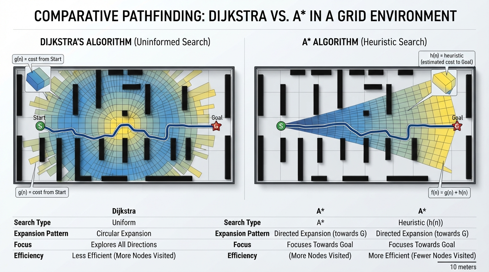
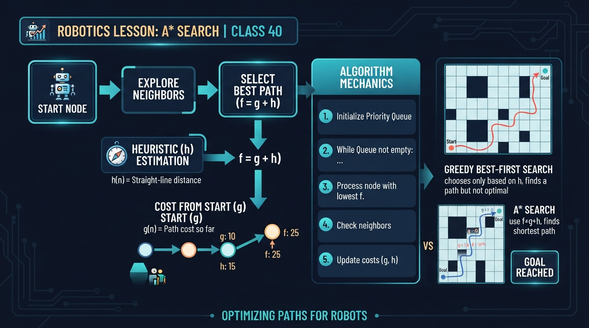
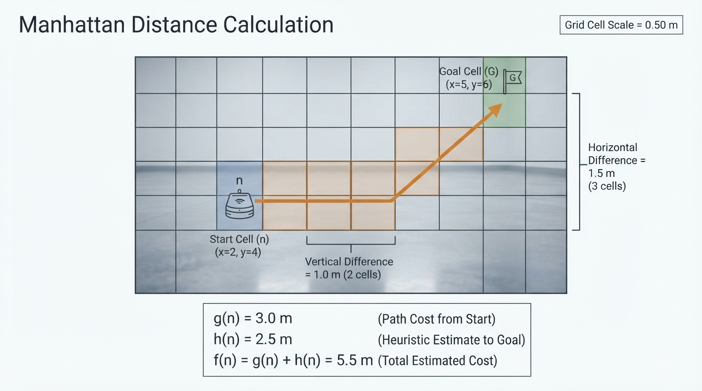
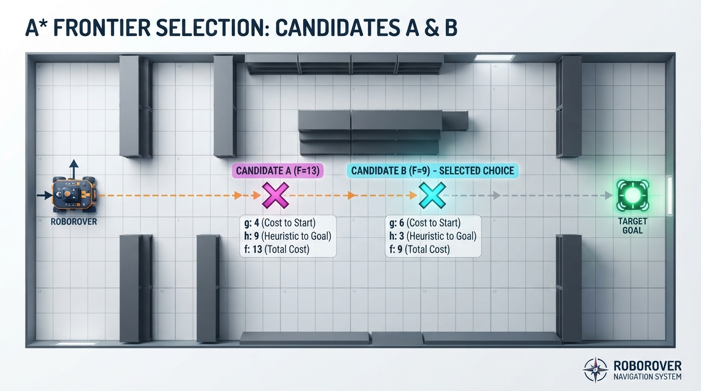
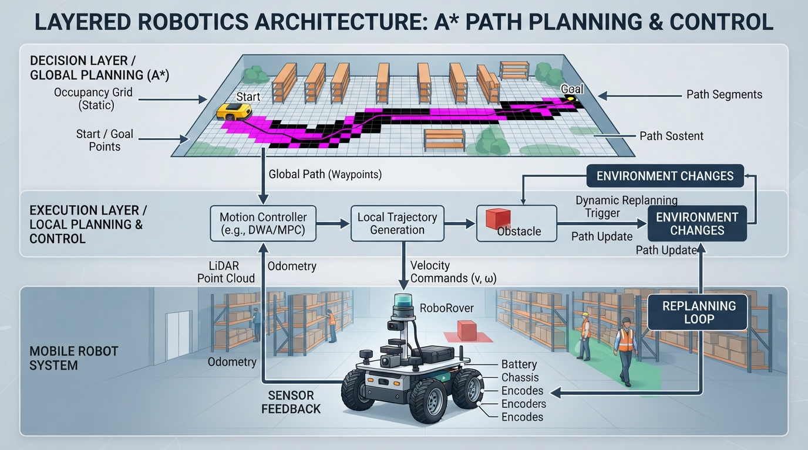

# Class 40: A* Search

## Where We Are in the Robotics Journey

RoboRover has learned how to find a shortest route through a grid using **Dijkstra’s algorithm**. Dijkstra’s method is reliable because it explores outward from the start in order of known travel cost.

However, Dijkstra’s algorithm does not know which direction the goal lies in. If RoboRover is in a large warehouse and the destination is far to the east, Dijkstra may explore many equally expensive locations to the north and south before reaching it.

Today we add a useful question:

> “Based on what I know so far, which location seems most promising?”

That extra guidance comes from a **heuristic**. The resulting algorithm is called **A\* search**, pronounced “A-star.”

A\* connects directly to the previous class:

- **Dijkstra:** choose the location with the smallest known cost so far.
- **A\*:** choose the location with the smallest known cost so far plus an estimate of the remaining cost.

Next class, we will study **potential fields**, another way to create a direction toward a goal. Potential fields feel more like a virtual slope that RoboRover follows, while A\* searches through possible routes on a map.

## Today We Will Learn

By the end of this class, you should be able to:

1. Explain what a heuristic is.
2. Calculate the A\* score:
   \[
   f(n)=g(n)+h(n)
   \]
3. Explain why a useful heuristic must not pretend the goal is closer than it really can be.
4. Use Manhattan distance as a heuristic for a four-direction grid.
5. Understand why A\* can inspect fewer locations than Dijkstra while still finding an optimal route.
6. Recognize practical problems caused by inaccurate maps, changing obstacles, and poorly chosen heuristics.

## 2-Minute Recap

In Dijkstra’s algorithm, each map location is a **node**. A legal movement between neighboring locations is an **edge**.

Suppose moving one grid cell costs \(1\) unit. Dijkstra stores:

- the best known cost from the start to each location;
- the locations still waiting to be explored;
- the previous location used to reconstruct the final route.

Dijkstra always expands the location with the smallest known cost from the start.

If \(g(n)\) is the known cost from the start to location \(n\), Dijkstra chooses the smallest \(g(n)\).

That is safe, but it can be curious rather than intelligent: it spreads outward in many directions.

## The Big Idea




**Figure:** Dijkstra uses known cost alone; A* also uses an estimate of distance to the goal.

Imagine searching for RoboRover in a dark building.

Dijkstra says:

> “I will investigate every reachable place in order of walking distance from the entrance.”

A\* says:

> “I will investigate places that are both cheap to reach and likely to be near RoboRover’s destination.”

The second part is the **heuristic**.

A heuristic is an estimate. It is not a measurement of the true remaining route cost. It is an informed guess based on the map and movement rules.

For a grid where RoboRover can move only north, south, east, or west, a natural estimate is:

\[
h(n)=|x_n-x_G|+|y_n-y_G|
\]

This is called **Manhattan distance**, because it resembles traveling along city blocks rather than cutting diagonally through buildings.

A\* combines the two quantities:

\[
f(n)=g(n)+h(n)
\]

- \(g(n)\): known cost from the start to node \(n\)
- \(h(n)\): estimated cost from \(n\) to the goal
- \(f(n)\): estimated total route cost through \(n\)

A\* expands the node with the smallest \(f(n)\).

## See It in Your Head

### AI-Generated Engineering Visual · Professor OS



**How to read this visual:** Trace the signal or idea from left to right. Match each block to the lesson explanation, then predict what would change if one block produced a wrong value.


Picture a rectangular warehouse drawn as square cells.

- The start is a blue square at the upper-left.
- The goal is a red square at the lower-right.
- Shelves are black blocked cells.
- Open floor is pale gray.
- A planned path is a bright green line.

Now imagine two frontier cells:

- Cell A is close to RoboRover but points away from the goal.
- Cell B is slightly farther from RoboRover but points toward the goal.

Dijkstra compares only the cost already spent. A\* compares:

> travel already spent + estimated travel still required

An illustrator could show each frontier cell with a small label such as:

```text
g = 4 cells
h = 7 cells
f = 11 cells
```

The labels should make clear that \(g\) is not the same as \(h\). One is known travel; the other is prediction.

## Core Concept

### What makes a heuristic useful?

For A\* to guarantee a shortest path, the heuristic should be **admissible**.

An admissible heuristic never overestimates the true cheapest remaining cost.

For example, if the actual cheapest route from a cell to the goal costs at least \(8\) movement units, a heuristic value of \(5\) is safely optimistic. A heuristic value of \(12\) is too confident and may cause A\* to ignore the true best route.

Manhattan distance is admissible for a four-direction grid with equal movement costs because every horizontal or vertical difference requires at least that many moves. Obstacles can force extra movement, but they cannot make the route shorter than the coordinate difference.

### Why does A\* often inspect fewer cells?

Dijkstra knows only \(g(n)\). It treats all directions fairly.

A\* adds \(h(n)\), so nodes that are obviously far from the goal receive larger scores. They are less likely to be expanded early.

This does not mean A\* always expands dramatically fewer nodes. On a map with many equally good routes, or with a weak heuristic, A\* can behave much like Dijkstra.

### A heuristic is not a steering command

The heuristic does not directly turn the motors.

It helps select which map location to investigate next. After A\* produces a route, a separate motion controller must deal with:

- wheel speeds;
- turning;
- localization;
- stopping distance;
- wheel slip;
- real obstacles.

This distinction matters: **planning a route** and **controlling a robot along that route** are different tasks.

## Math Without Fear




**Figure:** The A* score adds measured travel so far to a lower-bound estimate of remaining travel.

Suppose RoboRover’s map cells are \(0.50\ \text{m}\) wide.

At location \(n\):

- the known route from the start has \(6\) cells;
- the goal is \(5\) horizontal-or-vertical cell differences away;
- movement is limited to north, south, east, and west.

Then:

\[
g(n)=6\text{ cells}\times0.50\ \frac{\text{m}}{\text{cell}}
=3.0\ \text{m}
\]

The Manhattan heuristic is:

\[
h(n)=5\text{ cells}\times0.50\ \frac{\text{m}}{\text{cell}}
=2.5\ \text{m}
\]

Therefore:

\[
f(n)=g(n)+h(n)
\]

\[
f(n)=3.0\ \text{m}+2.5\ \text{m}=5.5\ \text{m}
\]

Interpretation:

- RoboRover has already traveled \(3.0\ \text{m}\) to reach \(n\).
- At least \(2.5\ \text{m}\) more is required because of the coordinate separation.
- A\* ranks this candidate as having an estimated total cost of \(5.5\ \text{m}\).

The \(5.5\ \text{m}\) value is not necessarily the actual final route length. Obstacles may force detours, making the real route longer.

If diagonal movement were allowed and cost the same as a horizontal move, Manhattan distance would no longer be a safe estimate. The movement rules and the heuristic must agree.

## Worked Robotics Example




**Figure:** A* can prefer a slightly more expensive-to-reach cell when its estimated total route is better.

RoboRover must travel through a warehouse grid. Each open cell represents \(0.50\ \text{m}\) of floor. It can move one cell north, south, east, or west. A shelf blocks the direct route.

Consider two frontier cells:

| Cell | Known distance \(g\) | Manhattan estimate \(h\) | A\* score \(f\) |
|---|---:|---:|---:|
| A | \(4\) cells \(=2.0\ \text{m}\) | \(8\) cells \(=4.0\ \text{m}\) | \(6.0\ \text{m}\) |
| B | \(5\) cells \(=2.5\ \text{m}\) | \(3\) cells \(=1.5\ \text{m}\) | \(4.0\ \text{m}\) |

Dijkstra would prefer A because \(2.0\ \text{m}<2.5\ \text{m}\).

A\* prefers B because:

\[
4.0\ \text{m}<6.0\ \text{m}
\]

B has cost slightly farther behind RoboRover, but it is much better aligned with the destination.

Important detail: A\* is not blindly choosing the cell with the smallest \(h\). That would be a greedy strategy. It includes both the journey already taken and the estimated journey remaining.

## Python Lab

This program compares Dijkstra with A\* on a small warehouse map. The map uses:

- `.` for open floor;
- `#` for shelves;
- `S` for the start;
- `G` for the goal;
- `*` for the selected path.

The movement cost is \(1\) per grid cell. The code uses Manhattan distance only when the heuristic weight is `1.0`.

```python
import heapq
import itertools

GRID = [
    "..........",
    ".#######..",
    ".......#..",
    ".#######..",
    ".........."
]

START = (0, 0)
GOAL = (9, 4)
HEURISTIC_WEIGHT = 1.0


def inside(grid, x, y):
    return 0 <= y < len(grid) and 0 <= x < len(grid[0])


def open_cell(grid, x, y):
    return inside(grid, x, y) and grid[y][x] != "#"


def neighbors(grid, node):
    x, y = node
    directions = [(1, 0), (-1, 0), (0, 1), (0, -1)]

    for dx, dy in directions:
        next_x = x + dx
        next_y = y + dy
        if open_cell(grid, next_x, next_y):
            yield (next_x, next_y)


def manhattan(node, goal):
    return abs(node[0] - goal[0]) + abs(node[1] - goal[1])


def search(grid, start, goal, heuristic_weight):
    frontier = []
    counter = itertools.count()

    best_cost = {start: 0}
    came_from = {start: None}

    start_priority = heuristic_weight * manhattan(start, goal)
    heapq.heappush(frontier, (start_priority, next(counter), start))

    expanded = 0

    while frontier:
        priority, _, current = heapq.heappop(frontier)

        expected_priority = (
            best_cost[current]
            + heuristic_weight * manhattan(current, goal)
        )

        if priority != expected_priority:
            continue

        expanded += 1

        if current == goal:
            break

        for neighbor in neighbors(grid, current):
            new_cost = best_cost[current] + 1

            if neighbor not in best_cost or new_cost < best_cost[neighbor]:
                best_cost[neighbor] = new_cost
                came_from[neighbor] = current

                estimate = manhattan(neighbor, goal)
                next_priority = new_cost + heuristic_weight * estimate

                heapq.heappush(
                    frontier,
                    (next_priority, next(counter), neighbor)
                )

    if goal not in came_from:
        return None, None, expanded

    path = []
    current = goal

    while current is not None:
        path.append(current)
        current = came_from[current]

    path.reverse()
    return path, best_cost[goal], expanded


def draw_path(grid, path):
    picture = [list(row) for row in grid]

    for x, y in path:
        if (x, y) != START and (x, y) != GOAL:
            picture[y][x] = "*"

    picture[START[1]][START[0]] = "S"
    picture[GOAL[1]][GOAL[0]] = "G"

    for row in picture:
        print("".join(row))


def main():
    dijkstra_path, dijkstra_cost, dijkstra_expanded = search(
        GRID, START, GOAL, 0.0
    )

    astar_path, astar_cost, astar_expanded = search(
        GRID, START, GOAL, HEURISTIC_WEIGHT
    )

    assert dijkstra_path is not None
    assert astar_path is not None
    assert dijkstra_cost == len(dijkstra_path) - 1
    assert astar_cost == len(astar_path) - 1
    assert astar_cost == dijkstra_cost
    assert HEURISTIC_WEIGHT == 1.0

    print("Dijkstra cost:", dijkstra_cost, "cells")
    print("Dijkstra expanded:", dijkstra_expanded, "cells")
    print("A* cost:", astar_cost, "cells")
    print("A* expanded:", astar_expanded, "cells")
    print()
    print("A* path:")
    draw_path(GRID, astar_path)


if __name__ == "__main__":
    main()
```

Important lines:

- `best_cost` stores \(g(n)\), the cheapest known cost so far.
- `manhattan()` computes \(h(n)\).
- `next_priority = new_cost + ...` computes \(f(n)=g(n)+h(n)\).
- Setting `heuristic_weight` to `0.0` makes the search behave like Dijkstra.
- The assertions verify that both searches find paths with the same cost on this map.
- `draw_path()` turns the numerical result into something visible.

The program uses `heapq`, Python’s standard priority-queue tool. The extra counter gives every queue entry a stable tie-breaker when two priorities are equal.

## Mini Simulation or Game

Treat the map as RoboRover’s warehouse challenge.

Before running the program, make two predictions:

1. Will Dijkstra and A\* find paths with the same cost?
2. Which search will expand fewer cells on this particular map?

Then run the program with:

```text
HEURISTIC_WEIGHT = 1.0
```

Next, change it to:

```text
HEURISTIC_WEIGHT = 0.0
```

This removes the heuristic, so the search becomes Dijkstra-like.

Finally, try:

```text
HEURISTIC_WEIGHT = 2.0
```

This makes the goal estimate count twice as strongly. It may inspect fewer cells, but unlike the admissible `1.0` version, it is no longer guaranteed to find an optimal path on every map.

## What Should Happen?

For `HEURISTIC_WEIGHT = 1.0`:

- A\* and Dijkstra should produce paths with equal movement cost.
- The printed map should show a valid route from `S` to `G`.
- The program’s assertions should complete without an error.
- A\* may expand fewer cells, although the exact difference depends on tie-breaking and the map.

For `HEURISTIC_WEIGHT = 0.0`:

- A\*’s priority calculation becomes only \(g(n)\).
- Its behavior becomes Dijkstra-like.
- The optimal path cost remains unchanged.

For `HEURISTIC_WEIGHT = 2.0`:

- The path is still likely to be sensible.
- Optimality is no longer guaranteed by the usual admissible-heuristic argument.
- The search is behaving more like a speed-focused approximation.

Do not assume that “fewer expanded cells” automatically means “better.” In robotics, a slightly longer route may sometimes be acceptable if computation must finish quickly, but that is an engineering trade-off rather than a mathematical guarantee.

## Common Mistakes

### Mistake 1: Using only the heuristic

Choosing the smallest \(h(n)\) ignores the cost already spent. That is greedy search, not A\*.

### Mistake 2: Thinking the heuristic knows the real route

The heuristic estimates. It does not see every shelf, blocked corridor, or moving obstacle unless those facts are included in its calculation.

### Mistake 3: Using an overconfident heuristic

If \(h(n)\) regularly overestimates the remaining route, A\* may skip a route that is actually shorter.

### Mistake 4: Mismatching movement and heuristic

Manhattan distance is appropriate for four-direction movement with equal cell costs. It requires adjustment when:

- diagonal moves are allowed;
- terrain has different costs;
- the robot must rotate and turning has a cost;
- narrow passages impose additional motion constraints.

### Mistake 5: Treating a grid path as a motor command

A path through cell centers is a plan, not a guarantee that RoboRover’s body can follow it. The physical robot needs localization, collision clearance, and a motion controller.

## Try It Yourself

### Challenge

Modify the program so that moving through selected cells costs more than moving through ordinary floor.

For example, imagine a wet section of warehouse floor. RoboRover can cross it, but it should cost \(3\) movement units instead of \(1\).

Your search must then:

1. store the actual accumulated cost in `best_cost`;
2. calculate the new cost using the neighbor’s terrain cost;
3. keep the heuristic safely optimistic.

Do not change the heuristic to assume that every future cell is expensive. A safe basic heuristic can remain the ordinary Manhattan distance multiplied by the cheapest possible movement cost.

### Optional extension

Add a second movement mode that allows diagonal motion at cost \(1.4\). Decide which heuristic is appropriate and explain why ordinary Manhattan distance may no longer be the best choice.

## Quick Quiz

1. In A\*, what do \(g(n)\), \(h(n)\), and \(f(n)\) represent?

2. Why is Manhattan distance a suitable heuristic for four-direction movement on an equal-cost grid?

3. If a heuristic overestimates the remaining cost, what important guarantee can be lost?

4. Why is A\* not itself a wheel-speed controller?

## Answers

1. \(g(n)\) is the known cost from the start to node \(n\). \(h(n)\) is the estimated cost from \(n\) to the goal. \(f(n)=g(n)+h(n)\) is the estimated total route cost through \(n\).

2. Every horizontal or vertical coordinate difference requires at least that many four-direction moves. Obstacles may add cost but cannot make the route shorter, so the estimate does not overestimate.

3. The guarantee that A\* will find an optimal shortest path can be lost.

4. A\* creates a route through a map. It does not decide wheel speeds, motor currents, steering corrections, or how to compensate for physical motion errors.

## Real Robot Connection




**Figure:** A* plans a route, while a separate controller follows it and replans when reality differs from the map.

Suppose RoboRover’s map says a corridor is open. A\* may produce an excellent route on that map, but the real warehouse can differ:

- a pallet may have been moved;
- the map may be shifted by \(0.20\ \text{m}\);
- wheel slip may make the rover miss a planned cell center;
- the robot may have a turning radius larger than the grid assumes;
- a sensor may detect an unexpected person or cart.

A practical robot therefore uses A\* as part of a larger system:

1. build or receive a map;
2. plan a route with A\*;
3. follow the route using motion control;
4. detect whether the world still matches the map;
5. replan if necessary.

A heuristic can also include engineering realities. If turning is expensive, a planner may include orientation in the node state. Then “facing north at this cell” and “facing east at this cell” are different states because their future costs differ.

Next class, potential fields will offer a different planning idea: assign attractive influence to the goal and repulsive influence to obstacles. That approach can react smoothly to local geometry, but it can also become trapped in local minima. A\* searches discrete alternatives; potential fields create a continuous-looking direction.

## Vocabulary

**A\* search:** A graph-search algorithm that prioritizes nodes using \(f(n)=g(n)+h(n)\).

**Heuristic:** An estimate used to guide a search toward a goal.

**Admissible heuristic:** A heuristic that never overestimates the cheapest remaining cost.

**Node:** A state or location considered by a search algorithm.

**Cost \(g(n)\):** The known accumulated cost from the start to node \(n\).

**Heuristic estimate \(h(n)\):** The estimated cost from node \(n\) to the goal.

**Priority \(f(n)\):** The A\* value \(g(n)+h(n)\), used to decide which node to explore next.

**Manhattan distance:** The sum of horizontal and vertical coordinate differences, commonly used for four-direction grid movement.

**Path planning:** Choosing a route through possible robot states or locations.

**Replanning:** Computing a new route after the map, robot state, or environment changes.

## Further Learning

Useful search terms for continued study include:

- “A\* admissible heuristic robotics”
- “consistent heuristic graph search”
- “weighted A\* path planning”
- “grid path planning with terrain costs”
- “orientation-aware mobile robot planning”
- “A\* versus Dijkstra visualization”

When studying examples, always ask two questions:

1. What movement model does the algorithm assume?
2. Does the heuristic remain safe under that movement model?

## Next Class

In Class 41, **Potential Fields**, RoboRover will navigate using virtual attractive and repulsive influences:

- the goal pulls the rover forward;
- obstacles push it away;
- the resulting direction suggests where to move.

We will compare this continuous-looking method with today’s discrete A\* route search and examine a major failure mode: getting trapped away from the goal even when a valid route exists.
