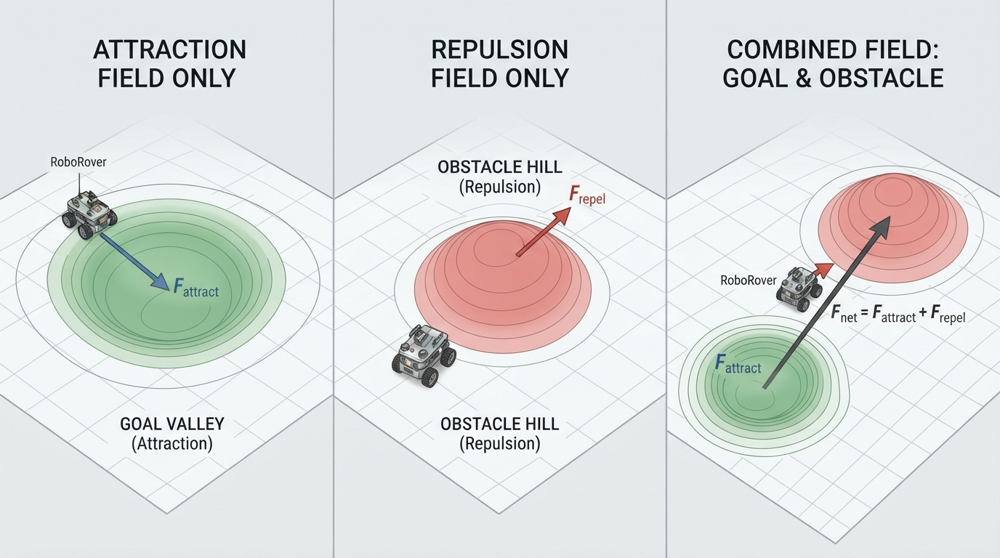
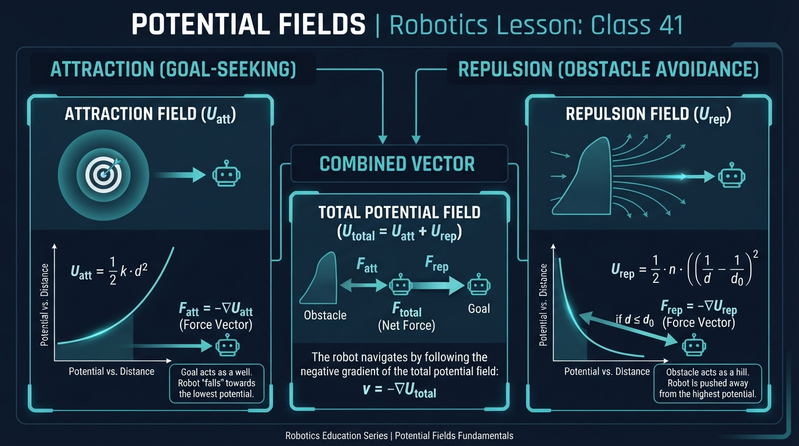
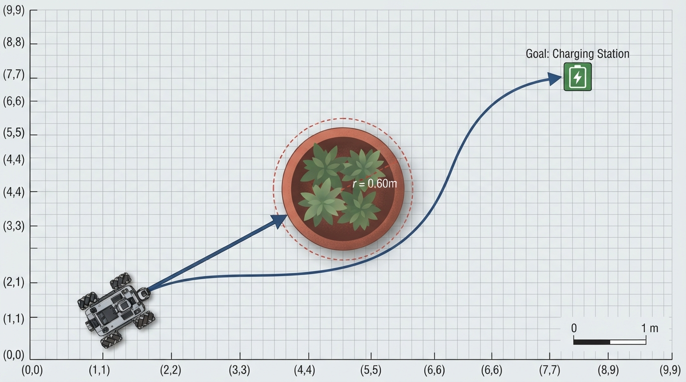
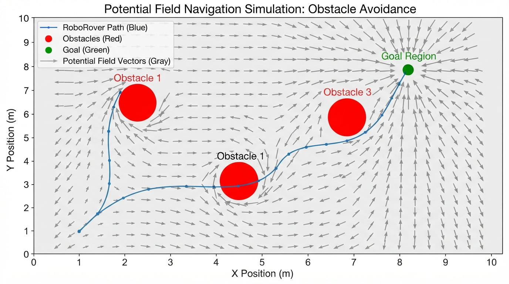
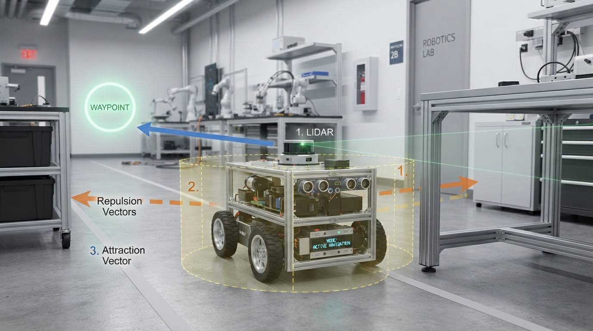

# Class 41: Potential Fields

## Where We Are in the Robotics Journey

RoboRover has just learned **A\* Search**, a planning method that explores a grid of possible positions and chooses a low-cost route to a goal. A\* is powerful because it can reason about a whole map before moving.

Today we study a different idea: **potential fields**. Instead of searching through a grid, RoboRover imagines that the goal pulls it forward while obstacles push it away. The robot repeatedly measures the local “push and pull,” then moves in the resulting direction.

This connects to A\* in an important way:

- **A\*** chooses a route through discrete map locations.
- **Potential fields** create a continuous local steering direction.

Neither method is automatically best. A\* can plan around difficult layouts but may require a map and computation. Potential fields can react smoothly to nearby obstacles but can become trapped in awkward places.

Next class, we will move from mobile robots to **robot arms**. Potential fields will return later as a useful way to think about motion in a robot arm’s space of possible positions.

## Today We Will Learn

By the end of this class, you should be able to:

1. Explain attraction toward a goal and repulsion from an obstacle.
2. Distinguish a scalar potential from the vector derived from it.
3. Calculate a simple combined force numerically.
4. Implement a two-dimensional potential-field simulation in Python.
5. Visualize a sampled vector field and a simulated trajectory.
6. Identify important failures such as local minima, oscillation, collisions, and force saturation.
7. Measure the clearance between a simulated path and modeled obstacles.
8. Explain why swept-segment collision checking is safer than checking only sampled positions.

## 2-Minute Recap

In A\* Search:

- A robot occupies a node or cell in a graph.
- Edges connect possible movements.
- Each movement has a cost.
- A\* combines the cost already traveled with an estimate of the remaining cost.

RoboRover’s A\* planner might produce a route such as:

```text
start → cell 1 → cell 2 → cell 3 → goal
```

A potential field does not initially give RoboRover a list of cells. Instead, every position has a numerical quantity called **potential**. The potential behaves like a landscape:

- A goal is a valley.
- An obstacle is a hill.
- RoboRover tries to move downhill.

The word “potential” comes from physics, but in robotics it is often an engineered mathematical tool rather than a claim that the robot is literally inside a physical force field.

## The Big Idea




**Figure:** The goal pulls RoboRover toward it, obstacles push it away, and vector addition gives the local steering direction.

Imagine RoboRover as a small metal ball on a landscape.

- The destination is at the bottom of a bowl.
- Each obstacle is surrounded by a hill.
- RoboRover rolls downhill toward the goal but away from obstacles.

The robot combines these influences.

```text
                         obstacle
                           ▲
                       repulsive hill
                         /       \
                        /         \

 RoboRover ●  ───────────────→      ○ goal
             attraction toward goal
```

The goal creates **attraction**. The obstacle creates **repulsion**. At RoboRover’s current position, these influences become vectors—arrows with direction and size.

The robot adds the vectors:

```text
net direction = attraction vector + repulsion vector
```

More precisely, the attractive and repulsive **scalar potentials** are summed into one total scalar potential:

\[
U_{\text{total}}(\mathbf{q})
=
U_{\text{att}}(\mathbf{q})
+
\sum_i U_{\text{rep},i}(\mathbf{q}).
\]

The total steering force is the negative gradient of that total potential:

\[
\mathbf{F}_{\text{total}}
=
-\nabla U_{\text{total}}
=
\mathbf{F}_{\text{att}}
+
\sum_i\mathbf{F}_{\text{rep},i}.
\]

In plain language, the robot moves in the direction in which the combined mathematical landscape decreases most rapidly.

Then it moves a short distance in the net direction, senses again, recalculates, and repeats.

This is a **local steering method**. RoboRover does not necessarily understand the complete best route. It responds to the shape of the potential landscape near its current location.

## See It in Your Head

### AI-Generated Engineering Visual · Professor OS



**How to read this visual:** Trace the signal or idea from left to right. Match each block to the lesson explanation, then predict what would change if one block produced a wrong value.


Picture a top-down arena:

- RoboRover is a blue circle near the lower-left corner.
- The goal is a green target near the upper-right corner.
- A circular obstacle sits between them.
- Thin arrows point toward the goal.
- Around the obstacle, arrows point outward.
- Near the obstacle boundary, outward arrows become longer.
- The actual path may bend around the obstacle because the combined arrows no longer point directly at the goal.

In this lesson, the red circles are modeled as circular obstacles with radius. This is different from treating an obstacle as a mathematical point: the robot must maintain clearance from the circle’s boundary.

For a robot with a nonzero footprint, a useful first approximation is **obstacle inflation**. Increase the modeled obstacle radius by the rover’s approximate radius and an additional safety margin:

\[
r_{\text{model}}
=
r_{\text{obstacle}}
+
r_{\text{rover}}
+
r_{\text{safety}}.
\]

Then a point-rover simulation can represent the center of the real rover while the inflated obstacle represents the space that the rover must not enter. This is an approximation, not a replacement for verified collision geometry.

An illustrator could show three separate panels:

1. **Attraction only:** every arrow points toward the goal.
2. **Repulsion only:** arrows point away from the obstacle.
3. **Combined field:** arrows curve around the obstacle, and a RoboRover path follows the changing net direction.

The arrows should be drawn at sample positions on a grid. Their lengths should be capped or normalized visually so that one arrow near an obstacle does not cover the whole diagram. Therefore, arrow lengths in the vector-field plot are for readability and do not necessarily represent force magnitude.

## Core Concept

### Attraction

A simple attractive potential grows with squared distance from the goal:

\[
U_{\text{att}}(\mathbf{q}) =
\frac{1}{2} k_{\text{att}} \|\mathbf{q}-\mathbf{g}\|^2
\]

where:

- \(U_{\text{att}}\) is attractive potential, measured in joules (J) in this teaching model;
- \(\mathbf{q}\) is RoboRover’s position, measured in meters (m);
- \(\mathbf{g}\) is the goal position, measured in meters (m);
- \(k_{\text{att}}\) is the attraction constant, measured in newtons per meter (N/m);
- \(\|\mathbf{q}-\mathbf{g}\|\) is the distance from RoboRover to the goal, measured in meters.

The associated attractive force is:

\[
\mathbf{F}_{\text{att}} =
-k_{\text{att}}(\mathbf{q}-\mathbf{g})
\]

The minus sign means “point toward the goal,” because the force points downhill in potential.

### Repulsion

In this lesson, each obstacle is a circle with center \(\mathbf{o}\) and modeled radius \(r\). Let

\[
\rho=\|\mathbf{q}-\mathbf{o}\|
\]

be the distance from RoboRover to the obstacle center. The clearance from RoboRover to the obstacle boundary is

\[
d=\rho-r.
\]

The obstacle is considered collided with when \(d\leq 0\). Outside the obstacle, a common repulsive potential is active only within an influence distance \(d_0\):

\[
U_{\text{rep}} =
\begin{cases}
\frac{1}{2}k_{\text{rep}}
\left(\frac{1}{d}-\frac{1}{d_0}\right)^2,
& 0<d<d_0 \\[6pt]
0, & d\geq d_0
\end{cases}
\]

At \(d\leq 0\), the simulation reports a collision rather than evaluating the singular expression.

For \(0<d<d_0\), the repulsive force is:

\[
\mathbf{F}_{\text{rep}}
=
k_{\text{rep}}
\left(\frac{1}{d}-\frac{1}{d_0}\right)
\frac{\mathbf{q}-\mathbf{o}}{\rho d^2}
\]

The factor \((\mathbf{q}-\mathbf{o})/\rho\) is the unit vector from the obstacle center toward RoboRover, so the force points away from the obstacle.

The total scalar potential is the attractive potential plus the repulsive potential from every obstacle:

\[
U_{\text{total}}
=
U_{\text{att}}
+
\sum_i U_{\text{rep},i}.
\]

The total steering force is the negative gradient of that sum:

\[
\mathbf{F}_{\text{total}}
=
-\nabla U_{\text{total}}
=
\mathbf{F}_{\text{att}}
+
\sum_i \mathbf{F}_{\text{rep},i}.
\]

The summation symbol means that RoboRover adds the repulsion from every nearby obstacle.

These potentials are often called **artificial potential functions**. Although the units in this lesson are chosen so that the equations can be expressed using force-like quantities and joules, a robotics potential function need not represent literal mechanical energy stored in a physical system. Its coefficients and units may instead be engineering choices for generating a useful steering command.

This circular-obstacle model is still a simplified abstraction. A real robot generally receives sensor measurements such as ranges or point clouds rather than exact obstacle centers and radii.

## Math Without Fear

Suppose RoboRover is at:

\[
\mathbf{q}=(1,0)\text{ m}
\]

The goal is:

\[
\mathbf{g}=(4,0)\text{ m}
\]

There is one circular obstacle with center:

\[
\mathbf{o}=(2,0)\text{ m}
\]

and radius:

\[
r=0.25\text{ m}.
\]

Use:

\[
k_{\text{att}}=1\text{ N/m}
\]

\[
k_{\text{rep}}=2\text{ N m}^3
\]

\[
d_0=1.5\text{ m}.
\]

The attraction force is:

\[
\mathbf{F}_{\text{att}}
=
-1\frac{\text{N}}{\text{m}}
\left((1,0)-(4,0)\right)\text{m}
\]

\[
\mathbf{F}_{\text{att}}=(3,0)\text{ N}
\]

So the goal pulls RoboRover to the right with a force of \(3\text{ N}\).

The distance to the obstacle center is:

\[
\rho=\|(1,0)-(2,0)\|\text{ m}=1\text{ m}.
\]

The clearance from RoboRover to the obstacle boundary is:

\[
d=\rho-r=1-0.25=0.75\text{ m}.
\]

Because \(0.75\text{ m}<1.5\text{ m}\), repulsion is active.

The repulsive force is directed left. Its magnitude is:

\[
2\text{ N m}^3
\left(\frac{1}{0.75\text{ m}}-\frac{1}{1.5\text{ m}}\right)
\frac{1}{(0.75\text{ m})^2}
\]

\[
=
2\left(\frac{4}{3}-\frac{2}{3}\right)
\frac{1}{0.5625}\text{ N}
\approx 2.37\text{ N}.
\]

Therefore:

\[
\mathbf{F}_{\text{rep}}\approx(-2.37,0)\text{ N}
\]

and

\[
\mathbf{F}_{\text{total}}
=
(3,0)+(-2.37,0)
\approx(0.63,0)\text{ N}.
\]

RoboRover still moves right in this particular calculation, but the obstacle nearly cancels the attraction. A small change in position, parameters, or the presence of another obstacle could change the direction.

In an actual mobile robot, we often use the resulting vector to choose a heading and speed rather than treating it as a literal mechanical force.

## Worked Robotics Example




**Figure:** RoboRover initially follows the goal direction, then bends when the obstacle enters its influence distance.

RoboRover is inspecting a greenhouse floor. Its target is a charging marker near the far wall. A large plant container occupies part of the direct route.

Use a simplified two-dimensional model:

- RoboRover starts at \((1,1)\text{ m}\).
- The goal is at \((8,7)\text{ m}\).
- The plant container has center \((4,4)\text{ m}\) and modeled radius \(0.60\text{ m}\).
- The obstacle influence distance is \(2\text{ m}\).

The attractive vector is:

\[
\mathbf{F}_{\text{att}}
=
(8-1,\;7-1)
=
(7,6)
\]

This vector points northeast.

The distance to the obstacle center is:

\[
\rho=\sqrt{(1-4)^2+(1-4)^2}
=\sqrt{18}
\approx4.24\text{ m}.
\]

The clearance from the obstacle boundary is:

\[
d=\rho-0.60\approx3.64\text{ m}.
\]

Since \(3.64\text{ m}>2\text{ m}\), the obstacle produces no repulsion in this simplified model. RoboRover initially heads almost directly toward the goal.

Later, suppose RoboRover reaches \((3,3)\text{ m}\). Then:

\[
\rho=\sqrt{(3-4)^2+(3-4)^2}
=\sqrt{2}
\approx1.41\text{ m}
\]

and the clearance is:

\[
d\approx1.41-0.60=0.81\text{ m}.
\]

Now the obstacle is inside the influence distance. Repulsion becomes active and pushes RoboRover away from the container. The net direction may bend around it.

This is the key operational pattern:

1. Measure current position and obstacle information.
2. Compute attraction toward the goal.
3. Compute repulsion from nearby obstacle boundaries.
4. Add the vectors.
5. Check the current position and the entire proposed motion segment for collision or unsafe clearance.
6. Move a limited step.
7. Repeat.

The method is reactive, so if a new obstacle appears in the sensor data, RoboRover can respond without rebuilding an entire global route. Exact obstacle coordinates in this example are a conceptual abstraction, not a substitute for real sensor processing.

## Python Lab




**Figure:** The simulation visualizes a sampled vector field, repeated local force calculation, and kinematic motion steps.

**Safety note:** This simulation is an educational model, not a validated collision-avoidance controller. Do not transfer it to a physical robot without independent safety systems, verified sensing, command limits, collision detection, and testing in a controlled environment.

The following Python 3.7 program:

- models obstacles as circles with radius;
- computes a sampled vector field on a grid;
- draws the field with arrows;
- simulates a fixed-step kinematic controller;
- checks the entire segment from the current position to each candidate position for collisions;
- reports why the simulation stopped;
- reports the minimum clearance along the swept path.

Checking only the candidate endpoint is insufficient: a large step could jump from one side of an obstacle to the other without the endpoint being inside the obstacle. The swept-segment check tests the closest point on the complete straight-line segment between the two positions.

The program normalizes the net vector before moving. Therefore, in the default controller, changing force magnitudes primarily changes the **heading**, not the commanded step length. The parameters do not represent a full force-based dynamic simulation. An optional speed-scaling controller would be a separate extension.

```python
import math
import numpy as np
import matplotlib.pyplot as plt


def attractive_force(position, goal, k_att):
    """Return attraction toward the goal."""
    return k_att * (goal - position)


def repulsive_force(position, obstacle, radius, k_rep,
                    influence_distance):
    """
    Return (force, collision).

    Obstacles are circular. The force uses clearance from the
    obstacle boundary, not distance from the obstacle center.
    """
    offset = position - obstacle
    center_distance = np.linalg.norm(offset)

    if center_distance <= radius:
        return np.zeros(2), True

    clearance = center_distance - radius

    if clearance >= influence_distance:
        return np.zeros(2), False

    factor = k_rep * (
        1.0 / clearance - 1.0 / influence_distance
    )

    unit_away = offset / center_distance
    force = factor * unit_away / (clearance ** 2)
    return force, False


def total_force(position, goal, obstacles, obstacle_radius,
                k_att, k_rep, influence_distance):
    force = attractive_force(position, goal, k_att)

    for obstacle in obstacles:
        obstacle_force, collision = repulsive_force(
            position, obstacle, obstacle_radius, k_rep,
            influence_distance
        )

        if collision:
            return np.zeros(2), True

        force += obstacle_force

    return force, False


def point_to_segment_distance(point, segment_start, segment_end):
    """Return the minimum distance from a point to a line segment."""
    segment = segment_end - segment_start
    segment_length_squared = np.dot(segment, segment)

    if segment_length_squared == 0.0:
        return np.linalg.norm(point - segment_start)

    projection = np.dot(point - segment_start, segment)
    parameter = projection / segment_length_squared
    parameter = min(1.0, max(0.0, parameter))

    closest_point = segment_start + parameter * segment
    return np.linalg.norm(point - closest_point)


def segment_clearance(segment_start, segment_end, obstacles,
                      obstacle_radius):
    """
    Return the minimum boundary clearance along one motion segment.

    A value <= 0 means that the segment intersects or touches a
    modeled circular obstacle.
    """
    if len(obstacles) == 0:
        return float("inf")

    clearances = []

    for obstacle in obstacles:
        center_distance = point_to_segment_distance(
            obstacle, segment_start, segment_end
        )
        clearances.append(center_distance - obstacle_radius)

    return min(clearances)


def minimum_clearance(path, obstacles, obstacle_radius):
    """
    Return the smallest boundary clearance along the swept path.

    This checks both path points and every segment between consecutive
    path points, so a large step cannot hide an intersection.
    """
    if len(obstacles) == 0:
        return float("inf")

    clearances = []

    for position in path:
        for obstacle in obstacles:
            center_distance = np.linalg.norm(position - obstacle)
            clearances.append(center_distance - obstacle_radius)

    for index in range(len(path) - 1):
        clearances.append(
            segment_clearance(
                path[index], path[index + 1],
                obstacles, obstacle_radius
            )
        )

    return min(clearances)


def simulate(start, goal, obstacles, obstacle_radius=0.45,
             steps=500, step_size=0.08, k_att=1.0, k_rep=0.12,
             influence_distance=1.8, goal_tolerance=0.12,
             force_tolerance=1e-9):
    position = start.copy()
    path = [position.copy()]
    termination_reason = "maximum_steps"

    for _ in range(steps):
        if np.linalg.norm(goal - position) <= goal_tolerance:
            termination_reason = "reached_goal"
            break

        force, collision = total_force(
            position, goal, obstacles, obstacle_radius,
            k_att, k_rep, influence_distance
        )

        if collision:
            termination_reason = "collision"
            break

        force_size = np.linalg.norm(force)

        # A near-zero force is treated as a local-minimum or
        # stalled-controller condition. Normalizing such a vector
        # would amplify numerical noise into an arbitrary heading.
        if force_size < force_tolerance:
            termination_reason = "near_zero_net_force"
            break

        # Kinematic controller:
        # force magnitude sets direction, while step_size sets
        # the distance traveled during this update.
        direction = force / force_size
        candidate = position + step_size * direction

        # Swept collision check: test the complete segment from the
        # current position to the candidate, not only the endpoint.
        candidate_clearance = segment_clearance(
            position, candidate, obstacles, obstacle_radius
        )

        position = candidate
        path.append(position.copy())

        if candidate_clearance <= 0.0:
            termination_reason = "collision"
            break

    else:
        termination_reason = "maximum_steps"

    if (termination_reason != "collision" and
            np.linalg.norm(goal - position) <= goal_tolerance):
        termination_reason = "reached_goal"

    return np.array(path), termination_reason


def field_vector(position, goal, obstacles, obstacle_radius,
                 k_att, k_rep, influence_distance):
    """Return a field vector, with zero inside a modeled obstacle."""
    force, collision = total_force(
        position, goal, obstacles, obstacle_radius,
        k_att, k_rep, influence_distance
    )

    if collision:
        return np.zeros(2)

    return force


def draw_circle(axis, center, radius, color, label=None):
    angles = np.linspace(0.0, 2.0 * math.pi, 100)
    x_values = center[0] + radius * np.cos(angles)
    y_values = center[1] + radius * np.sin(angles)
    axis.plot(
        x_values, y_values, color=color, linewidth=2.0,
        label=label
    )


def draw_vector_field(axis, goal, obstacles, obstacle_radius,
                      k_att, k_rep, influence_distance):
    x_values = np.linspace(0.4, 9.0, 20)
    y_values = np.linspace(0.4, 9.0, 20)
    grid_x, grid_y = np.meshgrid(x_values, y_values)

    vector_x = np.zeros_like(grid_x)
    vector_y = np.zeros_like(grid_y)

    for row in range(grid_x.shape[0]):
        for column in range(grid_x.shape[1]):
            position = np.array([
                grid_x[row, column],
                grid_y[row, column]
            ])

            vector = field_vector(
                position, goal, obstacles, obstacle_radius,
                k_att, k_rep, influence_distance
            )

            magnitude = np.linalg.norm(vector)

            if magnitude > 0.0:
                # Normalize for readable arrows. This is a display
                # choice and does not change the simulation. Arrow
                # lengths therefore do not represent force magnitude.
                vector_x[row, column] = vector[0] / magnitude
                vector_y[row, column] = vector[1] / magnitude

    axis.quiver(
        grid_x, grid_y, vector_x, vector_y,
        color="gray", alpha=0.55, angles="xy",
        scale_units="xy", scale=9.0, width=0.002
    )


def main():
    start = np.array([0.8, 0.8], dtype=float)
    goal = np.array([8.5, 8.0], dtype=float)

    obstacles = np.array([
        [3.2, 3.4],
        [5.3, 5.4],
        [5.5, 2.5]
    ], dtype=float)

    obstacle_radius = 0.45

    path, termination_reason = simulate(
        start, goal, obstacles,
        obstacle_radius=obstacle_radius
    )

    assert path.ndim == 2
    assert path.shape[1] == 2
    assert len(path) >= 1
    assert termination_reason in (
        "reached_goal",
        "collision",
        "near_zero_net_force",
        "maximum_steps"
    )

    smallest_clearance = minimum_clearance(
        path, obstacles, obstacle_radius
    )

    # A reported collision must agree with the swept-path clearance.
    if termination_reason == "collision":
        assert smallest_clearance <= 0.0

    print("Simulation steps:", len(path) - 1)
    print("Termination reason:", termination_reason)
    print("Minimum swept boundary clearance (m):",
          round(smallest_clearance, 3))

    figure, axis = plt.subplots(figsize=(7, 7))

    draw_vector_field(
        axis, goal, obstacles, obstacle_radius,
        k_att=1.0, k_rep=0.12, influence_distance=1.8
    )

    axis.plot(
        path[:, 0], path[:, 1], color="blue",
        linewidth=2.0, label="RoboRover path"
    )
    axis.scatter(
        start[0], start[1], color="black", s=60,
        label="Start", zorder=3
    )
    axis.scatter(
        goal[0], goal[1], color="green", s=90,
        label="Goal", zorder=3
    )

    for index, obstacle in enumerate(obstacles):
        label = "Modeled obstacle" if index == 0 else None
        draw_circle(
            axis, obstacle, obstacle_radius,
            color="red", label=label
        )

    axis.set_xlim(0.0, 9.5)
    axis.set_ylim(0.0, 9.5)
    axis.set_aspect("equal", adjustable="box")
    axis.set_xlabel("x position (m)")
    axis.set_ylabel("y position (m)")
    axis.set_title("RoboRover: Potential-Field Vector Field and Path")
    axis.grid(True, alpha=0.3)
    axis.legend()
    plt.show()


if __name__ == "__main__":
    main()
```

Important lines:

- `repulsive_force` uses clearance from the circular obstacle boundary.
- A position at or inside an obstacle returns a collision status instead of a zero repulsive vector.
- `segment_clearance` checks the closest point on an entire motion segment.
- `simulate` checks the swept segment before accepting a collision-free step.
- `draw_vector_field` samples the vector field on a grid and draws normalized arrows with `quiver`.
- `direction = force / force_size` normalizes the net vector only after the force-tolerance check.
- `position = position + step_size * direction` moves RoboRover by a fixed kinematic step.
- `termination_reason` distinguishes reaching the goal, collision, a near-zero net vector, and exhausting the step limit.
- `minimum_clearance` measures the minimum clearance along both path points and connecting segments.
- The `assert` statements verify structural properties, permitted termination values, and consistency between a reported collision and the swept-path clearance.

The default parameter set is deterministic for the same Python, NumPy, and Matplotlib environment. The program itself reports whether that parameter set reaches the goal and the minimum swept clearance; students should use those printed diagnostics rather than infer safety from the plotted curve alone.

## Mini Simulation or Game

Try this experiment:

1. Run the program.
2. Record the printed termination reason and minimum swept boundary clearance.
3. Predict whether the path will pass to the left or right of the first obstacle.
4. Change the first obstacle from `[3.2, 3.4]` to `[3.2, 4.2]`.
5. Predict how the path and termination reason will change.
6. Run it again.
7. Increase `k_rep` from `0.12` to `0.30`.
8. Observe whether RoboRover takes a wider turn.

In this normalized kinematic controller, increasing `k_rep` changes the relative vector balance and therefore can change the heading. It does not directly increase the step length. To change the commanded distance per update, change `step_size`.

The reported minimum clearance is the minimum along the swept path segments, not merely the minimum distance at stored sample points. This distinction matters when `step_size` is large.

For a simple game, give yourself three goals:

- **Goal A:** reach the target.
- **Goal B:** avoid every modeled obstacle.
- **Goal C:** make the path short without causing a collision.

You may alter only one parameter at a time. This helps separate the effects of obstacle placement, repulsion strength, and step size.

## What Should Happen?

Before running the program, make these predictions:

1. If an obstacle is far outside the influence distance, it should not change the local force.
2. If `k_rep` increases, RoboRover may generally turn farther away from obstacles, although interactions among multiple obstacles can produce less intuitive paths.
3. If `step_size` increases, the path should use larger jumps. The swept-segment check may then detect a collision that endpoint-only checking would miss.
4. If an obstacle is placed directly between the start and goal, the path may bend, but this is not guaranteed. Depending on geometry and parameters, it can collide, oscillate, stop at a near-zero-net-force location, or reach the goal by going around the obstacle.

Test the fourth prediction by using a single obstacle centered near the straight line from start to goal. The following standalone experiment includes the small set of simulation functions it needs, because each fenced Python block must run independently.

```python
import numpy as np


def repulsive_force(position, obstacle, radius, k_rep,
                    influence_distance):
    offset = position - obstacle
    center_distance = np.linalg.norm(offset)

    if center_distance <= radius:
        return np.zeros(2), True

    clearance = center_distance - radius

    if clearance >= influence_distance:
        return np.zeros(2), False

    factor = k_rep * (
        1.0 / clearance - 1.0 / influence_distance
    )
    unit_away = offset / center_distance
    return factor * unit_away / (clearance ** 2), False


def total_force(position, goal, obstacles, obstacle_radius,
                k_att, k_rep, influence_distance):
    force = k_att * (goal - position)

    for obstacle in obstacles:
        obstacle_force, collision = repulsive_force(
            position, obstacle, obstacle_radius, k_rep,
            influence_distance
        )

        if collision:
            return np.zeros(2), True

        force += obstacle_force

    return force, False


def point_to_segment_distance(point, segment_start, segment_end):
    segment = segment_end - segment_start
    length_squared = np.dot(segment, segment)

    if length_squared == 0.0:
        return np.linalg.norm(point - segment_start)

    parameter = np.dot(point - segment_start, segment)
    parameter /= length_squared
    parameter = min(1.0, max(0.0, parameter))

    closest_point = segment_start + parameter * segment
    return np.linalg.norm(point - closest_point)


def segment_clearance(segment_start, segment_end, obstacles,
                      obstacle_radius):
    if len(obstacles) == 0:
        return float("inf")

    clearances = []

    for obstacle in obstacles:
        distance = point_to_segment_distance(
            obstacle, segment_start, segment_end
        )
        clearances.append(distance - obstacle_radius)

    return min(clearances)


def simulate(start, goal, obstacles, obstacle_radius=0.45,
             steps=500, step_size=0.08, k_att=1.0, k_rep=0.12,
             influence_distance=1.8, goal_tolerance=0.12,
             force_tolerance=1e-9):
    position = start.copy()
    path = [position.copy()]
    reason = "maximum_steps"

    for _ in range(steps):
        if np.linalg.norm(goal - position) <= goal_tolerance:
            reason = "reached_goal"
            break

        force, collision = total_force(
            position, goal, obstacles, obstacle_radius,
            k_att, k_rep, influence_distance
        )

        if collision:
            reason = "collision"
            break

        force_size = np.linalg.norm(force)

        if force_size < force_tolerance:
            reason = "near_zero_net_force"
            break

        candidate = position + step_size * force / force_size
        clearance = segment_clearance(
            position, candidate, obstacles, obstacle_radius
        )

        position = candidate
        path.append(position.copy())

        if clearance <= 0.0:
            reason = "collision"
            break

    else:
        reason = "maximum_steps"

    if (reason != "collision" and
            np.linalg.norm(goal - position) <= goal_tolerance):
        reason = "reached_goal"

    return np.array(path), reason


def minimum_clearance(path, obstacles, obstacle_radius):
    if len(obstacles) == 0:
        return float("inf")

    clearances = []

    for position in path:
        for obstacle in obstacles:
            clearances.append(
                np.linalg.norm(position - obstacle) - obstacle_radius
            )

    for index in range(len(path) - 1):
        clearances.append(
            segment_clearance(
                path[index], path[index + 1],
                obstacles, obstacle_radius
            )
        )

    return min(clearances)


start = np.array([0.8, 0.8], dtype=float)
goal = np.array([8.5, 8.0], dtype=float)

test_obstacles = np.array([
    [4.6, 4.4]
], dtype=float)

test_path, test_reason = simulate(
    start, goal, test_obstacles,
    obstacle_radius=0.45,
    k_rep=0.12,
    influence_distance=1.8
)

test_clearance = minimum_clearance(
    test_path, test_obstacles, 0.45
)

assert test_path.ndim == 2
assert test_path.shape[1] == 2
assert test_reason in (
    "reached_goal",
    "collision",
    "near_zero_net_force",
    "maximum_steps"
)

if test_reason == "collision":
    assert test_clearance <= 0.0

print("Direct-obstacle test:", test_reason)
print("Direct-obstacle minimum swept clearance:",
      round(test_clearance, 3), "m")
```

The exact outcome must be read from the run. A plotted curve is not by itself proof of safe navigation.

## Common Mistakes

### Mistake 1: Confusing potential with force

A potential is a scalar value at a location. A force is a vector derived from how potential changes with position.

A high hill does not automatically tell us the complete movement direction unless we know the slope around RoboRover.

### Mistake 2: Treating repulsion as a hard wall

Repulsion is usually a mathematical influence, not a guaranteed collision barrier. If the step is too large, RoboRover may cross an obstacle boundary before the force corrects its path. This lesson’s simulation checks the complete candidate segment, but the result is still not a complete physical collision model.

### Mistake 3: Confusing force magnitude with commanded speed

The simulation uses a normalized net vector:

```python
import numpy as np

force = np.array([3.0, 4.0])
position = np.array([1.0, 1.0])
step_size = 0.08

direction = force / np.linalg.norm(force)
position = position + step_size * direction

assert abs(np.linalg.norm(direction) - 1.0) < 1e-12
assert abs(np.linalg.norm(position - np.array([1.0, 1.0]))
           - step_size) < 1e-12

print("Direction:", direction)
print("Updated position:", position)
print("Verified movement distance:", step_size)
```

The net force determines the direction, while `step_size` determines the distance moved per update. This is a kinematic controller, not a force-based dynamics simulation. A real dynamic model would need mass, acceleration, velocity, actuator limits, and time steps.

### Mistake 4: Choosing an unlimited speed

A very strong force should not automatically make the motors command an impossible speed. Real systems limit velocity, acceleration, and turning rate. This is called **saturation**: the requested command exceeds what the hardware can produce.

### Mistake 5: Expecting a perfect global route

Potential fields can have **local minima**. A local minimum is a place where the combined force is zero or nearly zero even though RoboRover has not reached the goal.

For example, the repulsion from two obstacles may cancel the attraction toward the goal. RoboRover can stop there. The simulation reports this as `near_zero_net_force` when the computed force magnitude is below `force_tolerance`, whose default value is \(10^{-9}\) in the simulation’s force units.

A near-zero vector should not be normalized. Dividing by its tiny magnitude can magnify numerical noise and produce an arbitrary-looking heading.

### Mistake 6: Ignoring robot shape

A point robot might mathematically pass beside an obstacle while the actual chassis clips it. This lesson models obstacles as circles and checks clearance to their boundaries. A real implementation can inflate obstacle geometry by the robot footprint and a safety margin, but it would also need localization uncertainty and verified collision geometry.

### Mistake 7: Forgetting noisy and delayed sensing

Distance sensors may fluctuate. Computation and motor response take time. A robot that reacts to every tiny change may oscillate from side to side. Filtering, rate limits, and careful tuning are needed in real systems.

### Mistake 8: Treating exact obstacle coordinates as sensor data

The program receives obstacle centers and radii directly. A real robot usually receives sensor measurements and must detect, estimate, or track obstacle geometry. Sensor uncertainty can make the true clearance smaller than the simulated clearance.

## Try It Yourself

**Challenge:** Modify the program so RoboRover records the smallest boundary distance between its swept path and every obstacle.

For each path point or path segment, calculate:

\[
d_i=\|\mathbf{q}-\mathbf{o}_i\|-r
\]

where:

- \(d_i\) is the boundary clearance from the robot’s modeled point to obstacle \(i\), in meters;
- \(\mathbf{o}_i\) is the center of obstacle \(i\), in meters;
- \(r\) is the modeled obstacle radius, in meters.

The `minimum_clearance` function in the Python Lab already checks both stored path points and the segments between them. The essential point-to-segment calculation is:

```python
import numpy as np


def point_to_segment_distance(point, segment_start, segment_end):
    segment = segment_end - segment_start
    segment_length_squared = np.dot(segment, segment)

    if segment_length_squared == 0.0:
        return np.linalg.norm(point - segment_start)

    projection = np.dot(point - segment_start, segment)
    parameter = projection / segment_length_squared
    parameter = min(1.0, max(0.0, parameter))

    closest_point = segment_start + parameter * segment
    return np.linalg.norm(point - closest_point)
```

Verify the point-based part of the clearance calculation on a small known case:

```python
import numpy as np


def minimum_clearance(path, obstacles, obstacle_radius):
    clearances = []

    for position in path:
        for obstacle in obstacles:
            center_distance = np.linalg.norm(position - obstacle)
            clearances.append(center_distance - obstacle_radius)

    if not clearances:
        return float("inf")

    return min(clearances)


known_path = np.array([
    [0.0, 0.0],
    [2.0, 0.0]
])

known_obstacles = np.array([
    [1.0, 0.0]
])

known_clearance = minimum_clearance(
    known_path, known_obstacles, 0.25
)

assert abs(known_clearance - 0.75) < 1e-12
print("Verified point-sampled minimum clearance:",
      known_clearance, "m")
```

The known path has stored points one meter from the obstacle center. Subtracting the obstacle radius of \(0.25\text{ m}\) gives the verified boundary clearance of \(0.75\text{ m}\). A swept-path implementation should additionally check the segment between those points.

Do not yet add collision physics or a sophisticated planner. Concentrate on measuring what happened.

**Optional extension:** Add a safety warning if the smallest swept boundary clearance is less than \(0.50\text{ m}\):

```python
smallest_clearance = 0.42

if smallest_clearance < 0.50:
    print("Warning: swept boundary clearance is below 0.50 m.")
```

A warning is not the same as preventing a collision; it is a diagnostic that helps you evaluate the chosen parameters.

## Quick Quiz

1. What does attraction do in a potential-field navigation system?

2. Why does repulsion become stronger as RoboRover gets close to an obstacle boundary?

3. What is a local minimum, and why does the controller use a force tolerance?

4. How does potential-field steering differ from A\* Search?

5. In the Python simulation, what determines the movement step length after the net vector is calculated?

6. Why does the simulation check the segment between the current position and the candidate position?

## Answers

1. Attraction creates a vector pointing RoboRover toward the goal.

2. The repulsive term uses the boundary clearance \(d\). As \(d\) decreases toward zero, the reciprocal terms become large, so the obstacle contributes a stronger vector away from itself. The program stops with a collision status rather than evaluating the singular expression at or inside the obstacle.

3. A local minimum is a location where the combined potential slope is flat or the net force is nearly zero, even though the goal has not been reached. The force tolerance treats sufficiently small vectors as stalled behavior rather than normalizing numerical noise into an arbitrary direction.

4. A\* searches through a graph or grid to construct a route. Potential fields calculate a local direction from attraction and repulsion and repeatedly steer from the current position.

5. The normalized controller uses `step_size` as the movement distance. The net force determines the heading, while force magnitude does not directly determine the speed in this simulation.

6. Endpoint-only checking can miss a collision when a large step jumps across an obstacle. Swept-segment checking tests the entire straight-line motion between the two sampled positions.

## Real Robot Connection




**Figure:** A physical robot must combine potential-field steering with sensor uncertainty, speed limits, safety margins, and actuator constraints.

A real RoboRover would not usually know its exact position and every obstacle perfectly. Its sensors might provide noisy range measurements, and its wheels might slip.

A practical implementation therefore needs:

- a maximum speed and turning rate;
- inflated obstacle geometry or a safe distance around obstacles;
- filtering or averaging of noisy measurements;
- a method for escaping local minima;
- checks that the commanded path remains physically possible;
- emergency stopping behavior independent of the attractive goal;
- independent collision detection and safety systems.

Potential fields are especially useful as a **local obstacle-avoidance layer**. A global planner such as A\* might propose a broad route, while a local potential field adjusts the motion around newly detected objects.

This layered design is common engineering practice: one part thinks about the map, while another reacts to immediate conditions.

For robot arms, the same general idea can be applied differently. Instead of RoboRover’s \((x,y)\) floor position, an arm has joint angles and an end-effector position. A potential can attract the gripper toward a target while repelling the arm from obstacles. We will study the physical structure and motion of robot arms next class, without yet developing the full mathematics of arm kinematics.

## Vocabulary

- **Potential field:** A mathematical function that assigns a scalar potential to positions in a robot’s workspace. Goals and obstacles shape the potential landscape.
- **Artificial potential function:** An engineered mathematical potential used to generate a planning or steering signal; it need not represent literal mechanical energy.
- **Attraction:** An influence that creates a vector toward a desired goal.
- **Repulsion:** An influence that creates a vector away from an obstacle or unsafe region.
- **Workspace:** The physical region in which a robot or part of a robot can move.
- **Influence distance:** The distance within which an obstacle contributes repulsion.
- **Boundary clearance:** The distance from a position to the boundary of a modeled obstacle. For a circular obstacle, it is center distance minus obstacle radius.
- **Obstacle inflation:** Enlarging modeled obstacles to approximate the space occupied by a robot footprint and a safety margin.
- **Local minimum:** A location where the combined potential gives little or no useful direction toward the goal.
- **Force vector:** A direction-and-magnitude quantity used here to represent the slope-driven steering influence.
- **Kinematic controller:** A controller that directly updates position or velocity commands without simulating force, mass, and acceleration dynamics.
- **Saturation:** Limiting a requested command because a motor, actuator, or controller has a physical maximum.
- **Step size:** The distance RoboRover moves during one simulation update.
- **Swept-segment collision check:** A collision test that examines the complete motion segment between two positions rather than only its endpoints.

## Further Learning

To deepen this topic, investigate these search-friendly resources and subjects:

- “artificial potential field robot navigation”
- “gradient descent visualization”
- “local minima in mobile robot navigation”
- “obstacle inflation robot planning”
- “local planner versus global planner robotics”
- “potential fields in robot arm motion planning”

When studying examples, ask three questions:

1. What is the mathematical potential?
2. How is the steering vector calculated from it?
3. What happens when the ideal mathematical command exceeds the robot’s physical limits?

## Next Class

Next class is **Robot Arms**.

We will meet RoboRover’s workshop companion: a robotic arm that must move its gripper to a target. We will identify links, joints, actuators, and the end effector, then connect arm motion to the idea of a robot’s reachable workspace.

The potential-field idea will remain in the background: a target can attract the gripper, while obstacles can repel parts of the arm. First, however, we need to understand what the arm is physically made of and how its joints create motion.
