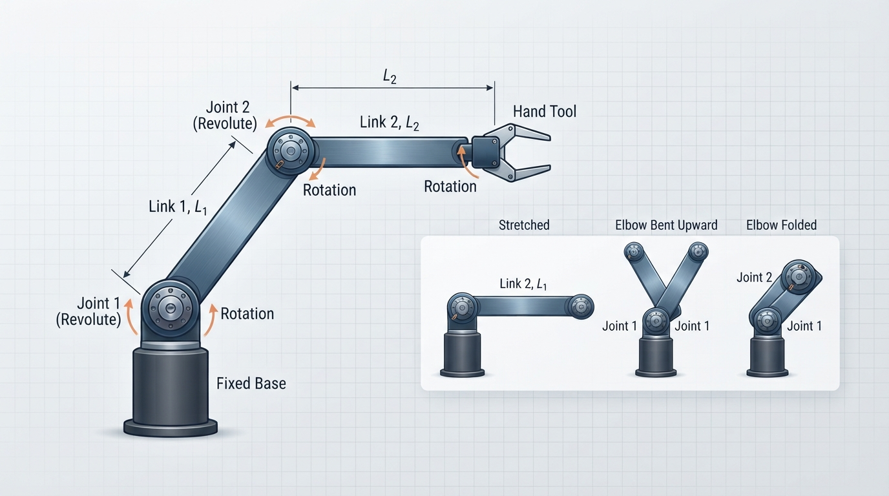
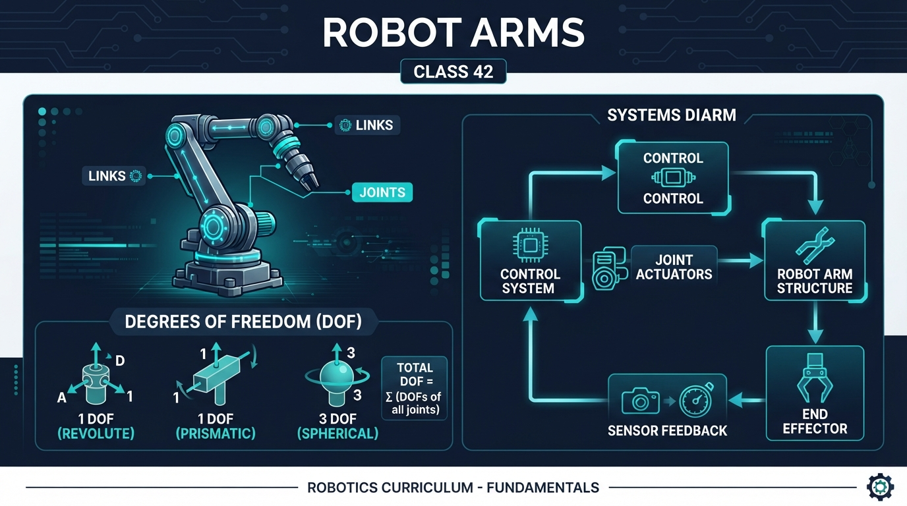
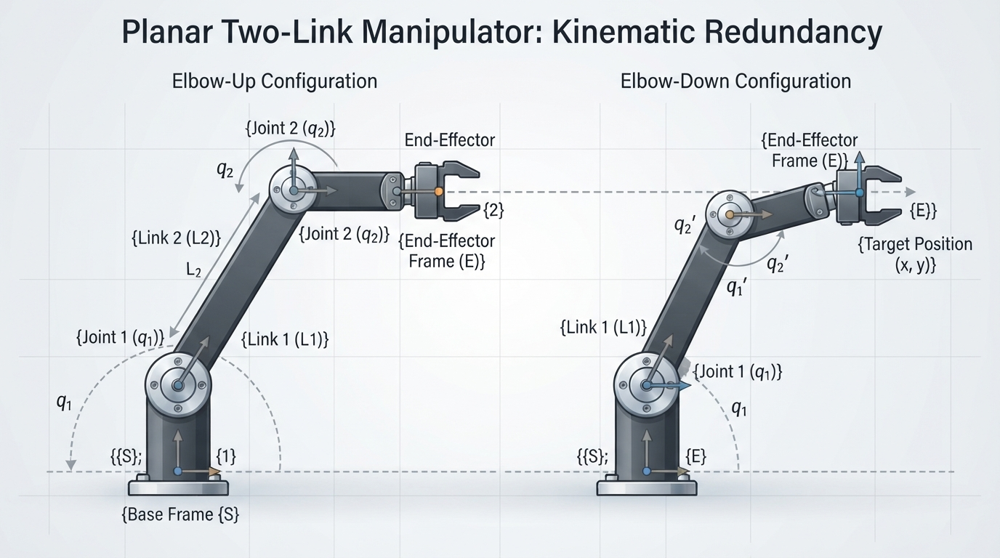
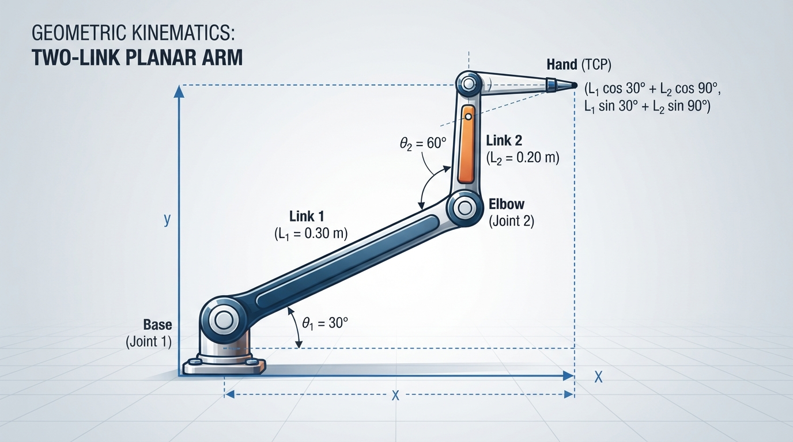
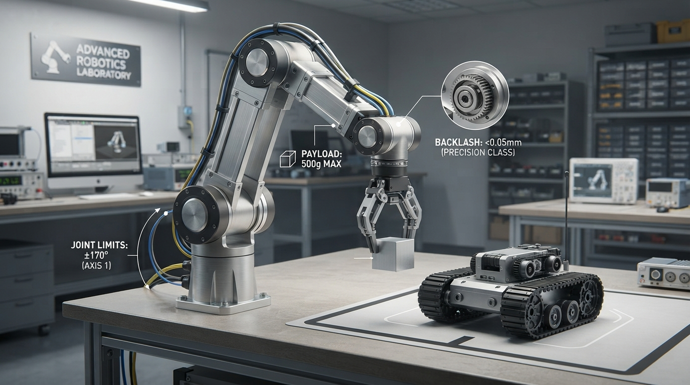

# Class 42: Robot Arms

## Where We Are in the Robotics Journey

RoboRover has mostly traveled across a surface. In the previous class, **Potential Fields**, we treated nearby obstacles and goals as influences that could push or pull the rover’s motion.

Now RoboRover gains a new ability: reaching and manipulating objects with an arm.

An arm does not move as one solid piece. It is built from connected rigid pieces that rotate or slide relative to one another. Understanding that structure is the foundation for later topics such as calculating an arm’s exact hand position, which is the subject of the next class, **Forward Kinematics**.

The key ideas today are:

- **Joints** connect moving parts and allow motion.
- **Links** are the rigid parts between joints.
- **Degrees of freedom**, or **DOF**, count independent ways the mechanism can move.

## Today We Will Learn

By the end of this class, you should be able to:

1. Identify joints and links in a robot arm.
2. Distinguish a rotating joint from the rigid link it moves.
3. Count the degrees of freedom in simple planar arms.
4. Explain why more DOF can increase reach and flexibility but also increase complexity.
5. Use joint angles and link lengths to sketch or simulate an arm.
6. Recognize practical limits such as joint stops, payload, backlash, and singular configurations.

## 2-Minute Recap

For this course, a robot is a physical machine commonly treated as a robot in engineering practice whose controlled actuators perform a physical task. Its immediate actions may be selected by a human operator, a preprogrammed controller, or autonomous software. This is a working description for teaching, not a universal necessary-and-sufficient test.

RoboRover’s wheel-drive motors or wheel-drive assemblies are actuators because they use electrical energy to produce controlled motion. The wheels themselves are mechanical outputs or transmission elements, not usually the actuators.

A **sensor** measures something. A controller uses measurements and goals to choose commands. In potential fields, a goal produced an attractive influence and obstacles produced repulsive influences. The resulting motion command was then applied to the rover.

For an arm, a high-level controller might command a desired tool position or path in task space. A motion-planning or intermediate control layer may calculate an appropriate trajectory and joint references, often using inverse kinematics. Lower-level joint controllers then track joint position, velocity, or torque references while using sensors to regulate the individual joints:

- rotate the shoulder joint,
- rotate the elbow joint,
- perhaps rotate a wrist joint,
- open or close a gripper.

The exact division of these functions varies between robot systems. A lower-level joint controller does not generally convert a desired tool position directly into motor commands by itself; planning, inverse kinematics, trajectory generation, and task-space control may occur in intermediate layers.

That change—from controlling wheel-drive motion to controlling connected joints—is the focus of this class.

## The Big Idea



**Figure:** The same links can form different arm configurations when the joint angles change.

Imagine a person reaching toward a cup.

Your upper arm and forearm are fairly rigid pieces. Your shoulder and elbow are joints. If your elbow could not bend, your hand would be restricted to a much smaller set of positions.

A robot arm works similarly:

```text
base --(joint)-- link 1 --(joint)-- link 2 --(joint)-- tool
```

The **base** is a structural support. It is not automatically a degree of freedom. The first revolute joint is the first counted DOF if it permits independent rotation.

The rigid pieces are **links**. The movable connections are **joints**. The tool at the end might be a gripper, suction cup, welding torch, or camera.

A joint is like a permission for motion. A revolute joint permits rotation around an axis. A prismatic joint permits sliding along an axis.

For this class, we will concentrate mainly on **planar revolute arms**: arms whose links move on a flat page and whose joints rotate.

A two-link planar arm might look like this:

```text
                 link 2
              ─────────────● hand
             /
            /
base ●─────
     joint 1       joint 2
```

The sketch is simplified. In a real arm, the first link rotates about the base joint, and the second link rotates about the elbow joint.

The arm’s shape is described by its **configuration**: the current values of its joint positions. For a two-revolute-joint arm, the configuration can be represented by two angles:

- shoulder angle: θ₁,
- elbow angle: θ₂.

Under the stated idealized model—planar motion, two independently actuated revolute joints, and no additional constraints—these are two independent movement choices, so the arm has **2 degrees of freedom**.

## See It in Your Head

### AI-Generated Engineering Visual · Professor OS



**How to read this visual:** First locate the base, joint centers, links, and hand or tool. Trace how a change at the base joint changes link 1, then how the elbow joint changes link 2 relative to link 1. Compare the labeled angles and coordinate directions with the equations below. Do not read it as a left-to-right signal-flow diagram; inspect it as a mechanical and geometric relationship.

**Text-only geometric description:** The base is at the origin. Link 1 extends from the base to the elbow. Link 2 extends from the elbow to the hand. The first angle sets link 1’s direction relative to the horizontal axis; the second angle changes link 2’s direction relative to link 1. The hand coordinates are found by adding the horizontal and vertical components of both links.



**Figure:** Different elbow arrangements can sometimes place the hand near the same location.

Picture RoboRover parked beside a table. Its arm has two links:

- Link 1 is 0.30 metres long.
- Link 2 is 0.20 metres long.

The first joint rotates link 1 around the arm’s base. The second joint changes the angle between link 1 and link 2.

Freeze the first joint. If only the second joint moves, the gripper travels along a circular arc around the elbow.

Now freeze the second joint and rotate the first. The entire two-link shape swings around the base.

Now allow both joints to move. The gripper can reach a broad region rather than a single circle. In the ideal unrestricted planar model, with both joints allowed unrestricted full rotation, two independently actuated revolute joints, no obstacles, and endpoint position as the quantity of interest, the position workspace is an annular region: the outer radius is \(L_1+L_2\), and the inner radius is \(\lvert L_1-L_2\rvert\). For these links, the outer radius is \(0.50\ \text{m}\) and the inner radius is \(0.10\ \text{m}\).

This statement concerns endpoint position, not a complete tool pose, and it does not account for collisions or whether a physical arm can safely move through every point in the region. Real hardware may have smaller or differently shaped reachable regions because of joint limits, obstacles, the table, tool geometry, and collision-avoidance requirements.

An illustrator should show three drawings of the same arm:

1. **Both links stretched forward**: maximum reach in that direction.
2. **Elbow bent sharply**: the hand is closer to the base.
3. **The elbow folded backward**: a different configuration may reach a similar hand location.

That last point is important: the same hand position can sometimes be reached with different joint arrangements. One configuration might place the elbow above the links; another might place it below. These are often called different **elbow-up** and **elbow-down** configurations.

The four local visuals have different jobs:

- `inline_01.png` emphasizes how one pair of links can form several configurations.
- `diagram.png` emphasizes the mechanical structure and the relationship between joints, links, angles, and coordinates.
- `inline_02.png` emphasizes configuration ambiguity: different elbow arrangements can produce similar hand positions.
- `inline_03.png` will apply the geometry numerically.
- `inline_04.png` will connect the ideal model to physical hardware constraints.

## Core Concept

### Joints

A **joint** is a mechanical connection that permits controlled relative motion.

Common robot-arm joints include:

| Joint type | Main motion | Everyday analogy |
|---|---|---|
| Revolute | Rotation around an axis | Door hinge |
| Prismatic | Straight-line sliding | Drawer rail |
| Spherical | Rotation in several directions | Human shoulder, as an introductory analogy |

A real spherical joint’s exact DOF depends on its mechanical constraints and actuation. A human shoulder is also not a simple mechanical spherical joint, so the analogy is only approximate.

A robot arm joint normally includes more than a hinge. It may contain a motor, gears, bearings, structural supports, a position sensor, and safety limits.

A revolute joint’s position is usually described by an angle. A prismatic joint’s position is described by a distance.

### Links

A **link** is a mostly rigid mechanical member between joints.

Links transfer forces and motion. Their length affects how far the tool can reach. Their mass affects how much effort the motors need.

RoboRover’s arm might use:

- a short, thick first link to support the arm,
- a lighter second link to reduce the load on the base,
- a gripper link or tool mount at the end.

Links are not perfectly rigid in reality. They can bend slightly under load. For introductory modeling, however, treating them as rigid is useful.

### Degrees of freedom

A **degree of freedom** is one independent coordinate needed to describe a system’s configuration.

For a planar arm:

- one rotating joint gives 1 DOF;
- two independently rotating joints give 2 DOF;
- three independently rotating joints give 3 DOF.

A two-joint arm can change its hand position in two planar directions: horizontal and vertical. A third wrist joint could change the tool’s orientation while leaving the **wrist pivot** location approximately unchanged. If the tool has a nonzero offset from that pivot, rotating the wrist can also move the tool tip.

DOF is not simply a count of motors. A motor may drive a joint, but mechanical couplings can make two motions dependent. Conversely, one joint may contain several coordinated actuators. In common introductory robotics usage, we count independent joint motions.

### Position versus orientation

A tool has a **position**: where it is.

It may also have an **orientation**: how it is rotated.

In a flat 2D drawing, a hand position needs two coordinates:

- horizontal coordinate \(x\),
- vertical coordinate \(y\).

A hand pointing direction adds another quantity: orientation angle \(\phi\).

Thus, in a plane, a tool pose often has three components: \(x\), \(y\), and \(\phi\). A two-DOF arm can usually control the hand position but cannot independently choose all three quantities at once. A third joint can provide extra orientation control.

This is one reason robot arms often have several joints even when the target location seems simple.

## Math Without Fear

Let a two-link planar arm have:

- first-link length \(L_1\) in metres,
- second-link length \(L_2\) in metres,
- first joint angle \(\theta_1\) in degrees,
- second joint angle \(\theta_2\) in degrees.

For the usual robot-arm convention, \(\theta_2\) is the angle of link 2 relative to link 1. Therefore, link 2’s absolute direction is:

\[
\theta_1+\theta_2
\]

The elbow position is:

\[
x_e = L_1\cos(\theta_1)
\]

\[
y_e = L_1\sin(\theta_1)
\]

The hand position is:

\[
x_h = L_1\cos(\theta_1)+L_2\cos(\theta_1+\theta_2)
\]

\[
y_h = L_1\sin(\theta_1)+L_2\sin(\theta_1+\theta_2)
\]

Here:

- \(x_e, y_e\) are elbow coordinates in metres;
- \(x_h, y_h\) are hand coordinates in metres;
- \(L_1, L_2\) are link lengths in metres;
- \(\theta_1, \theta_2\) are joint angles;
- \(\sin\) and \(\cos\) are trigonometric functions.

A programming detail matters: Python’s `math.sin()` and `math.cos()` expect angles in **radians**, not degrees. The program must convert degrees before calculating.

These equations are an early preview of forward kinematics. Next class, we will study the systematic process more carefully. Today, use them mainly to connect joint settings with the visible arm shape.

**Beginner check:** If \(\theta_1=30^\circ\) and \(\theta_2=-20^\circ\), what is the absolute direction of link 2?

\[
\theta_1+\theta_2=30^\circ-20^\circ=10^\circ
\]

So link 2 points \(10^\circ\) above the positive horizontal direction.

## Worked Robotics Example



**Figure:** The 30-degree first link and 60-degree relative elbow angle place the second link vertically.

RoboRover’s arm has:

- \(L_1 = 0.30\ \text{m}\),
- \(L_2 = 0.20\ \text{m}\),
- \(\theta_1 = 30^\circ\),
- \(\theta_2 = 60^\circ\).

The elbow position is:

\[
x_e = 0.30\cos(30^\circ)
\]

\[
y_e = 0.30\sin(30^\circ)
\]

Using approximate trigonometric values:

\[
x_e \approx 0.30(0.866)=0.260\ \text{m}
\]

\[
y_e \approx 0.30(0.500)=0.150\ \text{m}
\]

The second link’s absolute angle is:

\[
\theta_1+\theta_2=30^\circ+60^\circ=90^\circ
\]

So the hand position is:

\[
x_h = 0.30\cos(30^\circ)+0.20\cos(90^\circ)
\]

\[
y_h = 0.30\sin(30^\circ)+0.20\sin(90^\circ)
\]

Because \(\cos(90^\circ)=0\) and \(\sin(90^\circ)=1\):

\[
x_h \approx 0.260+0=0.260\ \text{m}
\]

\[
y_h \approx 0.150+0.200=0.350\ \text{m}
\]

**Interpretation:** the elbow is about 26 centimetres to the right and 15 centimetres above the base. The second link points straight upward, placing the hand about 26 centimetres right and 35 centimetres above the base.

The total stretched length is \(0.30+0.20=0.50\ \text{m}\), but the hand is not 0.50 metres from the base in this pose because the links point in different directions.

### Predict before running the code

For the worked pose \((\theta_1,\theta_2)=(30^\circ,60^\circ)\), complete this table before using Python:

| Point | Expected \(x\) coordinate (m) | Expected \(y\) coordinate (m) |
|---|---:|---:|
| Base | 0.000 | 0.000 |
| Elbow | approximately 0.260 | approximately 0.150 |
| Hand | approximately 0.260 | approximately 0.350 |

The code assertions below check these rounded predictions.

## Python Lab

This program draws RoboRover’s two-link arm in three configurations. It also calculates the elbow and hand coordinates and verifies the worked example against reference values rounded from the preceding calculation.

Python 3.7 or later and Matplotlib are required. If you cannot install Matplotlib, you can still run the `arm_points` calculations and assertion checks in a Python environment such as a school computer, an online Python notebook, or another provided coding environment; the plotted figure will simply be unavailable until Matplotlib is installed.

The important function, `arm_points`, converts joint angles from degrees to radians and returns the base, elbow, and hand positions. The plotting code connects those points with thick lines. It uses different line styles and markers as well as a legend, so the poses do not need to be distinguished by color alone.

```python
import math
import matplotlib.pyplot as plt


def arm_points(link1, link2, joint1_deg, joint2_deg):
    """Return base, elbow, and hand coordinates for a planar 2-link arm."""
    joint1_rad = math.radians(joint1_deg)
    joint2_rad = math.radians(joint2_deg)

    elbow_x = link1 * math.cos(joint1_rad)
    elbow_y = link1 * math.sin(joint1_rad)

    hand_angle_rad = joint1_rad + joint2_rad
    hand_x = elbow_x + link2 * math.cos(hand_angle_rad)
    hand_y = elbow_y + link2 * math.sin(hand_angle_rad)

    return (0.0, 0.0), (elbow_x, elbow_y), (hand_x, hand_y)


def close_enough(actual, expected, tolerance=1e-3):
    return abs(actual - expected) <= tolerance


link1 = 0.30
link2 = 0.20

# Verify the numerical example from the lesson against rounded reference values.
base, elbow, hand = arm_points(link1, link2, 30.0, 60.0)

expected_elbow = (0.260, 0.150)
expected_hand = (0.260, 0.350)

assert close_enough(elbow[0], expected_elbow[0])
assert close_enough(elbow[1], expected_elbow[1])
assert close_enough(hand[0], expected_hand[0])
assert close_enough(hand[1], expected_hand[1])

print("Verified worked example:")
print("elbow = ({:.3f}, {:.3f}) m".format(elbow[0], elbow[1]))
print("hand  = ({:.3f}, {:.3f}) m".format(hand[0], hand[1]))

poses = [
    ("stretched", 0.0, 0.0),
    ("raised elbow", 30.0, 60.0),
    ("folded", 90.0, 120.0),
]

line_styles = ["-", "--", ":"]
markers = ["o", "s", "^"]

figure, axis = plt.subplots()

for (name, joint1, joint2), line_style, marker in zip(
    poses, line_styles, markers
):
    base, elbow, hand = arm_points(link1, link2, joint1, joint2)

    xs = [base[0], elbow[0], hand[0]]
    ys = [base[1], elbow[1], hand[1]]

    axis.plot(
        xs,
        ys,
        linestyle=line_style,
        marker=marker,
        linewidth=4,
        label=name,
    )

axis.set_aspect("equal", adjustable="box")
axis.set_xlim(-0.55, 0.55)
axis.set_ylim(-0.10, 0.55)
axis.set_xlabel("horizontal position (m)")
axis.set_ylabel("vertical position (m)")
axis.set_title("RoboRover's two-link planar arm")
axis.grid(True)
axis.legend()
plt.show()
```

The plotted arm uses the same hardware in three different configurations. Notice that changing joint angles changes the hand position even though the link lengths stay constant.

The verification output should be approximately:

```text
Verified worked example:
elbow = (0.260, 0.150) m
hand  = (0.260, 0.350) m
```

The assertions verify the printed coordinates to within \(0.001\ \text{m}\) of the rounded reference values.

If the graph appears compressed or distorted, check that the axes use equal scaling. Without equal scaling, a physically straight link may look visually bent.

## Mini Simulation or Game

### The Joint-Angle Target Game

Choose a target point on paper, such as:

\[
(0.25\ \text{m},\ 0.25\ \text{m})
\]

Use the program’s link lengths:

- \(L_1=0.30\ \text{m}\),
- \(L_2=0.20\ \text{m}\).

Before running the program, choose values for \(\theta_1\) and \(\theta_2\) that you think will place the hand near the target.

You do not need to solve the inverse problem exactly. Try drawing the two links with a ruler and protractor, or make a rough estimate from the three plotted poses.

Then add your pose to the `poses` list:

```text
("my attempt", first_angle, second_angle)
```

Run the program and inspect the plotted hand position. For a measurable success criterion, count an attempt as successful if the hand is within **0.02 m (2 cm)** of the target. If you want a stricter challenge, use **0.01 m (1 cm)**.

This is a simple joint-space game:

- You choose joint coordinates.
- The arm draws the resulting configuration.
- You compare the hand position with the target.
- You revise the joint coordinates.

Do not change the `arm_points` function yet. Treat it as the arm’s geometric model.

## What Should Happen?

**Predict before you run it:**

1. What will happen if `joint2` changes from \(0^\circ\) to \(90^\circ\) while `joint1` remains \(0^\circ\)?
2. Which pose should have the greatest distance from the base: `"stretched"`, `"raised elbow"`, or `"folded"`?
3. If both links are \(0.30\ \text{m}\) and \(0.20\ \text{m}\), can the hand ever be more than \(0.50\ \text{m}\) from the base in this simple model?

Expected reasoning:

1. The first link points horizontally, and the second link rotates upward from it, so the hand moves from the end of the first link toward a position above it.
2. The stretched pose should be farthest because both links point in the same direction.
3. No. The straight-line distance cannot exceed the sum of the link lengths, \(0.50\ \text{m}\). This is the triangle inequality: two connected segments cannot span farther than their combined lengths.

Try changing only one angle at a time. This isolates the effect of each joint and makes the concept of independent DOF easier to see.

## Common Mistakes

### Counting links instead of independent motions

A two-link arm commonly has two revolute joints, but the base structure itself is not automatically a DOF. Count independent allowed motions, not pieces of material.

### Confusing relative and absolute angles

In this lesson, \(\theta_2\) is relative to link 1. The second link’s absolute direction is \(\theta_1+\theta_2\).

If you treat \(\theta_2\) as an absolute angle by mistake, the hand will be drawn in the wrong place.

### Forgetting units

A link length of `30` could mean 30 metres, 30 centimetres, or 30 millimetres. Store a clear unit. The program uses metres.

### Treating a model as the physical arm

The equations assume rigid links, perfect joints, exact angles, and no flexing. A real arm may miss the predicted location because of:

- gearbox backlash, meaning small looseness when reversing direction;
- joint-angle calibration errors;
- link bending under load;
- motor torque limits;
- mechanical joint stops;
- a tool or object adding weight.

### Assuming more DOF always means better

More DOF can help an arm reach around obstacles or orient a tool. It also adds motors, sensors, software decisions, mass, cost, and failure modes. A two-DOF arm is easier to understand and may be entirely suitable for a simple pick-and-place task.

## Try It Yourself

### Challenge: RoboRover’s Sorting Arm

RoboRover must place a lightweight object at a target point near the table edge.

Use:

- \(L_1=0.30\ \text{m}\),
- \(L_2=0.20\ \text{m}\),
- target approximately \((0.26\ \text{m}, 0.35\ \text{m})\).

1. Find a pair of joint angles that places the hand near the target.
2. Add your pose to the Python plot.
3. Find a second pair of angles that gives a visibly different elbow configuration but a similar hand location.
4. Explain why the two configurations might not be equally useful on a real robot.

Try the problem before looking at a possible answer. One valid first pair is approximately \((\theta_1,\theta_2)=(30^\circ,60^\circ)\). An alternative elbow configuration for the same target is approximately \((76.8^\circ,-60^\circ)\), subject to rounding.

**Optional extension:** add a target point to the graph using `axis.plot([target_x], [target_y], marker="x")`. Then calculate the Euclidean distance between the simulated hand and the target. Use `arm_points` to calculate the hand position rather than entering the worked-example coordinates manually.

For example:

```python
import math


def arm_points(link1, link2, joint1_deg, joint2_deg):
    """Return base, elbow, and hand coordinates for a planar 2-link arm."""
    joint1_rad = math.radians(joint1_deg)
    joint2_rad = math.radians(joint2_deg)

    elbow_x = link1 * math.cos(joint1_rad)
    elbow_y = link1 * math.sin(joint1_rad)

    hand_angle_rad = joint1_rad + joint2_rad
    hand_x = elbow_x + link2 * math.cos(hand_angle_rad)
    hand_y = elbow_y + link2 * math.sin(hand_angle_rad)

    return (0.0, 0.0), (elbow_x, elbow_y), (hand_x, hand_y)


link1 = 0.30
link2 = 0.20
target_x = 0.26
target_y = 0.35

# Calculate the hand position from the same model used by the plot.
_, _, hand = arm_points(link1, link2, 30.0, 60.0)

error = math.sqrt(
    (hand[0] - target_x) ** 2 +
    (hand[1] - target_y) ** 2
)

print("distance from target = {:.3f} m".format(error))
```

For this target and pose, the printed distance should be approximately:

```text
distance from target = 0.000 m
```

The exact floating-point value is very small and rounds to \(0.000\ \text{m}\) at three decimal places.

A useful engineering answer to part 4 might mention that one elbow arrangement could collide with the table, exceed a joint limit, or place the motor in a weak configuration.

## Quick Quiz

1. What is the difference between a link and a joint?

2. A planar arm has three independently rotating joints. How many rotational DOF does it have?

3. In the lesson’s two-link model, what is the absolute direction of link 2 if \(\theta_1=20^\circ\) and \(\theta_2=40^\circ\)?

4. Why might a real arm’s hand position differ from the position predicted by an ideal geometric model?

## Answers

1. A **link** is a mostly rigid structural part. A **joint** connects parts and permits controlled relative motion.

2. It has **3 rotational DOF**, assuming the three joint motions are independent.

3. The absolute direction is:

\[
20^\circ+40^\circ=60^\circ
\]

4. Real effects include calibration error, backlash, link flexing, payload, motor limitations, and mechanical joint limits. The model also assumes ideal geometry.

## Real Robot Connection



**Figure:** Real robot arms must handle joint limits, payload forces, calibration, and mechanical looseness in addition to ideal geometry.

Industrial robot arms often have several revolute joints arranged in a chain. A high-level controller may command a desired tool pose or path in task space. A motion-planning or intermediate control layer may use inverse kinematics and trajectory generation to convert that request into joint references. Lower-level joint controllers then track joint position, velocity, or torque references while sensors report actual joint states and help regulate the motion. The exact architecture varies among robot platforms.

The arm’s tool may carry a gripper, drill, camera, or dispenser.

RoboRover’s potential-field lesson and today’s arm lesson can be connected physically:

- A potential field can suggest that an object is attractive or that an obstacle is dangerous.
- The arm still needs a joint configuration that places its hand near the object.
- The arm must respect joint limits and avoid collisions.
- A later system may combine a high-level motion decision with intermediate planning and low-level joint control.

The potential field does not magically tell every motor how to move. It supplies useful guidance at one level. The arm’s joints and links determine what motions are mechanically possible.

**Safety boundary:** Do not test these ideas on a physical arm without supervision and the robot’s required safety procedures. Use guarded motion, low-speed testing, an accessible emergency stop, appropriate software limits, and a clear workspace. Keep hands, clothing, and tools away from moving joints and pinch points. Begin with simulation or an unpowered arm whenever possible.

A particularly important failure mode is a **singular configuration**. For a planar two-link arm, the Jacobian loses rank when the links are collinear, such as when the arm is fully extended or fully folded. Near such a configuration, a small Cartesian velocity can require very large joint velocities, and small changes in the requested Cartesian motion can produce large changes in the required joint velocities or control commands. A finite inverse-kinematics position solution may still exist; the problem concerns local motion and sensitivity, not necessarily the existence of a position solution. The formal Jacobian analysis belongs in a later forward-kinematics lesson. For now, recognize collinear link arrangements as configurations that can make control difficult.

## Vocabulary

- **Robot:** For this course, a robot is a physical machine commonly treated as a robot in engineering practice whose controlled actuators perform a physical task. Its immediate actions may be selected by a human operator, a preprogrammed controller, or autonomous software. This is a working description for teaching, not a universal necessary-and-sufficient test.
- **Arm:** A robot mechanism made from connected links and joints, usually ending in a tool.
- **Joint:** A mechanical connection that permits controlled relative motion.
- **Revolute joint:** A joint that rotates around an axis.
- **Prismatic joint:** A joint that slides along an axis.
- **Link:** A mostly rigid member between joints.
- **Degree of freedom (DOF):** One independent coordinate or motion needed to describe a mechanism’s configuration.
- **Configuration:** The current set of joint positions, such as joint angles.
- **Planar arm:** An arm whose modeled motion occurs in a plane.
- **Payload:** The object or tool carried by a robot arm.
- **Joint limit:** A mechanical or software boundary restricting how far a joint may move.
- **Forward kinematics:** The process of calculating a tool’s position and orientation from known joint values. We previewed this today and study it systematically next class.

## Further Learning

For additional practice, search for:

- “robot arm joints and links”
- “planar two-link robot arm”
- “robot degrees of freedom”
- “revolute and prismatic joints”
- “robot arm joint limits and backlash”

When viewing diagrams, always ask:

1. Which pieces are links?
2. Which motions are joints?
3. Which coordinates are independent?
4. Is the drawing showing position, orientation, or both?

## Next Class

Next class, **Forward Kinematics**, we will turn a list of joint angles and link lengths into a systematic calculation of the tool’s position and orientation.

Today you used the idea informally for a two-link planar arm. Next time, RoboRover will use a structured chain of coordinate transformations so the same reasoning can scale to larger arms and more complicated arrangements.