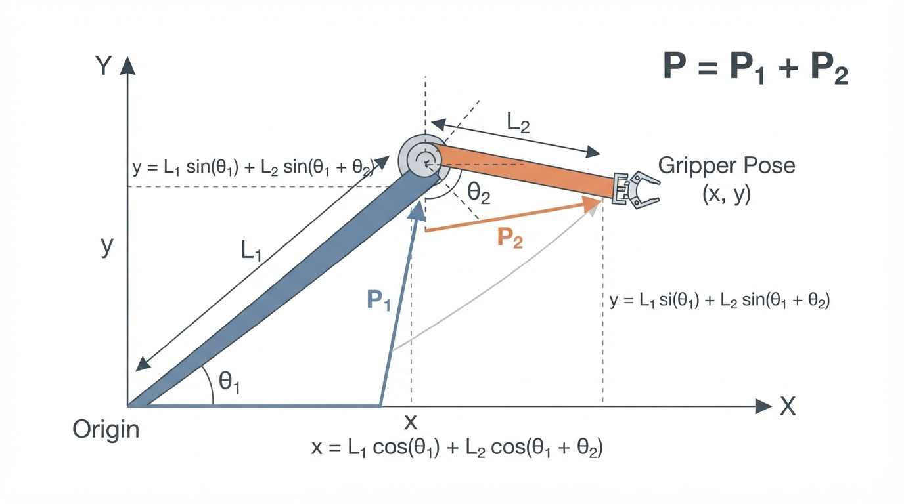
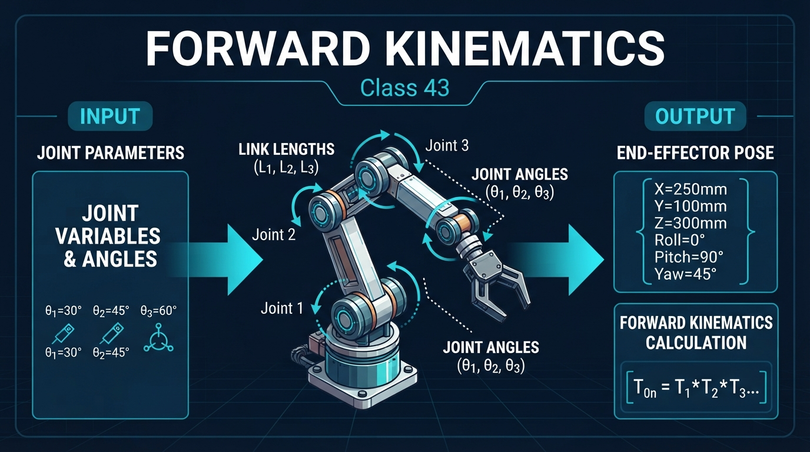
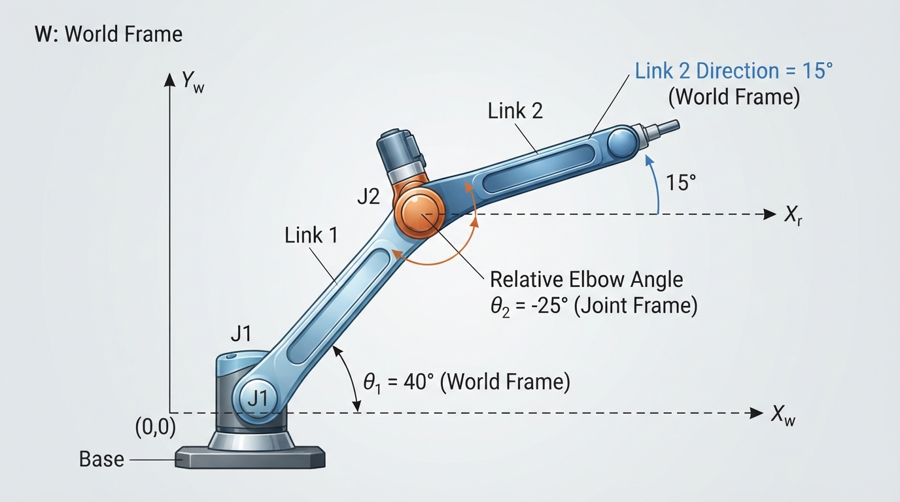
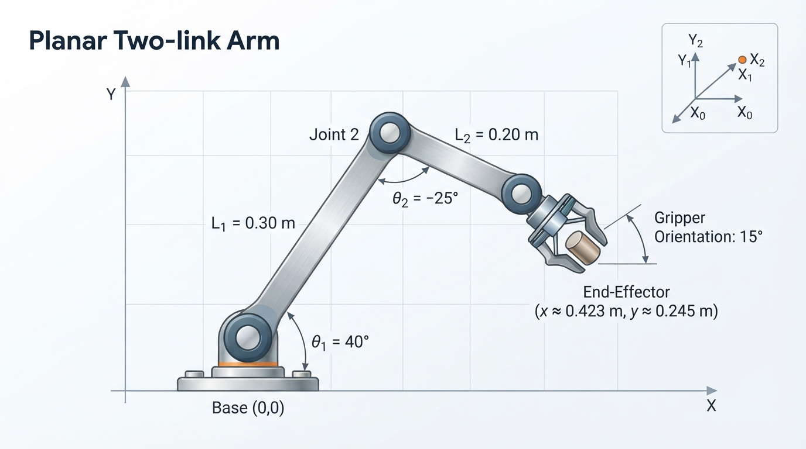
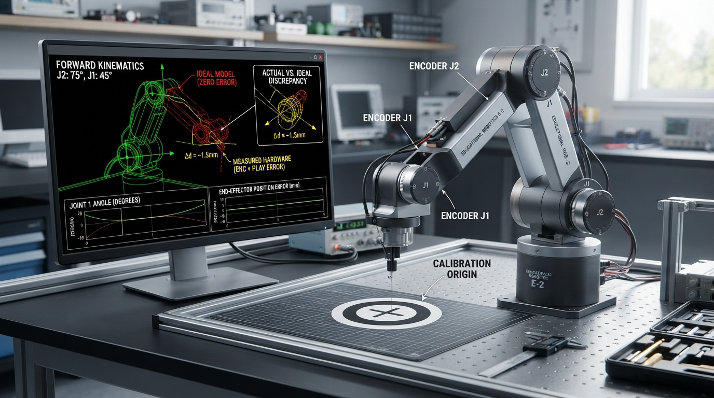

# Class 43: Forward Kinematics

## Where We Are in the Robotics Journey

In the previous class, **Robot Arms**, RoboRover gained a mechanical arm made of rigid links connected by joints. We discussed links, revolute joints, joint limits, and the difference between the arm’s structure and its control system.

Today we answer a precise question:

> If we know every joint angle and every link length, where is the arm’s end-effector?

The end-effector is the part that interacts with the world: a gripper, suction cup, tool, camera, or marker.

This calculation is called **forward kinematics**.

In the next class, **Inverse Kinematics**, we will reverse the question:

> If we want the end-effector at a particular position, what joint angles should the arm use?

Forward kinematics is therefore the “joint angles to pose” direction. Inverse kinematics is the “desired pose to joint angles” direction.

---

## Today We Will Learn

By the end of this class, you should be able to:

- describe a robot arm using links, joints, and coordinate frames;
- calculate the end-effector position of a simple two-link planar arm;
- calculate the end-effector orientation;
- distinguish joint angles from the arm’s overall orientation;
- use Python to draw an arm from its joint angles;
- explain why real robots may disagree with an ideal mathematical model.

---

## 2-Minute Recap

Imagine RoboRover’s arm as two rulers joined by an elbow:

- Link 1 is attached to the rover’s shoulder.
- Link 2 is attached to the elbow.
- The gripper is at the end of Link 2.

For today, we use a **planar arm**. “Planar” means all motion occurs on a flat surface, such as a tabletop. The arm can move left, right, up, and down in the drawing, but not toward or away from you.

The arm has two revolute joints:

- Joint 1 rotates Link 1 relative to the base.
- Joint 2 rotates Link 2 relative to Link 1.

A joint angle is not usually measured relative to the room. Joint 2 is commonly measured relative to Link 1. This detail matters.

---

## The Big Idea




**Figure:** Forward kinematics adds the displacement contributed by each link to find the end-effector position.

Forward kinematics is like predicting the tip of a folding ruler.

If you know:

1. the length of each ruler section,
2. the direction of the first section,
3. how much the second section bends relative to the first,

then you can calculate exactly where the ruler’s tip should be.

For RoboRover’s two-link arm:

- the first link contributes a displacement;
- the second link contributes another displacement;
- adding those two displacements gives the gripper position.

The key visual idea is this:

```text
                    gripper
                       ●
                      /
                 L2  /
                    /
                   ● elbow
                  /
             L1  /
                /
               ● base
```

The elbow position depends only on Link 1. The gripper position depends on both Link 1 and Link 2.

A robot controller can use forward kinematics to:

- display the predicted arm pose;
- check whether a planned motion is inside the workspace;
- compare the commanded pose with a measured pose;
- prevent the gripper from moving into forbidden regions.

Forward kinematics does not decide what the arm should do. It predicts the result of particular joint values.

---

## See It in Your Head

### AI-Generated Engineering Visual · Professor OS



**How to read this visual:** Trace the signal or idea from left to right. Match each block to the lesson explanation, then predict what would change if one block produced a wrong value.




**Figure:** The second link’s room-relative direction is theta1 plus theta2, because the elbow angle is measured relative to Link 1.

Draw a horizontal \(x\)-axis pointing right and a vertical \(y\)-axis pointing upward. Put the arm’s base at the origin:

```text
y
↑
|
|       ● gripper
|      /
|  ● elbow
| /
●────────────────→ x
base
```

Now imagine rotating Link 1 counterclockwise from the positive \(x\)-axis.

Let:

- \(L_1\) be the first link length;
- \(L_2\) be the second link length;
- \(\theta_1\) be Joint 1’s angle measured from the positive \(x\)-axis;
- \(\theta_2\) be Joint 2’s relative angle measured from Link 1;
- \(\phi\) be the gripper’s final orientation measured from the positive \(x\)-axis.

The direction of Link 2 in the room is not \(\theta_2\) alone. It is:

\[
\phi = \theta_1 + \theta_2
\]

Why? Joint 2 turns Link 2 relative to Link 1, and Link 1 is already rotated by \(\theta_1\).

For example, if Link 1 points \(40^\circ\) above horizontal and the elbow bends Link 2 by \(-25^\circ\), Link 2 points at:

\[
40^\circ + (-25^\circ) = 15^\circ
\]

That is a common source of mistakes.

---

## Core Concept

### Position is the sum of link contributions

The elbow coordinates are:

\[
x_e = L_1\cos(\theta_1)
\]

\[
y_e = L_1\sin(\theta_1)
\]

The gripper receives an additional displacement from Link 2:

\[
x_g = L_1\cos(\theta_1) + L_2\cos(\theta_1+\theta_2)
\]

\[
y_g = L_1\sin(\theta_1) + L_2\sin(\theta_1+\theta_2)
\]

Here:

- \(x_e, y_e\) are elbow coordinates in metres;
- \(x_g, y_g\) are gripper coordinates in metres;
- \(L_1, L_2\) are link lengths in metres;
- \(\theta_1, \theta_2\) are joint angles;
- \(\cos\) and \(\sin\) use angles in radians in Python and in most mathematical software.

The complete planar pose is often written:

\[
(x_g,\ y_g,\ \phi)
\]

The first two values describe position. The third describes orientation.

### Joint angle versus link direction

This distinction deserves a second look:

- \(\theta_1\) is both Joint 1’s angle and Link 1’s direction, because the base is fixed.
- \(\theta_2\) is Link 2’s angle relative to Link 1.
- \(\theta_1+\theta_2\) is Link 2’s direction relative to the room.

The joint angle and the world-frame link direction are not always the same.

---

## Math Without Fear

Trigonometry provides the horizontal and vertical parts of a link.

For a link of length \(L\) pointing at angle \(\alpha\):

- horizontal part: \(L\cos(\alpha)\);
- vertical part: \(L\sin(\alpha)\).

If a link points straight right, \(\alpha=0^\circ\):

\[
L\cos(0^\circ)=L,\qquad L\sin(0^\circ)=0
\]

All of the link is horizontal.

If it points straight upward, \(\alpha=90^\circ\):

\[
L\cos(90^\circ)=0,\qquad L\sin(90^\circ)=L
\]

All of the link is vertical.

Python’s trigonometric functions expect radians, not degrees. The conversion is:

\[
\text{radians}=\text{degrees}\times\frac{\pi}{180}
\]

where:

- \(\pi\) is approximately \(3.14159\);
- degrees measure angle using \(360^\circ\) for a full turn;
- radians measure angle using \(2\pi\) for a full turn.

This is a software convention, not a change in the physical angle.

---

## Worked Robotics Example




**Figure:** For the worked pose, the gripper is approximately 0.423 metres right and 0.245 metres above the base, pointing at 15 degrees.

Suppose RoboRover has:

- \(L_1=0.30\ \text{m}\);
- \(L_2=0.20\ \text{m}\);
- \(\theta_1=40^\circ\);
- \(\theta_2=-25^\circ\).

The second link’s direction is:

\[
\phi=\theta_1+\theta_2
\]

\[
\phi=40^\circ-25^\circ=15^\circ
\]

Now calculate the gripper position:

\[
x_g=0.30\cos(40^\circ)+0.20\cos(15^\circ)
\]

\[
x_g\approx 0.30(0.7660)+0.20(0.9659)
\]

\[
x_g\approx 0.4230\ \text{m}
\]

For the vertical coordinate:

\[
y_g=0.30\sin(40^\circ)+0.20\sin(15^\circ)
\]

\[
y_g\approx 0.30(0.6428)+0.20(0.2588)
\]

\[
y_g\approx 0.2446\ \text{m}
\]

Therefore the predicted pose is approximately:

\[
(x_g,y_g,\phi)
=
(0.4230\ \text{m},\ 0.2446\ \text{m},\ 15^\circ)
\]

Interpretation:

- the gripper is \(42.30\ \text{cm}\) to the right of the base;
- it is \(24.46\ \text{cm}\) above the base;
- the gripper points \(15^\circ\) above the horizontal.

The total arm length is \(0.50\ \text{m}\), but the gripper is only \(0.489\ \text{m}\) from the base in this pose. That is reasonable: the links are not perfectly straight.

---

## Python Lab

This program calculates RoboRover’s two-link forward kinematics, prints the pose, and draws the arm. It also contains assertions that verify the worked example.

```python
import math
import matplotlib.pyplot as plt


def forward_kinematics(length1, length2, angle1_deg, angle2_deg):
    """Return base, elbow, gripper, and gripper orientation."""
    angle1 = math.radians(angle1_deg)
    angle2 = math.radians(angle2_deg)

    elbow_x = length1 * math.cos(angle1)
    elbow_y = length1 * math.sin(angle1)

    link2_direction = angle1 + angle2
    gripper_x = elbow_x + length2 * math.cos(link2_direction)
    gripper_y = elbow_y + length2 * math.sin(link2_direction)

    gripper_orientation_deg = math.degrees(link2_direction)

    return (
        (0.0, 0.0),
        (elbow_x, elbow_y),
        (gripper_x, gripper_y),
        gripper_orientation_deg
    )


def main():
    length1 = 0.30
    length2 = 0.20
    angle1_deg = 40.0
    angle2_deg = -25.0

    base, elbow, gripper, orientation = forward_kinematics(
        length1, length2, angle1_deg, angle2_deg
    )

    expected_x = 0.422998
    expected_y = 0.244600
    expected_orientation = 15.0

    assert abs(gripper[0] - expected_x) < 0.00001
    assert abs(gripper[1] - expected_y) < 0.00001
    assert abs(orientation - expected_orientation) < 0.00001

    print("Forward kinematics check passed.")
    print("Gripper position: x = {:.4f} m, y = {:.4f} m".format(
        gripper[0], gripper[1]
    ))
    print("Gripper orientation: {:.1f} degrees".format(orientation))

    x_values = [base[0], elbow[0], gripper[0]]
    y_values = [base[1], elbow[1], gripper[1]]

    plt.figure(figsize=(7, 6))
    plt.plot(x_values, y_values, "o-", linewidth=4, markersize=9)
    plt.text(base[0], base[1], "  base")
    plt.text(elbow[0], elbow[1], "  elbow")
    plt.text(gripper[0], gripper[1], "  gripper")

    reach = length1 + length2
    plt.xlim(-reach - 0.05, reach + 0.05)
    plt.ylim(-reach - 0.05, reach + 0.05)
    plt.axhline(0.0, color="gray", linewidth=0.8)
    plt.axvline(0.0, color="gray", linewidth=0.8)
    plt.gca().set_aspect("equal", adjustable="box")
    plt.xlabel("x position (m)")
    plt.ylabel("y position (m)")
    plt.title("RoboRover two-link forward kinematics")
    plt.grid(True)
    plt.show()


if __name__ == "__main__":
    main()
```

Important lines:

- `math.radians(...)` converts degrees into the units expected by `math.sin` and `math.cos`.
- `link2_direction = angle1 + angle2` converts the elbow-relative angle into a room-relative direction.
- The `assert` statements stop the program if its calculation disagrees with the worked example.
- `set_aspect("equal")` makes one metre on the horizontal axis look the same size as one metre on the vertical axis. Without this, the arm could look geometrically distorted.

---

## Mini Simulation or Game

Use the program as a small target-reaching experiment.

Change only these four values near the beginning of `main()`:

```text
length1 = 0.30
length2 = 0.20
angle1_deg = 40.0
angle2_deg = -25.0
```

Your challenge is to make the gripper reach a target near:

\[
(0.30\ \text{m},\ 0.30\ \text{m})
\]

You do not need inverse kinematics yet. Try angles by prediction.

A useful first attempt is:

- set \(\theta_1=45^\circ\);
- set \(\theta_2=0^\circ\).

Both links then point in the same direction. The gripper should lie along a \(45^\circ\) line from the base.

Now try:

- \(\theta_1=60^\circ\);
- \(\theta_2=-30^\circ\).

The first link points at \(60^\circ\), while the second points at \(30^\circ\). Compare the drawing with your prediction.

This is a simple form of **manual search**: you choose joint angles, run the forward model, inspect the result, and try again. The next class will study systematic methods for finding useful joint angles from a desired target.

---

## What Should Happen?

**Predict before you run it.**

For the original values \(L_1=0.30\ \text{m}\), \(L_2=0.20\ \text{m}\), \(\theta_1=40^\circ\), and \(\theta_2=-25^\circ\):

1. Will the gripper be above or below the \(x\)-axis?
2. Will the gripper’s orientation be \(15^\circ\), \(40^\circ\), or \(-25^\circ\)?
3. Will the gripper be farther than \(0.50\ \text{m}\) from the base, exactly \(0.50\ \text{m}\), or closer than \(0.50\ \text{m}\)?

The verified program should report approximately:

```text
Forward kinematics check passed.
Gripper position: x = 0.4230 m, y = 0.2446 m
Gripper orientation: 15.0 degrees
```

Reasoning:

1. Both links have positive vertical components, so the gripper is above the \(x\)-axis.
2. The second link’s world direction is \(40^\circ-25^\circ=15^\circ\).
3. The links are not collinear, so the straight-line base-to-gripper distance is less than their combined length.

---

## Common Mistakes

### 1. Using \(\theta_2\) as Link 2’s room direction

If you calculate Link 2 using \(\cos(\theta_2)\) and \(\sin(\theta_2)\), you are treating its angle as measured from the room’s horizontal axis. In our convention, it is measured from Link 1.

Use:

\[
\theta_1+\theta_2
\]

for Link 2’s world direction.

### 2. Mixing degrees and radians

A value of \(40\) passed directly to `math.cos(40)` means 40 radians, not \(40^\circ\). Convert first.

### 3. Forgetting signs

A negative angle means clockwise rotation in our counterclockwise-positive convention. Thus \(-25^\circ\) bends Link 2 clockwise relative to Link 1.

### 4. Confusing position with orientation

The gripper’s position is \((x,y)\). Its orientation is \(\phi\). A gripper can occupy the same position with different orientations in some arm configurations.

### 5. Assuming the model is reality

The equations assume:

- links have exactly known lengths;
- joints have no looseness;
- the base does not move;
- angles are measured accurately;
- links do not bend;
- the arm is truly planar.

A real robot may have gearbox backlash, flexible links, encoder offsets, calibration errors, or a slightly moving chassis. Forward kinematics predicts the pose of the **model**, not automatically the exact pose of the hardware.

---

## Try It Yourself

### Challenge

Using \(L_1=0.30\ \text{m}\) and \(L_2=0.20\ \text{m}\), find angles that place the gripper approximately near:

\[
(0.30\ \text{m},\ 0.30\ \text{m})
\]

Record:

- your chosen \(\theta_1\);
- your chosen \(\theta_2\);
- the program’s resulting \(x\) and \(y\);
- the gripper orientation.

Do not worry about finding the only answer. In many arm poses, different angle combinations can place the gripper at the same position.

### Optional extension

Modify the program so that it draws a short arrow from the gripper showing its orientation. The arrow can have length \(0.08\ \text{m}\):

\[
x_{\text{arrow}}=x_g+0.08\cos(\phi)
\]

\[
y_{\text{arrow}}=y_g+0.08\sin(\phi)
\]

Remember that \(\phi\) must be in radians when used with Python’s trigonometric functions.

---

## Quick Quiz

1. What does forward kinematics calculate?

2. For a two-link planar arm, why is Link 2’s world-frame direction \(\theta_1+\theta_2\) rather than \(\theta_2\) alone?

3. If \(L_1=0.4\ \text{m}\), \(L_2=0.1\ \text{m}\), \(\theta_1=0^\circ\), and \(\theta_2=0^\circ\), what is the gripper position?

4. In the worked example, what does the pose \((0.4230\ \text{m}, 0.2446\ \text{m}, 15^\circ)\) mean?

---

## Answers

1. Forward kinematics calculates a robot’s position and usually orientation from known link dimensions and joint values.

2. Joint 2 is measured relative to Link 1. Link 1 has already rotated by \(\theta_1\), so Link 2’s direction in the room is the sum \(\theta_1+\theta_2\).

3. Both links point directly right:

\[
x=0.4+0.1=0.5\ \text{m}
\]

\[
y=0\ \text{m}
\]

The gripper orientation is \(0^\circ\).

4. The gripper is \(0.4230\ \text{m}\) right of the base, \(0.2446\ \text{m}\) above the base, and points \(15^\circ\) above the horizontal.

---

## Real Robot Connection




**Figure:** Real hardware can differ from the ideal forward-kinematics model because of calibration error, backlash, flexibility, and imperfect measurements.

A real robot arm often has joint encoders that report angles. The controller can place those angles into a forward-kinematics model and estimate where the tool should be.

For example:

1. Encoder 1 reports the shoulder angle.
2. Encoder 2 reports the elbow angle.
3. The controller uses the known link lengths.
4. Forward kinematics estimates the tool pose.
5. The estimate can be shown on a screen or compared with a desired pose.

However, a joint encoder may report the motor shaft angle rather than the exact physical link angle. Gears can introduce backlash, and an encoder’s zero position may be slightly misaligned. Engineers handle this through calibration, mechanical design, and sometimes additional sensors.

A particularly important limitation is that forward kinematics is only as good as its coordinate conventions. If one software component treats Joint 2 as an absolute angle while another treats it as a relative angle, the robot may move to a surprising pose even though every individual calculation appears reasonable.

---

## Vocabulary

- **Forward kinematics:** Calculating a robot’s pose from its joint values and geometric dimensions.
- **Link:** A rigid or approximately rigid part between joints.
- **Joint:** A mechanical connection that permits controlled relative motion.
- **Revolute joint:** A joint that rotates about an axis.
- **End-effector:** The tool or device at the end of a robot arm.
- **Pose:** Position and orientation together.
- **Position:** Location, such as \((x,y)\), usually measured in metres.
- **Orientation:** Direction or rotation of an object, such as \(15^\circ\) from horizontal.
- **Coordinate frame:** A chosen origin and set of axes used to describe locations and directions.
- **Relative angle:** An angle measured from another link or frame rather than directly from the room.
- **Planar arm:** An arm whose motion is modeled in a single flat plane.
- **Workspace:** The set of positions or poses that the robot can reach.

---

## Further Learning

To deepen this topic, practice these ideas in order:

1. Draw several two-link arms by hand from given angles.
2. Calculate elbow position before calculating gripper position.
3. Label every angle as either relative to a link or measured from the base frame.
4. Extend the Python program to animate one changing joint angle.
5. Compare the predicted pose with measurements from a physical cardboard or servo arm.

A useful study phrase is:

> **Each link contributes a vector; forward kinematics adds the vectors.**

The next step is not to memorize more trigonometry. It is to become comfortable moving between mechanical drawings, coordinate frames, equations, and code.

---

## Next Class

In **Class 44: Inverse Kinematics**, we will begin with a desired gripper position and work backward to find possible joint angles.

Forward kinematics asks:

\[
\text{joint angles} \longrightarrow \text{pose}
\]

Inverse kinematics asks:

\[
\text{desired pose} \longrightarrow \text{joint angles}
\]

The reverse problem is more difficult because there may be:

- no solution;
- one solution;
- several solutions;
- solutions blocked by joint limits.

RoboRover will use the forward-kinematics model from this class to check whether inverse-kinematics answers actually place the gripper where intended.
