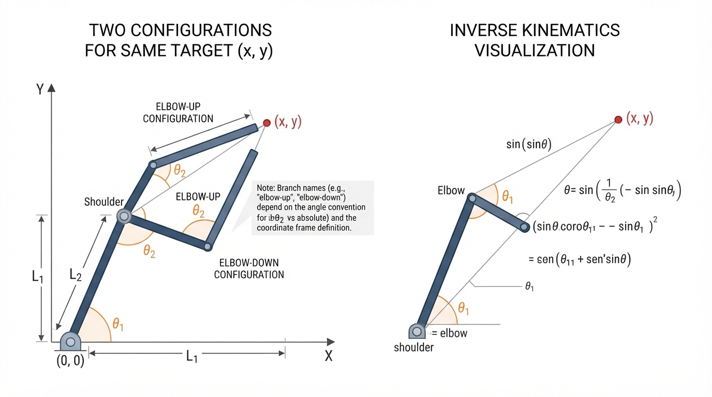
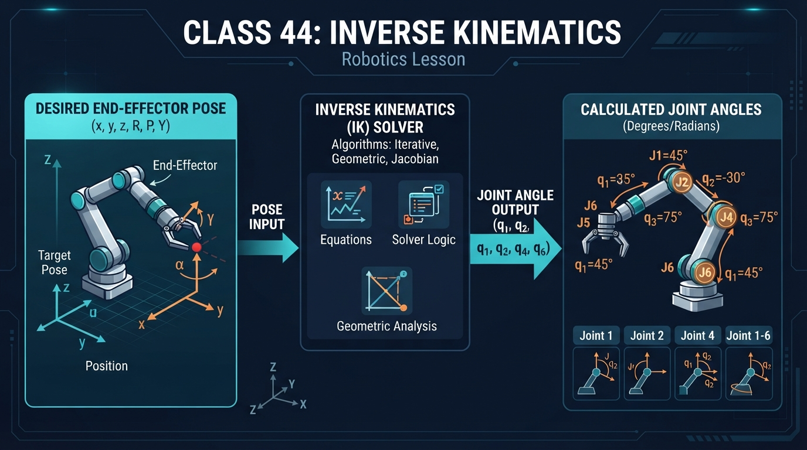
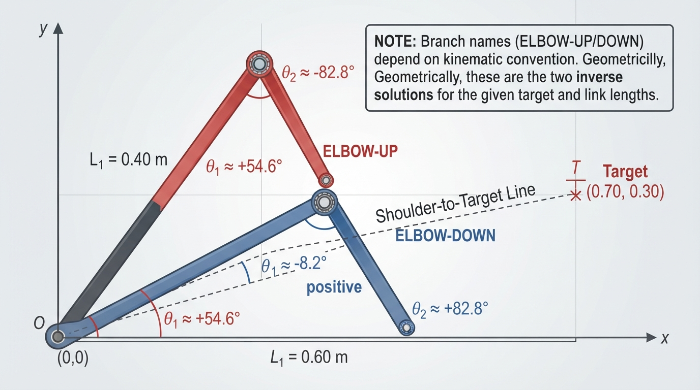
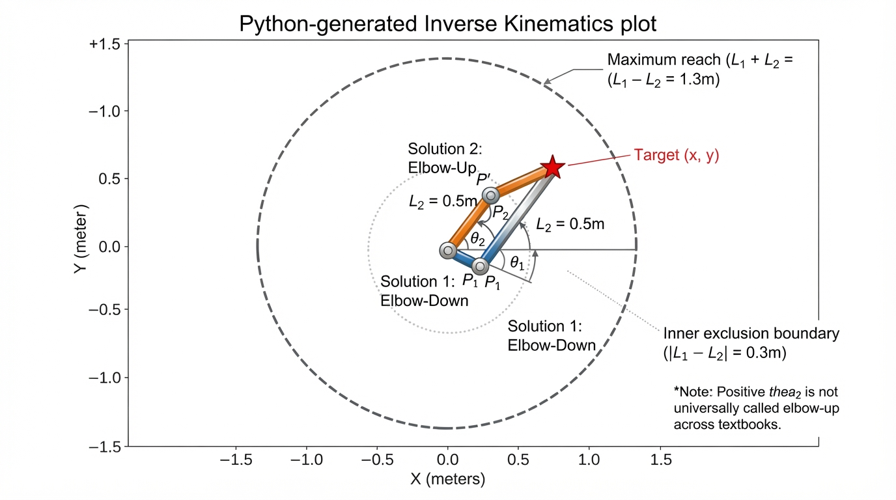
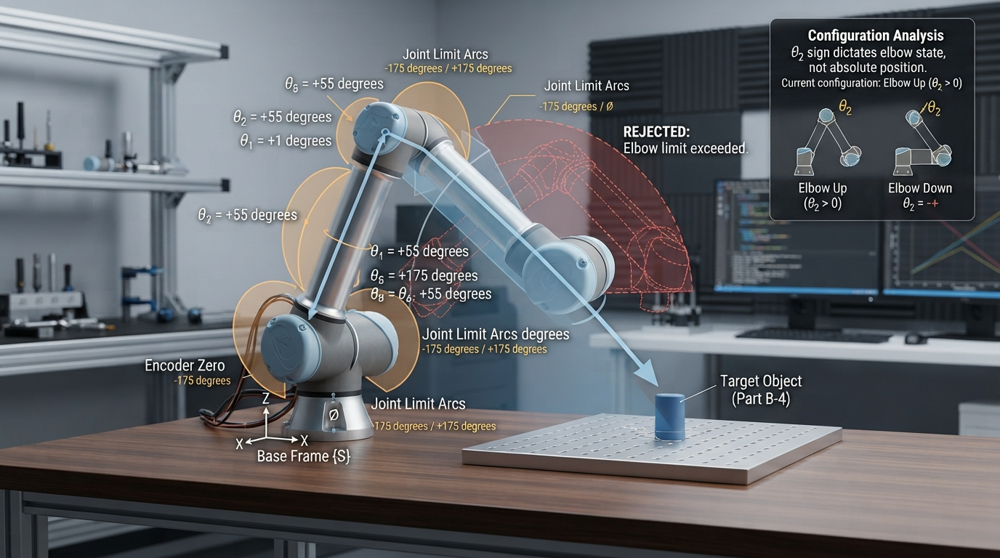

# Class 44: Inverse Kinematics

## Where We Are in the Robotics Journey

Last class, RoboRover learned **forward kinematics**: starting with joint angles, it calculated where the end of an arm would go.

Today we reverse that direction:

> Given a desired end position, what joint angles will place the arm there?

That problem is called **inverse kinematics**, often shortened to **IK**.

RoboRover has a small two-link inspection arm. Its shoulder joint turns the first link, and its elbow joint turns the second link. A camera at the tip must reach a marked point on a workbench. We will calculate the shoulder and elbow angles needed to reach it.

Next class, we will attach a **gripper**. Then the arm will not merely reach an object; it will be able to hold it.

## Today We Will Learn

By the end of this class, you should be able to:

- explain the difference between forward and inverse kinematics;
- convert a desired planar position into joint angles for a two-link arm;
- understand why one target can have two valid arm configurations;
- identify unreachable targets;
- use Python to calculate and visualize inverse-kinematics solutions;
- recognize practical problems such as joint limits, measurement error, and singular configurations.

Our main model is a two-dimensional arm with:

- link 1 length \(L_1\);
- link 2 length \(L_2\);
- shoulder angle \(\theta_1\);
- elbow angle \(\theta_2\);
- target position \((x,y)\).

## 2-Minute Recap

For RoboRover’s two-link arm, forward kinematics gives the tip coordinates:

\[
x=L_1\cos(\theta_1)+L_2\cos(\theta_1+\theta_2)
\]

\[
y=L_1\sin(\theta_1)+L_2\sin(\theta_1+\theta_2)
\]

Here:

- \(x\) and \(y\) are tip coordinates in metres;
- \(L_1\) and \(L_2\) are link lengths in metres;
- \(\theta_1\) is the first joint angle, measured from the positive \(x\)-axis;
- \(\theta_2\) is the elbow angle relative to the first link;
- angles are measured in radians in mathematical formulas unless degrees are stated.

With this convention, positive \(\theta_2\) produces the **elbow-down** branch for the target used in this lesson, while negative \(\theta_2\) produces the **elbow-up** branch. “Elbow-up” and “elbow-down” names depend on the coordinate and angle convention, so always identify the branch geometrically.

Forward kinematics asks:

> “I know the joint angles. Where is the tip?”

Inverse kinematics asks:

> “I know where I want the tip. What joint angles should I use?”

Before reading further, predict:

**If the target is directly to the right of the shoulder, can the arm usually reach it with the elbow above the line or below the line?**

For a reachable interior target in this unconstrained two-link model, there are generally two configurations: one with the elbow above the shoulder-to-target line and one below it. At the outer radial boundary, the two configurations merge into a fully stretched configuration. At the inner radial boundary, they merge into a fully folded configuration when \(L_1\ne L_2\). There is one important equal-link exception: when \(L_1=L_2\) and the target is exactly at the shoulder, the shoulder angle is undefined and infinitely many physical orientations with \(\theta_2=\pi\) modulo \(2\pi\) place the tip there.

> **Assumption box:** The standard two-branch result applies to nonzero interior targets and to unequal-link inner-boundary targets. At the outer boundary, the branches coincide in one fully stretched configuration. For equal links at the inner boundary \(r=0\), the target is the shoulder itself, and the arm has an infinite family of orientations with \(\theta_2=\pi\) modulo \(2\pi\); the shoulder angle is not uniquely defined.

## The Big Idea




**Figure:** Inverse kinematics works backward from a desired tip position to the joint angles that can produce it.

Imagine two rulers joined by a hinge.

You know:

- where the first hinge is;
- the length of each ruler;
- where you want the far end to be.

You must determine how to rotate the rulers.

That is inverse kinematics:

\[
\text{desired pose} \longrightarrow \text{joint values}
\]

For today’s planar arm, the desired pose is mainly a position:

\[
(x,y)
\]

In a full robotics problem, a pose may also include orientation: which direction the tool is pointing. A two-joint arm generally cannot independently control all three planar quantities—\(x\), \(y\), and tool orientation—at once. Today we focus on position.

A useful diagram would show:

1. a shoulder at the origin;
2. one target point;
3. an elbow-up arm;
4. an elbow-down arm;
5. arcs labelled \(\theta_1\) and \(\theta_2\), with the relative-angle convention stated;
6. a dashed line from the shoulder to the target;
7. a note that positive \(\theta_2\) is elbow-down for the convention used here.

The important surprise is that inverse kinematics may produce:

- no solution;
- one solution;
- two solutions;
- or, with more complicated robots, many solutions.

For a general reachable **interior** target in this unconstrained planar model, there are two distinct configurations. At the outer boundary \(r=L_1+L_2\), the links are fully stretched and the two branches coincide. At the inner boundary \(r=|L_1-L_2|\), the two branches coincide in a fully folded configuration when \(L_1\ne L_2\). If \(L_1=L_2\), the inner boundary is \(r=0\): the target is at the shoulder, the shoulder angle is undefined, and infinitely many physical orientations with \(\theta_2=\pi\) modulo \(2\pi\) reach that point. Joint limits, obstacles, and other constraints can leave fewer usable solutions.

## See It in Your Head

### AI-Generated Engineering Visual · Professor OS



**How to read this visual:** Trace the signal or idea from left to right. Match each block to the lesson explanation, then predict what would change if one block produced a wrong value.


Picture RoboRover’s arm from the side.

The shoulder is at \((0,0)\). The target is at \((0.70,0.30)\) metres.

With the convention used in the equations, the negative-\(\theta_2\) solution places the elbow above the shoulder-to-target line:

```text
        elbow
          o
         / \
        /   \   target
shoulder o----o
```

The positive-\(\theta_2\) solution places the elbow below the shoulder-to-target line:

```text
shoulder o----o target
          \  /
           \/
          elbow
```

Both arrangements can place the tip at the same target. The links have the same lengths, but the elbow lies on opposite sides of the shoulder-to-target line.

This is called **solution branching**. The two common geometric branches are often called:

- elbow-up;
- elbow-down.

The angle sign used for those names is not universal. In this lesson, positive \(\theta_2\) is the elbow-down branch for the stated coordinate convention.

A real robot may be unable to use one branch because of:

- a joint limit;
- a table or obstacle;
- a cable snag;
- a collision with its own body;
- a preferred safety posture.

## Core Concept

Let the shoulder be at the origin and let the target be \((x,y)\).

First calculate the straight-line distance from the shoulder to the target:

\[
r=\sqrt{x^2+y^2}
\]

where:

- \(r\) is the target distance in metres;
- \(x\) is horizontal position in metres;
- \(y\) is vertical position in metres.

The target is reachable only if the two links can form a triangle with sides \(L_1\), \(L_2\), and \(r\):

\[
|L_1-L_2|\leq r\leq L_1+L_2
\]

The outer limit \(L_1+L_2\) is obvious: stretch both links straight.

The inner limit \(|L_1-L_2|\) is a **radial** condition. If \(r<|L_1-L_2|\), the target lies inside the unreachable inner region for unequal links. For equal-length links, this inner radius is zero, so the arm can reach the shoulder area in this ideal model.

At the outer boundary \(r=L_1+L_2\), the links are fully stretched and \(\theta_2=0\), so the two branches coincide in one geometric configuration.

At the inner boundary \(r=|L_1-L_2|\) with \(L_1\ne L_2\), the links are fully folded. The values \(\theta_2=\pi\) and \(\theta_2=-\pi\) describe the same geometric relative orientation modulo \(2\pi\), so there is one geometric configuration for each target direction.

The equal-link inner boundary is different. When \(L_1=L_2\), the inner radius is \(r=0\), so the target is at the shoulder. Any shoulder direction can be paired with a fully folded relative angle \(\theta_2=\pi\) modulo \(2\pi\), producing the shoulder position. Thus the shoulder angle is undefined and there are infinitely many physical orientations, not one unique configuration.

Therefore, a reachable nonzero interior target generally has two distinct configurations. The outer boundary and the unequal-link inner boundary have one geometric configuration. The equal-link target at the shoulder has an orientation-degenerate family.

The elbow angle comes from the law of cosines:

\[
\cos(\theta_2)=
\frac{x^2+y^2-L_1^2-L_2^2}{2L_1L_2}
\]

Therefore, one branch can be written as:

\[
\theta_2=\cos^{-1}\left(
\frac{x^2+y^2-L_1^2-L_2^2}{2L_1L_2}
\right)
\]

This gives the positive-\(\theta_2\) branch. With the convention used here, that is the elbow-down branch for the worked target. Negating the angle gives the other geometric branch:

\[
\theta_{2,\text{other}}=-\theta_2
\]

The shoulder angle uses two parts:

\[
\theta_1=
\operatorname{atan2}(y,x)
-
\operatorname{atan2}
\left(
L_2\sin(\theta_2),
L_1+L_2\cos(\theta_2)
\right)
\]

The function \(\operatorname{atan2}(y,x)\) is a safer version of inverse tangent because it uses the signs of both coordinates to identify the correct quadrant.

## Math Without Fear

The equations are easier to understand as a geometric recipe.

### Step 1: Aim toward the target

\[
\alpha=\operatorname{atan2}(y,x)
\]

The angle \(\alpha\) points from the shoulder directly toward the target.

### Step 2: Determine the elbow bend

The law of cosines determines how sharply the two links must bend.

### Step 3: Correct the shoulder angle

The second link does not point exactly along the shoulder-to-target line. The shoulder angle must be adjusted by the angle created by the elbow triangle.

For the convention in this lesson, use positive \(\theta_2\) for the geometrically elbow-down branch and negative \(\theta_2\) for the geometrically elbow-up branch for the worked target. Other textbooks may define the relative elbow angle with the opposite sign, so branch names should be checked from the elbow’s position rather than inferred from the sign alone.

A computer normally uses radians:

\[
180^\circ=\pi\text{ radians}
\]

To convert radians to degrees:

\[
\text{degrees}=\text{radians}\times\frac{180}{\pi}
\]

Radians are convenient for Python’s `math.sin`, `math.cos`, and `math.atan2` functions.

## Worked Robotics Example




**Figure:** The target, link lengths, and law-of-cosines triangle determine both geometric branches and their shoulder angles.

RoboRover’s arm has:

\[
L_1=0.60\text{ m}
\]

\[
L_2=0.40\text{ m}
\]

The desired target is:

\[
x=0.70\text{ m},\qquad y=0.30\text{ m}
\]

First calculate the squared target distance:

\[
x^2+y^2=(0.70\text{ m})^2+(0.30\text{ m})^2
\]

\[
x^2+y^2=0.58\text{ m}^2
\]

The cosine term is:

\[
\cos(\theta_2)=
\frac{0.58-0.60^2-0.40^2}
{2(0.60)(0.40)}
\]

\[
\cos(\theta_2)=
\frac{0.58-0.36-0.16}{0.48}
=
0.125
\]

Thus the positive branch has:

\[
\theta_2\approx82.8^\circ
\]

Using the shoulder equation gives:

\[
\theta_1\approx-8.2^\circ
\]

This is the geometrically elbow-down branch because its elbow lies below the shoulder-to-target line.

The other branch is obtained by negating \(\theta_2\):

\[
\theta_2\approx-82.8^\circ
\]

For this branch:

\[
\theta_1\approx54.6^\circ
\]

This is the geometrically elbow-up branch because its elbow lies above the shoulder-to-target line.

The two numerical solutions are therefore approximately:

| Branch | \(\theta_1\) | \(\theta_2\) | Elbow position relative to shoulder-to-target line |
|---|---:|---:|---|
| Elbow-down | \(-8.2^\circ\) | \(82.8^\circ\) | Below |
| Elbow-up | \(54.6^\circ\) | \(-82.8^\circ\) | Above |

A more explicit verification table is:

| Branch | Shoulder angle | Elbow angle | Elbow coordinates (m) | Reconstructed tip (m) |
|---|---:|---:|---:|---:|
| Elbow-down | \(-8.2^\circ\) | \(82.8^\circ\) | approximately \((0.594,-0.086)\) | approximately \((0.700,0.300)\) |
| Elbow-up | \(54.6^\circ\) | \(-82.8^\circ\) | approximately \((0.348,0.489)\) | approximately \((0.700,0.300)\) |

The signed cross product

\[
x\,y_{\text{elbow}}-y\,x_{\text{elbow}}
\]

is negative for the elbow-down row and positive for the elbow-up row. This gives a geometric branch classification for this target.

The angles do not mean “turn the motors by exactly these visual angles” until we define the robot’s zero positions, positive rotation directions, gear ratios, and encoder calibration. Mathematical joint angles are not automatically motor command values.

## Python Lab




**Figure:** The simulation verifies both mathematical solutions by sending each calculated angle pair back through forward kinematics and classifying the elbow geometrically.

This complete Python 3.7 program calculates both inverse-kinematics branches and draws them. It uses forward kinematics to verify that each calculated solution reaches the target. It also:

- deduplicates coincident geometric solutions at the outer boundary and at an unequal-link inner boundary;
- reports when a target is at a workspace boundary;
- explicitly reports the equal-link shoulder case as orientation-degenerate;
- classifies each branch from the signed cross product;
- draws both the outer reach boundary and, for unequal links, the inner exclusion circle.

At a boundary, the returned single solution is only a representative of the geometric configuration. In the equal-link shoulder case, the returned representative does **not** mean that the physical orientation is unique; infinitely many shoulder angles are possible.

```python
import math
import matplotlib.pyplot as plt


BOUNDARY_TOLERANCE = 1e-9


def classify_workspace(distance, link_1, link_2,
                       tolerance=BOUNDARY_TOLERANCE):
    """Describe whether a target is interior or on a radial boundary."""
    outer_radius = link_1 + link_2
    inner_radius = abs(link_1 - link_2)

    at_outer = abs(distance - outer_radius) <= tolerance
    at_inner = abs(distance - inner_radius) <= tolerance

    if at_outer:
        return "outer boundary: fully stretched"

    if at_inner and link_1 == link_2:
        return (
            "equal-link inner boundary at the shoulder: "
            "orientation-degenerate family"
        )

    if at_inner:
        return "inner boundary: fully folded"

    return "interior"


def inverse_kinematics(x, y, link_1, link_2):
    """Return distinct representative planar IK solutions in radians."""
    if link_1 <= 0.0 or link_2 <= 0.0:
        raise ValueError("Link lengths must be positive.")

    distance_squared = x * x + y * y
    distance = math.sqrt(distance_squared)
    inner_radius = abs(link_1 - link_2)
    outer_radius = link_1 + link_2

    if distance > outer_radius + BOUNDARY_TOLERANCE:
        raise ValueError("Target is outside the arm's maximum reach.")

    if distance < inner_radius - BOUNDARY_TOLERANCE:
        raise ValueError("Target is inside the arm's unreachable inner region.")

    workspace_status = classify_workspace(
        distance, link_1, link_2
    )

    if workspace_status != "interior":
        print("Workspace status: {}".format(workspace_status))

    cosine_elbow = (
        distance_squared - link_1 * link_1 - link_2 * link_2
    ) / (2.0 * link_1 * link_2)

    # Floating-point rounding can produce a value such as 1.0000000002.
    cosine_elbow = max(-1.0, min(1.0, cosine_elbow))

    elbow_magnitude = math.acos(cosine_elbow)
    candidates = []

    for elbow_angle in (elbow_magnitude, -elbow_magnitude):
        shoulder_angle = (
            math.atan2(y, x)
            - math.atan2(
                link_2 * math.sin(elbow_angle),
                link_1 + link_2 * math.cos(elbow_angle)
            )
        )
        candidates.append((shoulder_angle, elbow_angle))

    # At the outer boundary and at an unequal-link inner boundary,
    # the two candidates describe the same geometric arm. Keep one
    # representative solution. For equal links at the shoulder,
    # this representative suppresses an infinite orientation family;
    # it is not a unique physical solution.
    solutions = []
    for candidate in candidates:
        candidate_points = forward_kinematics(
            candidate[0], candidate[1], link_1, link_2
        )
        duplicate = False

        for existing in solutions:
            existing_points = forward_kinematics(
                existing[0], existing[1], link_1, link_2
            )
            elbow_error = math.hypot(
                candidate_points[0][0] - existing_points[0][0],
                candidate_points[0][1] - existing_points[0][1]
            )
            tip_error = math.hypot(
                candidate_points[1][0] - existing_points[1][0],
                candidate_points[1][1] - existing_points[1][1]
            )

            if elbow_error < BOUNDARY_TOLERANCE and \
                    tip_error < BOUNDARY_TOLERANCE:
                duplicate = True
                break

        if not duplicate:
            solutions.append(candidate)

    return solutions


def forward_kinematics(shoulder_angle, elbow_angle, link_1, link_2):
    """Return the elbow and tip coordinates in metres."""
    elbow_x = link_1 * math.cos(shoulder_angle)
    elbow_y = link_1 * math.sin(shoulder_angle)

    tip_x = (
        elbow_x
        + link_2 * math.cos(shoulder_angle + elbow_angle)
    )
    tip_y = (
        elbow_y
        + link_2 * math.sin(shoulder_angle + elbow_angle)
    )

    return (elbow_x, elbow_y), (tip_x, tip_y)


def degrees(angle_radians):
    return angle_radians * 180.0 / math.pi


def classify_branch(elbow, target):
    """Classify the elbow relative to the shoulder-target line."""
    signed_cross_product = (
        target[0] * elbow[1] - target[1] * elbow[0]
    )

    if signed_cross_product > BOUNDARY_TOLERANCE:
        return "elbow-up"
    if signed_cross_product < -BOUNDARY_TOLERANCE:
        return "elbow-down"
    return "boundary configuration"


def plot_solution(solution, link_1, link_2, target, number):
    shoulder_angle, elbow_angle = solution
    elbow, tip = forward_kinematics(
        shoulder_angle, elbow_angle, link_1, link_2
    )
    branch = classify_branch(elbow, target)

    x_values = [0.0, elbow[0], tip[0]]
    y_values = [0.0, elbow[1], tip[1]]

    # Line style and labels communicate branch identity in addition
    # to color, which improves accessibility.
    line_styles = ["-", "--"]
    line_style = line_styles[(number - 1) % len(line_styles)]

    plt.plot(
        x_values,
        y_values,
        marker="o",
        linestyle=line_style,
        linewidth=3,
        label="Solution {} ({})".format(number, branch)
    )

    print(
        "Solution {} ({}): shoulder={:.2f} degrees, "
        "elbow={:.2f} degrees".format(
            number,
            branch,
            degrees(shoulder_angle),
            degrees(elbow_angle)
        )
    )
    print(
        "  elbow: ({:.3f} m, {:.3f} m)".format(
            elbow[0], elbow[1]
        )
    )
    print(
        "  calculated tip: ({:.3f} m, {:.3f} m)".format(
            tip[0], tip[1]
        )
    )

    # Verification: the calculated tip must be very close to the target.
    error = math.sqrt(
        (tip[0] - target[0]) ** 2
        + (tip[1] - target[1]) ** 2
    )
    assert error < 1e-9


def main():
    link_1 = 0.60
    link_2 = 0.40
    target = (0.70, 0.30)

    solutions = inverse_kinematics(
        target[0], target[1], link_1, link_2
    )

    # This verifies that the chosen interior target has two distinct
    # mathematical configurations.
    assert len(solutions) == 2

    # Verify the numerical values used in the worked example.
    angle_pairs_degrees = [
        (degrees(solution[0]), degrees(solution[1]))
        for solution in solutions
    ]
    rounded_pairs = [
        (round(pair[0], 1), round(pair[1], 1))
        for pair in angle_pairs_degrees
    ]
    assert (-8.2, 82.8) in rounded_pairs
    assert (54.6, -82.8) in rounded_pairs

    # Explicitly verify Target B from the activity.
    target_b = (0.20, 0.90)
    target_b_distance = math.hypot(target_b[0], target_b[1])
    assert abs(target_b_distance - math.sqrt(0.85)) < 1e-12
    assert abs(target_b_distance - 0.9219544457) < 1e-10

    target_b_solutions = inverse_kinematics(
        target_b[0], target_b[1], link_1, link_2
    )
    assert len(target_b_solutions) == 2
    print(
        "Target B distance: {:.3f} m; distinct solutions: {}".format(
            target_b_distance, len(target_b_solutions)
        )
    )

    plt.figure(figsize=(8, 6))

    for index, solution in enumerate(solutions, start=1):
        plot_solution(solution, link_1, link_2, target, index)

    reach = link_1 + link_2
    inner_radius = abs(link_1 - link_2)
    circle_angles = [
        2.0 * math.pi * i / 200.0 for i in range(201)
    ]

    outer_circle_x = [
        reach * math.cos(angle) for angle in circle_angles
    ]
    outer_circle_y = [
        reach * math.sin(angle) for angle in circle_angles
    ]

    plt.plot(
        outer_circle_x,
        outer_circle_y,
        linestyle="--",
        color="gray",
        label="Maximum reach"
    )

    if inner_radius > 0.0:
        inner_circle_x = [
            inner_radius * math.cos(angle) for angle in circle_angles
        ]
        inner_circle_y = [
            inner_radius * math.sin(angle) for angle in circle_angles
        ]
        plt.plot(
            inner_circle_x,
            inner_circle_y,
            linestyle=":",
            color="gray",
            label="Inner exclusion boundary"
        )

    plt.scatter(
        [target[0]],
        [target[1]],
        color="red",
        s=80,
        zorder=5,
        label="Target"
    )

    plt.axhline(0.0, color="black", linewidth=0.5)
    plt.axvline(0.0, color="black", linewidth=0.5)
    plt.xlabel("x position (m)")
    plt.ylabel("y position (m)")
    plt.title("RoboRover: two inverse-kinematics solutions")
    plt.axis("equal")
    plt.grid(True)
    plt.legend()
    plt.show()


if __name__ == "__main__":
    main()
```

For the worked target, the verification output is approximately:

```text
Solution 1 (elbow-down): shoulder=-8.2 degrees, elbow=82.8 degrees
  elbow: (0.594 m, -0.086 m)
  calculated tip: (0.700 m, 0.300 m)
Solution 2 (elbow-up): shoulder=54.6 degrees, elbow=-82.8 degrees
  elbow: (0.348 m, 0.489 m)
  calculated tip: (0.700 m, 0.300 m)
Target B distance: 0.922 m; distinct solutions: 2
```

The assertions in the same program verify both the branch count and the rounded numerical values. The `assert error < 1e-9` line verifies that each calculated arm reaches the target to within a tiny numerical tolerance. The Target B assertions verify:

\[
r_B=\sqrt{0.20^2+0.90^2}
=\sqrt{0.85}
\approx0.922\text{ m}
\]

Since \(0.922\text{ m}<1.00\text{ m}\) and \(0.922\text{ m}>0.20\text{ m}\), Target B is an interior reachable target for this arm and has two distinct configurations.

Important lines:

- `cosine_elbow = ...` applies the law of cosines.
- The loop uses both `elbow_magnitude` and `-elbow_magnitude`, creating candidate branches.
- `classify_branch(...)` uses the signed cross product to label the elbow geometrically.
- `classify_workspace(...)` reports the outer boundary, unequal-link inner boundary, and equal-link shoulder exception.
- The deduplication step keeps one representative when the two candidates coincide geometrically. At the equal-link shoulder, this representative suppresses an infinite family and is not a unique physical solution.
- `forward_kinematics(...)` checks the answer using the equations from the previous class.
- The dashed outer circle shows the maximum distance reachable when both links are straight.
- The dotted inner circle shows the inner exclusion boundary for unequal link lengths.

The plotted branch identity is communicated by labels and line styles as well as color, so the distinction does not depend on color alone.

The program intentionally keeps the two-dimensional model visible. A real robot controller would also check joint limits, collision constraints, motor limits, and coordinate-frame conversions.

## Mini Simulation or Game

Turn the Python lab into a target-reaching experiment.

Before running it, predict:

1. What happens if you change `target = (0.70, 0.30)` to `target = (0.20, 0.90)`?
2. What happens if you change it to `target = (1.10, 0.00)`?
3. Which branch places the elbow above the shoulder-to-target line?

Run the program after each change.

For a small challenge game, choose one of these targets without calculating first:

- Target A: \((0.70,0.30)\text{ m}\)
- Target B: \((0.20,0.90)\text{ m}\)
- Target C: \((1.10,0.00)\text{ m}\)

For each target, sketch where you think the elbow will appear. Then edit the `target` tuple and compare your sketch with the plot.

For Target B:

\[
r=\sqrt{(0.20)^2+(0.90)^2}
=\sqrt{0.85}
\approx0.922\text{ m}
\]

The inner radius is \(0.20\text{ m}\), and the maximum reach is \(1.00\text{ m}\). Therefore Target B is an interior reachable target and should produce two distinct configurations.

Target C is exactly \(1.10\text{ m}\) from the shoulder, while the arm’s maximum reach is:

\[
L_1+L_2=0.60\text{ m}+0.40\text{ m}=1.00\text{ m}
\]

Therefore Target C is unreachable for this arm. The program should raise a `ValueError` instead of producing joint angles.

## What Should Happen?

For Target A, the plot should show:

- one elbow-up configuration;
- one elbow-down configuration;
- both tips at the red target point;
- a dashed maximum-reach circle of radius \(1.00\text{ m}\);
- a dotted inner boundary only when the two link lengths are unequal and the inner radius is nonzero.

For Target B, the target has distance

\[
r=\sqrt{0.20^2+0.90^2}
=\sqrt{0.85}
\approx0.922\text{ m}.
\]

Because \(0.20\text{ m}<0.922\text{ m}<1.00\text{ m}\), it is a nonzero interior target. The program should calculate two distinct configurations.

For Target C, the program should stop with an error explaining that the target is outside maximum reach.

Do not judge a solution only by whether the final tip is correct. A mathematical solution can still be unusable if a joint must rotate beyond its physical limit or if a link collides with the robot.

A nonzero reachable interior target has two configurations under this unconstrained planar model. At the outer radial boundary, the branches coincide in one fully stretched configuration. At the inner radial boundary for unequal links, they coincide in one fully folded configuration. For equal links at the inner boundary, the target is at the shoulder and there is an infinite orientation-degenerate family with \(\theta_2=\pi\) modulo \(2\pi\). A constrained robot may have fewer usable solutions.

## Common Mistakes

### Confusing degrees and radians

Python’s trigonometric functions use radians. Passing `90` when you mean \(90^\circ\) does not mean a right angle.

### Forgetting the second solution

Using only positive `acos` gives one branch. The negative elbow angle usually gives the other branch.

### Mislabeling the branches

The sign of \(\theta_2\) does not universally define “elbow-up.” With the convention in this lesson, positive \(\theta_2\) is elbow-down for the worked target and negative \(\theta_2\) is elbow-up. Use the elbow’s position relative to the shoulder-to-target line.

### Ignoring reachability

The cosine expression is mathematically valid only when its value lies between \(-1\) and \(1\). A target outside the annular workspace has no real joint-angle solution.

### Treating a boundary as two distinct solutions

At the outer boundary \(r=L_1+L_2\), the two branches coincide in a fully stretched configuration. At the inner boundary \(r=|L_1-L_2|\) with unequal links, they coincide in a fully folded configuration. Code can deduplicate these geometric configurations.

The equal-link inner boundary is an exception: \(r=0\) places the target at the shoulder, and infinitely many shoulder orientations with \(\theta_2=\pi\) modulo \(2\pi\) reach that point. A program that returns one representative has suppressed this family; it has not proved that the physical orientation is unique.

### Treating mathematical angles as motor commands

The mathematical shoulder angle may be measured from a horizontal axis, while the physical encoder zero may be defined when the arm points downward. A conversion is required.

### Expecting exact physical accuracy

Even if the equations are correct, the real tip may miss because of:

- flexible links;
- inaccurate link measurements;
- backlash in gears;
- encoder zero errors;
- motor torque limits;
- load-induced bending;
- rounding and sensor noise.

### Ignoring joint limits

A robot may have two mathematical solutions but only one safe solution. Software should reject configurations that violate allowed joint ranges.

### Ignoring singular configurations

For this two-link arm, fully stretched and fully folded configurations are singular: the Jacobian loses rank. At those postures, some instantaneous Cartesian directions cannot be produced, or producing a small Cartesian change may require unusually large joint changes. The equal-link shoulder position is also orientation-degenerate: the end position does not determine a unique shoulder orientation. This lesson previews the idea; detailed Jacobian analysis will come later.

## Try It Yourself

**Challenge:** Modify the Python program so the user can change the target by editing only two variables near the top of `main()`.

Then add a joint-limit check:

- shoulder must remain between \(-90^\circ\) and \(90^\circ\);
- elbow must remain between \(-120^\circ\) and \(120^\circ\).

Print whether each solution is:

- `usable`;
- or `rejected by joint limits`.

Do not remove the forward-kinematics verification or the boundary deduplication.

**Optional extension:** Add a third plotted point showing the elbow for each solution and label the branches “elbow-up” and “elbow-down” based on the elbow’s position relative to the shoulder-to-target line, not merely on the sign of \(\theta_2\).

## Quick Quiz

1. What is the difference between forward kinematics and inverse kinematics?

2. Why can a two-link arm often have two solutions for one target position?

3. A robot has links \(L_1=0.50\text{ m}\) and \(L_2=0.30\text{ m}\). What are its maximum reach and inner unreachable radius?

4. Why should a real robot check joint limits after calculating inverse kinematics?

5. What happens to the two mathematical branches at a radial workspace boundary?

## Answers

1. Forward kinematics calculates the end position from known joint angles. Inverse kinematics calculates joint angles from a desired end position.

2. For a general reachable nonzero interior target, the elbow can lie on either side of the shoulder-to-target line, creating elbow-up and elbow-down configurations. The angle sign used for those names depends on the chosen convention.

3. The maximum reach is:

\[
L_1+L_2=0.50\text{ m}+0.30\text{ m}=0.80\text{ m}
\]

The inner unreachable radius is:

\[
|L_1-L_2|=|0.50-0.30|\text{ m}=0.20\text{ m}
\]

Targets with \(r<0.20\text{ m}\) are unreachable in this ideal two-link model.

4. A mathematical solution may require a joint to rotate beyond its physical range, collide with the robot or environment, or move into an unsafe configuration.

5. At the outer boundary, the two branches coincide in one fully stretched geometric configuration. At the inner boundary with unequal link lengths, they coincide in one fully folded geometric configuration; \(\theta_2=\pi\) and \(\theta_2=-\pi\) are equivalent modulo \(2\pi\) for the revolute-joint representation. For equal links, the inner boundary is \(r=0\), the shoulder itself. There the target does not determine a unique shoulder angle: infinitely many orientations with \(\theta_2=\pi\) modulo \(2\pi\) reach the target.

## Real Robot Connection




**Figure:** A real robot must convert mathematical angles into calibrated motor commands while respecting joint limits and mechanical constraints.

Inverse kinematics is the bridge between a human instruction and joint motion.

A human might specify:

> “Put the camera at \(x=0.70\text{ m}, y=0.30\text{ m}\).”

The controller must convert that request into:

1. a chosen IK branch;
2. joint angles;
3. calibrated motor or encoder commands;
4. a motion that respects speed, acceleration, torque, and collision limits.

There is also an important timing issue. If RoboRover calculates angles from an old target or an old robot position, the result may be correct for the past but wrong now. Real systems deal with latency, calibration, mechanical flexibility, and feedback from encoders.

Today’s equations assume:

- rigid links;
- perfect revolute joints;
- a flat two-dimensional workspace;
- known link lengths;
- no obstacles;
- no motor saturation.

Those assumptions are useful because they reveal the geometry. Engineering begins when we test how well those assumptions match the physical machine.

In the next class, the calculated tip position will become more useful. RoboRover will use a **gripper** to close around an object. Then we will care not only about reaching the object, but also about approaching it with a suitable orientation and avoiding forces that could make the object slip.

## Vocabulary

- **Inverse kinematics (IK):** The process of calculating robot joint values that produce a desired end-effector position or pose.
- **Forward kinematics:** The process of calculating the end-effector position or pose from known joint values.
- **End effector:** The tool at the end of a robot arm, such as a camera, gripper, drill, or suction cup.
- **Pose:** A robot tool’s position and orientation. In this class, we mainly calculate planar position.
- **Workspace:** The set of positions a robot can reach.
- **Joint angle:** The rotational position of a robot joint, usually measured in radians or degrees.
- **Elbow-up / elbow-down:** Two common inverse-kinematics branches in which the elbow lies on opposite sides of the shoulder-to-target line. Which sign of the relative elbow angle receives which name depends on the coordinate convention.
- **Joint limit:** A minimum or maximum allowed value for a robot joint.
- **Singularity:** A configuration where the robot loses useful movement freedom or where small task changes may require unusually large joint changes. In this two-link model, fully stretched and fully folded configurations are important examples. Detailed Jacobian analysis will come later.

## Further Learning

Useful search terms and study topics:

- “planar two-link inverse kinematics”
- “law of cosines robotics”
- “atan2 robot joint angles”
- “robot workspace and joint limits”
- “forward kinematics verification”
- “robot arm elbow-up elbow-down solutions”
- “two-link manipulator Jacobian singularity”

When studying another example, always ask:

1. What coordinate frame is being used?
2. Are angles in degrees or radians?
3. Is the target reachable, including the inner radial boundary?
4. Is the target an interior point or a workspace boundary?
5. Are there multiple distinct solutions?
6. Do the solutions respect the robot’s physical limits?
7. How are the geometric branches labelled under this angle convention?

## Next Class

**Class 45: Grippers**

RoboRover will learn how a gripper opens, closes, and applies force to hold an object. We will connect arm positioning to the practical task of picking something up.
