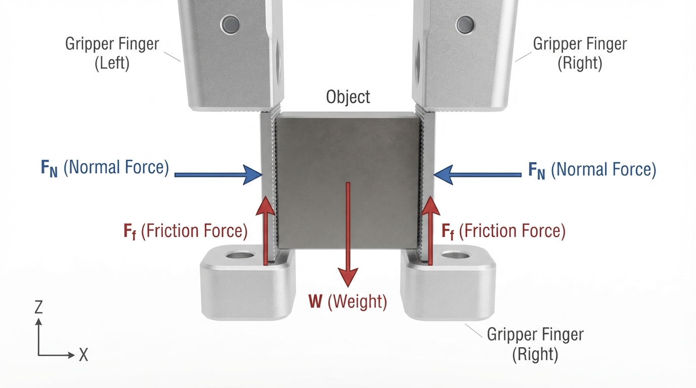
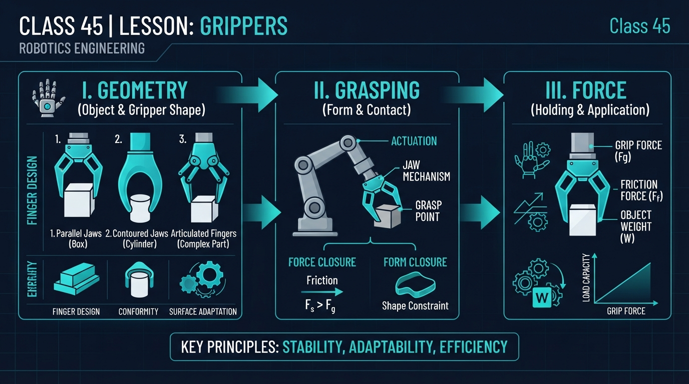
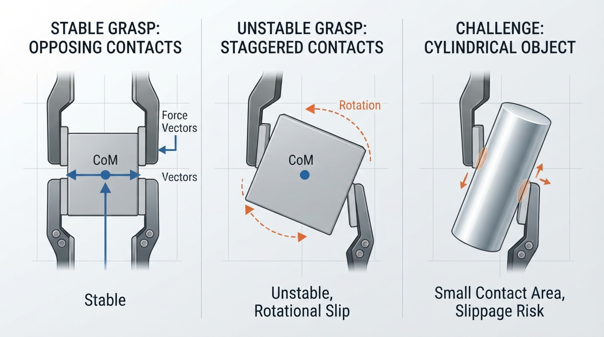
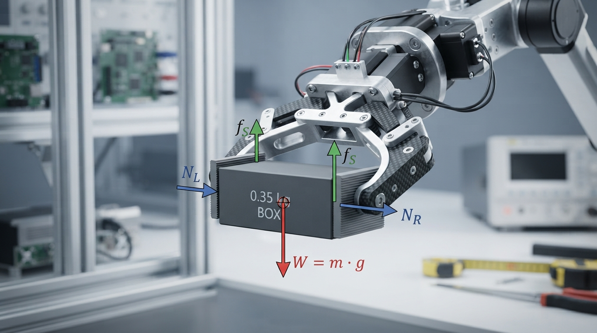
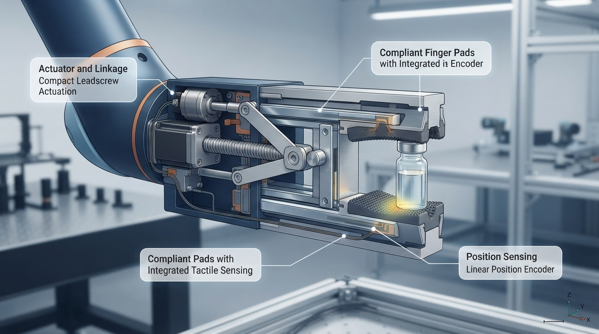

# Class 45: Grippers

## Where We Are in the Robotics Journey

RoboRover has learned how to use **inverse kinematics**: given a desired hand position, it can calculate joint angles that place its end-effector there.

But reaching an object is not the same as holding it.

A robot hand must answer three practical questions:

1. **Where should the fingers touch the object?**
2. **How much force should each finger apply?**
3. **Will the object stay still when the robot lifts or moves it?**

Today we study grippers through three connected ideas:

- **Force:** pushes and pulls that can hold, squeeze, or damage an object.
- **Geometry:** the shape, spacing, and direction of the fingers and object.
- **Grasping:** creating a stable contact arrangement so the object can be moved.

In the next class, **Dynamics**, we will study how forces and torques cause motion. Today we mostly decide whether a grasp is strong enough to hold an object; next class we will examine what happens when the robot accelerates, stops, or changes direction.

## Today We Will Learn

By the end of this class, you should be able to:

- explain how a two-finger gripper holds an object using normal force and friction;
- distinguish a squeezing force from the force needed to support an object;
- use object geometry to choose sensible contact locations;
- calculate a minimum approximate gripping force;
- identify practical failure modes such as slipping, crushing, misalignment, and actuator saturation;
- simulate whether RoboRover’s grasp is safe under simplified assumptions.

## 2-Minute Recap

In inverse kinematics, RoboRover started with a desired end-effector position and worked backward to find joint angles.

For example:

```text
desired gripper position
          ↓
     inverse kinematics
          ↓
       joint angles
          ↓
      arm movement
```

The gripper is attached to the end-effector. Inverse kinematics can place it beside a cup, block, or tool, but it does not automatically guarantee a successful grasp.

A useful mental model is:

> Inverse kinematics gets the hand to the object. Grasping makes the object stay with the hand.

## The Big Idea




**Figure:** Notice how inward squeezing creates contact, while friction acts upward to oppose the object’s weight.

Imagine holding a smooth book between your left and right hands.

Your hands squeeze inward. The book does not fall because friction acts upward along the book’s sides. If you squeeze too gently, it slides down. If you squeeze much too hard, you may bend or crush it.

A simple two-finger grasp looks like this:

```text
             upward friction
                    ↑
          ┌─────────────────┐
 left     │                 │     right
 finger → │     object      │ ← finger
          │                 │
          └─────────────────┘
                    ↑
             upward friction
```

The fingers apply **normal forces** horizontally into the object. The object’s weight pulls downward. Friction at the contact surfaces can act upward to oppose sliding.

The grasp succeeds only if the contact forces are:

- large enough to prevent slipping;
- applied in useful locations;
- directed appropriately;
- not so large that the object or gripper is damaged.

This is why grasping is more than “close the fingers.”

## See It in Your Head

### AI-Generated Engineering Visual · Professor OS



**How to read this visual:** Trace the signal or idea from left to right. Match each block to the lesson explanation, then predict what would change if one block produced a wrong value.




**Figure:** Contact placement and object shape can make the same squeezing force stable, twisting, or unreliable.

Picture RoboRover attempting to pick up a small rectangular box.

### Case A: Good geometry

The fingers contact opposite vertical faces near the middle of the box. Their contact lines are approximately level, and the gripper is centered around the box’s center of mass.

```text
       left jaw       right jaw
          │               │
          ▼               ▼
        ┌───────────────────┐
        │       box         │
        │        ●          │  ● = approximate center of mass
        └───────────────────┘
```

The inward forces oppose each other. Friction from both sides can support the box.

### Case B: Poor geometry

One finger touches near the top corner while the other touches near the bottom corner. The forces may twist the box.

```text
          ▼
        ┌───────────────┐
        │               │
        │               │
        └───────────────┘
                        ▲
```

Even if the total squeezing force is large, the grasp may rotate or let the object pivot out.

### Case C: Poor material match

A smooth plastic object may need more squeezing force than a rubber-coated object because the coefficient of friction is lower. The geometry is identical, but the contact surfaces behave differently.

An illustrator could show the same gripper holding three objects: a rubber block with a gentle grasp, a smooth metal cylinder with a stronger grasp, and a fragile foam cup with excessive-force damage marks.

## Core Concept

### 1. Normal force

A **normal force** acts perpendicular to a contact surface.

If a finger presses horizontally against the side of an object, the normal force points horizontally inward.

We commonly write the normal force as \(N\), measured in newtons (N).

### 2. Friction force

Friction acts along the contact surface and resists relative sliding.

A simplified model says the maximum static friction at one contact is:

\[
F_{\text{friction,max}} = \mu N
\]

where:

- \(F_{\text{friction,max}}\) is the maximum friction force, in newtons (N);
- \(\mu\) is the coefficient of friction, with no units;
- \(N\) is the normal force at that contact, in newtons (N).

A rubber pad might have a larger \(\mu\) against a surface than smooth plastic, but the actual value depends on materials, cleanliness, pressure, speed, and surface condition.

### 3. Weight

An object’s weight is the gravitational force acting downward:

\[
W = mg
\]

where:

- \(W\) is weight, in newtons (N);
- \(m\) is mass, in kilograms (kg);
- \(g\) is gravitational acceleration, approximately \(9.81\ \text{m/s}^2\) near Earth’s surface.

For a stationary lift, the upward friction from the fingers must be at least as large as the object’s weight. Engineers usually add a **safety factor** because real conditions are uncertain.

### 4. Geometry and contact placement

Geometry affects grasp stability in several ways:

- **Finger spacing:** The jaws must be able to reach both sides of the object.
- **Contact orientation:** Flat, opposed faces are easier to grip than angled or curved surfaces.
- **Centering:** A centered object usually creates less twisting.
- **Contact area:** Larger pads can distribute pressure and reduce local damage.
- **Clearance:** The fingers need room to approach without hitting nearby objects.

A grasp can fail even when its total force is sufficient if that force creates too much torque around the object.

## Math Without Fear

Suppose two opposing fingers hold an object. Each finger supplies normal force \(N\). If both contacts have the same friction coefficient \(\mu\), the total upward friction capacity is approximately:

\[
F_{\text{total}} = 2\mu N
\]

To avoid slipping during a gentle vertical lift:

\[
2\mu N \geq mg
\]

With a safety factor \(S\):

\[
2\mu N \geq Smg
\]

Solving for the required normal force per finger:

\[
N \geq \frac{Smg}{2\mu}
\]

The safety factor \(S\) has no units. It represents extra capacity for uncertainty, vibration, imperfect contact, and acceleration.

This is a simplified model. It assumes:

- both fingers share the load equally;
- the object does not rotate;
- friction behaves according to the simple model;
- the gripper remains aligned;
- the object is lifted slowly enough that acceleration is small.

These assumptions are useful for first estimates, not guarantees.

## Worked Robotics Example




**Figure:** The worked example compares the box’s weight with the total friction capacity from two finger contacts.

RoboRover must lift a box with:

- mass \(m = 0.35\ \text{kg}\);
- friction coefficient \(\mu = 0.60\);
- safety factor \(S = 2.0\);
- two identical opposing fingers.

First calculate the box’s weight:

\[
W = mg
\]

\[
W = (0.35\ \text{kg})(9.81\ \text{m/s}^2)
= 3.4335\ \text{N}
\]

The total friction capacity must be at least:

\[
S W = (2.0)(3.4335\ \text{N})
= 6.867\ \text{N}
\]

Each finger must provide approximately:

\[
N \geq \frac{6.867\ \text{N}}{2(0.60)}
= 5.7225\ \text{N}
\]

So RoboRover should target at least about:

\[
\boxed{5.72\ \text{N per finger}}
\]

under this simplified model.

### Interpretation

A setting of \(6.0\ \text{N}\) per finger would be slightly above the calculated minimum. The predicted total friction capacity would be:

\[
F_{\text{total}} = 2(0.60)(6.0\ \text{N})
= 7.2\ \text{N}
\]

That is greater than the safety-adjusted load of \(6.867\ \text{N}\).

However, this does not mean the grasp is guaranteed. The actual object might have dust on its surface, the two fingers might not share force equally, or RoboRover might accelerate while lifting. The calculation is a design estimate.

## Python Lab

This program calculates the required force per finger and plots the predicted safe and unsafe regions for different grip forces.

Before running it, predict:

> For a \(0.35\ \text{kg}\) object, \(\mu=0.60\), and safety factor \(2.0\), will \(5.0\ \text{N}\) per finger be enough? What about \(6.0\ \text{N}\)?

```python
import matplotlib.pyplot as plt

mass_kg = 0.35
gravity_m_s2 = 9.81
friction_coefficient = 0.60
safety_factor = 2.0

weight_n = mass_kg * gravity_m_s2
required_force_per_finger_n = (
    safety_factor * weight_n
    / (2.0 * friction_coefficient)
)

def predicted_safe(force_per_finger_n):
    total_friction_n = (
        2.0 * friction_coefficient * force_per_finger_n
    )
    required_load_n = safety_factor * weight_n
    return total_friction_n >= required_load_n

test_forces_n = [5.0, 6.0]
test_results = [predicted_safe(force) for force in test_forces_n]

print("Object weight: {:.4f} N".format(weight_n))
print(
    "Required force per finger: {:.4f} N".format(
        required_force_per_finger_n
    )
)

for force, safe in zip(test_forces_n, test_results):
    print(
        "{:.1f} N per finger -> {}".format(
            force,
            "predicted safe" if safe else "predicted slip"
        )
    )

assert abs(weight_n - 3.4335) < 1e-9
assert abs(required_force_per_finger_n - 5.7225) < 1e-9
assert test_results == [False, True]

forces_n = [force / 10.0 for force in range(0, 101)]
safe_values = [predicted_safe(force) for force in forces_n]

colors = ["tab:green" if safe else "tab:red" for safe in safe_values]

plt.figure(figsize=(8, 4))
plt.scatter(forces_n, safe_values, c=colors, s=18)
plt.axvline(
    required_force_per_finger_n,
    color="black",
    linestyle="--",
    label="calculated threshold"
)
plt.yticks([0, 1], ["predicted slip", "predicted safe"])
plt.xlabel("Normal force per finger (N)")
plt.ylabel("Simplified prediction")
plt.title("RoboRover's two-finger grasp estimate")
plt.grid(True, axis="x", alpha=0.3)
plt.legend()
plt.tight_layout()
plt.show()
```

### Important lines

- `weight_n = mass_kg * gravity_m_s2` calculates gravitational force.
- `predicted_safe()` compares available friction with the safety-adjusted load.
- The `assert` statements verify the exact numerical claims used by the program.
- The plot changes from predicted slip to predicted safe when the estimated threshold is crossed.

The graph is not measuring RoboRover. It is visualizing a mathematical model.

## Mini Simulation or Game

Change one parameter at a time and treat the program as a grasp-design game.

### Round 1: Increase the object mass

Change:

```python
mass_kg = 0.35
```

to:

```python
mass_kg = 0.50
```

Predict what happens before running the program. The object is heavier, so the required force per finger should increase.

### Round 2: Improve the finger pads

Change:

```python
friction_coefficient = 0.60
```

to:

```python
friction_coefficient = 0.90
```

Predict again. Better friction should reduce the required squeezing force.

### Round 3: Set a gripper limit

Add this line after the safety factor:

```python
maximum_gripper_force_n = 5.5
```

Then compare it with `required_force_per_finger_n`. If the required force is larger than the gripper’s limit, RoboRover should reject the lift rather than pretending the grasp is safe.

This is a simple example of an engineering decision:

> A robot should sometimes refuse a task when its available capability is below the estimated requirement.

## What Should Happen?

For the original values:

- \(m=0.35\ \text{kg}\);
- \(\mu=0.60\);
- \(S=2.0\);

the program verifies:

- object weight: \(3.4335\ \text{N}\);
- required force per finger: \(5.7225\ \text{N}\);
- \(5.0\ \text{N}\) per finger: predicted slip;
- \(6.0\ \text{N}\) per finger: predicted safe.

The word **predicted** matters. The model assumes equal load sharing and stable contact. It does not include every effect in a real gripper.

## Common Mistakes

### Mistake 1: Confusing total grip force with force per finger

If each finger applies \(6\ \text{N}\), the two-finger system applies \(12\ \text{N}\) of opposing normal force in total. But the friction calculation uses \(N=6\ \text{N}\) at each contact.

Always state whether a force is:

- per finger;
- total across all fingers;
- directed normal to the surface;
- directed along the surface.

### Mistake 2: Assuming more force is always better

Too much force can:

- crush soft packaging;
- deform a plastic container;
- damage a delicate sensor;
- stall or overheat an actuator;
- make the object harder to release.

A good gripper needs enough force, not the maximum possible force.

### Mistake 3: Ignoring torque

If the object’s center of mass is far from the contact region, its weight can create a turning effect. A grasp may slip or rotate even when a simple vertical friction calculation looks acceptable.

A rough torque relationship is:

\[
\tau = Fr
\]

where:

- \(\tau\) is torque, in newton-metres (N·m);
- \(F\) is force, in newtons (N);
- \(r\) is perpendicular distance, in metres (m).

This is a preview of Dynamics.

### Mistake 4: Treating motor command as fingertip force

A command such as “motor power = 60%” does not directly tell us the contact force. The result depends on gear ratio, linkage geometry, friction, battery voltage, motor speed, and mechanical stops.

A real gripper may need a force sensor, current-based estimation, or calibration test.

### Mistake 5: Forgetting compliance

A rigid finger touching an uneven object may contact at one tiny point. A compliant rubber pad can spread contact and tolerate small alignment errors.

Compliance helps, but it can also make the finger position less predictable.

## Try It Yourself

### Challenge: Design a safe lift

RoboRover must lift a \(0.20\ \text{kg}\) object. The finger pads have \(\mu=0.45\), and the desired safety factor is \(S=2.5\).

Calculate the minimum normal force per finger using:

\[
N \geq \frac{Smg}{2\mu}
\]

Then decide whether a gripper limited to \(6.0\ \text{N}\) per finger can perform the lift according to the simplified model.

Explain one reason your answer might be wrong on a real robot.

### Optional extension

Suppose one finger actually produces only 80% of the intended force because of uneven contact. Recalculate using:

- left finger force: \(N\);
- right finger force: \(0.8N\).

The total friction capacity becomes:

\[
F_{\text{total}} = \mu N + \mu(0.8N)
\]

Solve for the required intended force \(N\).

## Quick Quiz

1. What is the main role of normal force in a two-finger friction grasp?

2. A \(0.40\ \text{kg}\) object is held by two fingers. If the coefficient of friction increases while the finger forces stay the same, does the predicted friction capacity increase, decrease, or stay unchanged?

3. Why is placing contacts near the object’s center often helpful?

4. True or false: If a gripper can produce a large enough total squeezing force, its grasp is guaranteed to be stable.

## Answers

1. Normal force presses the fingers against the object’s surfaces, allowing friction to act along those surfaces and resist sliding.

2. It increases. In the simplified model, friction capacity is proportional to \(\mu N\).

3. Centered contacts usually reduce unwanted twisting and help the opposing forces balance around the object’s center of mass.

4. False. Geometry, torque, unequal force sharing, surface condition, deformation, and gripper alignment can still cause failure.

## Real Robot Connection




**Figure:** Real grippers combine geometry, compliant materials, sensing, and actuator limits rather than relying on motor commands alone.

A production gripper often combines several design features:

- **Finger geometry:** shaped surfaces that fit common object profiles;
- **High-friction pads:** materials that increase grip without requiring extreme force;
- **Compliance:** flexible joints or pads that tolerate alignment errors;
- **Force sensing:** measurements that help detect contact and regulate grip;
- **Position sensing:** confirmation that the fingers actually closed around an object;
- **Mechanical limits:** protection against over-closing or crushing;
- **Calibration:** tests connecting motor commands to actual fingertip forces.

RoboRover’s inverse-kinematics solution may place its gripper at the correct pose, but the grasp still depends on contact geometry. If the fingers arrive 5 millimetres too high, touch a sloped surface, or close around an unexpectedly thin object, the planned grasp may fail.

In the next class, **Dynamics**, we will connect force to motion. When RoboRover accelerates upward, stops suddenly, or carries an object away from its body, the required forces change. A grasp that is safe during a slow lift may slip during a fast movement.

## Vocabulary

- **Gripper:** A robot end-effector designed to hold, manipulate, or release objects.
- **Grasp:** A set of contacts and forces used to control or hold an object.
- **Normal force:** A contact force perpendicular to a surface.
- **Friction:** A force that resists relative sliding between contacting surfaces.
- **Coefficient of friction, \(\mu\):** A unitless model parameter describing how much friction may be produced for a given normal force.
- **Contact point:** The location where a finger, pad, or tool touches an object.
- **Center of mass:** A point representing the average location of an object’s mass for analyzing forces and motion.
- **Torque:** The turning effect of a force, commonly measured in newton-metres (N·m).
- **Compliance:** The ability of a mechanism or material to yield slightly under force.
- **Safety factor:** A multiplier used to provide extra capacity beyond an ideal calculated requirement.
- **Grasp stability:** The ability of a contact arrangement to prevent unwanted sliding, rotation, or escape of the object.
- **Actuator saturation:** A condition in which a motor or mechanism has reached its available limit and cannot provide more command or force.

## Further Learning

To deepen this topic, study these ideas in order:

1. static friction and normal force;
2. torque and lever arms;
3. compliant mechanisms;
4. force sensing and tactile sensing;
5. grasp stability and contact mechanics;
6. grasp planning for irregular objects.

Useful search terms include **robot gripper friction experiment**, **parallel jaw gripper design**, **robotic grasp force sensing**, and **compliant robotic fingers**.

## Next Class

In **Class 46: Dynamics**, RoboRover will learn how forces produce acceleration and how torques change rotational motion.

Today’s grasp calculation asked:

> Is the available contact force large enough to hold the object?

Next class asks:

> What forces and torques appear when the robot moves the object?

That connection will let RoboRover design motions that are not only geometrically reachable, but mechanically reasonable.
