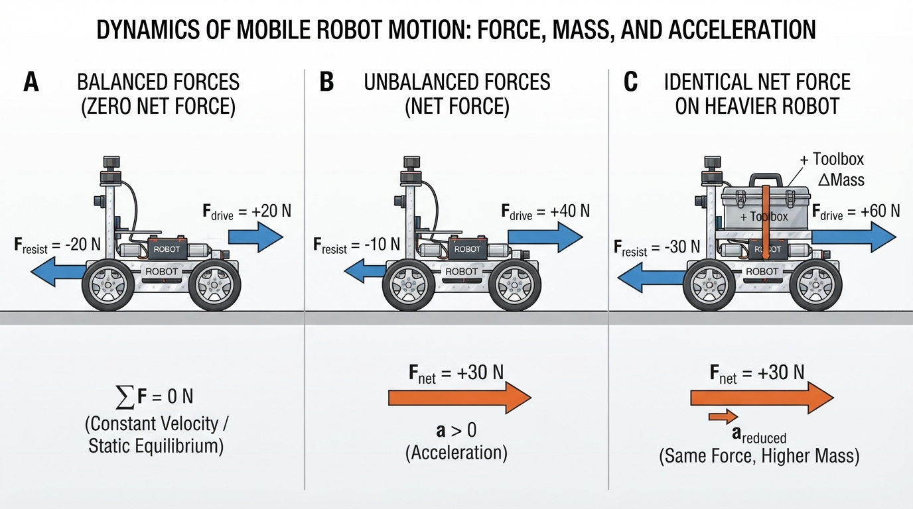
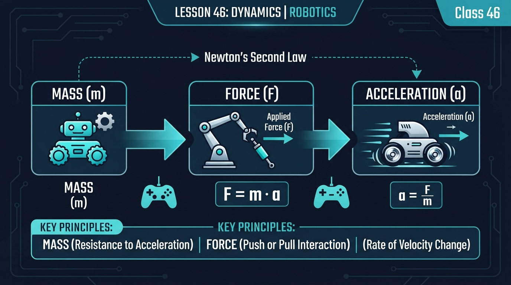
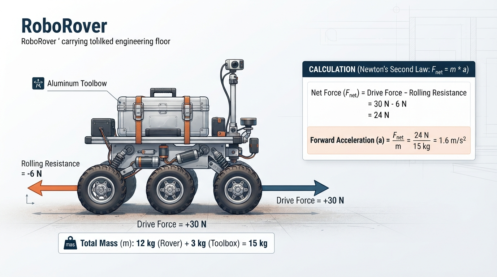
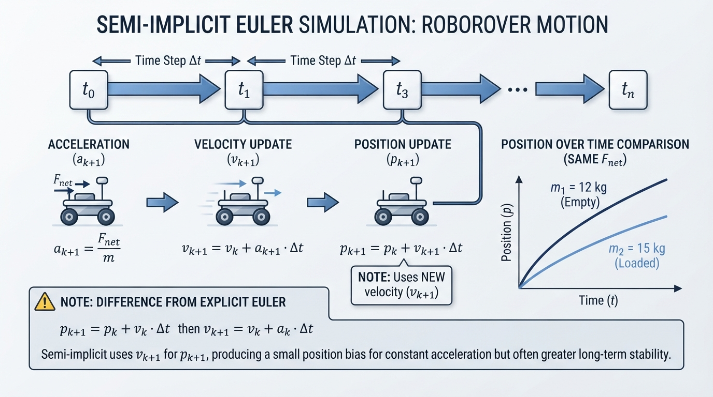

# Class 46: Dynamics

## Where We Are in the Robotics Journey

In the previous class, **Grippers**, RoboRover learned how a robot can hold, lift, and release objects. A gripper applies contact forces, and friction helps prevent a payload from falling.

Today we move from what RoboRover can hold to how its whole body moves while carrying it. A toolbox changes the force required to start, stop, or turn the rover. This introduces **dynamics**, the study of how forces and moments produce motion.

Dynamics has two closely related parts:

- **Translational dynamics:** motion of the robot’s center of mass from place to place.
- **Rotational dynamics:** changes in orientation caused by torque or moment.

This class focuses mainly on one-dimensional translational motion. Payload height, tipping, wheel loading, and turning will provide brief connections to rotational dynamics.

A useful checkpoint is to keep these quantities distinct:

- **Translational acceleration** changes the velocity of the center of mass.
- **Yaw rate** is the rate at which the robot rotates about its vertical axis.
- **Angular acceleration** is the rate of change of yaw rate.
- A lateral net force can create lateral acceleration and path curvature, but a change in heading also requires angular velocity and therefore appropriate torque, wheel-force distribution, or another kinematic constraint.

In the next class, **Trajectory Generation**, we will use these ideas to design a time-based motion:

- accelerate gently;
- travel at a chosen speed;
- slow down before reaching a target.

A trajectory must be physically achievable. Dynamics helps us ask, “Can RoboRover produce the force required to follow this motion?”

## Today We Will Learn

By the end of this class, you should be able to:

1. explain mass as resistance to changes in motion;
2. identify external forces acting on a robot;
3. calculate acceleration using Newton’s second law;
4. distinguish applied force from net force;
5. distinguish translational acceleration from angular acceleration and yaw rate;
6. predict how changing mass or force changes acceleration;
7. recognize practical limits such as friction, motor saturation, and changing payload;
8. compare a numerical position with the corresponding analytic position.

The main equation is:

\[
F_{\text{net}} = ma
\]

where:

- \(F_{\text{net}}\) is net force in newtons \((\text{N})\);
- \(m\) is mass in kilograms \((\text{kg})\);
- \(a\) is acceleration in meters per second squared \((\text{m/s}^2)\).

## 2-Minute Recap

A **gripper** applies forces to an object through its fingers or jaws. If the upward gripping force is too small, the object falls. If the force is too large, the object or gripper may be damaged.

Now imagine RoboRover carrying a toolbox:

- the wheels push backward on the ground;
- the ground pushes forward on the wheels;
- rolling resistance opposes motion;
- the toolbox adds mass;
- the motors must create enough wheel-ground force to accelerate both the rover and toolbox.

The forward force in RoboRover’s motion equation is the **external contact force of the ground on the wheels**. The wheels’ backward force on the ground is the equal-and-opposite interaction force, not the forward force acting on the robot.

The gripper has therefore changed the mechanical problem for the entire robot.

Before reading further, predict:

> If RoboRover carries twice as much mass but its motors produce the same net force, will its acceleration double, stay the same, or become smaller?

Write down your answer and your reason.

## The Big Idea



**Figure:** Compare balanced forces, unbalanced forces, and the effect of increasing mass while keeping net force the same.

Think of mass as **resistance to change in motion**.

A nearly empty shopping cart starts moving easily. A cart filled with books needs more force for the same change in speed. The books increase the total mass that must be accelerated.

A robot experiences many forces at once. Some support the intended motion, while others oppose it. Their vector total is the **net force**.

For a free-body diagram:

1. identify the object or system being analyzed;
2. choose a positive direction;
3. draw only external forces acting on that system;
4. do not draw internal actuator forces separately when analyzing the complete robot.

For the complete RoboRover-plus-toolbox system, wheel-ground traction is an external force. The wheels push backward on the ground, while the ground pushes forward on the wheels.

Gravity and the ground’s normal force are also external forces:

- gravity acts downward on the rover and toolbox;
- the ground’s normal force acts upward through the wheel contacts.

On level ground, these vertical forces often approximately cancel. They still belong in the complete force inventory.

```text
                         forward (+)
                              →
        ground-on-wheel traction → [ RoboRover + toolbox ]
                              ← rolling resistance

                         ↑ normal force
                         ↓ gravity
```

If the forward force is larger than the opposing force, RoboRover accelerates forward. If the forces balance, its velocity remains constant. If the opposing force is larger, its acceleration points backward; a rover already moving forward slows down.

The distinction is:

- **force:** an interaction that can change motion;
- **net force:** the vector total of external forces;
- **acceleration:** the rate at which velocity changes.

A lateral net force produces lateral acceleration of the center of mass. It can contribute to path curvature, but it does not by itself guarantee a change in the robot’s heading. Heading change requires yaw rate, which changes through angular acceleration produced by an appropriate net torque or by constraints such as wheel-ground contact and steering geometry.

### Free-Body-Diagram Check

Use the complete RoboRover-plus-toolbox system as your boundary. For forward motion on level ground, classify each interaction as an external or internal force:

- wheel-ground traction;
- gravity on the rover and toolbox;
- normal force from the ground;
- rolling resistance;
- motor torque inside the drivetrain;
- gripper contact with the toolbox.

Then answer:

1. Which forces belong on the free-body diagram?
2. Which force interactions are internal to the selected system?
3. Which horizontal forces remain in the simplified equation
   \[
   F_{\text{net}}=F_{\text{drive}}-F_{\text{resistance}}?
   \]

Pause here and record your answers before opening the explanation.

<details>
<summary>Check your classification</summary>

For the complete system:

| Interaction | Classification | Place in the complete-system free-body diagram? |
|---|---|---|
| Wheel-ground traction | External | Yes |
| Gravity on the rover and toolbox | External | Yes |
| Ground normal force | External | Yes |
| Rolling resistance | External | Yes |
| Motor torque inside the drivetrain | Internal | No, not as a separate force for the complete system |
| Gripper contact with the toolbox | Internal | No, because both gripper and toolbox are inside the selected system |

On level ground, gravity and normal force may approximately cancel vertically. The simplified horizontal model is therefore:

\[
F_{\text{net}}=F_{\text{drive}}-F_{\text{resistance}}.
\]

Rolling resistance and wheel-ground traction are both contact-related external effects in this simplified model. Separating them into a forward drive term and an opposing resistance term is a useful modeling choice; it does not mean that every physical contact effect is universally an independent force.

</details>

## See It in Your Head

### AI-Generated Engineering Visual · Professor OS



**How to read this visual:** Use the arrows and labels as a force-accounting diagram rather than tracing a signal. First locate the selected RoboRover-plus-toolbox boundary. Identify every external force, then check whether opposing horizontal arrows are subtracted to obtain the net force. Finally compare the light and loaded cases: the force may remain the same while mass and acceleration change. The system boundary should be read around the rover and toolbox; external traction acts at the wheel-ground contacts, whereas motor torque is an internal drivetrain interaction.

### Panel A: balanced forces

A forward arrow labeled \(20\ \text{N}\) and a backward arrow labeled \(20\ \text{N}\) are equal. These are individual external forces, not a \(20\ \text{N}\) net-force arrow.

\[
F_{\text{net}} = 20\ \text{N} - 20\ \text{N} = 0\ \text{N}
\]

The rover may be stationary or moving at constant velocity. Zero net force means zero acceleration, not necessarily zero velocity.

### Panel B: unbalanced forces

The forward arrow is \(30\ \text{N}\), and the backward arrow is \(10\ \text{N}\).

\[
F_{\text{net}} = 30\ \text{N} - 10\ \text{N} = 20\ \text{N}
\]

The rover accelerates forward.

### Panel C: heavier payload

The same \(20\ \text{N}\) net force acts on two rovers:

- one with mass \(10\ \text{kg}\);
- one with mass \(20\ \text{kg}\).

The heavier rover has the smaller acceleration. The force arrows can be identical while the motion differs because the masses differ.

> Same net force + more mass = less acceleration.

Equations in this lesson are followed by plain-language interpretations. For plots, read the slope as the rate of change and the final value as the ending state; do not rely on color alone to distinguish curves.

## Core Concept

### Mass

**Mass** measures how much an object resists acceleration. Its SI unit is the kilogram, \(\text{kg}\).

Mass is not the same as weight.

- Mass describes inertia, or resistance to changes in velocity.
- Weight is a gravitational force.

Near Earth’s surface:

\[
W = mg
\]

where \(W\) is weight in newtons, \(m\) is mass in kilograms, and \(g\) is approximately \(9.8\ \text{m/s}^2\).

A \(10\ \text{kg}\) toolbox has a mass of \(10\ \text{kg}\), while its approximate weight is:

\[
W = (10\ \text{kg})(9.8\ \text{m/s}^2)=98\ \text{N}
\]

For today’s ground-motion examples, mass is the quantity used in \(F=ma\).

### Force

A **force** is a push or pull with:

- magnitude, such as \(12\ \text{N}\);
- direction, such as forward, backward, upward, or sideways.

Robotics forces can come from:

- wheel-ground contact;
- gravity;
- rolling resistance or other friction;
- a gripper touching an object;
- a collision with an obstacle.

When the complete robot is the selected system, motor forces inside the robot are internal interactions. External wheel-ground contact changes the robot’s translational momentum.

The forward traction force is limited by available tire-ground friction. If the requested force is greater than the available traction, the wheels may slip. Rolling resistance is only one possible opposing force; air drag, bearing losses, braking forces, and slope-related forces can also matter.

### Acceleration

**Acceleration** is the rate of change of velocity. Its unit is \(\text{m/s}^2\).

An acceleration of \(2\ \text{m/s}^2\) means that, in an ideal constant-acceleration situation, velocity changes by \(2\ \text{m/s}\) every second.

Acceleration may be:

- positive in a chosen direction;
- negative, meaning opposite the chosen positive direction;
- sideways, changing the translational velocity and possibly contributing to path curvature;
- zero, even when the robot is moving.

A **yaw rate** describes how quickly the robot’s heading changes. An **angular acceleration** describes how quickly that yaw rate changes. These rotational quantities are different from the translational acceleration of the center of mass.

## Math Without Fear

Starting with:

\[
F_{\text{net}}=ma
\]

we can find acceleration:

\[
a=\frac{F_{\text{net}}}{m}
\]

Acceleration increases with net force and decreases with mass.

For straight-line motion, choose one direction as positive. Forces in that direction are positive, and forces opposite it are negative.

For example:

\[
F_{\text{net}}=F_{\text{drive}}-F_{\text{resistance}}
\]

In this lesson, **drive force** means the external forward wheel-ground traction force used in the one-dimensional model. After this definition, “drive force” and “wheel-ground traction force” refer to the same modeled quantity.

The units are consistent:

\[
\frac{\text{N}}{\text{kg}}
=
\frac{\text{kg}\cdot\text{m/s}^2}{\text{kg}}
=
\text{m/s}^2
\]

## Worked Robotics Example



**Figure:** The worked example subtracts resistance from drive force before dividing by the combined rover-and-payload mass.

Model assumptions:

- the rover moves in one dimension on level ground;
- the wheels do not slip;
- the rover and payload are treated as one rigidly attached system;
- drive force and resistance remain constant;
- vertical forces approximately cancel.

RoboRover has a mass of \(12\ \text{kg}\), including its battery and empty gripper. It picks up a toolbox with mass \(3\ \text{kg}\).

The combined mass is:

\[
m = 12\ \text{kg}+3\ \text{kg}=15\ \text{kg}
\]

Suppose the **wheel-ground drive force** is \(30\ \text{N}\), while rolling resistance opposes motion with \(6\ \text{N}\).

\[
F_{\text{net}}=30\ \text{N}-6\ \text{N}=24\ \text{N}
\]

Now calculate acceleration:

\[
a=\frac{F_{\text{net}}}{m}
=\frac{24\ \text{N}}{15\ \text{kg}}
=1.6\ \text{m/s}^2
\]

Therefore:

\[
\boxed{1.6\ \text{m/s}^2\text{ forward}}
\]

This does not mean the rover instantly reaches \(1.6\ \text{m/s}\). It means its velocity changes by \(1.6\ \text{m/s}\) each second while the model remains valid.

If the rover begins at rest and the force remains constant for \(2\ \text{s}\):

\[
v = v_0+at
\]

\[
v=(0\ \text{m/s})+(1.6\ \text{m/s}^2)(2\ \text{s})
=3.2\ \text{m/s}
\]

This is an ideal result. A real rover may produce less force as motor speed rises, slip at the wheels, or reach a software speed limit.

Without the toolbox, the rover’s mass is \(12\ \text{kg}\). If the net force remains \(24\ \text{N}\):

\[
a=\frac{24\ \text{N}}{12\ \text{kg}}=2.0\ \text{m/s}^2
\]

The payload reduces acceleration from \(2.0\ \text{m/s}^2\) to \(1.6\ \text{m/s}^2\).

## Python Lab



**Figure:** The simulation repeatedly updates velocity and position using acceleration calculated from net force and mass.

### Roadmap

There are two levels in this lab:

- **Beginner objective:** compare acceleration, velocity, and position for a light and loaded rover.
- **Advanced objective:** examine numerical integration and the effect of the time step.

Run the program and interpret the curves before studying the derivation. You do not need to memorize every function.

### Beginner path

Begin with this sequence:

1. run the program without changing it;
2. read the printed accelerations and final velocities;
3. inspect which position curve is higher;
4. explain why the lighter rover has greater acceleration under the same net force;
5. repeat the run after changing `dt_s`.

The program plots both position and velocity. Read the position plot by its final value and the velocity plot by its slope and final value. Use the labels and printed values as well as line appearance.

### Software prerequisites

You need:

- Python 3.7 or later;
- the `matplotlib` plotting library.

To install Matplotlib in a typical local environment:

```bash
python -m pip install matplotlib
```

If your system uses a separate Python 3 command:

```bash
python3 -m pip install matplotlib
```

This program simulates one-dimensional motion using small time steps. It compares RoboRover with and without the toolbox.

The simulation uses a **semi-implicit Euler update**:

1. calculate acceleration from net force and mass;
2. update velocity;
3. update position using the new velocity;
4. repeat.

Semi-implicit Euler is often preferred for some mechanical simulations because its stability properties can be useful, especially over many steps. It is not universally superior; the appropriate integrator depends on the model and accuracy requirements.

### Prediction checkpoint: why does the position become 4.02 m?

For the \(12\ \text{kg}\) rover:

\[
a=\frac{24\ \text{N}}{12\ \text{kg}}=2.0\ \text{m/s}^2
\]

The exact constant-acceleration position from rest after \(2\ \text{s}\) is:

\[
x_{\text{analytic}}=\frac{1}{2}aT^2
=\frac{1}{2}(2.0)(2.0)^2
=4.00\ \text{m}
\]

With `dt_s = 0.01`, the semi-implicit update uses the newly updated velocity for each position update. For this constant-acceleration case, that produces:

\[
x_{\text{semi-implicit}}
=4.00\ \text{m}
+\frac{1}{2}aT\Delta t
=4.02\ \text{m}
\]

This is a numerical-method effect, not extra physical force. Reducing \(\Delta t\) reduces this particular position difference.

The velocity is exact for this constant-acceleration model. The position is an approximation.

The program also supports a duration that is not an exact multiple of `dt_s`. It takes full steps and then one shorter partial step. The verification function uses the same semi-implicit update rule for that final interval.

### Numerical experiment: change `dt_s`

Before running the experiment, predict what will happen to the light rover’s final position when `dt_s` changes.

1. Run the program with `dt_s = 0.01`.
2. Record the numerical and analytic light-rover positions.
3. Change `dt_s` to `0.1`.
4. Run the program again.
5. Change `dt_s` to `0.001`.
6. Compare all three numerical positions with the analytic value of \(4.00\ \text{m}\).

For this particular method and constant-acceleration case:

- a larger time step produces a larger position bias;
- a smaller time step produces a smaller position bias;
- the analytic position does not change;
- the simulated final time still equals the requested duration.

This experiment connects discretization error to the plotted result.

The complete program below also checks zero duration, a duration shorter than one time step, and a non-integer duration.

<details>
<summary>Complete Python program</summary>

```python
import math
import matplotlib.pyplot as plt


def simulate(mass_kg, net_force_n, duration_s, dt_s):
    """Simulate constant-force motion from rest using semi-implicit Euler."""
    if mass_kg <= 0.0:
        raise ValueError("mass_kg must be positive")
    if duration_s < 0.0:
        raise ValueError("duration_s must be nonnegative")
    if dt_s <= 0.0:
        raise ValueError("dt_s must be positive")

    times = [0.0]
    positions = [0.0]
    velocities = [0.0]

    position_m = 0.0
    velocity_m_s = 0.0
    acceleration_m_s2 = net_force_n / mass_kg

    full_steps = int(math.floor(duration_s / dt_s + 1e-12))
    remainder_s = duration_s - full_steps * dt_s
    tolerance_s = 1e-12 * max(1.0, duration_s, dt_s)

    step_durations = [dt_s] * full_steps
    if remainder_s > tolerance_s:
        step_durations.append(remainder_s)

    for step_duration_s in step_durations:
        velocity_m_s += acceleration_m_s2 * step_duration_s
        position_m += velocity_m_s * step_duration_s

        next_time_s = times[-1] + step_duration_s
        if abs(next_time_s - duration_s) <= tolerance_s:
            next_time_s = duration_s

        times.append(next_time_s)
        positions.append(position_m)
        velocities.append(velocity_m_s)

    return times, positions, velocities, acceleration_m_s2


def analytic_position(acceleration_m_s2, time_s):
    """Position from rest under constant acceleration."""
    return 0.5 * acceleration_m_s2 * time_s ** 2


def semi_implicit_position_from_rest(acceleration_m_s2, duration_s, dt_s):
    """Expected semi-implicit position, including a possible final partial step."""
    full_steps = int(math.floor(duration_s / dt_s + 1e-12))
    remainder_s = duration_s - full_steps * dt_s

    full_step_position = (
        0.5
        * acceleration_m_s2
        * dt_s ** 2
        * full_steps
        * (full_steps + 1)
    )

    # After the full steps, velocity is a * full_steps * dt_s.
    # Semi-implicit Euler updates velocity for the remainder first,
    # then uses that updated velocity for the position update.
    partial_step_position = (
        acceleration_m_s2
        * full_steps
        * dt_s
        * remainder_s
        + acceleration_m_s2 * remainder_s ** 2
    )

    return full_step_position + partial_step_position


def verify_constant_force_case(
    result,
    mass_kg,
    net_force_n,
    duration_s,
    dt_s
):
    """Verify results using expectations derived from the current parameters."""
    times, positions, velocities, acceleration_m_s2 = result

    expected_acceleration = net_force_n / mass_kg
    expected_velocity = expected_acceleration * duration_s
    expected_analytic_position = analytic_position(
        expected_acceleration, duration_s
    )
    expected_semi_implicit_position = semi_implicit_position_from_rest(
        expected_acceleration, duration_s, dt_s
    )

    assert math.isclose(
        times[-1],
        duration_s,
        rel_tol=0.0,
        abs_tol=1e-12
    )
    assert math.isclose(
        acceleration_m_s2,
        expected_acceleration,
        rel_tol=0.0,
        abs_tol=1e-12
    )
    assert math.isclose(
        velocities[-1],
        expected_velocity,
        rel_tol=0.0,
        abs_tol=1e-12
    )
    assert math.isclose(
        positions[-1],
        expected_semi_implicit_position,
        rel_tol=0.0,
        abs_tol=1e-12
    )
    assert math.isclose(
        analytic_position(acceleration_m_s2, times[-1]),
        expected_analytic_position,
        rel_tol=0.0,
        abs_tol=1e-12
    )


def run_edge_case_tests():
    """Test zero duration and durations shorter than one time step."""
    mass_kg = 15.0
    net_force_n = 24.0
    dt_s = 0.01

    zero_duration = simulate(
        mass_kg, net_force_n, 0.0, dt_s
    )
    verify_constant_force_case(
        zero_duration,
        mass_kg,
        net_force_n,
        0.0,
        dt_s
    )
    assert zero_duration[0] == [0.0]
    assert zero_duration[1] == [0.0]
    assert zero_duration[2] == [0.0]

    short_duration_s = 0.005
    shorter_than_step = simulate(
        mass_kg, net_force_n, short_duration_s, dt_s
    )
    verify_constant_force_case(
        shorter_than_step,
        mass_kg,
        net_force_n,
        short_duration_s,
        dt_s
    )
    assert len(shorter_than_step[0]) == 2
    assert math.isclose(
        shorter_than_step[0][-1],
        short_duration_s,
        rel_tol=0.0,
        abs_tol=1e-12
    )


def main():
    net_force_n = 24.0
    loaded_net_force_n = 24.0
    duration_s = 2.0
    dt_s = 0.01

    light_mass_kg = 12.0
    loaded_mass_kg = 15.0

    light = simulate(
        light_mass_kg, net_force_n, duration_s, dt_s
    )
    loaded = simulate(
        loaded_mass_kg, loaded_net_force_n, duration_s, dt_s
    )

    light_times, light_positions, light_velocities, light_acceleration = light
    loaded_times, loaded_positions, loaded_velocities, loaded_acceleration = loaded

    light_analytic_position = analytic_position(
        light_acceleration, duration_s
    )
    loaded_analytic_position = analytic_position(
        loaded_acceleration, duration_s
    )

    verify_constant_force_case(
        light,
        light_mass_kg,
        net_force_n,
        duration_s,
        dt_s
    )
    verify_constant_force_case(
        loaded,
        loaded_mass_kg,
        loaded_net_force_n,
        duration_s,
        dt_s
    )

    # Verify the exact baseline values reported below.
    assert math.isclose(
        light_acceleration, 2.0, rel_tol=0.0, abs_tol=1e-12
    )
    assert math.isclose(
        loaded_acceleration, 1.6, rel_tol=0.0, abs_tol=1e-12
    )
    assert math.isclose(
        light_velocities[-1], 4.0, rel_tol=0.0, abs_tol=1e-12
    )
    assert math.isclose(
        loaded_velocities[-1], 3.2, rel_tol=0.0, abs_tol=1e-12
    )
    assert math.isclose(
        light_positions[-1], 4.02, rel_tol=0.0, abs_tol=1e-12
    )
    assert math.isclose(
        loaded_positions[-1], 3.216, rel_tol=0.0, abs_tol=1e-12
    )
    assert math.isclose(
        light_analytic_position, 4.0, rel_tol=0.0, abs_tol=1e-12
    )
    assert math.isclose(
        loaded_analytic_position, 3.2, rel_tol=0.0, abs_tol=1e-12
    )

    # Explicitly verify a non-integer duration, zero duration,
    # and a duration shorter than one time step.
    non_integer_duration_s = 2.005
    non_integer_case = simulate(
        loaded_mass_kg,
        loaded_net_force_n,
        non_integer_duration_s,
        dt_s
    )
    verify_constant_force_case(
        non_integer_case,
        loaded_mass_kg,
        loaded_net_force_n,
        non_integer_duration_s,
        dt_s
    )
    run_edge_case_tests()

    print("Light rover acceleration: {:.1f} m/s^2".format(
        light_acceleration
    ))
    print("Loaded rover acceleration: {:.1f} m/s^2".format(
        loaded_acceleration
    ))
    print("Light rover final velocity: {:.1f} m/s".format(
        light_velocities[-1]
    ))
    print("Loaded rover final velocity: {:.1f} m/s".format(
        loaded_velocities[-1]
    ))
    print("Light rover numerical position: {:.3f} m".format(
        light_positions[-1]
    ))
    print("Light rover analytic position: {:.3f} m".format(
        light_analytic_position
    ))
    print("Loaded rover numerical position: {:.3f} m".format(
        loaded_positions[-1]
    ))
    print("Loaded rover analytic position: {:.3f} m".format(
        loaded_analytic_position
    ))
    print("Verified non-integer, zero-duration, and short-duration cases.")
    print("All verification assertions passed.")

    figure, axes = plt.subplots(2, 1, sharex=True)

    axes[0].plot(light_times, light_positions, label="12 kg rover")
    axes[0].plot(
        loaded_times,
        loaded_positions,
        label="15 kg rover with toolbox"
    )
    axes[0].set_ylabel("Position (m)")
    axes[0].set_title("RoboRover: same net force, different mass")
    axes[0].legend()
    axes[0].grid(True)

    axes[1].plot(light_times, light_velocities, label="12 kg rover")
    axes[1].plot(
        loaded_times,
        loaded_velocities,
        label="15 kg rover with toolbox"
    )
    axes[1].set_xlabel("Time (s)")
    axes[1].set_ylabel("Velocity (m/s)")
    axes[1].legend()
    axes[1].grid(True)

    figure.tight_layout()
    plt.show()


if __name__ == "__main__":
    main()
```

</details>

The line

```text
acceleration_m_s2 = net_force_n / mass_kg
```

implements \(a=F_{\text{net}}/m\).

The velocity update is:

```text
velocity_m_s += acceleration_m_s2 * step_duration_s
```

The position update is:

```text
position_m += velocity_m_s * step_duration_s
```

Because position uses the newly updated velocity, this is semi-implicit Euler rather than explicit Euler.

With `duration_s = 2.0` and `dt_s = 0.01`, the baseline numerical positions are \(4.02\ \text{m}\) for the \(12\ \text{kg}\) rover and \(3.216\ \text{m}\) for the \(15\ \text{kg}\) rover. The corresponding analytic positions are \(4.00\ \text{m}\) and \(3.20\ \text{m}\). The assertions in `main()` verify each of these reported values.

## Mini Simulation or Game

### The Payload Challenge

Run the program and predict the graph before viewing it.

1. Which rover’s position curve should be higher after \(2\ \text{s}\)?
2. Which rover should have the steeper velocity increase?
3. What happens if you change the loaded rover’s mass from \(15.0\ \text{kg}\) to \(24.0\ \text{kg}\)?
4. What happens if you change the net force from \(24.0\ \text{N}\) to \(12.0\ \text{N}\)?

The lighter rover has greater acceleration because both rovers receive the same net force, but the lighter rover has less mass.

For constant force, starting from rest:

\[
v(t)=\frac{F_{\text{net}}}{m}t.
\]

A rover reaches target speed \(v_{\text{target}}\) within time \(T\) when:

\[
\frac{F_{\text{net}}}{m}T \geq v_{\text{target}}.
\]

For a \(3.0\ \text{m/s}\) target at \(T=2\ \text{s}\):

- the \(12\ \text{kg}\) rover reaches \(4.0\ \text{m/s}\);
- the \(15\ \text{kg}\) rover reaches \(3.2\ \text{m/s}\);
- a \(24\ \text{kg}\) rover reaches \(2.0\ \text{m/s}\);
- with \(12\ \text{N}\) and \(15\ \text{kg}\), the rover reaches \(1.6\ \text{m/s}\).

Turn the activity into a game:

- choose a target final velocity;
- change the mass or net force;
- predict whether RoboRover reaches the target within \(2\ \text{s}\);
- run the program and compare your prediction.

## What Should Happen?

Before running the code, predict:

- the \(12\ \text{kg}\) rover accelerates at \(2.0\ \text{m/s}^2\);
- the \(15\ \text{kg}\) rover accelerates at \(1.6\ \text{m/s}^2\);
- their ideal final velocities after \(2\ \text{s}\) are \(4.0\ \text{m/s}\) and \(3.2\ \text{m/s}\);
- the lighter rover’s position curve rises more quickly.

For the baseline parameters, the program confirms:

- both accelerations;
- both final velocities;
- the semi-implicit numerical positions;
- the corresponding analytic positions.

The plotted final positions are \(4.02\ \text{m}\) and \(3.216\ \text{m}\), slightly above the analytic values \(4.00\ \text{m}\) and \(3.20\ \text{m}\) for this time step. The code assertions verify these exact baseline values.

A useful experiment is to double both force and mass:

\[
a=\frac{48\ \text{N}}{24\ \text{kg}}=2.0\ \text{m/s}^2
\]

The acceleration is unchanged because both numerator and denominator doubled.

## Common Mistakes

### Mistake 1: confusing force with net force

If the forward wheel-ground force is \(30\ \text{N}\) and resistance is \(6\ \text{N}\), the net force is \(24\ \text{N}\), not \(30\ \text{N}\).

### Mistake 2: thinking zero force means zero velocity

A rover moving at constant velocity has zero acceleration and therefore zero net force in the ideal model. It can still be moving.

### Mistake 3: treating mass and weight as interchangeable

Mass is measured in kilograms. Weight is a force measured in newtons. Near Earth, they are related by \(W=mg\), but they are not the same quantity.

### Mistake 4: forgetting direction

A \(10\ \text{N}\) forward force and a \(10\ \text{N}\) backward force cancel. They do not produce \(20\ \text{N}\) of net force.

### Mistake 5: treating lateral force as automatic heading change

A lateral net force changes the translational velocity of the center of mass. Heading changes require yaw rate and angular acceleration, which depend on torque, force distribution, steering geometry, or other constraints.

### Engineering caveat: force is not always constant

Real motors do not provide unlimited force. Available force can decrease at higher speed. Tires can slip if requested force exceeds available tire-ground friction. Battery voltage, gearing, software limits, and floor conditions can also change acceleration.

The one-dimensional model does not include every effect. A more complete model may include rolling resistance, aerodynamic drag, slope angle, wheel torque, wheel slip, changing normal forces, body rotation, and payload placement.

The simple equation is still useful because it identifies the dominant relationship among force, mass, and acceleration. Engineers measure where the model stops matching the robot.

## Try It Yourself

### Challenge: deliver the toolbox gently

The Python program has parameter variables near the start of `main()`:

```python
loaded_net_force_n = 24.0
loaded_mass_kg = 15.0
```

Modify only `loaded_net_force_n` so the loaded RoboRover uses a net force of \(15\ \text{N}\). Leave the light-rover parameters unchanged.

The verification function calculates expected results from the current mass, force, duration, and time step. Changing `loaded_net_force_n` should therefore not require unrelated assertions to be removed.

1. Calculate the loaded rover’s acceleration by hand.
2. Predict its velocity after \(2\ \text{s}\), starting from rest.
3. Change `loaded_net_force_n` to `15.0`.
4. Run the program and confirm that the assertions pass.
5. Inspect the new graph.

The expected acceleration is:

\[
a=\frac{15\ \text{N}}{15\ \text{kg}}=1.0\ \text{m/s}^2
\]

The expected velocity after \(2\ \text{s}\) is:

\[
v=at=(1.0\ \text{m/s}^2)(2\ \text{s})=2.0\ \text{m/s}.
\]

With \(dt=0.01\ \text{s}\), the semi-implicit numerical position is:

\[
x_{\text{semi-implicit}}
=\frac{1}{2}(1.0)(2.0)^2
+\frac{1}{2}(1.0)(2.0)(0.01)
=2.01\ \text{m}.
\]

The analytic position is \(2.00\ \text{m}\).

> **Simulation-only warning:** The following braking extension uses a discontinuous, commanded net-force model. It does not validate tire traction, actuator limits, motor dynamics, controller response, stopping distance, payload stability, or collision risk. Its numerical result is for simulation and learning only; do not transfer the commanded force or stopping behavior directly to hardware.

**Optional extension:** Add a braking force after \(1\ \text{s}\). Apply a backward net force of \(-10\ \text{N}\) while RoboRover is moving forward. For a \(15\ \text{kg}\) rover:

\[
a=\frac{-10\ \text{N}}{15\ \text{kg}}
\approx -0.667\ \text{m/s}^2.
\]

Velocity remains positive at first, but decreases. The rover reverses direction only if the simulated velocity later becomes negative.

A correct braking extension should:

- use negative acceleration during braking;
- show velocity decreasing while it remains positive;
- split any time step that crosses the \(1.0\ \text{s}\) force-switch boundary;
- update position using the velocity produced by the selected integration method.

```python
mass_kg = 15.0
duration_s = 2.0
dt_s = 0.01
switch_time_s = 1.0
times = [0.0]
position_m = 0.0
velocity_m_s = 0.0
positions_m = [position_m]
velocities_m_s = [velocity_m_s]

while times[-1] < duration_s:
    current_time_s = times[-1]
    step_duration_s = min(dt_s, duration_s - current_time_s)

    # Split a step if it would cross the force-switch boundary.
    time_to_switch_s = switch_time_s - current_time_s
    if current_time_s < switch_time_s and time_to_switch_s < step_duration_s:
        step_duration_s = time_to_switch_s

    if current_time_s < switch_time_s:
        current_force_n = 15.0
    else:
        current_force_n = -10.0

    current_acceleration_m_s2 = current_force_n / mass_kg
    velocity_m_s += current_acceleration_m_s2 * step_duration_s
    position_m += velocity_m_s * step_duration_s

    times.append(current_time_s + step_duration_s)
    positions_m.append(position_m)
    velocities_m_s.append(velocity_m_s)

assert abs(times[-1] - duration_s) <= 1e-12
assert velocities_m_s[100] > 0.0
assert velocities_m_s[-1] < velocities_m_s[100]

print("Final time: {:.2f} s".format(times[-1]))
print("Final position: {:.3f} m".format(position_m))
print("Final velocity: {:.3f} m/s".format(velocity_m_s))
print("Braking simulation checks passed.")
```

Do not yet build a full trajectory planner. The goal is to practice how force changes velocity.

If you connect the extension to a physical rover, test only in a clear area at low speed. Secure the payload, or remove it during initial braking tests, and keep people, obstacles, and loose equipment away from the test path.

## Quick Quiz

1. RoboRover has a net force of \(18\ \text{N}\) and a mass of \(6\ \text{kg}\). What is its acceleration?

2. Two robots experience the same net force. Robot A has half the mass of Robot B. Which robot has the greater acceleration?

3. A rover moves forward at constant velocity on a level floor. In the ideal model, what is its net force?

4. The wheel-ground traction force is \(25\ \text{N}\) forward while resistance is \(9\ \text{N}\) backward. What net force acts on the rover?

## Answers

1.  
\[
a=\frac{18\ \text{N}}{6\ \text{kg}}=3\ \text{m/s}^2
\]

The acceleration is \(3\ \text{m/s}^2\) forward.

2. Robot A has the greater acceleration. Since \(a=F_{\text{net}}/m\), halving mass while keeping force constant doubles acceleration.

3. The net force is \(0\ \text{N}\). Constant velocity means zero acceleration in the ideal model.

4.  
\[
F_{\text{net}}=25\ \text{N}-9\ \text{N}=16\ \text{N}
\]

The net force is \(16\ \text{N}\) forward.

## Real Robot Connection

When RoboRover picked up the toolbox, its total mass increased. That affects:

- how quickly it can start;
- how much wheel force is required;
- how much braking force is needed;
- how the gripper and chassis are loaded;
- how carefully it must handle fragile objects.

Increased payload mass does not automatically determine stopping distance. The result depends on the braking-force or braking-command assumption. If available braking force is held comparable, the heavier rover has less deceleration and generally requires more stopping distance. A controller might instead increase braking force, subject to traction and actuator limits.

Payload **mass** and payload **location** affect different aspects of motion:

- mass changes translational inertia;
- payload height and offset affect tipping risk;
- payload location changes normal-force distribution across the wheels;
- an offset payload changes moments and rotational dynamics during turning or braking.

A simple moment relation is:

\[
\tau = Fd_\perp
\]

where \(\tau\) is torque, \(F\) is force, and \(d_\perp\) is the perpendicular distance from the chosen rotation axis to the force’s line of action. A higher or more offset payload can increase the moment associated with a disturbance or acceleration, so payload geometry matters in addition to payload mass.

A controller may command the same motor input before and after pickup, but the resulting acceleration can differ. This is why robots need calibration and testing under realistic payloads.

In the next class, Trajectory Generation, we will turn desired motion into a time history:

- position at each time;
- velocity at each time;
- acceleration at each time.

Dynamics provides a reality check. A trajectory demanding high acceleration may require more force than the motors, wheels, or structure can safely produce.

## Vocabulary

- **Dynamics:** The study of how forces and moments produce motion.
- **Translational dynamics:** The study of forces that change an object’s position or velocity.
- **Rotational dynamics:** The study of moments or torques that change an object’s angular motion.
- **Mass:** A measure of resistance to acceleration, measured in kilograms \((\text{kg})\).
- **Force:** A push or pull with magnitude and direction, measured in newtons \((\text{N})\).
- **Net force:** The vector sum of all external forces acting on an object.
- **Acceleration:** The rate of change of velocity, measured in meters per second squared \((\text{m/s}^2)\).
- **Yaw rate:** The rate at which a robot’s heading changes, usually measured about its vertical axis.
- **Angular acceleration:** The rate of change of angular velocity or yaw rate.
- **Inertia:** The tendency of an object to resist changes in its velocity.
- **Resistance force:** A force opposing intended motion, such as rolling resistance, drag, or braking force.
- **Payload:** An object carried or manipulated by a robot.
- **Euler update:** A numerical method that estimates the next state using a rate of change and a small time step. The Python lab uses the semi-implicit form, updating velocity before position.
- **Actuator saturation:** A condition in which a motor or actuator has reached its maximum available output and cannot provide more commanded force.

## Further Learning

To deepen this topic, investigate these subjects in sequence:

1. free-body diagrams for mobile robots;
2. friction and wheel traction;
3. torque and rotational acceleration;
4. motor force-speed behavior;
5. acceleration limits in trajectory generation.

For your own study, search for educational resources using terms such as **Newton’s laws robotics**, **mobile robot free-body diagram**, and **motor torque force relationship**. Check whether a source uses a simplified model or includes friction, wheel slip, and actuator limits.

## Next Class

In **Class 47: Trajectory Generation**, RoboRover will plan motion over time rather than simply asking, “How much acceleration results from this force?”

We will connect position, velocity, and acceleration into a physically meaningful motion profile. The toolbox will return because a trajectory that works for an empty RoboRover may be too aggressive when the gripper is carrying a payload.